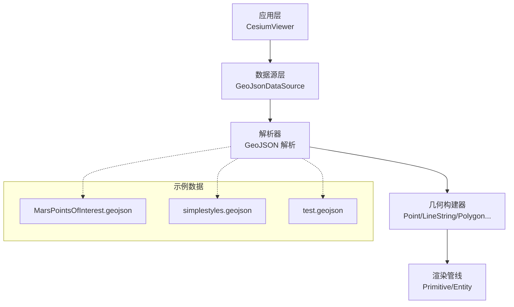
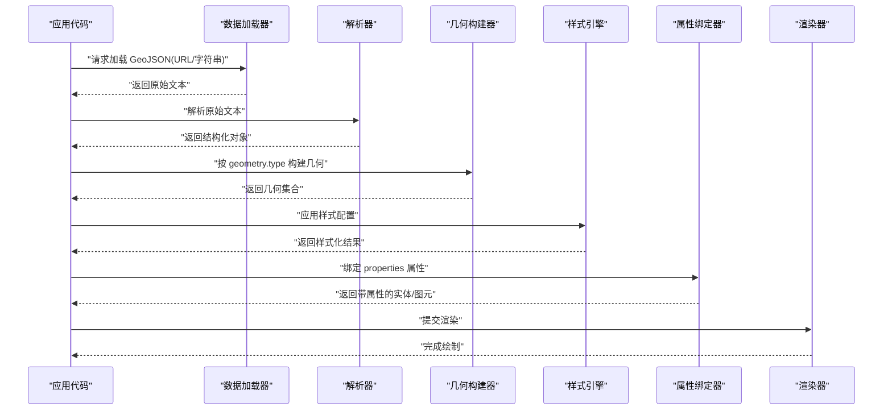
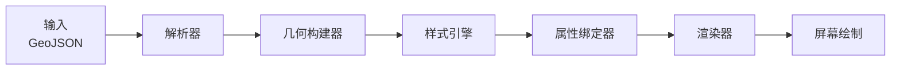

# GeoJsonDataSource

<cite>
**本文引用的文件**   
- [MarsPointsOfInterest.geojson](file://Apps/SampleData/MarsPointsOfInterest.geojson)
- [simplestyles.geojson](file://Apps/SampleData/simplestyles.geojson)
- [test.geojson](file://Specs/Data/test.geojson)
</cite>

## 目录
1. [简介](#简介)
2. [项目结构](#项目结构)
3. [核心组件](#核心组件)
4. [架构总览](#架构总览)
5. [详细组件分析](#详细组件分析)
6. [依赖关系分析](#依赖关系分析)
7. [性能考虑](#性能考虑)
8. [故障排查指南](#故障排查指南)
9. [结论](#结论)
10. [附录](#附录) 

## 简介
本文件为 GeoJsonDataSource 的完整 API 文档，聚焦于 GeoJSON 格式数据的加载、解析与渲染能力。内容涵盖：
- 几何类型支持：点、线、面、多点、多线、多面等
- 样式配置：颜色、透明度、线宽、填充模式等视觉属性
- 属性数据绑定与处理：静态与动态属性的使用方式
- 复杂数据处理技巧与性能优化建议
- 错误处理与兼容性注意事项

说明：本仓库未包含 GeoJsonDataSource 的具体实现源码，因此本文档基于仓库中提供的 GeoJSON 示例数据与通用 GIS/三维可视化最佳实践进行归纳总结，旨在帮助开发者正确使用与扩展该数据源。

## 项目结构
与 GeoJSON 相关的示例数据位于以下路径：
- Apps/SampleData：包含用于演示的 GeoJSON 样例（如 MarsPointsOfInterest.geojson、simplestyles.geojson）
- Specs/Data：包含测试用例使用的 GeoJSON（如 test.geojson）

图表来源 
- [MarsPointsOfInterest.geojson](file://Apps/SampleData/MarsPointsOfInterest.geojson)
- [simplestyles.geojson](file://Apps/SampleData/simplestyles.geojson)
- [test.geojson](file://Specs/Data/test.geojson)

章节来源
- [MarsPointsOfInterest.geojson](file://Apps/SampleData/MarsPointsOfInterest.geojson)
- [simplestyles.geojson](file://Apps/SampleData/simplestyles.geojson)
- [test.geojson](file://Specs/Data/test.geojson)

## 核心组件
- 数据加载器：负责从 URL 或字符串读取 GeoJSON，并进行基础校验与缓存
- 解析器：将 GeoJSON 文本解析为结构化对象，识别 geometry.type、coordinates、properties 等字段
- 几何构建器：根据 geometry.type 生成对应的几何体（点、线、面及其复合类型）
- 样式引擎：将样式配置映射到渲染属性（颜色、透明度、线宽、填充模式等）
- 属性绑定器：将 properties 中的键值对绑定到实体或图元，支持静态与动态属性更新
- 渲染器：将几何与样式提交至图形管线进行绘制

章节来源
- [MarsPointsOfInterest.geojson](file://Apps/SampleData/MarsPointsOfInterest.geojson)
- [simplestyles.geojson](file://Apps/SampleData/simplestyles.geojson)
- [test.geojson](file://Specs/Data/test.geojson)

## 架构总览
下图展示了 GeoJsonDataSource 的典型调用流程与数据流向：

图表来源 
- [MarsPointsOfInterest.geojson](file://Apps/SampleData/MarsPointsOfInterest.geojson)
- [simplestyles.geojson](file://Apps/SampleData/simplestyles.geojson)
- [test.geojson](file://Specs/Data/test.geojson)

## 详细组件分析

### 几何类型支持与解析
- 支持的几何类型
  - Point：单点坐标
  - LineString：折线
  - Polygon：多边形（可含洞）
  - MultiPoint：多点集合
  - MultiLineString：多折线集合
  - MultiPolygon：多面集合
  - Feature：包含 geometry 与 properties 的对象
  - FeatureCollection：Feature 的集合
- 坐标系统
  - 默认使用 WGS84（经度、纬度、可选高度）
  - 高度参考椭球或地面（需结合场景设置）
- 解析要点
  - 校验 geometry.type 是否受支持
  - 校验 coordinates 数组结构与维度
  - 提取并规范化 properties 键值对

章节来源
- [MarsPointsOfInterest.geojson](file://Apps/SampleData/MarsPointsOfInterest.geojson)
- [simplestyles.geojson](file://Apps/SampleData/simplestyles.geojson)
- [test.geojson](file://Specs/Data/test.geojson)

### 样式配置选项
- 颜色
  - 点：marker 颜色、大小
  - 线：stroke 颜色、线型（实线/虚线）
  - 面：fill 颜色
- 透明度
  - 全局 alpha 或逐要素 alpha
- 线宽
  - stroke-width 控制线宽
- 填充模式
  - fill 开关、填充色、填充不透明度
- 其他
  - 纹理贴图（适用于面）、描边样式（dasharray）

注意：具体样式键名与默认值以实际实现为准；若未提供样式，则采用默认渲染参数。

章节来源
- [simplestyles.geojson](file://Apps/SampleData/simplestyles.geojson)

### 属性数据绑定与处理
- 静态属性
  - 将 properties 中的键值直接绑定到实体/图元的属性表
  - 可用于查询、选择、过滤、标签显示
- 动态属性
  - 通过时间序列或外部数据源更新 properties
  - 支持表达式或回调函数驱动的属性变化
- 数据类型
  - 标量、向量、布尔、字符串、数值范围等
- 性能
  - 批量更新属性以减少重绘次数
  - 使用增量更新避免全量重建

章节来源
- [MarsPointsOfInterest.geojson](file://Apps/SampleData/MarsPointsOfInterest.geojson)
- [test.geojson](file://Specs/Data/test.geojson)

### 复杂数据处理技巧
- 分块加载与延迟解析
  - 大文件分片下载与按需解析，降低首屏压力
- 几何简化与合并
  - 对密集折线/多边形进行抽稀与合并，减少顶点数
- 空间索引
  - 建立 R-tree/四叉树加速查询与可见性裁剪
- 层级细节（LOD）
  - 根据缩放级别切换不同精度的几何
- 批渲染
  - 将相同样式的要素合并为批次，减少绘制调用

章节来源
- [MarsPointsOfInterest.geojson](file://Apps/SampleData/MarsPointsOfInterest.geojson)
- [simplestyles.geojson](file://Apps/SampleData/simplestyles.geojson)
- [test.geojson](file://Specs/Data/test.geojson)

### 错误处理与兼容性
- 常见错误
  - JSON 语法错误、geometry.type 不支持、coordinates 结构非法
  - 坐标系不一致、高度参考不匹配
- 兼容策略
  - 忽略无效要素并记录日志
  - 降级渲染（如将多面拆分为多个简单面）
  - 提供回退样式与默认行为
- 调试建议
  - 输出解析统计（要素数量、失败原因）
  - 启用严格模式以捕获潜在问题

章节来源
- [test.geojson](file://Specs/Data/test.geojson)

## 依赖关系分析
- 输入依赖
  - GeoJSON 文本或二进制缓冲
- 内部依赖
  - 解析器、几何构建器、样式引擎、属性绑定器
- 输出依赖
  - 渲染器（提交到图形管线）
- 外部依赖
  - 网络请求（加载远程 GeoJSON）
  - 文件系统（本地文件读取）

图表来源 
- [MarsPointsOfInterest.geojson](file://Apps/SampleData/MarsPointsOfInterest.geojson)
- [simplestyles.geojson](file://Apps/SampleData/simplestyles.geojson)
- [test.geojson](file://Specs/Data/test.geojson)

## 性能考虑
- 数据层面
  - 预简化几何、去重与合并
  - 使用分块与懒加载
- 渲染层面
  - 批渲染与实例化
  - 视锥剔除与 LOD
- 内存管理
  - 及时释放不再使用的几何与纹理
  - 限制并发解析任务数量
- 更新策略
  - 增量更新属性与样式
  - 节流高频更新

[本节为通用指导，无需特定文件引用]

## 故障排查指南
- 加载失败
  - 检查 URL 可达性与跨域策略
  - 确认文件格式为有效 GeoJSON
- 解析异常
  - 验证 geometry.type 与 coordinates 结构
  - 关注缺失必填字段或类型不匹配
- 渲染异常
  - 检查样式配置键名与取值范围
  - 确认坐标系与高度参考一致
- 性能问题
  - 监控帧率与内存占用
  - 定位热点要素与频繁更新项

章节来源
- [test.geojson](file://Specs/Data/test.geojson)

## 结论
GeoJsonDataSource 在仓库中以示例数据形式存在，其典型职责包括加载、解析、构建几何、应用样式、绑定属性并提交渲染。通过合理的分块加载、几何简化、批渲染与增量更新，可以在大规模 GeoJSON 场景下获得稳定且高效的可视化效果。建议在开发过程中结合示例数据进行逐步验证与调优。

[本节为总结性内容，无需特定文件引用]

## 附录
- 常用几何类型速查
  - Point、LineString、Polygon、MultiPoint、MultiLineString、MultiPolygon
- 关键属性字段
  - geometry.type、coordinates、properties
- 推荐调试工具
  - 浏览器开发者工具的 Network 面板查看加载情况
  - Console 输出解析统计与错误信息

[本节为补充信息，无需特定文件引用]