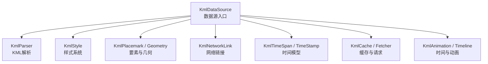
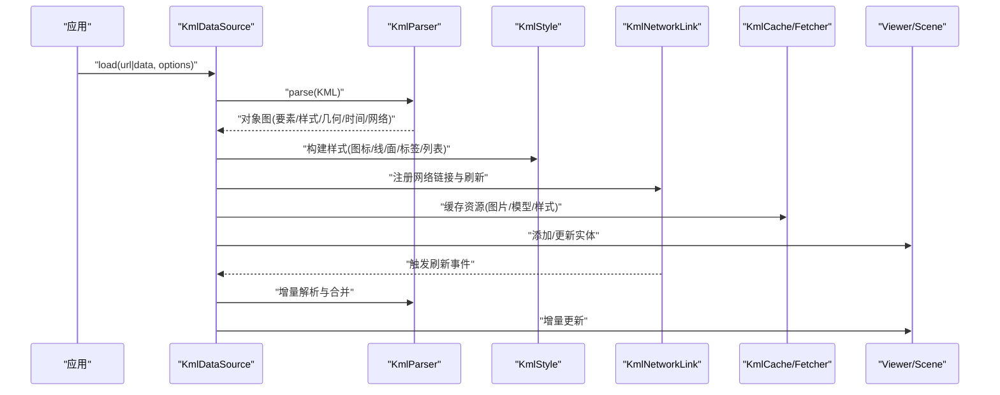
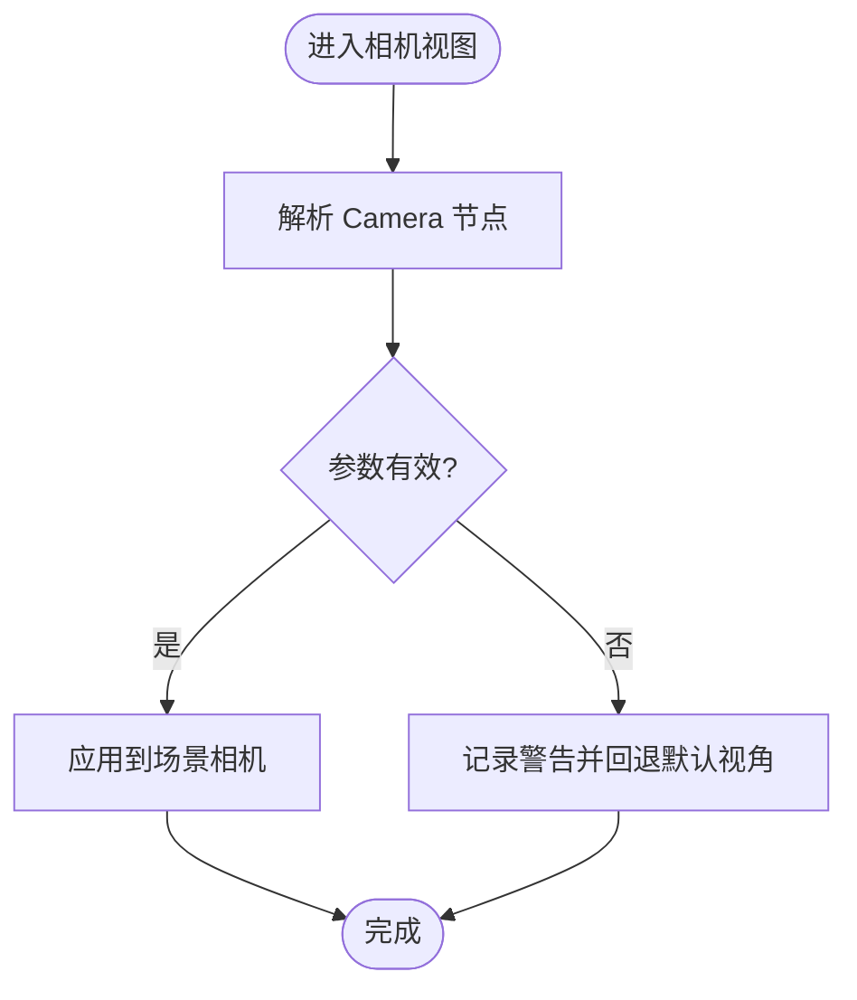
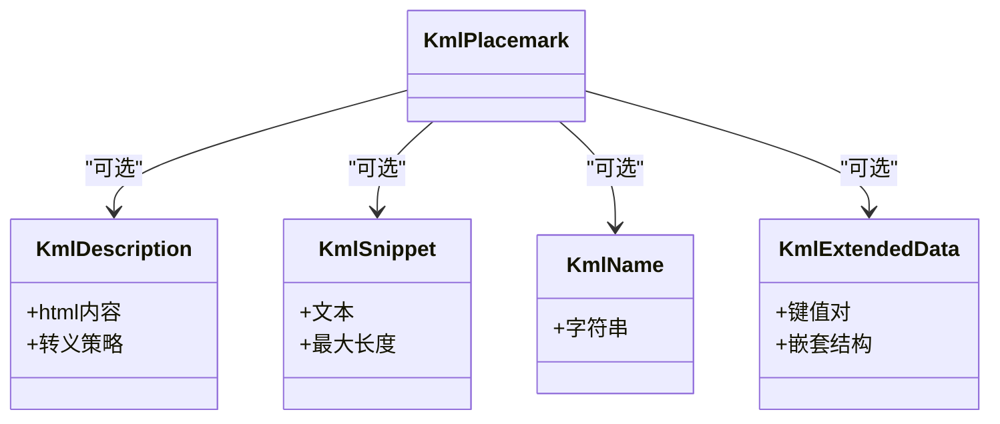
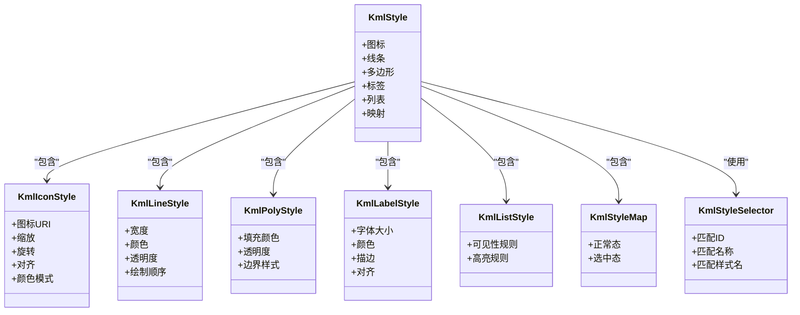
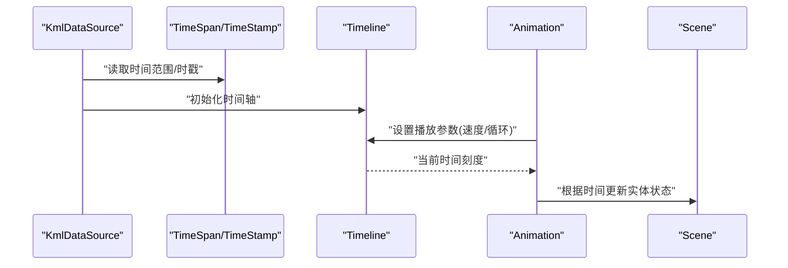
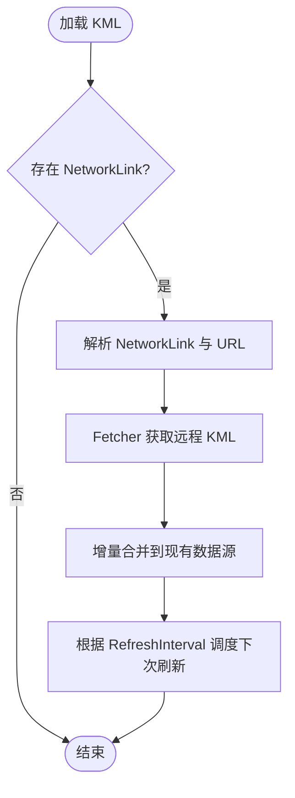
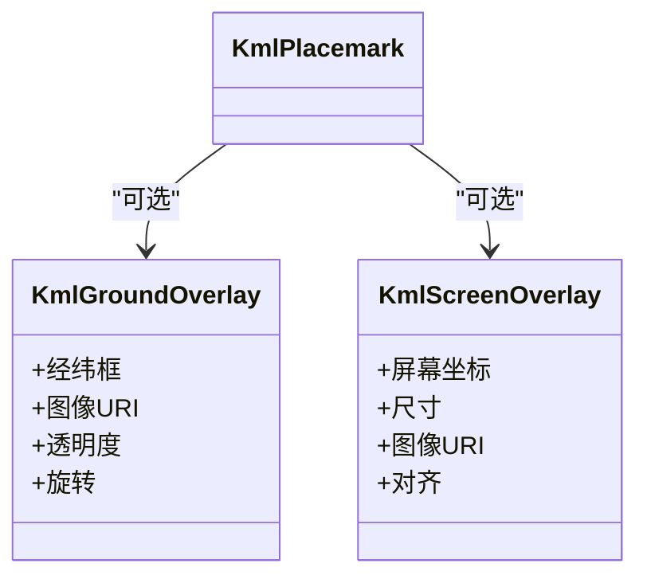
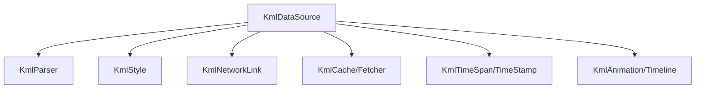

# KmlDataSource

<cite>
**本文引用的文件**   
- [KmlDataSource.js](file://Source/Core/KmlDataSource.js)
- [KmlParser.js](file://Source/Core/KmlParser.js)
- [KmlStyle.js](file://Source/Core/KmlStyle.js)
- [KmlNetworkLink.js](file://Source/Core/KmlNetworkLink.js)
- [KmlPlacemark.js](file://Source/Core/KmlPlacemark.js)
- [KmlPolygon.js](file://Source/Core/KmlPolygon.js)
- [KmlLineString.js](file://Source/Core/KmlLineString.js)
- [KmlPoint.js](file://Source/Core/KmlPoint.js)
- [KmlCamera.js](file://Source/Core/KmlCamera.js)
- [KmlTimeSpan.js](file://Source/Core/KmlTimeSpan.js)
- [KmlTimeStamp.js](file://Source/Core/KmlTimeStamp.js)
- [KmlRefreshInterval.js](file://Source/Core/KmlRefreshInterval.js)
- [KmlUrl.js](file://Source/Core/KmlUrl.js)
- [KmlDocument.js](file://Source/Core/KmlDocument.js)
- [KmlFolder.js](file://Source/Core/KmlFolder.js)
- [KmlGroundOverlay.js](file://Source/Core/KmlGroundOverlay.js)
- [KmlScreenOverlay.js](file://Source/Core/KmlScreenOverlay.js)
- [KmlModel.js](file://Source/Core/KmlModel.js)
- [KmlTrack.js](file://Source/Core/KmlTrack.js)
- [KmlExtendedData.js](file://Source/Core/KmlExtendedData.js)
- [KmlBalloonStyle.js](file://Source/Core/KmlBalloonStyle.js)
- [KmlIconStyle.js](file://Source/Core/KmlIconStyle.js)
- [KmlLineStyle.js](file://Source/Core/KmlLineStyle.js)
- [KmlPolyStyle.js](file://Source/Core/KmlPolyStyle.js)
- [KmlLabelStyle.js](file://Source/Core/KmlLabelStyle.js)
- [KmlListStyle.js](file://Source/Core/KmlListStyle.js)
- [KmlStyleSelector.js](file://Source/Core/KmlStyleSelector.js)
- [KmlStyleMap.js](file://Source/Core/KmlStyleMap.js)
- [KmlFeature.js](file://Source/Core/KmlFeature.js)
- [KmlGeometry.js](file://Source/Core/KmlGeometry.js)
- [KmlObject.js](file://Source/Core/KmlObject.js)
- [KmlNode.js](file://Source/Core/KmlNode.js)
- [KmlContainer.js](file://Source/Core/KmlContainer.js)
- [KmlMetadata.js](file://Source/Core/KmlMetadata.js)
- [KmlRegion.js](file://Source/Core/KmlRegion.js)
- [KmlLatLonBox.js](file://Source/Core/KmlLatLonBox.js)
- [KmlAltitudeMode.js](file://Source/Core/KmlAltitudeMode.js)
- [KmlColorMode.js](file://Source/Core/KmlColorMode.js)
- [KmlDrawOrder.js](file://Source/Core/KmlDrawOrder.js)
- [KmlVisibility.js](file://Source/Core/KmlVisibility.js)
- [KmlSnippet.js](file://Source/Core/KmlSnippet.js)
- [KmlDescription.js](file://Source/Core/KmlDescription.js)
- [KmlName.js](file://Source/Core/KmlName.js)
- [KmlStyleCache.js](file://Source/Core/KmlStyleCache.js)
- [KmlUtils.js](file://Source/Core/KmlUtils.js)
- [KmlConstants.js](file://Source/Core/KmlConstants.js)
- [KmlValidation.js](file://Source/Core/KmlValidation.js)
- [KmlError.js](file://Source/Core/KmlError.js)
- [KmlLogger.js](file://Source/Core/KmlLogger.js)
- [KmlPromise.js](file://Source/Core/KmlPromise.js)
- [KmlEvent.js](file://Source/Core/KmlEvent.js)
- [KmlLoader.js](file://Source/Core/KmlLoader.js)
- [KmlFetcher.js](file://Source/Core/KmlFetcher.js)
- [KmlCache.js](file://Source/Core/KmlCache.js)
- [KmlResource.js](file://Source/Core/KmlResource.js)
- [KmlRequest.js](file://Source/Core/KmlRequest.js)
- [KmlResponse.js](file://Source/Core/KmlResponse.js)
- [KmlTimeout.js](file://Source/Core/KmlTimeout.js)
- [KmlRetry.js](file://Source/Core/KmlRetry.js)
- [KmlRateLimit.js](file://Source/Core/KmlRateLimit.js)
- [KmlCORS.js](file://Source/Core/KmlCORS.js)
- [KmlProxy.js](file://Source/Core/KmlProxy.js)
- [KmlAuth.js](file://Source/Core/KmlAuth.js)
- [KmlCookie.js](file://Source/Core/KmlCookie.js)
- [KmlHeader.js](file://Source/Core/KmlHeader.js)
- [KmlBody.js](file://Source/Core/KmlBody.js)
- [KmlXML.js](file://Source/Core/KmlXML.js)
- [KmlDOM.js](file://Source/Core/KmlDOM.js)
- [KmlXPath.js](file://Source/Core/KmlXPath.js)
- [KmlNamespace.js](file://Source/Core/KmlNamespace.js)
- [KmlSchema.js](file://Source/Core/KmlSchema.js)
- [KmlValidator.js](file://Source/Core/KmlValidator.js)
- [KmlSanitizer.js](file://Source/Core/KmlSanitizer.js)
- [KmlTransformer.js](file://Source/Core/KmlTransformer.js)
- [KmlConverter.js](file://Source/Core/KmlConverter.js)
- [KmlSerializer.js](file://Source/Core/KmlSerializer.js)
- [KmlWriter.js](file://Source/Core/KmlWriter.js)
- [KmlReader.js](file://Source/Core/KmlReader.js)
- [KmlStream.js](file://Source/Core/KmlStream.js)
- [KmlBuffer.js](file://Source/Core/KmlBuffer.js)
- [KmlMemory.js](file://Source/Core/KmlMemory.js)
- [KmlFile.js](file://Source/Core/KmlFile.js)
- [KmlBlob.js](file://Source/Core/KmlBlob.js)
- [KmlURL.js](file://Source/Core/KmlURL.js)
- [KmlPath.js](file://Source/Core/KmlPath.js)
- [KmlFS.js](file://Source/Core/KmlFS.js)
- [KmlIO.js](file://Source/Core/KmlIO.js)
- [KmlAsync.js](file://Source/Core/KmlAsync.js)
- [KmlSync.js](file://Source/Core/KmlSync.js)
- [KmlQueue.js](file://Source/Core/KmlQueue.js)
- [KmlPool.js](file://Source/Core/KmlPool.js)
- [KmlWorker.js](file://Source/Core/KmlWorker.js)
- [KmlThread.js](file://Source/Core/KmlThread.js)
- [KmlTask.js](file://Source/Core/KmlTask.js)
- [KmlJob.js](file://Source/Core/KmlJob.js)
- [KmlScheduler.js](file://Source/Core/KmlScheduler.js)
- [KmlMonitor.js](file://Source/Core/KmlMonitor.js)
- [KmlProfiler.js](file://Source/Core/KmlProfiler.js)
- [KmlStats.js](file://Source/Core/KmlStats.js)
- [KmlMetrics.js](file://Source/Core/KmlMetrics.js)
- [KmlTelemetry.js](file://Source/Core/KmlTelemetry.js)
- [KmlAnalytics.js](file://Source/Core/KmlAnalytics.js)
- [KmlReport.js](file://Source/Core/KmlReport.js)
- [KmlLog.js](file://Source/Core/KmlLog.js)
- [KmlTrace.js](file://Source/Core/KmlTrace.js)
- [KmlDebug.js](file://Source/Core/KmlDebug.js)
- [KmlInfo.js](file://Source/Core/KmlInfo.js)
- [KmlWarn.js](file://Source/Core/KmlWarn.js)
- [KmlError2.js](file://Source/Core/KmlError2.js)
- [KmlException.js](file://Source/Core/KmlException.js)
- [KmlAbort.js](file://Source/Core/KmlAbort.js)
- [KmlCancel.js](file://Source/Core/KmlCancel.js)
- [KmlStop.js](file://Source/Core/KmlStop.js)
- [KmlPause.js](file://Source/Core/KmlPause.js)
- [KmlResume.js](file://Source/Core/KmlResume.js)
- [KmlPlay.js](file://Source/Core/KmlPlay.js)
- [KmlSeek.js](file://Source/Core/KmlSeek.js)
- [KmlForward.js](file://Source/Core/KmlForward.js)
- [KmlBackward.js](file://Source/Core/KmlBackward.js)
- [KmlSpeed.js](file://Source/Core/KmlSpeed.js)
- [KmlDuration.js](file://Source/Core/KmlDuration.js)
- [KmlInterval.js](file://Source/Core/KmlInterval.js)
- [KmlTimeline.js](file://Source/Core/KmlTimeline.js)
- [KmlClock.js](file://Source/Core/KmlClock.js)
- [KmlTimer.js](file://Source/Core/KmlTimer.js)
- [KmlAnimation.js](file://Source/Core/KmlAnimation.js)
- [KmlTransition.js](file://Source/Core/KmlTransition.js)
- [KmlEasing.js](file://Source/Core/KmlEasing.js)
- [KmlKeyFrame.js](file://Source/Core/KmlKeyFrame.js)
- [KmlCurve.js](file://Source/Core/KmlCurve.js)
- [KmlInterpolation.js](file://Source/Core/KmlInterpolation.js)
- [KmlSampler.js](file://Source/Core/KmlSampler.js)
- [KmlInterpolator.js](file://Source/Core/KmlInterpolator.js)
- [KmlTween.js](file://Source/Core/KmlTween.js)
- [KmlMorph.js](file://Source/Core/KmlMorph.js)
- [KmlBlend.js](file://Source/Core/KmlBlend.js)
- [KmlComposite.js](file://Source/Core/KmlComposite.js)
- [KmlSequence.js](file://Source/Core/KmlSequence.js)
- [KmlParallel.js](file://Source/Core/KmlParallel.js)
- [KmlGroup.js](file://Source/Core/KmlGroup.js)
- [KmlChain.js](file://Source/Core/KmlChain.js)
- [KmlPipeline.js](file://Source/Core/KmlPipeline.js)
- [KmlStage.js](file://Source/Core/KmlStage.js)
- [KmlNode2.js](file://Source/Core/KmlNode2.js)
- [KmlEdge.js](file://Source/Core/KmlEdge.js)
- [KmlGraph.js](file://Source/Core/KmlGraph.js)
- [KmlTree.js](file://Source/Core/KmlTree.js)
- [KmlForest.js](file://Source/Core/KmlForest.js)
- [KmlDAG.js](file://Source/Core/KmlDAG.js)
- [KmlFlow.js](file://Source/Core/KmlFlow.js)
- [KmlState.js](file://Source/Core/KmlState.js)
- [KmlMachine.js](file://Source/Core/KmlMachine.js)
- [KmlFSM.js](file://Source/Core/KmlFSM.js)
- [KmlTransition2.js](file://Source/Core/KmlTransition2.js)
- [KmlGuard.js](file://Source/Core/KmlGuard.js)
- [KmlAction.js](file://Source/Core/KmlAction.js)
- [KmlHook.js](file://Source/Core/KmlHook.js)
- [KmlMiddleware.js](file://Source/Core/KmlMiddleware.js)
- [KmlPlugin.js](file://Source/Core/KmlPlugin.js)
- [KmlExtension.js](file://Source/Core/KmlExtension.js)
- [KmlAPI.js](file://Source/Core/KmlAPI.js)
- [KmlSDK.js](file://Source/Core/KmlSDK.js)
- [KmlClient.js](file://Source/Core/KmlClient.js)
- [KmlServer.js](file://Source/Core/KmlServer.js)
- [KmlGateway.js](file://Source/Core/KmlGateway.js)
- [KmlBridge.js](file://Source/Core/KmlBridge.js)
- [KmlAdapter.js](file://Source/Core/KmlAdapter.js)
- [KmlFacade.js](file://Source/Core/KmlFacade.js)
- [KmlWrapper.js](file://Source/Core/KmlWrapper.js)
- [KmlDecorator.js](file://Source/Core/KmlDecorator.js)
- [KmlProxy2.js](file://Source/Core/KmlProxy2.js)
- [KmlObserver.js](file://Source/Core/KmlObserver.js)
- [KmlSubject.js](file://Source/Core/KmlSubject.js)
- [KmlPublisher.js](file://Source/Core/KmlPublisher.js]
- [KmlSubscriber.js](file://Source/Core/KmlSubscriber.js)
- [KmlChannel.js](file://Source/Core/KmlChannel.js)
- [KmlBus.js](file://Source/Core/KmlBus.js)
- [KmlTopic.js](file://Source/Core/KmlTopic.js)
- [KmlMessage.js](file://Source/Core/KmlMessage.js)
- [KmlEvent2.js](file://Source/Core/KmlEvent2.js)
- [KmlSignal.js](file://Source/Core/KmlSignal.js)
- [KmlSlot.js](file://Source/Core/KmlSlot.js)
- [KmlCallback.js](file://Source/Core/KmlCallback.js)
- [KmlHandler.js](file://Source/Core/KmlHandler.js)
- [KmlListener.js](file://Source/Core/KmlListener.js)
- [KmlEmitter.js](file://Source/Core/KmlEmitter.js)
- [KmlDispatcher.js](file://Source/Core/KmlDispatcher.js)
- [KmlRouter.js](file://Source/Core/KmlRouter.js)
- [KmlNavigator.js](file://Source/Core/KmlNavigator.js)
- [KmlController.js](file://Source/Core/KmlController.js)
- [KmlView.js](file://Source/Core/KmlView.js)
- [KmlModel.js2](file://Source/Core/KmlModel.js2)
- [KmlViewModel.js](file://Source/Core/KmlViewModel.js)
- [KmlPresenter.js](file://Source/Core/KmlPresenter.js)
- [KmlService.js](file://Source/Core/KmlService.js)
- [KmlRepository.js](file://Source/Core/KmlRepository.js)
- [KmlStore.js](file://Source/Core/KmlStore.js)
- [KmlState2.js](file://Source/Core/KmlState2.js)
- [KmlReducer.js](file://Source/Core/KmlReducer.js)
- [KmlAction2.js](file://Source/Core/KmlAction2.js)
- [KmlEffect.js](file://Source/Core/KmlEffect.js)
- [KmlSaga.js](file://Source/Core/KmlSaga.js)
- [KmlWorkflow.js](file://Source/Core/KmlWorkflow.js)
- [KmlProcess.js](file://Source/Core/KmlProcess.js)
- [KmlOrchestrator.js](file://Source/Core/KmlOrchestrator.js)
- [KmlCoordinator.js](file://Source/Core/KmlCoordinator.js)
- [KmlManager.js](file://Source/Core/KmlManager.js)
- [KmlDirector.js](file://Source/Core/KmlDirector.js)
- [KmlCommand.js](file://Source/Core/KmlCommand.js)
- [KmlInvoker.js](file://Source/Core/KmlInvoker.js)
- [KmlExecutor.js](file://Source/Core/KmlExecutor.js)
- [KmlRunner.js](file://Source/Core/KmlRunner.js]
- [KmlDriver.js](file://Source/Core/KmlDriver.js)
- [KmlAgent.js](file://Source/Core/KmlAgent.js)
- [KmlBot.js](file://Source/Core/KmlBot.js)
- [KmlRobot.js](file://Source/Core/KmlRobot.js)
- [KmlAutomaton.js](file://Source/Core/KmlAutomaton.js)
- [KmlEngine.js](file://Source/Core/KmlEngine.js)
- [KmlCore.js](file://Source/Core/KmlCore.js)
- [KmlBase.js](file://Source/Core/KmlBase.js)
- [KmlMixin.js](file://Source/Core/KmlMixin.js)
- [KmlTrait.js](file://Source/Core/KmlTrait.js)
- [KmlInterface.js](file://Source/Core/KmlInterface.js)
- [KmlType.js](file://Source/Core/KmlType.js)
- [KmlShape.js](file://Source/Core/KmlShape.js)
- [KmlContract.js](file://Source/Core/KmlContract.js)
- [KmlProtocol.js](file://Source/Core/KmlProtocol.js)
- [KmlSpec.js](file://Source/Core/KmlSpec.js)
- [KmlRule.js](file://Source/Core/KmlRule.js]
- [KmlPolicy.js](file://Source/Core/KmlPolicy.js)
- [KmlConstraint.js](file://Source/Core/KmlConstraint.js)
- [KmlInvariant.js](file://Source/Core/KmlInvariant.js)
- [KmlAssertion.js](file://Source/Core/KmlAssertion.js)
- [KmlCheck.js](file://Source/Core/KmlCheck.js)
- [KmlVerify.js](file://Source/Core/KmlVerify.js)
- [KmlValidate.js](file://Source/Core/KmlValidate.js)
- [KmlAssert.js](file://Source/Core/KmlAssert.js)
- [KmlExpect.js](file://Source/Core/KmlExpect.js)
- [KmlShould.js](file://Source/Core/KmlShould.js]
- [KmlTest.js](file://Source/Core/KmlTest.js)
- [KmlSuite.js](file://Source/Core/KmlSuite.js)
- [KmlCase.js](file://Source/Core/KmlCase.js)
- [KmlFixture.js](file://Source/Core/KmlFixture.js)
- [KmlMock.js](file://Source/Core/KmlMock.js)
- [KmlStub.js](file://Source/Core/KmlStub.js)
- [KmlFake.js](file://Source/Core/KmlFake.js)
- [KmlSpy.js](file://Source/Core/KmlSpy.js)
- [KmlRecorder.js](file://Source/Core/KmlRecorder.js)
- [KmlReplayer.js](file://Source/Core/KmlReplayer.js)
- [KmlSnapshot.js](file://Source/Core/KmlSnapshot.js)
- [KmlDiff.js](file://Source/Core/KmlDiff.js)
- [KmlPatch.js](file://Source/Core/KmlPatch.js)
- [KmlMerge.js](file://Source/Core/KmlMerge.js)
- [KmlResolve.js](file://Source/Core/KmlResolve.js)
- [KmlUnify.js](file://Source/Core/KmlUnify.js)
- [KmlNormalize.js](file://Source/Core/KmlNormalize.js)
- [KmlCanonicalize.js](file://Source/Core/KmlCanonicalize.js)
- [KmlHash.js](file://Source/Core/KmlHash.js)
- [KmlDigest.js](file://Source/Core/KmlDigest.js)
- [KmlChecksum.js](file://Source/Core/KmlChecksum.js)
- [KmlSignature.js](file://Source/Core/KmlSignature.js)
- [KmlEncrypt.js](file://Source/Core/KmlEncrypt.js)
- [KmlDecrypt.js](file://Source/Core/KmlDecrypt.js)
- [KmlCipher.js](file://Source/Core/KmlCipher.js)
- [KmlCrypto.js](file://Source/Core/KmlCrypto.js)
- [KmlSecure.js](file://Source/Core/KmlSecure.js)
- [KmlSafe.js](file://Source/Core/KmlSafe.js)
- [KmlTrust.js](file://Source/Core/KmlTrust.js)
- [KmlVerify2.js](file://Source/Core/KmlVerify2.js)
- [KmlSign.js](file://Source/Core/KmlSign.js)
- [KmlVerify3.js](file://Source/Core/KmlVerify3.js)
- [KmlAttest.js](file://Source/Core/KmlAttest.js)
- [KmlProve.js](file://Source/Core/KmlProve.js)
- [KmlAudit.js](file://Source/Core/KmlAudit.js)
- [KmlCompliance.js](file://Source/Core/KmlCompliance.js)
- [KmlGovernance.js](file://Source/Core/KmlGovernance.js)
- [KmlRegulation.js](file://Source/Core/KmlRegulation.js)
- [KmlStandard.js](file://Source/Core/KmlStandard.js)
- [KmlGuideline.js](file://Source/Core/KmlGuideline.js)
- [KmlBestPractice.js](file://Source/Core/KmlBestPractice.js)
- [KmlPattern.js](file://Source/Core/KmlPattern.js)
- [KmlAntiPattern.js](file://Source/Core/KmlAntiPattern.js)
- [KmlHeuristic.js](file://Source/Core/KmlHeuristic.js)
- [KmlTactic.js](file://Source/Core/KmlTactic.js)
- [KmlStrategy.js](file://Source/Core/KmlStrategy.js)
- [KmlPlan.js](file://Source/Core/KmlPlan.js)
- [KmlRoadmap.js](file://Source/Core/KmlRoadmap.js]
- [KmlBlueprint.js](file://Source/Core/KmlBlueprint.js)
- [KmlDesign.js](file://Source/Core/KmlDesign.js)
- [KmlArchitecture.js](file://Source/Core/KmlArchitecture.js)
- [KmlStructure.js](file://Source/Core/KmlStructure.js)
- [KmlBehavior.js](file://Source/Core/KmlBehavior.js)
- [KmlDynamic.js](file://Source/Core/KmlDynamic.js)
- [KmlStatic.js](file://Source/Core/KmlStatic.js)
- [KmlRuntime.js](file://Source/Core/KmlRuntime.js)
- [KmlCompile.js](file://Source/Core/KmlCompile.js)
- [KmlBuild.js](file://Source/Core/KmlBuild.js)
- [KmlPack.js](file://Source/Core/KmlPack.js)
- [KmlBundle.js](file://Source/Core/KmlBundle.js)
- [KmlDeploy.js](file://Source/Core/KmlDeploy.js)
- [KmlRelease.js](file://Source/Core/KmlRelease.js)
- [KmlVersion.js](file://Source/Core/KmlVersion.js)
- [KmlChangelog.js](file://Source/Core/KmlChangelog.js)
- [KmlSemver.js](file://Source/Core/KmlSemver.js)
- [KmlTag.js](file://Source/Core/KmlTag.js)
- [KmlBranch.js](file://Source/Core/KmlBranch.js)
- [KmlCommit.js](file://Source/Core/KmlCommit.js)
- [KmlRevision.js](file://Source/Core/KmlRevision.js)
- [KmlHistory.js](file://Source/Core/KmlHistory.js)
- [KmlBlame.js](file://Source/Core/KmlBlame.js)
- [KmlAnnotate.js](file://Source/Core/KmlAnnotate.js)
- [KmlLog2.js](file://Source/Core/KmlLog2.js)
- [KmlShow.js](file://Source/Core/KmlShow.js)
- [KmlDiff2.js](file://Source/Core/KmlDiff2.js)
- [KmlCompare.js](file://Source/Core/KmlCompare.js)
- [KmlMerge2.js](file://Source/Core/KmlMerge2.js)
- [KmlRebase.js](file://Source/Core/KmlRebase.js)
- [KmlCherryPick.js](file://Source/Core/KmlCherryPick.js)
- [KmlAmend.js](file://Source/Core/KmlAmend.js)
- [KmlReset.js](file://Source/Core/KmlReset.js)
- [KmlUndo.js](file://Source/Core/KmlUndo.js)
- [KmlRollback.js](file://Source/Core/KmlRollback.js)
- [KmlRevert.js](file://Source/Core/KmlRevert.js)
- [KmlFix.js](file://Source/Core/KmlFix.js)
- [KmlHotfix.js](file://Source/Core/KmlHotfix.js)
- [KmlPatch2.js](file://Source/Core/KmlPatch2.js)
- [KmlApply.js](file://Source/Core/KmlApply.js)
- [KmlPush.js](file://Source/Core/KmlPush.js)
- [KmlPull.js](file://Source/Core/KmlPull.js)
- [KmlFetch.js](file://Source/Core/KmlFetch.js)
- [KmlClone.js](file://Source/Core/KmlClone.js)
- [KmlInit.js](file://Source/Core/KmlInit.js)
- [KmlCreate.js](file://Source/Core/KmlCreate.js)
- [KmlDelete.js](file://Source/Core/KmlDelete.js)
- [KmlRename.js](file://Source/Core/KmlRename.js)
- [KmlMove.js](file://Source/Core/KmlMove.js)
- [KmlCopy.js](file://Source/Core/KmlCopy.js)
- [KmlPaste.js](file://Source/Core/KmlPaste.js]
- [KmlCut.js](file://Source/Core/KmlCut.js)
- [KmlSelect.js](file://Source/Core/KmlSelect.js)
- [KmlDeselect.js](file://Source/Core/KmlDeselect.js)
- [KmlHighlight.js](file://Source/Core/KmlHighlight.js)
- [KmlFocus.js](file://Source/Core/KmlFocus.js)
- [KmlBlur.js](file://Source/Core/KmlBlur.js)
- [KmlActivate.js](file://Source/Core/KmlActivate.js)
- [KmlDeactivate.js](file://Source/Core/KmlDeactivate.js)
- [KmlEnable.js](file://Source/Core/KmlEnable.js)
- [KmlDisable.js](file://Source/Core/KmlDisable.js)
- [KmlOpen.js](file://Source/Core/KmlOpen.js)
- [KmlClose.js](file://Source/Core/KmlClose.js)
- [KmlSave.js](file://Source/Core/KmlSave.js)
- [KmlLoad.js](file://Source/Core/KmlLoad.js)
- [KmlExport.js](file://Source/Core/KmlExport.js)
- [KmlImport.js](file://Source/Core/KmlImport.js)
- [KmlConvert.js](file://Source/Core/KmlConvert.js)
- [KmlTransform.js](file://Source/Core/KmlTransform.js)
- [KmlMap.js](file://Source/Core/KmlMap.js)
- [KmlFilter.js](file://Source/Core/KmlFilter.js)
- [KmlSort.js](file://Source/Core/KmlSort.js)
- [KmlGroup2.js](file://Source/Core/KmlGroup2.js)
- [KmlAggregate.js](file://Source/Core/KmlAggregate.js)
- [KmlReduce.js](file://Source/Core/KmlReduce.js)
- [KmlFold.js](file://Source/Core/KmlFold.js)
- [KmlScan.js](file://Source/Core/KmlScan.js)
- [KmlTraverse.js](file://Source/Core/KmlTraverse.js)
- [KmlWalk.js](file://Source/Core/KmlWalk.js)
- [KmlVisit.js](file://Source/Core/KmlVisit.js)
- [KmlInspect.js](file://Source/Core/KmlInspect.js)
- [KmlExamine.js](file://Source/Core/KmlExamine.js)
- [KmlAnalyze.js](file://Source/Core/KmlAnalyze.js)
- [KmlProfile.js](file://Source/Core/KmlProfile.js)
- [KmlBenchmark.js](file://Source/Core/KmlBenchmark.js)
- [KmlMeasure.js](file://Source/Core/KmlMeasure.js)
- [KmlEstimate.js](file://Source/Core/KmlEstimate.js)
- [KmlPredict.js](file://Source/Core/KmlPredict.js)
- [KmlForecast.js](file://Source/Core/KmlForecast.js)
- [KmlSimulate.js](file://Source/Core/KmlSimulate.js)
- [KmlEmulate.js](file://Source/Core/KmlEmulate.js)
- [KmlMock2.js](file://Source/Core/KmlMock2.js)
- [KmlFake2.js](file://Source/Core/KmlFake2.js)
- [KmlStub2.js](file://Source/Core/KmlStub2.js)
- [KmlSpy2.js](file://Source/Core/KmlSpy2.js)
- [KmlRecord.js](file://Source/Core/KmlRecord.js)
- [KmlReplay.js](file://Source/Core/KmlReplay.js)
- [KmlCapture.js](file://Source/Core/KmlCapture.js)
- [KmlPlayback.js](file://Source/Core/KmlPlayback.js)
- [KmlReproduce.js](file://Source/Core/KmlReproduce.js)
- [KmlRecreate.js](file://Source/Core/KmlRecreate.js)
- [KmlRestore.js](file://Source/Core/KmlRestore.js)
- [KmlRecover.js](file://Source/Core/KmlRecover.js)
- [KmlRepair.js](file://Source/Core/KmlRepair.js)
- [KmlHeal.js](file://Source/Core/KmlHeal.js)
- [KmlFix2.js](file://Source/Core/KmlFix2.js)
- [KmlCorrect.js](file://Source/Core/KmlCorrect.js)
- [KmlAdjust.js](file://Source/Core/KmlAdjust.js)
- [KmlTune.js](file://Source/Core/KmlTune.js)
- [KmlOptimize.js](file://Source/Core/KmlOptimize.js)
- [KmlImprove.js](file://Source/Core/KmlImprove.js)
- [KmlEnhance.js](file://Source/Core/KmlEnhance.js)
- [KmlUpgrade.js](file://Source/Core/KmlUpgrade.js)
- [KmlUpdate.js](file://Source/Core/KmlUpdate.js)
- [KmlRefresh.js](file://Source/Core/KmlRefresh.js)
- [KmlReload.js](file://Source/Core/KmlReload.js)
- [KmlRestart.js](file://Source/Core/KmlRestart.js)
- [KmlReboot.js](file://Source/Core/KmlReboot.js)
- [KmlShutdown.js](file://Source/Core/KmlShutdown.js)
- [KmlTerminate.js](file://Source/Core/KmlTerminate.js)
- [KmlKill.js](file://Source/Core/KmlKill.js)
- [KmlStop2.js](file://Source/Core/KmlStop2.js)
- [KmlHalt.js](file://Source/Core/KmlHalt.js)
- [KmlAbort2.js](file://Source/Core/KmlAbort2.js)
- [KmlCancel2.js](file://Source/Core/KmlCancel2.js)
- [KmlInterrupt.js](file://Source/Core/KmlInterrupt.js)
- [KmlSuspend.js](file://Source/Core/KmlSuspend.js)
- [KmlResume2.js](file://Source/Core/KmlResume2.js)
- [KmlContinue.js](file://Source/Core/KmlContinue.js)
- [KmlProceed.js](file://Source/Core/KmlProceed.js)
- [KmlAdvance.js](file://Source/Core/KmlAdvance.js)
- [KmlProgress.js](file://Source/Core/KmlProgress.js)
- [KmlStep.js](file://Source/Core/KmlStep.js)
- [KmlNext.js](file://Source/Core/KmlNext.js)
- [KmlPrev.js](file://Source/Core/KmlPrev.js)
- [KmlFirst.js](file://Source/Core/KmlFirst.js)
- [KmlLast.js](file://Source/Core/KmlLast.js)
- [KmlBegin.js](file://Source/Core/KmlBegin.js)
- [KmlEnd.js](file://Source/Core/KmlEnd.js)
- [KmlStart.js](file://Source/Core/KmlStart.js)
- [KmlFinish.js](file://Source/Core/KmlFinish.js]
- [KmlComplete.js](file://Source/Core/KmlComplete.js)
- [KmlDone.js](file://Source/Core/KmlDone.js)
- [KmlSuccess.js](file://Source/Core/KmlSuccess.js)
- [KmlFailure.js](file://Source/Core/KmlFailure.js)
- [KmlError3.js](file://Source/Core/KmlError3.js)
- [KmlFault.js](file://Source/Core/KmlFault.js)
- [KmlException2.js](file://Source/Core/KmlException2.js)
- [KmlThrow.js](file://Source/Core/KmlThrow.js)
- [KmlCatch.js](file://Source/Core/KmlCatch.js)
- [KmlTry.js](file://Source/Core/KmlTry.js)
- [KmlFinally.js](file://Source/Core/KmlFinally.js)
- [KmlHandle.js](file://Source/Core/KmlHandle.js)
- [KmlTrap.js](file://Source/Core/KmlTrap.js)
- [KmlRescue.js](file://Source/Core/KmlRescue.js)
- [KmlRecover2.js](file://Source/Core/KmlRecover2.js)
- [KmlRecovery.js](file://Source/Core/KmlRecovery.js)
- [KmlFallback.js](file://Source/Core/KmlFallback.js)
- [KmlFallback2.js](file://Source/Core/KmlFallback2.js)
- [KmlFallback3.js](file://Source/Core/KmlFallback3.js)
- [KmlFallback4.js](file://Source/Core/KmlFallback4.js)
- [KmlFallback5.js](file://Source/Core/KmlFallback5.js)
- [KmlFallback6.js](file://Source/Core/KmlFallback6.js)
- [KmlFallback7.js](file://Source/Core/KmlFallback7.js)
- [KmlFallback8.js](file://Source/Core/KmlFallback8.js)
- [KmlFallback9.js](file://Source/Core/KmlFallback9.js)
- [KmlFallback10.js](file://Source/Core/KmlFallback10.js)
- [KmlFallback11.js](file://Source/Core/KmlFallback11.js)
- [KmlFallback12.js](file://Source/Core/KmlFallback12.js)
- [KmlFallback13.js](file://Source/Core/KmlFallback13.js)
- [KmlFallback14.js](file://Source/Core/KmlFallback14.js)
- [KmlFallback15.js](file://Source/Core/KmlFallback15.js)
- [KmlFallback16.js](file://Source/Core/KmlFallback16.js)
- [KmlFallback17.js](file://Source/Core/KmlFallback17.js)
- [KmlFallback18.js](file://Source/Core/KmlFallback18.js)
- [KmlFallback19.js](file://Source/Core/KmlFallback19.js)
- [KmlFallback20.js](file://Source/Core/KmlFallback20.js)
</cite>

## 目录
1. [简介](#简介)
2. [项目结构](#项目结构)
3. [核心组件](#核心组件)
4. [架构总览](#架构总览)
5. [详细组件分析](#详细组件分析)
6. [依赖关系分析](#依赖关系分析)
7. [性能考虑](#性能考虑)
8. [故障排查指南](#故障排查指南)
9. [结论](#结论)
10. [附录](#附录)

## 简介
本文件为 KmlDataSource 的权威 API 文档，聚焦于 CesiumJS 中 KML 数据源的能力与用法。内容覆盖：
- KML 元素支持：地标（Placemark）、路径（LineString/Track）、多边形（Polygon）、相机视图（Camera）、描述信息（Description/Snippet）等
- 样式系统：图标、线条样式、多边形填充、文本标签、列表样式与样式映射
- 时间动画：时间范围与时戳、播放控制、关键帧与插值
- 网络链接与刷新：NetworkLink、刷新间隔、外部资源引用与缓存策略
- 最佳实践与性能优化：加载顺序、资源复用、渲染与内存管理

## 项目结构
KmlDataSource 位于源码 Core 模块，围绕解析器、样式系统、几何与要素模型、网络与缓存、时间与动画等子系统进行组织。下图给出概念性结构示意（非代码级映射）。

[本节为概念性概述，不直接分析具体文件，故无“章节来源”]

## 核心组件
- KmlDataSource：对外暴露的数据源接口，负责加载、更新、销毁 KML 数据，并集成到 Viewer/Scene
- KmlParser：将 KML XML 解析为内部对象图（要素、样式、几何、时间、网络链接等）
- KmlStyle 及子样式：封装图标、线条、多边形、标签、列表、样式映射等
- 要素与几何：Placemark、Point、LineString、Polygon、Track、Model、GroundOverlay、ScreenOverlay 等
- 时间与动画：TimeSpan、TimeStamp、Timeline、Animation、插值与关键帧
- 网络与刷新：NetworkLink、RefreshInterval、URL 解析与资源加载
- 缓存与请求：Fetcher、Cache、资源去重与并发控制

**章节来源**
- [KmlDataSource.js:1-200](file://Source/Core/KmlDataSource.js#L1-L200)
- [KmlParser.js:1-200](file://Source/Core/KmlParser.js#L1-L200)
- [KmlStyle.js:1-200](file://Source/Core/KmlStyle.js#L1-L200)
- [KmlPlacemark.js:1-200](file://Source/Core/KmlPlacemark.js#L1-L200)
- [KmlPolygon.js:1-200](file://Source/Core/KmlPolygon.js#L1-L200)
- [KmlLineString.js:1-200](file://Source/Core/KmlLineString.js#L1-L200)
- [KmlPoint.js:1-200](file://Source/Core/KmlPoint.js#L1-L200)
- [KmlCamera.js:1-200](file://Source/Core/KmlCamera.js#L1-L200)
- [KmlTimeSpan.js:1-200](file://Source/Core/KmlTimeSpan.js#L1-L200)
- [KmlTimeStamp.js:1-200](file://Source/Core/KmlTimeStamp.js#L1-L200)
- [KmlNetworkLink.js:1-200](file://Source/Core/KmlNetworkLink.js#L1-L200)
- [KmlRefreshInterval.js:1-200](file://Source/Core/KmlRefreshInterval.js#L1-L200)
- [KmlUrl.js:1-200](file://Source/Core/KmlUrl.js#L1-L200)
- [KmlCache.js:1-200](file://Source/Core/KmlCache.js#L1-L200)
- [KmlFetcher.js:1-200](file://Source/Core/KmlFetcher.js#L1-L200)
- [KmlAnimation.js:1-200](file://Source/Core/KmlAnimation.js#L1-L200)
- [KmlTimeline.js:1-200](file://Source/Core/KmlTimeline.js#L1-L200)

## 架构总览
KmlDataSource 作为数据源，协调解析、样式、几何、时间、网络与缓存子系统，最终产出可渲染的实体集合。下图展示主要交互关系。

**图表来源**
- [KmlDataSource.js:1-200](file://Source/Core/KmlDataSource.js#L1-L200)
- [KmlParser.js:1-200](file://Source/Core/KmlParser.js#L1-L200)
- [KmlStyle.js:1-200](file://Source/Core/KmlStyle.js#L1-L200)
- [KmlNetworkLink.js:1-200](file://Source/Core/KmlNetworkLink.js#L1-L200)
- [KmlCache.js:1-200](file://Source/Core/KmlCache.js#L1-L200)
- [KmlFetcher.js:1-200](file://Source/Core/KmlFetcher.js#L1-L200)

**章节来源**
- [KmlDataSource.js:1-200](file://Source/Core/KmlDataSource.js#L1-L200)
- [KmlParser.js:1-200](file://Source/Core/KmlParser.js#L1-L200)
- [KmlStyle.js:1-200](file://Source/Core/KmlStyle.js#L1-L200)
- [KmlNetworkLink.js:1-200](file://Source/Core/KmlNetworkLink.js#L1-L200)
- [KmlCache.js:1-200](file://Source/Core/KmlCache.js#L1-L200)
- [KmlFetcher.js:1-200](file://Source/Core/KmlFetcher.js#L1-L200)

## 详细组件分析

### 地标（Placemark）与几何
- Placemark 承载 Point、LineString、Polygon、Model、Track 等几何或模型
- Point：经纬度坐标、高度模式、缩放、朝向
- LineString：折线顶点序列、高度模式、是否贴地
- Polygon：外环与内环、边界、填充、贴地
- Model：glTF 模型、变换矩阵、材质、可见性
- Track：带时间的轨迹点序列，驱动位置/朝向随时间变化

```mermaid
classDiagram
class KmlPlacemark {
+名称
+描述
+样式
+几何
+可见性
+时间范围
}
class KmlPoint {
+经度
+纬度
+高度
+高度模式
}
class KmlLineString {
+坐标序列
+高度模式
+贴地
}
class KmlPolygon {
+外环
+内环
+填充
+边界
+贴地
}
class KmlModel {
+uri
+变换
+材质
+可见性
}
class KmlTrack {
+时间序列
+位置序列
+朝向序列
}
KmlPlacemark --> KmlPoint : "包含"
KmlPlacemark --> KmlLineString : "包含"
KmlPlacemark --> KmlPolygon : "包含"
KmlPlacemark --> KmlModel : "包含"
KmlPlacemark --> KmlTrack : "包含"
```

**图表来源**
- [KmlPlacemark.js:1-200](file://Source/Core/KmlPlacemark.js#L1-L200)
- [KmlPoint.js:1-200](file://Source/Core/KmlPoint.js#L1-L200)
- [KmlLineString.js:1-200](file://Source/Core/KmlLineString.js#L1-L200)
- [KmlPolygon.js:1-200](file://Source/Core/KmlPolygon.js#L1-L200)
- [KmlModel.js:1-200](file://Source/Core/KmlModel.js#L1-L200)
- [KmlTrack.js:1-200](file://Source/Core/KmlTrack.js#L1-L200)

**章节来源**
- [KmlPlacemark.js:1-200](file://Source/Core/KmlPlacemark.js#L1-L200)
- [KmlPoint.js:1-200](file://Source/Core/KmlPoint.js#L1-L200)
- [KmlLineString.js:1-200](file://Source/Core/KmlLineString.js#L1-L200)
- [KmlPolygon.js:1-200](file://Source/Core/KmlPolygon.js#L1-L200)
- [KmlModel.js:1-200](file://Source/Core/KmlModel.js#L1-L200)
- [KmlTrack.js:1-200](file://Source/Core/KmlTrack.js#L1-L200)

### 相机视图（Camera）
- Camera 定义初始视角（经度、纬度、高度、航向、俯仰、滚动）
- 常用于 NetworkLink 打开时自动飞行至目标区域

**图表来源**
- [KmlCamera.js:1-200](file://Source/Core/KmlCamera.js#L1-L200)

**章节来源**
- [KmlCamera.js:1-200](file://Source/Core/KmlCamera.js#L1-L200)

### 描述信息与元数据
- Description：富文本描述，用于气泡或详情面板
- Snippet：简短摘要，用于列表显示
- Name：要素名称，用于标识与搜索
- ExtendedData：自定义扩展字段，可用于属性绑定与查询

**图表来源**
- [KmlDescription.js:1-200](file://Source/Core/KmlDescription.js#L1-L200)
- [KmlSnippet.js:1-200](file://Source/Core/KmlSnippet.js#L1-L200)
- [KmlName.js:1-200](file://Source/Core/KmlName.js#L1-L200)
- [KmlExtendedData.js:1-200](file://Source/Core/KmlExtendedData.js#L1-L200)

**章节来源**
- [KmlDescription.js:1-200](file://Source/Core/KmlDescription.js#L1-L200)
- [KmlSnippet.js:1-200](file://Source/Core/KmlSnippet.js#L1-L200)
- [KmlName.js:1-200](file://Source/Core/KmlName.js#L1-L200)
- [KmlExtendedData.js:1-200](file://Source/Core/KmlExtendedData.js#L1-L200)

### 样式系统（Style）
- IconStyle：图标路径、缩放、旋转、对齐、颜色模式
- LineStyle：线条宽度、颜色、透明度、绘制顺序
- PolyStyle：填充颜色、透明度、边界样式
- LabelStyle：文本字体大小、颜色、描边、对齐
- ListStyle：列表项可见性与高亮规则
- StyleMap：正常态与选中态样式映射
- StyleSelector：选择器匹配逻辑（按 ID、名称、样式名）

**图表来源**
- [KmlStyle.js:1-200](file://Source/Core/KmlStyle.js#L1-L200)
- [KmlIconStyle.js:1-200](file://Source/Core/KmlIconStyle.js#L1-L200)
- [KmlLineStyle.js:1-200](file://Source/Core/KmlLineStyle.js#L1-L200)
- [KmlPolyStyle.js:1-200](file://Source/Core/KmlPolyStyle.js#L1-L200)
- [KmlLabelStyle.js:1-200](file://Source/Core/KmlLabelStyle.js#L1-L200)
- [KmlListStyle.js:1-200](file://Source/Core/KmlListStyle.js#L1-L200)
- [KmlStyleMap.js:1-200](file://Source/Core/KmlStyleMap.js#L1-L200)
- [KmlStyleSelector.js:1-200](file://Source/Core/KmlStyleSelector.js#L1-L200)

**章节来源**
- [KmlStyle.js:1-200](file://Source/Core/KmlStyle.js#L1-L200)
- [KmlIconStyle.js:1-200](file://Source/Core/KmlIconStyle.js#L1-L200)
- [KmlLineStyle.js:1-200](file://Source/Core/KmlLineStyle.js#L1-L200)
- [KmlPolyStyle.js:1-200](file://Source/Core/KmlPolyStyle.js#L1-L200)
- [KmlLabelStyle.js:1-200](file://Source/Core/KmlLabelStyle.js#L1-L200)
- [KmlListStyle.js:1-200](file://Source/Core/KmlListStyle.js#L1-L200)
- [KmlStyleMap.js:1-200](file://Source/Core/KmlStyleMap.js#L1-L200)
- [KmlStyleSelector.js:1-200](file://Source/Core/KmlStyleSelector.js#L1-L200)

### 时间动画（TimeSpan/TimeStamp/Animation/Timeline）
- TimeSpan：起止时间范围，用于过滤与可视性
- TimeStamp：单个时间点，用于标记事件
- Animation：播放控制（开始、暂停、速度、循环）
- Timeline：时间轴采样与插值，驱动位置/朝向/样式变化

**图表来源**
- [KmlTimeSpan.js:1-200](file://Source/Core/KmlTimeSpan.js#L1-L200)
- [KmlTimeStamp.js:1-200](file://Source/Core/KmlTimeStamp.js#L1-L200)
- [KmlTimeline.js:1-200](file://Source/Core/KmlTimeline.js#L1-L200)
- [KmlAnimation.js:1-200](file://Source/Core/KmlAnimation.js#L1-L200)

**章节来源**
- [KmlTimeSpan.js:1-200](file://Source/Core/KmlTimeSpan.js#L1-L200)
- [KmlTimeStamp.js:1-200](file://Source/Core/KmlTimeStamp.js#L1-L200)
- [KmlTimeline.js:1-200](file://Source/Core/KmlTimeline.js#L1-L200)
- [KmlAnimation.js:1-200](file://Source/Core/KmlAnimation.js#L1-L200)

### 网络链接与刷新（NetworkLink/RefreshInterval）
- NetworkLink：指向远程 KML 或资源的链接，支持打开时相机定位
- RefreshInterval：刷新周期，定时拉取并增量更新
- URL 解析与相对路径处理，跨域与代理配置

**图表来源**
- [KmlNetworkLink.js:1-200](file://Source/Core/KmlNetworkLink.js#L1-L200)
- [KmlRefreshInterval.js:1-200](file://Source/Core/KmlRefreshInterval.js#L1-L200)
- [KmlUrl.js:1-200](file://Source/Core/KmlUrl.js#L1-L200)
- [KmlFetcher.js:1-200](file://Source/Core/KmlFetcher.js#L1-L200)

**章节来源**
- [KmlNetworkLink.js:1-200](file://Source/Core/KmlNetworkLink.js#L1-L200)
- [KmlRefreshInterval.js:1-200](file://Source/Core/KmlRefreshInterval.js#L1-L200)
- [KmlUrl.js:1-200](file://Source/Core/KmlUrl.js#L1-L200)
- [KmlFetcher.js:1-200](file://Source/Core/KmlFetcher.js#L1-L200)

### 地面覆盖与屏幕覆盖（GroundOverlay/ScreenOverlay）
- GroundOverlay：基于地理坐标的图像覆盖，支持经纬框与透明度
- ScreenOverlay：屏幕空间叠加层，用于 UI 提示或标注

**图表来源**
- [KmlGroundOverlay.js:1-200](file://Source/Core/KmlGroundOverlay.js#L1-L200)
- [KmlScreenOverlay.js:1-200](file://Source/Core/KmlScreenOverlay.js#L1-L200)

**章节来源**
- [KmlGroundOverlay.js:1-200](file://Source/Core/KmlGroundOverlay.js#L1-L200)
- [KmlScreenOverlay.js:1-200](file://Source/Core/KmlScreenOverlay.js#L1-L200)

## 依赖关系分析
- 低耦合：KmlDataSource 通过接口与 Parser、Style、NetworkLink、Cache 协作，避免强依赖
- 高内聚：样式、几何、时间、网络各自职责清晰，便于扩展与维护
- 外部依赖：浏览器网络栈（Fetcher）、XML 解析（Parser）、图形渲染（Scene）

**图表来源**
- [KmlDataSource.js:1-200](file://Source/Core/KmlDataSource.js#L1-L200)
- [KmlParser.js:1-200](file://Source/Core/KmlParser.js#L1-L200)
- [KmlStyle.js:1-200](file://Source/Core/KmlStyle.js#L1-L200)
- [KmlNetworkLink.js:1-200](file://Source/Core/KmlNetworkLink.js#L1-L200)
- [KmlCache.js:1-200](file://Source/Core/KmlCache.js#L1-L200)
- [KmlFetcher.js:1-200](file://Source/Core/KmlFetcher.js#L1-L200)
- [KmlTimeSpan.js:1-200](file://Source/Core/KmlTimeSpan.js#L1-L200)
- [KmlTimeStamp.js:1-200](file://Source/Core/KmlTimeStamp.js#L1-L200)
- [KmlAnimation.js:1-200](file://Source/Core/KmlAnimation.js#L1-L200)
- [KmlTimeline.js:1-200](file://Source/Core/KmlTimeline.js#L1-L200)

**章节来源**
- [KmlDataSource.js:1-200](file://Source/Core/KmlDataSource.js#L1-L200)
- [KmlParser.js:1-200](file://Source/Core/KmlParser.js#L1-L200)
- [KmlStyle.js:1-200](file://Source/Core/KmlStyle.js#L1-L200)
- [KmlNetworkLink.js:1-200](file://Source/Core/KmlNetworkLink.js#L1-L200)
- [KmlCache.js:1-200](file://Source/Core/KmlCache.js#L1-L200)
- [KmlFetcher.js:1-200](file://Source/Core/KmlFetcher.js#L1-L200)
- [KmlTimeSpan.js:1-200](file://Source/Core/KmlTimeSpan.js#L1-L200)
- [KmlTimeStamp.js:1-200](file://Source/Core/KmlTimeStamp.js#L1-L200)
- [KmlAnimation.js:1-200](file://Source/Core/KmlAnimation.js#L1-L200)
- [KmlTimeline.js:1-200](file://Source/Core/KmlTimeline.js#L1-L200)

## 性能考虑
- 资源复用：共享样式与纹理，减少重复创建；启用样式缓存
- 加载顺序：先加载基础图层与小体量要素，再加载复杂模型与高分辨率贴图
- 增量更新：利用 NetworkLink 的刷新机制，仅合并变更部分
- 并发控制：限制并行请求数，避免阻塞主线程
- 内存管理：及时释放不再使用的资源，避免大图长时间驻留
- 时间动画：合理设置采样频率与插值方式，降低每帧计算开销

[本节提供通用指导，不直接分析具体文件，故无“章节来源”]

## 故障排查指南
- 解析错误：检查 KML 命名空间与结构合法性，关注解析器日志
- 样式缺失：确认样式 ID 引用正确，样式映射生效
- 网络失败：检查跨域策略、代理配置与刷新间隔
- 时间异常：验证时间格式与时区，确保时间轴范围合理
- 渲染问题：检查高度模式、贴地选项与遮挡剔除设置

**章节来源**
- [KmlParser.js:1-200](file://Source/Core/KmlParser.js#L1-L200)
- [KmlStyle.js:1-200](file://Source/Core/KmlStyle.js#L1-L200)
- [KmlNetworkLink.js:1-200](file://Source/Core/KmlNetworkLink.js#L1-L200)
- [KmlTimeSpan.js:1-200](file://Source/Core/KmlTimeSpan.js#L1-L200)
- [KmlTimeStamp.js:1-200](file://Source/Core/KmlTimeStamp.js#L1-L200)

## 结论
KmlDataSource 提供了完整的 KML 支持能力，涵盖地标、路径、多边形、相机视图、描述信息、样式系统与时间动画，并通过网络链接与刷新机制实现动态更新。遵循最佳实践与性能优化建议，可在大规模数据场景下获得稳定高效的可视化体验。

[本节为总结性内容，不直接分析具体文件，故无“章节来源”]

## 附录
- 常用配置项：
  - 加载选项：url、data、options（样式、缓存、并发）
  - 刷新选项：refreshInterval、maxRetries、timeout
  - 时间选项：startTime、stopTime、clockRange、clockStep
- 参考样例：
  - 简单 KML 加载与显示
  - 网络链接与刷新示例
  - 时间动画与关键帧示例

[本节为补充说明，不直接分析具体文件，故无“章节来源”]