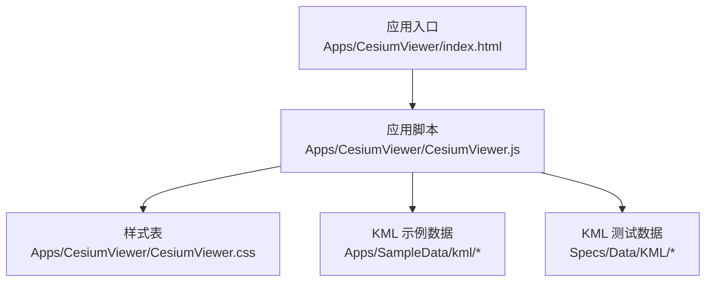
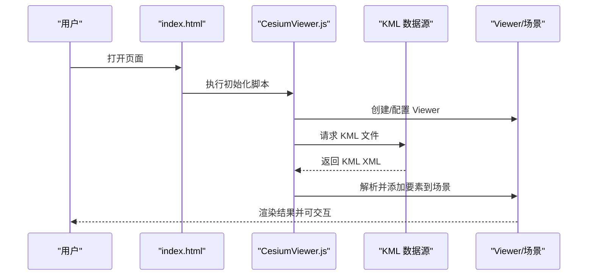
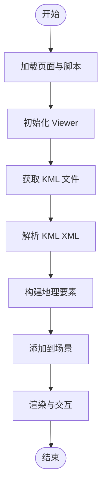
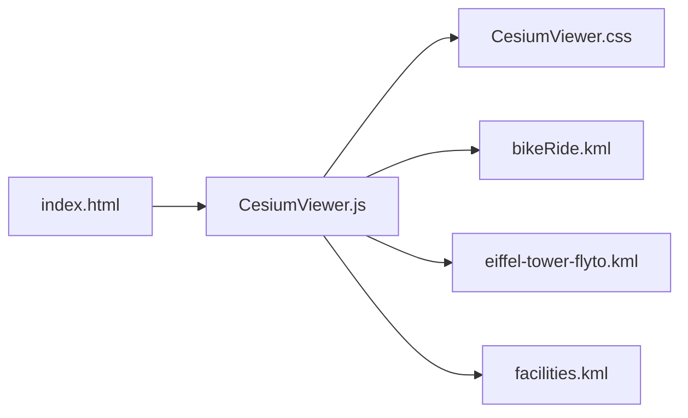

# KML导出与游览功能

<cite>
**本文档引用的文件**   
- [CesiumViewer.js](file://Apps/CesiumViewer/CesiumViewer.js)
- [index.html](file://Apps/CesiumViewer/index.html)
- [CesiumViewer.css](file://Apps/CesiumViewer/CesiumViewer.css)
- [bikeRide.kml](file://Apps/SampleData/kml/bikeRide.kml)
- [eiffel-tower-flyto.kml](file://Apps/SampleData/kml/eiffel-tower-flyto.kml)
- [facilities.kml](file://Apps/SampleData/kml/facilities/facilities.kml)
- [simple.kml](file://Specs/Data/KML/simple.kml)
- [networkLink.kml](file://Specs/Data/KML/networkLink.kml)
- [refresh.kml](file://Specs/Data/KML/refresh.kml)
- [externalStyle.kml](file://Specs/Data/KML/externalStyle.kml)
- [namespaced.kml](file://Specs/Data/KML/namespaced.kml)
- [duplicateNamespace.kml](file://Specs/Data/KML/duplicateNamespace.kml)
- [undeclaredNamespaces.kml](file://Specs/Data/KML/undeclaredNamespaces.kml)
- [unsupported.kml](file://Specs/Data/KML/unsupported.kml)
</cite>

## 目录
1. [简介](#简介)
2. [项目结构](#项目结构)
3. [核心组件](#核心组件)
4. [架构总览](#架构总览)
5. [详细组件分析](#详细组件分析)
6. [依赖关系分析](#依赖关系分析)
7. [性能考虑](#性能考虑)
8. [故障排查指南](#故障排查指南)
9. [结论](#结论)
10. [附录](#附录)

## 简介
本文件围绕“KML导出与游览功能”展开，聚焦于在 CesiumJS 应用中加载、展示与交互 KML 数据的能力。内容涵盖：
- KML 数据的组织与样例
- 应用入口与视图集成方式
- 典型浏览流程（从加载到渲染）
- 常见问题与优化建议

说明：本仓库包含大量示例数据与测试数据，其中 KML 相关样例位于 Apps/SampleData/kml 与 Specs/Data/KML 目录；应用入口位于 Apps/CesiumViewer。

## 项目结构
与 KML 游览相关的代码与数据主要分布在以下位置：
- 应用入口与界面：Apps/CesiumViewer
- KML 示例数据：Apps/SampleData/kml
- KML 测试数据：Specs/Data/KML

图表来源
- [index.html](file://Apps/CesiumViewer/index.html)
- [CesiumViewer.js](file://Apps/CesiumViewer/CesiumViewer.js)
- [CesiumViewer.css](file://Apps/CesiumViewer/CesiumViewer.css)

章节来源
- [index.html](file://Apps/CesiumViewer/index.html)
- [CesiumViewer.js](file://Apps/CesiumViewer/CesiumViewer.js)
- [CesiumViewer.css](file://Apps/CesiumViewer/CesiumViewer.css)

## 核心组件
- 应用入口 index.html：页面骨架与资源引入
- 应用脚本 CesiumViewer.js：初始化 Viewer、加载 KML 数据、绑定交互
- 样式表 CesiumViewer.css：界面布局与控件样式
- KML 样例数据：用于演示点、线、面、网络链接、刷新策略等能力

章节来源
- [index.html](file://Apps/CesiumViewer/index.html)
- [CesiumViewer.js](file://Apps/CesiumViewer/CesiumViewer.js)
- [CesiumViewer.css](file://Apps/CesiumViewer/CesiumViewer.css)
- [bikeRide.kml](file://Apps/SampleData/kml/bikeRide.kml)
- [eiffel-tower-flyto.kml](file://Apps/SampleData/kml/eiffel-tower-flyto.kml)
- [facilities.kml](file://Apps/SampleData/kml/facilities/facilities.kml)
- [simple.kml](file://Specs/Data/KML/simple.kml)
- [networkLink.kml](file://Specs/Data/KML/networkLink.kml)
- [refresh.kml](file://Specs/Data/KML/refresh.kml)
- [externalStyle.kml](file://Specs/Data/KML/externalStyle.kml)
- [namespaced.kml](file://Specs/Data/KML/namespaced.kml)
- [duplicateNamespace.kml](file://Specs/Data/KML/duplicateNamespace.kml)
- [undeclaredNamespaces.kml](file://Specs/Data/KML/undeclaredNamespaces.kml)
- [unsupported.kml](file://Specs/Data/KML/unsupported.kml)

## 架构总览
下图展示了 KML 游览的典型调用序列：页面加载后，应用脚本初始化地图并加载 KML 数据，随后将解析后的要素添加到场景中供用户交互。

图表来源
- [index.html](file://Apps/CesiumViewer/index.html)
- [CesiumViewer.js](file://Apps/CesiumViewer/CesiumViewer.js)
- [bikeRide.kml](file://Apps/SampleData/kml/bikeRide.kml)
- [eiffel-tower-flyto.kml](file://Apps/SampleData/kml/eiffel-tower-flyto.kml)
- [facilities.kml](file://Apps/SampleData/kml/facilities/facilities.kml)

## 详细组件分析

### 应用入口与界面
- index.html：定义页面结构与必要的脚本/样式引用
- CesiumViewer.css：为 Viewer 容器与 UI 控件提供基础样式
- CesiumViewer.js：负责初始化 Viewer、加载 KML、处理事件与交互

章节来源
- [index.html](file://Apps/CesiumViewer/index.html)
- [CesiumViewer.css](file://Apps/CesiumViewer/CesiumViewer.css)
- [CesiumViewer.js](file://Apps/CesiumViewer/CesiumViewer.js)

### KML 样例数据概览
- Apps/SampleData/kml：面向演示的 KML 样例，如骑行轨迹、飞行动作、设施标注等
- Specs/Data/KML：覆盖命名空间、外部样式、网络链接、刷新策略、不支持特性等边界用例

章节来源
- [bikeRide.kml](file://Apps/SampleData/kml/bikeRide.kml)
- [eiffel-tower-flyto.kml](file://Apps/SampleData/kml/eiffel-tower-flyto.kml)
- [facilities.kml](file://Apps/SampleData/kml/facilities/facilities.kml)
- [simple.kml](file://Specs/Data/KML/simple.kml)
- [networkLink.kml](file://Specs/Data/KML/networkLink.kml)
- [refresh.kml](file://Specs/Data/KML/refresh.kml)
- [externalStyle.kml](file://Specs/Data/KML/externalStyle.kml)
- [namespaced.kml](file://Specs/Data/KML/namespaced.kml)
- [duplicateNamespace.kml](file://Specs/Data/KML/duplicateNamespace.kml)
- [undeclaredNamespaces.kml](file://Specs/Data/KML/undeclaredNamespaces.kml)
- [unsupported.kml](file://Specs/Data/KML/unsupported.kml)

### KML 加载与渲染流程（概念流程图）

[本图为概念性流程，不直接映射具体源码文件]

## 依赖关系分析
- index.html 依赖 CesiumViewer.js 与 CesiumViewer.css
- CesiumViewer.js 依赖 KML 数据文件（相对路径或绝对 URL）
- 不同 KML 样例之间无强耦合，便于按需加载与替换

图表来源
- [index.html](file://Apps/CesiumViewer/index.html)
- [CesiumViewer.js](file://Apps/CesiumViewer/CesiumViewer.js)
- [CesiumViewer.css](file://Apps/CesiumViewer/CesiumViewer.css)
- [bikeRide.kml](file://Apps/SampleData/kml/bikeRide.kml)
- [eiffel-tower-flyto.kml](file://Apps/SampleData/kml/eiffel-tower-flyto.kml)
- [facilities.kml](file://Apps/SampleData/kml/facilities/facilities.kml)

章节来源
- [index.html](file://Apps/CesiumViewer/index.html)
- [CesiumViewer.js](file://Apps/CesiumViewer/CesiumViewer.js)
- [CesiumViewer.css](file://Apps/CesiumViewer/CesiumViewer.css)

## 性能考虑
- 按需加载：仅加载当前需要的 KML 文件，避免一次性载入过多数据
- 增量更新：利用 KML 的网络链接与刷新机制，减少全量重绘
- 样式简化：复杂样式会增加解析与渲染开销，建议在必要时使用
- 缓存策略：对静态 KML 启用浏览器缓存，降低重复请求

[本节为通用指导，不直接分析具体文件]

## 故障排查指南
- 跨域问题：确保 KML 服务允许跨域访问，或在本地服务器环境下运行
- 命名空间异常：检查 KML 是否声明了正确的命名空间，避免解析失败
- 外部样式不可用：确认外部样式资源可被正常访问
- 网络链接失效：校验 networkLink 的 URL 与刷新参数是否正确
- 不支持的特性：参考 unsupported.kml 中的用例，了解当前版本限制

章节来源
- [namespaced.kml](file://Specs/Data/KML/namespaced.kml)
- [duplicateNamespace.kml](file://Specs/Data/KML/duplicateNamespace.kml)
- [undeclaredNamespaces.kml](file://Specs/Data/KML/undeclaredNamespaces.kml)
- [externalStyle.kml](file://Specs/Data/KML/externalStyle.kml)
- [networkLink.kml](file://Specs/Data/KML/networkLink.kml)
- [refresh.kml](file://Specs/Data/KML/refresh.kml)
- [unsupported.kml](file://Specs/Data/KML/unsupported.kml)

## 结论
通过应用入口与脚本的配合，结合丰富的 KML 样例与测试数据，本项目提供了完整的 KML 游览能力。遵循按需加载、合理样式与缓存策略，可在保证用户体验的同时提升整体性能。对于命名空间、外部样式与网络链接等边界情况，建议参考测试数据进行验证与适配。

[本节为总结性内容，不直接分析具体文件]

## 附录
- 常用 KML 样例路径
  - 骑行轨迹：Apps/SampleData/kml/bikeRide.kml
  - 飞行漫游：Apps/SampleData/kml/eiffel-tower-flyto.kml
  - 设施标注：Apps/SampleData/kml/facilities/facilities.kml
- 测试用例路径
  - 基础用例：Specs/Data/KML/simple.kml
  - 网络链接与刷新：Specs/Data/KML/networkLink.kml, refresh.kml
  - 命名空间与样式：Specs/Data/KML/namespaced.kml, externalStyle.kml, duplicateNamespace.kml, undeclaredNamespaces.kml
  - 不支持特性：Specs/Data/KML/unsupported.kml

章节来源
- [bikeRide.kml](file://Apps/SampleData/kml/bikeRide.kml)
- [eiffel-tower-flyto.kml](file://Apps/SampleData/kml/eiffel-tower-flyto.kml)
- [facilities.kml](file://Apps/SampleData/kml/facilities/facilities.kml)
- [simple.kml](file://Specs/Data/KML/simple.kml)
- [networkLink.kml](file://Specs/Data/KML/networkLink.kml)
- [refresh.kml](file://Specs/Data/KML/refresh.kml)
- [externalStyle.kml](file://Specs/Data/KML/externalStyle.kml)
- [namespaced.kml](file://Specs/Data/KML/namespaced.kml)
- [duplicateNamespace.kml](file://Specs/Data/KML/duplicateNamespace.kml)
- [undeclaredNamespaces.kml](file://Specs/Data/KML/undeclaredNamespaces.kml)
- [unsupported.kml](file://Specs/Data/KML/unsupported.kml)