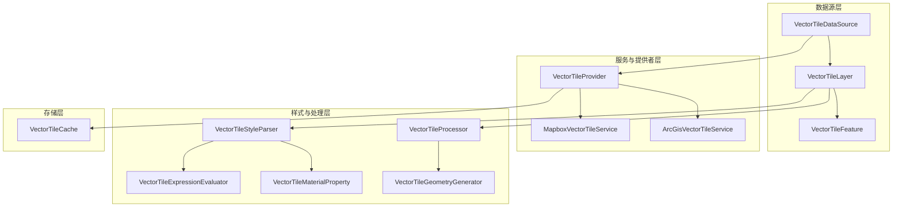
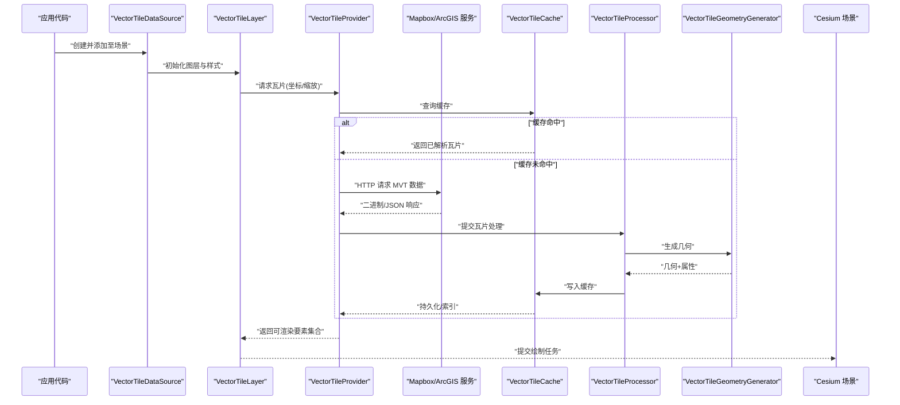
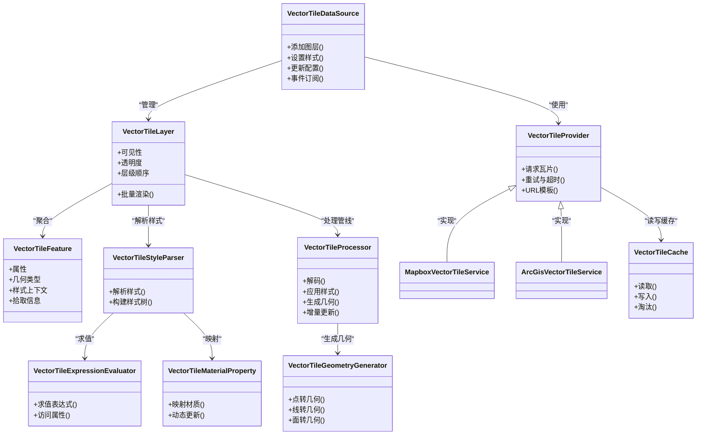

# VectorTileDataSource

<cite>
**本文引用的文件**   
- [index.js](file://packages/engine/Source/Scene/VectorTileDataSource/index.js)
- [VectorTileDataSource.js](file://packages/engine/Source/Scene/VectorTileDataSource/VectorTileDataSource.js)
- [VectorTileFeature.js](file://packages/engine/Source/Scene/VectorTileDataSource/VectorTileFeature.js)
- [VectorTileLayer.js](file://packages/engine/Source/Scene/VectorTileDataSource/VectorTileLayer.js)
- [VectorTileStyleParser.js](file://packages/engine/Source/Scene/VectorTileDataSource/VectorTileStyleParser.js)
- [VectorTileProvider.js](file://packages/engine/Source/Scene/VectorTileDataSource/VectorTileProvider.js)
- [MapboxVectorTileService.js](file://packages/engine/Source/Scene/VectorTileDataSource/MapboxVectorTileService.js)
- [ArcGisVectorTileService.js](file://packages/engine/Source/Scene/VectorTileDataSource/ArcGisVectorTileService.js)
- [VectorTileCache.js](file://packages/engine/Source/Scene/VectorTileDataSource/VectorTileCache.js)
- [VectorTileProcessor.js](file://packages/engine/Source/Scene/VectorTileDataSource/VectorTileProcessor.js)
- [VectorTileGeometryGenerator.js](file://packages/engine/Source/Scene/VectorTileDataSource/VectorTileGeometryGenerator.js)
- [VectorTileMaterialProperty.js](file://packages/engine/Source/Scene/VectorTileDataSource/VectorTileMaterialProperty.js)
- [VectorTileExpressionEvaluator.js](file://packages/engine/Source/Scene/VectorTileDataSource/VectorTileExpressionEvaluator.js)
</cite>

## 目录
1. [简介](#简介)
2. [项目结构](#项目结构)
3. [核心组件](#核心组件)
4. [架构总览](#架构总览)
5. [详细组件分析](#详细组件分析)
6. [依赖关系分析](#依赖关系分析)
7. [性能考虑](#性能考虑)
8. [故障排查指南](#故障排查指南)
9. [结论](#结论)
10. [附录](#附录)

## 简介
本文件为 Cesium 中 VectorTileDataSource 的权威 API 与实现文档，聚焦矢量瓦片数据的加载、样式化与渲染。内容涵盖：
- MVT（Mapbox Vector Tiles）格式支持与数据处理流程
- 样式引擎配置：符号化规则、分类渲染、表达式语法等高级能力
- 缓存机制、增量更新与性能优化策略
- 与主流地图服务（如 Mapbox、ArcGIS Vector Tile Service）的集成方法
- 矢量瓦片样式设计最佳实践与常见问题解决方案

## 项目结构
VectorTileDataSource 位于 packages/engine/Source/Scene/VectorTileDataSource 目录下，采用“数据源 + 提供者 + 样式解析 + 几何生成 + 缓存”的分层组织方式，便于扩展新的瓦片服务与样式规范。

图表来源
- [VectorTileDataSource.js](file://packages/engine/Source/Scene/VectorTileDataSource/VectorTileDataSource.js)
- [VectorTileLayer.js](file://packages/engine/Source/Scene/VectorTileDataSource/VectorTileLayer.js)
- [VectorTileFeature.js](file://packages/engine/Source/Scene/VectorTileDataSource/VectorTileFeature.js)
- [VectorTileProvider.js](file://packages/engine/Source/Scene/VectorTileDataSource/VectorTileProvider.js)
- [MapboxVectorTileService.js](file://packages/engine/Source/Scene/VectorTileDataSource/MapboxVectorTileService.js)
- [ArcGisVectorTileService.js](file://packages/engine/Source/Scene/VectorTileDataSource/ArcGisVectorTileService.js)
- [VectorTileStyleParser.js](file://packages/engine/Source/Scene/VectorTileDataSource/VectorTileStyleParser.js)
- [VectorTileExpressionEvaluator.js](file://packages/engine/Source/Scene/VectorTileDataSource/VectorTileExpressionEvaluator.js)
- [VectorTileMaterialProperty.js](file://packages/engine/Source/Scene/VectorTileDataSource/VectorTileMaterialProperty.js)
- [VectorTileProcessor.js](file://packages/engine/Source/Scene/VectorTileDataSource/VectorTileProcessor.js)
- [VectorTileGeometryGenerator.js](file://packages/engine/Source/Scene/VectorTileDataSource/VectorTileGeometryGenerator.js)
- [VectorTileCache.js](file://packages/engine/Source/Scene/VectorTileDataSource/VectorTileCache.js)

章节来源
- [index.js](file://packages/engine/Source/Scene/VectorTileDataSource/index.js)
- [VectorTileDataSource.js](file://packages/engine/Source/Scene/VectorTileDataSource/VectorTileDataSource.js)

## 核心组件
- VectorTileDataSource：对外暴露的数据源对象，负责图层注册、样式绑定、事件通知与生命周期管理。
- VectorTileLayer：承载具体瓦片集合与可见性、透明度、层级顺序等渲染控制。
- VectorTileFeature：单个要素的抽象，包含属性、几何类型、样式上下文与拾取信息。
- VectorTileProvider：统一的服务接口，屏蔽不同后端差异（Mapbox、ArcGIS 等）。
- MapboxVectorTileService / ArcGisVectorTileService：具体服务实现，负责 URL 构造、认证头、协议适配与错误码映射。
- VectorTileStyleParser：解析样式定义（如 Mapbox GL Style），将规则转换为内部样式描述。
- VectorTileExpressionEvaluator：表达式求值器，支持数值、字符串、布尔与数组/对象组合运算。
- VectorTileMaterialProperty：材质属性桥接，将样式结果映射到 Cesium 材质系统。
- VectorTileProcessor：瓦片处理管线，协调解码、样式应用、几何生成与合并。
- VectorTileGeometryGenerator：将 MVT 几何编码（点、线、面）转换为 Cesium 几何体。
- VectorTileCache：瓦片缓存，支持内存与可选持久化，提供命中统计与淘汰策略。

章节来源
- [VectorTileDataSource.js](file://packages/engine/Source/Scene/VectorTileDataSource/VectorTileDataSource.js)
- [VectorTileLayer.js](file://packages/engine/Source/Scene/VectorTileDataSource/VectorTileLayer.js)
- [VectorTileFeature.js](file://packages/engine/Source/Scene/VectorTileDataSource/VectorTileFeature.js)
- [VectorTileProvider.js](file://packages/engine/Source/Scene/VectorTileDataSource/VectorTileProvider.js)
- [MapboxVectorTileService.js](file://packages/engine/Source/Scene/VectorTileDataSource/MapboxVectorTileService.js)
- [ArcGisVectorTileService.js](file://packages/engine/Source/Scene/VectorTileDataSource/ArcGisVectorTileService.js)
- [VectorTileStyleParser.js](file://packages/engine/Source/Scene/VectorTileDataSource/VectorTileStyleParser.js)
- [VectorTileExpressionEvaluator.js](file://packages/engine/Source/Scene/VectorTileDataSource/VectorTileExpressionEvaluator.js)
- [VectorTileMaterialProperty.js](file://packages/engine/Source/Scene/VectorTileDataSource/VectorTileMaterialProperty.js)
- [VectorTileProcessor.js](file://packages/engine/Source/Scene/VectorTileDataSource/VectorTileProcessor.js)
- [VectorTileGeometryGenerator.js](file://packages/engine/Source/Scene/VectorTileDataSource/VectorTileGeometryGenerator.js)
- [VectorTileCache.js](file://packages/engine/Source/Scene/VectorTileDataSource/VectorTileCache.js)

## 架构总览
下图展示了从请求到渲染的关键调用链，以及各模块的职责边界。

图表来源
- [VectorTileDataSource.js](file://packages/engine/Source/Scene/VectorTileDataSource/VectorTileDataSource.js)
- [VectorTileLayer.js](file://packages/engine/Source/Scene/VectorTileDataSource/VectorTileLayer.js)
- [VectorTileProvider.js](file://packages/engine/Source/Scene/VectorTileDataSource/VectorTileProvider.js)
- [MapboxVectorTileService.js](file://packages/engine/Source/Scene/VectorTileDataSource/MapboxVectorTileService.js)
- [ArcGisVectorTileService.js](file://packages/engine/Source/Scene/VectorTileDataSource/ArcGisVectorTileService.js)
- [VectorTileCache.js](file://packages/engine/Source/Scene/VectorTileDataSource/VectorTileCache.js)
- [VectorTileProcessor.js](file://packages/engine/Source/Scene/VectorTileDataSource/VectorTileProcessor.js)
- [VectorTileGeometryGenerator.js](file://packages/engine/Source/Scene/VectorTileDataSource/VectorTileGeometryGenerator.js)

## 详细组件分析

### VectorTileDataSource 类
- 职责
  - 作为数据源入口，管理一个或多个 VectorTileLayer
  - 绑定样式定义（支持 Mapbox GL Style 或自定义 JSON）
  - 监听加载、错误、更新完成等事件
  - 提供动态更新接口（切换样式、过滤条件、可见性等）
- 关键行为
  - 初始化时解析样式并构建样式树
  - 按需创建/销毁图层实例
  - 与场景生命周期同步（帧更新、视口变化）
- 典型用法路径
  - 创建数据源 -> 设置样式 -> 添加到场景 -> 监听事件 -> 运行时更新

章节来源
- [VectorTileDataSource.js](file://packages/engine/Source/Scene/VectorTileDataSource/VectorTileDataSource.js)

### VectorTileLayer 与 VectorTileFeature
- VectorTileLayer
  - 维护当前可视范围内的瓦片集合
  - 控制透明度、层级顺序、显示/隐藏
  - 聚合要素并批量提交渲染
- VectorTileFeature
  - 封装要素属性、几何类型、样式上下文
  - 支持拾取、高亮、交互回调
  - 与表达式求值器联动，动态计算样式值

章节来源
- [VectorTileLayer.js](file://packages/engine/Source/Scene/VectorTileDataSource/VectorTileLayer.js)
- [VectorTileFeature.js](file://packages/engine/Source/Scene/VectorTileDataSource/VectorTileFeature.js)

### 服务与提供者：VectorTileProvider、MapboxVectorTileService、ArcGisVectorTileService
- VectorTileProvider
  - 抽象统一的瓦片获取接口
  - 负责 URL 模板、参数替换、并发控制、重试与超时
- MapboxVectorTileService
  - 适配 Mapbox Vector Tile 协议
  - 支持访问令牌、子域轮询、压缩传输
- ArcGisVectorTileService
  - 适配 ArcGIS Vector Tile Service
  - 支持多分辨率切片方案、认证与跨域策略

章节来源
- [VectorTileProvider.js](file://packages/engine/Source/Scene/VectorTileDataSource/VectorTileProvider.js)
- [MapboxVectorTileService.js](file://packages/engine/Source/Scene/VectorTileDataSource/MapboxVectorTileService.js)
- [ArcGisVectorTileService.js](file://packages/engine/Source/Scene/VectorTileDataSource/ArcGisVectorTileService.js)

### 样式引擎：VectorTileStyleParser、VectorTileExpressionEvaluator、VectorTileMaterialProperty
- VectorTileStyleParser
  - 解析样式规则（如 fill、line、symbol）
  - 将分类渲染（基于字段值）与过渡状态映射为内部描述
- VectorTileExpressionEvaluator
  - 支持表达式语法：字面量、变量引用、函数调用、逻辑与算术运算
  - 对要素属性进行求值，输出颜色、宽度、不透明度、文本等
- VectorTileMaterialProperty
  - 将样式结果桥接到 Cesium 材质系统
  - 支持动态材质更新与批量化

章节来源
- [VectorTileStyleParser.js](file://packages/engine/Source/Scene/VectorTileDataSource/VectorTileStyleParser.js)
- [VectorTileExpressionEvaluator.js](file://packages/engine/Source/Scene/VectorTileDataSource/VectorTileExpressionEvaluator.js)
- [VectorTileMaterialProperty.js](file://packages/engine/Source/Scene/VectorTileDataSource/VectorTileMaterialProperty.js)

### 处理与几何：VectorTileProcessor、VectorTileGeometryGenerator
- VectorTileProcessor
  - 编排解码、样式应用、几何生成、合并与剔除
  - 支持增量更新：仅重算变更要素
- VectorTileGeometryGenerator
  - 将 MVT 编码的几何（点、折线、多边形）转为 Cesium 几何体
  - 处理坐标转换、法线计算、索引优化

章节来源
- [VectorTileProcessor.js](file://packages/engine/Source/Scene/VectorTileDataSource/VectorTileProcessor.js)
- [VectorTileGeometryGenerator.js](file://packages/engine/Source/Scene/VectorTileDataSource/VectorTileGeometryGenerator.js)

### 缓存：VectorTileCache
- 功能
  - 内存缓存瓦片解析结果（几何+样式）
  - 可选持久化（IndexedDB/文件系统）
  - LRU/LFU 淘汰策略与容量限制
- 指标
  - 命中率、平均延迟、内存占用
  - 失效与重建事件

章节来源
- [VectorTileCache.js](file://packages/engine/Source/Scene/VectorTileDataSource/VectorTileCache.js)

## 依赖关系分析
- 耦合度
  - DataSource 与 Layer 低耦合，通过事件与配置通信
  - Provider 与服务实现解耦，便于新增第三方服务
  - 样式解析与几何生成分离，利于独立测试与优化
- 外部依赖
  - HTTP 客户端（用于服务请求）
  - MVT 解码库（由服务或处理器内部使用）
  - Cesium 场景与材质系统（渲染阶段）

图表来源
- [VectorTileDataSource.js](file://packages/engine/Source/Scene/VectorTileDataSource/VectorTileDataSource.js)
- [VectorTileLayer.js](file://packages/engine/Source/Scene/VectorTileDataSource/VectorTileLayer.js)
- [VectorTileFeature.js](file://packages/engine/Source/Scene/VectorTileDataSource/VectorTileFeature.js)
- [VectorTileProvider.js](file://packages/engine/Source/Scene/VectorTileDataSource/VectorTileProvider.js)
- [MapboxVectorTileService.js](file://packages/engine/Source/Scene/VectorTileDataSource/MapboxVectorTileService.js)
- [ArcGisVectorTileService.js](file://packages/engine/Source/Scene/VectorTileDataSource/ArcGisVectorTileService.js)
- [VectorTileStyleParser.js](file://packages/engine/Source/Scene/VectorTileDataSource/VectorTileStyleParser.js)
- [VectorTileExpressionEvaluator.js](file://packages/engine/Source/Scene/VectorTileDataSource/VectorTileExpressionEvaluator.js)
- [VectorTileMaterialProperty.js](file://packages/engine/Source/Scene/VectorTileDataSource/VectorTileMaterialProperty.js)
- [VectorTileProcessor.js](file://packages/engine/Source/Scene/VectorTileDataSource/VectorTileProcessor.js)
- [VectorTileGeometryGenerator.js](file://packages/engine/Source/Scene/VectorTileDataSource/VectorTileGeometryGenerator.js)
- [VectorTileCache.js](file://packages/engine/Source/Scene/VectorTileDataSource/VectorTileCache.js)

## 性能考虑
- 瓦片缓存
  - 启用内存缓存，合理设置最大条目数与单条大小上限
  - 对热点区域开启持久化缓存，降低重复网络开销
- 增量更新
  - 利用处理器增量模式，仅重算变更要素，减少几何重建
- 样式求值优化
  - 预编译常用表达式，避免每帧重复解析
  - 对分类渲染使用查找表，减少分支判断
- 几何生成
  - 合并相邻小图元，减少 draw call
  - 使用索引缓冲与顶点复用
- 网络与并发
  - 限制并发请求数，避免雪崩
  - 启用 gzip/br 压缩，缩短传输时间
- 渲染批次
  - 按材质与图层分组，提升 GPU 批处理效率

[本节为通用指导，无需源码引用]

## 故障排查指南
- 常见错误
  - 瓦片加载失败：检查 URL 模板、认证头、跨域策略与服务器状态码
  - 样式解析异常：确认样式 JSON 结构与字段命名符合规范
  - 表达式求值错误：验证属性名存在性与数据类型
  - 几何生成异常：检查 MVT 编码完整性与坐标系一致性
- 定位手段
  - 启用调试日志，记录请求/响应与解析步骤
  - 使用缓存命中率与内存占用指标评估瓶颈
  - 针对特定图层/要素缩小范围复现问题
- 恢复策略
  - 自动重试与退避
  - 降级样式或回退到默认样式
  - 清空局部缓存后重试

章节来源
- [VectorTileProvider.js](file://packages/engine/Source/Scene/VectorTileDataSource/VectorTileProvider.js)
- [VectorTileStyleParser.js](file://packages/engine/Source/Scene/VectorTileDataSource/VectorTileStyleParser.js)
- [VectorTileExpressionEvaluator.js](file://packages/engine/Source/Scene/VectorTileDataSource/VectorTileExpressionEvaluator.js)
- [VectorTileGeometryGenerator.js](file://packages/engine/Source/Scene/VectorTileDataSource/VectorTileGeometryGenerator.js)
- [VectorTileCache.js](file://packages/engine/Source/Scene/VectorTileDataSource/VectorTileCache.js)

## 结论
VectorTileDataSource 在 Cesium 中提供了完整的矢量瓦片数据接入与渲染能力。通过清晰的分层设计与可扩展的服务/样式体系，既能满足 Mapbox、ArcGIS 等主流服务的快速集成，也能支撑复杂样式与高性能渲染需求。建议在生产环境中结合缓存与增量更新策略，持续监控性能指标，并根据业务场景定制样式与几何生成流程。

[本节为总结，无需源码引用]

## 附录

### MVT 格式支持与数据处理流程
- 支持情况
  - 兼容 Mapbox Vector Tiles 规范
  - 支持点、线、面几何类型与属性表
- 处理流程
  - 请求瓦片 -> 解码 MVT -> 应用样式 -> 生成几何 -> 合并与剔除 -> 提交渲染
  - 缓存命中则跳过解码与样式求值，直接复用几何与材质

章节来源
- [VectorTileProvider.js](file://packages/engine/Source/Scene/VectorTileDataSource/VectorTileProvider.js)
- [VectorTileProcessor.js](file://packages/engine/Source/Scene/VectorTileDataSource/VectorTileProcessor.js)
- [VectorTileGeometryGenerator.js](file://packages/engine/Source/Scene/VectorTileDataSource/VectorTileGeometryGenerator.js)

### 样式引擎配置要点
- 符号化规则
  - 填充、描边、图标、文本标签
  - 分层渲染与优先级控制
- 分类渲染
  - 基于字段值的区间/枚举分类
  - 动态阈值与断点调整
- 表达式语法
  - 支持基础运算、条件判断、字符串与日期函数
  - 属性访问与默认值兜底

章节来源
- [VectorTileStyleParser.js](file://packages/engine/Source/Scene/VectorTileDataSource/VectorTileStyleParser.js)
- [VectorTileExpressionEvaluator.js](file://packages/engine/Source/Scene/VectorTileDataSource/VectorTileExpressionEvaluator.js)
- [VectorTileMaterialProperty.js](file://packages/engine/Source/Scene/VectorTileDataSource/VectorTileMaterialProperty.js)

### 与地图服务集成方法
- Mapbox
  - 配置访问令牌与子域
  - 使用标准 MVT 端点与缩放级别
- ArcGIS Vector Tile Service
  - 配置服务根 URL 与资源 ID
  - 处理认证与跨域策略

章节来源
- [MapboxVectorTileService.js](file://packages/engine/Source/Scene/VectorTileDataSource/MapboxVectorTileService.js)
- [ArcGisVectorTileService.js](file://packages/engine/Source/Scene/VectorTileDataSource/ArcGisVectorTileService.js)

### 最佳实践与常见问题
- 最佳实践
  - 预编译样式与表达式
  - 合理划分图层与样式粒度
  - 使用缓存与增量更新
- 常见问题
  - 样式不生效：检查字段名与数据类型
  - 渲染卡顿：减少复杂表达式与过多图层
  - 内存增长：控制缓存容量与清理策略

章节来源
- [VectorTileCache.js](file://packages/engine/Source/Scene/VectorTileDataSource/VectorTileCache.js)
- [VectorTileProcessor.js](file://packages/engine/Source/Scene/VectorTileDataSource/VectorTileProcessor.js)
- [VectorTileStyleParser.js](file://packages/engine/Source/Scene/VectorTileDataSource/VectorTileStyleParser.js)