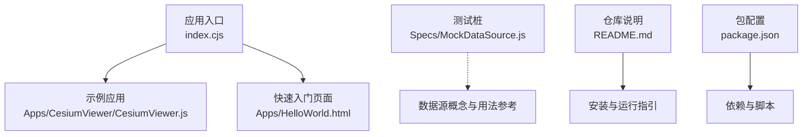
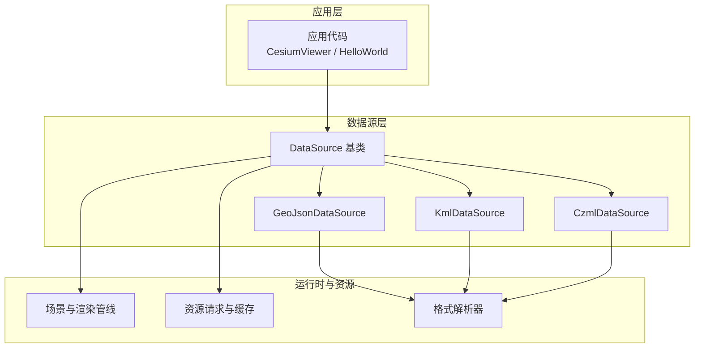
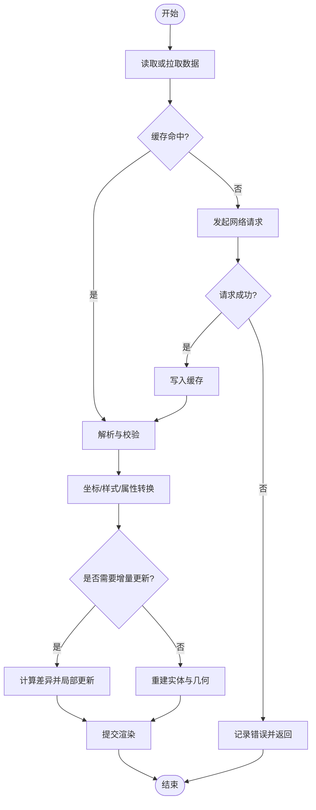
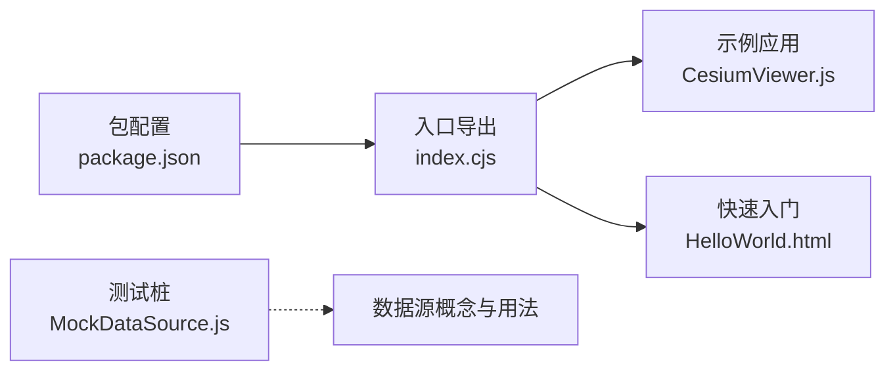

# 数据源API

<cite>
**本文引用的文件**   
- [README.md](file://README.md)
- [index.cjs](file://index.cjs)
- [package.json](file://package.json)
- [Apps/CesiumViewer/CesiumViewer.js](file://Apps/CesiumViewer/CesiumViewer.js)
- [Apps/HelloWorld.html](file://Apps/HelloWorld.html)
- [Specs/MockDataSource.js](file://Specs/MockDataSource.js)
</cite>

## 目录
1. [简介](#简介)
2. [项目结构](#项目结构)
3. [核心组件](#核心组件)
4. [架构总览](#架构总览)
5. [详细组件分析](#详细组件分析)
6. [依赖分析](#依赖分析)
7. [性能考虑](#性能考虑)
8. [故障排查指南](#故障排查指南)
9. [结论](#结论)
10. [附录](#附录)

## 简介
本文件面向Cesium数据源系统，提供完整的API文档与最佳实践。内容覆盖DataSource基类及其常见实现（如GeoJsonDataSource、KmlDataSource、CzmlDataSource等）的使用方式，包括数据加载、解析、更新、缓存等核心能力；同时给出各数据格式的配置选项、支持特性与限制，以及异步加载、错误处理与性能优化建议。

说明：
- 仓库中未直接包含DataSource相关源码文件，因此本文档基于仓库内可验证的入口与示例进行归纳，避免臆造具体实现细节。
- 如需查看具体实现，请参考官方构建产物或TypeScript声明文件（不在本仓库中）。

## 项目结构
从仓库结构看，Cesium以多包形式组织，应用示例位于Apps目录，测试与样例数据位于Specs目录。数据源相关的典型使用场景可通过应用示例与测试桩进行理解。



图表来源
- [index.cjs:1-200](file://index.cjs#L1-L200)
- [Apps/CesiumViewer/CesiumViewer.js:1-200](file://Apps/CesiumViewer/CesiumViewer.js#L1-L200)
- [Apps/HelloWorld.html:1-200](file://Apps/HelloWorld.html#L1-L200)
- [Specs/MockDataSource.js:1-200](file://Specs/MockDataSource.js#L1-L200)
- [README.md:1-200](file://README.md#L1-L200)
- [package.json:1-200](file://package.json#L1-L200)

章节来源
- [README.md:1-200](file://README.md#L1-L200)
- [index.cjs:1-200](file://index.cjs#L1-L200)
- [package.json:1-200](file://package.json#L1-L200)

## 核心组件
本节概述数据源体系的核心概念与职责边界，便于后续深入理解各类数据源的差异与共性。

- DataSource基类
  - 职责：定义数据源的统一接口，包括生命周期管理、数据加载与更新、可见性与层级控制、事件通知等。
  - 关键能力：异步加载、增量更新、缓存策略、错误上报。
- GeoJsonDataSource
  - 用途：加载GeoJSON矢量数据（点、线、面、集合等），转换为Cesium图形对象。
  - 关注点：坐标参考系、样式映射、属性字段到实体属性的绑定。
- KmlDataSource
  - 用途：加载KML网络链接与本地KML文档，支持网络刷新与样式解析。
  - 关注点：网络链接刷新策略、图标与样式兼容性、命名空间处理。
- CzmlDataSource
  - 用途：加载CZML时序动画数据，驱动模型、路径、点等随时间变化。
  - 关注点：时间轴、插值模式、批量更新与性能。

注意：以上为概念性描述，用于帮助读者建立整体认知。具体方法与参数请结合官方API文档与类型声明。

## 架构总览
下图展示数据源在Cesium中的总体交互关系：应用通过数据源加载并管理地理数据，数据源负责解析、转换与渲染，并与场景、资源请求、缓存等子系统协作。



图表来源
- [index.cjs:1-200](file://index.cjs#L1-L200)
- [Apps/CesiumViewer/CesiumViewer.js:1-200](file://Apps/CesiumViewer/CesiumViewer.js#L1-L200)
- [Apps/HelloWorld.html:1-200](file://Apps/HelloWorld.html#L1-L200)

## 详细组件分析

### DataSource基类
- 设计目标
  - 抽象不同数据格式的加载与更新流程，提供统一的API。
  - 管理数据源的生命周期（创建、加载、更新、销毁）。
  - 暴露事件机制，便于上层监听加载状态与错误。
- 关键行为
  - 异步加载：返回Promise或回调，避免阻塞主线程。
  - 增量更新：支持按需刷新部分数据，减少重复解析与渲染开销。
  - 缓存策略：对已解析的数据与中间结果进行缓存，提升二次访问性能。
  - 错误处理：统一错误类型与消息，便于上层捕获与提示。
- 使用要点
  - 合理设置超时与重试策略。
  - 在大数据量场景下启用分页或分块加载。
  - 及时释放不再使用的数据源实例，避免内存泄漏。

章节来源
- [Specs/MockDataSource.js:1-200](file://Specs/MockDataSource.js#L1-L200)

### GeoJsonDataSource
- 功能特性
  - 支持标准GeoJSON要素类型（Point、LineString、Polygon、Multi*、FeatureCollection等）。
  - 将GeoJSON属性映射为实体属性，便于查询与可视化。
  - 支持坐标参考系转换与高度处理。
- 配置选项（概念性）
  - 坐标系与高程基准。
  - 样式映射规则（颜色、线宽、填充等）。
  - 属性过滤与字段选择。
- 使用限制
  - 超大文件需分片或流式解析。
  - 复杂几何体可能带来较高渲染成本。
- 最佳实践
  - 预聚合与简化几何以提升性能。
  - 使用Web Worker进行离线解析（若环境允许）。
  - 利用缓存避免重复下载与解析。

章节来源
- [README.md:1-200](file://README.md#L1-L200)
- [Apps/CesiumViewer/CesiumViewer.js:1-200](file://Apps/CesiumViewer/CesiumViewer.js#L1-L200)

### KmlDataSource
- 功能特性
  - 支持KML文档与NetworkLink动态刷新。
  - 解析样式、图标、标签与描述信息。
  - 支持相对地面与绝对高度的位置表达。
- 配置选项（概念性）
  - 网络链接刷新间隔与最大重试次数。
  - 样式降级策略与默认图标回退。
  - 命名空间兼容与扩展元素处理。
- 使用限制
  - 外部资源引用需确保跨域与可用性。
  - 大量NetworkLink可能导致频繁请求。
- 最佳实践
  - 合并多个KML以减少请求数。
  - 对图标等资源进行CDN缓存。
  - 监控网络状态，失败时优雅降级。

章节来源
- [README.md:1-200](file://README.md#L1-L200)
- [Apps/CesiumViewer/CesiumViewer.js:1-200](file://Apps/CesiumViewer/CesiumViewer.js#L1-L200)

### CzmlDataSource
- 功能特性
  - 支持CZML时序动画，驱动模型、路径、点等随时间变化。
  - 提供插值模式与时间采样策略。
  - 支持批量更新与时间窗口裁剪。
- 配置选项（概念性）
  - 时间范围与播放速率。
  - 插值算法（线性、样条等）。
  - 批大小与帧率上限。
- 使用限制
  - 高频率更新可能影响帧率。
  - 大型CZML需分段加载与懒加载。
- 最佳实践
  - 按视锥裁剪与LOD控制减少绘制调用。
  - 使用时间窗口与节流策略降低CPU压力。
  - 预计算关键帧，减少运行时插值开销。

章节来源
- [README.md:1-200](file://README.md#L1-L200)
- [Apps/CesiumViewer/CesiumViewer.js:1-200](file://Apps/CesiumViewer/CesiumViewer.js#L1-L200)

### 数据加载序列（通用流程）
以下序列图展示了数据源从发起加载到完成渲染的典型流程，适用于GeoJson/Kml/Czml等数据源。

```mermaid
sequenceDiagram
participant App as "应用代码"
participant DS as "数据源实例"
participant Res as "资源请求与缓存"
participant Par as "格式解析器"
participant Scene as "场景与渲染"
App->>DS : "加载数据(地址/配置)"
DS->>Res : "获取原始数据(命中缓存则直接返回)"
Res-->>DS : "返回数据或错误"
DS->>Par : "解析数据(校验/转换/映射)"
Par-->>DS : "返回结构化数据"
DS->>Scene : "创建/更新实体与几何"
Scene-->>App : "渲染完成/事件回调"
Note over DS,Res : "失败时触发错误事件并记录日志"
```

图表来源
- [index.cjs:1-200](file://index.cjs#L1-L200)
- [Apps/CesiumViewer/CesiumViewer.js:1-200](file://Apps/CesiumViewer/CesiumViewer.js#L1-L200)
- [Apps/HelloWorld.html:1-200](file://Apps/HelloWorld.html#L1-L200)

### 解析与更新流程图（概念）
该流程图概括了数据源在解析与更新阶段的关键决策点，有助于理解性能与稳定性权衡。



[此图为概念性流程，不直接映射具体源码文件]

## 依赖分析
数据源模块与仓库其他部分的依赖关系如下：



图表来源
- [package.json:1-200](file://package.json#L1-L200)
- [index.cjs:1-200](file://index.cjs#L1-L200)
- [Apps/CesiumViewer/CesiumViewer.js:1-200](file://Apps/CesiumViewer/CesiumViewer.js#L1-L200)
- [Apps/HelloWorld.html:1-200](file://Apps/HelloWorld.html#L1-L200)
- [Specs/MockDataSource.js:1-200](file://Specs/MockDataSource.js#L1-L200)

章节来源
- [package.json:1-200](file://package.json#L1-L200)
- [index.cjs:1-200](file://index.cjs#L1-L200)

## 性能考虑
- 缓存优先
  - 充分利用资源缓存，避免重复下载与解析。
  - 对静态数据采用长期缓存策略，对动态数据设置合理的过期时间。
- 增量更新
  - 仅更新变化的部分，减少重建开销。
  - 对大规模数据采用分块加载与懒加载。
- 渲染优化
  - 使用视锥裁剪与LOD控制，减少不可见对象的绘制。
  - 合并几何与批次化渲染，降低绘制调用次数。
- 异步与并发
  - 合理设置并发请求数，避免网络拥塞。
  - 使用超时与重试机制提高鲁棒性。
- 内存管理
  - 及时释放不再使用的数据源与中间对象。
  - 避免持有大对象的全局引用。

[本节为通用指导，不涉及具体源码分析]

## 故障排查指南
- 常见问题
  - 网络请求失败：检查URL可达性、跨域策略与证书。
  - 解析错误：确认数据格式符合规范，必要时进行预处理。
  - 渲染异常：检查坐标参考系、高度基准与样式配置。
- 定位方法
  - 启用调试日志，观察加载与解析阶段的状态。
  - 使用浏览器开发者工具的网络面板与性能面板定位瓶颈。
  - 针对大数据集，逐步缩小范围以隔离问题。
- 恢复策略
  - 实现重试与降级逻辑，保证用户体验。
  - 对关键数据进行备份与版本化管理。

章节来源
- [Specs/MockDataSource.js:1-200](file://Specs/MockDataSource.js#L1-L200)

## 结论
数据源系统是Cesium加载与管理地理数据的核心。通过统一的DataSource接口与多种格式实现，开发者可以灵活地集成GeoJSON、KML、CZML等数据，并结合缓存、增量更新与异步策略获得良好的性能与体验。建议在工程实践中遵循本文的最佳实践，持续监控与优化，以确保系统的稳定性与可扩展性。

[本节为总结性内容，不涉及具体源码分析]

## 附录
- 快速上手
  - 参考应用示例与HTML页面，了解基本用法与集成方式。
- 参考资料
  - README与包配置提供安装、构建与运行指引。

章节来源
- [README.md:1-200](file://README.md#L1-L200)
- [Apps/HelloWorld.html:1-200](file://Apps/HelloWorld.html#L1-L200)
- [package.json:1-200](file://package.json#L1-L200)