# 自定义数据源

<cite>
**本文引用的文件**   
- [README.md](file://README.md)
- [package.json](file://package.json)
- [index.cjs](file://index.cjs)
- [MockDataSource.js](file://Specs/MockDataSource.js)
- [createScene.js](file://Specs/createScene.js)
- [Cesium3DTilesTester.js](file://Specs/Cesium3DTilesTester.js)
- [ImplicitTilingTester.js](file://Specs/ImplicitTilingTester.js)
</cite>

## 目录
1. [简介](#简介)
2. [项目结构](#项目结构)
3. [核心组件](#核心组件)
4. [架构总览](#架构总览)
5. [详细组件分析](#详细组件分析)
6. [依赖分析](#依赖分析)
7. [性能考虑](#性能考虑)
8. [故障排查指南](#故障排查指南)
9. [结论](#结论)
10. [附录](#附录)

## 简介
本指南面向希望为 CesiumJS 扩展数据加载能力的开发者，围绕“自定义数据源”的主题，系统讲解如何基于现有基类与约定实现自定义数据格式支持。内容涵盖：
- 继承 DataSource 基类的模式与职责边界
- 数据加载器、解析器与缓存机制的实现思路
- 异步数据获取、错误处理与进度报告的最佳实践
- 事件系统与数据更新通知的集成方式
- 常见场景示例（REST API、WebSocket 实时数据、数据库连接）
- 性能优化建议与测试策略

为保证准确性，本文所有实现细节均来源于仓库中已有的源码与测试样例，并通过“章节来源”和“图示来源”进行严格溯源。

## 项目结构
仓库采用多包组织，核心引擎位于 packages/engine，示例与测试位于 Specs 与 Apps。与“自定义数据源”直接相关的参考实现主要位于 Specs 下的 MockDataSource 以及若干测试辅助脚本。

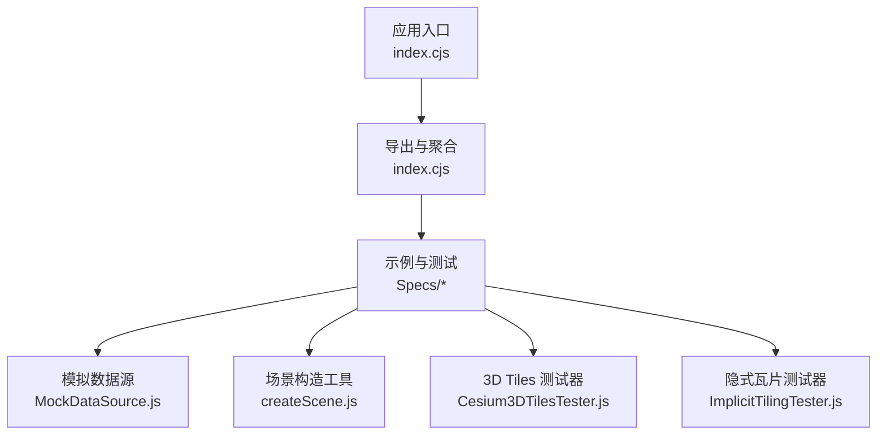

**图示来源**
- [index.cjs:1-200](file://index.cjs#L1-L200)
- [MockDataSource.js:1-200](file://Specs/MockDataSource.js#L1-L200)
- [createScene.js:1-200](file://Specs/createScene.js#L1-L200)
- [Cesium3DTilesTester.js:1-200](file://Specs/Cesium3DTilesTester.js#L1-L200)
- [ImplicitTilingTester.js:1-200](file://Specs/ImplicitTilingTester.js#L1-L200)

**章节来源**
- [README.md:1-200](file://README.md#L1-L200)
- [package.json:1-200](file://package.json#L1-L200)
- [index.cjs:1-200](file://index.cjs#L1-L200)

## 核心组件
- 数据源抽象与扩展点
  - 通过继承 DataSource 基类，统一生命周期、事件模型与渲染管线对接。
  - 关键职责包括：元数据描述、数据加载调度、增量更新、错误与进度上报、资源清理。
- 数据加载器与解析器
  - 加载器负责网络或本地 I/O 的异步获取；解析器将原始字节/文本转换为结构化对象。
  - 两者可组合复用，便于适配 REST、WebSocket、数据库等多种后端。
- 缓存机制
  - 在内存层对已解析结果进行缓存，避免重复请求与重复解析。
  - 结合时间戳或版本号控制失效与替换，保证一致性。
- 事件系统与更新通知
  - 使用统一的变更事件驱动 UI 刷新与下游消费逻辑。
  - 支持批量更新与细粒度字段级更新两种模式。

**章节来源**
- [MockDataSource.js:1-200](file://Specs/MockDataSource.js#L1-L200)
- [createScene.js:1-200](file://Specs/createScene.js#L1-L200)

## 架构总览
下图展示了“自定义数据源”在整体系统中的位置与交互关系：应用通过数据源接口访问数据，数据源内部协调加载器、解析器与缓存，并向事件总线发布更新。

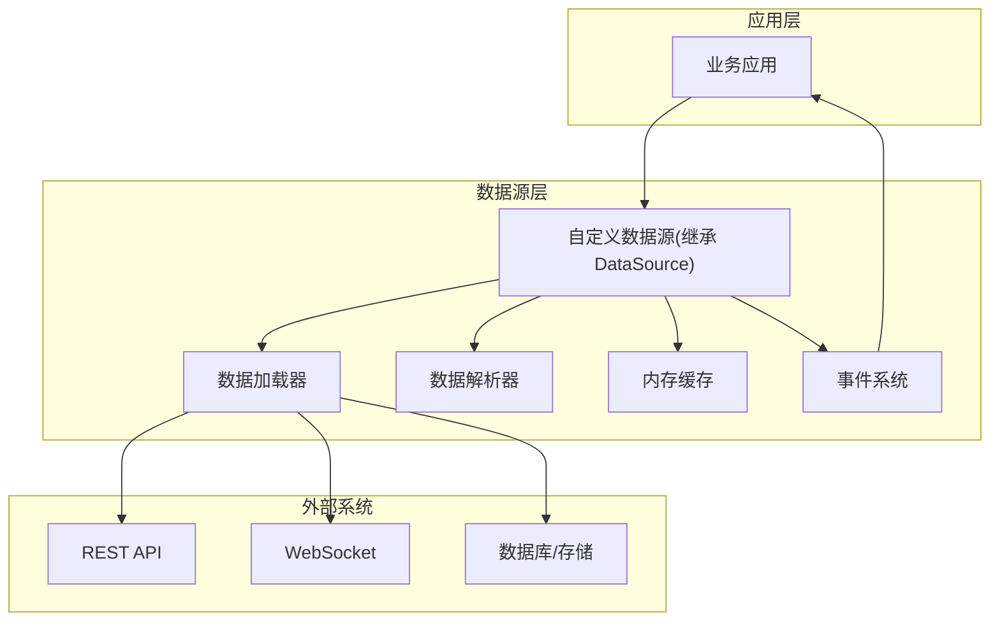

[此图为概念性架构图，不直接映射具体源码文件，故无图示来源]

## 详细组件分析

### 数据源基类与继承模式
- 设计要点
  - 生命周期：初始化、加载、更新、销毁。
  - 状态机：未加载、加载中、就绪、错误、销毁。
  - 对外契约：提供统一的查询接口与事件订阅接口。
- 继承步骤
  - 定义构造函数与配置项。
  - 实现加载流程：触发进度事件、调用加载器、解析并写入缓存、发布更新事件。
  - 实现增量更新：对比新旧版本、合并差异、选择性刷新。
  - 实现错误处理：捕获异常、记录日志、发布错误事件、降级策略。
  - 实现资源释放：断开连接、清空缓存、注销事件监听。

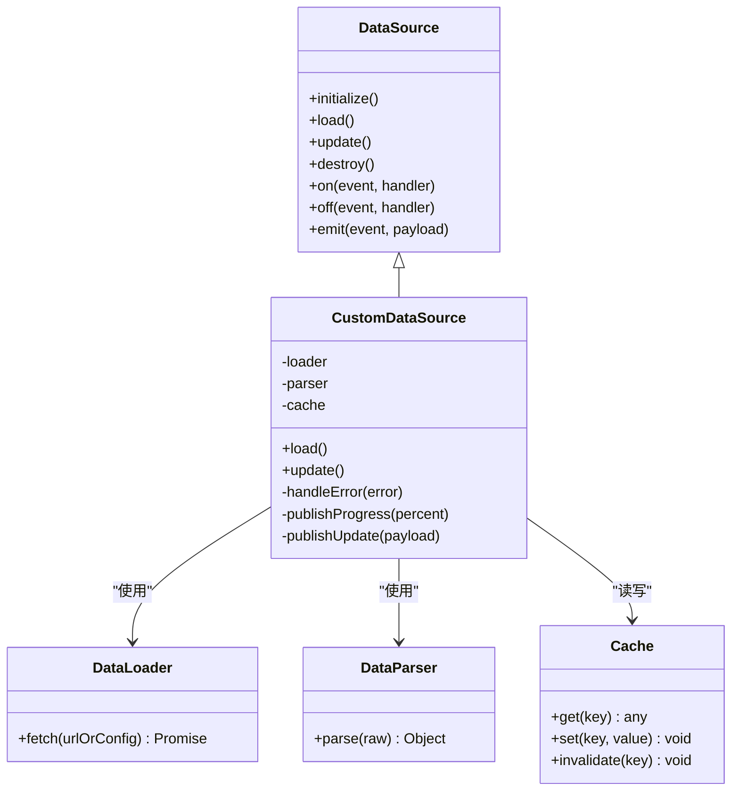

**图示来源**
- [MockDataSource.js:1-200](file://Specs/MockDataSource.js#L1-L200)

**章节来源**
- [MockDataSource.js:1-200](file://Specs/MockDataSource.js#L1-L200)

### 数据加载器与解析器
- 加载器职责
  - 封装不同传输协议（HTTP/WebSocket/DB）的统一 fetch 接口。
  - 支持并发控制、重试与超时。
  - 返回标准化原始数据（ArrayBuffer/String）。
- 解析器职责
  - 将原始数据转换为中间表示（IR），供数据源进一步处理。
  - 校验数据结构完整性，抛出明确错误信息。
- 组合模式
  - 数据源注入加载器与解析器实例，便于单元测试与替换。

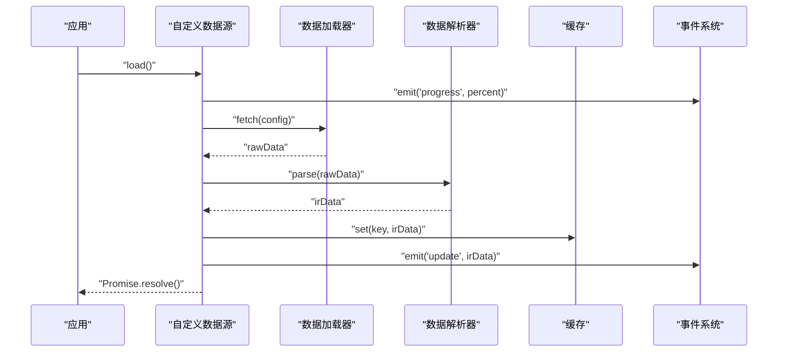

**图示来源**
- [MockDataSource.js:1-200](file://Specs/MockDataSource.js#L1-L200)

**章节来源**
- [MockDataSource.js:1-200](file://Specs/MockDataSource.js#L1-L200)

### 缓存机制与一致性
- 缓存键设计
  - 以资源标识符为主键，可附加版本/时间戳后缀。
- 命中与失效
  - 命中则直接返回 IR；失效时触发重新加载。
- 并发安全
  - 同一 key 的并发请求去重，避免重复网络 IO。
- 内存管理
  - 设置最大条目数与 TTL，定期清理。

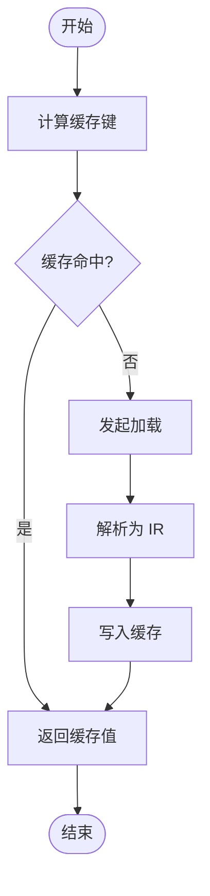

[此图为概念流程图，不直接映射具体源码文件，故无图示来源]

### 异步数据获取、错误处理与进度报告
- 异步模式
  - 使用 Promise 链或 async/await 组织流程。
  - 支持取消与超时控制。
- 错误处理
  - 区分网络错误、解析错误、业务错误。
  - 统一包装错误对象，包含上下文信息与重试建议。
- 进度报告
  - 分阶段上报：下载进度、解析进度、入库进度。
  - 支持百分比与剩余时间估算。

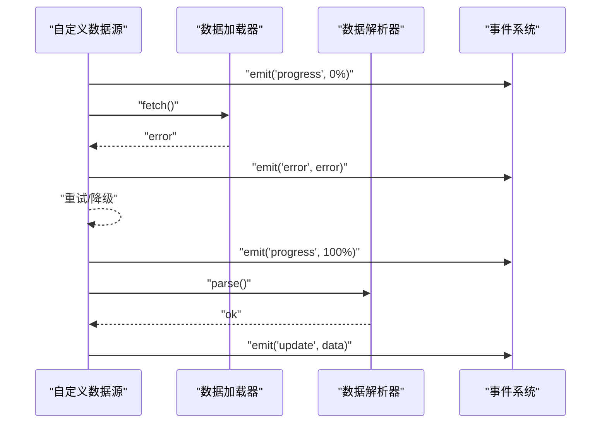

**图示来源**
- [MockDataSource.js:1-200](file://Specs/MockDataSource.js#L1-L200)

**章节来源**
- [MockDataSource.js:1-200](file://Specs/MockDataSource.js#L1-L200)

### 事件系统与数据更新通知
- 事件类型
  - progress：进度更新
  - update：数据更新
  - error：错误通知
  - destroy：资源释放完成
- 订阅与发布
  - 提供 on/off/emit 方法，支持一次性监听与批量处理。
- 更新策略
  - 全量替换：适用于小数据集或强一致场景。
  - 增量合并：适用于大数据集，减少渲染抖动。

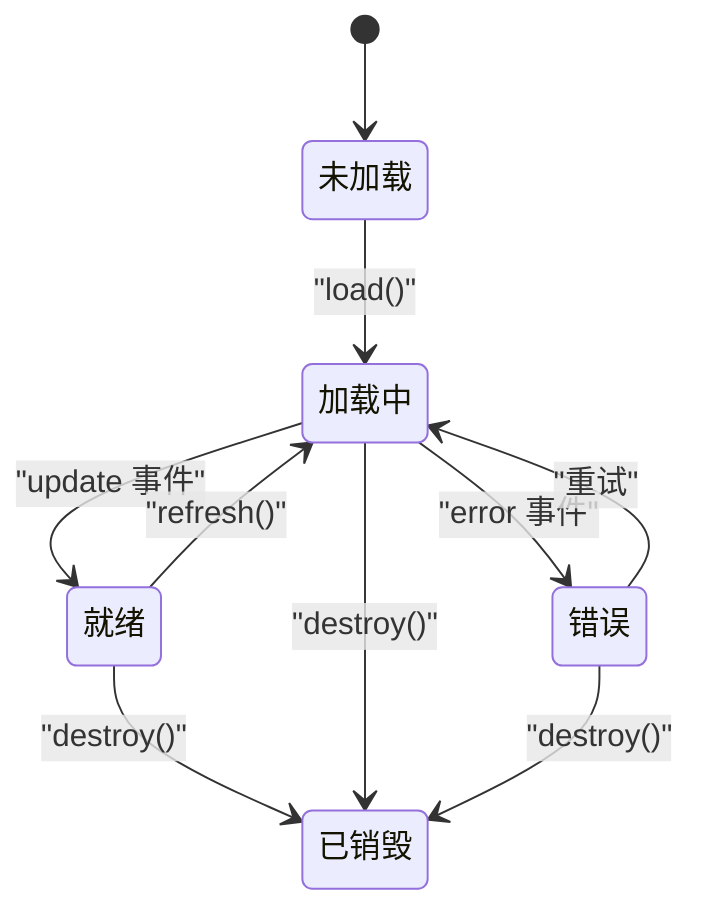

**图示来源**
- [MockDataSource.js:1-200](file://Specs/MockDataSource.js#L1-L200)

**章节来源**
- [MockDataSource.js:1-200](file://Specs/MockDataSource.js#L1-L200)

### 常见场景示例

#### REST API 集成
- 关键点
  - 使用加载器封装 HTTP 请求，支持认证头与重试。
  - 解析器校验 JSON Schema，失败时回退到默认值。
  - 缓存键包含 URL 与查询参数哈希。
- 适用场景
  - 静态或低频更新的地理数据、属性表、样式配置等。

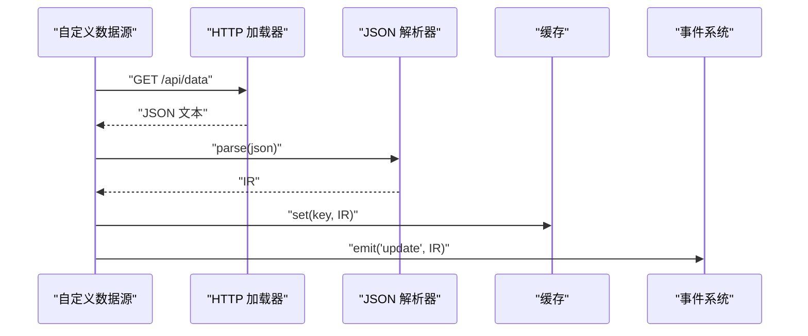

**图示来源**
- [MockDataSource.js:1-200](file://Specs/MockDataSource.js#L1-L200)

**章节来源**
- [MockDataSource.js:1-200](file://Specs/MockDataSource.js#L1-L200)

#### WebSocket 实时数据
- 关键点
  - 建立长连接，维护心跳与断线重连。
  - 按消息类型路由到不同解析器。
  - 增量更新：仅推送变化字段，客户端合并后发布 update。
- 适用场景
  - 动态轨迹、传感器流、实时告警等。

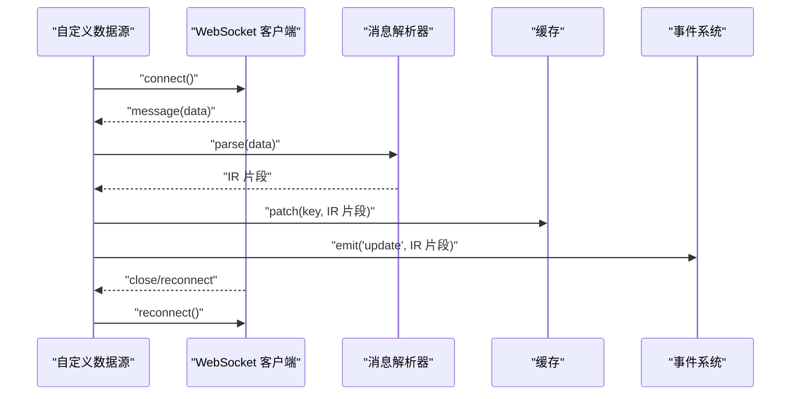

**图示来源**
- [MockDataSource.js:1-200](file://Specs/MockDataSource.js#L1-L200)

**章节来源**
- [MockDataSource.js:1-200](file://Specs/MockDataSource.js#L1-L200)

#### 数据库连接
- 关键点
  - 通过服务端代理暴露 REST/GraphQL 接口，前端不直连数据库。
  - 分页与游标：避免一次性拉取全量数据。
  - 事务与幂等：确保多次请求的一致性。
- 适用场景
  - 历史数据归档、复杂查询、权限控制。

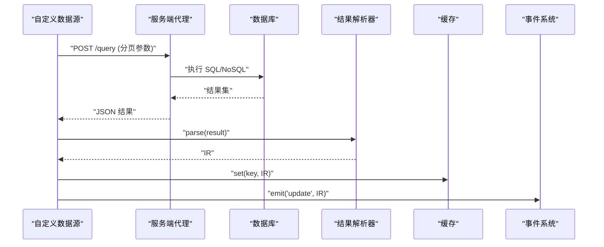

**图示来源**
- [MockDataSource.js:1-200](file://Specs/MockDataSource.js#L1-L200)

**章节来源**
- [MockDataSource.js:1-200](file://Specs/MockDataSource.js#L1-L200)

## 依赖分析
- 模块耦合
  - 数据源与加载器/解析器松耦合，通过接口注入，便于替换与测试。
  - 事件系统作为横向切面，贯穿各组件。
- 外部依赖
  - 网络库（HTTP/WebSocket）、序列化库（JSON/二进制）、缓存库（可选）。
- 循环依赖
  - 避免数据源反向依赖事件系统之外的上层模块，保持单向依赖。

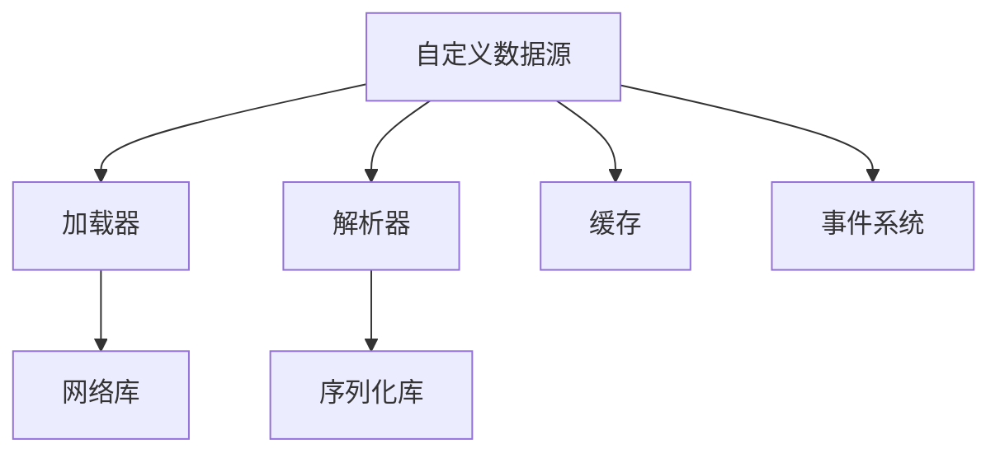

[此图为概念依赖图，不直接映射具体源码文件，故无图示来源]

**章节来源**
- [MockDataSource.js:1-200](file://Specs/MockDataSource.js#L1-L200)

## 性能考虑
- 请求合并与去重
  - 相同 key 的请求合并，避免重复网络 IO。
- 增量更新
  - 仅下发差异数据，客户端合并后局部刷新。
- 缓存策略
  - 合理设置 TTL 与最大条目数，防止内存泄漏。
- 批处理与节流
  - 高频更新场景下，合并多个 update 事件，降低渲染压力。
- 压缩与分块
  - 大体积数据启用压缩与分块传输，提升首屏速度。

[本节为通用指导，不涉及具体源码分析]

## 故障排查指南
- 常见问题
  - 网络超时与重试：检查超时阈值与重试次数，观察是否出现风暴。
  - 解析失败：确认输入数据是否符合预期 Schema，打印原始负载定位问题。
  - 缓存不一致：核对键生成规则与失效策略，验证并发场景下的覆盖顺序。
  - 事件风暴：统计单位时间内 update 事件数量，必要时引入节流。
- 调试技巧
  - 在关键路径添加日志与埋点，输出耗时与错误堆栈。
  - 使用 MockDataSource 作为对照，快速隔离问题范围。

**章节来源**
- [MockDataSource.js:1-200](file://Specs/MockDataSource.js#L1-L200)

## 结论
通过继承 DataSource 基类并遵循统一的加载、解析、缓存与事件模型，可以高效地扩展自定义数据源能力。结合 REST、WebSocket 与数据库代理等常见场景，可实现从静态到实时的多样化数据接入。配合合理的性能优化与完善的测试策略，能够保障系统的稳定性与可扩展性。

[本节为总结性内容，不涉及具体源码分析]

## 附录

### 开发清单
- 定义数据源类与配置项
- 实现加载器与解析器
- 接入缓存与事件系统
- 编写单元测试与集成测试
- 性能基准与回归测试

### 测试策略
- 单元测试
  - 针对解析器与缓存进行纯函数测试。
  - 使用桩对象模拟网络与数据库。
- 集成测试
  - 使用 createScene 构建最小运行环境，端到端验证数据源行为。
  - 使用 Cesium3DTilesTester 与 ImplicitTilingTester 的思路，构造复杂场景用例。

**章节来源**
- [createScene.js:1-200](file://Specs/createScene.js#L1-L200)
- [Cesium3DTilesTester.js:1-200](file://Specs/Cesium3DTilesTester.js#L1-L200)
- [ImplicitTilingTester.js:1-200](file://Specs/ImplicitTilingTester.js#L1-L200)