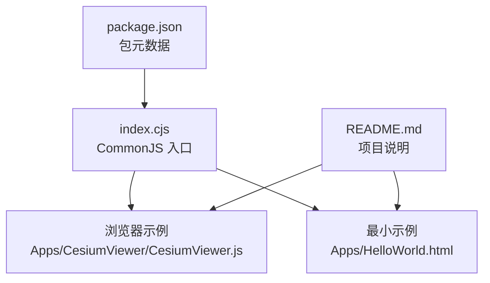
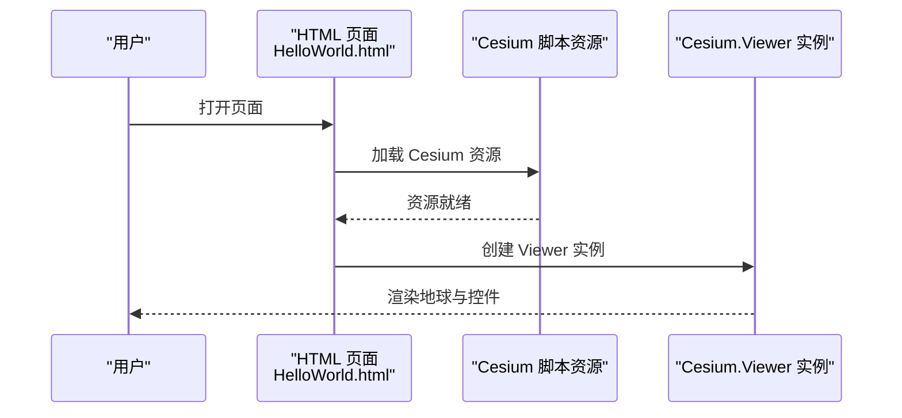
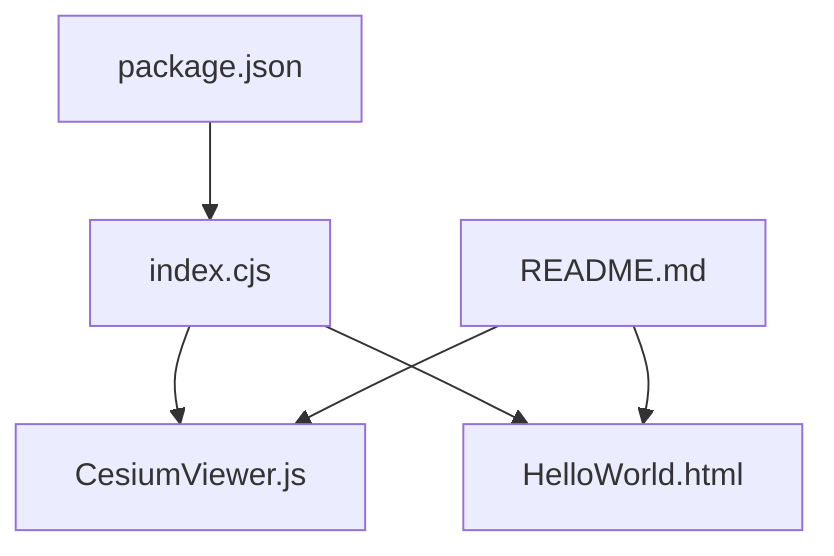

# Cesium核心命名空间

<cite>
**本文引用的文件**   
- [index.cjs](file://index.cjs)
- [package.json](file://package.json)
- [README.md](file://README.md)
- [CesiumViewer.js](file://Apps/CesiumViewer/CesiumViewer.js)
- [HelloWorld.html](file://Apps/HelloWorld.html)
</cite>

## 目录
1. [简介](#简介)
2. [项目结构](#项目结构)
3. [核心组件](#核心组件)
4. [架构总览](#架构总览)
5. [详细组件分析](#详细组件分析)
6. [依赖分析](#依赖分析)
7. [性能考虑](#性能考虑)
8. [故障排查指南](#故障排查指南)
9. [结论](#结论)
10. [附录](#附录)

## 简介
本文件聚焦于 Cesium 的“核心命名空间”与全局对象组织方式，面向初学者提供快速上手路径，同时为高级开发者梳理模块加载、命名空间导入机制以及常用入口（如 Viewer、Math、Event）的使用要点。内容基于仓库中的实际入口与示例代码进行归纳，确保可追溯与可验证。

## 项目结构
从仓库根目录可见，Cesium 提供了多种使用形态：
- CommonJS 入口 index.cjs：用于 Node 或打包器环境下的按需引入与组合导出
- 应用示例 Apps/CesiumViewer：展示在浏览器中通过脚本标签引入并初始化 Cesium.Viewer 的典型流程
- 最小化示例 Apps/HelloWorld.html：演示最简 HTML 页面加载 Cesium 资源的方式
- package.json：声明包元数据与构建产物信息
- README.md：项目说明与使用说明

图表来源
- [index.cjs](file://index.cjs)
- [CesiumViewer.js](file://Apps/CesiumViewer/CesiumViewer.js)
- [HelloWorld.html](file://Apps/HelloWorld.html)
- [package.json](file://package.json)
- [README.md](file://README.md)

章节来源
- [index.cjs](file://index.cjs)
- [CesiumViewer.js](file://Apps/CesiumViewer/CesiumViewer.js)
- [HelloWorld.html](file://Apps/HelloWorld.html)
- [package.json](file://package.json)
- [README.md](file://README.md)

## 核心组件
本节概述 Cesium 在仓库中暴露的核心入口与常见用法模式：
- 全局对象与命名空间：在浏览器环境中，Cesium 通常以全局对象形式可用；在模块化环境中，可通过 CommonJS 或 ES 模块从入口文件导入所需成员
- 模块加载系统：支持通过 script 标签直接加载构建产物，或通过打包器（Webpack/Vite/Rollup 等）按需引入
- 常用入口：
  - Cesium.Viewer：地图容器与交互控制的核心类
  - Cesium.Math：数学工具集合入口
  - Cesium.Event：事件系统访问点

章节来源
- [index.cjs](file://index.cjs)
- [CesiumViewer.js](file://Apps/CesiumViewer/CesiumViewer.js)
- [HelloWorld.html](file://Apps/HelloWorld.html)

## 架构总览
下图展示了典型浏览器场景下，HTML 页面如何通过脚本加载 Cesium 资源，并在页面中创建 Cesium.Viewer 实例的基本流程。该流程对应仓库中的示例实现。

图表来源
- [HelloWorld.html](file://Apps/HelloWorld.html)
- [CesiumViewer.js](file://Apps/CesiumViewer/CesiumViewer.js)

## 详细组件分析

### Cesium 全局对象与命名空间组织
- 全局对象：在浏览器环境中，Cesium 通常挂载到全局作用域，便于通过全局名称访问其子命名空间（例如 Viewer、Math、Event 等）
- 命名空间导入机制：
  - 浏览器脚本标签：通过引入构建后的脚本文件，使全局对象可用
  - 模块化环境：通过 CommonJS 或 ES 模块从入口文件导入具体成员，避免污染全局命名空间
- 入口文件职责：index.cjs 作为统一出口，聚合并导出各功能模块，供上层应用按需引用

章节来源
- [index.cjs](file://index.cjs)
- [HelloWorld.html](file://Apps/HelloWorld.html)
- [CesiumViewer.js](file://Apps/CesiumViewer/CesiumViewer.js)

### 模块加载系统
- 浏览器加载：
  - 通过 script 标签引入构建产物，资源加载完成后即可使用全局对象
  - 适用于快速原型与最小示例
- 打包器加载：
  - 通过 require/import 从入口文件按需引入，利于 Tree Shaking 与体积优化
  - 适合大型工程与复杂依赖管理

章节来源
- [index.cjs](file://index.cjs)
- [HelloWorld.html](file://Apps/HelloWorld.html)
- [CesiumViewer.js](file://Apps/CesiumViewer/CesiumViewer.js)

### Cesium.Viewer 初始化配置
- 基本流程：
  - 在 DOM 元素上创建 Viewer 实例
  - 可选地配置初始视图、图层、控件、时间轴等
- 关键配置项（概念性说明）：
  - 容器元素：指定承载地图的 DOM 节点
  - 初始位置与视角：经纬度、高度、朝向等
  - 基础图层：影像、地形、标注等
  - UI 控件：缩放、罗盘、比例尺、时间轴等
  - 渲染与性能：抗锯齿、阴影、深度测试等
- 参考示例：
  - 浏览器示例展示了如何引入资源并创建 Viewer
  - 最小示例展示了最简 HTML 结构

章节来源
- [CesiumViewer.js](file://Apps/CesiumViewer/CesiumViewer.js)
- [HelloWorld.html](file://Apps/HelloWorld.html)

### Cesium.Math 数学库入口
- 定位：提供常用数学函数与常量，如角度转换、三角函数、向量运算等
- 使用方式：
  - 浏览器：通过全局命名空间访问
  - 模块化：从入口文件导入 Math 命名空间或具体方法
- 适用场景：坐标变换、距离计算、插值与采样等

章节来源
- [index.cjs](file://index.cjs)
- [CesiumViewer.js](file://Apps/CesiumViewer/CesiumViewer.js)

### Cesium.Event 事件系统访问方式
- 定位：提供事件订阅、发布与生命周期管理能力
- 使用方式：
  - 浏览器：通过全局命名空间访问
  - 模块化：从入口文件导入 Event 命名空间或相关工具
- 典型模式：
  - 监听特定事件（如相机移动、选择变化）
  - 在合适时机移除监听以避免内存泄漏

章节来源
- [index.cjs](file://index.cjs)
- [CesiumViewer.js](file://Apps/CesiumViewer/CesiumViewer.js)

### 构造函数参数与静态方法调用示例（路径指引）
- 构造函数参数说明：请参考示例中对 Viewer 的创建与配置逻辑
- 静态方法调用示例：请参考示例中对 Math 与 Event 的调用方式
- 属性配置选项：请参考示例中对 Viewer 的配置项设置

章节来源
- [CesiumViewer.js](file://Apps/CesiumViewer/CesiumViewer.js)
- [HelloWorld.html](file://Apps/HelloWorld.html)

### 错误处理与兼容性
- 错误处理：
  - 建议在创建 Viewer 前后增加必要的检查与日志输出
  - 对资源加载失败、权限不足等情况进行兜底提示
- 版本兼容性与浏览器支持：
  - 请根据 README 与 package.json 的版本信息进行适配
  - 注意不同浏览器对 WebGL、WebAssembly 等能力的差异

章节来源
- [README.md](file://README.md)
- [package.json](file://package.json)

## 依赖分析
下图展示了入口文件与各示例之间的依赖关系，体现从统一入口到具体应用的加载路径。

图表来源
- [index.cjs](file://index.cjs)
- [CesiumViewer.js](file://Apps/CesiumViewer/CesiumViewer.js)
- [HelloWorld.html](file://Apps/HelloWorld.html)
- [package.json](file://package.json)
- [README.md](file://README.md)

章节来源
- [index.cjs](file://index.cjs)
- [CesiumViewer.js](file://Apps/CesiumViewer/CesiumViewer.js)
- [HelloWorld.html](file://Apps/HelloWorld.html)
- [package.json](file://package.json)
- [README.md](file://README.md)

## 性能考虑
- 按需加载：优先通过打包器按需引入所需模块，减少首屏体积
- 资源优化：合理配置影像与地形层级，启用合适的压缩格式
- 渲染设置：根据目标设备能力调整抗锯齿、阴影、后处理等开关
- 事件管理：及时移除不再需要的事件监听，避免内存占用增长

[本节为通用指导，不直接分析具体文件]

## 故障排查指南
- 常见问题：
  - 资源未加载完成即访问全局对象：确认脚本加载顺序与加载完成回调
  - 容器尺寸异常：确保容器元素存在且具备有效宽高
  - 跨域与协议限制：检查资源地址与服务器 CORS 配置
- 建议步骤：
  - 在控制台查看网络请求与错误堆栈
  - 逐步缩小问题范围，先复现最小示例再扩展至完整应用
  - 对照 README 与 package.json 的版本要求与环境依赖

章节来源
- [README.md](file://README.md)
- [package.json](file://package.json)

## 结论
通过对仓库入口与示例的分析，可以清晰理解 Cesium 在浏览器与模块化环境中的加载与使用方式。初学者可从最小示例入手，快速搭建第一个三维地球应用；高级开发者则可结合打包器与按需引入策略，构建高性能、可维护的生产级应用。

[本节为总结性内容，不直接分析具体文件]

## 附录
- 快速上手清单：
  - 引入 Cesium 资源或从入口文件按需导入
  - 准备承载容器元素
  - 创建 Cesium.Viewer 实例并配置必要选项
  - 添加业务逻辑与事件监听
- 进阶阅读：
  - 参考示例中的 Viewer 配置与事件使用模式
  - 结合 README 与 package.json 了解版本与兼容性信息

章节来源
- [CesiumViewer.js](file://Apps/CesiumViewer/CesiumViewer.js)
- [HelloWorld.html](file://Apps/HelloWorld.html)
- [README.md](file://README.md)
- [package.json](file://package.json)