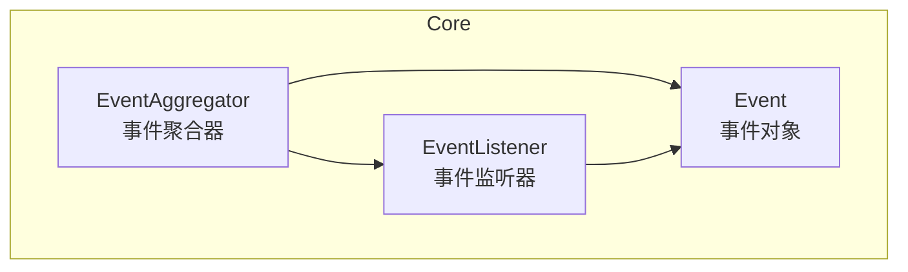
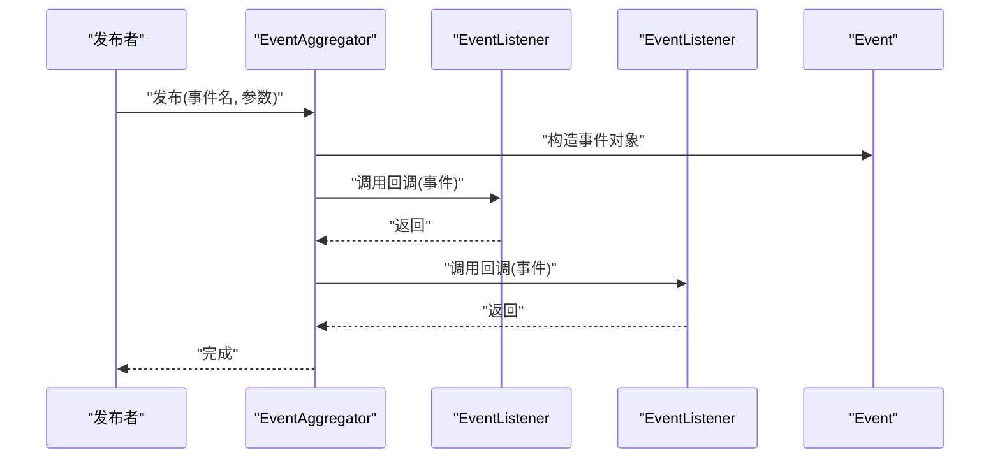
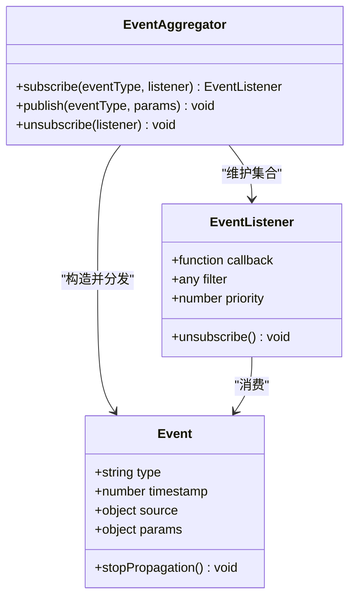
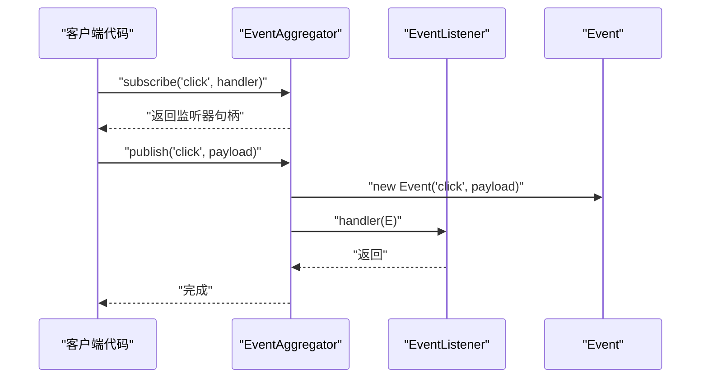
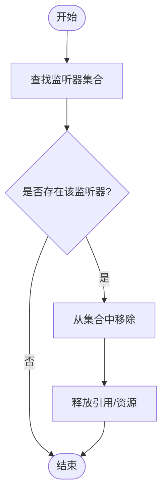
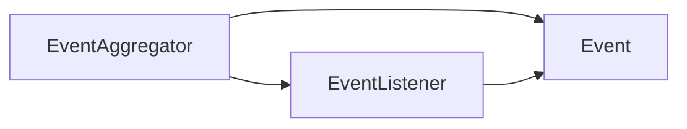

# 事件系统API

<cite>
**本文引用的文件**   
- [EventAggregator.js](file://Source/Core/EventAggregator.js)
- [Event.js](file://Source/Core/Event.js)
- [EventListener.js](file://Source/Core/EventListener.js)
</cite>

## 目录
1. [简介](#简介)
2. [项目结构](#项目结构)
3. [核心组件](#核心组件)
4. [架构总览](#架构总览)
5. [详细组件分析](#详细组件分析)
6. [依赖关系分析](#依赖关系分析)
7. [性能考虑](#性能考虑)
8. [故障排查指南](#故障排查指南)
9. [结论](#结论)
10. [附录](#附录)

## 简介
本文件为 Cesium 事件系统的 API 文档，聚焦以下三类核心对象：
- EventAggregator（事件聚合器）：提供全局或局部的事件总线能力，用于发布与订阅事件。
- Event（事件对象）：封装一次事件的上下文信息，包括类型、时间戳、参数等。
- EventListener（事件监听器）：表示对某类事件的注册项，支持取消订阅与生命周期管理。

本文档将详细说明事件的创建、订阅、发布、取消订阅机制；阐述监听器的注册与移除方法；说明事件参数的传递与处理模式；并给出异步事件处理、事件冒泡机制、性能优化建议以及最佳实践与常见陷阱避免策略。

## 项目结构
Cesium 事件系统位于 Source/Core 目录下，采用“轻量级、可组合”的设计思路：
- EventAggregator 作为事件中心，维护事件到监听器集合的映射，负责分发与调度。
- Event 作为不可变或半不可变的载体，承载事件元数据与业务参数。
- EventListener 作为订阅记录，便于精确移除与资源清理。

图表来源
- [EventAggregator.js](file://Source/Core/EventAggregator.js)
- [Event.js](file://Source/Core/Event.js)
- [EventListener.js](file://Source/Core/EventListener.js)

章节来源
- [EventAggregator.js](file://Source/Core/EventAggregator.js)
- [Event.js](file://Source/Core/Event.js)
- [EventListener.js](file://Source/Core/EventListener.js)

## 核心组件
本节概述三大组件的职责与交互方式，帮助读者快速建立整体认知。

- EventAggregator（事件聚合器）
  - 职责：维护事件名到监听器列表的映射；提供订阅、发布、取消订阅接口；可选地支持命名空间或作用域隔离。
  - 关键行为：在发布时遍历对应事件的所有监听器，构造事件对象并依次调用回调；支持同步与异步两种分发模式。
- Event（事件对象）
  - 职责：封装事件类型、时间戳、源对象、附加参数等；对外暴露只读访问器，保证事件传播过程中的稳定性。
  - 关键属性：类型、时间戳、源、参数集合、是否已停止传播等。
- EventListener（事件监听器）
  - 职责：描述一次订阅关系；持有回调函数、过滤条件、优先级等信息；提供取消订阅句柄。
  - 关键行为：在取消订阅时从聚合器中移除自身；在触发时按优先级顺序执行。

章节来源
- [EventAggregator.js](file://Source/Core/EventAggregator.js)
- [Event.js](file://Source/Core/Event.js)
- [EventListener.js](file://Source/Core/EventListener.js)

## 架构总览
下图展示了事件驱动的核心流程：发布者通过聚合器发布事件，聚合器根据事件名找到所有监听器，构造事件对象并逐个调用回调。

图表来源
- [EventAggregator.js](file://Source/Core/EventAggregator.js)
- [Event.js](file://Source/Core/Event.js)
- [EventListener.js](file://Source/Core/EventListener.js)

## 详细组件分析

### EventAggregator（事件聚合器）
- 设计要点
  - 以事件名为键维护监听器集合，支持按名称空间或作用域进行分组。
  - 提供订阅、发布、取消订阅等基础 API。
  - 支持同步与异步分发策略，避免阻塞主线程。
- 典型用法
  - 订阅：传入事件名与回调，返回监听器句柄以便后续移除。
  - 发布：传入事件名与参数，内部构造事件对象并调用所有监听器。
  - 取消订阅：使用监听器句柄从聚合器中移除对应条目。
- 注意事项
  - 避免在监听器中修改正在遍历的监听器集合。
  - 谨慎使用全局聚合器，推荐按模块或功能域划分实例以降低耦合。

章节来源
- [EventAggregator.js](file://Source/Core/EventAggregator.js)

### Event（事件对象）
- 设计要点
  - 作为事件上下文的只读视图，包含事件类型、时间戳、源对象、参数等。
  - 提供统一的访问接口，确保监听器之间不会意外篡改事件状态。
- 典型用法
  - 在监听器中读取事件参数与元数据。
  - 通过事件对象控制传播（如阻止继续传播）。
- 注意事项
  - 不要在监听器中修改事件对象的内部状态，除非明确需要中断传播。

章节来源
- [Event.js](file://Source/Core/Event.js)

### EventListener（事件监听器）
- 设计要点
  - 封装一次订阅关系，包含回调、过滤条件、优先级等。
  - 提供取消订阅能力，避免内存泄漏。
- 典型用法
  - 订阅后保存监听器句柄，在合适时机（如组件销毁）调用取消订阅。
  - 利用优先级控制多个监听器的执行顺序。
- 注意事项
  - 避免重复订阅同一回调导致多次执行。
  - 在复杂场景中结合命名空间或作用域进行细粒度管理。

章节来源
- [EventListener.js](file://Source/Core/EventListener.js)

#### 类关系图

图表来源
- [EventAggregator.js](file://Source/Core/EventAggregator.js)
- [Event.js](file://Source/Core/Event.js)
- [EventListener.js](file://Source/Core/EventListener.js)

#### 发布流程时序图

图表来源
- [EventAggregator.js](file://Source/Core/EventAggregator.js)
- [Event.js](file://Source/Core/Event.js)
- [EventListener.js](file://Source/Core/EventListener.js)

#### 取消订阅流程图

图表来源
- [EventAggregator.js](file://Source/Core/EventAggregator.js)
- [EventListener.js](file://Source/Core/EventListener.js)

## 依赖关系分析
- 组件内聚性
  - Event 仅关注数据与只读访问，内聚性高。
  - EventListener 仅关注订阅语义与生命周期，内聚性高。
  - EventAggregator 协调两者，承担分发职责。
- 外部依赖
  - 无强外部依赖，保持轻量与可移植性。
- 潜在循环依赖
  - 当前设计避免了循环依赖，监听器不反向持有聚合器实例。

图表来源
- [EventAggregator.js](file://Source/Core/EventAggregator.js)
- [Event.js](file://Source/Core/Event.js)
- [EventListener.js](file://Source/Core/EventListener.js)

章节来源
- [EventAggregator.js](file://Source/Core/EventAggregator.js)
- [Event.js](file://Source/Core/Event.js)
- [EventListener.js](file://Source/Core/EventListener.js)

## 性能考虑
- 批量发布
  - 在高频率场景下，合并多次发布或使用节流/防抖策略，减少事件风暴。
- 监听器数量
  - 避免为同一事件注册过多监听器；必要时拆分事件类型或引入命名空间。
- 异步分发
  - 对于耗时操作，使用异步分发（如微任务或队列），避免阻塞主循环。
- 对象复用
  - 事件对象尽量不可变，避免在监听器中复制大对象；必要时使用浅拷贝或引用传递。
- 内存管理
  - 及时取消不再需要的订阅，防止闭包导致的内存泄漏。

[本节为通用指导，无需源码引用]

## 故障排查指南
- 常见问题
  - 监听器未触发：检查事件名是否一致、是否被提前取消订阅、是否存在命名空间差异。
  - 重复执行：确认是否重复订阅同一回调；使用唯一标识或去重策略。
  - 性能问题：定位热点事件与监听器数量，评估是否需要异步化或拆分事件。
  - 内存泄漏：确保在组件销毁或页面卸载时调用取消订阅。
- 调试技巧
  - 在聚合器入口添加日志，打印事件名与监听器数量。
  - 为监听器增加唯一 ID，便于追踪与统计。
  - 使用浏览器开发者工具的性能面板观察事件分发耗时。

章节来源
- [EventAggregator.js](file://Source/Core/EventAggregator.js)
- [EventListener.js](file://Source/Core/EventListener.js)

## 结论
Cesium 事件系统以 EventAggregator、Event、EventListener 为核心，提供了简洁而强大的事件驱动能力。通过合理的事件命名、作用域划分与生命周期管理，可以在保证解耦的同时获得良好的性能与可维护性。遵循本文的最佳实践与避坑指南，有助于构建健壮的事件驱动应用。

[本节为总结性内容，无需源码引用]

## 附录
- 最佳实践
  - 使用命名空间或作用域隔离不同模块的事件。
  - 为每个订阅保留监听器句柄，并在适当时机取消订阅。
  - 避免在监听器中进行重型计算，必要时异步化。
  - 为事件参数定义清晰的契约，避免隐式约定。
- 常见陷阱
  - 在监听器中修改监听器集合导致遍历异常。
  - 忘记取消订阅造成内存泄漏。
  - 过度细分事件导致调用链过长，影响可读性与性能。

[本节为通用指导，无需源码引用]