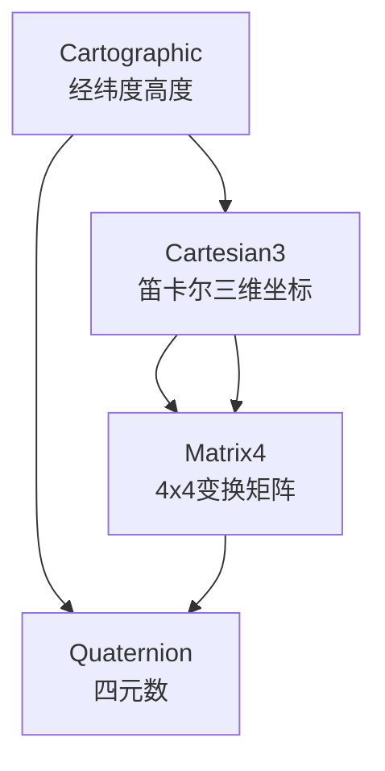
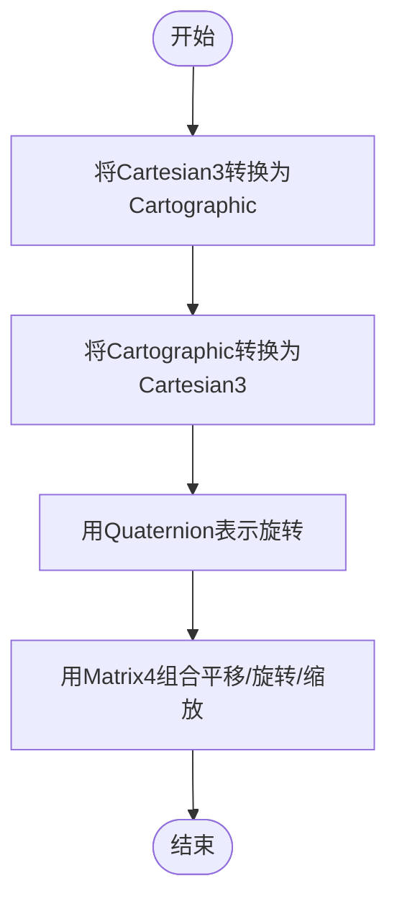
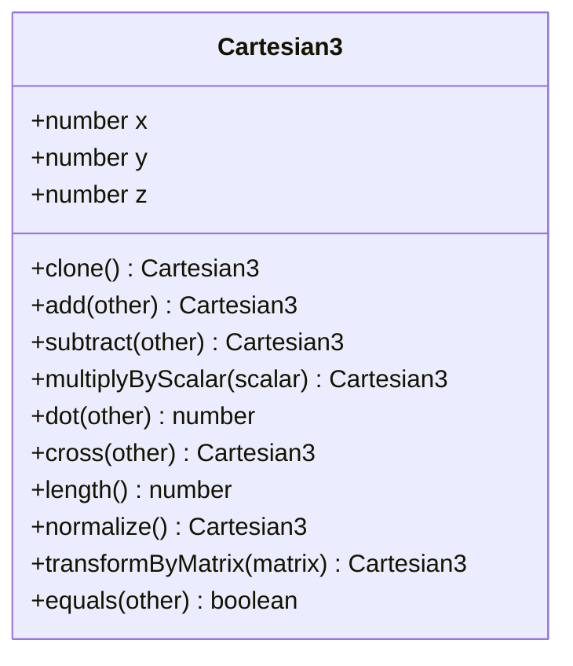
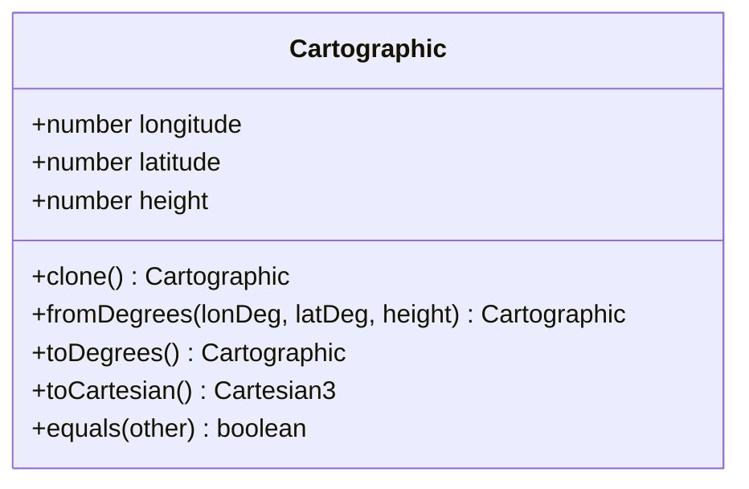
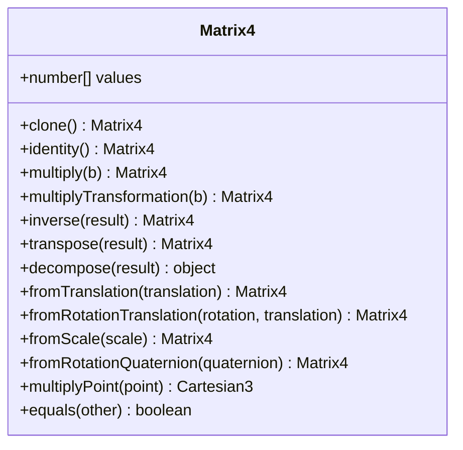
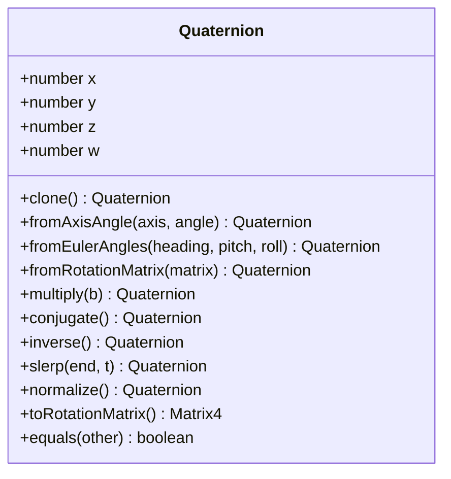
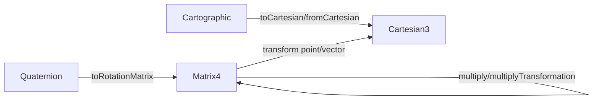

# 坐标类型定义

<cite>
**本文引用的文件**   
- [Cartesian3.js](file://Source/Core/Cartesian3.js)
- [Cartographic.js](file://Source/Core/Cartographic.js)
- [Matrix4.js](file://Source/Core/Matrix4.js)
- [Quaternion.js](file://Source/Core/Quaternion.js)
</cite>

## 目录
1. [简介](#简介)
2. [项目结构](#项目结构)
3. [核心组件](#核心组件)
4. [架构总览](#架构总览)
5. [详细组件分析](#详细组件分析)
6. [依赖关系分析](#依赖关系分析)
7. [性能考虑](#性能考虑)
8. [故障排查指南](#故障排查指南)
9. [结论](#结论)
10. [附录](#附录)

## 简介
本文件面向Cesium开发者，系统化梳理并解释以下核心坐标与变换数据结构：
- Cartesian3（笛卡尔三维直角坐标）
- Cartographic（地理坐标：经度、纬度、高度）
- Matrix4（4x4齐次变换矩阵）
- Quaternion（四元数）

文档涵盖数学定义、应用场景、内部存储格式、精度与数值范围、单位系统、常用API使用方式，以及如何选择合适坐标类型的实践建议。

## 项目结构
Cesium的几何与坐标体系位于Source/Core目录中，上述四类核心类型分别由独立模块实现，彼此通过静态方法或工具函数进行转换与组合。下图给出概念性结构示意（非代码映射）。

[本节为概念性说明，不直接分析具体源文件，故无“章节来源”]

## 核心组件
- Cartesian3：表示世界坐标系中的三维点或向量，常用于GPU渲染管线、相机位置、模型顶点等。
- Cartographic：以弧度表示的经纬度和米制高度，适合描述地球表面位置与高程。
- Matrix4：行主序4x4齐次矩阵，用于表达平移、旋转、缩放及仿射/投影变换。
- Quaternion：单位四元数，用于表示三维旋转，避免万向节锁且插值稳定。

选择建议（概览）：
- 需要与GPU/图形管线交互、做大量线性代数运算时优先使用Cartesian3与Matrix4。
- 描述地理位置、地形相关计算时使用Cartographic。
- 处理旋转、姿态插值、避免奇异性时使用Quaternion。

[本节为概念性说明，不直接分析具体源文件，故无“章节来源”]

## 架构总览
下图展示四类核心类型之间的常见数据流与协作关系（概念图）。

[本节为概念性说明，不直接分析具体源文件，故无“章节来源”]

## 详细组件分析

### Cartesian3（笛卡尔三维坐标）
- 数学定义
  - 三维欧氏空间中的点或向量(x, y, z)。
- 内部存储
  - 三个双精度浮点数x、y、z。
- 单位与范围
  - 单位通常为米；数值范围受双精度浮点限制，典型场景下可覆盖全球尺度。
- 典型应用
  - 相机位置、模型顶点、光线方向、距离/夹角计算等。
- 常用API类别（路径参考）
  - 构造与复制：new、clone、fromArray、equals
  - 算术运算：add、subtract、multiplyByScalar、dot、cross、length、normalize
  - 投影与转换：projectTo2D、toCartesian3（与Cartographic互转的工具函数）
  - 矩阵与四元数：transformByMatrix、transformByMatrix3、rotateByQuaternion
- 精度与注意事项
  - 在极远/极近尺度下注意浮点误差；必要时使用相对误差比较。
  - 归一化前确保长度不为零。

图示来源
- [Cartesian3.js](file://Source/Core/Cartesian3.js)

章节来源
- [Cartesian3.js](file://Source/Core/Cartesian3.js)

### Cartographic（地理坐标：经度、纬度、高度）
- 数学定义
  - 经度longitude、纬度latitude（弧度），高度height（米）。
- 内部存储
  - 三个双精度浮点数：longitude、latitude、height。
- 单位与范围
  - 角度单位为弧度；经度[-π, π]，纬度[-π/2, π/2]；高度以米为单位。
- 典型应用
  - 地图标注、地形采样、WGS84位置输入输出、区域裁剪等。
- 常用API类别（路径参考）
  - 构造与复制：new、clone、fromDegrees、fromRadians、equals
  - 范围与边界：clampLongitude、clampLatitude、toDegrees、toRadians
  - 与Cartesian3互转：toCartesian、fromCartesian（工具函数）
- 精度与注意事项
  - 经度跨越±180°时需规范化；高度为椭球高或大地高需明确基准。

图示来源
- [Cartographic.js](file://Source/Core/Cartographic.js)

章节来源
- [Cartographic.js](file://Source/Core/Cartographic.js)

### Matrix4（4x4变换矩阵）
- 数学定义
  - 行主序4x4齐次矩阵，用于表示平移、旋转、缩放、剪切与投影等线性变换。
- 内部存储
  - 16个双精度浮点数按行主序排列。
- 典型应用
  - 模型局部到世界的变换、相机视图/投影矩阵、批量实例变换等。
- 常用API类别（路径参考）
  - 构造与复制：new、clone、fromArray、identity、equals
  - 组合与分解：multiply、multiplyTransformation、inverse、transpose、decompose
  - 构建变换：fromTranslation、fromRotationTranslation、fromScale、fromRotationQuaternion
  - 向量/点变换：multiplyPoint、multiplyVector、transformDirection
- 精度与注意事项
  - 组合多个变换时注意顺序；逆矩阵可能不稳定，需检查条件数或回退策略。

图示来源
- [Matrix4.js](file://Source/Core/Matrix4.js)

章节来源
- [Matrix4.js](file://Source/Core/Matrix4.js)

### Quaternion（四元数）
- 数学定义
  - 四维单位超复数(qx, qy, qz, qw)，用于表示三维旋转，避免万向节锁。
- 内部存储
  - 四个双精度浮点数x、y、z、w。
- 典型应用
  - 姿态插值（SLERP）、相机朝向、模型旋转、避免欧拉角奇异。
- 常用API类别（路径参考）
  - 构造与复制：new、clone、fromAxisAngle、fromEulerAngles、fromRotationMatrix、equals
  - 组合与求逆：multiply、conjugate、inverse、negate
  - 插值与归一化：slerp、normalize
  - 与矩阵互转：toRotationMatrix
- 精度与注意事项
  - 保持单位长度；插值前确保同符号以避免最短弧反转。

图示来源
- [Quaternion.js](file://Source/Core/Quaternion.js)

章节来源
- [Quaternion.js](file://Source/Core/Quaternion.js)

## 依赖关系分析
- 类型间协作
  - Cartographic ↔ Cartesian3：地理坐标与笛卡尔坐标互转。
  - Quaternion → Matrix4：四元数可生成旋转矩阵，再参与复合变换。
  - Matrix4 ←→ Cartesian3：矩阵作用于点/向量完成空间变换。
- 耦合与内聚
  - 各类型职责单一、内聚度高；跨类型转换集中在各自模块或工具函数中，降低耦合。
- 外部依赖
  - 主要依赖底层数学库（如double-precision数组操作），但本文件聚焦于接口与用法。

图示来源
- [Cartesian3.js](file://Source/Core/Cartesian3.js)
- [Cartographic.js](file://Source/Core/Cartographic.js)
- [Matrix4.js](file://Source/Core/Matrix4.js)
- [Quaternion.js](file://Source/Core/Quaternion.js)

章节来源
- [Cartesian3.js](file://Source/Core/Cartesian3.js)
- [Cartographic.js](file://Source/Core/Cartographic.js)
- [Matrix4.js](file://Source/Core/Matrix4.js)
- [Quaternion.js](file://Source/Core/Quaternion.js)

## 性能考虑
- 对象复用
  - 频繁创建临时对象会带来GC压力，尽量复用结果对象或池化对象。
- 数值稳定性
  - 归一化、求逆、叉积等操作前检查零向量/退化情况。
- 批量变换
  - 对大量点进行变换时，优先使用批量矩阵乘法或GPU侧计算。
- 插值与平滑
  - 使用四元数SLERP进行旋转插值，避免欧拉角抖动。

[本节为通用指导，不直接分析具体源文件，故无“章节来源”]

## 故障排查指南
- 常见问题
  - 未归一化的四元数导致旋转异常：确保调用normalize或在构造后校验单位长度。
  - 矩阵不可逆：检查缩放为零或严重畸变；必要时回退或使用伪逆。
  - 经纬度越界：经度应规范至[-π, π]，纬度限制在[-π/2, π/2]。
  - 除以零：叉积/点积/归一化前检查长度。
- 定位技巧
  - 打印关键中间量（如矩阵行列式、四元数模长、Cartesian3长度）。
  - 使用近似相等比较代替严格相等。

[本节为通用指导，不直接分析具体源文件，故无“章节来源”]

## 结论
- Cartesian3是图形与物理计算的基石，适合一切线性代数场景。
- Cartographic用于地球坐标建模与地理数据处理。
- Matrix4统一表达复杂变换，便于组合与批处理。
- Quaternion提供稳定高效的旋转表示与插值。
合理选择与组合这些类型，可在保证精度的同时获得良好性能。

[本节为总结性内容，不直接分析具体源文件，故无“章节来源”]

## 附录
- 单位与基准
  - 角度：弧度；长度：米；时间：秒（若涉及动画/轨迹）。
- 参考路径
  - Cartesian3 API：见[Cartesian3.js](file://Source/Core/Cartesian3.js)
  - Cartographic API：见[Cartographic.js](file://Source/Core/Cartographic.js)
  - Matrix4 API：见[Matrix4.js](file://Source/Core/Matrix4.js)
  - Quaternion API：见[Quaternion.js](file://Source/Core/Quaternion.js)