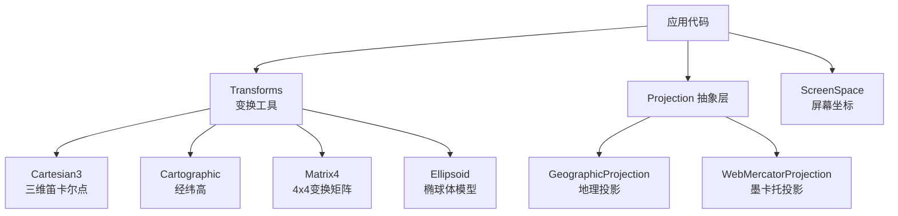
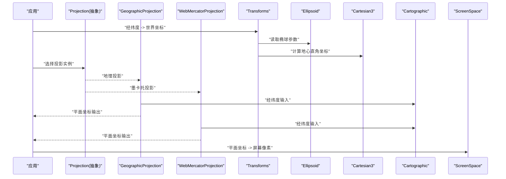
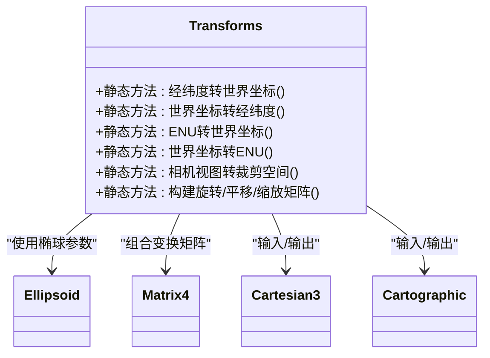
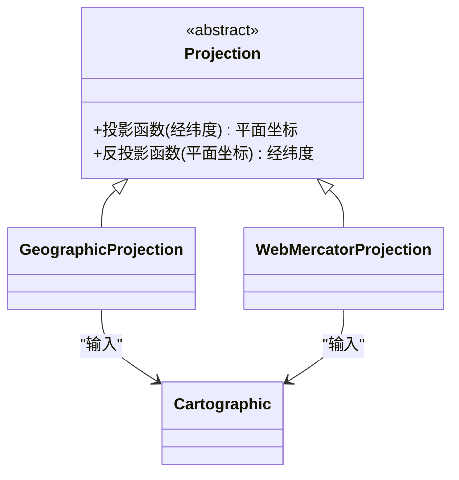
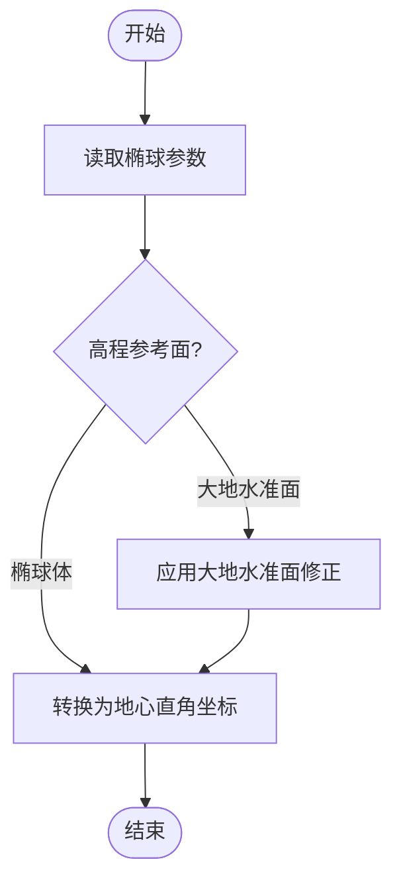
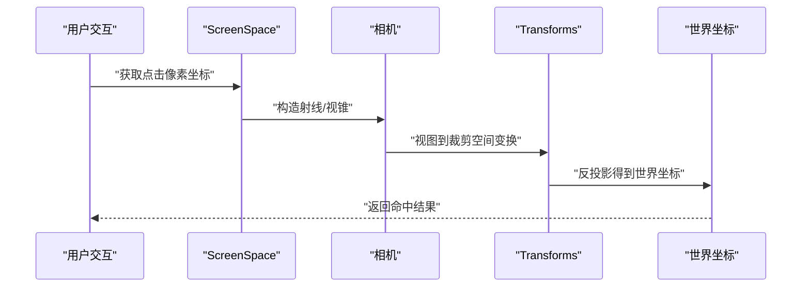
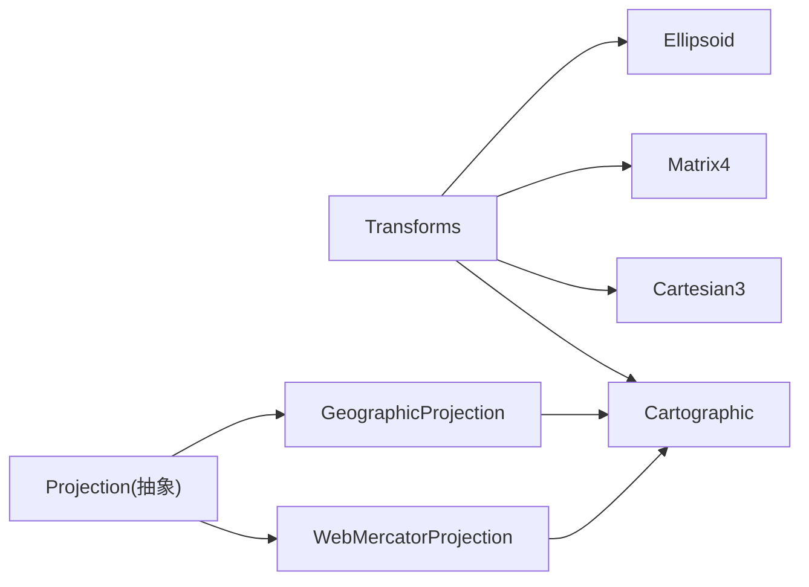

# 坐标系统API

<cite>
**本文引用的文件**   
- [index.js](file://index.js)
- [Transforms.js](file://Source/Core/Transforms.js)
- [Projection.js](file://Source/Core/Projection.js)
- [WebMercatorProjection.js](file://Source/Core/WebMercatorProjection.js)
- [Ellipsoid.js](file://Source/Core/Ellipsoid.js)
- [GeographicProjection.js](file://Source/Core/GeographicProjection.js)
- [Cartesian3.js](file://Source/Core/Cartesian3.js)
- [Cartographic.js](file://Source/Core/Cartographic.js)
- [ScreenSpace.js](file://Source/Core/ScreenSpace.js)
- [Matrix4.js](file://Source/Core/Matrix4.js)
</cite>

## 目录
1. [简介](#简介)
2. [项目结构](#项目结构)
3. [核心组件](#核心组件)
4. [架构总览](#架构总览)
5. [详细组件分析](#详细组件分析)
6. [依赖关系分析](#依赖关系分析)
7. [性能与精度考虑](#性能与精度考虑)
8. [故障排查指南](#故障排查指南)
9. [结论](#结论)
10. [附录](#附录)

## 简介
本文件面向开发者，系统化梳理 Cesium 的坐标系统与变换能力，覆盖以下主题：
- 坐标系定义与适用场景：笛卡尔空间直角坐标系、地理坐标系（经纬度）、屏幕坐标系、世界坐标系
- 转换方法：Transforms 变换类的静态方法、Projection 投影抽象类及其具体实现
- 椭球体模型、大地水准面、高度参考面的概念与计算方法
- 坐标精度控制、单位转换、投影失真处理等工程实践要点
- 提供可视化图示与调用流程，帮助快速定位 API 并正确组合使用

## 项目结构
Cesium 的核心坐标与投影能力位于 Source/Core 目录。与本主题直接相关的模块包括：
- 变换与矩阵：Transforms、Matrix4
- 投影抽象与实现：Projection、GeographicProjection、WebMercatorProjection
- 坐标类型：Cartesian3、Cartographic、ScreenSpace
- 椭球体与基准面：Ellipsoid

图表来源
- [Transforms.js](file://Source/Core/Transforms.js)
- [Projection.js](file://Source/Core/Projection.js)
- [GeographicProjection.js](file://Source/Core/GeographicProjection.js)
- [WebMercatorProjection.js](file://Source/Core/WebMercatorProjection.js)
- [Cartesian3.js](file://Source/Core/Cartesian3.js)
- [Cartographic.js](file://Source/Core/Cartographic.js)
- [ScreenSpace.js](file://Source/Core/ScreenSpace.js)
- [Matrix4.js](file://Source/Core/Matrix4.js)
- [Ellipsoid.js](file://Source/Core/Ellipsoid.js)

章节来源
- [index.js](file://index.js)

## 核心组件
本节概述关键组件的职责与协作方式，为后续深入分析奠定基础。

- Transforms 变换类
  - 提供大量静态方法，用于在不同坐标系之间进行转换，如经纬度到地心直角坐标、局部东北上（ENU）到世界坐标、相机视图到裁剪空间等
  - 内部依赖 Ellipsoid、Matrix4、Cartesian3、Cartographic 等基础类型
- Projection 投影抽象类
  - 定义投影接口，将地理坐标映射到平面坐标，供地图渲染管线使用
  - 由 GeographicProjection 与 WebMercatorProjection 等具体实现
- 坐标类型
  - Cartesian3：三维笛卡尔坐标（米），常用于世界坐标或局部坐标
  - Cartographic：经纬度（弧度）与高程（米），地球表面常用表示
  - ScreenSpace：屏幕像素坐标，用于交互拾取与UI叠加
- 椭球体与基准面
  - Ellipsoid：定义椭球参数（长半轴、短半轴、扁率等），是许多坐标转换的基础
  - 大地水准面与高度参考面：在椭球体之上定义“海平面”近似，高程可相对椭球体或大地水准面

章节来源
- [Transforms.js](file://Source/Core/Transforms.js)
- [Projection.js](file://Source/Core/Projection.js)
- [GeographicProjection.js](file://Source/Core/GeographicProjection.js)
- [WebMercatorProjection.js](file://Source/Core/WebMercatorProjection.js)
- [Cartesian3.js](file://Source/Core/Cartesian3.js)
- [Cartographic.js](file://Source/Core/Cartographic.js)
- [ScreenSpace.js](file://Source/Core/ScreenSpace.js)
- [Ellipsoid.js](file://Source/Core/Ellipsoid.js)

## 架构总览
下图展示从地理坐标到屏幕坐标的典型数据流，以及各组件间的依赖关系。

图表来源
- [Transforms.js](file://Source/Core/Transforms.js)
- [Projection.js](file://Source/Core/Projection.js)
- [GeographicProjection.js](file://Source/Core/GeographicProjection.js)
- [WebMercatorProjection.js](file://Source/Core/WebMercatorProjection.js)
- [Ellipsoid.js](file://Source/Core/Ellipsoid.js)
- [Cartesian3.js](file://Source/Core/Cartesian3.js)
- [Cartographic.js](file://Source/Core/Cartographic.js)
- [ScreenSpace.js](file://Source/Core/ScreenSpace.js)

## 详细组件分析

### Transforms 变换类
- 职责
  - 提供跨坐标系的静态转换方法，涵盖：
    - 经纬度到地心直角坐标
    - 局部东北上（ENU）到世界坐标
    - 相机视图到裁剪空间
    - 旋转矩阵、平移矩阵、缩放矩阵的组合与分解
- 关键依赖
  - Ellipsoid：椭球参数决定曲率与尺度
  - Matrix4：以矩阵形式表达旋转变换与复合变换
  - Cartesian3、Cartographic：输入输出的坐标载体
- 典型用法模式
  - 先确定目标坐标系（世界/局部/屏幕）
  - 选择合适的静态方法完成一次或多次变换
  - 注意单位与角度制式（弧度/度）的一致性

图表来源
- [Transforms.js](file://Source/Core/Transforms.js)
- [Ellipsoid.js](file://Source/Core/Ellipsoid.js)
- [Matrix4.js](file://Source/Core/Matrix4.js)
- [Cartesian3.js](file://Source/Core/Cartesian3.js)
- [Cartographic.js](file://Source/Core/Cartographic.js)

章节来源
- [Transforms.js](file://Source/Core/Transforms.js)

### Projection 投影抽象类与实现
- 抽象层
  - Projection 定义统一的投影接口，屏蔽具体投影算法差异
- 具体实现
  - GeographicProjection：将经纬度线性映射到平面，适合小范围或教学演示
  - WebMercatorProjection：Web 地图常用的墨卡托投影，保持形状但面积随纬度放大
- 输入输出
  - 输入通常为 Cartographic（经纬度+高程）
  - 输出为平面坐标（米），供瓦片切分、矢量绘制等使用

图表来源
- [Projection.js](file://Source/Core/Projection.js)
- [GeographicProjection.js](file://Source/Core/GeographicProjection.js)
- [WebMercatorProjection.js](file://Source/Core/WebMercatorProjection.js)
- [Cartographic.js](file://Source/Core/Cartographic.js)

章节来源
- [Projection.js](file://Source/Core/Projection.js)
- [GeographicProjection.js](file://Source/Core/GeographicProjection.js)
- [WebMercatorProjection.js](file://Source/Core/WebMercatorProjection.js)

### 椭球体模型与高度参考面
- 椭球体
  - 通过长半轴、短半轴、扁率等参数描述地球近似形状
  - 影响经纬度到地心直角坐标的转换精度
- 大地水准面与高度参考面
  - 大地水准面是对重力等势面的近似，常作为海拔高程的参考
  - 高程可相对于椭球体或大地水准面，需明确说明以避免混淆

图表来源
- [Ellipsoid.js](file://Source/Core/Ellipsoid.js)

章节来源
- [Ellipsoid.js](file://Source/Core/Ellipsoid.js)

### 屏幕坐标系与拾取流程
- 屏幕坐标
  - 以像素为单位，原点在左上角，X向右、Y向下
  - 常用于鼠标点击、拖拽、标注定位
- 拾取流程
  - 屏幕坐标 -> 相机视锥 -> 世界坐标
  - 结合地形与图层进行命中检测

图表来源
- [ScreenSpace.js](file://Source/Core/ScreenSpace.js)
- [Transforms.js](file://Source/Core/Transforms.js)

章节来源
- [ScreenSpace.js](file://Source/Core/ScreenSpace.js)
- [Transforms.js](file://Source/Core/Transforms.js)

## 依赖关系分析
- 组件耦合
  - Transforms 强依赖 Ellipsoid、Matrix4、Cartesian3、Cartographic
  - Projection 抽象层解耦具体投影算法，便于扩展新投影
- 外部依赖
  - 无运行时外部库依赖，全部基于 Core 数学与几何类型
- 循环依赖
  - 当前设计避免循环依赖，Transforms 不反向依赖 Projection

图表来源
- [Transforms.js](file://Source/Core/Transforms.js)
- [Projection.js](file://Source/Core/Projection.js)
- [GeographicProjection.js](file://Source/Core/GeographicProjection.js)
- [WebMercatorProjection.js](file://Source/Core/WebMercatorProjection.js)
- [Ellipsoid.js](file://Source/Core/Ellipsoid.js)
- [Matrix4.js](file://Source/Core/Matrix4.js)
- [Cartesian3.js](file://Source/Core/Cartesian3.js)
- [Cartographic.js](file://Source/Core/Cartographic.js)

章节来源
- [Transforms.js](file://Source/Core/Transforms.js)
- [Projection.js](file://Source/Core/Projection.js)

## 性能与精度考虑
- 精度控制
  - 浮点数误差：在高精度场景下，建议对中间结果进行归一化与裁剪，避免数值溢出
  - 角度单位：统一使用弧度，减少度弧转换带来的误差累积
- 单位转换
  - 长度单位：默认米；若业务需要千米/英里，应在应用层做显式转换
  - 角度单位：经纬度通常以弧度存储，输入输出前务必确认单位
- 投影失真
  - 墨卡托投影在高纬度地区面积显著放大，测量距离与面积时需校正
  - 大范围分析建议使用等积投影或局部投影（UTM）
- 批量转换优化
  - 复用矩阵对象，避免频繁分配内存
  - 对大批量点进行向量化处理，减少函数调用开销

[本节为通用指导，无需列出具体文件来源]

## 故障排查指南
- 常见问题
  - 经纬度越界：经度超出[-180,180]或纬度超出[-90,90]会导致投影异常
  - 高程参考不一致：混合使用椭球高与海拔高会引入系统性偏差
  - 单位混用：度与弧度混用导致位置偏移
- 诊断步骤
  - 检查输入数据的单位与范围
  - 确认选择的投影是否适合研究区域
  - 验证变换链的顺序（例如先旋转再平移）
- 定位技巧
  - 逐步打印中间结果，定位误差来源
  - 在小范围测试用例中复现问题，降低噪声

[本节为通用指导，无需列出具体文件来源]

## 结论
Cesium 的坐标系统以 Ellipsoid 为基础，通过 Transforms 提供丰富的静态变换方法，并通过 Projection 抽象层支持多种投影实现。开发者应明确坐标系与参考面，合理选择投影与变换顺序，关注单位与精度，以获得准确可靠的地理空间数据处理结果。

[本节为总结性内容，无需列出具体文件来源]

## 附录
- 术语速查
  - 笛卡尔坐标系：以原点为中心的空间直角坐标
  - 地理坐标系：经纬度与高程
  - 屏幕坐标系：像素坐标，用于交互与UI
  - 世界坐标系：全局一致的三维坐标
- 推荐实践
  - 在应用入口统一配置椭球体与投影
  - 建立坐标转换工具函数，封装常用变换链
  - 对关键路径添加单元测试，覆盖边界条件与极端值

[本节为补充信息，无需列出具体文件来源]