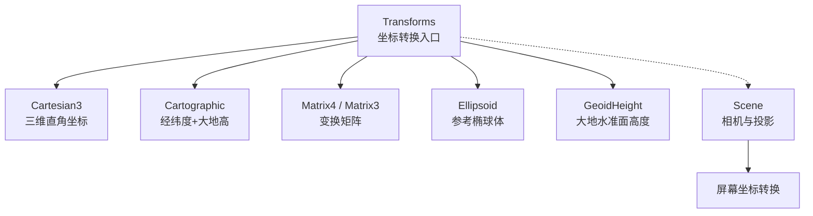
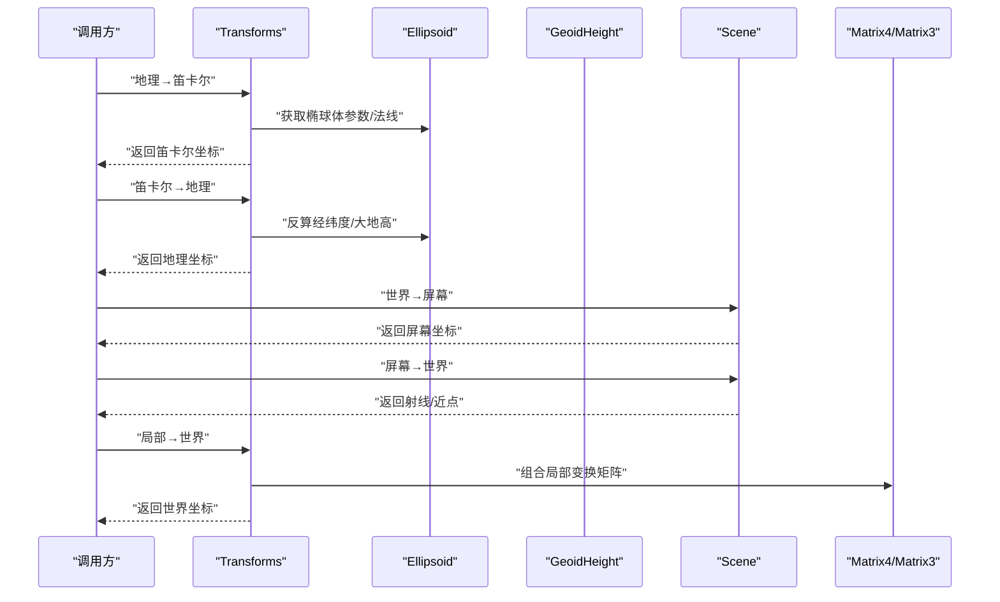
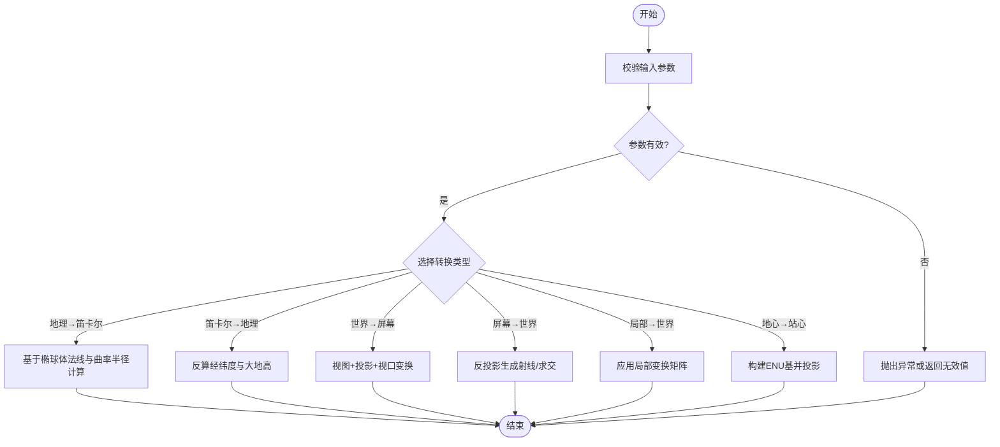
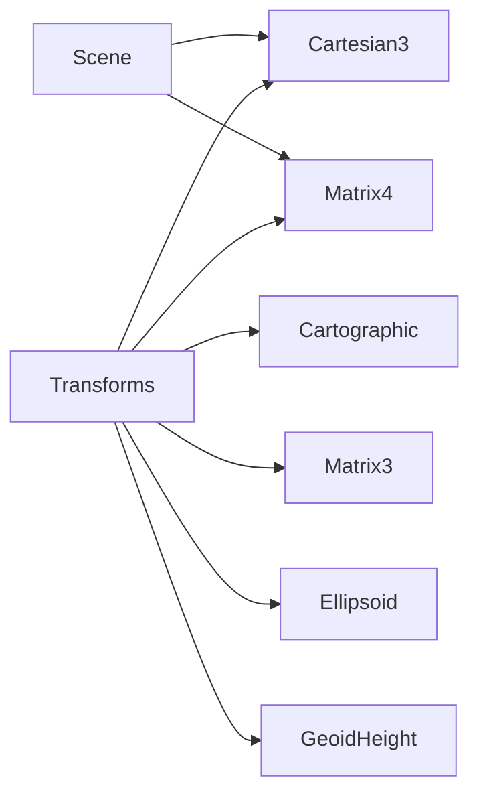

# 坐标转换方法

<cite>
**本文引用的文件**   
- [Transforms.js](file://Source/Core/Transforms.js)
- [Cartesian3.js](file://Source/Core/Cartesian3.js)
- [Cartographic.js](file://Source/Core/Cartographic.js)
- [Matrix4.js](file://Source/Core/Matrix4.js)
- [Matrix3.js](file://Source/Core/Matrix3.js)
- [Ellipsoid.js](file://Source/Core/Ellipsoid.js)
- [GeoidHeight.js](file://Source/Core/GeoidHeight.js)
- [Scene.js](file://Source/Scene/Scene.js)
</cite>

## 目录
1. [简介](#简介)
2. [项目结构](#项目结构)
3. [核心组件](#核心组件)
4. [架构总览](#架构总览)
5. [详细组件分析](#详细组件分析)
6. [依赖关系分析](#依赖关系分析)
7. [性能考虑](#性能考虑)
8. [故障排查指南](#故障排查指南)
9. [结论](#结论)
10. [附录：常见场景与示例路径](#附录常见场景与示例路径)

## 简介
本文件面向需要在 Cesium 中进行坐标转换的开发者，系统化梳理 Transforms 类的静态转换能力，覆盖笛卡尔坐标与地理坐标（经纬度、大地高）互转、世界坐标与屏幕坐标互转、局部坐标系与世界坐标系的转换。文档同时给出椭球体模型参数配置、大地水准面高度计算、地心到站心转换算法要点，并提供精度控制、异常处理与性能优化建议，以及常见转换场景的代码片段路径以便快速定位实现。

## 项目结构
Cesium 的坐标转换相关核心代码集中在 Source/Core 下的数学与几何模块中，其中 Transforms 提供统一的转换接口；Cartesian3、Cartographic、Matrix4、Matrix3、Ellipsoid 等类型作为基础数据结构与工具被广泛复用；GeoidHeight 负责大地水准面高度计算；Scene 提供相机投影相关的屏幕坐标转换能力。

图表来源
- [Transforms.js](file://Source/Core/Transforms.js)
- [Cartesian3.js](file://Source/Core/Cartesian3.js)
- [Cartographic.js](file://Source/Core/Cartographic.js)
- [Matrix4.js](file://Source/Core/Matrix4.js)
- [Matrix3.js](file://Source/Core/Matrix3.js)
- [Ellipsoid.js](file://Source/Core/Ellipsoid.js)
- [GeoidHeight.js](file://Source/Core/GeoidHeight.js)
- [Scene.js](file://Source/Scene/Scene.js)

章节来源
- [Transforms.js](file://Source/Core/Transforms.js)
- [Cartesian3.js](file://Source/Core/Cartesian3.js)
- [Cartographic.js](file://Source/Core/Cartographic.js)
- [Matrix4.js](file://Source/Core/Matrix4.js)
- [Matrix3.js](file://Source/Core/Matrix3.js)
- [Ellipsoid.js](file://Source/Core/Ellipsoid.js)
- [GeoidHeight.js](file://Source/Core/GeoidHeight.js)
- [Scene.js](file://Source/Scene/Scene.js)

## 核心组件
- Transforms：提供一系列静态方法，用于在不同坐标系之间进行转换，包括笛卡尔↔地理、世界↔屏幕、局部↔世界、地心↔站心等。
- Cartesian3：表示三维直角坐标（x, y, z），常用于世界坐标或局部坐标。
- Cartographic：表示经纬度（弧度）与大地高（米），是地理坐标的标准表达。
- Matrix4/Matrix3：描述仿射/线性变换矩阵，用于组合旋转、平移、缩放等变换。
- Ellipsoid：定义参考椭球体（如 WGS84），提供法线、曲率半径、切平面等几何信息。
- GeoidHeight：根据位置计算大地水准面相对于参考椭球面的高度差，用于将大地高转换为海拔高。
- Scene：封装相机与投影管线，提供世界坐标与屏幕坐标之间的转换方法。

章节来源
- [Transforms.js](file://Source/Core/Transforms.js)
- [Cartesian3.js](file://Source/Core/Cartesian3.js)
- [Cartographic.js](file://Source/Core/Cartographic.js)
- [Matrix4.js](file://Source/Core/Matrix4.js)
- [Matrix3.js](file://Source/Core/Matrix3.js)
- [Ellipsoid.js](file://Source/Core/Ellipsoid.js)
- [GeoidHeight.js](file://Source/Core/GeoidHeight.js)
- [Scene.js](file://Source/Scene/Scene.js)

## 架构总览
下图展示了从用户输入到最终输出的典型坐标转换流程，涵盖地理坐标与笛卡尔坐标互转、世界坐标与屏幕坐标互转、以及局部坐标系与世界坐标系的转换。

图表来源
- [Transforms.js](file://Source/Core/Transforms.js)
- [Ellipsoid.js](file://Source/Core/Ellipsoid.js)
- [GeoidHeight.js](file://Source/Core/GeoidHeight.js)
- [Scene.js](file://Source/Scene/Scene.js)
- [Matrix4.js](file://Source/Core/Matrix4.js)
- [Matrix3.js](file://Source/Core/Matrix3.js)

## 详细组件分析

### 笛卡尔坐标与地理坐标互转
- 功能说明
  - 地理坐标（经度、纬度、大地高）与笛卡尔坐标（x, y, z）在指定椭球体上进行双向转换。
  - 支持自定义椭球体（默认通常为 WGS84）。
- 关键要点
  - 使用椭球体的法线与曲率半径将经纬度映射到表面法线方向，再叠加大地高得到笛卡尔坐标。
  - 反向转换通过归一化向量与迭代求解确定经纬度，并依据椭球体方程计算大地高。
- 精度控制
  - 可设置角度单位（弧度/度）、高度单位（米/英尺等）及椭球体参数以匹配数据源。
  - 对极区与赤道附近需关注数值稳定性，必要时引入容差阈值。
- 异常处理
  - 输入经纬度越界时进行归一化处理或抛出明确错误。
  - 零长度向量或接近极点位置需特殊分支处理。
- 性能建议
  - 批量转换时复用中间变量与矩阵，避免频繁分配对象。
  - 固定椭球体时可缓存常用常量（如半长轴、扁率）。

章节来源
- [Transforms.js](file://Source/Core/Transforms.js)
- [Cartesian3.js](file://Source/Core/Cartesian3.js)
- [Cartographic.js](file://Source/Core/Cartographic.js)
- [Ellipsoid.js](file://Source/Core/Ellipsoid.js)

### 世界坐标与屏幕坐标转换
- 功能说明
  - 世界坐标（笛卡尔）与屏幕像素坐标的双向转换，由 Scene 的相机投影管线完成。
- 关键要点
  - 世界→屏幕：将世界坐标乘以视图矩阵与投影矩阵，再进行视口变换得到像素坐标。
  - 屏幕→世界：通常返回一条从相机出发的射线，结合深度或地面高度求交得到世界坐标。
- 精度控制
  - 注意浮点精度与视口分辨率，超大场景下建议使用双精度或分块计算。
  - 屏幕坐标取整前后保持一致性，避免抖动。
- 异常处理
  - 目标点位于相机后方或投影失败时返回无效值或空结果。
  - 深度范围外或裁剪面外的点应做边界检查。
- 性能建议
  - 批量转换时复用矩阵与临时数组，减少 GC 压力。
  - 对高频交互（鼠标移动）采用节流或采样策略。

章节来源
- [Scene.js](file://Source/Scene/Scene.js)
- [Matrix4.js](file://Source/Core/Matrix4.js)
- [Cartesian3.js](file://Source/Core/Cartesian3.js)

### 局部坐标系与世界坐标系转换
- 功能说明
  - 将局部坐标（例如物体自身坐标系）通过变换矩阵转换到世界坐标系，反之亦然。
- 关键要点
  - 局部→世界：应用局部变换矩阵（包含平移、旋转、缩放）到局部坐标。
  - 世界→局部：使用局部变换矩阵的逆矩阵进行反变换。
- 精度控制
  - 旋转矩阵应保持正交性，必要时进行重正交化以避免累积误差。
  - 缩放因子过大或过小可能导致数值不稳定，需合理归一化。
- 异常处理
  - 奇异矩阵（行列式为零）无法求逆，需检测并回退到近似解或报错。
  - 非均匀缩放与顺序敏感的组合需严格遵循约定顺序。
- 性能建议
  - 预计算并缓存变换矩阵及其逆矩阵，避免每帧重复计算。
  - 合并多次变换为单一矩阵以减少乘法次数。

章节来源
- [Transforms.js](file://Source/Core/Transforms.js)
- [Matrix4.js](file://Source/Core/Matrix4.js)
- [Matrix3.js](file://Source/Core/Matrix3.js)
- [Cartesian3.js](file://Source/Core/Cartesian3.js)

### 地心坐标系到站心坐标系的转换
- 功能说明
  - 将地心直角坐标（ECEF）转换到以某观测点为中心的站心坐标系（ENU：东-北-天）。
- 关键要点
  - 先计算观测点的经纬度与法线方向，构建 ENU 基矩阵。
  - 将目标点相对观测点的向量在该基上投影得到 ENU 坐标。
- 精度控制
  - 观测点靠近极点时需特别处理基向量构造，避免退化。
  - 距离较远时建议使用高精度浮点运算。
- 异常处理
  - 输入点与观测点重合时应返回零向量或明确提示。
  - 非法经纬度需提前校验。
- 性能建议
  - 批量转换时复用基矩阵与中间向量。
  - 若观测点固定，可缓存其 ENU 基矩阵。

章节来源
- [Transforms.js](file://Source/Core/Transforms.js)
- [Cartesian3.js](file://Source/Core/Cartesian3.js)
- [Cartographic.js](file://Source/Core/Cartographic.js)
- [Ellipsoid.js](file://Source/Core/Ellipsoid.js)

### 椭球体模型参数配置
- 功能说明
  - 通过 Ellipsoid 配置参考椭球体（如 WGS84 的半长轴与扁率），影响所有基于椭球的转换。
- 关键要点
  - 不同区域或任务可使用不同的椭球体以提高精度。
  - 椭球体参数变化会影响法线、曲率半径与大地高计算。
- 精度控制
  - 选择与数据源一致的椭球体，避免系统性偏差。
  - 对高精度需求，可启用更高精度的常数与算法。
- 异常处理
  - 非法参数（负半长轴、扁率越界）应拒绝初始化。
- 性能建议
  - 全局统一椭球体实例，避免重复创建。

章节来源
- [Ellipsoid.js](file://Source/Core/Ellipsoid.js)
- [Transforms.js](file://Source/Core/Transforms.js)

### 大地水准面高度计算
- 功能说明
  - 使用 GeoidHeight 计算大地水准面相对于参考椭球面的高度差，从而将大地高转换为海拔高。
- 关键要点
  - 大地水准面模型通常基于全球地形与重力场数据，具有空间变化的特性。
  - 计算结果受分辨率与插值方法影响。
- 精度控制
  - 选择合适的大地水准面模型与分辨率以满足精度要求。
  - 对沿海与山区需注意模型覆盖与插值误差。
- 异常处理
  - 超出模型覆盖范围时返回默认值或警告。
- 性能建议
  - 批量计算时缓存最近邻或分块查询结果。

章节来源
- [GeoidHeight.js](file://Source/Core/GeoidHeight.js)
- [Transforms.js](file://Source/Core/Transforms.js)

### 转换流程图（算法视角）

图表来源
- [Transforms.js](file://Source/Core/Transforms.js)
- [Ellipsoid.js](file://Source/Core/Ellipsoid.js)
- [Scene.js](file://Source/Scene/Scene.js)
- [Matrix4.js](file://Source/Core/Matrix4.js)
- [Cartesian3.js](file://Source/Core/Cartesian3.js)
- [Cartographic.js](file://Source/Core/Cartographic.js)

## 依赖关系分析
- 低耦合高内聚
  - Transforms 作为转换入口，依赖基础类型与工具类，保持职责单一。
- 直接依赖
  - Transforms → Cartesian3、Cartographic、Matrix4、Matrix3、Ellipsoid、GeoidHeight、Scene。
- 间接依赖
  - Scene 内部依赖投影矩阵与相机状态，对外暴露转换接口。
- 潜在循环依赖
  - 当前设计未见明显循环依赖，但应避免在基础类型中反向引用高层模块。

图表来源
- [Transforms.js](file://Source/Core/Transforms.js)
- [Cartesian3.js](file://Source/Core/Cartesian3.js)
- [Cartographic.js](file://Source/Core/Cartographic.js)
- [Matrix4.js](file://Source/Core/Matrix4.js)
- [Matrix3.js](file://Source/Core/Matrix3.js)
- [Ellipsoid.js](file://Source/Core/Ellipsoid.js)
- [GeoidHeight.js](file://Source/Core/GeoidHeight.js)
- [Scene.js](file://Source/Scene/Scene.js)

章节来源
- [Transforms.js](file://Source/Core/Transforms.js)
- [Scene.js](file://Source/Scene/Scene.js)

## 性能考虑
- 对象复用
  - 批量转换时复用 Cartesian3、Cartographic、Matrix4 等对象，减少内存分配。
- 矩阵缓存
  - 固定观测点或局部变换矩阵可缓存，避免每帧重建。
- 数值稳定
  - 对极区、近相机点、大尺度场景采用条件分支与容差控制。
- 并行与批处理
  - 对大规模点集转换可采用分块与并行策略（注意线程安全与数据拷贝成本）。
- I/O 与模型
  - 大地水准面高度计算涉及外部数据，尽量缓存与分块加载。

[本节为通用指导，不直接分析具体文件]

## 故障排查指南
- 常见问题
  - 经纬度越界：确保输入经度在 [-π, π]、纬度在 [-π/2, π/2]，并进行归一化。
  - 屏幕坐标异常：检查相机是否可见目标点、深度范围与视口尺寸是否正确。
  - 局部变换奇异：检测矩阵行列式，避免零缩放或退化旋转。
  - 极区转换不稳定：增加容差或使用更稳定的基向量构造方法。
- 调试技巧
  - 打印中间结果（经纬度、法线、矩阵元素）验证每一步。
  - 使用已知基准点（如原点、极点）进行回归测试。
- 日志与断言
  - 在关键分支加入断言与日志，便于定位问题。

章节来源
- [Transforms.js](file://Source/Core/Transforms.js)
- [Scene.js](file://Source/Scene/Scene.js)
- [Matrix4.js](file://Source/Core/Matrix4.js)

## 结论
Transforms 提供了全面而高效的坐标转换能力，配合 Ellipsoid、GeoidHeight 与 Scene 可实现从地理到屏幕的全链路转换。在实际工程中，应重视椭球体配置、大地水准面高度、数值稳定性与性能优化，并通过合理的异常处理与调试手段保障可靠性。

[本节为总结性内容，不直接分析具体文件]

## 附录：常见场景与示例路径
- 地理坐标转笛卡尔坐标
  - 示例路径：[Transforms.js](file://Source/Core/Transforms.js)
- 笛卡尔坐标转地理坐标
  - 示例路径：[Transforms.js](file://Source/Core/Transforms.js)
- 世界坐标转屏幕坐标
  - 示例路径：[Scene.js](file://Source/Scene/Scene.js)
- 屏幕坐标转世界坐标（射线/求交）
  - 示例路径：[Scene.js](file://Source/Scene/Scene.js)
- 局部坐标转世界坐标
  - 示例路径：[Transforms.js](file://Source/Core/Transforms.js), [Matrix4.js](file://Source/Core/Matrix4.js)
- 地心坐标转站心坐标（ENU）
  - 示例路径：[Transforms.js](file://Source/Core/Transforms.js)
- 椭球体参数配置（WGS84 等）
  - 示例路径：[Ellipsoid.js](file://Source/Core/Ellipsoid.js)
- 大地水准面高度计算（大地高→海拔高）
  - 示例路径：[GeoidHeight.js](file://Source/Core/GeoidHeight.js)

[本节仅列出文件路径，不包含具体代码内容]