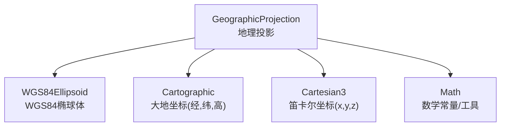
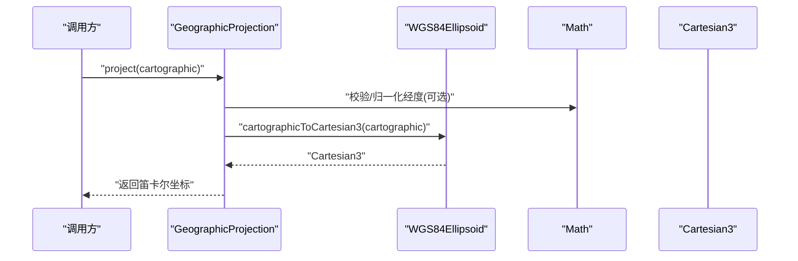
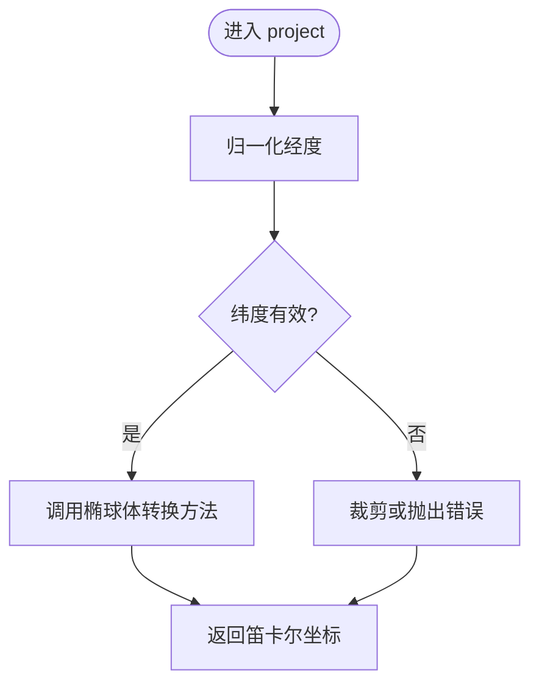
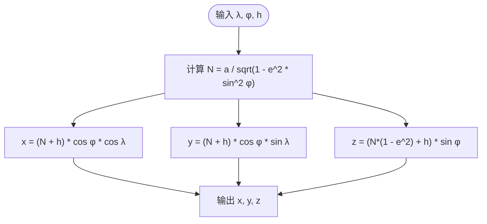
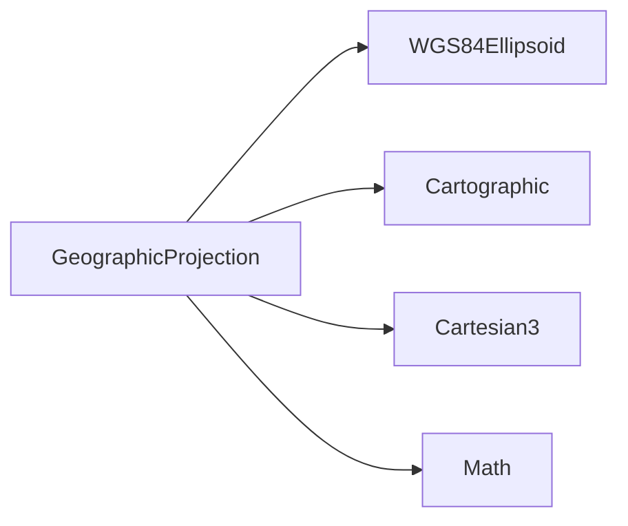

# 地理投影

<cite>
**本文引用的文件**   
- [GeographicProjection.js](file://Source/Core/GeographicProjection.js)
- [WGS84Ellipsoid.js](file://Source/Core/WGS84Ellipsoid.js)
- [Cartesian3.js](file://Source/Core/Cartesian3.js)
- [Cartographic.js](file://Source/Core/Cartographic.js)
- [Math.js](file://Source/Core/Math.js)
</cite>

## 目录
1. [简介](#简介)
2. [项目结构](#项目结构)
3. [核心组件](#核心组件)
4. [架构总览](#架构总览)
5. [详细组件分析](#详细组件分析)
6. [依赖关系分析](#依赖关系分析)
7. [性能考虑](#性能考虑)
8. [故障排查指南](#故障排查指南)
9. [结论](#结论)
10. [附录](#附录)

## 简介
本文件面向Cesium的地理投影机制，聚焦于基于经纬度坐标的直接映射实现。内容涵盖：
- GeographicProjection类的实现原理与职责边界
- WGS84椭球体模型、大地坐标系与空间直角坐标系的转换关系
- 经纬度到笛卡尔坐标的数学公式、精度控制与边界处理
- 使用场景、优缺点分析与最佳实践
- 常见问题与解决方案

## 项目结构
围绕地理投影的核心代码位于Core模块中，关键文件包括：
- GeographicProjection：定义“经纬度直接映射”的投影策略
- WGS84Ellipsoid：提供WGS84参考椭球参数与几何方法
- Cartographic：封装经度、纬度、高度等大地坐标
- Cartesian3：三维笛卡尔坐标向量
- Math：常用数学常量与工具（如弧度/角度换算）

图表来源
- [GeographicProjection.js](file://Source/Core/GeographicProjection.js)
- [WGS84Ellipsoid.js](file://Source/Core/WGS84Ellipsoid.js)
- [Cartographic.js](file://Source/Core/Cartographic.js)
- [Cartesian3.js](file://Source/Core/Cartesian3.js)
- [Math.js](file://Source/Core/Math.js)

章节来源
- [GeographicProjection.js](file://Source/Core/GeographicProjection.js)
- [WGS84Ellipsoid.js](file://Source/Core/WGS84Ellipsoid.js)
- [Cartographic.js](file://Source/Core/Cartographic.js)
- [Cartesian3.js](file://Source/Core/Cartesian3.js)
- [Math.js](file://Source/Core/Math.js)

## 核心组件
- GeographicProjection
  - 职责：将Cartographic（经度、纬度、高度）直接映射为Cartesian3（单位球面上的点），不进行平面投影变形。
  - 输入：Cartographic对象（经度、纬度、高度）
  - 输出：Cartesian3对象（单位球面或按半径缩放后的位置）
- WGS84Ellipsoid
  - 职责：提供WGS84椭球体的半长轴、扁率、离心率等参数，以及将Cartographic转换为Cartesian3的通用方法。
- Cartographic
  - 职责：表示大地坐标（经度、纬度、高度），内部以弧度存储经度和纬度。
- Cartesian3
  - 职责：三维笛卡尔坐标向量，用于表示空间中的点。
- Math
  - 职责：提供PI、TWO_PI、DEGREES_TO_RADIANS等常量与辅助函数。

章节来源
- [GeographicProjection.js](file://Source/Core/GeographicProjection.js)
- [WGS84Ellipsoid.js](file://Source/Core/WGS84Ellipsoid.js)
- [Cartographic.js](file://Source/Core/Cartographic.js)
- [Cartesian3.js](file://Source/Core/Cartesian3.js)
- [Math.js](file://Source/Core/Math.js)

## 架构总览
下图展示了从用户传入的经纬度到最终笛卡尔坐标的调用链与数据流。

图表来源
- [GeographicProjection.js](file://Source/Core/GeographicProjection.js)
- [WGS84Ellipsoid.js](file://Source/Core/WGS84Ellipsoid.js)
- [Cartesian3.js](file://Source/Core/Cartesian3.js)
- [Math.js](file://Source/Core/Math.js)

## 详细组件分析

### GeographicProjection类分析
- 设计要点
  - “地理投影”并非传统意义上的平面投影，而是将地球表面点直接映射到单位球面（或指定半径）上的笛卡尔坐标。
  - 通常委托给椭球体的“大地坐标转笛卡尔坐标”方法完成计算。
- 关键流程
  - 接收Cartographic输入
  - 对经度进行范围归一化（例如[-π, π]）
  - 调用椭球体方法进行坐标转换
  - 返回Cartesian3结果
- 边界与异常
  - 经度越界时进行归一化处理
  - 纬度越界时进行裁剪或报错（取决于实现）
  - 高度参与或不参与半径缩放（取决于是否使用椭球体半径）

图表来源
- [GeographicProjection.js](file://Source/Core/GeographicProjection.js)
- [WGS84Ellipsoid.js](file://Source/Core/WGS84Ellipsoid.js)
- [Cartographic.js](file://Source/Core/Cartographic.js)
- [Cartesian3.js](file://Source/Core/Cartesian3.js)
- [Math.js](file://Source/Core/Math.js)

章节来源
- [GeographicProjection.js](file://Source/Core/GeographicProjection.js)
- [WGS84Ellipsoid.js](file://Source/Core/WGS84Ellipsoid.js)
- [Cartographic.js](file://Source/Core/Cartographic.js)
- [Cartesian3.js](file://Source/Core/Cartesian3.js)
- [Math.js](file://Source/Core/Math.js)

### WGS84椭球体与坐标转换关系
- 椭球体参数
  - 半长轴a、扁率f、半短轴b、第一偏心率e²等
- 坐标体系
  - 大地坐标系：经度λ、纬度φ、高度h（Cartographic）
  - 空间直角坐标系：x、y、z（Cartesian3）
- 转换思路
  - 先由φ、λ计算卯酉圈曲率半径N
  - 再根据N与h计算x、y、z
  - 若需要单位球面，可将结果除以椭球体半径

图表来源
- [WGS84Ellipsoid.js](file://Source/Core/WGS84Ellipsoid.js)
- [Cartesian3.js](file://Source/Core/Cartesian3.js)
- [Cartographic.js](file://Source/Core/Cartographic.js)
- [Math.js](file://Source/Core/Math.js)

章节来源
- [WGS84Ellipsoid.js](file://Source/Core/WGS84Ellipsoid.js)
- [Cartesian3.js](file://Source/Core/Cartesian3.js)
- [Cartographic.js](file://Source/Core/Cartographic.js)
- [Math.js](file://Source/Core/Math.js)

### 经纬度到笛卡尔坐标的数学公式与精度控制
- 公式要点
  - 使用WGS84椭球体参数计算N
  - 通过三角函数将(λ, φ, h)映射到(x, y, z)
- 精度控制
  - 使用双精度浮点数减少舍入误差
  - 在极区附近注意数值稳定性（sin/cos接近极值时的误差）
- 边界处理
  - 经度归一化到[-π, π]
  - 纬度限制到[-π/2, π/2]
  - 高度可为负（低于椭球面）或正（高于椭球面）

章节来源
- [WGS84Ellipsoid.js](file://Source/Core/WGS84Ellipsoid.js)
- [Math.js](file://Source/Core/Math.js)

### 使用场景、优缺点与最佳实践
- 适用场景
  - 需要在单位球面上定位点（如卫星轨道、天体可视化）
  - 不需要平面投影变形的全局视图
  - 作为其他投影的前置步骤（先得到笛卡尔坐标再进行后续变换）
- 优点
  - 简单直观，计算开销小
  - 保持球面几何一致性，适合距离/法线计算
- 缺点
  - 不适合直接用于平面地图显示（存在面积/形状/距离失真）
  - 在高纬度地区屏幕像素与地面距离不一致
- 最佳实践
  - 始终确保经度、纬度在有效范围内
  - 对大量点进行批处理时复用中间变量，避免重复计算
  - 结合椭球体方法统一进行坐标转换，保证一致性

[本节为概念性说明，不直接分析具体文件，故无章节来源]

## 依赖关系分析
- 组件耦合
  - GeographicProjection依赖WGS84Ellipsoid完成核心转换
  - 使用Cartographic作为输入载体，Cartesian3作为输出载体
  - 借助Math进行角度/弧度换算与常量访问
- 外部依赖
  - 无额外第三方库，全部基于Core模块内部类型与工具

图表来源
- [GeographicProjection.js](file://Source/Core/GeographicProjection.js)
- [WGS84Ellipsoid.js](file://Source/Core/WGS84Ellipsoid.js)
- [Cartographic.js](file://Source/Core/Cartographic.js)
- [Cartesian3.js](file://Source/Core/Cartesian3.js)
- [Math.js](file://Source/Core/Math.js)

章节来源
- [GeographicProjection.js](file://Source/Core/GeographicProjection.js)
- [WGS84Ellipsoid.js](file://Source/Core/WGS84Ellipsoid.js)
- [Cartographic.js](file://Source/Core/Cartographic.js)
- [Cartesian3.js](file://Source/Core/Cartesian3.js)
- [Math.js](file://Source/Core/Math.js)

## 性能考虑
- 计算复杂度
  - 单次转换主要为常数时间操作（三角函数与基本算术）
- 优化建议
  - 批量转换时缓存公共常量（如a、e²）
  - 避免在高频循环中重复创建临时对象
  - 对极区数据进行数值稳定检查（必要时引入条件分支）

[本节为通用性能指导，不直接分析具体文件，故无章节来源]

## 故障排查指南
- 常见错误
  - 经度超出范围导致位置错位：需进行归一化
  - 纬度越界导致无效点：需裁剪或拒绝输入
  - 高度符号理解错误：确认高度相对于椭球面的正负含义
- 调试建议
  - 打印中间变量（N、sinφ、cosφ）验证数值合理性
  - 对比已知参考点的转换结果进行回归测试
  - 在极端纬度（接近±90°）下增加容差判断

章节来源
- [GeographicProjection.js](file://Source/Core/GeographicProjection.js)
- [WGS84Ellipsoid.js](file://Source/Core/WGS84Ellipsoid.js)
- [Cartographic.js](file://Source/Core/Cartographic.js)
- [Cartesian3.js](file://Source/Core/Cartesian3.js)
- [Math.js](file://Source/Core/Math.js)

## 结论
GeographicProjection提供了将经纬度直接映射到笛卡尔坐标的简洁路径，适用于球面定位与基础几何计算。其优势在于简单高效，但需注意平面展示时的失真问题。通过严格遵循输入范围、合理使用椭球体方法与精度控制，可在大多数场景中取得稳定可靠的结果。

[本节为总结性内容，不直接分析具体文件，故无章节来源]

## 附录
- 术语对照
  - 大地坐标系：经度、纬度、高度（Cartographic）
  - 空间直角坐标系：x、y、z（Cartesian3）
  - 单位球面：半径为1的球面，常用于标准化位置
- 相关API路径（便于快速定位源码）
  - 投影入口：[GeographicProjection.js](file://Source/Core/GeographicProjection.js)
  - 椭球体方法：[WGS84Ellipsoid.js](file://Source/Core/WGS84Ellipsoid.js)
  - 坐标载体：[Cartographic.js](file://Source/Core/Cartographic.js)、[Cartesian3.js](file://Source/Core/Cartesian3.js)
  - 数学工具：[Math.js](file://Source/Core/Math.js)

[本节为补充信息，不直接分析具体文件，故无章节来源]