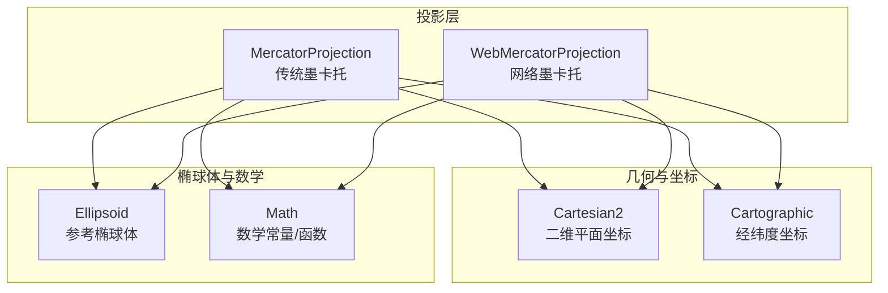
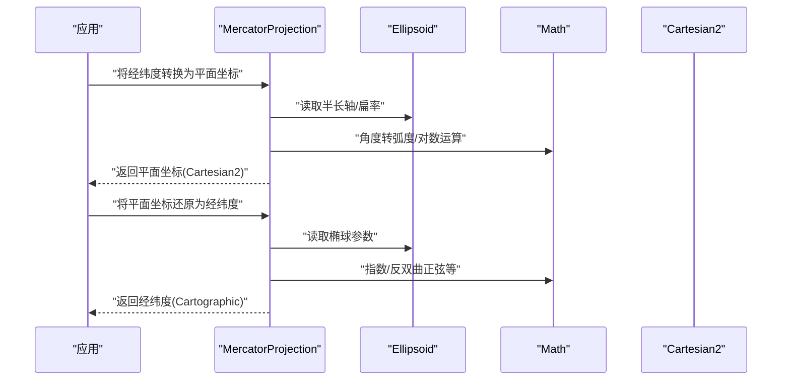
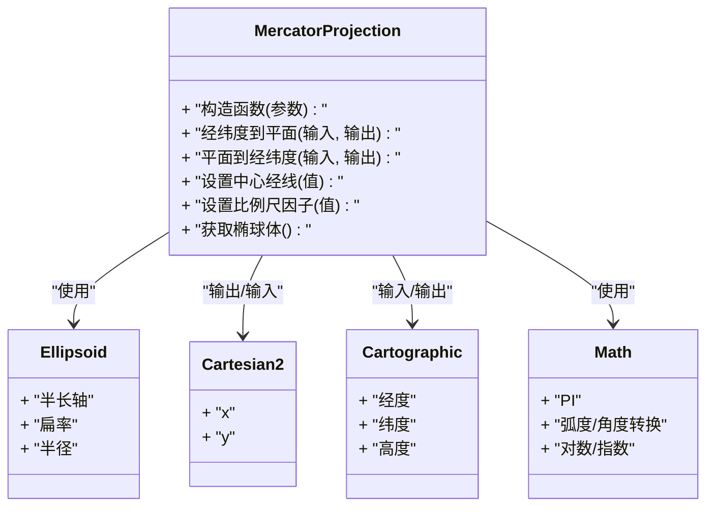
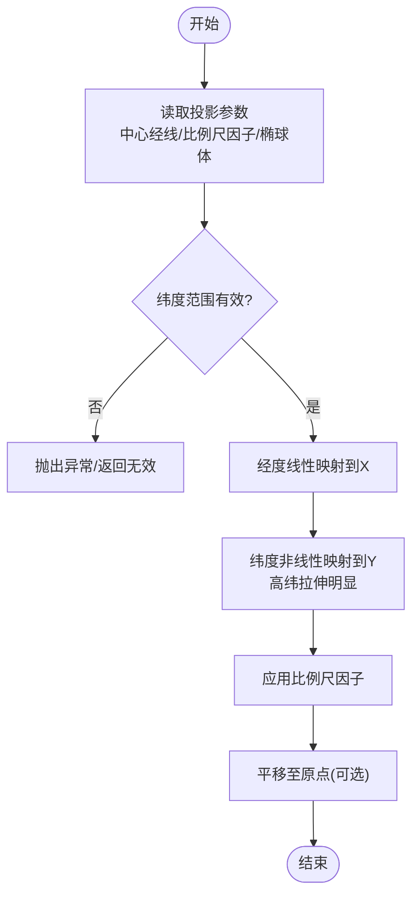
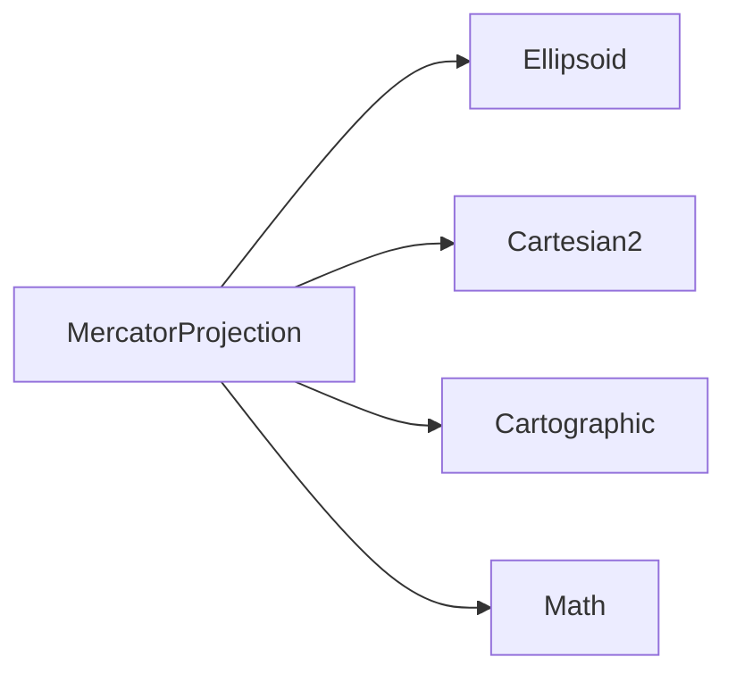

# 墨卡托投影

<cite>
**本文引用的文件**   
- [MercatorProjection.js](file://Source/Core/MercatorProjection.js)
- [WebMercatorProjection.js](file://Source/Core/WebMercatorProjection.js)
- [Ellipsoid.js](file://Source/Core/Ellipsoid.js)
- [Cartesian2.js](file://Source/Core/Cartesian2.js)
- [Cartographic.js](file://Source/Core/Cartographic.js)
- [Math.js](file://Source/Core/Math.js)
</cite>

## 目录
1. [简介](#简介)
2. [项目结构](#项目结构)
3. [核心组件](#核心组件)
4. [架构总览](#架构总览)
5. [详细组件分析](#详细组件分析)
6. [依赖关系分析](#依赖关系分析)
7. [性能考虑](#性能考虑)
8. [故障排查指南](#故障排查指南)
9. [结论](#结论)
10. [附录](#附录)

## 简介
本文件面向专业GIS与三维地球可视化开发者，系统性梳理Cesium中“传统墨卡托投影”的实现与应用。重点围绕MercatorProjection类，阐述其与传统（经典）墨卡托投影的数学原理、经线平行线与纬线间距变化规律、参数配置（中心经线、比例尺控制）、适用场景与精度要求，并对比网络墨卡托（EPSG:3857）的差异，给出迁移与实践建议。

## 项目结构
在Cesium代码库中，投影相关实现主要位于Core模块：
- MercatorProjection.js：传统墨卡托投影实现
- WebMercatorProjection.js：网络墨卡托（Web Mercator）实现
- Ellipsoid.js：参考椭球体定义与计算
- Cartographic.js：经纬度坐标封装
- Cartesian2.js：二维平面坐标封装
- Math.js：常用数学常量与函数

图表来源
- [MercatorProjection.js](file://Source/Core/MercatorProjection.js)
- [WebMercatorProjection.js](file://Source/Core/WebMercatorProjection.js)
- [Cartesian2.js](file://Source/Core/Cartesian2.js)
- [Cartographic.js](file://Source/Core/Cartographic.js)
- [Ellipsoid.js](file://Source/Core/Ellipsoid.js)
- [Math.js](file://Source/Core/Math.js)

章节来源
- [MercatorProjection.js](file://Source/Core/MercatorProjection.js)
- [WebMercatorProjection.js](file://Source/Core/WebMercatorProjection.js)
- [Ellipsoid.js](file://Source/Core/Ellipsoid.js)
- [Cartesian2.js](file://Source/Core/Cartesian2.js)
- [Cartographic.js](file://Source/Core/Cartographic.js)
- [Math.js](file://Source/Core/Math.js)

## 核心组件
- MercatorProjection：提供传统（经典）墨卡托投影的正算（经纬度→平面）与反算（平面→经纬度），支持自定义中心经线与比例尺因子，适用于需要严格保角且遵循经典公式的专业GIS场景。
- WebMercatorProjection：网络墨卡托实现，固定使用WGS84椭球与标准分块/切片约定，广泛用于在线地图服务。
- Ellipsoid：定义参考椭球体（如WGS84），为投影提供半长轴、扁率等基础参数。
- Cartographic/Cartesian2：经纬度与平面坐标的数据载体，贯穿投影转换流程。
- Math：提供π、弧度/角度换算等基础数学能力。

章节来源
- [MercatorProjection.js](file://Source/Core/MercatorProjection.js)
- [WebMercatorProjection.js](file://Source/Core/WebMercatorProjection.js)
- [Ellipsoid.js](file://Source/Core/Ellipsoid.js)
- [Cartesian2.js](file://Source/Core/Cartesian2.js)
- [Cartographic.js](file://Source/Core/Cartographic.js)
- [Math.js](file://Source/Core/Math.js)

## 架构总览
传统墨卡托投影在Cesium中的调用路径通常如下：
- 输入：Cartographic（经纬度）或笛卡尔坐标
- 处理：MercatorProjection根据椭球体与投影参数执行正/反算
- 输出：Cartesian2（平面米制坐标）

图表来源
- [MercatorProjection.js](file://Source/Core/MercatorProjection.js)
- [Ellipsoid.js](file://Source/Core/Ellipsoid.js)
- [Cartesian2.js](file://Source/Core/Cartesian2.js)
- [Cartographic.js](file://Source/Core/Cartographic.js)
- [Math.js](file://Source/Core/Math.js)

## 详细组件分析

### MercatorProjection（传统墨卡托）
- 设计目标
  - 严格遵循经典墨卡托投影的保角性质
  - 允许自定义中心经线与比例尺因子，适配不同区域与精度需求
- 关键特性
  - 正算：经纬度→平面米制坐标
  - 反算：平面米制坐标→经纬度
  - 参数化：中心经线、比例尺因子、基准点（原点）
  - 椭球体：基于Ellipsoid定义的半长轴与扁率
- 适用场景
  - 需要精确保角与可配置比例尺的专业测绘、海图、工程测量
  - 与EPSG:3395等传统投影体系对接的系统
- 不适用场景
  - 大规模在线瓦片服务（更推荐WebMercatorProjection）

图表来源
- [MercatorProjection.js](file://Source/Core/MercatorProjection.js)
- [Ellipsoid.js](file://Source/Core/Ellipsoid.js)
- [Cartesian2.js](file://Source/Core/Cartesian2.js)
- [Cartographic.js](file://Source/Core/Cartographic.js)
- [Math.js](file://Source/Core/Math.js)

章节来源
- [MercatorProjection.js](file://Source/Core/MercatorProjection.js)
- [Ellipsoid.js](file://Source/Core/Ellipsoid.js)
- [Cartesian2.js](file://Source/Core/Cartesian2.js)
- [Cartographic.js](file://Source/Core/Cartographic.js)
- [Math.js](file://Source/Core/Math.js)

### 传统墨卡托 vs 网络墨卡托（差异与适用性）
- 椭球体与基准
  - 传统墨卡托：可配置椭球体与比例尺因子，适合按区域优化
  - 网络墨卡托：固定WGS84椭球与标准分块约定，便于全球一致拼接
- 比例尺与原点
  - 传统墨卡托：支持自定义比例尺因子与原点，利于局部高精度
  - 网络墨卡托：采用标准缩放级别与切块规则，便于在线服务
- 适用范围
  - 传统墨卡托：专业测绘、海图、工程测量、区域定制系统
  - 网络墨卡托：在线地图、瓦片服务、跨平台共享

章节来源
- [MercatorProjection.js](file://Source/Core/MercatorProjection.js)
- [WebMercatorProjection.js](file://Source/Core/WebMercatorProjection.js)

### 数学原理与几何特性
- 保角性质
  - 经线为等间距垂直线，纬线为水平线；高纬地区纬线间距随纬度增大而显著放大
- 正算要点
  - 经度线性映射至横坐标
  - 纬度通过双曲函数或对数形式映射至纵坐标，体现高纬拉伸
- 反算要点
  - 横坐标反解经度为线性关系
  - 纵坐标通过反双曲函数或指数/对数组合反解纬度
- 比例尺与中心经线
  - 比例尺因子影响整体尺度，中心经线决定零经度偏移

图表来源
- [MercatorProjection.js](file://Source/Core/MercatorProjection.js)
- [Math.js](file://Source/Core/Math.js)
- [Ellipsoid.js](file://Source/Core/Ellipsoid.js)

章节来源
- [MercatorProjection.js](file://Source/Core/MercatorProjection.js)
- [Math.js](file://Source/Core/Math.js)
- [Ellipsoid.js](file://Source/Core/Ellipsoid.js)

### 参数配置与使用要点
- 中心经线
  - 用于将期望的中心经线映射到平面坐标零点附近，减少变形
- 比例尺因子
  - 控制整体尺度，常用于匹配特定比例尺或单位换算
- 基准点（原点）
  - 可将任意地理点设为平面坐标原点，便于局部坐标系构建
- 椭球体选择
  - 依据数据源与精度要求选择合适的椭球体（如WGS84、CGCS2000等）

章节来源
- [MercatorProjection.js](file://Source/Core/MercatorProjection.js)
- [Ellipsoid.js](file://Source/Core/Ellipsoid.js)

### 数据处理技巧与精度要求
- 数据预处理
  - 统一坐标系与椭球体，避免混合基准导致偏差
  - 对大范围数据建议分带或分区投影，降低高纬拉伸带来的误差
- 数值稳定性
  - 接近极区时注意数值溢出与精度损失，必要时限制纬度范围
- 精度评估
  - 在高纬地区进行长度/面积量测时需评估投影变形，必要时改用等积投影

章节来源
- [MercatorProjection.js](file://Source/Core/MercatorProjection.js)
- [Ellipsoid.js](file://Source/Core/Ellipsoid.js)

### 与其他投影系统的对比与迁移指南
- 与EPSG:3395（Web Mercator）对比
  - 若需在线瓦片与全球一致性，优先使用WebMercatorProjection
  - 若需自定义比例尺与中心经线，使用MercatorProjection
- 与UTM/地方投影对比
  - UTM更适合大比例尺工程测量；传统墨卡托适合保角与航海用途
- 迁移步骤
  - 明确目标投影与椭球体
  - 确定中心经线与比例尺因子
  - 批量转换数据并校验关键点位
  - 建立元数据记录投影参数以便复用

章节来源
- [MercatorProjection.js](file://Source/Core/MercatorProjection.js)
- [WebMercatorProjection.js](file://Source/Core/WebMercatorProjection.js)

## 依赖关系分析
- 直接依赖
  - MercatorProjection依赖Ellipsoid、Cartesian2、Cartographic、Math
- 间接依赖
  - 上层业务通过Cartographic/Cartesian2与投影交互
- 耦合与内聚
  - 投影逻辑集中在MercatorProjection，内聚良好；对外暴露清晰的接口
- 外部集成点
  - 与栅格/矢量数据源的坐标系统一由Ellipsoid与投影参数保证

图表来源
- [MercatorProjection.js](file://Source/Core/MercatorProjection.js)
- [Ellipsoid.js](file://Source/Core/Ellipsoid.js)
- [Cartesian2.js](file://Source/Core/Cartesian2.js)
- [Cartographic.js](file://Source/Core/Cartographic.js)
- [Math.js](file://Source/Core/Math.js)

章节来源
- [MercatorProjection.js](file://Source/Core/MercatorProjection.js)
- [Ellipsoid.js](file://Source/Core/Ellipsoid.js)
- [Cartesian2.js](file://Source/Core/Cartesian2.js)
- [Cartographic.js](file://Source/Core/Cartographic.js)
- [Math.js](file://Source/Core/Math.js)

## 性能考虑
- 批量转换
  - 尽量复用投影实例与中间对象，减少分配开销
- 数值计算
  - 避免在极端纬度反复调用对数/指数函数，必要时缓存或限域
- 内存与并发
  - 多线程/Worker环境下确保线程安全与状态隔离

[本节为通用指导，不直接分析具体文件]

## 故障排查指南
- 常见错误
  - 纬度越界：超出投影有效范围
  - 比例尺因子异常：导致坐标尺度异常或溢出
  - 中心经线未设置：导致坐标偏移不符合预期
- 定位方法
  - 检查输入经纬度是否在合理范围
  - 验证投影参数（中心经线、比例尺因子、椭球体）
  - 使用已知基准点进行正向/反向校验

章节来源
- [MercatorProjection.js](file://Source/Core/MercatorProjection.js)

## 结论
传统墨卡托投影在Cesium中以MercatorProjection为核心实现，具备严格的保角性质与灵活的参数配置能力，适用于专业GIS与工程测量等高精度场景。与网络墨卡托相比，它在椭球体、比例尺与中心经线的可配置性上更具优势，但在线瓦片与全球一致性方面不如WebMercatorProjection。实际应用中应根据数据范围、精度需求与系统集成目标选择合适的投影方案，并做好参数管理与数据校验。

[本节为总结性内容，不直接分析具体文件]

## 附录
- 术语
  - 传统墨卡托：经典墨卡托投影，强调保角与可配置参数
  - 网络墨卡托：基于WGS84的标准在线地图投影
- 参考
  - 椭球体定义与参数见Ellipsoid
  - 坐标载体见Cartographic与Cartesian2
  - 数学工具见Math

[本节为补充说明，不直接分析具体文件]