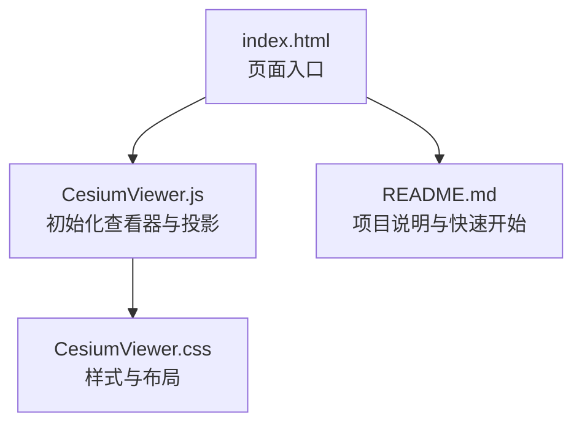
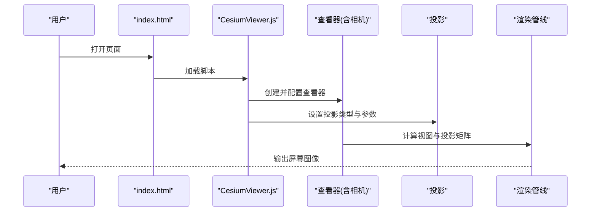
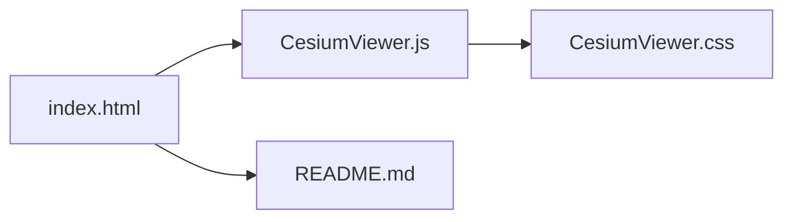

# 投影基础概念

<cite>
**本文引用的文件**   
- [README.md](file://README.md)
- [index.html](file://index.html)
- [CesiumViewer.js](file://Apps/CesiumViewer/CesiumViewer.js)
- [CesiumViewer.css](file://Apps/CesiumViewer/CesiumViewer.css)
</cite>

## 目录
1. [简介](#简介)
2. [项目结构](#项目结构)
3. [核心组件](#核心组件)
4. [架构总览](#架构总览)
5. [详细组件分析](#详细组件分析)
6. [依赖关系分析](#依赖关系分析)
7. [性能考虑](#性能考虑)
8. [故障排查指南](#故障排查指南)
9. [结论](#结论)
10. [附录](#附录)

## 简介
本文件聚焦于 Cesium 投影系统的基础概念，面向希望理解“投影是什么、为何重要、如何配置与选择”的读者。内容涵盖：
- 投影的基本原理与数学直觉（球面到平面的映射、保角/等积/折衷取舍）
- 地理坐标转换的重要性（WGS84 经纬度与平面像素坐标之间的桥梁）
- 抽象类设计模式在投影体系中的体现（接口契约、核心方法、扩展机制）
- 投影参数配置、坐标系参考框架、精度控制要点
- 投影选择的通用原则与性能权衡
- 投影失真的概念说明与可视化思路

为便于定位，文中所有涉及仓库内具体文件的分析均提供“章节来源”，并在需要时给出“图示来源”。

## 项目结构
仓库包含示例应用与文档资源，其中与投影相关的高层入口位于示例应用中。该示例通过初始化查看器并设置地图投影，演示了投影在应用层面的使用方式。

**图示来源**
- [index.html:1-200](file://index.html#L1-L200)
- [CesiumViewer.js:1-200](file://Apps/CesiumViewer/CesiumViewer.js#L1-L200)
- [CesiumViewer.css:1-200](file://Apps/CesiumViewer/CesiumViewer.css#L1-L200)
- [README.md:1-200](file://README.md#L1-L200)

**章节来源**
- [README.md:1-200](file://README.md#L1-L200)
- [index.html:1-200](file://index.html#L1-L200)
- [CesiumViewer.js:1-200](file://Apps/CesiumViewer/CesiumViewer.js#L1-L200)
- [CesiumViewer.css:1-200](file://Apps/CesiumViewer/CesiumViewer.css#L1-L200)

## 核心组件
本节从“概念 + 代码入口”的角度梳理与投影相关的核心点：
- 查看器与投影的关系：查看器负责渲染场景，其内部相机与投影共同决定如何将三维地球表面映射到二维屏幕。
- 投影配置位置：在示例应用中，通常通过查看器的构造或配置对象指定投影类型与相关参数。
- 坐标转换链路：地理坐标（经纬度）→ 地心/局部空间 → 投影平面坐标 → 屏幕像素坐标。

上述流程在示例应用中由页面脚本驱动，最终影响渲染管线中的投影矩阵与视口变换。

**章节来源**
- [CesiumViewer.js:1-200](file://Apps/CesiumViewer/CesiumViewer.js#L1-L200)
- [index.html:1-200](file://index.html#L1-L200)

## 架构总览
下图展示了从页面加载到渲染的关键路径，以及投影在其中扮演的角色。

**图示来源**
- [index.html:1-200](file://index.html#L1-L200)
- [CesiumViewer.js:1-200](file://Apps/CesiumViewer/CesiumViewer.js#L1-L200)

## 详细组件分析

### 投影抽象类的设计模式（概念性说明）
在 Cesium 中，投影通常以抽象类/接口的方式定义统一契约，例如：
- 接口定义：声明将“地理坐标”转换为“投影平面坐标”的方法，以及反向转换方法。
- 核心方法：包括正向投影、反投影、边界框计算、单位与范围校验等。
- 扩展机制：通过继承抽象类实现具体投影（如墨卡托、兰伯特等），复用公共逻辑，仅覆盖差异化的数学实现。

该模式的好处是：
- 统一 API：上层组件无需关心具体投影细节。
- 可插拔：新增投影只需实现约定接口。
- 可测试：对抽象契约进行单元测试，确保不同实现的等价性与一致性。

注意：本节为概念性说明，不直接引用具体源码文件。

### 投影参数配置与坐标系参考框架
- 投影参数：常见参数包括中央经线、标准纬线、比例因子、原点偏移、单位等；这些参数决定投影的几何特性与失真分布。
- 坐标系参考框架：Cesium 默认基于 WGS84 椭球体，地理坐标通常为经纬度（弧度制）。投影将此类坐标映射到平面直角坐标（米或其他单位）。
- 精度控制：浮点精度、数值稳定性与缩放级别密切相关；在大范围或高精度场景中需关注数值误差累积。

**章节来源**
- [CesiumViewer.js:1-200](file://Apps/CesiumViewer/CesiumViewer.js#L1-L200)

### 投影选择的基本原则与性能考量
- 选择原则：
  - 区域范围：全球常用 Web Mercator；大洲级可选等积投影；小区域可用地方投影。
  - 用途导向：导航/切片偏好保角；面积统计偏好等积；量测距离需折衷。
  - 数据源匹配：优先与数据源的投影一致，减少转换开销。
- 性能考量：
  - 投影计算复杂度：复杂投影在大量坐标转换时可能成为瓶颈。
  - 缓存策略：对重复坐标转换结果进行缓存。
  - 分块与 LOD：结合瓦片与多细节层次降低实时计算压力。

[本节为通用指导，不直接分析具体文件]

### 投影失真的概念与可视化示例
- 失真类型：角度失真（形状）、面积失真（大小）、距离失真（长度）、方向失真。
- 可视化思路：
  - 绘制网格变形：在同一经纬度网格上叠加不同投影的结果，直观对比拉伸与压缩。
  - 标注关键区域：赤道、极区、中央经线附近失真最小，边缘失真更大。
  - 交互式切换：在应用中动态切换投影，观察同一要素在不同投影下的形态变化。

[本节为概念性说明，不直接分析具体文件]

## 依赖关系分析
示例应用的依赖关系简单清晰：页面脚本负责初始化查看器与投影，样式文件负责界面呈现。

**图示来源**
- [index.html:1-200](file://index.html#L1-L200)
- [CesiumViewer.js:1-200](file://Apps/CesiumViewer/CesiumViewer.js#L1-L200)
- [CesiumViewer.css:1-200](file://Apps/CesiumViewer/CesiumViewer.css#L1-L200)
- [README.md:1-200](file://README.md#L1-L200)

**章节来源**
- [index.html:1-200](file://index.html#L1-L200)
- [CesiumViewer.js:1-200](file://Apps/CesiumViewer/CesiumViewer.js#L1-L200)
- [CesiumViewer.css:1-200](file://Apps/CesiumViewer/CesiumViewer.css#L1-L200)
- [README.md:1-200](file://README.md#L1-L200)

## 性能考虑
- 批量转换优化：对大批量坐标转换采用批处理与并行化（若环境支持）。
- 精度与稳定性的平衡：避免极端坐标导致的数值不稳定；必要时引入归一化或局部坐标系。
- 渲染路径优化：减少不必要的重投影；利用 GPU 加速（如着色器阶段完成部分变换）。
- 内存与缓存：合理管理中间结果，避免频繁分配与释放。

[本节为通用指导，不直接分析具体文件]

## 故障排查指南
- 现象：地图显示异常或要素错位
  - 检查：是否混用不同投影的数据而未做转换
  - 建议：统一数据源投影或在加载前进行一次性转换
- 现象：大范围缩放后出现抖动或撕裂
  - 检查：浮点精度不足或中心点过大
  - 建议：启用局部坐标系或调整观测中心
- 现象：性能下降明显
  - 检查：是否存在高频坐标转换热点
  - 建议：引入缓存、批处理与分层加载

[本节为通用指导，不直接分析具体文件]

## 结论
投影是连接地理坐标与屏幕像素的核心桥梁。理解投影的数学直觉、掌握抽象类设计模式带来的可扩展性、合理配置参数与参考框架，并结合应用场景选择合适的投影，是实现高质量、高性能地理可视化的关键。失真不可避免，但可通过恰当的投影选择与可视化手段加以解释与控制。

[本节为总结性内容，不直接分析具体文件]

## 附录
- 术语速查：
  - 投影：将球面坐标映射到平面坐标的数学变换
  - 参考框架：定义坐标基准（如 WGS84 椭球）
  - 失真：投影过程中角度、面积、距离或方向的形变
- 实践清单：
  - 明确数据源投影
  - 选择与应用目标匹配的投影
  - 配置必要的投影参数
  - 评估精度与性能需求
  - 设计可视化方案以解释失真

[本节为补充信息，不直接分析具体文件]