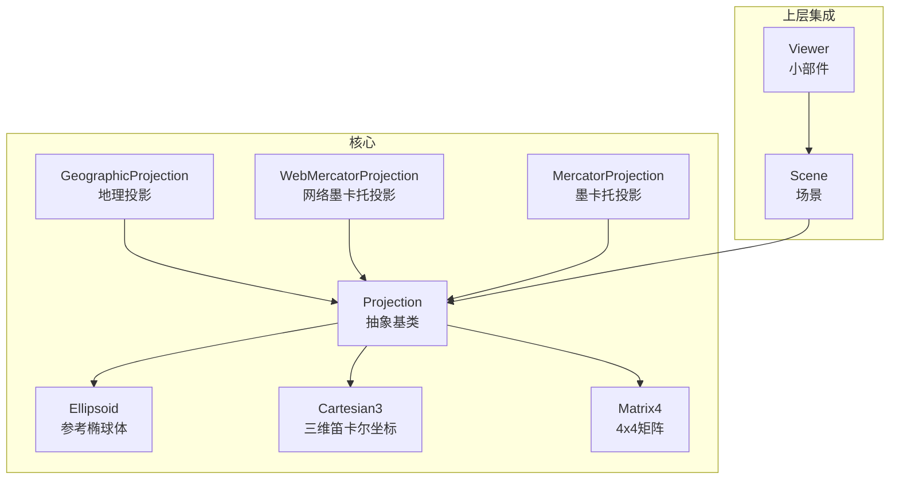
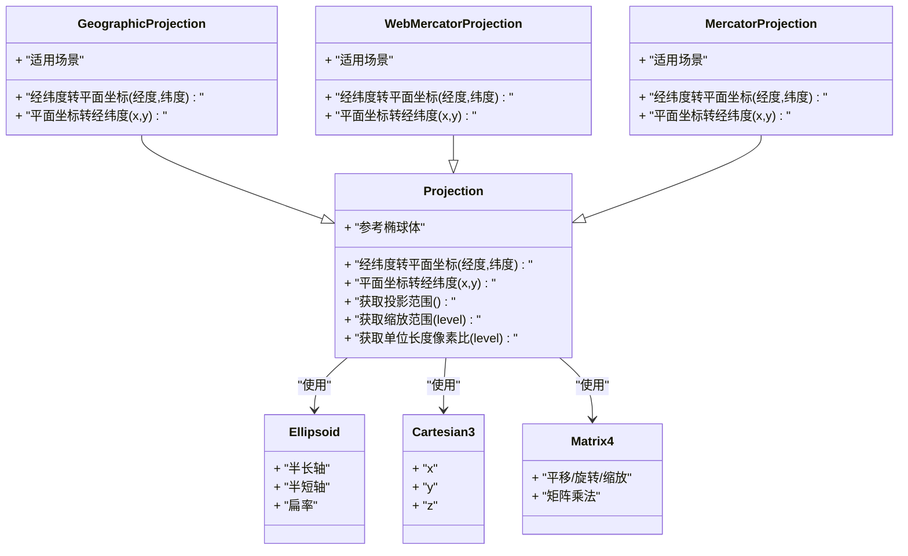
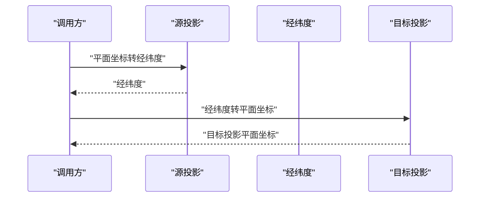
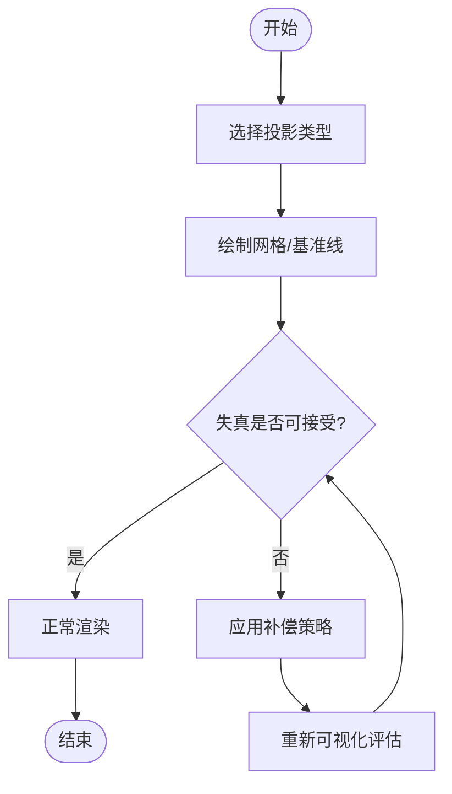
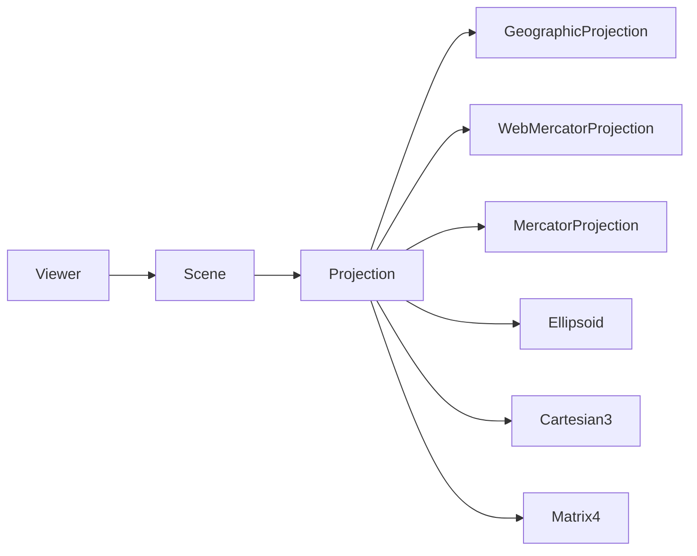

# 投影系统

<cite>
**本文引用的文件**   
- [Projection.js](file://Source/Core/Projection.js)
- [GeographicProjection.js](file://Source/Core/GeographicProjection.js)
- [WebMercatorProjection.js](file://Source/Core/WebMercatorProjection.js)
- [MercatorProjection.js](file://Source/Core/MercatorProjection.js)
- [Ellipsoid.js](file://Source/Core/Ellipsoid.js)
- [Cartesian3.js](file://Source/Core/Cartesian3.js)
- [Matrix4.js](file://Source/Core/Matrix4.js)
- [Scene.js](file://Source/Scene/Scene.js)
- [Viewer.js](file://Source/Widgets/Viewer/Viewer.js)
</cite>

## 目录
1. [简介](#简介)
2. [项目结构](#项目结构)
3. [核心组件](#核心组件)
4. [架构总览](#架构总览)
5. [详细组件分析](#详细组件分析)
6. [依赖关系分析](#依赖关系分析)
7. [性能考虑](#性能考虑)
8. [故障排查指南](#故障排查指南)
9. [结论](#结论)
10. [附录](#附录)

## 简介
本文件系统性梳理 Cesium 的投影子系统，围绕抽象基类与具体实现展开，覆盖地理投影、网络墨卡托投影、墨卡托投影等。文档从设计模式、数学原理、失真特性、参数配置、自定义扩展、投影间转换、选择指南与性能权衡等方面提供完整说明，并给出可视化与补偿处理建议，帮助读者在工程实践中正确选型与优化。

## 项目结构
Cesium 的投影相关代码位于 Source/Core 下，采用“抽象基类 + 多实现”的分层组织方式：
- 抽象基类定义统一接口与通用能力（如坐标变换、边界计算、缩放范围等）
- 具体投影类继承基类，实现各自的映射函数与属性
- 场景与视图层通过统一的投影接口访问，屏蔽底层差异

图表来源
- [Projection.js:1-200](file://Source/Core/Projection.js#L1-L200)
- [GeographicProjection.js:1-200](file://Source/Core/GeographicProjection.js#L1-L200)
- [WebMercatorProjection.js:1-200](file://Source/Core/WebMercatorProjection.js#L1-L200)
- [MercatorProjection.js:1-200](file://Source/Core/MercatorProjection.js#L1-L200)
- [Ellipsoid.js:1-200](file://Source/Core/Ellipsoid.js#L1-L200)
- [Cartesian3.js:1-200](file://Source/Core/Cartesian3.js#L1-L200)
- [Matrix4.js:1-200](file://Source/Core/Matrix4.js#L1-L200)
- [Scene.js:1-200](file://Source/Scene/Scene.js#L1-L200)
- [Viewer.js:1-200](file://Source/Widgets/Viewer/Viewer.js#L1-L200)

章节来源
- [Projection.js:1-200](file://Source/Core/Projection.js#L1-L200)
- [GeographicProjection.js:1-200](file://Source/Core/GeographicProjection.js#L1-L200)
- [WebMercatorProjection.js:1-200](file://Source/Core/WebMercatorProjection.js#L1-L200)
- [MercatorProjection.js:1-200](file://Source/Core/MercatorProjection.js#L1-L200)
- [Ellipsoid.js:1-200](file://Source/Core/Ellipsoid.js#L1-L200)
- [Cartesian3.js:1-200](file://Source/Core/Cartesian3.js#L1-L200)
- [Matrix4.js:1-200](file://Source/Core/Matrix4.js#L1-L200)
- [Scene.js:1-200](file://Source/Scene/Scene.js#L1-L200)
- [Viewer.js:1-200](file://Source/Widgets/Viewer/Viewer.js#L1-L200)

## 核心组件
- 抽象基类 Projection
  - 职责：定义投影的统一接口，包括经纬度到平面坐标的正反变换、世界坐标与屏幕坐标的关联、投影范围与缩放级别、单位与比例尺等
  - 关键方法（概念性描述）：经纬度转平面坐标、平面坐标转经纬度、获取投影范围、获取缩放范围、获取单位长度对应的像素比等
  - 典型属性：参考椭球体、投影中心、缩放级别、单位长度等
- 具体实现
  - GeographicProjection：将经纬度直接映射为平面坐标，常用于以弧度或角度为单位的二维展示
  - WebMercatorProjection：基于标准墨卡托但限定纬度范围的网络地图常用投影，广泛用于在线瓦片服务
  - MercatorProjection：经典墨卡托投影，适用于全球尺度且对高纬区域有显著拉伸

章节来源
- [Projection.js:1-200](file://Source/Core/Projection.js#L1-L200)
- [GeographicProjection.js:1-200](file://Source/Core/GeographicProjection.js#L1-L200)
- [WebMercatorProjection.js:1-200](file://Source/Core/WebMercatorProjection.js#L1-L200)
- [MercatorProjection.js:1-200](file://Source/Core/MercatorProjection.js#L1-L200)

## 架构总览
投影子系统通过抽象基类对外暴露稳定接口，上层 Scene/Viewer 仅依赖该接口进行渲染管线中的坐标变换与视口计算。各投影实现内部可复用 Ellipsoid、Cartesian3、Matrix4 等基础几何与线性代数工具。

图表来源
- [Projection.js:1-200](file://Source/Core/Projection.js#L1-L200)
- [GeographicProjection.js:1-200](file://Source/Core/GeographicProjection.js#L1-L200)
- [WebMercatorProjection.js:1-200](file://Source/Core/WebMercatorProjection.js#L1-L200)
- [MercatorProjection.js:1-200](file://Source/Core/MercatorProjection.js#L1-L200)
- [Ellipsoid.js:1-200](file://Source/Core/Ellipsoid.js#L1-L200)
- [Cartesian3.js:1-200](file://Source/Core/Cartesian3.js#L1-L200)
- [Matrix4.js:1-200](file://Source/Core/Matrix4.js#L1-L200)

## 详细组件分析

### 抽象基类 Projection
- 设计要点
  - 统一接口：所有投影必须实现经纬度与平面坐标的双向映射
  - 公共能力：投影范围、缩放级别、单位长度像素比、参考椭球体等
  - 可扩展点：子类可重写映射函数与范围计算，以满足不同投影需求
- 关键流程（概念性）
  - 输入：经纬度（弧度制）
  - 输出：平面坐标（米或投影单位）
  - 反向：平面坐标还原为经纬度
  - 辅助：根据缩放级别计算像素分辨率、世界范围等

章节来源
- [Projection.js:1-200](file://Source/Core/Projection.js#L1-L200)

### GeographicProjection 地理投影
- 数学原理
  - 将经纬度直接映射为平面坐标，通常保持角度/弧度线性关系
  - 适合用于需要保留原始角度信息的二维展示或教学演示
- 失真特性
  - 面积与形状在高纬区域存在明显变形
  - 不适合大范围距离测量
- 适用场景
  - 局部或中等范围的二维地图
  - 需要直观理解经纬度的应用

章节来源
- [GeographicProjection.js:1-200](file://Source/Core/GeographicProjection.js#L1-L200)

### WebMercatorProjection 网络墨卡托投影
- 数学原理
  - 基于标准墨卡托投影，但对纬度范围做限制，适配在线瓦片服务规范
  - 将经纬度映射到近似正方形的平面区域，便于瓦片切分与缓存
- 失真特性
  - 高纬地区面积与形状被显著放大
  - 低纬地区相对准确
- 适用场景
  - 在线地图服务（如 OpenStreetMap、Google Maps 风格）
  - 大规模全球数据展示与瓦片加载

章节来源
- [WebMercatorProjection.js:1-200](file://Source/Core/WebMercatorProjection.js#L1-L200)

### MercatorProjection 墨卡托投影
- 数学原理
  - 经典等角圆柱投影，保持局部角度不变形
  - 将地球表面投影到圆柱面再展开为平面
- 失真特性
  - 高纬地区面积急剧膨胀，赤道附近较准确
  - 适合导航与航线绘制（等角特性）
- 适用场景
  - 全球尺度的等角展示
  - 需要方向保持的应用

章节来源
- [MercatorProjection.js:1-200](file://Source/Core/MercatorProjection.js#L1-L200)

### 投影间转换流程
- 目标：在不同投影之间进行坐标互转
- 步骤概览
  - 将源投影的平面坐标转换为经纬度
  - 再将经纬度转换为目标投影的平面坐标
- 注意事项
  - 需确保中间经纬度在有效范围内
  - 注意精度损失与数值稳定性

图表来源
- [Projection.js:1-200](file://Source/Core/Projection.js#L1-L200)
- [GeographicProjection.js:1-200](file://Source/Core/GeographicProjection.js#L1-L200)
- [WebMercatorProjection.js:1-200](file://Source/Core/WebMercatorProjection.js#L1-L200)
- [MercatorProjection.js:1-200](file://Source/Core/MercatorProjection.js#L1-L200)

### 投影参数配置
- 常见参数
  - 参考椭球体：决定地球模型（半长轴、半短轴、扁率）
  - 投影中心：初始中心经纬度
  - 缩放级别：控制像素分辨率与世界范围
  - 单位长度：米或其他单位
- 配置影响
  - 椭球体参数影响经纬度到地心坐标的转换
  - 缩放级别影响瓦片尺寸与渲染细节
  - 投影中心影响可视区域与偏移

章节来源
- [Projection.js:1-200](file://Source/Core/Projection.js#L1-L200)
- [Ellipsoid.js:1-200](file://Source/Core/Ellipsoid.js#L1-L200)

### 自定义投影开发
- 开发步骤
  - 继承抽象基类，实现经纬度与平面坐标的双向映射
  - 定义投影范围与缩放级别策略
  - 必要时重写单位长度像素比计算方法
- 最佳实践
  - 保证数值稳定性，避免极端值溢出
  - 提供清晰的错误提示与边界检查
  - 编写单元测试验证正反变换一致性

章节来源
- [Projection.js:1-200](file://Source/Core/Projection.js#L1-L200)

### 投影失真的可视化与补偿
- 可视化方法
  - 绘制网格线或等间距线段，观察拉伸与压缩
  - 叠加已知长度的基准线段，对比显示误差
- 补偿处理
  - 在测量时按投影特性进行校正（如等积投影补偿）
  - 在渲染时针对高纬区域进行视觉修正（如动态缩放因子）

[本节为概念性流程图，不直接对应具体源码文件]

## 依赖关系分析
- 组件耦合
  - 具体投影类强依赖抽象基类接口
  - 投影类依赖 Ellipsoid、Cartesian3、Matrix4 等基础模块
- 外部集成
  - Scene 与 Viewer 通过统一投影接口访问，降低耦合度
- 潜在风险
  - 若自定义投影未严格遵循接口约定，可能导致上层渲染异常
  - 数值精度问题在高纬或大尺度场景中尤为敏感

图表来源
- [Projection.js:1-200](file://Source/Core/Projection.js#L1-L200)
- [GeographicProjection.js:1-200](file://Source/Core/GeographicProjection.js#L1-L200)
- [WebMercatorProjection.js:1-200](file://Source/Core/WebMercatorProjection.js#L1-L200)
- [MercatorProjection.js:1-200](file://Source/Core/MercatorProjection.js#L1-L200)
- [Ellipsoid.js:1-200](file://Source/Core/Ellipsoid.js#L1-L200)
- [Cartesian3.js:1-200](file://Source/Core/Cartesian3.js#L1-L200)
- [Matrix4.js:1-200](file://Source/Core/Matrix4.js#L1-L200)
- [Scene.js:1-200](file://Source/Scene/Scene.js#L1-L200)
- [Viewer.js:1-200](file://Source/Widgets/Viewer/Viewer.js#L1-L200)

章节来源
- [Projection.js:1-200](file://Source/Core/Projection.js#L1-L200)
- [GeographicProjection.js:1-200](file://Source/Core/GeographicProjection.js#L1-L200)
- [WebMercatorProjection.js:1-200](file://Source/Core/WebMercatorProjection.js#L1-L200)
- [MercatorProjection.js:1-200](file://Source/Core/MercatorProjection.js#L1-L200)
- [Ellipsoid.js:1-200](file://Source/Core/Ellipsoid.js#L1-L200)
- [Cartesian3.js:1-200](file://Source/Core/Cartesian3.js#L1-L200)
- [Matrix4.js:1-200](file://Source/Core/Matrix4.js#L1-L200)
- [Scene.js:1-200](file://Source/Scene/Scene.js#L1-L200)
- [Viewer.js:1-200](file://Source/Widgets/Viewer/Viewer.js#L1-L200)

## 性能考虑
- 投影选择
  - 在线瓦片与全球展示优先 WebMercatorProjection
  - 等角导航与航线绘制可选 MercatorProjection
  - 教学与简单二维展示可用 GeographicProjection
- 数值精度
  - 高纬区域浮点误差更明显，应避免极端经纬度输入
  - 合理设置缩放级别，减少不必要的精细计算
- 渲染优化
  - 利用投影的单位长度像素比预计算分辨率
  - 批量坐标变换时复用临时对象，减少分配开销

[本节提供一般性指导，不直接分析具体文件]

## 故障排查指南
- 常见问题
  - 经纬度越界：确认输入是否在投影允许范围内
  - 高纬失真过大：考虑更换投影或启用补偿策略
  - 瓦片错位：检查缩放级别与单位长度像素比配置
- 定位方法
  - 打印中间经纬度与平面坐标，验证正反变换一致性
  - 使用网格可视化快速发现拉伸与压缩区域
  - 逐步缩小范围，隔离问题区域

章节来源
- [Projection.js:1-200](file://Source/Core/Projection.js#L1-L200)
- [GeographicProjection.js:1-200](file://Source/Core/GeographicProjection.js#L1-L200)
- [WebMercatorProjection.js:1-200](file://Source/Core/WebMercatorProjection.js#L1-L200)
- [MercatorProjection.js:1-200](file://Source/Core/MercatorProjection.js#L1-L200)

## 结论
Cesium 的投影系统通过抽象基类与多实现的设计，提供了灵活而稳定的坐标变换能力。在实际工程中，应根据应用场景选择合适的投影类型，结合失真可视化与补偿策略，确保精度与性能的平衡。同时，遵循接口约定与数值稳定性原则，有助于构建可维护与可扩展的投影扩展。

[本节为总结性内容，不直接分析具体文件]

## 附录
- 术语表
  - 投影：将地球表面坐标映射到平面的数学方法
  - 失真：投影导致的面积、形状或距离变化
  - 缩放级别：控制地图细节层次的整数索引
- 参考资源
  - 投影数学原理与公式
  - 在线地图服务规范（瓦片切分与缓存）

[本节为补充信息，不直接分析具体文件]