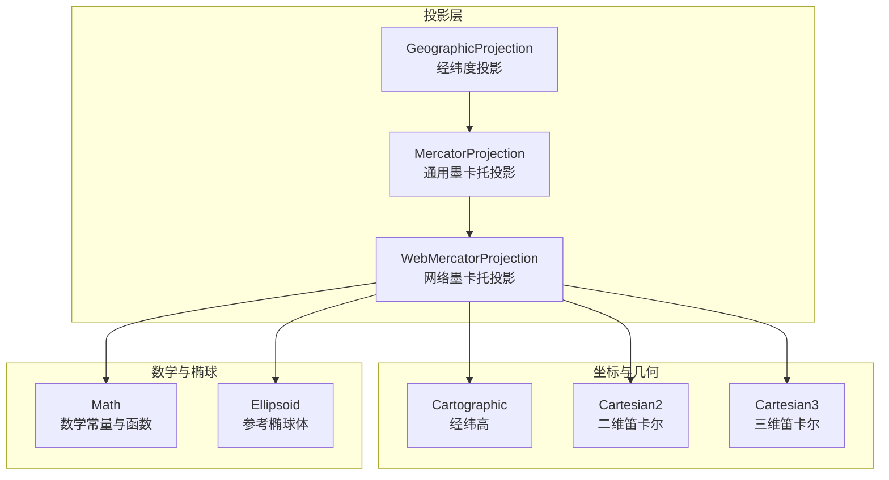
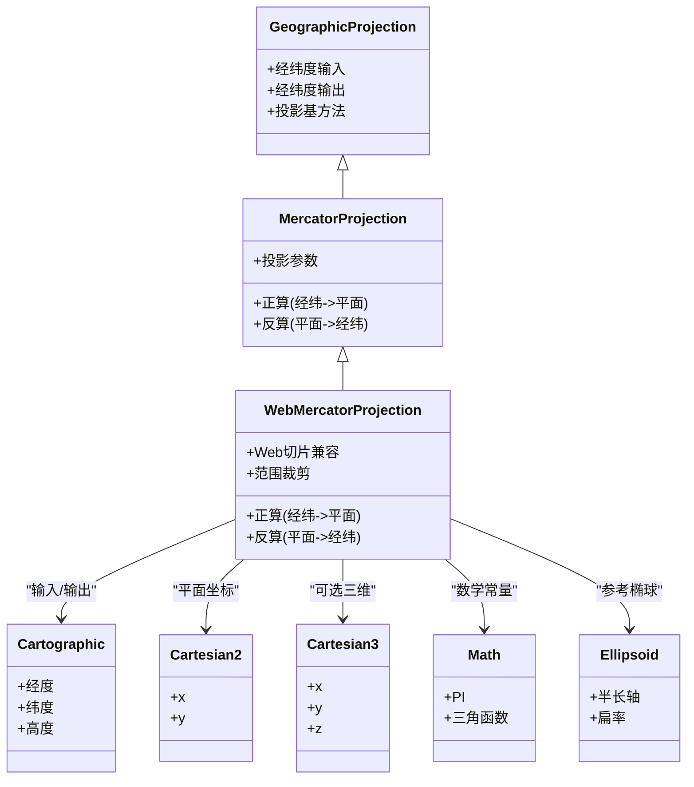
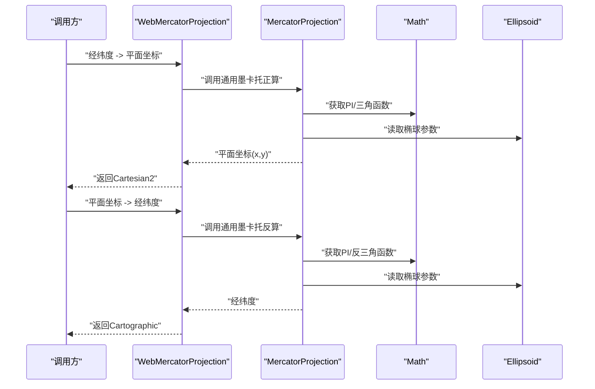
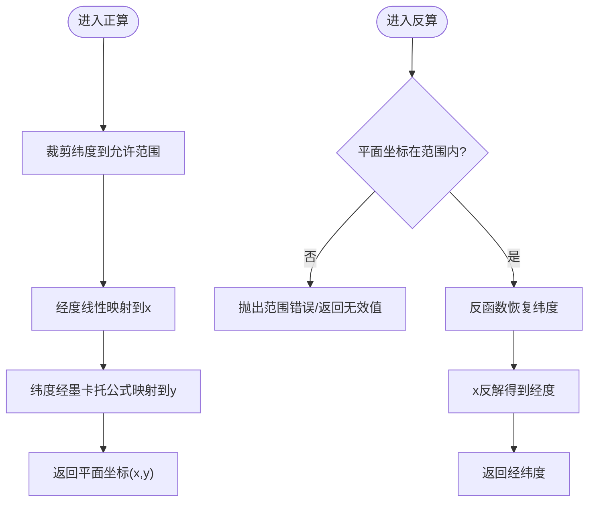
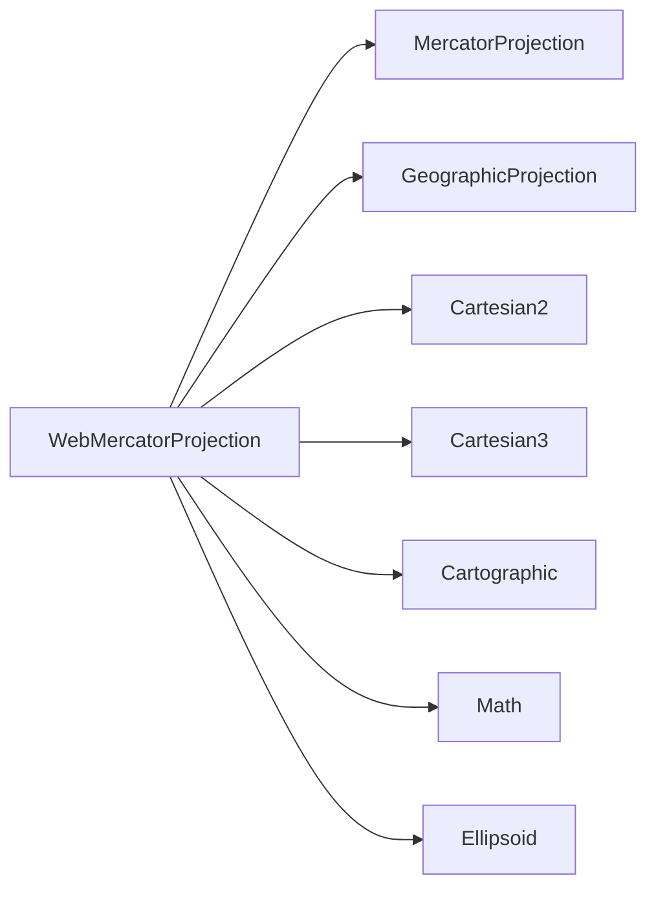

# 网络墨卡托投影

<cite>
**本文引用的文件**   
- [WebMercatorProjection.js](file://Source/Core/WebMercatorProjection.js)
- [Cartesian2.js](file://Source/Core/Cartesian2.js)
- [Cartesian3.js](file://Source/Core/Cartesian3.js)
- [Cartographic.js](file://Source/Core/Cartographic.js)
- [Math.js](file://Source/Core/Math.js)
- [Ellipsoid.js](file://Source/Core/Ellipsoid.js)
- [GeographicProjection.js](file://Source/Core/GeographicProjection.js)
- [MercatorProjection.js](file://Source/Core/MercatorProjection.js)
</cite>

## 目录
1. [简介](#简介)
2. [项目结构](#项目结构)
3. [核心组件](#核心组件)
4. [架构总览](#架构总览)
5. [详细组件分析](#详细组件分析)
6. [依赖关系分析](#依赖关系分析)
7. [性能考虑](#性能考虑)
8. [故障排查指南](#故障排查指南)
9. [结论](#结论)
10. [附录](#附录)

## 简介
本文件围绕 Cesium 中的 WebMercatorProjection（网络墨卡托投影）进行系统化技术文档化，重点覆盖：
- WebMercatorProjection 类的实现原理与职责边界
- 基于 Web 地图服务标准的投影算法要点
- 数学变换、纬度范围限制与极点处理策略
- 与 Google Maps、OpenStreetMap 等主流服务的兼容性说明
- 在 Web 地图应用中的优势、局限性与使用建议
- 坐标转换示例路径、性能优化技巧与常见陷阱规避

## 项目结构
Cesium 的投影体系位于 Source/Core 下，WebMercatorProjection 作为“网络墨卡托”专用投影类，继承自通用墨卡托投影基类，并与地理坐标、平面坐标及常量工具紧密协作。

图表来源
- [WebMercatorProjection.js](file://Source/Core/WebMercatorProjection.js)
- [MercatorProjection.js](file://Source/Core/MercatorProjection.js)
- [GeographicProjection.js](file://Source/Core/GeographicProjection.js)
- [Cartesian2.js](file://Source/Core/Cartesian2.js)
- [Cartesian3.js](file://Source/Core/Cartesian3.js)
- [Cartographic.js](file://Source/Core/Cartographic.js)
- [Math.js](file://Source/Core/Math.js)
- [Ellipsoid.js](file://Source/Core/Ellipsoid.js)

章节来源
- [WebMercatorProjection.js](file://Source/Core/WebMercatorProjection.js)
- [MercatorProjection.js](file://Source/Core/MercatorProjection.js)
- [GeographicProjection.js](file://Source/Core/GeographicProjection.js)
- [Cartesian2.js](file://Source/Core/Cartesian2.js)
- [Cartesian3.js](file://Source/Core/Cartesian3.js)
- [Cartographic.js](file://Source/Core/Cartographic.js)
- [Math.js](file://Source/Core/Math.js)
- [Ellipsoid.js](file://Source/Core/Ellipsoid.js)

## 核心组件
- WebMercatorProjection：面向 Web 地图服务的墨卡托投影实现，负责经纬度与平面像素坐标之间的双向转换，并遵循 Web 瓦片切片的标准约定。
- MercatorProjection：通用墨卡托投影基类，提供基础的正反算逻辑与参数封装。
- GeographicProjection：经纬度投影基类，为各类投影提供统一的地理输入输出接口。
- Cartographic/Cartesian2/Cartesian3：地理与平面坐标载体，贯穿投影转换的数据模型。
- Math/Ellipsoid：数学常量（如 PI、半长轴等）与参考椭球体定义，支撑投影计算。

章节来源
- [WebMercatorProjection.js](file://Source/Core/WebMercatorProjection.js)
- [MercatorProjection.js](file://Source/Core/MercatorProjection.js)
- [GeographicProjection.js](file://Source/Core/GeographicProjection.js)
- [Cartesian2.js](file://Source/Core/Cartesian2.js)
- [Cartesian3.js](file://Source/Core/Cartesian3.js)
- [Cartographic.js](file://Source/Core/Cartographic.js)
- [Math.js](file://Source/Core/Math.js)
- [Ellipsoid.js](file://Source/Core/Ellipsoid.js)

## 架构总览
WebMercatorProjection 在 Cesium 投影体系中处于“应用层投影”的位置，向上承接业务调用（如瓦片请求、屏幕拾取），向下复用通用墨卡托与地理投影能力，并通过椭球与数学库完成数值计算。

图表来源
- [WebMercatorProjection.js](file://Source/Core/WebMercatorProjection.js)
- [MercatorProjection.js](file://Source/Core/MercatorProjection.js)
- [GeographicProjection.js](file://Source/Core/GeographicProjection.js)
- [Cartesian2.js](file://Source/Core/Cartesian2.js)
- [Cartesian3.js](file://Source/Core/Cartesian3.js)
- [Cartographic.js](file://Source/Core/Cartographic.js)
- [Math.js](file://Source/Core/Math.js)
- [Ellipsoid.js](file://Source/Core/Ellipsoid.js)

## 详细组件分析

### WebMercatorProjection 类分析
- 设计目标
  - 对齐 Web 地图服务（WMS/WMTS）与主流在线地图（Google Maps、OpenStreetMap）的网络墨卡托约定。
  - 提供稳定的经纬度与平面像素坐标互转接口，支持瓦片索引与屏幕坐标场景。
- 关键行为
  - 经纬度到平面坐标的正算：将经纬度映射到以米为单位的平面坐标，遵循世界范围与原点约定。
  - 平面坐标到经纬度的反算：将平面坐标还原为经纬度，用于屏幕拾取或瓦片定位。
  - 范围限制与裁剪：对超出有效范围的纬度进行裁剪或拒绝，避免数值不稳定。
  - 与瓦片系统协同：结合层级、行列号与像素偏移，生成标准 URL 或计算可见区域。
- 数据流
  - 输入：Cartographic（经纬高）
  - 中间：通过 MercatorProjection 与 Math/Ellipsoid 完成数值计算
  - 输出：Cartesian2（平面坐标），必要时返回 Cartesian3（含高程）

图表来源
- [WebMercatorProjection.js](file://Source/Core/WebMercatorProjection.js)
- [MercatorProjection.js](file://Source/Core/MercatorProjection.js)
- [Math.js](file://Source/Core/Math.js)
- [Ellipsoid.js](file://Source/Core/Ellipsoid.js)

章节来源
- [WebMercatorProjection.js](file://Source/Core/WebMercatorProjection.js)
- [MercatorProjection.js](file://Source/Core/MercatorProjection.js)
- [Math.js](file://Source/Core/Math.js)
- [Ellipsoid.js](file://Source/Core/Ellipsoid.js)

### 数学变换与范围限制
- 数学变换要点
  - 正算：经度线性缩放至世界宽度；纬度通过墨卡托公式转换为纵坐标，涉及双曲函数或对数形式。
  - 反算：从纵坐标恢复纬度，需使用反函数（如对数/反双曲函数）。
- 纬度范围限制
  - 为保证数值稳定与与 Web 地图一致，通常对纬度进行裁剪，避免接近极点的奇异点。
  - 超过裁剪阈值的输入将被截断到允许的最大最小纬度。
- 极点处理
  - 对于极端纬度，采用安全回退策略（例如裁剪到最大可表示纬度），防止除零或溢出。

图表来源
- [WebMercatorProjection.js](file://Source/Core/WebMercatorProjection.js)
- [MercatorProjection.js](file://Source/Core/MercatorProjection.js)
- [Math.js](file://Source/Core/Math.js)

章节来源
- [WebMercatorProjection.js](file://Source/Core/WebMercatorProjection.js)
- [MercatorProjection.js](file://Source/Core/MercatorProjection.js)
- [Math.js](file://Source/Core/Math.js)

### 与主流地图服务的兼容性
- Google Maps / OpenStreetMap
  - 均采用“网络墨卡托”（EPSG:3857）作为标准投影，世界范围与瓦片原点在赤道与本初子午线交点处。
  - 层级与行列号规则一致：层级越高分辨率越高，行列号按左上角为原点递增。
- 其他服务
  - ArcGIS Online 默认也使用网络墨卡托；部分旧服务可能使用 WGS84 经纬度或 UTM 等，需要显式配置。
- 注意事项
  - 不同服务对瓦片命名、URL 模板、坐标系单位（米 vs 度）存在差异，需在接入时核对。

章节来源
- [WebMercatorProjection.js](file://Source/Core/WebMercatorProjection.js)

### 坐标转换示例路径
- 经纬度到平面坐标
  - 参考路径：[WebMercatorProjection.js](file://Source/Core/WebMercatorProjection.js)
- 平面坐标到经纬度
  - 参考路径：[WebMercatorProjection.js](file://Source/Core/WebMercatorProjection.js)
- 与瓦片行列号换算
  - 参考路径：[WebMercatorProjection.js](file://Source/Core/WebMercatorProjection.js)

章节来源
- [WebMercatorProjection.js](file://Source/Core/WebMercatorProjection.js)

## 依赖关系分析
- 直接依赖
  - MercatorProjection：复用通用墨卡托正反算逻辑
  - GeographicProjection：统一地理输入输出接口
  - Cartographic/Cartesian2/Cartesian3：数据载体
  - Math/Ellipsoid：数学常量与椭球参数
- 间接依赖
  - 上层模块（如 ImageryProvider、ScreenSpaceEventHandler）通过 WebMercatorProjection 完成瓦片加载与屏幕拾取

图表来源
- [WebMercatorProjection.js](file://Source/Core/WebMercatorProjection.js)
- [MercatorProjection.js](file://Source/Core/MercatorProjection.js)
- [GeographicProjection.js](file://Source/Core/GeographicProjection.js)
- [Cartesian2.js](file://Source/Core/Cartesian2.js)
- [Cartesian3.js](file://Source/Core/Cartesian3.js)
- [Cartographic.js](file://Source/Core/Cartographic.js)
- [Math.js](file://Source/Core/Math.js)
- [Ellipsoid.js](file://Source/Core/Ellipsoid.js)

章节来源
- [WebMercatorProjection.js](file://Source/Core/WebMercatorProjection.js)
- [MercatorProjection.js](file://Source/Core/MercatorProjection.js)
- [GeographicProjection.js](file://Source/Core/GeographicProjection.js)
- [Cartesian2.js](file://Source/Core/Cartesian2.js)
- [Cartesian3.js](file://Source/Core/Cartesian3.js)
- [Cartographic.js](file://Source/Core/Cartographic.js)
- [Math.js](file://Source/Core/Math.js)
- [Ellipsoid.js](file://Source/Core/Ellipsoid.js)

## 性能考虑
- 批量转换
  - 对大量点进行投影转换时，优先使用批量化 API（若可用）以减少对象创建与函数调用开销。
- 缓存策略
  - 对重复经纬度或固定层级下的行列号结果进行缓存，降低重复计算。
- 数值稳定性
  - 避免在接近裁剪边界的纬度上进行高精度计算，必要时先做范围校验与裁剪。
- 内存与对象复用
  - 复用 Cartographic/Cartesian2 实例，减少 GC 压力。
- 并行与异步
  - 在 Worker 中执行大规模投影计算，避免阻塞主线程。

## 故障排查指南
- 常见问题
  - 纬度越界：输入纬度超出允许范围导致异常或结果失真。
  - 精度丢失：在高纬度地区平面坐标放大导致浮点误差增大。
  - 瓦片错位：层级、行列号与原点约定不一致导致图层偏移。
- 诊断步骤
  - 检查输入经纬度是否经过裁剪与归一化。
  - 确认使用的椭球体与常数是否与目标服务一致。
  - 验证瓦片 URL 模板与行列号计算是否符合网络墨卡托规范。
- 定位参考
  - 投影正/反算入口与范围判断逻辑：[WebMercatorProjection.js](file://Source/Core/WebMercatorProjection.js)
  - 通用墨卡托实现细节：[MercatorProjection.js](file://Source/Core/MercatorProjection.js)
  - 数学常量与函数：[Math.js](file://Source/Core/Math.js)
  - 椭球体参数：[Ellipsoid.js](file://Source/Core/Ellipsoid.js)

章节来源
- [WebMercatorProjection.js](file://Source/Core/WebMercatorProjection.js)
- [MercatorProjection.js](file://Source/Core/MercatorProjection.js)
- [Math.js](file://Source/Core/Math.js)
- [Ellipsoid.js](file://Source/Core/Ellipsoid.js)

## 结论
WebMercatorProjection 在 Cesium 中承担“网络墨卡托”的关键角色，既满足 Web 地图服务的标准化需求，又与通用投影体系良好解耦。通过合理的范围裁剪、数值稳定策略与性能优化手段，可在大规模 Web 地图应用中稳定高效地运行。使用时应严格遵循主流服务的约定，并在高纬度与边缘区域加强校验与容错。

## 附录
- 术语
  - 网络墨卡托：基于 EPSG:3857 的 Web 地图常用投影，单位为米，世界范围固定。
  - 瓦片：按层级划分的矩形图像块，用于快速渲染大范围地图。
- 相关接口与类型
  - 经纬度载体：Cartographic
  - 平面坐标载体：Cartesian2/Cartesian3
  - 投影基类：GeographicProjection/MercatorProjection
  - 数学与椭球：Math/Ellipsoid