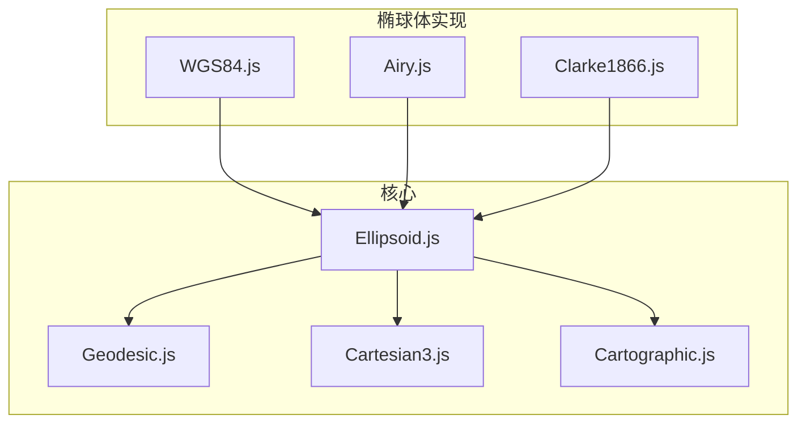
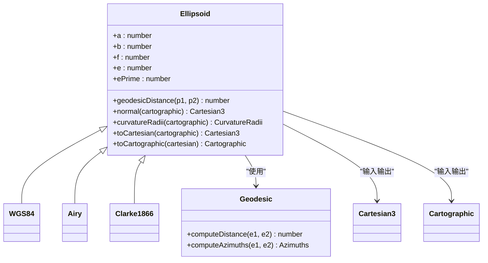
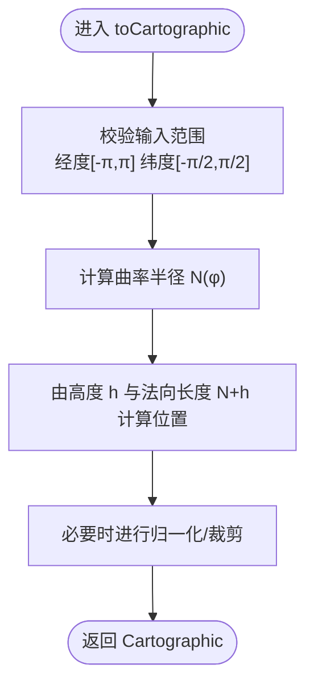
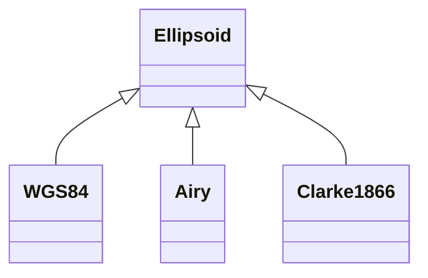
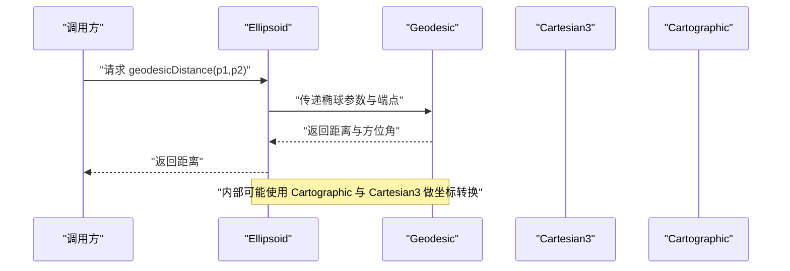
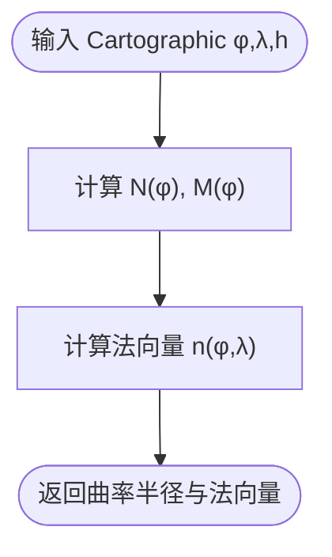
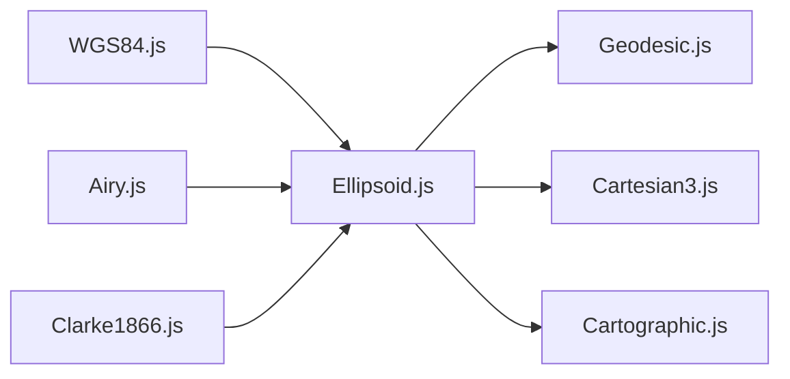

# 椭球体模型

<cite>
**本文引用的文件**   
- [Ellipsoid.js](file://Source/Core/Ellipsoid.js)
- [WGS84.js](file://Source/Core/WGS84.js)
- [Airy.js](file://Source/Core/Airy.js)
- [Clarke1866.js](file://Source/Core/Clarke1866.js)
- [Geodesic.js](file://Source/Core/Geodesic.js)
- [Cartesian3.js](file://Source/Core/Cartesian3.js)
- [Cartographic.js](file://Source/Core/Cartographic.js)
</cite>

## 目录
1. [简介](#简介)
2. [项目结构](#项目结构)
3. [核心组件](#核心组件)
4. [架构总览](#架构总览)
5. [详细组件分析](#详细组件分析)
6. [依赖关系分析](#依赖关系分析)
7. [性能考量](#性能考量)
8. [故障排查指南](#故障排查指南)
9. [结论](#结论)
10. [附录](#附录)

## 简介
本文件系统性梳理 Cesium 中椭球体模型的抽象与实现，包括 Ellipsoid 抽象类及其地球椭球体实现（如 WGS84、Airy、Clarke1866）。文档重点解释椭球体的几何参数（长半轴、短半轴、扁率）对坐标计算的影响，并覆盖椭球体表面距离、法向量、曲率半径等关键数学方法。同时提供不同椭球体模型的适用地区与精度对比，以及自定义椭球体模型的扩展方法。

## 项目结构
Cesium 的椭球体相关代码主要位于 Source/Core 目录下：
- Ellipsoid.js：定义椭球体抽象基类与通用几何算法
- WGS84.js / Airy.js / Clarke1866.js：具体椭球体常量与实例
- Geodesic.js：基于椭球体的测地线（大地线）距离与方位角计算
- Cartesian3.js / Cartographic.js：三维笛卡尔坐标与经纬高坐标的转换支撑

图表来源
- [Ellipsoid.js](file://Source/Core/Ellipsoid.js)
- [WGS84.js](file://Source/Core/WGS84.js)
- [Airy.js](file://Source/Core/Airy.js)
- [Clarke1866.js](file://Source/Core/Clarke1866.js)
- [Geodesic.js](file://Source/Core/Geodesic.js)
- [Cartesian3.js](file://Source/Core/Cartesian3.js)
- [Cartographic.js](file://Source/Core/Cartographic.js)

章节来源
- [Ellipsoid.js](file://Source/Core/Ellipsoid.js)
- [WGS84.js](file://Source/Core/WGS84.js)
- [Airy.js](file://Source/Core/Airy.js)
- [Clarke1866.js](file://Source/Core/Clarke1866.js)
- [Geodesic.js](file://Source/Core/Geodesic.js)
- [Cartesian3.js](file://Source/Core/Cartesian3.js)
- [Cartographic.js](file://Source/Core/Cartographic.js)

## 核心组件
- Ellipsoid 抽象类
  - 职责：封装椭球体几何参数与通用算法接口，包括单位化、投影/反投影、法向量、切平面、曲率半径、测地线距离等。
  - 关键属性：长半轴 a、短半轴 b、扁率 f、第一偏心率 e、第二偏心率 e'。
  - 关键方法（概念性说明）：
    - 坐标变换：经纬高到笛卡尔、笛卡尔到经纬高、单位向量到经纬高、经纬高到单位向量。
    - 几何量：法向量、切平面、曲率半径（子午圈与卯酉圈）、距离与方位角（委托给测地线模块）。
    - 数值稳定性：处理极点附近退化、小角度近似、归一化与裁剪。
- 具体椭球体实现
  - WGS84：全球通用标准椭球体，广泛用于 GPS 与 Web 地图。
  - Airy：英国及英联邦地区历史参考椭球体。
  - Clarke1866：北美常用历史参考椭球体。
- 测地线模块
  - 负责在给定椭球体上计算两点间的大地线距离、起始/终止方位角、往返路径等。

章节来源
- [Ellipsoid.js](file://Source/Core/Ellipsoid.js)
- [WGS84.js](file://Source/Core/WGS84.js)
- [Airy.js](file://Source/Core/Airy.js)
- [Clarke1866.js](file://Source/Core/Clarke1866.js)
- [Geodesic.js](file://Source/Core/Geodesic.js)

## 架构总览
下图展示椭球体抽象与具体实现的关系，以及与坐标类型和测地线计算的交互。

图表来源
- [Ellipsoid.js](file://Source/Core/Ellipsoid.js)
- [WGS84.js](file://Source/Core/WGS84.js)
- [Airy.js](file://Source/Core/Airy.js)
- [Clarke1866.js](file://Source/Core/Clarke1866.js)
- [Geodesic.js](file://Source/Core/Geodesic.js)
- [Cartesian3.js](file://Source/Core/Cartesian3.js)
- [Cartographic.js](file://Source/Core/Cartographic.js)

## 详细组件分析

### Ellipsoid 抽象类
- 设计要点
  - 以 a、b 为基本参数，派生 f、e、e' 等几何量，保证一致性。
  - 将“沿椭球面的距离”计算委托给 Geodesic，避免重复实现。
  - 提供稳定的边界处理：极点、赤道、接近极点的数值稳定策略。
- 典型流程（经纬高→笛卡尔）
  - 输入校验与裁剪
  - 计算子午圈与卯酉圈曲率半径
  - 根据纬度与高度计算法向长度
  - 组合得到空间位置
- 典型流程（笛卡尔→经纬高）
  - 迭代或解析求解纬度
  - 计算高程
  - 返回标准化结果

图表来源
- [Ellipsoid.js](file://Source/Core/Ellipsoid.js)
- [Cartographic.js](file://Source/Core/Cartographic.js)

章节来源
- [Ellipsoid.js](file://Source/Core/Ellipsoid.js)
- [Cartographic.js](file://Source/Core/Cartographic.js)

### 具体椭球体实现（WGS84、Airy、Clarke1866）
- 共同点
  - 继承自 Ellipsoid，仅声明自身 a、b 等基础参数。
  - 通过父类获得全部几何方法与数值稳定性保障。
- 差异点
  - 参数值不同导致在不同区域与用途下的精度表现不同。
  - 历史椭球体（Airy、Clarke1866）适用于特定国家/地区的局部高精度需求。

图表来源
- [Ellipsoid.js](file://Source/Core/Ellipsoid.js)
- [WGS84.js](file://Source/Core/WGS84.js)
- [Airy.js](file://Source/Core/Airy.js)
- [Clarke1866.js](file://Source/Core/Clarke1866.js)

章节来源
- [Ellipsoid.js](file://Source/Core/Ellipsoid.js)
- [WGS84.js](file://Source/Core/WGS84.js)
- [Airy.js](file://Source/Core/Airy.js)
- [Clarke1866.js](file://Source/Core/Clarke1866.js)

### 测地线距离与方位角（Geodesic）
- 功能
  - 在指定椭球体上计算两点间的最短路径（大地线）距离。
  - 可计算起点/终点方位角，支持往返路径与中间点插值。
- 复杂度与稳定性
  - 采用数值稳定的迭代方案，避免近极点与近同经度的退化情况。
  - 对小距离场景提供近似优化。

图表来源
- [Ellipsoid.js](file://Source/Core/Ellipsoid.js)
- [Geodesic.js](file://Source/Core/Geodesic.js)
- [Cartesian3.js](file://Source/Core/Cartesian3.js)
- [Cartographic.js](file://Source/Core/Cartographic.js)

章节来源
- [Ellipsoid.js](file://Source/Core/Ellipsoid.js)
- [Geodesic.js](file://Source/Core/Geodesic.js)

### 法向量与曲率半径
- 法向量
  - 在椭球面上某点的法向量垂直于该点切平面，指向外法线方向。
  - 用于投影、视线遮挡、光照与贴地渲染等。
- 曲率半径
  - 子午圈曲率半径 M(φ)：沿经线方向的曲率半径。
  - 卯酉圈曲率半径 N(φ)：沿垂直经线方向的曲率半径。
  - 两者随纬度变化，在极点与赤道处有显著差异。

图表来源
- [Ellipsoid.js](file://Source/Core/Ellipsoid.js)

章节来源
- [Ellipsoid.js](file://Source/Core/Ellipsoid.js)

### 不同椭球体模型的适用地区与精度对比
- WGS84
  - 适用范围：全球通用，GPS 与互联网地图事实标准。
  - 优点：统一基准，跨系统兼容性好；缺点：局部区域并非最优拟合。
- Airy
  - 适用范围：英国及英联邦地区历史测绘。
  - 优点：在英国区域拟合良好；缺点：全球一致性不如 WGS84。
- Clarke1866
  - 适用范围：北美历史测绘与部分州平面坐标系。
  - 优点：在北美区域具有较高拟合精度；缺点：跨区域迁移需注意基准面差异。

[本节为概念性总结，不直接分析具体文件]

## 依赖关系分析
- 耦合关系
  - Ellipsoid 与 Geodesic 解耦：通过接口调用，便于替换测地线算法。
  - Ellipsoid 与坐标类型强耦合：频繁使用 Cartesian3 与 Cartographic 作为输入输出载体。
- 外部依赖
  - 三角函数与数值库：用于稳定计算与边界处理。
  - 可选：并行/缓存机制（按应用层集成）。

图表来源
- [Ellipsoid.js](file://Source/Core/Ellipsoid.js)
- [Geodesic.js](file://Source/Core/Geodesic.js)
- [Cartesian3.js](file://Source/Core/Cartesian3.js)
- [Cartographic.js](file://Source/Core/Cartographic.js)
- [WGS84.js](file://Source/Core/WGS84.js)
- [Airy.js](file://Source/Core/Airy.js)
- [Clarke1866.js](file://Source/Core/Clarke1866.js)

章节来源
- [Ellipsoid.js](file://Source/Core/Ellipsoid.js)
- [Geodesic.js](file://Source/Core/Geodesic.js)
- [Cartesian3.js](file://Source/Core/Cartesian3.js)
- [Cartographic.js](file://Source/Core/Cartographic.js)
- [WGS84.js](file://Source/Core/WGS84.js)
- [Airy.js](file://Source/Core/Airy.js)
- [Clarke1866.js](file://Source/Core/Clarke1866.js)

## 性能考量
- 批量计算
  - 对大量点进行经纬高↔笛卡尔转换时，尽量复用临时对象，减少分配。
- 数值稳定性
  - 接近极点时使用更稳健的公式或近似，避免除零与舍入误差放大。
- 测地线距离
  - 小距离场景可使用线性近似或预计算表加速。
- 内存与缓存
  - 对固定椭球体（如 WGS84）可缓存常见中间量（如 sin/cos 查表），但需权衡精度与内存占用。

[本节提供一般性指导，不直接分析具体文件]

## 故障排查指南
- 常见问题
  - 经纬度越界：确保经度在 [-π, π]，纬度在 [-π/2, π/2]。
  - 极点附近异常：检查是否使用了针对极点的稳定分支。
  - 距离为负或 NaN：检查输入是否为有效点，是否存在非法高度或无穷大。
- 定位步骤
  - 打印中间变量：N(φ)、M(φ)、法向量模长。
  - 切换椭球体：用 WGS84 验证是否为参数问题。
  - 简化用例：先测试两个已知点，再扩展到复杂场景。

章节来源
- [Ellipsoid.js](file://Source/Core/Ellipsoid.js)
- [Geodesic.js](file://Source/Core/Geodesic.js)

## 结论
Cesium 的椭球体体系以 Ellipsoid 抽象为核心，结合具体椭球体实现与独立的测地线模块，提供了稳定、可扩展且高性能的地理几何能力。选择合适椭球体对局部精度至关重要；对于全球应用，WGS84 是默认首选；对于特定区域的历史数据或高精度需求，Airy 与 Clarke1866 等历史椭球体仍具价值。通过遵循本文的扩展方法与最佳实践，可在保持数值稳定性的前提下高效完成各类椭球体计算任务。

[本节为总结性内容，不直接分析具体文件]

## 附录

### 自定义椭球体扩展方法
- 步骤
  - 新建一个模块，导出一个继承自 Ellipsoid 的类或直接构造 Ellipsoid 实例。
  - 设置正确的 a、b 参数，并确保派生的 f、e、e' 一致。
  - 若需要特殊行为，可覆写相应方法（例如自定义测地线近似）。
- 注意事项
  - 保持与现有 API 的契约一致：输入输出类型不变。
  - 在极端纬度与高度下验证数值稳定性。
  - 提供单元测试覆盖常规与边界用例。

[本节为概念性指导，不直接分析具体文件]