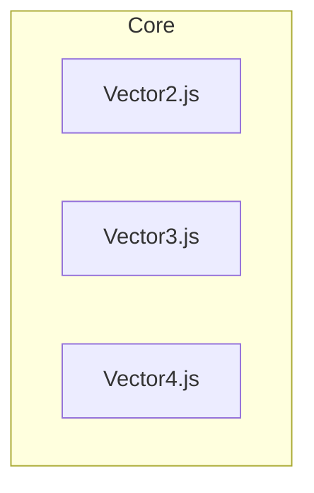
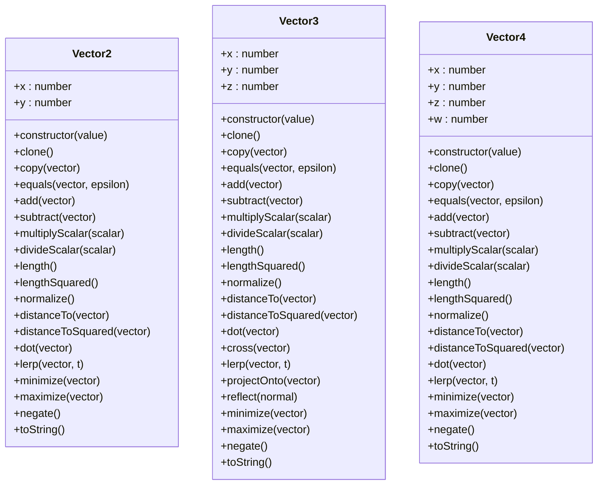
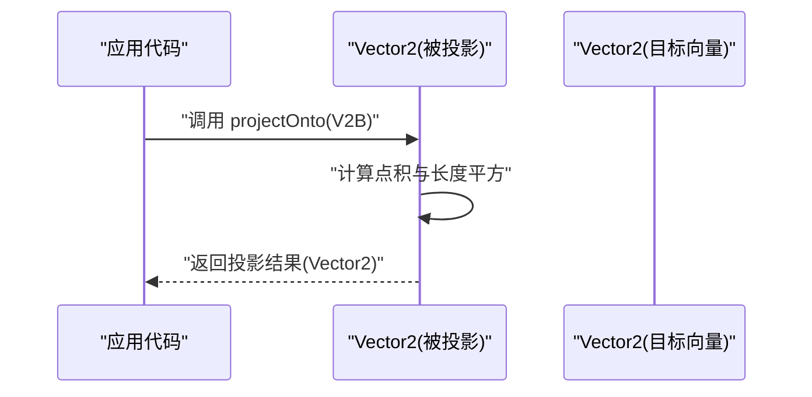
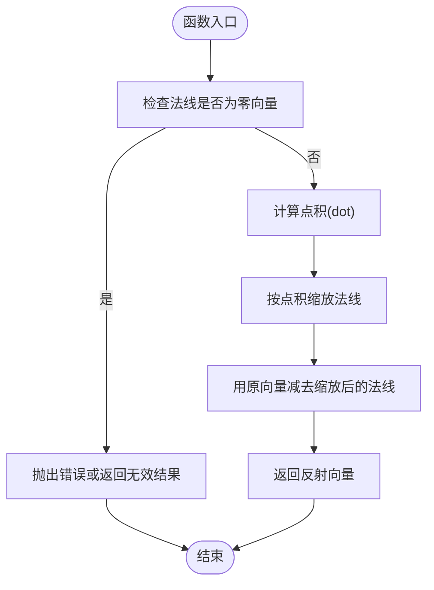
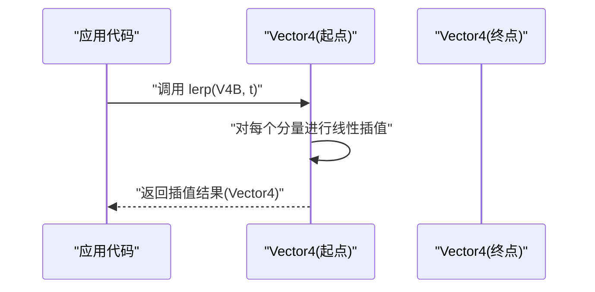
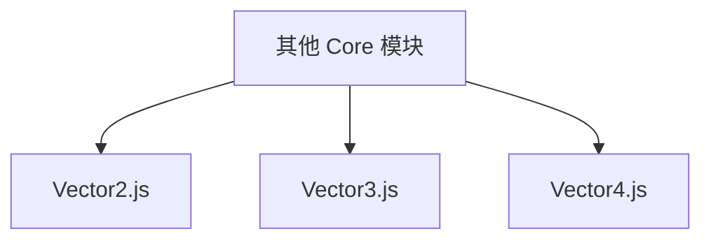

# 向量类API

<cite>
**本文引用的文件**   
- [Vector2.js](file://Source/Core/Vector2.js)
- [Vector3.js](file://Source/Core/Vector3.js)
- [Vector4.js](file://Source/Core/Vector4.js)
</cite>

## 目录
1. [简介](#简介)
2. [项目结构](#项目结构)
3. [核心组件](#核心组件)
4. [架构总览](#架构总览)
5. [详细组件分析](#详细组件分析)
6. [依赖关系分析](#依赖关系分析)
7. [性能考虑](#性能考虑)
8. [故障排查指南](#故障排查指南)
9. [结论](#结论)
10. [附录](#附录)

## 简介
本文件为 Cesium 中向量类的 API 文档，覆盖 Vector2、Vector3、Vector4 三个类的完整接口与使用要点。内容包含：
- 构造函数参数说明
- 静态方法（如 add、subtract、multiply、dot、cross 等）
- 实例方法与属性访问器
- 常用数学运算：归一化、距离计算、投影变换等
- 每个方法的参数类型、返回值说明与实际使用示例路径

该文档旨在帮助开发者在 3D 数学计算中正确使用向量，涵盖二维、三维与四维向量的常见用法。

## 项目结构
Cesium 的向量实现位于 Source/Core 目录下，分别由以下文件提供：
- Vector2：二维向量
- Vector3：三维向量
- Vector4：四维向量

图表来源
- [Vector2.js](file://Source/Core/Vector2.js)
- [Vector3.js](file://Source/Core/Vector3.js)
- [Vector4.js](file://Source/Core/Vector4.js)

章节来源
- [Vector2.js](file://Source/Core/Vector2.js)
- [Vector3.js](file://Source/Core/Vector3.js)
- [Vector4.js](file://Source/Core/Vector4.js)

## 核心组件
本节概述三类向量的职责与共性能力：
- Vector2：表示二维向量，常用于 UV 坐标、屏幕空间偏移、纹理采样等。
- Vector3：表示三维向量，广泛用于几何、光照、相机、物理等 3D 场景。
- Vector4：表示四维向量，通常用于齐次坐标、颜色 RGBA、四元数分量等。

共同特性（适用于三类向量）：
- 构造：支持从标量或数组初始化
- 拷贝与克隆：返回新实例或就地复制
- 比较：相等性判断（含容差）
- 基本算术：加、减、点乘、缩放、线性插值
- 范数与归一化：长度、平方长度、单位向量
- 投影与变换：投影到某向量、反射、旋转（维度相关）
- 距离：欧氏距离、平方距离
- 工具：最小/最大分量、绝对值、取整、格式化字符串等

章节来源
- [Vector2.js](file://Source/Core/Vector2.js)
- [Vector3.js](file://Source/Core/Vector3.js)
- [Vector4.js](file://Source/Core/Vector4.js)

## 架构总览
三类向量在 API 设计上保持一致风格，便于在不同维度间迁移使用。下图展示它们的关系与典型调用流程。

图表来源
- [Vector2.js](file://Source/Core/Vector2.js)
- [Vector3.js](file://Source/Core/Vector3.js)
- [Vector4.js](file://Source/Core/Vector4.js)

## 详细组件分析

### Vector2 类
- 维度：2（x, y）
- 适用场景：UV 坐标、屏幕空间偏移、纹理采样、平面几何等

主要能力概览
- 构造：支持传入单个标量或长度为 2 的数组
- 基础运算：add、subtract、multiplyScalar、divideScalar
- 范数与归一化：length、lengthSquared、normalize
- 投影与变换：projectOnto（投影）、reflect（反射，需法线）
- 距离：distanceTo、distanceToSquared
- 点积：dot
- 插值：lerp
- 分量操作：minimize、maximize、negate
- 比较与序列化：equals、toString

使用示例（路径）
- 创建与拷贝：[Vector2.js](file://Source/Core/Vector2.js)
- 加法与减法：[Vector2.js](file://Source/Core/Vector2.js)
- 点积与长度：[Vector2.js](file://Source/Core/Vector2.js)
- 归一化与投影：[Vector2.js](file://Source/Core/Vector2.js)
- 距离计算：[Vector2.js](file://Source/Core/Vector2.js)

章节来源
- [Vector2.js](file://Source/Core/Vector2.js)

#### 序列图：Vector2 投影到另一向量

图表来源
- [Vector2.js](file://Source/Core/Vector2.js)

### Vector3 类
- 维度：3（x, y, z）
- 适用场景：3D 几何、光照、相机、物理、射线检测等

主要能力概览
- 构造：支持传入单个标量或长度为 3 的数组
- 基础运算：add、subtract、multiplyScalar、divideScalar
- 范数与归一化：length、lengthSquared、normalize
- 叉积：cross（仅三维）
- 投影与变换：projectOnto、reflect
- 距离：distanceTo、distanceToSquared
- 点积：dot
- 插值：lerp
- 分量操作：minimize、maximize、negate
- 比较与序列化：equals、toString

使用示例（路径）
- 创建与拷贝：[Vector3.js](file://Source/Core/Vector3.js)
- 加减与缩放：[Vector3.js](file://Source/Core/Vector3.js)
- 点积与叉积：[Vector3.js](file://Source/Core/Vector3.js)
- 归一化与投影：[Vector3.js](file://Source/Core/Vector3.js)
- 反射与距离：[Vector3.js](file://Source/Core/Vector3.js)

章节来源
- [Vector3.js](file://Source/Core/Vector3.js)

#### 流程图：Vector3 反射计算

图表来源
- [Vector3.js](file://Source/Core/Vector3.js)

### Vector4 类
- 维度：4（x, y, z, w）
- 适用场景：齐次坐标、颜色 RGBA、四元数分量等

主要能力概览
- 构造：支持传入单个标量或长度为 4 的数组
- 基础运算：add、subtract、multiplyScalar、divideScalar
- 范数与归一化：length、lengthSquared、normalize
- 距离：distanceTo、distanceToSquared
- 点积：dot
- 插值：lerp
- 分量操作：minimize、maximize、negate
- 比较与序列化：equals、toString

使用示例（路径）
- 创建与拷贝：[Vector4.js](file://Source/Core/Vector4.js)
- 加减与缩放：[Vector4.js](file://Source/Core/Vector4.js)
- 点积与长度：[Vector4.js](file://Source/Core/Vector4.js)
- 归一化与距离：[Vector4.js](file://Source/Core/Vector4.js)

章节来源
- [Vector4.js](file://Source/Core/Vector4.js)

#### 序列图：Vector4 线性插值

图表来源
- [Vector4.js](file://Source/Core/Vector4.js)

## 依赖关系分析
三类向量彼此独立，无相互导入依赖；它们作为基础数学类型被上层模块广泛使用。

图表来源
- [Vector2.js](file://Source/Core/Vector2.js)
- [Vector3.js](file://Source/Core/Vector3.js)
- [Vector4.js](file://Source/Core/Vector4.js)

章节来源
- [Vector2.js](file://Source/Core/Vector2.js)
- [Vector3.js](file://Source/Core/Vector3.js)
- [Vector4.js](file://Source/Core/Vector4.js)

## 性能考虑
- 避免不必要的对象分配：优先复用向量实例，减少频繁 new 带来的 GC 压力
- 使用平方长度与平方距离：在比较大小或阈值判断时，优先使用 lengthSquared/distanceToSquared，避免开方开销
- 批量处理：对大量向量进行循环计算时，尽量合并操作，减少中间对象
- 精度控制：在浮点比较中使用合适的 epsilon，避免误差导致的分支抖动
- 归一化前检查长度：对接近零长度的向量进行保护，防止除零或不稳定结果

## 故障排查指南
- 除以零风险：对长度接近零的向量执行 normalize 或 divideScalar 前，先检查长度或使用安全版本
- 非法输入：传入空数组或长度不匹配的数组可能导致异常，应在调用前校验
- 数值溢出/下溢：极端大/小数值可能导致 NaN 或 Infinity，建议做范围限制或钳制
- 精度问题：比较相等时使用 equals 并提供合理的 epsilon，避免直接比较浮点数
- 反射与投影的法线：确保法线已归一化，否则结果可能不符合预期

章节来源
- [Vector2.js](file://Source/Core/Vector2.js)
- [Vector3.js](file://Source/Core/Vector3.js)
- [Vector4.js](file://Source/Core/Vector4.js)

## 结论
Vector2、Vector3、Vector4 提供了统一的向量 API 风格，覆盖从基础算术到高级变换的常用功能。通过合理使用这些方法，开发者可以高效地完成 2D/3D 数学计算，并在性能与稳定性之间取得平衡。

## 附录
- 快速参考（按类别）
  - 构造与拷贝：参见各文件中的构造与 clone/copy 方法
  - 基础运算：add、subtract、multiplyScalar、divideScalar
  - 范数与归一化：length、lengthSquared、normalize
  - 点积与叉积：dot（所有维度）、cross（仅 Vector3）
  - 投影与反射：projectOnto、reflect（Vector2/Vector3）
  - 距离：distanceTo、distanceToSquared
  - 插值：lerp
  - 分量操作：minimize、maximize、negate
  - 比较与序列化：equals、toString

章节来源
- [Vector2.js](file://Source/Core/Vector2.js)
- [Vector3.js](file://Source/Core/Vector3.js)
- [Vector4.js](file://Source/Core/Vector4.js)