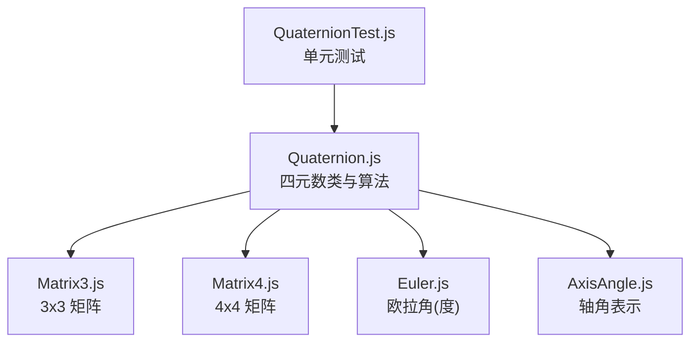
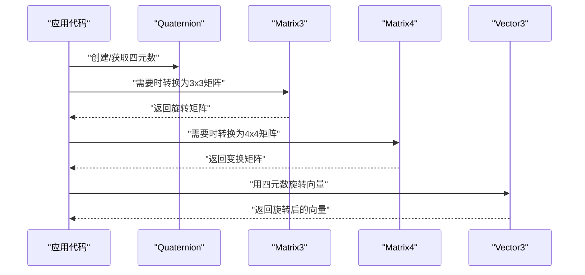
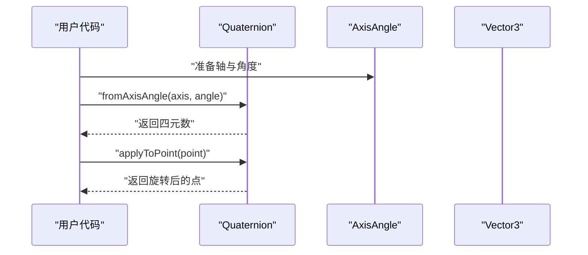
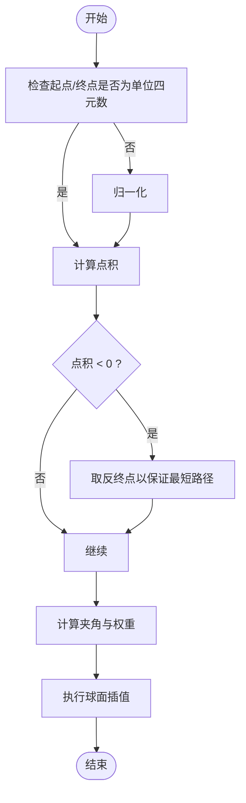
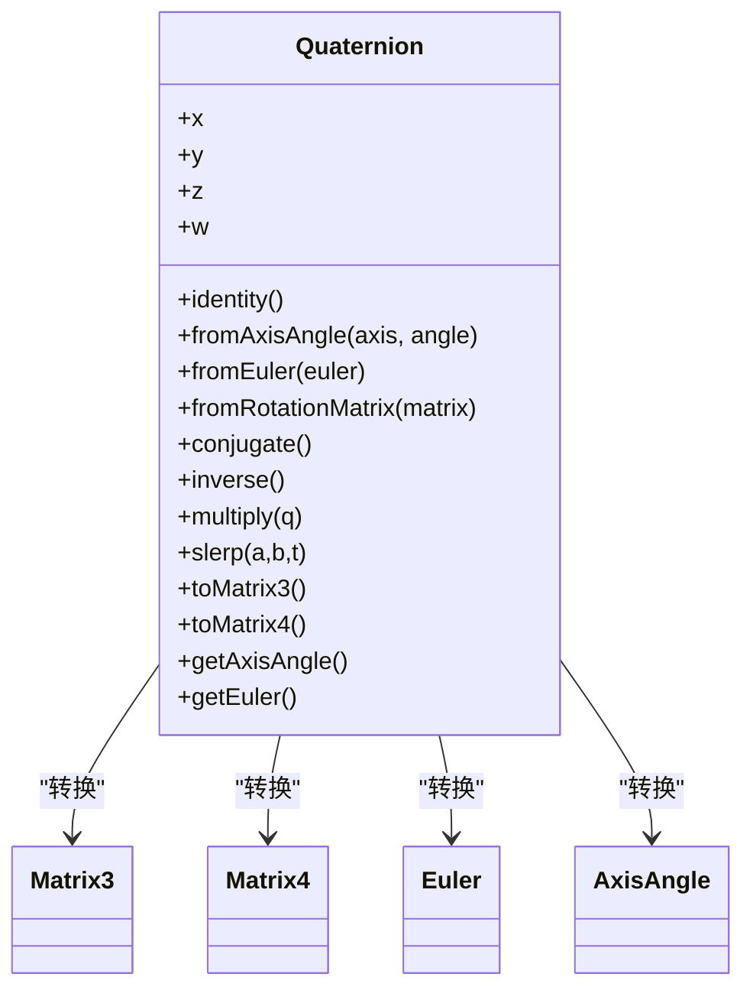

# 四元数API

<cite>
**本文引用的文件**   
- [Quaternion.js](file://Source/Core/Quaternion.js)
- [Matrix3.js](file://Source/Core/Matrix3.js)
- [Matrix4.js](file://Source/Core/Matrix4.js)
- [Euler.js](file://Source/Core/Euler.js)
- [AxisAngle.js](file://Source/Core/AxisAngle.js)
- [QuaternionTest.js](file://Specs/Core/QuaternionSpec.js)
</cite>

## 目录
1. [简介](#简介)
2. [项目结构](#项目结构)
3. [核心组件](#核心组件)
4. [架构总览](#架构总览)
5. [详细组件分析](#详细组件分析)
6. [依赖关系分析](#依赖关系分析)
7. [性能考量](#性能考量)
8. [故障排查指南](#故障排查指南)
9. [结论](#结论)
10. [附录](#附录) 

## 简介
本文件为 Cesium 中 Quaternion（四元数）的完整 API 文档，覆盖构造函数、静态工厂方法、实例方法与常用数学操作。重点说明四元数在三维旋转中的应用，包括轴角表示、欧拉角转换、矩阵与四元数互转、球面线性插值等高级用法，并给出参数类型、返回值说明与实际使用场景示例，帮助开发者理解四元数相比传统旋转表示的优势与最佳实践。

## 项目结构
Cesium 的四元数实现位于 Source/Core 目录，相关测试用例位于 Specs/Core。与四元数交互密切的类型包括 Matrix3、Matrix4、Euler、AxisAngle。下图展示了与四元数相关的核心文件及其职责：

图表来源
- [Quaternion.js](file://Source/Core/Quaternion.js)
- [Matrix3.js](file://Source/Core/Matrix3.js)
- [Matrix4.js](file://Source/Core/Matrix4.js)
- [Euler.js](file://Source/Core/Euler.js)
- [AxisAngle.js](file://Source/Core/AxisAngle.js)
- [QuaternionTest.js](file://Specs/Core/QuaternionSpec.js)

章节来源
- [Quaternion.js](file://Source/Core/Quaternion.js)
- [QuaternionTest.js](file://Specs/Core/QuaternionSpec.js)

## 核心组件
- 四元数类型：用于表示三维空间中的旋转，避免万向节锁，支持高效插值与组合。
- 主要能力：
  - 构造与工厂方法：从标量数组、轴角、欧拉角、旋转矩阵等创建四元数。
  - 基本运算：共轭、逆、乘法、点积、长度、归一化、比较等。
  - 变换应用：将四元数作用于向量或矩阵。
  - 插值与平滑：球面线性插值（slerp）、单位四元球面上的插值。
  - 与其他表示互转：与 3x3/4x4 矩阵、欧拉角、轴角之间的相互转换。

章节来源
- [Quaternion.js](file://Source/Core/Quaternion.js)

## 架构总览
四元数作为基础几何类型，被上层渲染、相机、模型、动画等模块广泛使用。其典型调用路径如下：

图表来源
- [Quaternion.js](file://Source/Core/Quaternion.js)
- [Matrix3.js](file://Source/Core/Matrix3.js)
- [Matrix4.js](file://Source/Core/Matrix4.js)

## 详细组件分析

### 构造函数与内部存储
- 内部存储：四个分量 x、y、z、w，遵循约定 w 为实部，(x,y,z) 为虚部。
- 构造方式：
  - 无参构造：默认单位四元数。
  - 传入四个数值：按顺序设置 x、y、z、w。
  - 传入长度为4的数组：拷贝数组元素到 x、y、z、w。
- 注意：
  - 输入未归一化的四元数仍可表示旋转，但参与插值前应确保为单位四元数。
  - 若需原地修改，可使用“赋值”类方法；否则多数方法返回新实例。

章节来源
- [Quaternion.js](file://Source/Core/Quaternion.js)

### 静态工厂方法
- identity()
  - 作用：返回单位四元数。
  - 适用场景：初始化、重置旋转状态。
- fromAxisAngle(axis, angle)
  - 参数：axis 为三维向量（需归一化），angle 为弧度。
  - 返回：新的四元数。
  - 适用场景：绕任意轴旋转的基础构建块。
- fromEuler(euler)
  - 参数：euler 为欧拉角对象（单位为度）。
  - 返回：新的四元数。
  - 适用场景：由偏航/俯仰/滚转角快速生成旋转。
- fromRotationMatrix(matrix)
  - 参数：matrix 为 3x3 或 4x4 旋转矩阵。
  - 返回：新的四元数。
  - 适用场景：从外部矩阵数据导入旋转。
- fromArray(array, offset)
  - 参数：array 为长度为4的数组，offset 为可选偏移。
  - 返回：新的四元数。
  - 适用场景：批量解析序列化数据。

章节来源
- [Quaternion.js](file://Source/Core/Quaternion.js)
- [Matrix3.js](file://Source/Core/Matrix3.js)
- [Matrix4.js](file://Source/Core/Matrix4.js)
- [Euler.js](file://Source/Core/Euler.js)
- [AxisAngle.js](file://Source/Core/AxisAngle.js)

### 实例方法
- conjugate()
  - 作用：计算共轭四元数。
  - 用途：求逆（单位四元数下共轭即逆）、反射等。
- inverse()
  - 作用：计算逆四元数。
  - 注意：对单位四元数，逆等于共轭。
- multiply(quaternion)
  - 作用：四元数乘法（组合旋转）。
  - 顺序：通常 q * p 表示先应用 p，再应用 q（左乘约定）。
- dot(other)
  - 作用：点积。
  - 用途：相似度度量、夹角计算。
- length()/magnitude()
  - 作用：模长。
- normalize()
  - 作用：归一化为单位四元数。
- equalsApproximate(other, epsilon)
  - 作用：近似相等比较。
- clone()
  - 作用：深拷贝。
- set(x, y, z, w)
  - 作用：原地设置分量。
- toArray(result, offset)
  - 作用：输出到数组，便于序列化或 GPU 传输。
- applyToPoint(point) / transformPoint(point)
  - 作用：将四元数作用于三维点/向量。
- toMatrix3(result) / toMatrix4(result)
  - 作用：转换为 3x3/4x4 旋转矩阵。
- slerp(start, end, t)
  - 作用：球面线性插值，t ∈ [0,1]。
  - 注意：start 与 end 应为单位四元数；当接近反号时需翻转以保证最短路径。
- rotateByAxisAngle(axis, angle)
  - 作用：原地更新当前四元数为“当前旋转 + 绕轴角增量”。
- getAxisAngle(result)
  - 作用：提取轴角表示（结果写入 AxisAngle 对象）。
- getEuler(result)
  - 作用：提取欧拉角（结果写入 Euler 对象，单位为度）。

章节来源
- [Quaternion.js](file://Source/Core/Quaternion.js)

### 关键流程与时序

#### 从轴角到旋转的应用

图表来源
- [Quaternion.js](file://Source/Core/Quaternion.js)
- [AxisAngle.js](file://Source/Core/AxisAngle.js)

#### 球面线性插值（Slerp）

图表来源
- [Quaternion.js](file://Source/Core/Quaternion.js)

### 与其他类型的互转
- 矩阵 ↔ 四元数
  - 从矩阵到四元数：处理数值稳定性与退化情况（如迹接近零）。
  - 从四元数到矩阵：生成标准正交旋转矩阵。
- 欧拉角 ↔ 四元数
  - 欧拉角以度为单位，注意旋转顺序与定义域。
- 轴角 ↔ 四元数
  - 轴需归一化，角度为弧度。

章节来源
- [Quaternion.js](file://Source/Core/Quaternion.js)
- [Matrix3.js](file://Source/Core/Matrix3.js)
- [Matrix4.js](file://Source/Core/Matrix4.js)
- [Euler.js](file://Source/Core/Euler.js)
- [AxisAngle.js](file://Source/Core/AxisAngle.js)

## 依赖关系分析
四元数与矩阵、欧拉角、轴角之间存在双向依赖：四元数提供与这些表示的转换接口，同时这些类型也依赖四元数进行旋转表达。

图表来源
- [Quaternion.js](file://Source/Core/Quaternion.js)
- [Matrix3.js](file://Source/Core/Matrix3.js)
- [Matrix4.js](file://Source/Core/Matrix4.js)
- [Euler.js](file://Source/Core/Euler.js)
- [AxisAngle.js](file://Source/Core/AxisAngle.js)

章节来源
- [Quaternion.js](file://Source/Core/Quaternion.js)

## 性能考量
- 优先使用单位四元数：插值与多次组合前务必归一化，避免误差累积。
- 批量操作：尽量复用中间对象，减少频繁分配。
- 选择合适表示：
  - 大量插值与动画：四元数优于欧拉角与矩阵。
  - 与图形管线对接：最终可转换为矩阵以便 GPU 使用。
- 数值稳定：
  - 从矩阵转四元数时，关注奇异情况（如迹接近零）。
  - 小角度旋转时注意浮点精度。

[本节为通用指导，不直接分析具体文件]

## 故障排查指南
- 常见问题
  - 非单位四元数导致插值异常：在使用 slerp 前确保两端为单位四元数。
  - 轴未归一化：fromAxisAngle 要求轴为单位向量。
  - 欧拉角歧义：不同旋转顺序与定义域会导致不同结果，建议统一约定。
  - 矩阵退化：从病态矩阵转四元数可能不稳定，必要时回退或修正矩阵。
- 定位手段
  - 打印四元数分量与长度，确认是否为单位四元数。
  - 对比矩阵与四元数互转前后的一致性。
  - 使用近似相等比较代替严格相等。

章节来源
- [QuaternionTest.js](file://Specs/Core/QuaternionSpec.js)

## 结论
四元数是 Cesium 中表示三维旋转的核心数据结构，具备无奇异性、插值平滑、组合高效等优势。通过丰富的静态工厂与实例方法，开发者可以便捷地在轴角、欧拉角、矩阵之间切换，并在动画、相机控制、模型姿态等场景中稳定高效地工作。

[本节为总结性内容，不直接分析具体文件]

## 附录
- 术语
  - 单位四元数：模长为 1 的四元数，表示合法旋转。
  - 共轭：将虚部符号取反，单位四元数的共轭即其逆。
  - 球面线性插值：在单位四元数球面上沿最短路径插值。
- 参考
  - 单元测试用例有助于理解边界条件与期望行为。

章节来源
- [QuaternionTest.js](file://Specs/Core/QuaternionSpec.js)