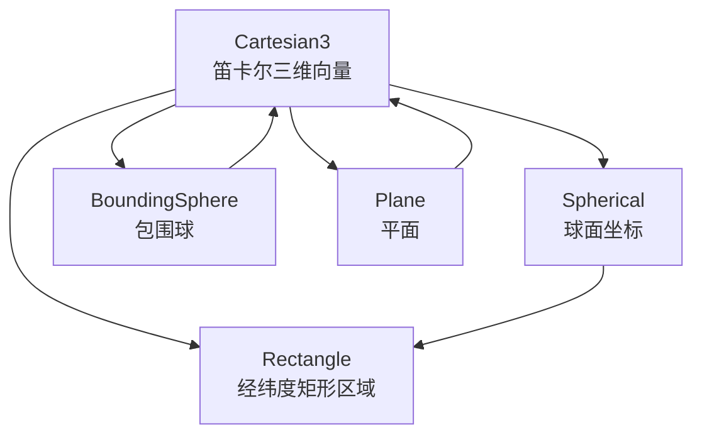
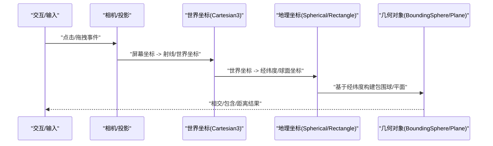
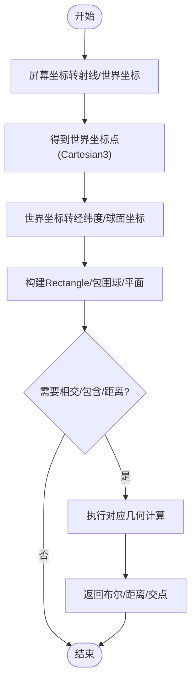
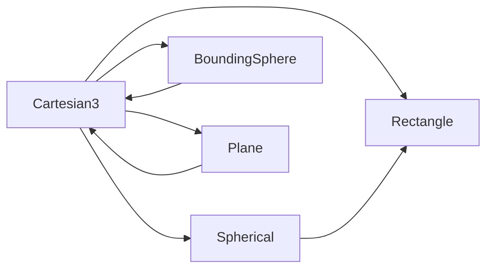

# 坐标系统API

<cite>
**本文引用的文件**   
- [Cartesian3.js](file://Source/Core/Cartesian3.js)
- [Spherical.js](file://Source/Core/Spherical.js)
- [Rectangle.js](file://Source/Core/Rectangle.js)
- [BoundingSphere.js](file://Source/Core/BoundingSphere.js)
- [Plane.js](file://Source/Core/Plane.js)
</cite>

## 目录
1. [简介](#简介)
2. [项目结构](#项目结构)
3. [核心组件](#核心组件)
4. [架构总览](#架构总览)
5. [详细组件分析](#详细组件分析)
6. [依赖关系分析](#依赖关系分析)
7. [性能考虑](#性能考虑)
8. [故障排查指南](#故障排查指南)
9. [结论](#结论)
10. [附录](#附录)

## 简介
本章节面向需要在Cesium中进行地理空间计算的开发者，系统化梳理以下核心坐标与几何对象：笛卡尔三维向量Cartesian3、球面坐标Spherical、矩形区域Rectangle、包围球BoundingSphere、平面Plane。文档重点覆盖：
- 各对象的构造参数与属性
- 常用方法与其语义（相交检测、包含判断、距离计算、投影等）
- 坐标系统之间的转换路径与注意事项
- 典型使用场景与最佳实践

## 项目结构
Cesium的几何与坐标类型位于Source/Core目录下，彼此之间通过静态工具函数进行组合与计算。下图给出本次文档涉及的模块及其职责边界。

图表来源
- [Cartesian3.js](file://Source/Core/Cartesian3.js)
- [Spherical.js](file://Source/Core/Spherical.js)
- [Rectangle.js](file://Source/Core/Rectangle.js)
- [BoundingSphere.js](file://Source/Core/BoundingSphere.js)
- [Plane.js](file://Source/Core/Plane.js)

章节来源
- [Cartesian3.js](file://Source/Core/Cartesian3.js)
- [Spherical.js](file://Source/Core/Spherical.js)
- [Rectangle.js](file://Source/Core/Rectangle.js)
- [BoundingSphere.js](file://Source/Core/BoundingSphere.js)
- [Plane.js](file://Source/Core/Plane.js)

## 核心组件
本节对每个核心对象提供“构造函数参数”“关键方法”“常见用途”的概览，并给出源码定位以便深入查阅。

- Cartesian3（笛卡尔三维向量）
  - 作用：表示三维空间中的点或向量，是多数几何计算的基础载体
  - 构造：支持从三个标量x/y/z创建；也支持从现有向量拷贝
  - 常用能力：加减乘除、点积、叉积、长度、归一化、线性插值、矩阵变换、到球面/经纬度的转换等
  - 参考实现
    - 构造与基础运算：[Cartesian3.js](file://Source/Core/Cartesian3.js)
    - 坐标转换相关：[Cartesian3.js](file://Source/Core/Cartesian3.js)

- Spherical（球面坐标）
  - 作用：以半径、经度、纬度描述位置，常用于地球表面附近的表达
  - 构造：支持从半径、经度、纬度创建；也支持从Cartesian3反算
  - 常用能力：与Cartesian3互转、与矩形区域的交集/包含判定辅助
  - 参考实现
    - 构造与转换：[Spherical.js](file://Source/Core/Spherical.js)

- Rectangle（矩形区域）
  - 作用：用西/南/东/北四个角度定义经纬度矩形，常用于视锥裁剪、瓦片分块、区域筛选
  - 构造：支持从west/south/east/north创建；也支持从两个角点构建
  - 常用能力：中心点、宽高、是否包含某点、是否与另一矩形相交、与球体/平面的关系判断
  - 参考实现
    - 构造与几何关系：[Rectangle.js](file://Source/Core/Rectangle.js)

- BoundingSphere（包围球）
  - 作用：用中心点和半径描述一个球体包围盒，用于快速剔除与碰撞预检
  - 构造：支持从中心+半径创建；也支持从一组点计算最小包围球
  - 常用能力：与点、线段、三角形、其他球体的相交/包含/距离计算
  - 参考实现
    - 构造与求交：[BoundingSphere.js](file://Source/Core/BoundingSphere.js)

- Plane（平面）
  - 作用：由法向量和常数项定义的无限平面，用于半空间测试、投影、剖切
  - 构造：支持从法向量+常数项创建；也支持从三点确定平面
  - 常用能力：点到平面距离、点在平面哪一侧、线与平面交点、投影到平面
  - 参考实现
    - 构造与几何关系：[Plane.js](file://Source/Core/Plane.js)

章节来源
- [Cartesian3.js](file://Source/Core/Cartesian3.js)
- [Spherical.js](file://Source/Core/Spherical.js)
- [Rectangle.js](file://Source/Core/Rectangle.js)
- [BoundingSphere.js](file://Source/Core/BoundingSphere.js)
- [Plane.js](file://Source/Core/Plane.js)

## 架构总览
下图展示这些对象在典型计算流程中的协作方式：从屏幕/相机空间到世界坐标，再到地理坐标与几何关系判断。

图表来源
- [Cartesian3.js](file://Source/Core/Cartesian3.js)
- [Spherical.js](file://Source/Core/Spherical.js)
- [Rectangle.js](file://Source/Core/Rectangle.js)
- [BoundingSphere.js](file://Source/Core/BoundingSphere.js)
- [Plane.js](file://Source/Core/Plane.js)

## 详细组件分析

### Cartesian3（笛卡尔三维向量）
- 构造与属性
  - 通过三个数值x/y/z初始化；也可从已有向量复制
  - 提供大量静态工厂方法与原地修改方法
- 常用方法类别
  - 算术：加、减、乘、除、缩放
  - 向量代数：点积、叉积、长度、平方长度、归一化
  - 插值与混合：线性插值、球面插值（配合其他模块）
  - 坐标转换：与球面坐标、经纬度之间的转换工具
  - 矩阵变换：与变换矩阵相乘得到新坐标
- 复杂度与性能
  - 大多数操作为O(1)，适合高频调用
  - 注意避免不必要的中间对象分配，优先使用原地方法
- 典型用法
  - 将屏幕拾取转换为世界坐标
  - 作为包围球、平面等几何对象的顶点/中心载体
- 参考实现
  - 构造与基础运算：[Cartesian3.js](file://Source/Core/Cartesian3.js)
  - 坐标转换与矩阵乘法：[Cartesian3.js](file://Source/Core/Cartesian3.js)

章节来源
- [Cartesian3.js](file://Source/Core/Cartesian3.js)

### Spherical（球面坐标）
- 构造与属性
  - 由半径、经度、纬度构成；可自Cartesian3推导
- 常用方法类别
  - 与Cartesian3互转
  - 与Rectangle的包含/相交判断辅助
- 复杂度与性能
  - 转换涉及三角函数，建议批量处理时复用中间变量
- 典型用法
  - 将世界坐标转为经纬度后做区域筛选
  - 结合高度信息构建近地模型
- 参考实现
  - 构造与转换：[Spherical.js](file://Source/Core/Spherical.js)

章节来源
- [Spherical.js](file://Source/Core/Spherical.js)

### Rectangle（矩形区域）
- 构造与属性
  - west/south/east/north定义经纬度范围；支持自动规范化跨180度经线
- 常用方法类别
  - 中心点、宽度、高度
  - 包含点、与另一矩形相交
  - 与球体/平面的关系判断（如与包围球相交、与平面相交）
- 复杂度与性能
  - 多为O(1)比较与区间运算
- 典型用法
  - 视锥裁剪、瓦片请求范围、兴趣区域筛选
- 参考实现
  - 构造与几何关系：[Rectangle.js](file://Source/Core/Rectangle.js)

章节来源
- [Rectangle.js](file://Source/Core/Rectangle.js)

### BoundingSphere（包围球）
- 构造与属性
  - 中心点与半径；可从点集计算最小包围球
- 常用方法类别
  - 与点、线段、三角形、其他球体的相交/包含/距离
  - 与平面相交、与矩形区域的关系
- 复杂度与性能
  - 求交多为O(1)，适合大规模剔除
- 典型用法
  - 可见性剔除、碰撞预检、LOD选择
- 参考实现
  - 构造与求交：[BoundingSphere.js](file://Source/Core/BoundingSphere.js)

章节来源
- [BoundingSphere.js](file://Source/Core/BoundingSphere.js)

### Plane（平面）
- 构造与属性
  - 法向量与常数项；可由三点确定
- 常用方法类别
  - 点到平面距离、点在平面哪一侧
  - 直线与平面交点、点到平面投影
  - 与球体/矩形的相交判断
- 复杂度与性能
  - 基本为O(1)线性代数运算
- 典型用法
  - 地面投影、半空间裁剪、剖切算法
- 参考实现
  - 构造与几何关系：[Plane.js](file://Source/Core/Plane.js)

章节来源
- [Plane.js](file://Source/Core/Plane.js)

### 坐标系统与几何关系流程图
下面以“屏幕拾取→世界坐标→地理坐标→几何判断”为主线，展示关键步骤与决策分支。

图表来源
- [Cartesian3.js](file://Source/Core/Cartesian3.js)
- [Spherical.js](file://Source/Core/Spherical.js)
- [Rectangle.js](file://Source/Core/Rectangle.js)
- [BoundingSphere.js](file://Source/Core/BoundingSphere.js)
- [Plane.js](file://Source/Core/Plane.js)

## 依赖关系分析
- 耦合关系
  - Cartesian3是底层载体，被Spherical、Rectangle、BoundingSphere、Plane广泛引用
  - Spherical与Rectangle常协同完成地理范围判断
  - BoundingSphere与Plane提供高效的几何关系判定
- 外部依赖
  - 三角函数、线性代数库（内部实现）
- 循环依赖
  - 当前模块间为单向依赖，无循环引用迹象

图表来源
- [Cartesian3.js](file://Source/Core/Cartesian3.js)
- [Spherical.js](file://Source/Core/Spherical.js)
- [Rectangle.js](file://Source/Core/Rectangle.js)
- [BoundingSphere.js](file://Source/Core/BoundingSphere.js)
- [Plane.js](file://Source/Core/Plane.js)

章节来源
- [Cartesian3.js](file://Source/Core/Cartesian3.js)
- [Spherical.js](file://Source/Core/Spherical.js)
- [Rectangle.js](file://Source/Core/Rectangle.js)
- [BoundingSphere.js](file://Source/Core/BoundingSphere.js)
- [Plane.js](file://Source/Core/Plane.js)

## 性能考虑
- 尽量复用对象与数组，减少频繁分配
- 批量处理时合并多次转换，避免重复计算
- 使用包围球/平面进行粗粒度剔除，再对候选集合做精细计算
- 注意浮点精度问题，必要时引入容差阈值

## 故障排查指南
- 常见问题
  - 经纬度越界：确保west/south/east/north在合理范围内，跨180度经线时使用规范化逻辑
  - 单位混淆：角度与弧度混用导致错误，统一使用弧度制
  - 法向量未归一化：平面计算前需保证法向量长度为1
  - 零长度向量：叉积/归一化前检查长度，避免NaN
- 定位建议
  - 打印中间结果（世界坐标、经纬度、法向量、半径）
  - 逐步缩小范围，先验证包围球/平面是否正确构建
  - 使用最小用例复现问题，隔离第三方影响

## 结论
Cartesian3、Spherical、Rectangle、BoundingSphere、Plane构成了Cesium中地理空间计算的核心基石。掌握它们的构造参数、方法语义与相互转换路径，能够高效完成拾取、裁剪、碰撞、投影等常见任务。建议在工程实践中遵循“先粗后精”的几何判断策略，并结合批量化与对象复用提升整体性能。

## 附录
- 术语对照
  - 笛卡尔坐标：Cartesian3
  - 球面坐标：Spherical
  - 矩形区域：Rectangle
  - 包围球：BoundingSphere
  - 平面：Plane
- 参考实现路径
  - Cartesian3：[Cartesian3.js](file://Source/Core/Cartesian3.js)
  - Spherical：[Spherical.js](file://Source/Core/Spherical.js)
  - Rectangle：[Rectangle.js](file://Source/Core/Rectangle.js)
  - BoundingSphere：[BoundingSphere.js](file://Source/Core/BoundingSphere.js)
  - Plane：[Plane.js](file://Source/Core/Plane.js)