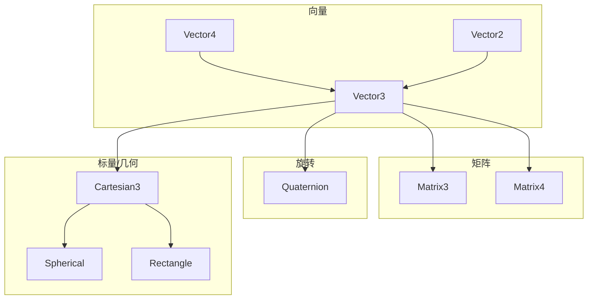
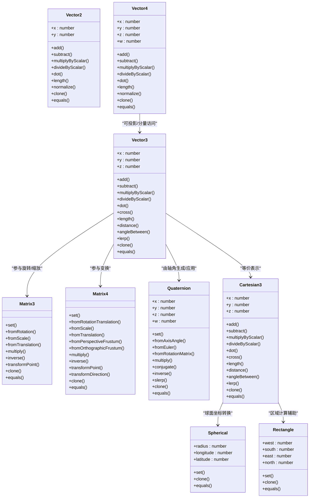
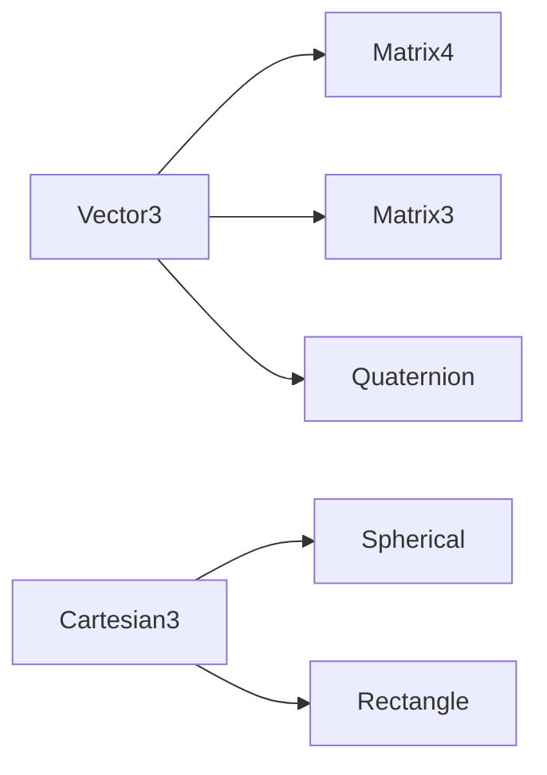

# 数学库API

<cite>
**本文引用的文件**   
- [Vector2.js](file://Source/Core/Vector2.js)
- [Vector3.js](file://Source/Core/Vector3.js)
- [Vector4.js](file://Source/Core/Vector4.js)
- [Matrix3.js](file://Source/Core/Matrix3.js)
- [Matrix4.js](file://Source/Core/Matrix4.js)
- [Quaternion.js](file://Source/Core/Quaternion.js)
- [Cartesian3.js](file://Source/Core/Cartesian3.js)
- [Spherical.js](file://Source/Core/Spherical.js)
- [Rectangle.js](file://Source/Core/Rectangle.js)
</cite>

## 目录
1. [简介](#简介)
2. [项目结构](#项目结构)
3. [核心组件](#核心组件)
4. [架构总览](#架构总览)
5. [详细组件分析](#详细组件分析)
6. [依赖关系分析](#依赖关系分析)
7. [性能考虑](#性能考虑)
8. [故障排查指南](#故障排查指南)
9. [结论](#结论)
10. [附录](#附录) 

## 简介
本文件为 Cesium 数学库的完整 API 文档，覆盖向量（Vector2、Vector3、Vector4）、矩阵（Matrix3、Matrix4）、四元数（Quaternion）以及常用标量与几何类型（Cartesian3、Spherical、Rectangle）。内容包含：
- 构造参数说明
- 静态方法与实例方法清单
- 常见运算（加减乘除、点积、叉积、归一化等）
- 矩阵变换（旋转、缩放、平移、投影）
- 坐标转换（笛卡尔、球面、经纬度矩形区域）
- 使用示例路径与最佳实践

## 项目结构
Cesium 数学类型集中于 Source/Core 目录，按类型分文件组织，便于按需引入与维护。下图展示了本次文档涉及的数学类型及其职责边界。

**图表来源** 
- [Vector2.js](file://Source/Core/Vector2.js)
- [Vector3.js](file://Source/Core/Vector3.js)
- [Vector4.js](file://Source/Core/Vector4.js)
- [Matrix3.js](file://Source/Core/Matrix3.js)
- [Matrix4.js](file://Source/Core/Matrix4.js)
- [Quaternion.js](file://Source/Core/Quaternion.js)
- [Cartesian3.js](file://Source/Core/Cartesian3.js)
- [Spherical.js](file://Source/Core/Spherical.js)
- [Rectangle.js](file://Source/Core/Rectangle.js)

**章节来源**
- [Vector2.js](file://Source/Core/Vector2.js)
- [Vector3.js](file://Source/Core/Vector3.js)
- [Vector4.js](file://Source/Core/Vector4.js)
- [Matrix3.js](file://Source/Core/Matrix3.js)
- [Matrix4.js](file://Source/Core/Matrix4.js)
- [Quaternion.js](file://Source/Core/Quaternion.js)
- [Cartesian3.js](file://Source/Core/Cartesian3.js)
- [Spherical.js](file://Source/Core/Spherical.js)
- [Rectangle.js](file://Source/Core/Rectangle.js)

## 核心组件
本节概述各类型的职责与典型用法，具体 API 细节见“详细组件分析”。

- Vector2：二维浮点向量，支持基本算术、比较、克隆与序列化。
- Vector3：三维浮点向量，提供点积、叉积、距离、角度、插值等丰富运算。
- Vector4：四维浮点向量，常用于齐次坐标与颜色表示。
- Matrix3：3x3 矩阵，用于平面旋转与仿射变换子块。
- Matrix4：4x4 矩阵，用于三维空间中的旋转、缩放、平移、投影等复合变换。
- Quaternion：四元数，用于无万向锁的三维旋转表达与插值。
- Cartesian3：三维笛卡尔坐标，常作为世界坐标或局部坐标载体。
- Spherical：球面坐标（半径、经度、纬度），用于地理/球面计算。
- Rectangle：经纬度矩形区域（west、south、east、north），用于地理范围描述。

**章节来源**
- [Vector2.js](file://Source/Core/Vector2.js)
- [Vector3.js](file://Source/Core/Vector3.js)
- [Vector4.js](file://Source/Core/Vector4.js)
- [Matrix3.js](file://Source/Core/Matrix3.js)
- [Matrix4.js](file://Source/Core/Matrix4.js)
- [Quaternion.js](file://Source/Core/Quaternion.js)
- [Cartesian3.js](file://Source/Core/Cartesian3.js)
- [Spherical.js](file://Source/Core/Spherical.js)
- [Rectangle.js](file://Source/Core/Rectangle.js)

## 架构总览
下图展示数学类型之间的协作关系与数据流向，体现从基础向量到矩阵、四元数再到坐标系统的组合方式。

**图表来源**
- [Vector2.js](file://Source/Core/Vector2.js)
- [Vector3.js](file://Source/Core/Vector3.js)
- [Vector4.js](file://Source/Core/Vector4.js)
- [Matrix3.js](file://Source/Core/Matrix3.js)
- [Matrix4.js](file://Source/Core/Matrix4.js)
- [Quaternion.js](file://Source/Core/Quaternion.js)
- [Cartesian3.js](file://Source/Core/Cartesian3.js)
- [Spherical.js](file://Source/Core/Spherical.js)
- [Rectangle.js](file://Source/Core/Rectangle.js)

## 详细组件分析

### Vector2
- 构造
  - new Vector2(x?, y?)
  - 参数：x, y 可选，默认 0
- 静态方法（部分）
  - add(a, b, result?) → Vector2
  - subtract(a, b, result?) → Vector2
  - multiplyByScalar(vector, scalar, result?) → Vector2
  - divideByScalar(vector, scalar, result?) → Vector2
  - dot(a, b) → number
  - length(vector) → number
  - normalize(vector, result?) → Vector2
  - lerp(a, b, t, result?) → Vector2
  - equals(a, b) → boolean
- 实例方法（部分）
  - add(other) / subtract(other) / multiplyByScalar(scalar) / divideByScalar(scalar)
  - dot(other) / length() / lengthSquared() / normalize()
  - clone() / equals(other) / equalsEpsilon(other, epsilon)
- 使用示例路径
  - [Vector2 示例](file://Source/Core/Vector2.js)

**章节来源**
- [Vector2.js](file://Source/Core/Vector2.js)

### Vector3
- 构造
  - new Vector3(x?, y?, z?)
  - 参数：x, y, z 可选，默认 0
- 静态方法（部分）
  - add(a, b, result?) → Vector3
  - subtract(a, b, result?) → Vector3
  - multiplyByScalar(vector, scalar, result?) → Vector3
  - divideByScalar(vector, scalar, result?) → Vector3
  - dot(a, b) → number
  - cross(a, b, result?) → Vector3
  - length(vector) → number
  - distance(a, b) → number
  - angleBetween(a, b) → number
  - lerp(a, b, t, result?) → Vector3
  - transformByMatrix3(matrix, v, result?) → Vector3
  - transformByMatrix4(matrix, v, result?) → Vector3
  - equals(a, b) → boolean
- 实例方法（部分）
  - add(other) / subtract(other) / multiplyByScalar(scalar) / divideByScalar(scalar)
  - dot(other) / cross(other) / length() / lengthSquared() / normalize()
  - distanceTo(other) / angleBetween(other) / lerp(other, t)
  - clone() / equals(other) / equalsEpsilon(other, epsilon)
- 使用示例路径
  - [Vector3 示例](file://Source/Core/Vector3.js)

**章节来源**
- [Vector3.js](file://Source/Core/Vector3.js)

### Vector4
- 构造
  - new Vector4(x?, y?, z?, w?)
  - 参数：x, y, z, w 可选，默认 0
- 静态方法（部分）
  - add(a, b, result?) → Vector4
  - subtract(a, b, result?) → Vector4
  - multiplyByScalar(vector, scalar, result?) → Vector4
  - divideByScalar(vector, scalar, result?) → Vector4
  - dot(a, b) → number
  - length(vector) → number
  - normalize(vector, result?) → Vector4
  - equals(a, b) → boolean
- 实例方法（部分）
  - add(other) / subtract(other) / multiplyByScalar(scalar) / divideByScalar(scalar)
  - dot(other) / length() / lengthSquared() / normalize()
  - clone() / equals(other) / equalsEpsilon(other, epsilon)
- 使用示例路径
  - [Vector4 示例](file://Source/Core/Vector4.js)

**章节来源**
- [Vector4.js](file://Source/Core/Vector4.js)

### Matrix3
- 构造
  - new Matrix3()
- 静态方法（部分）
  - set(result, m00..m22) → Matrix3
  - fromRotation(angle, result?) → Matrix3
  - fromScale(scale, result?) → Matrix3
  - fromTranslation(translation, result?) → Matrix3
  - multiply(left, right, result?) → Matrix3
  - inverse(matrix, result?) → Matrix3
  - transformPoint(matrix, point, result?) → Vector2
  - equals(a, b) → boolean
- 实例方法（部分）
  - set(m00..m22) / clone() / equals(other) / equalsEpsilon(other, epsilon)
  - multiply(right) / inverse(result?) / transformPoint(point, result?)
- 使用示例路径
  - [Matrix3 示例](file://Source/Core/Matrix3.js)

**章节来源**
- [Matrix3.js](file://Source/Core/Matrix3.js)

### Matrix4
- 构造
  - new Matrix4()
- 静态方法（部分）
  - set(result, m00..m15) → Matrix4
  - fromRotationTranslation(rotation, translation, result?) → Matrix4
  - fromScale(scale, result?) → Matrix4
  - fromTranslation(translation, result?) → Matrix4
  - fromPerspectiveFrustum(frustum, result?) → Matrix4
  - fromOrthographicFrustum(frustum, result?) → Matrix4
  - multiply(left, right, result?) → Matrix4
  - inverse(matrix, result?) → Matrix4
  - transformPoint(matrix, point, result?) → Vector3
  - transformDirection(matrix, direction, result?) → Vector3
  - equals(a, b) → boolean
- 实例方法（部分）
  - set(m00..m15) / clone() / equals(other) / equalsEpsilon(other, epsilon)
  - multiply(right) / inverse(result?) / transformPoint(point, result?) / transformDirection(direction, result?)
- 使用示例路径
  - [Matrix4 示例](file://Source/Core/Matrix4.js)

**章节来源**
- [Matrix4.js](file://Source/Core/Matrix4.js)

### Quaternion
- 构造
  - new Quaternion(x?, y?, z?, w?)
  - 参数：x, y, z, w 可选，默认 (0,0,0,1)
- 静态方法（部分）
  - set(result, x, y, z, w) → Quaternion
  - fromAxisAngle(axis, angle, result?) → Quaternion
  - fromEuler(euler, result?) → Quaternion
  - fromRotationMatrix(matrix, result?) → Quaternion
  - multiply(q1, q2, result?) → Quaternion
  - conjugate(quaternion, result?) → Quaternion
  - inverse(quaternion, result?) → Quaternion
  - slerp(q1, q2, t, result?) → Quaternion
  - equals(a, b) → boolean
- 实例方法（部分）
  - set(x, y, z, w) / clone() / equals(other) / equalsEpsilon(other, epsilon)
  - multiply(other) / conjugate(result?) / inverse(result?) / slerp(other, t, result?)
- 使用示例路径
  - [Quaternion 示例](file://Source/Core/Quaternion.js)

**章节来源**
- [Quaternion.js](file://Source/Core/Quaternion.js)

### Cartesian3
- 构造
  - new Cartesian3(x?, y?, z?)
- 静态方法（部分）
  - add(a, b, result?) → Cartesian3
  - subtract(a, b, result?) → Cartesian3
  - multiplyByScalar(cartesian, scalar, result?) → Cartesian3
  - divideByScalar(cartesian, scalar, result?) → Cartesian3
  - dot(a, b) → number
  - cross(a, b, result?) → Cartesian3
  - length(cartesian) → number
  - distance(a, b) → number
  - angleBetween(a, b) → number
  - lerp(a, b, t, result?) → Cartesian3
  - equals(a, b) → boolean
- 实例方法（部分）
  - add(other) / subtract(other) / multiplyByScalar(scalar) / divideByScalar(scalar)
  - dot(other) / cross(other) / length() / lengthSquared() / normalize()
  - distanceTo(other) / angleBetween(other) / lerp(other, t)
  - clone() / equals(other) / equalsEpsilon(other, epsilon)
- 使用示例路径
  - [Cartesian3 示例](file://Source/Core/Cartesian3.js)

**章节来源**
- [Cartesian3.js](file://Source/Core/Cartesian3.js)

### Spherical
- 构造
  - new Spherical(radius?, longitude?, latitude?)
  - 参数：radius 可选，默认 1；longitude、latitude 可选，默认 0
- 静态方法（部分）
  - set(result, radius, longitude, latitude) → Spherical
  - equals(a, b) → boolean
- 实例方法（部分）
  - set(radius, longitude, latitude) / clone() / equals(other) / equalsEpsilon(other, epsilon)
- 使用示例路径
  - [Spherical 示例](file://Source/Core/Spherical.js)

**章节来源**
- [Spherical.js](file://Source/Core/Spherical.js)

### Rectangle
- 构造
  - new Rectangle(west?, south?, east?, north?)
  - 参数：west、south、east、north 可选，默认 0
- 静态方法（部分）
  - set(result, west, south, east, north) → Rectangle
  - equals(a, b) → boolean
- 实例方法（部分）
  - set(west, south, east, north) / clone() / equals(other) / equalsEpsilon(other, epsilon)
- 使用示例路径
  - [Rectangle 示例](file://Source/Core/Rectangle.js)

**章节来源**
- [Rectangle.js](file://Source/Core/Rectangle.js)

## 依赖关系分析
- 低耦合高内聚：每个数学类型独立实现，通过静态方法提供无状态操作，降低对象间耦合。
- 组合式变换：Matrix4 组合旋转（Quaternion/Matrix3）、平移与缩放，形成统一变换接口。
- 坐标系统互通：Cartesian3 与 Spherical 之间可通过转换函数互转；Rectangle 用于地理范围描述，常与 Cartesian3 配合进行裁剪与可见性判断。

**图表来源**
- [Vector3.js](file://Source/Core/Vector3.js)
- [Matrix4.js](file://Source/Core/Matrix4.js)
- [Matrix3.js](file://Source/Core/Matrix3.js)
- [Quaternion.js](file://Source/Core/Quaternion.js)
- [Cartesian3.js](file://Source/Core/Cartesian3.js)
- [Spherical.js](file://Source/Core/Spherical.js)
- [Rectangle.js](file://Source/Core/Rectangle.js)

**章节来源**
- [Vector3.js](file://Source/Core/Vector3.js)
- [Matrix4.js](file://Source/Core/Matrix4.js)
- [Matrix3.js](file://Source/Core/Matrix3.js)
- [Quaternion.js](file://Source/Core/Quaternion.js)
- [Cartesian3.js](file://Source/Core/Cartesian3.js)
- [Spherical.js](file://Source/Core/Spherical.js)
- [Rectangle.js](file://Source/Core/Rectangle.js)

## 性能考虑
- 复用结果对象：优先使用带 result 参数的静态方法，避免频繁分配临时对象。
- 长度与平方长度：比较时优先使用 lengthSquared 以避免开方开销。
- 数值稳定性：角度与四元数插值注意单位化与边界处理，防止 NaN 传播。
- 批量变换：对大量点进行变换时，尽量合并为矩阵乘法以减少调用次数。

[本节为通用指导，不直接分析具体文件]

## 故障排查指南
- 无效输入导致 NaN
  - 检查向量长度是否为 0 再进行 normalize 或角度计算。
  - 检查四元数是否为单位四元数，必要时先 normalize。
- 矩阵不可逆
  - 确保矩阵非奇异；对缩放为 0 的情况需特殊处理。
- 坐标系混淆
  - 明确本地坐标与世界坐标差异，变换顺序遵循右乘约定。
- 精度问题
  - 使用 equalsEpsilon 进行浮点比较，避免严格等于导致的误判。

[本节为通用指导，不直接分析具体文件]

## 结论
Cesium 数学库以清晰的分层与统一的 API 风格，提供了高效且易用的 3D 计算工具。通过合理选择类型与方法，开发者可以构建稳定、高性能的空间计算逻辑。

[本节为总结性内容，不直接分析具体文件]

## 附录

### 常用运算速查
- 向量
  - 加法/减法：add/subtract
  - 标量乘除：multiplyByScalar/divideByScalar
  - 点积/叉积：dot/cross
  - 长度/归一化：length/normalize
  - 距离/角度：distance/angleBetween
  - 插值：lerp
- 矩阵
  - 构造：fromRotation/fromScale/fromTranslation/fromPerspectiveFrustum/fromOrthographicFrustum
  - 组合：multiply
  - 逆变换：inverse
  - 变换：transformPoint/transformDirection
- 四元数
  - 构造：fromAxisAngle/fromEuler/fromRotationMatrix
  - 组合：multiply
  - 共轭/逆：conjugate/inverse
  - 插值：slerp
- 坐标
  - 笛卡尔：Cartesian3 提供与 Vector3 一致的运算集
  - 球面：Spherical 用于半径/经纬度表达
  - 矩形：Rectangle 用于经纬度范围

[本节为概览性内容，不直接分析具体文件]