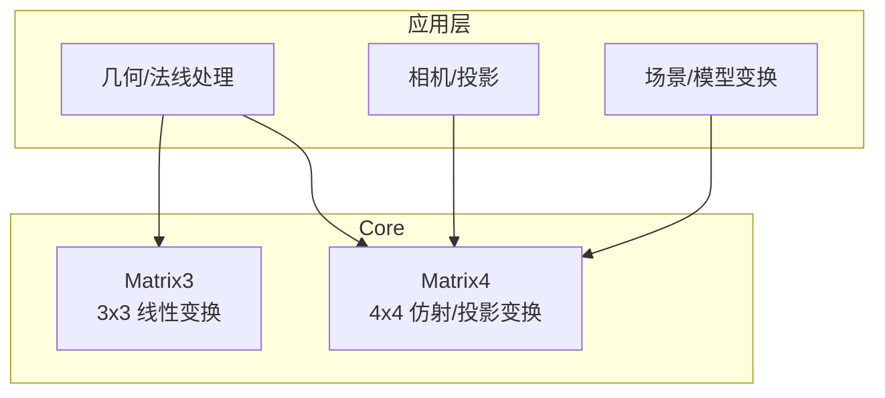
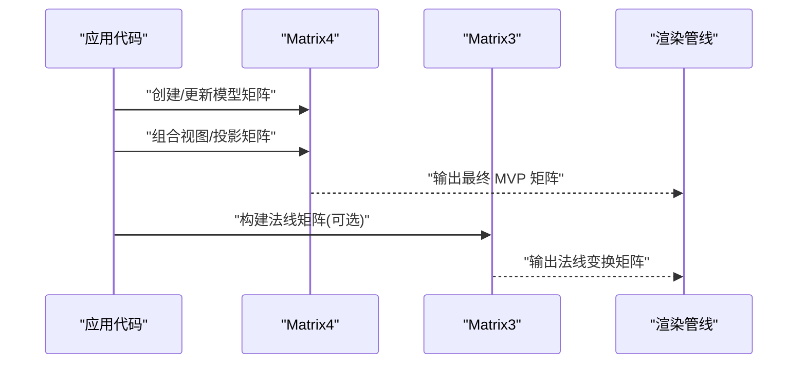
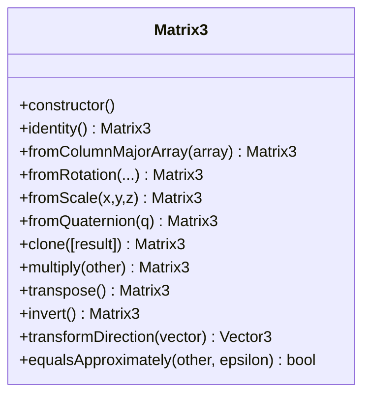
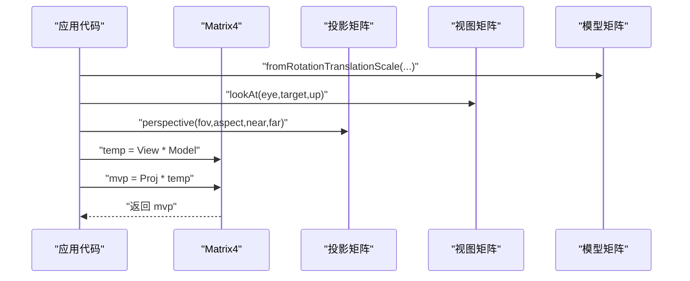
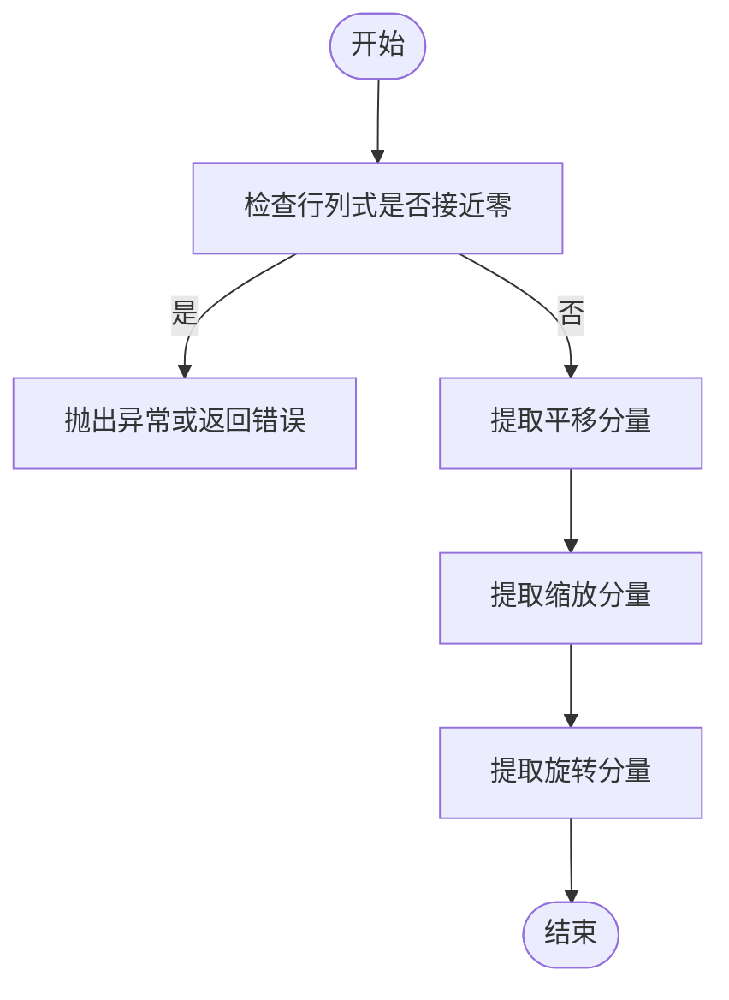

# 矩阵类API

<cite>
**本文引用的文件**   
- [Matrix3.js](file://Source/Core/Matrix3.js)
- [Matrix4.js](file://Source/Core/Matrix4.js)
</cite>

## 目录
1. [简介](#简介)
2. [项目结构](#项目结构)
3. [核心组件](#核心组件)
4. [架构总览](#架构总览)
5. [详细组件分析](#详细组件分析)
6. [依赖关系分析](#依赖关系分析)
7. [性能考量](#性能考量)
8. [故障排查指南](#故障排查指南)
9. [结论](#结论)
10. [附录](#附录)

## 简介
本文件为 Cesium 中 Matrix3 与 Matrix4 两个矩阵类的完整 API 文档。内容覆盖：
- 构造方法与静态工厂方法（如 identity、fromColumnMajorArray、fromRotationTranslationScale 等）
- 实例方法（如 multiply、transpose、invert、transformPoint 等）
- 矩阵在三维变换中的作用（旋转、缩放、平移、投影等）
- 参数说明、返回值类型与使用示例路径
- 在三维场景中正确使用矩阵进行坐标变换的实践建议

Matrix3 用于表示 3x3 线性变换（旋转、缩放、切变），常用于法线变换或局部方向计算；Matrix4 用于表示 4x4 仿射/投影变换，支持平移、旋转、缩放以及透视投影的组合与分解。

## 项目结构
Cesium 的矩阵实现位于 Source/Core 目录下，Matrix3 与 Matrix4 分别以独立模块提供，遵循一致的命名与行为约定，便于在渲染管线、几何处理与相机控制中复用。



图表来源
- [Matrix3.js](file://Source/Core/Matrix3.js)
- [Matrix4.js](file://Source/Core/Matrix4.js)

章节来源
- [Matrix3.js](file://Source/Core/Matrix3.js)
- [Matrix4.js](file://Source/Core/Matrix4.js)

## 核心组件
本节概述 Matrix3 与 Matrix4 的职责边界与常用能力：
- Matrix3
  - 表示 3x3 矩阵，适合表达纯线性变换（旋转、缩放、切变）。
  - 典型用途：将局部坐标系的方向向量或法线从模型空间变换到世界空间。
- Matrix4
  - 表示 4x4 矩阵，支持仿射变换（平移、旋转、缩放）与投影变换。
  - 典型用途：模型-视图-投影组合、相机变换、对象层级变换。

章节来源
- [Matrix3.js](file://Source/Core/Matrix3.js)
- [Matrix4.js](file://Source/Core/Matrix4.js)

## 架构总览
下图展示矩阵在三维图形管线中的位置与交互关系：



图表来源
- [Matrix4.js](file://Source/Core/Matrix4.js)
- [Matrix3.js](file://Source/Core/Matrix3.js)

## 详细组件分析

### Matrix3 类
Matrix3 提供 3x3 矩阵的构造、工厂方法与常见线性变换操作。

- 构造方法
  - 构造函数
    - 描述：初始化一个 3x3 矩阵，可传入列主序数组或直接设置元素。
    - 参数：列主序数组或各列元素（具体签名参见源码）。
    - 返回：Matrix3 实例。
    - 示例路径：[Matrix3.js](file://Source/Core/Matrix3.js)

- 静态工厂方法
  - identity
    - 描述：返回单位矩阵。
    - 参数：无。
    - 返回：Matrix3 实例。
    - 示例路径：[Matrix3.js](file://Source/Core/Matrix3.js)
  - fromColumnMajorArray
    - 描述：从列主序数组创建矩阵。
    - 参数：长度为 9 的数组。
    - 返回：Matrix3 实例。
    - 示例路径：[Matrix3.js](file://Source/Core/Matrix3.js)
  - fromRotation
    - 描述：根据欧拉角或轴角生成旋转矩阵。
    - 参数：角度或轴角信息。
    - 返回：Matrix3 实例。
    - 示例路径：[Matrix3.js](file://Source/Core/Matrix3.js)
  - fromScale
    - 描述：根据缩放分量生成对角缩放矩阵。
    - 参数：三个方向的缩放值。
    - 返回：Matrix3 实例。
    - 示例路径：[Matrix3.js](file://Source/Core/Matrix3.js)
  - fromQuaternion
    - 描述：由四元数生成旋转矩阵。
    - 参数：四元数。
    - 返回：Matrix3 实例。
    - 示例路径：[Matrix3.js](file://Source/Core/Matrix3.js)
  - clone
    - 描述：复制当前矩阵。
    - 参数：目标矩阵（可选，用于复用内存）。
    - 返回：Matrix3 实例。
    - 示例路径：[Matrix3.js](file://Source/Core/Matrix3.js)

- 实例方法
  - multiply
    - 描述：左乘另一个矩阵（this * other）。
    - 参数：Matrix3 实例。
    - 返回：Matrix3 实例（通常返回 this，以便链式调用）。
    - 示例路径：[Matrix3.js](file://Source/Core/Matrix3.js)
  - transpose
    - 描述：转置矩阵。
    - 参数：无。
    - 返回：Matrix3 实例（通常返回 this）。
    - 示例路径：[Matrix3.js](file://Source/Core/Matrix3.js)
  - invert
    - 描述：求逆矩阵。
    - 参数：无。
    - 返回：Matrix3 实例（通常返回 this）。
    - 注意：奇异矩阵不可逆。
    - 示例路径：[Matrix3.js](file://Source/Core/Matrix3.js)
  - transformDirection / transformVector
    - 描述：用矩阵变换方向向量或普通向量（不考虑平移）。
    - 参数：向量。
    - 返回：向量。
    - 示例路径：[Matrix3.js](file://Source/Core/Matrix3.js)
  - equalsApproximately
    - 描述：近似相等比较。
    - 参数：待比较矩阵与容差。
    - 返回：布尔。
    - 示例路径：[Matrix3.js](file://Source/Core/Matrix3.js)

- 使用要点
  - 法线变换：当模型矩阵包含非均匀缩放时，应使用法线矩阵（通常为模型矩阵左上 3x3 的逆转置）来正确变换法线。
  - 仅线性变换：Matrix3 不包含平移，适用于方向与法线的变换。

章节来源
- [Matrix3.js](file://Source/Core/Matrix3.js)

#### Matrix3 类图


图表来源
- [Matrix3.js](file://Source/Core/Matrix3.js)

### Matrix4 类
Matrix4 提供 4x4 矩阵的构造、工厂方法与完整的仿射/投影变换操作。

- 构造方法
  - 构造函数
    - 描述：初始化一个 4x4 矩阵，可传入列主序数组或直接设置元素。
    - 参数：列主序数组或各列元素（具体签名参见源码）。
    - 返回：Matrix4 实例。
    - 示例路径：[Matrix4.js](file://Source/Core/Matrix4.js)

- 静态工厂方法
  - identity
    - 描述：返回单位矩阵。
    - 参数：无。
    - 返回：Matrix4 实例。
    - 示例路径：[Matrix4.js](file://Source/Core/Matrix4.js)
  - fromColumnMajorArray
    - 描述：从列主序数组创建矩阵。
    - 参数：长度为 16 的数组。
    - 返回：Matrix4 实例。
    - 示例路径：[Matrix4.js](file://Source/Core/Matrix4.js)
  - fromRotationTranslationScale
    - 描述：由旋转、平移、缩放合成仿射矩阵。
    - 参数：旋转（四元数或旋转矩阵）、平移向量、缩放向量。
    - 返回：Matrix4 实例。
    - 示例路径：[Matrix4.js](file://Source/Core/Matrix4.js)
  - fromRotationTranslation
    - 描述：由旋转和平移合成仿射矩阵。
    - 参数：旋转（四元数或旋转矩阵）、平移向量。
    - 返回：Matrix4 实例。
    - 示例路径：[Matrix4.js](file://Source/Core/Matrix4.js)
  - fromTranslationScale
    - 描述：由平移和缩放合成仿射矩阵。
    - 参数：平移向量、缩放向量。
    - 返回：Matrix4 实例。
    - 示例路径：[Matrix4.js](file://Source/Core/Matrix4.js)
  - fromScale
    - 描述：由缩放生成对角矩阵。
    - 参数：三个方向的缩放值。
    - 返回：Matrix4 实例。
    - 示例路径：[Matrix4.js](file://Source/Core/Matrix4.js)
  - fromTranslation
    - 描述：由平移生成仿射矩阵。
    - 参数：平移向量。
    - 返回：Matrix4 实例。
    - 示例路径：[Matrix4.js](file://Source/Core/Matrix4.js)
  - fromQuaternion
    - 描述：由四元数生成旋转矩阵（左上 3x3）。
    - 参数：四元数。
    - 返回：Matrix4 实例。
    - 示例路径：[Matrix4.js](file://Source/Core/Matrix4.js)
  - perspective
    - 描述：创建透视投影矩阵。
    - 参数：视场角、宽高比、近裁剪面、远裁剪面等。
    - 返回：Matrix4 实例。
    - 示例路径：[Matrix4.js](file://Source/Core/Matrix4.js)
  - orthographic
    - 描述：创建正交投影矩阵。
    - 参数：左右上下前后裁剪面。
    - 返回：Matrix4 实例。
    - 示例路径：[Matrix4.js](file://Source/Core/Matrix4.js)
  - lookAt
    - 描述：创建视图矩阵（相机观察矩阵）。
    - 参数：相机位置、目标点、上方向。
    - 返回：Matrix4 实例。
    - 示例路径：[Matrix4.js](file://Source/Core/Matrix4.js)
  - clone
    - 描述：复制当前矩阵。
    - 参数：目标矩阵（可选，用于复用内存）。
    - 返回：Matrix4 实例。
    - 示例路径：[Matrix4.js](file://Source/Core/Matrix4.js)

- 实例方法
  - multiply
    - 描述：左乘另一个矩阵（this * other）。
    - 参数：Matrix4 实例。
    - 返回：Matrix4 实例（通常返回 this，以便链式调用）。
    - 示例路径：[Matrix4.js](file://Source/Core/Matrix4.js)
  - transpose
    - 描述：转置矩阵。
    - 参数：无。
    - 返回：Matrix4 实例（通常返回 this）。
    - 示例路径：[Matrix4.js](file://Source/Core/Matrix4.js)
  - invert
    - 描述：求逆矩阵。
    - 参数：无。
    - 返回：Matrix4 实例（通常返回 this）。
    - 注意：奇异矩阵不可逆。
    - 示例路径：[Matrix4.js](file://Source/Core/Matrix4.js)
  - transformPoint
    - 描述：用矩阵变换齐次点（考虑平移与透视除法）。
    - 参数：向量（x,y,z[,w]）。
    - 返回：向量。
    - 示例路径：[Matrix4.js](file://Source/Core/Matrix4.js)
  - transformDirection / transformVector
    - 描述：用矩阵变换方向向量或普通向量（忽略平移）。
    - 参数：向量。
    - 返回：向量。
    - 示例路径：[Matrix4.js](file://Source/Core/Matrix4.js)
  - decompose
    - 描述：分解出平移、旋转、缩放。
    - 参数：无。
    - 返回：{translation, rotation, scale}。
    - 示例路径：[Matrix4.js](file://Source/Core/Matrix4.js)
  - equalsApproximately
    - 描述：近似相等比较。
    - 参数：待比较矩阵与容差。
    - 返回：布尔。
    - 示例路径：[Matrix4.js](file://Source/Core/Matrix4.js)

- 使用要点
  - 组合顺序：通常按“缩放→旋转→平移”的顺序组合，对应于右乘顺序。
  - 投影与视图：先构造视图矩阵（lookAt），再构造投影矩阵（perspective/orthographic），最后与模型矩阵相乘得到 MVP。
  - 法线变换：若需对法线进行变换，建议使用 Matrix3 的逆转置或使用 Matrix4 的左上 3x3 子块并做相应处理。

章节来源
- [Matrix4.js](file://Source/Core/Matrix4.js)

#### Matrix4 类图
```mermaid
classDiagram
class Matrix4 {
+constructor()
+identity() Matrix4
+fromColumnMajorArray(array) Matrix4
+fromRotationTranslationScale(r,t,s) Matrix4
+fromRotationTranslation(r,t) Matrix4
+fromTranslationScale(t,s) Matrix4
+fromScale(s) Matrix4
+fromTranslation(t) Matrix4
+fromQuaternion(q) Matrix4
+perspective(...) Matrix4
+orthographic(...) Matrix4
+lookAt(eye,target,up) Matrix4
+clone([result]) Matrix4
+multiply(other) Matrix4
+transpose() Matrix4
+invert() Matrix4
+transformPoint(v) Vector4
+transformDirection(v) Vector3
+decompose() {translation,rotation,scale}
+equalsApproximately(other,epsilon) bool
}
```

图表来源
- [Matrix4.js](file://Source/Core/Matrix4.js)

#### 变换流程时序图（MVP 组合）


图表来源
- [Matrix4.js](file://Source/Core/Matrix4.js)

#### 算法流程图（分解：平移/旋转/缩放）


图表来源
- [Matrix4.js](file://Source/Core/Matrix4.js)

## 依赖关系分析
Matrix3 与 Matrix4 作为基础数学库，被上层渲染、几何与相机模块广泛依赖。二者之间通过接口契约协作：Matrix4 常提供 3x3 子块供 Matrix3 使用，或在需要时将 3x3 线性部分转换为 Matrix3 以进行法线变换。

```mermaid
graph LR
M3["Matrix3"]
M4["Matrix4"]
Scene["场景/模型"]
Camera["相机/投影"]
Geo["几何/法线"]
Scene --> M4
Camera --> M4
Geo --> M3
Geo --> M4
M4 --> M3 : "提取3x3子块"
```

图表来源
- [Matrix3.js](file://Source/Core/Matrix3.js)
- [Matrix4.js](file://Source/Core/Matrix4.js)

章节来源
- [Matrix3.js](file://Source/Core/Matrix3.js)
- [Matrix4.js](file://Source/Core/Matrix4.js)

## 性能考量
- 避免频繁分配：尽量复用结果矩阵（例如传递 result 参数），减少垃圾回收压力。
- 合理组合顺序：将不变的部分缓存（如视图/投影矩阵），仅在必要时更新模型矩阵。
- 数值稳定性：对接近奇异的矩阵求逆需谨慎，必要时加入容差判断。
- 批量变换：对大量顶点/法线，优先使用 GPU 着色器完成变换，CPU 侧仅维护矩阵。

## 故障排查指南
- 矩阵不可逆
  - 现象：invert 失败或返回异常。
  - 原因：行列式接近零（缩放为零或负无穷大等）。
  - 处理：检查缩放分量与变换序列，确保矩阵非奇异。
- 法线方向错误
  - 现象：光照不正确或背面可见。
  - 原因：使用了错误的变换矩阵（未使用逆转置或 3x3 子块）。
  - 处理：对法线使用 Matrix3 的逆转置或等价处理。
- 投影/视图矩阵参数错误
  - 现象：物体不可见或严重畸变。
  - 原因：near/far 设置不当、宽高比错误或 eye/target/up 不合法。
  - 处理：校验参数范围与合法性，打印中间矩阵辅助定位。

章节来源
- [Matrix3.js](file://Source/Core/Matrix3.js)
- [Matrix4.js](file://Source/Core/Matrix4.js)

## 结论
Matrix3 与 Matrix4 是 Cesium 三维变换的核心基石。掌握其构造方式、静态工厂方法与关键实例方法，有助于在复杂场景中高效、正确地组织变换与投影。结合本文提供的流程图与时序图，可在实际工程中快速定位问题并优化性能。

## 附录
- 术语
  - 列主序：矩阵数据在内存中以列优先排列。
  - 仿射变换：包含平移、旋转、缩放的线性变换。
  - 投影变换：将三维空间映射到二维屏幕空间的变换。
- 参考路径
  - Matrix3 全部接口定义与实现：[Matrix3.js](file://Source/Core/Matrix3.js)
  - Matrix4 全部接口定义与实现：[Matrix4.js](file://Source/Core/Matrix4.js)