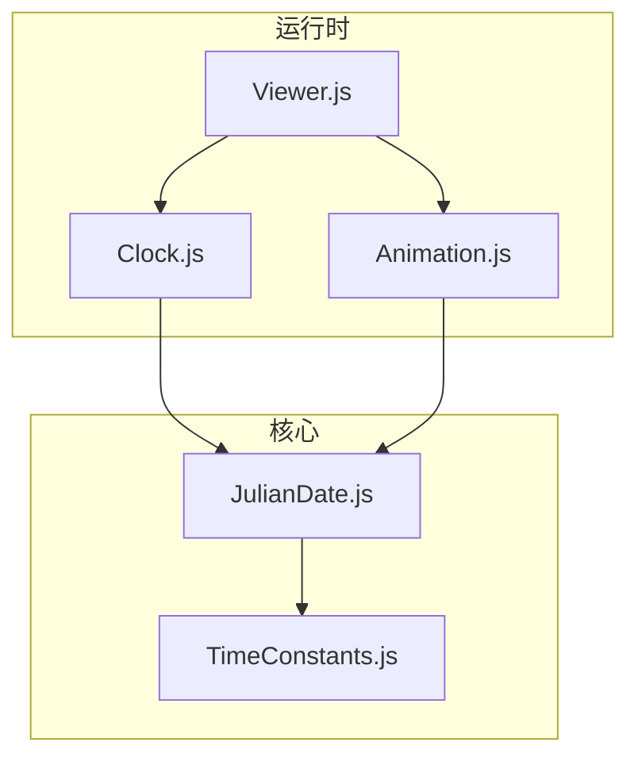
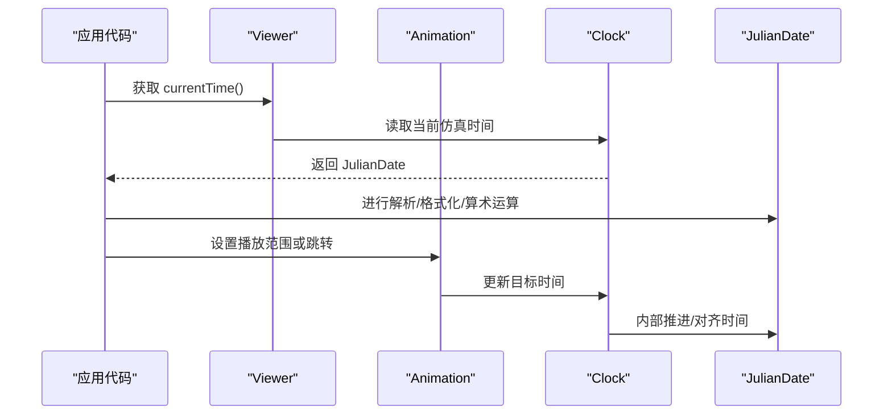
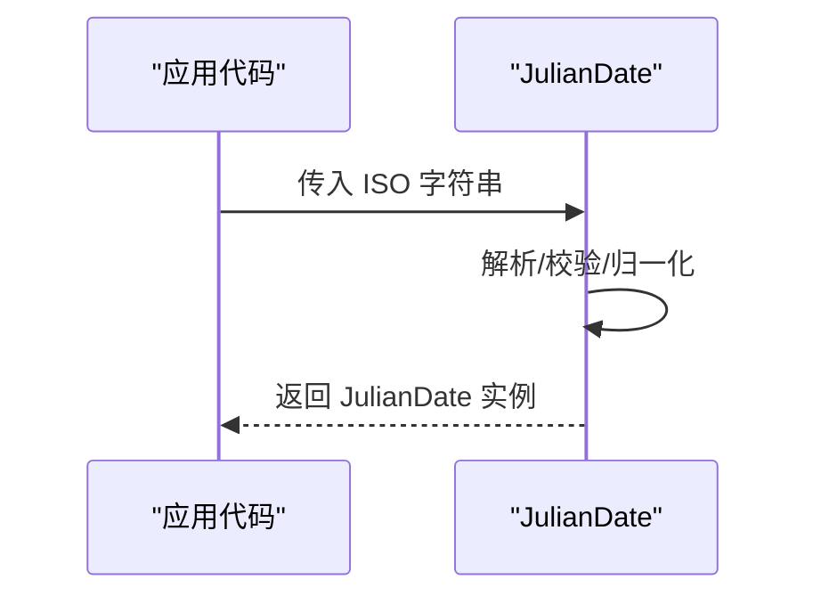
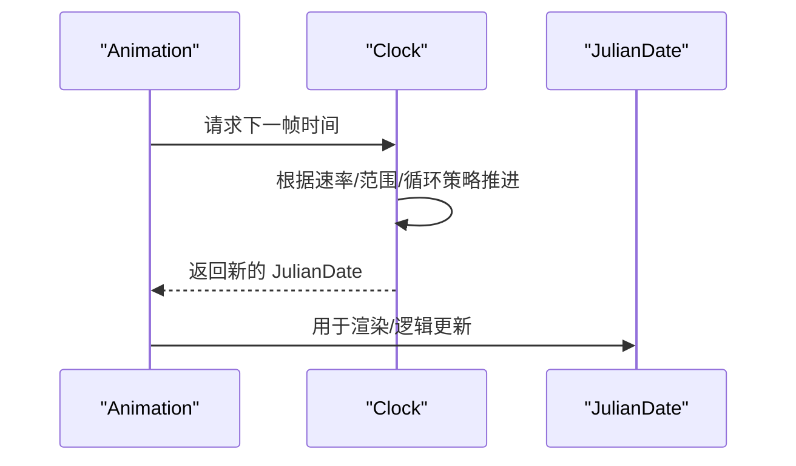
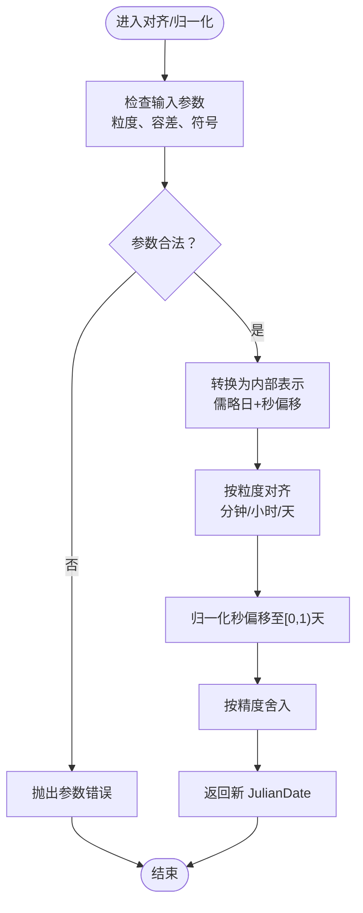
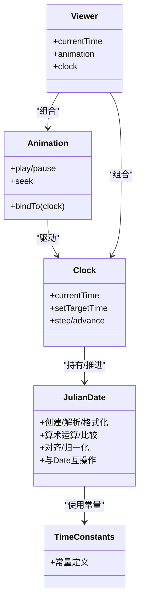

# JulianDate儒略日期类

<cite>
**本文引用的文件**   
- [JulianDate.js](file://Source/Core/JulianDate.js)
- [TimeConstants.js](file://Source/Core/TimeConstants.js)
- [Clock.js](file://Source/Scene/Clock.js)
- [Animation.js](file://Source/Widgets/Animation/Animation.js)
- [Viewer.js](file://Source/Widgets/Viewer/Viewer.js)
</cite>

## 目录
1. [简介](#简介)
2. [项目结构](#项目结构)
3. [核心组件](#核心组件)
4. [架构总览](#架构总览)
5. [详细组件分析](#详细组件分析)
6. [依赖关系分析](#依赖关系分析)
7. [性能考虑](#性能考虑)
8. [故障排查指南](#故障排查指南)
9. [结论](#结论)
10. [附录](#附录)

## 简介
本文件为 Cesium 中 JulianDate 类的权威 API 文档与使用指南。内容涵盖：
- 儒略日期的概念与在 Cesium 中的实现要点
- 创建方式（Unix 时间戳、ISO 字符串、组件值等）
- 解析与格式化能力
- 算术运算（加减天数、小时、分钟、秒等）
- 时区处理、日历系统转换、精度控制
- 与 JavaScript 原生 Date 的互操作
- 与 Cesium 其他时间相关组件（Clock、Animation、Viewer）的集成方法
- 动画时间轴与历史数据回放等典型场景的实践建议

## 项目结构
Cesium 的时间核心位于 Source/Core 目录，其中 JulianDate 是时间表示的基础类型；TimeConstants 提供常量；上层 UI 与运行时通过 Clock、Animation、Viewer 等组件消费 JulianDate。

图表来源
- [JulianDate.js](file://Source/Core/JulianDate.js)
- [TimeConstants.js](file://Source/Core/TimeConstants.js)
- [Clock.js](file://Source/Scene/Clock.js)
- [Animation.js](file://Source/Widgets/Animation/Animation.js)
- [Viewer.js](file://Source/Widgets/Viewer/Viewer.js)

章节来源
- [JulianDate.js](file://Source/Core/JulianDate.js)
- [TimeConstants.js](file://Source/Core/TimeConstants.js)
- [Clock.js](file://Source/Scene/Clock.js)
- [Animation.js](file://Source/Widgets/Animation/Animation.js)
- [Viewer.js](file://Source/Widgets/Viewer/Viewer.js)

## 核心组件
- JulianDate：以儒略日数与秒偏移表示时间点，支持高精度时间计算与比较。
- TimeConstants：定义常用时间常量（如秒/分/时/天换算、儒略历基准等）。
- Clock：驱动仿真时钟，输出当前 JulianDate，并支持速率、范围、循环等。
- Animation：UI 控件，绑定到 Clock，提供播放/暂停/快进/拖拽等交互。
- Viewer：高层容器，默认包含 Clock 与 Animation，暴露 currentTime 等属性。

章节来源
- [JulianDate.js](file://Source/Core/JulianDate.js)
- [TimeConstants.js](file://Source/Core/TimeConstants.js)
- [Clock.js](file://Source/Scene/Clock.js)
- [Animation.js](file://Source/Widgets/Animation/Animation.js)
- [Viewer.js](file://Source/Widgets/Viewer/Viewer.js)

## 架构总览
下图展示从应用层到时间核心的调用链与数据流。

图表来源
- [Viewer.js](file://Source/Widgets/Viewer/Viewer.js)
- [Animation.js](file://Source/Widgets/Animation/Animation.js)
- [Clock.js](file://Source/Scene/Clock.js)
- [JulianDate.js](file://Source/Core/JulianDate.js)

## 详细组件分析

### JulianDate 类概览
- 设计目标：以统一的高精度时间单位表达任意时刻，避免浮点误差累积，便于跨平台一致性与长时间跨度计算。
- 内部表示：由“儒略日整数部分”和“当日秒偏移”两部分组成，结合常量进行换算与归一化。
- 不可变性：多数运算返回新实例，避免副作用。

章节来源
- [JulianDate.js](file://Source/Core/JulianDate.js)

#### 创建与构造
- 从 Unix 时间戳（毫秒）创建
- 从 ISO 8601 字符串解析
- 从公历组件（年、月、日、时、分、秒、毫秒）构建
- 复制现有实例
- 使用工厂方法（例如“现在”、“最小/最大可表示时间”等）

说明：
- 输入校验与边界处理在解析阶段完成，非法输入将抛出异常或返回无效对象（取决于具体 API）。
- 对于 ISO 字符串，支持标准格式与时区信息；若未指定时区，按 UTC 处理。

章节来源
- [JulianDate.js](file://Source/Core/JulianDate.js)

#### 解析与格式化
- 解析：
  - 支持 ISO 8601 字符串
  - 支持常见时间戳格式（毫秒级）
- 格式化：
  - 输出 ISO 8601 字符串
  - 输出人类可读字符串（可选精度）
  - 输出数值形式（儒略日数、当日秒偏移）

注意：
- 格式化精度可通过参数控制，影响显示位数与舍入策略。
- 解析失败应捕获异常并进行降级处理。

章节来源
- [JulianDate.js](file://Source/Core/JulianDate.js)

#### 算术运算
- 加法/减法：天、小时、分钟、秒、毫秒
- 比较：早于、晚于、等于、差值（秒）
- 取整/对齐：按分钟、小时、天等粒度对齐
- 插值：在两个时间点之间线性插值

复杂度与稳定性：
- 算术运算基于整数日与浮点秒的组合，尽量保持数值稳定。
- 大范围时间跨度下建议使用相对增量而非绝对累加，以减少误差。

章节来源
- [JulianDate.js](file://Source/Core/JulianDate.js)

#### 时区与日历系统
- 时区：
  - 输入/输出均支持 ISO 8601 时区偏移
  - 内部以 UTC 存储，对外可按需转换
- 日历系统：
  - 主要面向公历（格里高利历）
  - 提供与公历组件之间的转换工具

章节来源
- [JulianDate.js](file://Source/Core/JulianDate.js)

#### 精度控制
- 控制项：
  - 格式化时的有效数字/小数位
  - 对齐粒度的选择
  - 比较时的容差阈值
- 建议：
  - 渲染/UI 显示保留合理精度
  - 物理/轨道计算使用更高精度

章节来源
- [JulianDate.js](file://Source/Core/JulianDate.js)

#### 与 JavaScript Date 的互操作
- 从 Date 创建 JulianDate
- 将 JulianDate 转换为 Date
- 注意事项：
  - Date 精度为毫秒，存在浮点误差
  - 长时间跨度或高频更新场景优先使用 JulianDate

章节来源
- [JulianDate.js](file://Source/Core/JulianDate.js)

#### 与其他时间组件的集成
- 与 Clock：
  - Clock 维护当前仿真时间（JulianDate），并提供步进、速率、范围控制
- 与 Animation：
  - Animation 绑定到 Clock，提供用户交互驱动的播放控制
- 与 Viewer：
  - Viewer 暴露 currentTime 等便捷接口，内部委托给 Clock

章节来源
- [Clock.js](file://Source/Scene/Clock.js)
- [Animation.js](file://Source/Widgets/Animation/Animation.js)
- [Viewer.js](file://Source/Widgets/Viewer/Viewer.js)

### 关键流程时序图

#### 从 ISO 字符串创建 JulianDate

图表来源
- [JulianDate.js](file://Source/Core/JulianDate.js)

#### 动画时间轴推进

图表来源
- [Animation.js](file://Source/Widgets/Animation/Animation.js)
- [Clock.js](file://Source/Scene/Clock.js)
- [JulianDate.js](file://Source/Core/JulianDate.js)

### 算法流程图：对齐与归一化

图表来源
- [JulianDate.js](file://Source/Core/JulianDate.js)

## 依赖关系分析
- JulianDate 依赖 TimeConstants 提供的换算常量与基准值。
- Clock 依赖 JulianDate 作为时间载体，负责推进与约束。
- Animation 依赖 Clock 的当前时间，提供交互控制。
- Viewer 组合上述组件，暴露高层 API。

图表来源
- [TimeConstants.js](file://Source/Core/TimeConstants.js)
- [JulianDate.js](file://Source/Core/JulianDate.js)
- [Clock.js](file://Source/Scene/Clock.js)
- [Animation.js](file://Source/Widgets/Animation/Animation.js)
- [Viewer.js](file://Source/Widgets/Viewer/Viewer.js)

章节来源
- [TimeConstants.js](file://Source/Core/TimeConstants.js)
- [JulianDate.js](file://Source/Core/JulianDate.js)
- [Clock.js](file://Source/Scene/Clock.js)
- [Animation.js](file://Source/Widgets/Animation/Animation.js)
- [Viewer.js](file://Source/Widgets/Viewer/Viewer.js)

## 性能考虑
- 避免频繁创建大量临时对象：复用 JulianDate 实例或在必要时使用池化策略。
- 批量计算：对大量时间点的排序/比较/对齐，优先使用原地比较与批量处理。
- 精度与开销权衡：显示层降低精度，计算层保持高精度。
- 时间推进：使用 Clock 的步进机制，避免每帧手动计算。

## 故障排查指南
- 解析失败：
  - 现象：传入 ISO 字符串或时间戳后抛出异常
  - 排查：确认格式是否符合 ISO 8601；检查时区偏移是否合法；验证数值范围
- 精度问题：
  - 现象：长时间跨度后出现微小偏差
  - 排查：改用相对增量推进；减少不必要的中间转换；提高对齐粒度
- 与 Date 互操作：
  - 现象：与 Date 互相转换后出现毫秒级抖动
  - 排查：仅在必要边界进行转换；内部计算全程使用 JulianDate
- 动画不同步：
  - 现象：Animation 与 Clock 状态不一致
  - 排查：确保只通过 Clock 更新 currentTime；避免直接修改底层时间

章节来源
- [JulianDate.js](file://Source/Core/JulianDate.js)
- [Clock.js](file://Source/Scene/Clock.js)
- [Animation.js](file://Source/Widgets/Animation/Animation.js)

## 结论
JulianDate 为 Cesium 提供了高精度、稳定的时间基础。配合 Clock 与 Animation，可实现从简单时间显示到复杂动画时间轴的完整能力。开发者应在业务层尽量围绕 JulianDate 进行设计与优化，谨慎处理与 Date 的边界转换，以获得最佳的一致性与性能表现。

## 附录

### 常见用法清单（路径指引）
- 从 Unix 时间戳创建：参见 JulianDate 的相应工厂方法
- 从 ISO 字符串解析：参见 JulianDate 的解析方法
- 从组件值构建：参见 JulianDate 的组件构造函数
- 格式化输出：参见 JulianDate 的格式化方法
- 算术运算：参见 JulianDate 的加减/比较/差值方法
- 与 Date 互操作：参见 JulianDate 的转换方法
- 与 Clock 集成：参见 Clock 的 currentTime/step 等方法
- 与 Animation 集成：参见 Animation 的 play/pause/seek 等方法
- 与 Viewer 集成：参见 Viewer 的 currentTime 与 animation/clock 属性

章节来源
- [JulianDate.js](file://Source/Core/JulianDate.js)
- [Clock.js](file://Source/Scene/Clock.js)
- [Animation.js](file://Source/Widgets/Animation/Animation.js)
- [Viewer.js](file://Source/Widgets/Viewer/Viewer.js)