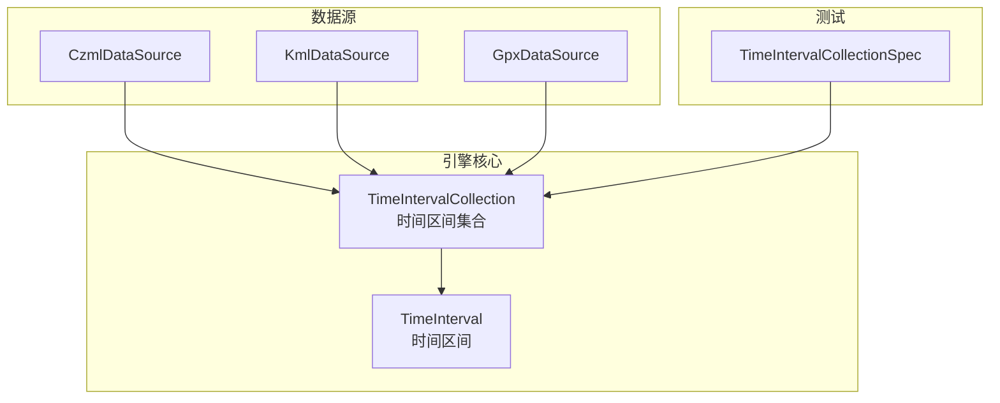
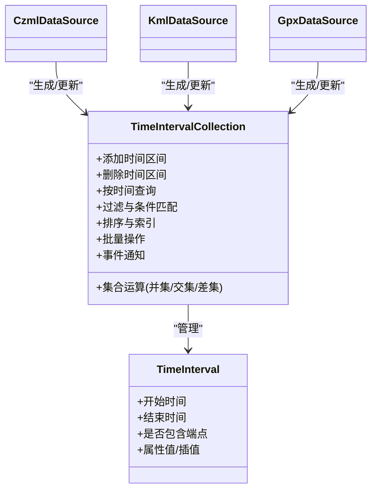
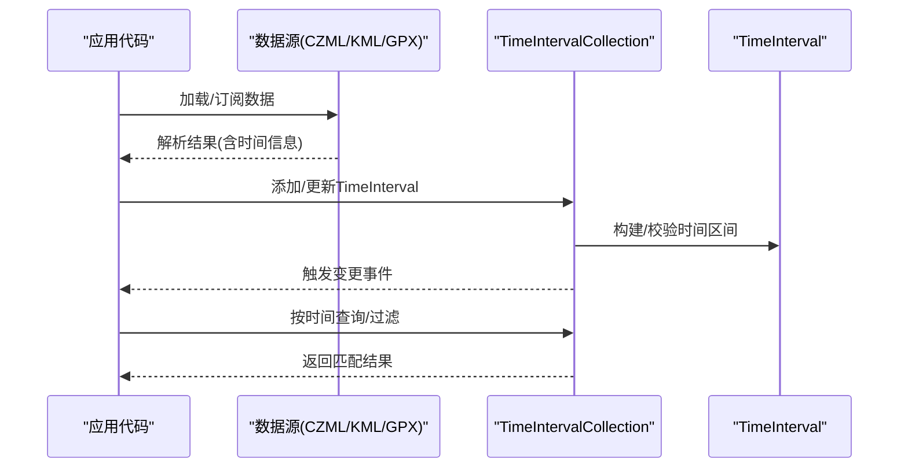
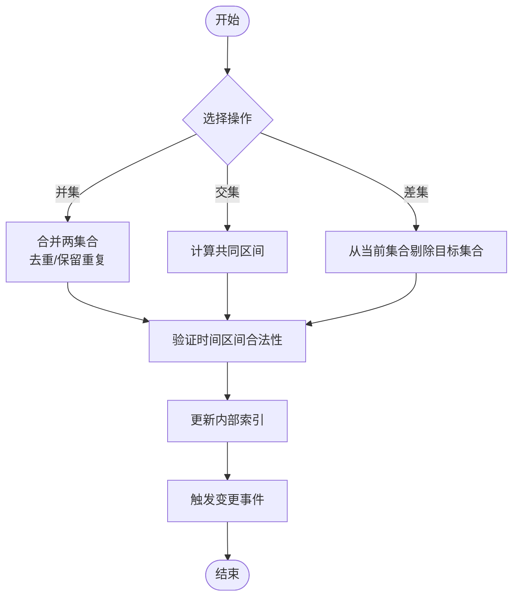
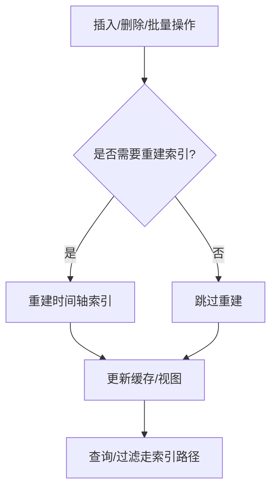
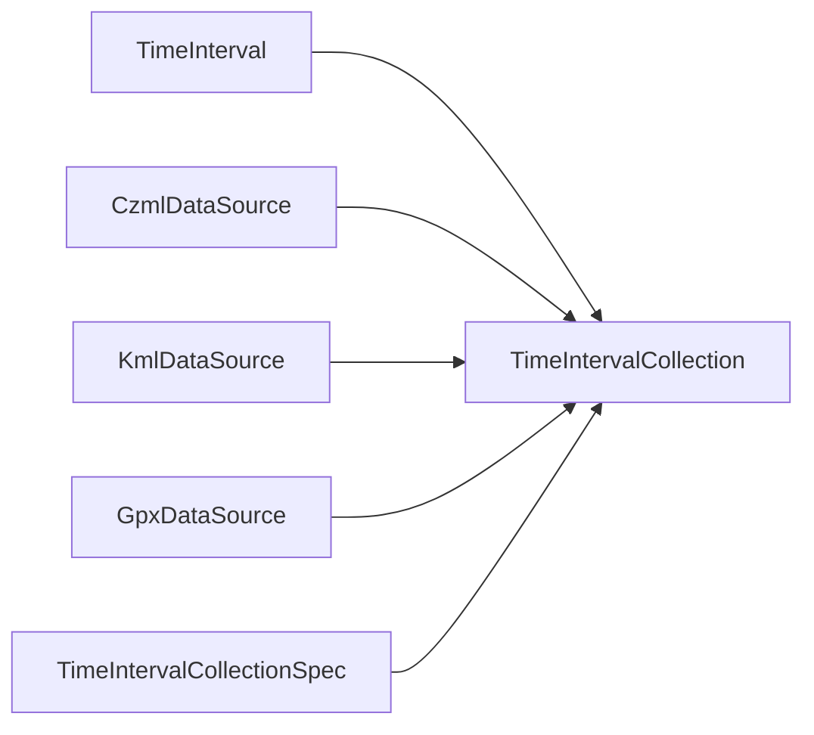

# TimeIntervalCollection时间区间集合

<cite>
**本文档引用的文件**   
- [packages/engine/src/Core/TimeIntervalCollection.js](file://packages/engine/src/Core/TimeIntervalCollection.js)
- [packages/engine/src/Core/TimeInterval.js](file://packages/engine/src/Core/TimeInterval.js)
- [packages/engine/src/DataSources/CzmlDataSource.js](file://packages/engine/src/DataSources/CzmlDataSource.js)
- [packages/engine/src/DataSources/KmlDataSource.js](file://packages/engine/src/DataSources/KmlDataSource.js)
- [packages/engine/src/DataSources/GpxDataSource.js](file://packages/engine/src/DataSources/GpxDataSource.js)
- [Specs/Core/TimeIntervalCollectionSpec.js](file://Specs/Core/TimeIntervalCollectionSpec.js)
</cite>

## 目录
1. [简介](#简介)
2. [项目结构](#项目结构)
3. [核心组件](#核心组件)
4. [架构总览](#架构总览)
5. [详细组件分析](#详细组件分析)
6. [依赖分析](#依赖分析)
7. [性能考虑](#性能考虑)
8. [故障排查指南](#故障排查指南)
9. [结论](#结论)
10. [附录](#附录)

## 简介
TimeIntervalCollection是Cesium中用于管理“时间区间”的集合类型，广泛用于表示随时间变化的数据（如轨迹、属性动画、可见性开关等）。它提供高效的添加、删除、查询、过滤、合并、交集与差集等操作，并与Cesium的数据源（CZML、KML、GPX等）深度集成，支撑动态数据更新与时序数据处理。

在Cesium中，TimeIntervalCollection通常与TimeInterval配合使用：
- TimeInterval：定义一个时间区间的起止时间与可选的属性值。
- TimeIntervalCollection：维护一组TimeInterval，并提供集合级操作与查询接口。

该文档面向开发者，系统讲解TimeIntervalCollection的概念、API、用法模式、与数据源的集成方式以及大数据量场景下的最佳实践与性能优化策略。

## 项目结构
本仓库采用多包结构，核心引擎位于packages/engine，示例与应用位于Apps，测试用例位于Specs。TimeIntervalCollection的实现位于Core模块，相关数据源实现位于DataSources模块，单元测试位于Specs/Core。

图表来源
- [packages/engine/src/Core/TimeIntervalCollection.js](file://packages/engine/src/Core/TimeIntervalCollection.js)
- [packages/engine/src/Core/TimeInterval.js](file://packages/engine/src/Core/TimeInterval.js)
- [packages/engine/src/DataSources/CzmlDataSource.js](file://packages/engine/src/DataSources/CzmlDataSource.js)
- [packages/engine/src/DataSources/KmlDataSource.js](file://packages/engine/src/DataSources/KmlDataSource.js)
- [packages/engine/src/DataSources/GpxDataSource.js](file://packages/engine/src/DataSources/GpxDataSource.js)
- [Specs/Core/TimeIntervalCollectionSpec.js](file://Specs/Core/TimeIntervalCollectionSpec.js)

章节来源
- [packages/engine/src/Core/TimeIntervalCollection.js](file://packages/engine/src/Core/TimeIntervalCollection.js)
- [packages/engine/src/Core/TimeInterval.js](file://packages/engine/src/Core/TimeInterval.js)
- [packages/engine/src/DataSources/CzmlDataSource.js](file://packages/engine/src/DataSources/CzmlDataSource.js)
- [packages/engine/src/DataSources/KmlDataSource.js](file://packages/engine/src/DataSources/KmlDataSource.js)
- [packages/engine/src/DataSources/GpxDataSource.js](file://packages/engine/src/DataSources/GpxDataSource.js)
- [Specs/Core/TimeIntervalCollectionSpec.js](file://Specs/Core/TimeIntervalCollectionSpec.js)

## 核心组件
- TimeIntervalCollection：时间区间集合，支持增删改查、过滤、排序、索引、批量操作、集合运算（并集、交集、差集）、事件通知等。
- TimeInterval：时间区间对象，包含起始时间、结束时间、是否包含端点、以及可选的属性值或插值信息。

典型职责划分：
- TimeInterval负责“单个时间片”的语义与边界处理。
- TimeIntervalCollection负责“多个时间片”的组织、检索与集合运算。

章节来源
- [packages/engine/src/Core/TimeIntervalCollection.js](file://packages/engine/src/Core/TimeIntervalCollection.js)
- [packages/engine/src/Core/TimeInterval.js](file://packages/engine/src/Core/TimeInterval.js)

## 架构总览
下图展示了TimeIntervalCollection在Cesium中的位置及其与数据源和测试的关系。

图表来源
- [packages/engine/src/Core/TimeIntervalCollection.js](file://packages/engine/src/Core/TimeIntervalCollection.js)
- [packages/engine/src/Core/TimeInterval.js](file://packages/engine/src/Core/TimeInterval.js)
- [packages/engine/src/DataSources/CzmlDataSource.js](file://packages/engine/src/DataSources/CzmlDataSource.js)
- [packages/engine/src/DataSources/KmlDataSource.js](file://packages/engine/src/DataSources/KmlDataSource.js)
- [packages/engine/src/DataSources/GpxDataSource.js](file://packages/engine/src/DataSources/GpxDataSource.js)

## 详细组件分析

### TimeIntervalCollection API概览
- 创建与管理
  - 构造：支持空集合或从已有数组初始化。
  - 添加：插入单个或批量时间区间；可指定是否允许重叠及冲突处理策略。
  - 删除：按对象引用、时间范围或条件移除。
  - 清空：一次性清除所有元素。
- 查询与过滤
  - 按时间查找：返回指定时刻覆盖的时间区间集合。
  - 条件过滤：基于属性或自定义谓词筛选。
  - 存在性与计数：判断是否存在某区间、统计数量。
- 排序与索引
  - 排序：按开始时间、结束时间或自定义比较器排序。
  - 索引：内部维护时间轴索引以加速按时间查询。
- 批量操作
  - 批量添加/删除：减少多次调用开销。
  - 批量更新：对满足条件的区间进行统一修改。
- 集合运算
  - 并集：合并两个集合（去重/保留重复取决于策略）。
  - 交集：返回同时存在于两个集合的区间。
  - 差集：返回属于当前集合但不属于目标集合的区间。
- 事件与变更通知
  - 监听集合变化事件，便于UI或渲染管线响应。

章节来源
- [packages/engine/src/Core/TimeIntervalCollection.js](file://packages/engine/src/Core/TimeIntervalCollection.js)
- [Specs/Core/TimeIntervalCollectionSpec.js](file://Specs/Core/TimeIntervalCollectionSpec.js)

### TimeInterval概念与约束
- 时间区间必须满足开始时间小于等于结束时间。
- 可选择是否包含端点，影响边界判定。
- 可与属性值绑定，用于插值或状态切换。
- 建议避免过度重叠，必要时启用去重或合并策略。

章节来源
- [packages/engine/src/Core/TimeInterval.js](file://packages/engine/src/Core/TimeInterval.js)

### 与Cesium数据源的集成
- CZML数据源
  - 解析CZML中的时间线描述，生成TimeIntervalCollection。
  - 支持增量更新与差异应用，减少重建成本。
- KML数据源
  - 将KML中的时间戳与时间范围转换为时间区间集合。
  - 支持时态要素的可见性与属性动画。
- GPX数据源
  - 将轨迹点的时间序列转换为时间区间集合，驱动路径动画。

图表来源
- [packages/engine/src/DataSources/CzmlDataSource.js](file://packages/engine/src/DataSources/CzmlDataSource.js)
- [packages/engine/src/DataSources/KmlDataSource.js](file://packages/engine/src/DataSources/KmlDataSource.js)
- [packages/engine/src/DataSources/GpxDataSource.js](file://packages/engine/src/DataSources/GpxDataSource.js)
- [packages/engine/src/Core/TimeIntervalCollection.js](file://packages/engine/src/Core/TimeIntervalCollection.js)
- [packages/engine/src/Core/TimeInterval.js](file://packages/engine/src/Core/TimeInterval.js)

章节来源
- [packages/engine/src/DataSources/CzmlDataSource.js](file://packages/engine/src/DataSources/CzmlDataSource.js)
- [packages/engine/src/DataSources/KmlDataSource.js](file://packages/engine/src/DataSources/KmlDataSource.js)
- [packages/engine/src/DataSources/GpxDataSource.js](file://packages/engine/src/DataSources/GpxDataSource.js)

### 高级集合操作流程
- 并集：合并两集合，去重策略由配置决定（例如按时间区间完全相同视为重复）。
- 交集：仅保留同时出现在两个集合的区间。
- 差集：从当前集合剔除目标集合中的区间。

图表来源
- [packages/engine/src/Core/TimeIntervalCollection.js](file://packages/engine/src/Core/TimeIntervalCollection.js)

章节来源
- [packages/engine/src/Core/TimeIntervalCollection.js](file://packages/engine/src/Core/TimeIntervalCollection.js)

### 排序与索引机制
- 排序
  - 默认按开始时间升序，也可自定义比较器。
  - 排序后重新建立时间轴索引，提升查询效率。
- 索引
  - 内部维护时间轴索引（如区间树或分段表），支持O(log n)级别的时间点查询。
  - 批量操作后惰性更新索引，降低频繁插入/删除的开销。

图表来源
- [packages/engine/src/Core/TimeIntervalCollection.js](file://packages/engine/src/Core/TimeIntervalCollection.js)

章节来源
- [packages/engine/src/Core/TimeIntervalCollection.js](file://packages/engine/src/Core/TimeIntervalCollection.js)

### 批量操作方法
- 批量添加：传入TimeInterval数组，内部进行去重与冲突检测。
- 批量删除：按时间范围或条件批量移除。
- 批量更新：对符合条件的区间进行属性或时间调整。
- 事务式更新：支持在单次操作中组合多种变更，最后统一提交并触发事件。

章节来源
- [packages/engine/src/Core/TimeIntervalCollection.js](file://packages/engine/src/Core/TimeIntervalCollection.js)
- [Specs/Core/TimeIntervalCollectionSpec.js](file://Specs/Core/TimeIntervalCollectionSpec.js)

### 与动态数据更新、时间序列处理的结合
- 动态更新
  - 数据源推送增量更新时，优先使用批量更新接口，避免频繁重建。
  - 利用事件回调刷新渲染或UI。
- 时间序列处理
  - 将离散采样点聚合为连续时间区间，便于插值与平滑。
  - 通过过滤与交集操作提取特定时间段的数据子集。

章节来源
- [packages/engine/src/DataSources/CzmlDataSource.js](file://packages/engine/src/DataSources/CzmlDataSource.js)
- [packages/engine/src/DataSources/KmlDataSource.js](file://packages/engine/src/DataSources/KmlDataSource.js)
- [packages/engine/src/DataSources/GpxDataSource.js](file://packages/engine/src/DataSources/GpxDataSource.js)
- [packages/engine/src/Core/TimeIntervalCollection.js](file://packages/engine/src/Core/TimeIntervalCollection.js)

## 依赖分析
- 内部依赖
  - TimeIntervalCollection依赖TimeInterval进行时间区间建模。
  - 内部数据结构可能包含时间轴索引、去重映射、事件总线等。
- 外部依赖
  - 数据源模块（CZML/KML/GPX）生成并注入TimeIntervalCollection。
  - 测试模块验证API行为与边界情况。

图表来源
- [packages/engine/src/Core/TimeIntervalCollection.js](file://packages/engine/src/Core/TimeIntervalCollection.js)
- [packages/engine/src/Core/TimeInterval.js](file://packages/engine/src/Core/TimeInterval.js)
- [packages/engine/src/DataSources/CzmlDataSource.js](file://packages/engine/src/DataSources/CzmlDataSource.js)
- [packages/engine/src/DataSources/KmlDataSource.js](file://packages/engine/src/DataSources/KmlDataSource.js)
- [packages/engine/src/DataSources/GpxDataSource.js](file://packages/engine/src/DataSources/GpxDataSource.js)
- [Specs/Core/TimeIntervalCollectionSpec.js](file://Specs/Core/TimeIntervalCollectionSpec.js)

章节来源
- [packages/engine/src/Core/TimeIntervalCollection.js](file://packages/engine/src/Core/TimeIntervalCollection.js)
- [packages/engine/src/Core/TimeInterval.js](file://packages/engine/src/Core/TimeInterval.js)
- [packages/engine/src/DataSources/CzmlDataSource.js](file://packages/engine/src/DataSources/CzmlDataSource.js)
- [packages/engine/src/DataSources/KmlDataSource.js](file://packages/engine/src/DataSources/KmlDataSource.js)
- [packages/engine/src/DataSources/GpxDataSource.js](file://packages/engine/src/DataSources/GpxDataSource.js)
- [Specs/Core/TimeIntervalCollectionSpec.js](file://Specs/Core/TimeIntervalCollectionSpec.js)

## 性能考虑
- 大数据量处理
  - 使用批量接口减少函数调用与索引重建次数。
  - 合理设置去重与合并策略，避免过多重叠区间。
  - 按需重建索引，避免每次操作都触发全量重建。
- 查询优化
  - 利用时间轴索引进行快速定位，避免线性扫描。
  - 过滤条件尽量早剪枝，减少后续计算。
- 内存与GC
  - 复用TimeInterval对象，减少频繁分配。
  - 及时释放不再使用的集合或区间，避免内存泄漏。
- 并发与线程
  - 若涉及异步数据流，确保对集合的写入串行化，避免竞态条件。
  - 在Web Worker中预处理数据，主线程只负责消费与渲染。

[本节为通用指导，不直接分析具体文件]

## 故障排查指南
- 常见问题
  - 时间区间非法：开始时间大于结束时间或未闭合区间导致查询异常。
  - 重叠冲突：未配置去重策略导致查询结果不稳定。
  - 索引不一致：批量操作后未正确更新索引，造成查询结果错误。
  - 事件风暴：高频更新引发大量事件，阻塞主线程。
- 排查步骤
  - 检查TimeInterval的边界与端点设置。
  - 确认集合的去重与合并策略是否符合预期。
  - 在批量操作后显式触发索引重建或等待惰性更新完成。
  - 节流事件回调，合并多次变更再刷新。

章节来源
- [Specs/Core/TimeIntervalCollectionSpec.js](file://Specs/Core/TimeIntervalCollectionSpec.js)
- [packages/engine/src/Core/TimeIntervalCollection.js](file://packages/engine/src/Core/TimeIntervalCollection.js)

## 结论
TimeIntervalCollection为Cesium提供了强大的时间区间管理能力，适用于动态数据与时序数据的可视化与分析。通过合理的API使用、批量操作与索引优化，可以在大数据量场景下保持高性能与稳定性。与CZML/KML/GPX数据源的深度集成，使得开发者能够便捷地构建丰富的时间维度交互体验。

[本节为总结，不直接分析具体文件]

## 附录
- 最佳实践清单
  - 优先使用批量接口进行增删改。
  - 明确去重与合并策略，避免歧义。
  - 利用过滤与交集缩小数据集规模。
  - 监控事件频率，避免主线程阻塞。
  - 定期清理无用区间，控制内存占用。
- 参考用例
  - 轨迹回放：将GPS采样点聚合为时间区间，驱动路径动画。
  - 属性动画：用时间区间表达材质、颜色、透明度等属性的变化。
  - 可见性控制：根据时间段显示/隐藏图层或要素。

[本节为补充内容，不直接分析具体文件]