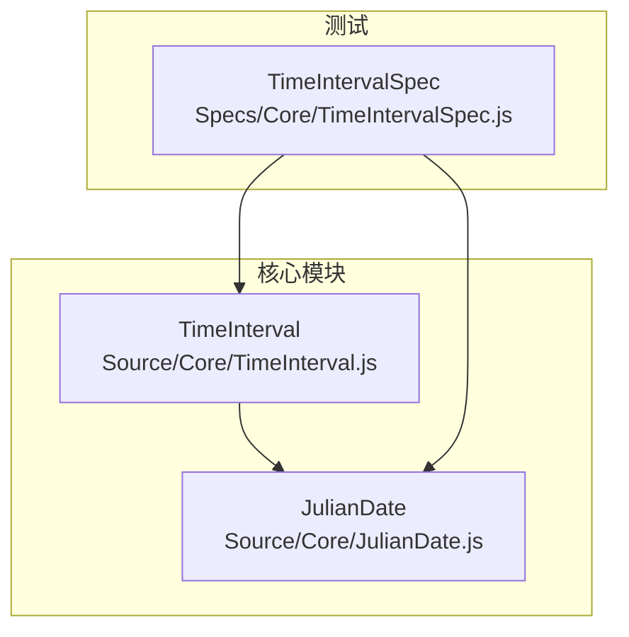
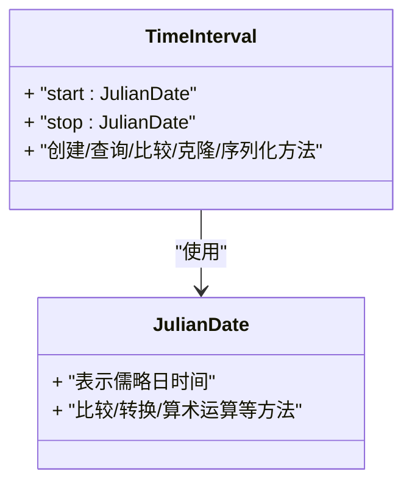
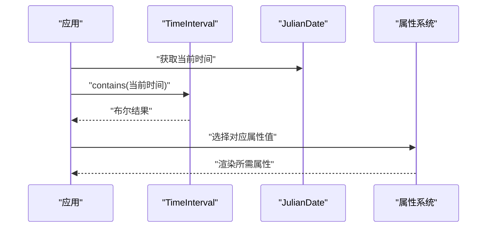
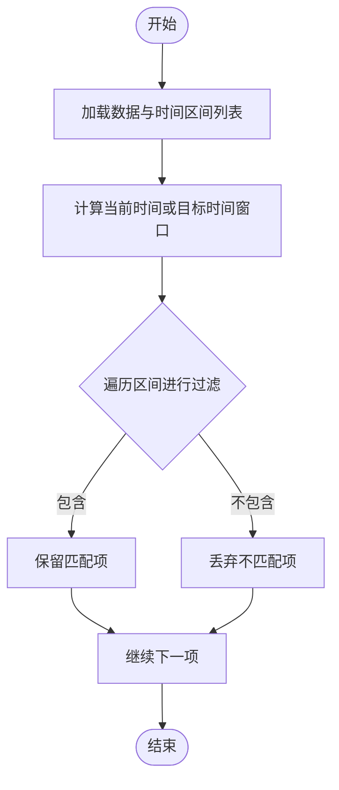
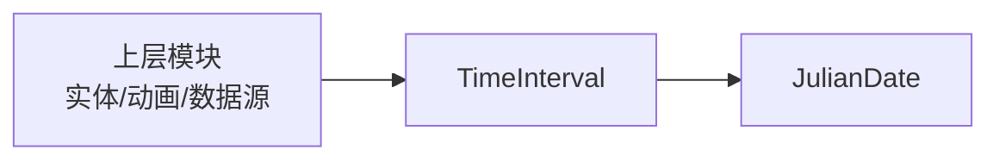

# 时间区间（TimeInterval）API 文档

<cite>
**本文引用的文件**   
- [Source/Core/TimeInterval.js](file://Source/Core/TimeInterval.js)
- [Source/Core/JulianDate.js](file://Source/Core/JulianDate.js)
- [Specs/Core/TimeIntervalSpec.js](file://Specs/Core/TimeIntervalSpec.js)
</cite>

## 目录
1. [简介](#简介)
2. [项目结构](#项目结构)
3. [核心组件](#核心组件)
4. [架构总览](#架构总览)
5. [详细组件分析](#详细组件分析)
6. [依赖关系分析](#依赖关系分析)
7. [性能考量](#性能考量)
8. [故障排查指南](#故障排查指南)
9. [结论](#结论)
10. [附录](#附录)

## 简介
本文件为 Cesium 中 TimeInterval（时间区间）类的完整 API 与使用指南。TimeInterval 用于表示一个有界的时间范围，通常由开始时间与结束时间组成，并支持包含、相交、重叠等集合语义判断。它在实体属性动画、数据过滤、可视性控制、时间动态加载等场景中广泛使用。

在 Cesium 中，时间以 JulianDate 表示，TimeInterval 通过组合两个 JulianDate 来定义区间的起止点，并提供丰富的比较与查询方法，便于构建复杂的时间逻辑。

## 项目结构
与 TimeInterval 直接相关的代码主要位于 Source/Core 目录下的 TimeInterval.js；其时间基准类型 JulianDate 位于 Source/Core/JulianDate.js；单元测试用例位于 Specs/Core/TimeIntervalSpec.js。

图表来源
- [Source/Core/TimeInterval.js](file://Source/Core/TimeInterval.js)
- [Source/Core/JulianDate.js](file://Source/Core/JulianDate.js)
- [Specs/Core/TimeIntervalSpec.js](file://Specs/Core/TimeIntervalSpec.js)

章节来源
- [Source/Core/TimeInterval.js](file://Source/Core/TimeInterval.js)
- [Source/Core/JulianDate.js](file://Source/Core/JulianDate.js)
- [Specs/Core/TimeIntervalSpec.js](file://Specs/Core/TimeIntervalSpec.js)

## 核心组件
- TimeInterval：表示一个时间区间，提供创建、查询、比较、克隆、序列化等方法。
- JulianDate：Cesium 的日期时间类型，作为 TimeInterval 的开始与结束时间的载体。

章节来源
- [Source/Core/TimeInterval.js](file://Source/Core/TimeInterval.js)
- [Source/Core/JulianDate.js](file://Source/Core/JulianDate.js)

## 架构总览
下图展示了 TimeInterval 与 JulianDate 的关系以及典型调用路径。

图表来源
- [Source/Core/TimeInterval.js](file://Source/Core/TimeInterval.js)
- [Source/Core/JulianDate.js](file://Source/Core/JulianDate.js)

## 详细组件分析

### 概念与应用场景
- 概念：TimeInterval 是一个闭区间或半开区间（取决于实现约定），由 start 与 stop 两个 JulianDate 界定。
- 应用场景：
  - 实体属性动画：将属性的变化绑定到特定时间区间，实现按时间播放或回放。
  - 数据过滤：根据当前时间筛选可见的数据片段。
  - 可视性与生命周期：控制对象在某个时间段内显示或隐藏。
  - 时间切片与聚合：对长时间序列数据进行分段处理。

章节来源
- [Source/Core/TimeInterval.js](file://Source/Core/TimeInterval.js)
- [Specs/Core/TimeIntervalSpec.js](file://Specs/Core/TimeIntervalSpec.js)

### 创建与构造
- 通过构造函数或工厂方法创建 TimeInterval，需提供开始时间与结束时间（均为 JulianDate）。
- 常见参数包括：
  - start：区间的起始时间（JulianDate）
  - stop：区间的结束时间（JulianDate）
- 注意事项：
  - 确保 start 不晚于 stop，否则可能被视为无效区间。
  - 若需要无限区间，可使用特殊值或空引用（具体行为参考实现）。

章节来源
- [Source/Core/TimeInterval.js](file://Source/Core/TimeInterval.js)

### 时间范围查询
- 常用查询方法：
  - contains(time)：判断给定时间是否落在区间内。
  - overlaps(other)：判断与另一个区间是否存在重叠。
  - intersects(other)：判断是否与另一个区间相交（含端点接触）。
  - equals(other)：判断两个区间是否相等（起止时间一致）。
  - compare(other)：返回比较结果（小于、等于、大于）。
- 边界条件：
  - 端点包含与否需遵循实现约定（通常为闭区间）。
  - 与无效区间或空区间的交互应返回明确的布尔结果。

章节来源
- [Source/Core/TimeInterval.js](file://Source/Core/TimeInterval.js)
- [Specs/Core/TimeIntervalSpec.js](file://Specs/Core/TimeIntervalSpec.js)

### 区间判断操作（包含、相交、重叠）
- 包含：contains(time) 常用于“某时刻是否在区间内”的快速判定。
- 相交：intersects(other) 用于判断两区间是否有公共部分（含端点）。
- 重叠：overlaps(other) 用于判断两区间是否存在严格意义上的内部重叠（不含仅端点接触的情况，具体以实现为准）。
- 建议：
  - 在大量区间上进行批量判定时，优先使用高效的比较与裁剪策略。
  - 对于频繁查询的场景，可考虑预处理排序或建立索引结构。

章节来源
- [Source/Core/TimeInterval.js](file://Source/Core/TimeInterval.js)
- [Specs/Core/TimeIntervalSpec.js](file://Specs/Core/TimeIntervalSpec.js)

### 比较与排序
- equals(other)：判断两个区间是否完全相同。
- compare(other)：返回数值型比较结果，便于排序与二分查找。
- 使用建议：
  - 基于 compare 的结果可实现区间的拓扑排序与快速定位。
  - 在大规模数据集上，先按 start 排序再执行区间合并或去重可显著降低复杂度。

章节来源
- [Source/Core/TimeInterval.js](file://Source/Core/TimeInterval.js)
- [Specs/Core/TimeIntervalSpec.js](file://Specs/Core/TimeIntervalSpec.js)

### 克隆与不可变性
- clone(result)：将当前区间复制到 result 对象，避免重复分配。
- 设计要点：
  - 推荐复用 result 对象以减少垃圾回收压力。
  - 若需要独立副本，可直接传入新对象或省略 result。

章节来源
- [Source/Core/TimeInterval.js](file://Source/Core/TimeInterval.js)

### 序列化与反序列化
- serialize(json, options)：将区间序列化为 JSON 格式，便于存储与传输。
- 字段说明：
  - start：序列化为字符串形式的 JulianDate。
  - stop：序列化为字符串形式的 JulianDate。
- 反序列化：
  - 可通过解析 JSON 后构造新的 TimeInterval 实例。
  - 注意时区与精度问题，确保两端时间一致性。

章节来源
- [Source/Core/TimeInterval.js](file://Source/Core/TimeInterval.js)

### 与 JulianDate 的协作
- 时间类型：所有起止时间均以 JulianDate 表示，保证高精度与跨平台一致性。
- 常见用法：
  - 使用 JulianDate 进行时间加减、比较与格式化。
  - 将外部时间源转换为 JulianDate 后再构造 TimeInterval。
- 性能提示：
  - 避免在高频循环中频繁创建 JulianDate，尽量复用对象。

章节来源
- [Source/Core/JulianDate.js](file://Source/Core/JulianDate.js)
- [Source/Core/TimeInterval.js](file://Source/Core/TimeInterval.js)

### 在实体属性动画中的应用
- 将属性的关键帧或常量值绑定到 TimeInterval，实现随时间变化的效果。
- 流程示意：

图表来源
- [Source/Core/TimeInterval.js](file://Source/Core/TimeInterval.js)
- [Source/Core/JulianDate.js](file://Source/Core/JulianDate.js)

章节来源
- [Source/Core/TimeInterval.js](file://Source/Core/TimeInterval.js)
- [Source/Core/JulianDate.js](file://Source/Core/JulianDate.js)

### 在数据过滤中的应用
- 使用 contains 或 overlaps 对数据集进行时间维度筛选。
- 流程示意：

图表来源
- [Source/Core/TimeInterval.js](file://Source/Core/TimeInterval.js)

章节来源
- [Source/Core/TimeInterval.js](file://Source/Core/TimeInterval.js)

## 依赖关系分析
- 直接依赖：
  - TimeInterval 依赖 JulianDate 进行时间表示与比较。
- 间接依赖：
  - 上层模块（如实体系统、动画系统、数据源）通过 TimeInterval 进行时间驱动的逻辑控制。
- 耦合与内聚：
  - TimeInterval 职责单一，专注于时间区间的表示与集合操作，内聚性高。
  - 与 JulianDate 的耦合清晰，接口稳定。

图表来源
- [Source/Core/TimeInterval.js](file://Source/Core/TimeInterval.js)
- [Source/Core/JulianDate.js](file://Source/Core/JulianDate.js)

章节来源
- [Source/Core/TimeInterval.js](file://Source/Core/TimeInterval.js)
- [Source/Core/JulianDate.js](file://Source/Core/JulianDate.js)

## 性能考量
- 对象复用：
  - 使用 clone(result) 复用结果对象，减少 GC 压力。
- 批量处理：
  - 对大量区间进行排序与合并，可降低后续查询复杂度。
- 缓存策略：
  - 对频繁查询的时间点或区间结果进行缓存，避免重复计算。
- 时间精度：
  - 在高并发或长时运行场景下，注意浮点误差与精度损失，必要时引入容差比较。

[本节为通用指导，无需源码引用]

## 故障排查指南
- 常见问题：
  - 无效区间：start 晚于 stop 导致 contains 始终返回 false。
  - 边界误判：端点包含规则与预期不一致，需检查实现约定。
  - 序列化异常：JulianDate 字符串格式不正确导致反序列化失败。
- 调试建议：
  - 打印 start 与 stop 的 JulianDate 字符串，确认时间范围。
  - 使用 equals 与 compare 验证区间一致性。
  - 在单元测试中覆盖边界情况（端点、空区间、无限区间）。

章节来源
- [Specs/Core/TimeIntervalSpec.js](file://Specs/Core/TimeIntervalSpec.js)
- [Source/Core/TimeInterval.js](file://Source/Core/TimeInterval.js)

## 结论
TimeInterval 是 Cesium 时间驱动逻辑的核心抽象之一，通过与 JulianDate 的深度协作，提供了高效、稳定的时间区间处理能力。开发者可在实体动画、数据过滤、可视性控制等场景中充分利用其 API，结合性能优化策略，构建健壮的时间相关功能。

[本节为总结，无需源码引用]

## 附录
- 最佳实践清单：
  - 始终使用 JulianDate 表示时间，避免混用其他时间类型。
  - 在高频路径中复用 TimeInterval 与 JulianDate 对象。
  - 对区间集合进行预处理（排序、合并、索引）以提升查询效率。
  - 在序列化前后校验时间格式与精度。
- 参考示例：
  - 查看 Specs/Core/TimeIntervalSpec.js 中的用例，了解常见用法与边界行为。

章节来源
- [Specs/Core/TimeIntervalSpec.js](file://Specs/Core/TimeIntervalSpec.js)
- [Source/Core/TimeInterval.js](file://Source/Core/TimeInterval.js)
- [Source/Core/JulianDate.js](file://Source/Core/JulianDate.js)