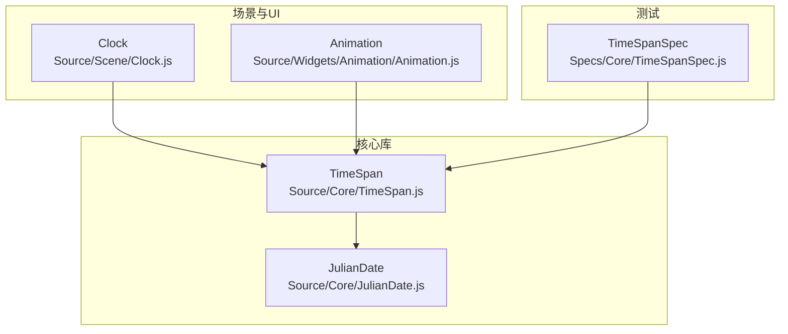
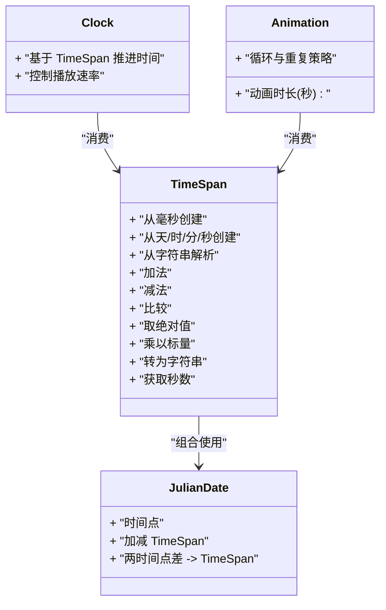
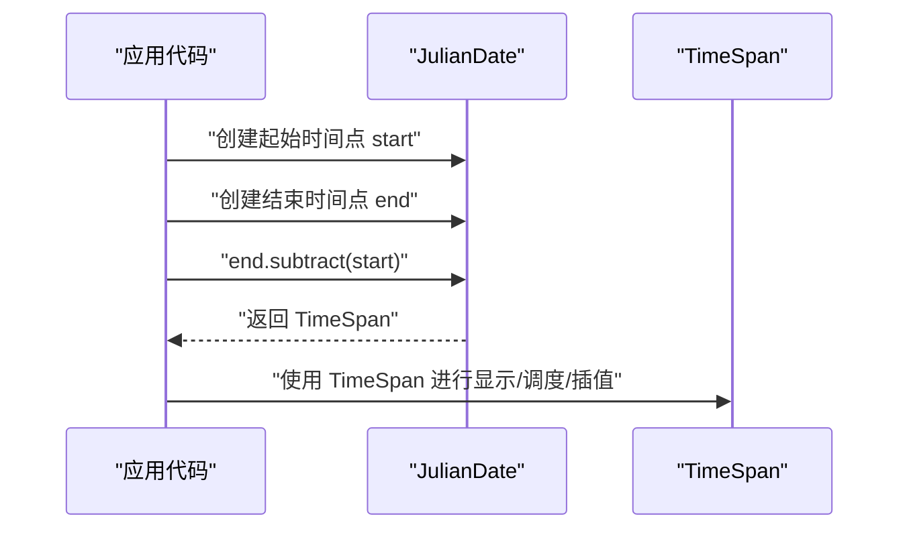
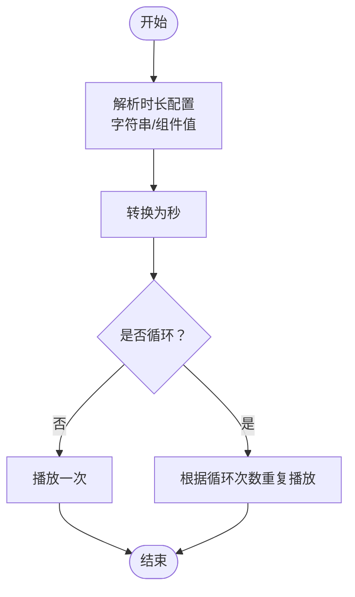
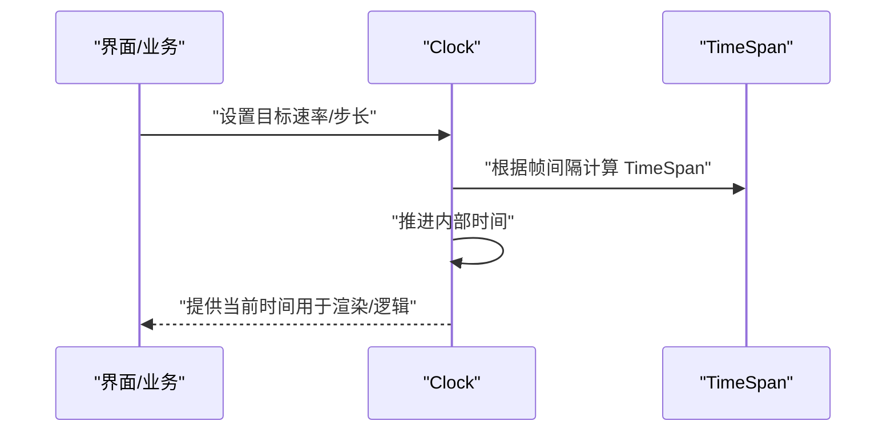
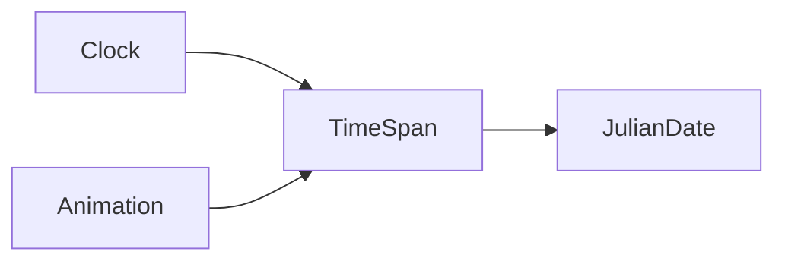

# TimeSpan时间跨度

<cite>
**本文引用的文件**   
- [TimeSpan.js](file://Source/Core/TimeSpan.js)
- [JulianDate.js](file://Source/Core/JulianDate.js)
- [Clock.js](file://Source/Scene/Clock.js)
- [Animation.js](file://Source/Widgets/Animation/Animation.js)
- [Specs/Core/TimeSpanSpec.js](file://Specs/Core/TimeSpanSpec.js)
</cite>

## 目录
1. [简介](#简介)
2. [项目结构](#项目结构)
3. [核心组件](#核心组件)
4. [架构总览](#架构总览)
5. [详细组件分析](#详细组件分析)
6. [依赖关系分析](#依赖关系分析)
7. [性能考虑](#性能考虑)
8. [故障排查指南](#故障排查指南)
9. [结论](#结论)
10. [附录](#附录)

## 简介
TimeSpan 表示一段持续时间，是 Cesium 中用于表达“时长”的基础类型。它通常以秒为内部单位，并提供毫秒、天、小时、分钟、秒等便捷构造与转换方法。TimeSpan 在动画时长计算、延迟处理、定时任务、以及和 JulianDate 协作进行时间推进等方面被广泛使用。

## 项目结构
本仓库采用按功能域组织源码的方式，TimeSpan 的核心实现位于 Source/Core 目录下，相关测试位于 Specs/Core 下；与时间相关的上层组件（如 Clock、Animation）则分别位于 Source/Scene 与 Source/Widgets 目录。

图表来源
- [TimeSpan.js](file://Source/Core/TimeSpan.js)
- [JulianDate.js](file://Source/Core/JulianDate.js)
- [Clock.js](file://Source/Scene/Clock.js)
- [Animation.js](file://Source/Widgets/Animation/Animation.js)
- [Specs/Core/TimeSpanSpec.js](file://Specs/Core/TimeSpanSpec.js)

章节来源
- [TimeSpan.js](file://Source/Core/TimeSpan.js)
- [Specs/Core/TimeSpanSpec.js](file://Specs/Core/TimeSpanSpec.js)

## 核心组件
本节聚焦 TimeSpan 的 API 能力与使用方式，涵盖创建、算术运算、格式化/解析以及与 JulianDate 的协作。

- 创建方式
  - 从毫秒数创建：适用于需要高精度或来自系统时间的场景。
  - 从天、时、分、秒等组件值创建：便于人类可读的配置与调试。
  - 从字符串解析：支持常见的时间跨度格式（例如 ISO 8601 的持续时间格式），便于外部数据接入。
  - 从其他 TimeSpan 复制：避免共享可变状态。

- 算术运算
  - 加法：将两个时间跨度相加得到新的时间跨度。
  - 减法：从一个时间跨度减去另一个时间跨度。
  - 比较：提供等于、小于、大于等比较操作，便于排序与条件判断。
  - 取绝对值：忽略符号，仅保留大小。
  - 乘以标量：常用于按比例缩放时长。

- 格式化与解析
  - 转换为字符串：输出人类可读的时长文本。
  - 从字符串解析：输入多种常见格式并返回新的 TimeSpan。

- 与 JulianDate 的协作
  - 将 TimeSpan 加到 JulianDate 上，得到一个新的时间点。
  - 通过两个 JulianDate 相减得到 TimeSpan，便于计算事件间隔。

章节来源
- [TimeSpan.js](file://Source/Core/TimeSpan.js)
- [JulianDate.js](file://Source/Core/JulianDate.js)
- [Specs/Core/TimeSpanSpec.js](file://Specs/Core/TimeSpanSpec.js)

## 架构总览
下图展示了 TimeSpan 在 Cesium 中的位置及其与关键组件的关系。TimeSpan 作为轻量不可变（或按需可变）的数值封装，被 Clock 与 Animation 等高层模块消费，同时与 JulianDate 紧密协作完成时间推进与间隔计算。

图表来源
- [TimeSpan.js](file://Source/Core/TimeSpan.js)
- [JulianDate.js](file://Source/Core/JulianDate.js)
- [Clock.js](file://Source/Scene/Clock.js)
- [Animation.js](file://Source/Widgets/Animation/Animation.js)

## 详细组件分析

### TimeSpan 类详解
- 设计要点
  - 统一以秒为内部单位，对外暴露多粒度构造与转换接口，降低精度损失与换算错误。
  - 提供不可变风格的运算方法（返回新实例），减少副作用，提升可预测性。
  - 对边界情况（负值、极大值、零值）有明确语义与行为约定。

- 常用方法与语义
  - 构造器族：支持毫秒、天/时/分/秒、字符串等多种来源。
  - 算术方法：add、subtract、equals、lessThan、greaterThan、abs、multiplyByScalar。
  - 转换方法：toString、getSeconds。
  - 与 JulianDate 协作：配合 add/subtract 完成时间推进与间隔计算。

- 复杂度与性能
  - 构造与算术运算通常为 O(1)。
  - 字符串解析涉及正则匹配与单位换算，开销略高于纯数值构造，建议在初始化阶段批量执行。

章节来源
- [TimeSpan.js](file://Source/Core/TimeSpan.js)
- [Specs/Core/TimeSpanSpec.js](file://Specs/Core/TimeSpanSpec.js)

### 与 JulianDate 的协作流程
下图展示“从两个时间点计算间隔”的典型调用序列。

图表来源
- [JulianDate.js](file://Source/Core/JulianDate.js)
- [TimeSpan.js](file://Source/Core/TimeSpan.js)

### 动画时长与循环控制
动画系统通常以秒为单位配置时长与循环次数，TimeSpan 可作为中间层将用户友好的配置（如“30秒”、“1分30秒”）转换为统一的秒数，供渲染循环使用。

图表来源
- [Animation.js](file://Source/Widgets/Animation/Animation.js)
- [TimeSpan.js](file://Source/Core/TimeSpan.js)

章节来源
- [Animation.js](file://Source/Widgets/Animation/Animation.js)
- [TimeSpan.js](file://Source/Core/TimeSpan.js)

### 时钟推进与延迟处理
Clock 基于当前帧时间与目标速率推进虚拟时间，常借助 TimeSpan 表示步进增量或等待时长。

图表来源
- [Clock.js](file://Source/Scene/Clock.js)
- [TimeSpan.js](file://Source/Core/TimeSpan.js)

章节来源
- [Clock.js](file://Source/Scene/Clock.js)
- [TimeSpan.js](file://Source/Core/TimeSpan.js)

## 依赖关系分析
- 直接依赖
  - TimeSpan 主要依赖基础数学与日期工具，确保跨平台一致性与精度。
  - 与 JulianDate 的组合使用非常频繁，形成“时间点 + 时间跨度”的标准模式。
- 间接依赖
  - Clock 与 Animation 通过 TimeSpan 抽象出“时长”，屏蔽底层时间源差异。
- 潜在耦合点
  - 若引入自定义时间源（如网络同步时间），需保证与 JulianDate/TimeSpan 的语义一致。

图表来源
- [TimeSpan.js](file://Source/Core/TimeSpan.js)
- [JulianDate.js](file://Source/Core/JulianDate.js)
- [Clock.js](file://Source/Scene/Clock.js)
- [Animation.js](file://Source/Widgets/Animation/Animation.js)

章节来源
- [TimeSpan.js](file://Source/Core/TimeSpan.js)
- [JulianDate.js](file://Source/Core/JulianDate.js)
- [Clock.js](file://Source/Scene/Clock.js)
- [Animation.js](file://Source/Widgets/Animation/Animation.js)

## 性能考虑
- 优先使用数值构造（毫秒/秒）以减少解析开销，字符串解析适合一次性初始化。
- 复用已创建的 TimeSpan 实例，避免在热路径中频繁分配对象。
- 大量时间跨度运算时，尽量合并步骤，减少中间对象数量。
- 与 JulianDate 协作时，注意浮点精度累积，必要时对结果进行合理舍入。

[本节为通用指导，不直接分析具体文件]

## 故障排查指南
- 现象：时间跨度为 NaN 或异常大值
  - 检查输入是否为有效数字或合法字符串。
  - 确认单位换算是否正确（如毫秒与秒的混淆）。
- 现象：比较结果不符合预期
  - 确认比较的是相同单位（建议统一用秒进行比较）。
  - 注意浮点误差，必要时引入容差比较。
- 现象：与 JulianDate 组合后时间漂移
  - 检查是否在高频循环中反复累加小增量，考虑改用固定步长或重新计算基准时间。

章节来源
- [Specs/Core/TimeSpanSpec.js](file://Specs/Core/TimeSpanSpec.js)

## 结论
TimeSpan 提供了简洁而强大的时间跨度处理能力，结合 JulianDate 能够覆盖从“时长定义”到“时间点推进”的完整链路。在动画、时钟与延迟场景中，合理使用 TimeSpan 能显著提升代码的可读性与可维护性。遵循本文的性能与最佳实践，可在保证精度的前提下获得更优的运行效率。

[本节为总结性内容，不直接分析具体文件]

## 附录
- 典型应用场景
  - 动画时长：以秒为单位配置动画长度，支持循环与重复。
  - 延迟处理：将用户配置的时长转换为秒，驱动定时器或异步任务。
  - 定时任务：周期性任务以固定 TimeSpan 步进推进。
  - 日志与统计：记录耗时、平均耗时、P95/P99 等指标。
- 参考示例路径
  - 单元测试用例：查看 TimeSpan 的行为与边界条件。
  - 动画组件：观察如何消费 TimeSpan 完成时长与循环控制。
  - 时钟组件：了解如何基于 TimeSpan 推进虚拟时间。

章节来源
- [Specs/Core/TimeSpanSpec.js](file://Specs/Core/TimeSpanSpec.js)
- [Animation.js](file://Source/Widgets/Animation/Animation.js)
- [Clock.js](file://Source/Scene/Clock.js)