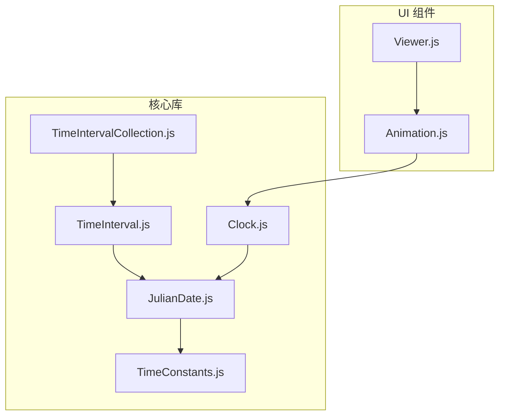
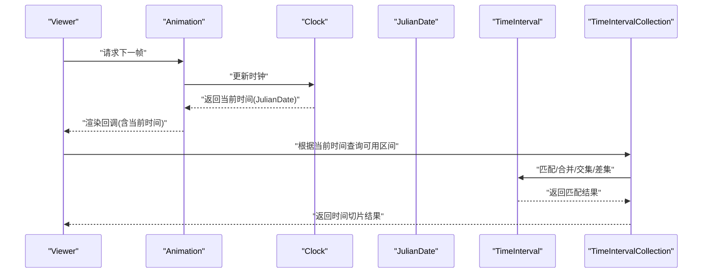
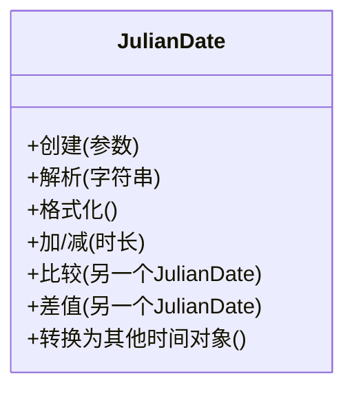
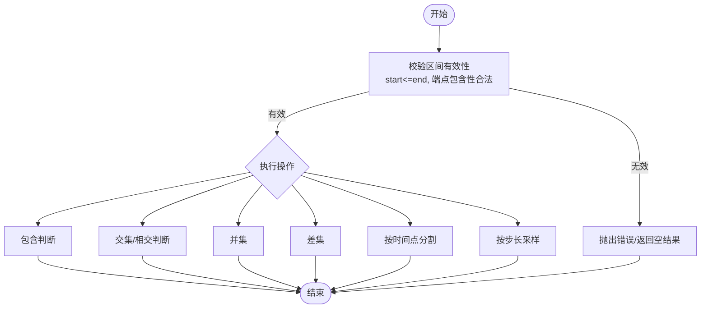
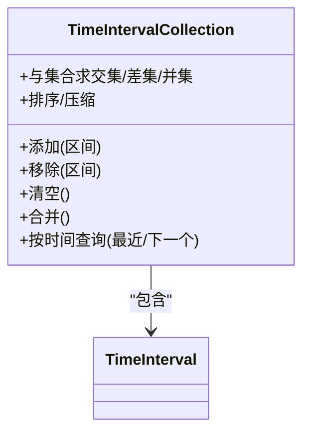
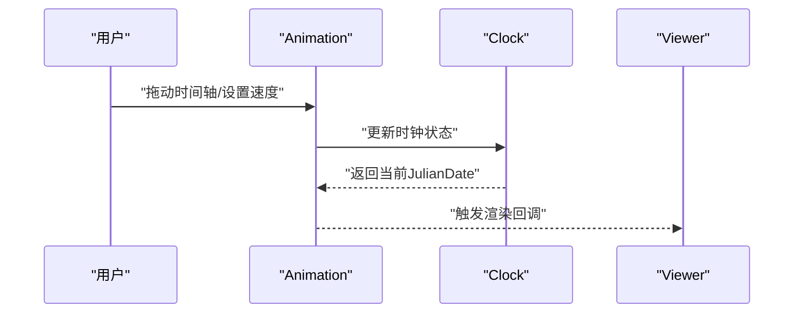
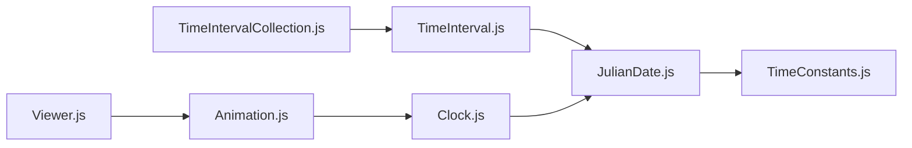

# 时间管理API

<cite>
**本文引用的文件**   
- [JulianDate.js](file://Source/Core/JulianDate.js)
- [TimeInterval.js](file://Source/Core/TimeInterval.js)
- [TimeIntervalCollection.js](file://Source/Core/TimeIntervalCollection.js)
- [TimeConstants.js](file://Source/Core/TimeConstants.js)
- [Clock.js](file://Source/Core/Clock.js)
- [Animation.js](file://Source/Widgets/Animation/Animation.js)
- [Viewer.js](file://Source/Widgets/Viewer/Viewer.js)
</cite>

## 目录
1. [简介](#简介)
2. [项目结构](#项目结构)
3. [核心组件](#核心组件)
4. [架构总览](#架构总览)
5. [详细组件分析](#详细组件分析)
6. [依赖关系分析](#依赖关系分析)
7. [性能考虑](#性能考虑)
8. [故障排查指南](#故障排查指南)
9. [结论](#结论)
10. [附录](#附录)

## 简介
本文件面向开发者，系统化梳理 Cesium 的时间管理体系，重点覆盖以下三类核心类型：
- JulianDate（儒略日期）：高精度、无时区的时间点表示与运算
- TimeInterval（时间区间）：带起止时间的区间定义与查询
- TimeIntervalCollection（时间区间集合）：对多个时间区间进行合并、交集、差集等集合操作

文档将围绕“创建、解析、格式化、算术运算”“区间集合操作”“时区处理、日历系统、精度控制”以及“动画时间轴、历史数据回放”等典型应用场景展开，帮助读者快速构建稳定高效的时间序列数据处理流程。

## 项目结构
Cesium 的时间相关能力主要位于 Source/Core 目录中，UI 层通过 Widgets 暴露给应用。下图给出与本 API 文档相关的模块组织概览。

图表来源
- [JulianDate.js](file://Source/Core/JulianDate.js)
- [TimeInterval.js](file://Source/Core/TimeInterval.js)
- [TimeIntervalCollection.js](file://Source/Core/TimeIntervalCollection.js)
- [TimeConstants.js](file://Source/Core/TimeConstants.js)
- [Clock.js](file://Source/Core/Clock.js)
- [Animation.js](file://Source/Widgets/Animation/Animation.js)
- [Viewer.js](file://Source/Widgets/Viewer/Viewer.js)

章节来源
- [JulianDate.js](file://Source/Core/JulianDate.js)
- [TimeInterval.js](file://Source/Core/TimeInterval.js)
- [TimeIntervalCollection.js](file://Source/Core/TimeIntervalCollection.js)
- [TimeConstants.js](file://Source/Core/TimeConstants.js)
- [Clock.js](file://Source/Core/Clock.js)
- [Animation.js](file://Source/Widgets/Animation/Animation.js)
- [Viewer.js](file://Source/Widgets/Viewer/Viewer.js)

## 核心组件
本节概述三大核心类型的职责与协作方式，并给出关键使用要点。

- JulianDate（儒略日期）
  - 用途：以儒略日为基础的高精度时间点，支持秒级以下的浮点精度，适合科学计算与长跨度时间范围
  - 常见能力：创建、比较、加减时长、格式化为字符串、从字符串解析、转换为其他时间对象
  - 注意事项：内部采用双精度浮点数存储秒数；注意数值精度在极长时间跨度下的舍入误差

- TimeInterval（时间区间）
  - 用途：描述一个有起点和终点的时间段，支持是否包含端点的语义
  - 常见能力：创建、判断包含/相交/重叠、求并集/交集/差集、按时间采样或插值
  - 注意事项：区间必须满足 start <= end；端点包含性会影响集合运算结果

- TimeIntervalCollection（时间区间集合）
  - 用途：维护一组 TimeInterval，并提供高效的查找、合并、去重、集合运算
  - 常见能力：添加/移除区间、按时间查询最近/下一个区间、合并相邻区间、计算交集/差集
  - 注意事项：大量区间时建议先做合并与去重以提升查询性能

章节来源
- [JulianDate.js](file://Source/Core/JulianDate.js)
- [TimeInterval.js](file://Source/Core/TimeInterval.js)
- [TimeIntervalCollection.js](file://Source/Core/TimeIntervalCollection.js)

## 架构总览
下图展示从 UI 到核心的时间驱动链路：Viewer 驱动 Animation，Animation 驱动 Clock，Clock 提供当前时间（JulianDate），业务逻辑基于 TimeInterval 与 TimeIntervalCollection 完成时间切片与查询。

图表来源
- [Viewer.js](file://Source/Widgets/Viewer/Viewer.js)
- [Animation.js](file://Source/Widgets/Animation/Animation.js)
- [Clock.js](file://Source/Core/Clock.js)
- [JulianDate.js](file://Source/Core/JulianDate.js)
- [TimeInterval.js](file://Source/Core/TimeInterval.js)
- [TimeIntervalCollection.js](file://Source/Core/TimeIntervalCollection.js)

## 详细组件分析

### JulianDate（儒略日期）
- 设计要点
  - 以儒略日为基准，避免公历闰年、月份长度差异带来的边界问题
  - 支持高精度浮点秒，便于微秒/毫秒级动画与物理仿真
- 常用能力
  - 创建：从标准时间对象、ISO 字符串、儒略日分量构造
  - 解析：从多种字符串格式解析为 JulianDate
  - 格式化：输出为可读字符串（如 ISO 8601 风格）
  - 算术：加减天数/小时/分钟/秒/毫秒；比较大小；取差值
  - 转换：与其他时间体系互转（例如与 Date 的互转）
- 精度与时区
  - 精度：受限于双精度浮点，极端大范围时间可能产生舍入误差
  - 时区：JulianDate 本身不携带时区信息，通常视为 UTC；如需本地化显示，应在上层进行转换
- 复杂度
  - 基本运算为 O(1)
  - 解析/格式化通常为 O(n)，n 为输入字符串长度

图表来源
- [JulianDate.js](file://Source/Core/JulianDate.js)

章节来源
- [JulianDate.js](file://Source/Core/JulianDate.js)

### TimeInterval（时间区间）
- 设计要点
  - 明确 start 与 end 的包含语义（闭区间/半开区间），影响集合运算
  - 支持空区间与无效区间的校验
- 常用能力
  - 创建：指定起止时间与端点包含性
  - 判断：是否包含某时刻、是否与另一区间相交/重叠
  - 集合：并集、交集、差集、对称差集
  - 分割：按给定时间点切分为子区间
  - 采样：在区间内按固定步长生成时间点序列
- 复杂度
  - 单区间判断与简单集合运算一般为 O(1)
  - 批量分割/采样与区间数量线性相关

图表来源
- [TimeInterval.js](file://Source/Core/TimeInterval.js)

章节来源
- [TimeInterval.js](file://Source/Core/TimeInterval.js)

### TimeIntervalCollection（时间区间集合）
- 设计要点
  - 内部维护有序区间列表，支持增量更新与批量插入
  - 提供合并相邻/重叠区间的能力，减少后续查询成本
- 常用能力
  - 增删改：add、remove、clear、replace
  - 查询：按时间获取最近/下一个区间、按条件过滤
  - 集合运算：与另一个集合求交集/差集/并集
  - 优化：merge 合并相邻区间、sort 排序、compact 压缩
- 复杂度
  - 单次查询近似 O(log n)（二分查找）+ 常数项
  - 合并/去重为 O(n log n) 或 O(n)（已排序）
  - 批量插入后建议调用 merge 以降低查询开销

图表来源
- [TimeIntervalCollection.js](file://Source/Core/TimeIntervalCollection.js)
- [TimeInterval.js](file://Source/Core/TimeInterval.js)

章节来源
- [TimeIntervalCollection.js](file://Source/Core/TimeIntervalCollection.js)
- [TimeInterval.js](file://Source/Core/TimeInterval.js)

### 时间常量与辅助
- TimeConstants
  - 提供常用时间常量（如秒/分/时/天换算系数、儒略日偏移等），用于统一换算与避免魔法数字
- 使用建议
  - 所有时长换算优先使用常量，保证一致性与可维护性

章节来源
- [TimeConstants.js](file://Source/Core/TimeConstants.js)

### 动画与时间驱动
- Clock
  - 作为时间源，提供当前时间（JulianDate）、步进策略、循环模式、速度倍率等
  - 与 Animation 配合，驱动每帧时间推进
- Animation
  - 负责 UI 侧的时间轴控件与播放控制，向 Clock 传递用户交互
- Viewer
  - 顶层容器，协调渲染循环与时间推进

图表来源
- [Animation.js](file://Source/Widgets/Animation/Animation.js)
- [Clock.js](file://Source/Core/Clock.js)
- [Viewer.js](file://Source/Widgets/Viewer/Viewer.js)

章节来源
- [Clock.js](file://Source/Core/Clock.js)
- [Animation.js](file://Source/Widgets/Animation/Animation.js)
- [Viewer.js](file://Source/Widgets/Viewer/Viewer.js)

## 依赖关系分析
- 低耦合高内聚
  - JulianDate 仅依赖基础数学与常量，保持纯函数式特性
  - TimeInterval 依赖 JulianDate，封装区间语义
  - TimeIntervalCollection 依赖 TimeInterval，实现集合算法
  - Clock/Animation/Viewer 组合形成时间驱动链，向上层暴露简洁接口
- 外部依赖
  - 无重型第三方依赖，利于移植与测试
- 潜在循环依赖
  - 当前结构未发现循环依赖；若扩展需确保单向依赖

图表来源
- [JulianDate.js](file://Source/Core/JulianDate.js)
- [TimeConstants.js](file://Source/Core/TimeConstants.js)
- [TimeInterval.js](file://Source/Core/TimeInterval.js)
- [TimeIntervalCollection.js](file://Source/Core/TimeIntervalCollection.js)
- [Clock.js](file://Source/Core/Clock.js)
- [Animation.js](file://Source/Widgets/Animation/Animation.js)
- [Viewer.js](file://Source/Widgets/Viewer/Viewer.js)

章节来源
- [JulianDate.js](file://Source/Core/JulianDate.js)
- [TimeInterval.js](file://Source/Core/TimeInterval.js)
- [TimeIntervalCollection.js](file://Source/Core/TimeIntervalCollection.js)
- [TimeConstants.js](file://Source/Core/TimeConstants.js)
- [Clock.js](file://Source/Core/Clock.js)
- [Animation.js](file://Source/Widgets/Animation/Animation.js)
- [Viewer.js](file://Source/Widgets/Viewer/Viewer.js)

## 性能考虑
- 区间集合优化
  - 在批量插入后调用合并与压缩，降低查询时的扫描成本
  - 对高频查询场景，尽量保持区间有序且无重叠
- 时间精度
  - 在超长跨度（世纪以上）场景中，注意浮点精度导致的微小偏差
  - 需要更高精度时可考虑分段建模或使用专用高精度库
- 采样与插值
  - 合理设置采样步长，避免过密导致内存与 CPU 压力
  - 对稀疏数据可采用分段线性插值，平衡质量与性能

[本节为通用指导，无需源码引用]

## 故障排查指南
- 常见错误
  - 区间无效：start > end 或端点包含性冲突
  - 时间解析失败：输入字符串不符合预期格式
  - 精度异常：超大时间跨度下出现微小漂移
- 定位方法
  - 打印关键中间结果（区间起止、集合大小、查询命中情况）
  - 使用最小复现用例隔离问题
  - 检查是否遗漏了合并/排序步骤导致查询退化
- 修复建议
  - 在数据入库前进行区间合法性校验与规范化
  - 对解析失败的数据记录日志并回退到默认策略
  - 对超长跨度数据进行分段或归一化处理

章节来源
- [TimeInterval.js](file://Source/Core/TimeInterval.js)
- [TimeIntervalCollection.js](file://Source/Core/TimeIntervalCollection.js)
- [JulianDate.js](file://Source/Core/JulianDate.js)

## 结论
Cesium 的时间管理以 JulianDate 为核心，结合 TimeInterval 与 TimeIntervalCollection 提供了完整的时间点与时间区间处理能力。通过 Clock 与 Animation 的协同，能够轻松构建动画时间轴与历史回放等复杂场景。遵循本文档的最佳实践与性能建议，可在保证精度的同时获得良好的运行效率。

[本节为总结性内容，无需源码引用]

## 附录

### 使用清单与最佳实践
- 时间点
  - 统一使用 JulianDate 作为内部时间表示
  - 对外展示时再进行本地化格式化
- 时间区间
  - 明确端点包含性，并在集合运算前后保持一致
  - 批量操作后及时合并与压缩
- 动画与回放
  - 使用 Clock 控制时间推进，Animation 提供交互
  - 对大数据量采用分页加载与按需采样

[本节为概念性内容，无需源码引用]