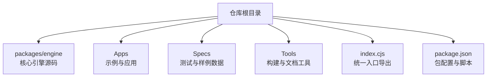
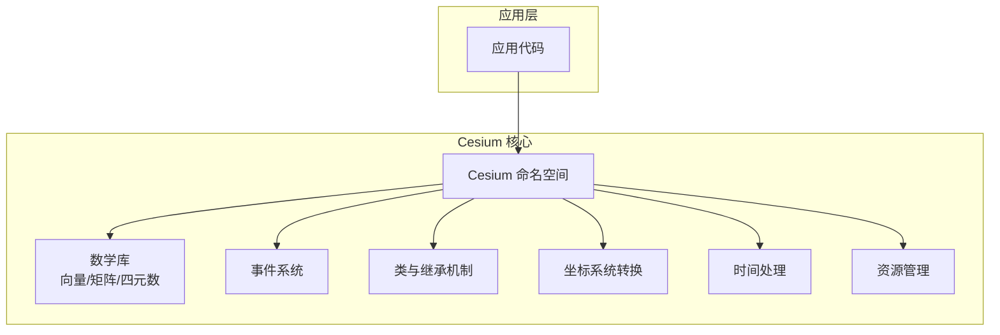
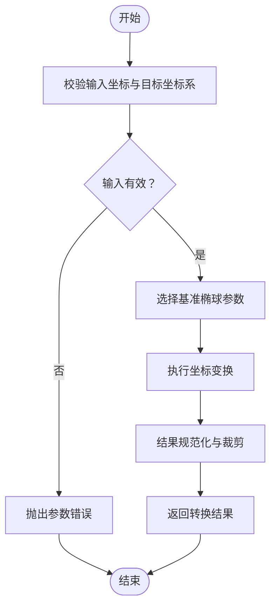
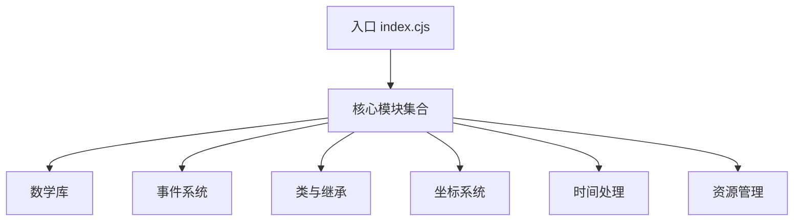

# 核心API

<cite>
**本文引用的文件**   
- [index.cjs](file://index.cjs)
- [package.json](file://package.json)
- [README.md](file://README.md)
</cite>

## 目录
1. [简介](#简介)
2. [项目结构](#项目结构)
3. [核心组件](#核心组件)
4. [架构总览](#架构总览)
5. [详细组件分析](#详细组件分析)
6. [依赖分析](#依赖分析)
7. [性能考虑](#性能考虑)
8. [故障排查指南](#故障排查指南)
9. [结论](#结论)
10. [附录](#附录)

## 简介
本文件聚焦于 Cesium 核心 API 的基础能力，包括命名空间组织、数学库（向量、矩阵、四元数）、事件系统、类继承机制等。同时覆盖坐标系统转换、时间处理与资源管理等关键功能的 API 参考要点，帮助开发者快速理解并正确使用这些基础组件。

## 项目结构
仓库采用多包结构，核心引擎位于 packages/engine，示例与应用位于 Apps，测试与工具位于 Specs 与 Tools。顶层 index.cjs 提供统一的入口导出，便于在 Node.js 环境中使用或作为打包产物的一部分。

图表来源
- [index.cjs:1-200](file://index.cjs#L1-L200)
- [package.json:1-200](file://package.json#L1-L200)

章节来源
- [index.cjs:1-200](file://index.cjs#L1-L200)
- [package.json:1-200](file://package.json#L1-L200)

## 核心组件
本节概述 Cesium 核心 API 的关键模块与职责边界：
- 命名空间与导出：通过统一入口集中暴露 Cesium 命名空间下的类型与函数，便于按需引用与 Tree-shaking。
- 数学库：提供向量、矩阵、四元数等基础数学运算，支撑坐标变换、姿态表示与几何计算。
- 事件系统：基于发布/订阅模型，为对象间通信与回调管理提供稳定接口。
- 类与继承：以面向对象方式组织功能，支持扩展与组合，便于构建复杂场景。
- 坐标系统与时间：封装 WGS84、Web Mercator、ECEF 等坐标体系及时间戳、时钟控制逻辑。
- 资源管理：负责纹理、模型、瓦片等资源的加载、缓存与生命周期管理。

章节来源
- [README.md:1-200](file://README.md#L1-L200)

## 架构总览
下图展示了核心 API 的层次关系与交互方式：应用层通过入口导入 Cesium 命名空间，调用数学库进行坐标与姿态计算；事件系统贯穿各组件用于解耦；时间与资源管理为渲染管线提供基础支撑。

图表来源
- [index.cjs:1-200](file://index.cjs#L1-L200)
- [README.md:1-200](file://README.md#L1-L200)

## 详细组件分析

### 命名空间与导出
- 作用：将 Cesium 的核心类型、函数与常量聚合到单一命名空间下，简化导入路径与版本管理。
- 典型用法：从入口导入后，按命名空间访问各类 API，如数学库、事件、资源等。
- 注意事项：避免重复导入；优先使用按需导入以提升打包体积与性能。

章节来源
- [index.cjs:1-200](file://index.cjs#L1-L200)

### 数学库（向量、矩阵、四元数）
- 向量：提供二维、三维、四维向量的创建、运算与比较方法，常用于位置、方向与颜色表示。
- 矩阵：提供 3x3、4x4 矩阵的构造、变换与分解方法，常用于坐标系变换与投影计算。
- 四元数：提供旋转表示与插值方法，常用于平滑姿态过渡与避免万向节锁。
- 复杂度与性能：多数运算为 O(1)，注意避免频繁分配临时对象，尽量复用实例。
- 常见模式：链式调用与原地修改并存，需留意返回值是否为新对象或原对象引用。

章节来源
- [README.md:1-200](file://README.md#L1-L200)

### 事件系统
- 设计模式：发布/订阅，支持监听器注册、触发与移除，适合松耦合的组件通信。
- 典型流程：创建事件源 -> 注册监听器 -> 触发事件 -> 清理监听器。
- 错误处理：对非法参数与重复监听进行校验，避免内存泄漏与异常传播。
- 性能建议：批量触发时合并事件；及时移除不再使用的监听器。

章节来源
- [README.md:1-200](file://README.md#L1-L200)

### 类与继承机制
- 组织方式：以类为单位封装状态与行为，通过继承实现功能扩展与复用。
- 生命周期：构造、初始化、更新、销毁等阶段清晰划分，便于资源管理与调试。
- 扩展点：提供虚方法与钩子，允许子类定制行为而不破坏基类契约。
- 最佳实践：遵循单一职责原则，保持高内聚低耦合。

章节来源
- [README.md:1-200](file://README.md#L1-L200)

### 坐标系统转换
- 支持的坐标系：WGS84 经纬度、Web Mercator、ECEF 地心固定系等。
- 转换流程：输入校验 -> 基准椭球选择 -> 数值变换 -> 结果规范化。
- 精度与范围：注意浮点误差与极区奇异点，必要时进行归一化与裁剪。
- 性能优化：批量转换时复用中间变量，减少对象分配。

图表来源
- [README.md:1-200](file://README.md#L1-L200)

### 时间处理
- 时间模型：支持 UTC、本地时间与自定义时钟步进，提供时间戳与间隔计算。
- 常用操作：时间加减、格式化、区间判断与动画驱动。
- 同步策略：与渲染帧率对齐，保证动画与物理模拟的一致性。
- 注意事项：跨时区与夏令时处理需谨慎，建议使用统一的时间基准。

章节来源
- [README.md:1-200](file://README.md#L1-L200)

### 资源管理
- 资源类型：纹理、模型、瓦片、字体等。
- 生命周期：请求、下载、解析、缓存、释放。
- 并发控制：限制并行请求数量，避免阻塞主线程。
- 缓存策略：LRU 或 TTL 策略，结合内存与磁盘缓存提升性能。

章节来源
- [README.md:1-200](file://README.md#L1-L200)

## 依赖分析
- 内部依赖：核心 API 由多个子模块组成，入口统一导出，降低外部耦合。
- 外部依赖：主要依赖浏览器环境或 Node.js 运行时，部分平台特性通过条件编译或垫片适配。
- 循环依赖：应避免模块间相互引用，必要时使用延迟加载或工厂模式。

图表来源
- [index.cjs:1-200](file://index.cjs#L1-L200)

章节来源
- [index.cjs:1-200](file://index.cjs#L1-L200)
- [package.json:1-200](file://package.json#L1-L200)

## 性能考虑
- 对象复用：尽量复用向量、矩阵与四元数实例，减少垃圾回收压力。
- 批量操作：对大量数据进行批处理，减少函数调用与分支判断。
- 异步加载：资源加载与解析应异步进行，避免阻塞主线程。
- 缓存命中：合理设置缓存策略，提高热点资源的命中率。

## 故障排查指南
- 常见问题：
  - 参数无效：检查坐标范围、矩阵维度与四元数归一化。
  - 内存泄漏：确认事件监听器与资源引用已正确移除。
  - 性能瓶颈：定位高频分配与同步阻塞点，改用异步与批处理。
- 诊断步骤：
  - 启用日志与断点，追踪关键路径。
  - 使用性能分析工具测量 CPU 与内存占用。
  - 逐步隔离问题模块，复现最小用例。

## 结论
Cesium 核心 API 以清晰的模块化设计与稳定的数学基础为核心，配合事件系统与资源管理，为上层可视化与仿真提供了坚实基础。遵循本文的最佳实践与注意事项，可显著提升开发效率与运行性能。

## 附录
- 术语表：
  - 命名空间：用于组织与隔离 API 的容器。
  - 发布/订阅：一种消息传递模式，解耦发送者与接收者。
  - 基准椭球：用于地理坐标计算的地球近似形状。
- 参考链接：
  - 仓库说明与使用说明参见 README。
  - 包配置与脚本参见 package.json。