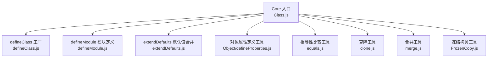
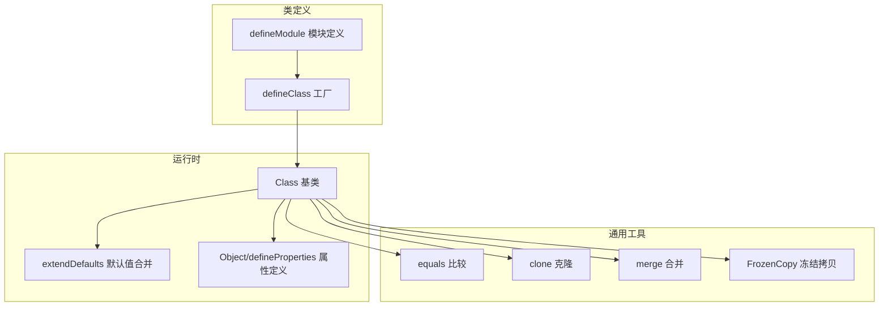
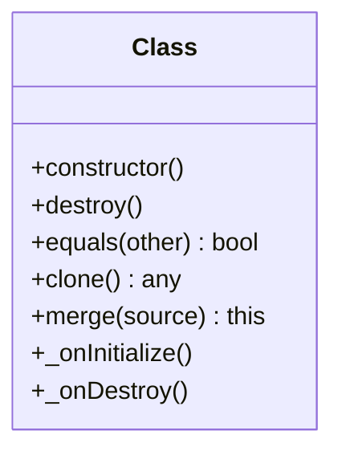
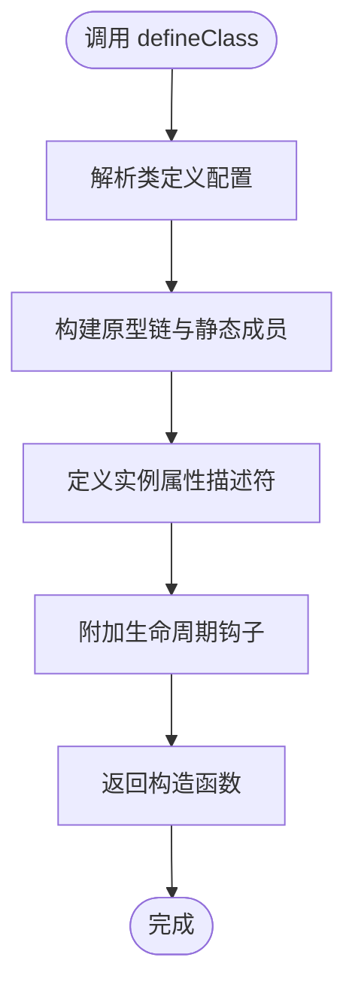
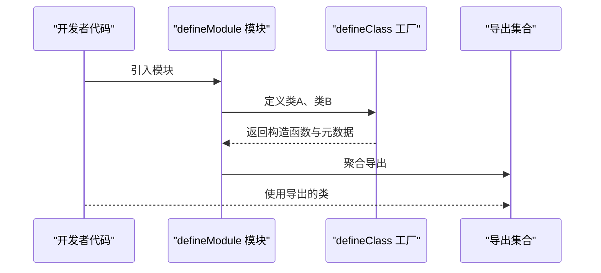
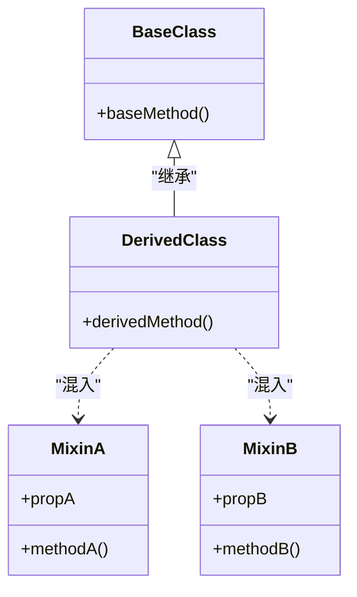
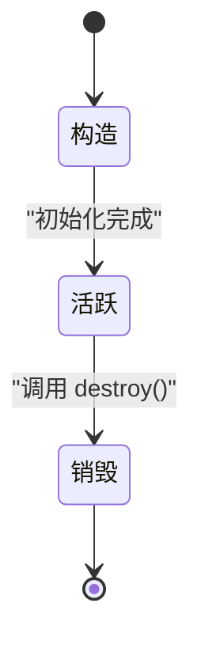
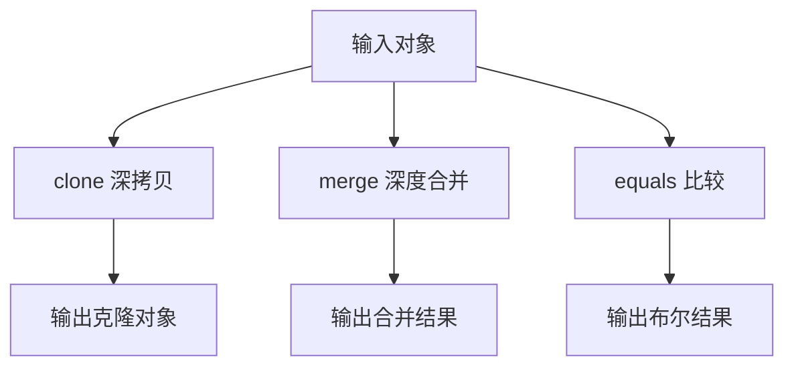
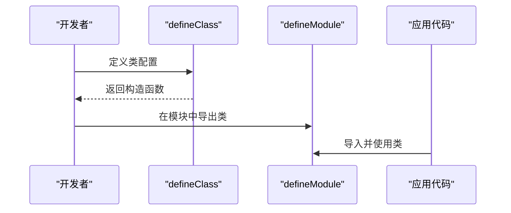
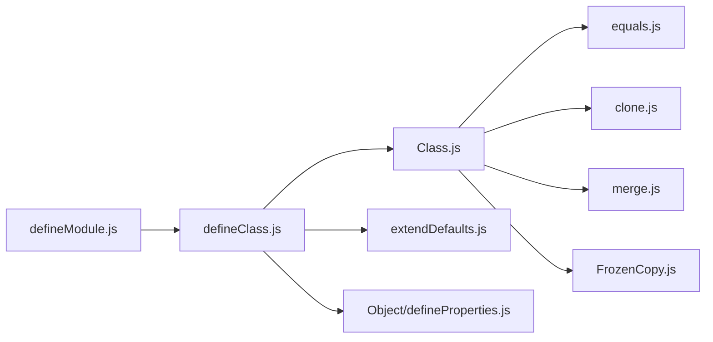

# 类系统API

<cite>
**本文引用的文件**   
- [Class.js](file://Source/Core/Class.js)
- [defineClass.js](file://Source/Core/defineClass.js)
- [defineModule.js](file://Source/Core/defineModule.js)
- [extendDefaults.js](file://Source/Core/extendDefaults.js)
- [Object.defineProperties.js](file://Source/Core/Object/defineProperties.js)
- [equals.js](file://Source/Core/equals.js)
- [clone.js](file://Source/Core/clone.js)
- [merge.js](file://Source/Core/merge.js)
- [FrozenCopy.js](file://Source/Core/FrozenCopy.js)
</cite>

## 目录
1. [简介](#简介)
2. [项目结构](#项目结构)
3. [核心组件](#核心组件)
4. [架构总览](#架构总览)
5. [详细组件分析](#详细组件分析)
6. [依赖关系分析](#依赖关系分析)
7. [性能考量](#性能考量)
8. [故障排查指南](#故障排查指南)
9. [结论](#结论)
10. [附录](#附录)

## 简介
本文件面向希望扩展 Cesium 框架的开发者，系统性梳理并文档化其“类系统”的 API 与设计模式。内容覆盖：
- Class 基类的继承机制与生命周期钩子
- defineClass 工厂函数用于声明式创建类
- defineModule 模块定义方法，统一导出与注册
- 静态属性与方法、实例属性的声明与管理
- 混入（mixin）机制与接口实现方式
- 序列化、克隆、比较等通用能力
- 自定义类创建与集成到 Cesium 生态的最佳实践

## 项目结构
Cesium 的类系统主要位于 Source/Core 目录中，围绕“声明式类定义 + 运行时元数据 + 工具库”的模式组织。下图展示了与类系统相关的核心文件及其职责分工。

图表来源
- [Class.js](file://Source/Core/Class.js)
- [defineClass.js](file://Source/Core/defineClass.js)
- [defineModule.js](file://Source/Core/defineModule.js)
- [extendDefaults.js](file://Source/Core/extendDefaults.js)
- [Object/defineProperties.js](file://Source/Core/Object/defineProperties.js)
- [equals.js](file://Source/Core/equals.js)
- [clone.js](file://Source/Core/clone.js)
- [merge.js](file://Source/Core/merge.js)
- [FrozenCopy.js](file://Source/Core/FrozenCopy.js)

章节来源
- [Class.js](file://Source/Core/Class.js)
- [defineClass.js](file://Source/Core/defineClass.js)
- [defineModule.js](file://Source/Core/defineModule.js)

## 核心组件
本节从 API 视角概述类系统的核心能力与使用要点。

- Class 基类
  - 提供统一的继承链管理、静态/实例属性描述、生命周期钩子（如构造、销毁等）、以及通用的 equals/clone/merge 等能力接入点。
  - 通过元数据驱动的方式，将“类定义”与“运行时行为”解耦，便于工具链与框架层进行增强。

- defineClass 工厂函数
  - 以声明式配置创建类，支持：
    - 指定父类与混入（mixin）
    - 声明静态属性与方法
    - 声明实例属性（含类型、默认值、是否只读、是否可变等）
    - 定义构造函数与生命周期钩子
  - 返回一个可 new 的构造函数，同时附带丰富的元信息供框架使用。

- defineModule 模块定义方法
  - 用于在模块边界内集中定义类、常量、工具函数，并提供统一的导出约定。
  - 可与 defineClass 配合，形成“模块即类集合”的组织方式。

- extendDefaults 默认值合并
  - 在类初始化或属性赋值阶段，对默认值进行安全合并，避免意外修改共享对象。

- 对象属性定义工具
  - 基于 Object.defineProperty 封装，提供一致的属性描述符设置，确保不可变性与访问器语义。

- equals/clone/merge 工具
  - equals：结构化比较两个对象（包括数组、嵌套对象、循环引用处理）。
  - clone：深拷贝对象图，支持特殊类型的克隆策略。
  - merge：深度合并多个对象，遵循不可变原则。

- FrozenCopy 冻结拷贝
  - 生成对象的冻结副本，保证不可变性，常用于快照与缓存场景。

章节来源
- [Class.js](file://Source/Core/Class.js)
- [defineClass.js](file://Source/Core/defineClass.js)
- [defineModule.js](file://Source/Core/defineModule.js)
- [extendDefaults.js](file://Source/Core/extendDefaults.js)
- [Object/defineProperties.js](file://Source/Core/Object/defineProperties.js)
- [equals.js](file://Source/Core/equals.js)
- [clone.js](file://Source/Core/clone.js)
- [merge.js](file://Source/Core/merge.js)
- [FrozenCopy.js](file://Source/Core/FrozenCopy.js)

## 架构总览
下图展示类系统在运行时的交互关系：defineClass 负责构建类与元数据；Class 基类提供运行时能力；工具库为属性、比较、克隆、合并提供支撑；defineModule 负责模块级组织与导出。

图表来源
- [defineClass.js](file://Source/Core/defineClass.js)
- [defineModule.js](file://Source/Core/defineModule.js)
- [Class.js](file://Source/Core/Class.js)
- [extendDefaults.js](file://Source/Core/extendDefaults.js)
- [Object/defineProperties.js](file://Source/Core/Object/defineProperties.js)
- [equals.js](file://Source/Core/equals.js)
- [clone.js](file://Source/Core/clone.js)
- [merge.js](file://Source/Core/merge.js)
- [FrozenCopy.js](file://Source/Core/FrozenCopy.js)

## 详细组件分析

### Class 基类
- 职责
  - 维护继承链与原型链，确保子类正确继承父类的静态与实例成员。
  - 暴露生命周期钩子（例如构造、销毁），供子类重写以实现资源管理与状态同步。
  - 提供 equals/clone/merge 的默认实现或接入点，使所有派生类具备一致的行为。
- 关键特性
  - 静态属性与方法：通过类元数据注入到构造函数上，便于框架反射与工具链发现。
  - 实例属性：由 defineClass 生成的属性描述符驱动，支持只读、默认值、变更通知等。
  - 混入（mixin）：支持多源能力组合，避免深层继承带来的脆弱性问题。
- 设计模式
  - 模板方法：在基类中定义算法骨架，子类通过覆写钩子定制行为。
  - 组合优于继承：通过 mixin 注入能力，降低耦合度。

图表来源
- [Class.js](file://Source/Core/Class.js)

章节来源
- [Class.js](file://Source/Core/Class.js)

### defineClass 工厂函数
- 职责
  - 接收类定义配置，返回一个可 new 的构造函数，并在构造函数上挂载静态成员与元数据。
  - 自动建立继承链，合并父类与 mixin 的属性与方法。
  - 为每个实例属性生成 getter/setter 或普通字段，并应用默认值与校验逻辑。
- 典型用法
  - 声明父类与 mixin
  - 定义静态属性与方法
  - 定义实例属性（名称、类型、默认值、是否只读、是否可变）
  - 定义构造函数与生命周期钩子
- 注意事项
  - 避免在默认值中使用可变对象字面量，建议使用工厂函数或 extendDefaults 合并。
  - 谨慎覆写基类钩子，确保调用 super 以保持生命周期一致性。

图表来源
- [defineClass.js](file://Source/Core/defineClass.js)

章节来源
- [defineClass.js](file://Source/Core/defineClass.js)

### defineModule 模块定义方法
- 职责
  - 在模块作用域内集中定义类、常量、工具函数，并统一导出。
  - 与 defineClass 协作，形成“模块即类集合”的组织方式，提升可读性与可维护性。
- 最佳实践
  - 将相关类放入同一模块，减少跨模块耦合。
  - 对外仅导出必要的符号，隐藏内部实现细节。

图表来源
- [defineModule.js](file://Source/Core/defineModule.js)
- [defineClass.js](file://Source/Core/defineClass.js)

章节来源
- [defineModule.js](file://Source/Core/defineModule.js)

### 混入（mixin）机制与接口实现
- 设计目标
  - 通过 mixin 组合能力，避免多重继承的复杂性。
  - 以“能力单元”的形式复用逻辑，提高内聚性。
- 实现要点
  - mixin 通常以对象形式提供方法与属性，defineClass 在构建原型时将其合并到目标类。
  - 冲突解决：后定义的 mixin 优先覆盖同名成员。
  - 接口契约：通过命名约定与文档约束，确保 mixin 的使用方遵循约定。

图表来源
- [defineClass.js](file://Source/Core/defineClass.js)

章节来源
- [defineClass.js](file://Source/Core/defineClass.js)

### 实例属性生命周期
- 生命周期阶段
  - 构造：根据配置与默认值初始化实例属性。
  - 更新：属性变更触发可能的副作用（如渲染、事件广播）。
  - 销毁：释放资源、解除订阅、清理引用。
- 钩子建议
  - 在构造钩子中绑定事件与资源。
  - 在销毁钩子中释放资源并清空引用，避免内存泄漏。
  - 在属性 setter 中执行最小化的副作用，保持响应式与性能平衡。

图表来源
- [Class.js](file://Source/Core/Class.js)

章节来源
- [Class.js](file://Source/Core/Class.js)

### 序列化、克隆、比较
- equals
  - 结构化比较两个对象，考虑数组、嵌套对象与循环引用。
  - 适用于缓存键、去重、增量更新判断。
- clone
  - 深拷贝对象图，支持特殊类型的克隆策略（如几何体、矩阵等）。
  - 适用于快照、撤销/重做、并行计算。
- merge
  - 深度合并多个对象，遵循不可变原则，返回新对象。
  - 适用于配置合并、默认值覆盖。
- FrozenCopy
  - 生成冻结副本，保证不可变性，常用于只读视图与缓存。

图表来源
- [clone.js](file://Source/Core/clone.js)
- [merge.js](file://Source/Core/merge.js)
- [equals.js](file://Source/Core/equals.js)
- [FrozenCopy.js](file://Source/Core/FrozenCopy.js)

章节来源
- [clone.js](file://Source/Core/clone.js)
- [merge.js](file://Source/Core/merge.js)
- [equals.js](file://Source/Core/equals.js)
- [FrozenCopy.js](file://Source/Core/FrozenCopy.js)

### 自定义类创建与集成指南
- 步骤概览
  - 使用 defineClass 声明类，明确父类与 mixin。
  - 定义静态属性与方法，暴露给框架与工具链。
  - 定义实例属性，合理设置默认值与只读标记。
  - 实现生命周期钩子，管理资源与副作用。
  - 使用 defineModule 组织导出，保持模块边界清晰。
- 集成建议
  - 遵循命名约定与文档规范，便于其他开发者理解。
  - 避免在属性 setter 中执行耗时操作，必要时异步化。
  - 使用 equals/clone/merge 进行状态管理与优化。

图表来源
- [defineClass.js](file://Source/Core/defineClass.js)
- [defineModule.js](file://Source/Core/defineModule.js)

章节来源
- [defineClass.js](file://Source/Core/defineClass.js)
- [defineModule.js](file://Source/Core/defineModule.js)

## 依赖关系分析
类系统内部依赖如下：
- defineClass 依赖 Class 基类与 extendDefaults、Object/defineProperties。
- Class 基类依赖 equals、clone、merge、FrozenCopy 等工具。
- defineModule 依赖 defineClass，用于模块级组织与导出。

图表来源
- [defineClass.js](file://Source/Core/defineClass.js)
- [Class.js](file://Source/Core/Class.js)
- [extendDefaults.js](file://Source/Core/extendDefaults.js)
- [Object/defineProperties.js](file://Source/Core/Object/defineProperties.js)
- [equals.js](file://Source/Core/equals.js)
- [clone.js](file://Source/Core/clone.js)
- [merge.js](file://Source/Core/merge.js)
- [FrozenCopy.js](file://Source/Core/FrozenCopy.js)
- [defineModule.js](file://Source/Core/defineModule.js)

章节来源
- [defineClass.js](file://Source/Core/defineClass.js)
- [Class.js](file://Source/Core/Class.js)
- [defineModule.js](file://Source/Core/defineModule.js)

## 性能考量
- 避免在属性 setter 中执行昂贵操作，必要时采用批处理或节流。
- 合理使用 equals 进行增量更新判断，减少不必要的重算与渲染。
- 使用 clone 与 merge 时注意对象图的规模，避免过深的拷贝路径。
- 冻结拷贝适用于只读视图，但频繁创建可能带来 GC 压力，应权衡使用频率与收益。

[本节为通用指导，不直接分析具体文件]

## 故障排查指南
- 常见问题
  - 属性未生效：检查 defineClass 的配置是否正确，默认值是否为不可变对象。
  - 生命周期未触发：确认子类是否正确覆写钩子并调用 super。
  - 内存泄漏：确保在销毁钩子中释放资源与解除订阅。
  - 比较异常：检查 equals 的实现是否覆盖所有必要字段，尤其是嵌套对象与数组。
- 调试建议
  - 打印类元数据，确认静态与实例属性已正确注入。
  - 使用 FrozenCopy 生成快照，对比前后状态差异。
  - 在 setter 中加入日志，定位副作用来源。

章节来源
- [Class.js](file://Source/Core/Class.js)
- [defineClass.js](file://Source/Core/defineClass.js)
- [equals.js](file://Source/Core/equals.js)
- [clone.js](file://Source/Core/clone.js)
- [FrozenCopy.js](file://Source/Core/FrozenCopy.js)

## 结论
Cesium 的类系统通过“声明式定义 + 运行时元数据 + 工具库”的组合，提供了稳定且可扩展的面向对象基础。开发者可以借助 defineClass 与 defineModule 快速构建符合框架约定的类，并通过 Class 基类获得一致的生命周期、比较、克隆与合并能力。遵循本文档的设计模式与最佳实践，能够显著提升代码的可维护性与性能表现。

[本节为总结，不直接分析具体文件]

## 附录
- 术语
  - 混入（mixin）：一种代码复用技术，将一组方法与属性注入到目标类中。
  - 生命周期钩子：在对象生命周期的特定阶段触发的回调，用于初始化与清理。
  - 不可变对象：创建后不可被修改的对象，适合并发与缓存场景。
- 参考
  - 如需进一步了解某个工具的详细 API，请参考对应文件的源码注释与测试用例。

[本节为补充说明，不直接分析具体文件]