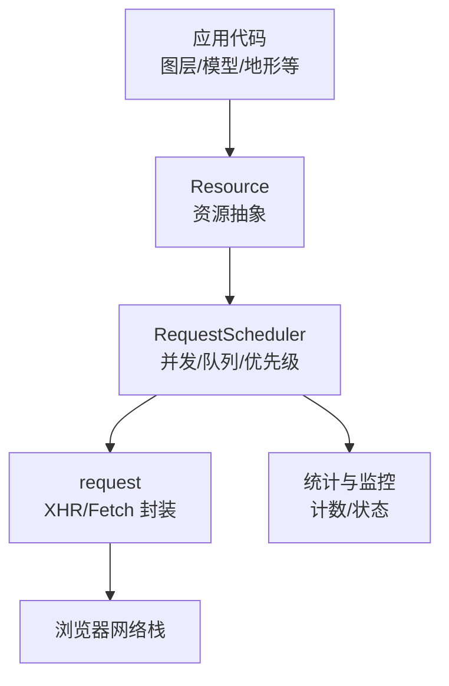
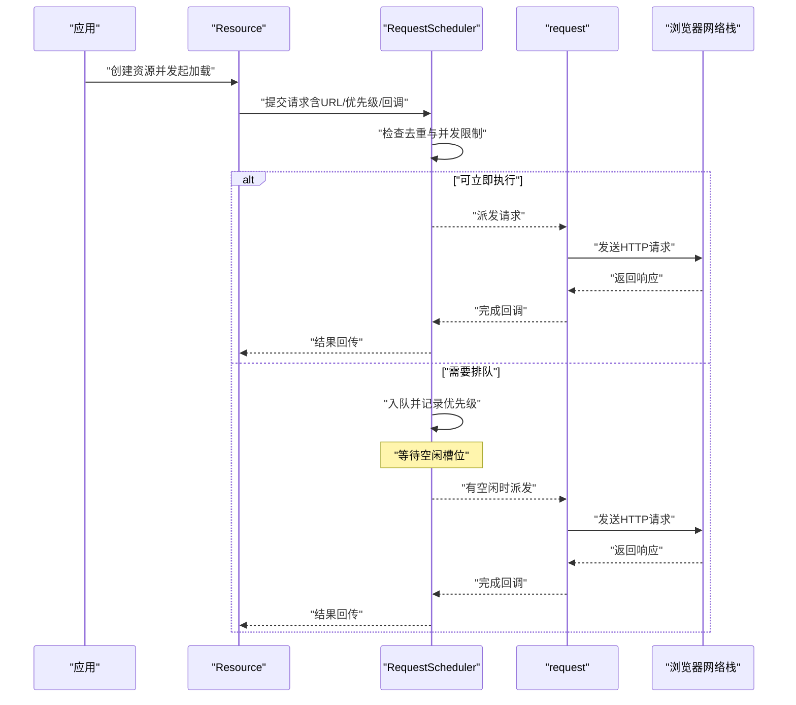
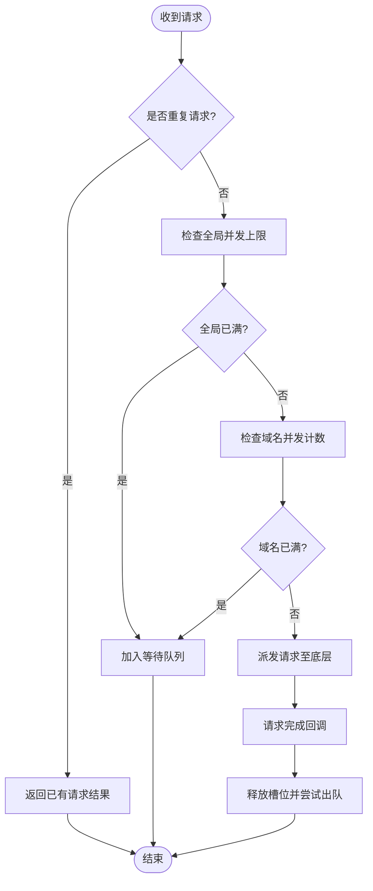
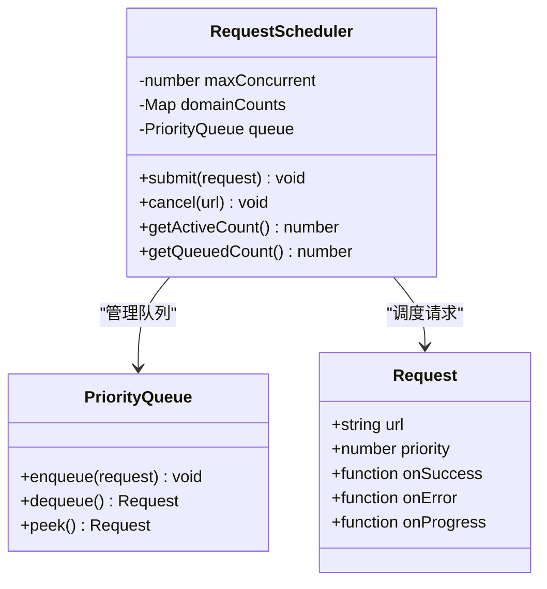
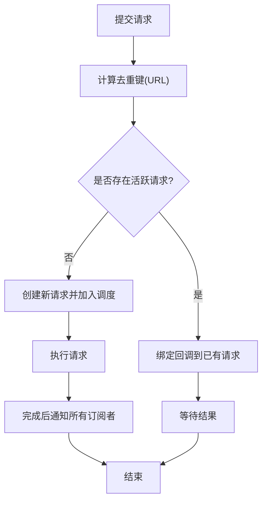

# RequestScheduler请求调度器

<cite>
**本文引用的文件**
- [RequestScheduler.js](file://Source/Core/RequestScheduler.js)
- [request.js](file://Source/Core/request.js)
- [HttpUtilities.js](file://Source/Core/HttpUtilities.js)
- [Resource.js](file://Source/Core/Resource.js)
</cite>

## 目录
1. [简介](#简介)
2. [项目结构](#项目结构)
3. [核心组件](#核心组件)
4. [架构总览](#架构总览)
5. [详细组件分析](#详细组件分析)
6. [依赖关系分析](#依赖关系分析)
7. [性能考量](#性能考量)
8. [故障排查指南](#故障排查指南)
9. [结论](#结论)
10. [附录](#附录)

## 简介
本文件面向开发者，系统性梳理 Cesium 的 RequestScheduler（请求调度器）在浏览器环境中的并发控制、队列管理、优先级调度与去重策略。内容覆盖全局并发上限、域名级并发限制、请求去重机制、配置项与监控接口、以及在高并发场景下的网络优化建议。同时结合源码实现，给出流程图与时序图，帮助理解网络拥塞控制与负载均衡的实现原理。

## 项目结构
Cesium 的网络请求由多个模块协作完成：
- RequestScheduler：负责全局与域名级的并发控制、队列管理与优先级调度。
- request：封装底层 HTTP 请求（XMLHttpRequest/Fetch），提供统一的请求生命周期回调。
- HttpUtilities：HTTP 工具函数，如 URL 规范化、头部处理等。
- Resource：资源加载抽象，向上层提供缓存、重试、错误处理等能力，并调用 RequestScheduler 进行调度。

图表来源
- [RequestScheduler.js](file://Source/Core/RequestScheduler.js)
- [request.js](file://Source/Core/request.js)
- [Resource.js](file://Source/Core/Resource.js)

章节来源
- [RequestScheduler.js](file://Source/Core/RequestScheduler.js)
- [request.js](file://Source/Core/request.js)
- [HttpUtilities.js](file://Source/Core/HttpUtilities.js)
- [Resource.js](file://Source/Core/Resource.js)

## 核心组件
- 全局并发限制：通过最大并发数限制整体请求吞吐，避免浏览器或服务器过载。
- 域名级并发控制：按主机名划分并发配额，防止单一域名占用过多连接。
- 队列与优先级：请求进入等待队列，根据优先级决定出队顺序。
- 请求去重：对相同 URL 的请求进行合并，减少重复网络开销。
- 监控与统计：暴露当前活跃请求数、各域名并发计数、队列长度等指标。

章节来源
- [RequestScheduler.js](file://Source/Core/RequestScheduler.js)
- [request.js](file://Source/Core/request.js)

## 架构总览
下图展示了从上层资源加载到实际网络请求的完整流程，以及调度器在各环节的作用点。

图表来源
- [RequestScheduler.js](file://Source/Core/RequestScheduler.js)
- [request.js](file://Source/Core/request.js)
- [Resource.js](file://Source/Core/Resource.js)

## 详细组件分析

### 并发控制与队列管理
- 全局并发上限：维护一个全局计数器，当达到上限时新请求进入等待队列。
- 域名级并发：以主机名为键维护并发计数，确保同一域名的并发不超过阈值。
- 队列数据结构：使用优先队列存储待执行请求，按优先级从高到低出队。
- 出队策略：每当有请求完成释放槽位，调度器从队列中取出最高优先级请求执行。

图表来源
- [RequestScheduler.js](file://Source/Core/RequestScheduler.js)

章节来源
- [RequestScheduler.js](file://Source/Core/RequestScheduler.js)

### 优先级调度机制
- 优先级定义：请求对象携带优先级字段，数值越小优先级越高（或反之，取决于实现约定）。
- 排序策略：优先队列内部按优先级排序，保证高优先级请求先于低优先级请求执行。
- 动态调整：可在某些场景下调整请求优先级，例如关键资源加载优先。

图表来源
- [RequestScheduler.js](file://Source/Core/RequestScheduler.js)

章节来源
- [RequestScheduler.js](file://Source/Core/RequestScheduler.js)

### 请求去重策略
- 去重键：通常基于 URL 字符串（可能包含查询参数）作为唯一标识。
- 合并逻辑：若相同 URL 已存在活跃请求，则复用该请求的结果，避免重复网络传输。
- 失效策略：可根据缓存时间或版本信息决定是否允许重复请求。

图表来源
- [RequestScheduler.js](file://Source/Core/RequestScheduler.js)

章节来源
- [RequestScheduler.js](file://Source/Core/RequestScheduler.js)

### 监控接口与性能统计
- 活跃请求数：获取当前正在执行的请求数量。
- 队列长度：获取等待执行的请求数量。
- 域名并发计数：查看各域名的当前并发数，便于定位热点域名。
- 事件回调：可通过回调监听请求开始、完成、失败等事件，用于埋点与诊断。

章节来源
- [RequestScheduler.js](file://Source/Core/RequestScheduler.js)

### 与底层请求封装的集成
- request 模块：统一封装 XHR/Fetch，提供请求生命周期钩子（开始、进度、完成、错误）。
- 集成方式：RequestScheduler 在派发请求时调用 request，并在回调中更新计数与队列状态。
- 错误处理：将底层错误透传给上层，支持重试与降级策略。

章节来源
- [request.js](file://Source/Core/request.js)
- [HttpUtilities.js](file://Source/Core/HttpUtilities.js)

### 与资源加载的集成
- Resource 抽象：为不同资源类型（图片、模型、地形等）提供统一加载接口。
- 调度接入：Resource 在发起加载前调用 RequestScheduler.submit，确保受控并发与去重。
- 缓存与重试：Resource 层可结合本地缓存与重试策略，提升鲁棒性。

章节来源
- [Resource.js](file://Source/Core/Resource.js)

## 依赖关系分析
- RequestScheduler 依赖 request 进行实际网络通信。
- Resource 依赖 RequestScheduler 进行调度。
- HttpUtilities 被 request 使用，提供 URL 与头部处理工具。

图表来源
- [Resource.js](file://Source/Core/Resource.js)
- [RequestScheduler.js](file://Source/Core/RequestScheduler.js)
- [request.js](file://Source/Core/request.js)
- [HttpUtilities.js](file://Source/Core/HttpUtilities.js)

章节来源
- [Resource.js](file://Source/Core/Resource.js)
- [RequestScheduler.js](file://Source/Core/RequestScheduler.js)
- [request.js](file://Source/Core/request.js)
- [HttpUtilities.js](file://Source/Core/HttpUtilities.js)

## 性能考量
- 合理设置全局并发上限：避免浏览器连接池耗尽导致阻塞。
- 域名级并发阈值：针对热点域名降低并发，防止单点拥塞。
- 请求去重：显著减少重复下载，尤其在批量加载相同资源时。
- 优先级分配：关键资源（首屏、交互相关）赋予更高优先级，提升用户体验。
- 监控与告警：通过统计接口观察队列积压与活跃数，及时调优。

[本节为通用指导，不直接分析具体文件]

## 故障排查指南
- 症状：大量请求排队，页面卡顿
  - 排查：检查全局并发上限与域名并发阈值是否过低；查看队列长度与活跃数。
- 症状：重复请求导致带宽浪费
  - 排查：确认去重键是否正确；检查是否有不同 URL 但语义相同的请求。
- 症状：特定域名频繁超时
  - 排查：降低该域名并发；启用重试与退避策略；检查服务端限流。
- 症状：优先级未生效
  - 排查：确认请求对象的优先级字段设置正确；检查队列排序逻辑。

章节来源
- [RequestScheduler.js](file://Source/Core/RequestScheduler.js)
- [request.js](file://Source/Core/request.js)

## 结论
RequestScheduler 通过全局与域名级并发控制、优先级队列与请求去重，有效提升了 Cesium 在高并发场景下的网络吞吐与稳定性。配合监控接口与合理的配置调优，可在复杂数据加载场景中保持流畅体验。开发者应结合业务特点设置合适的并发阈值与优先级策略，充分利用调度器的能力。

[本节为总结，不直接分析具体文件]

## 附录
- 配置建议：
  - 全局并发：根据目标设备与网络环境设定，移动端建议较低值。
  - 域名并发：热点域名适当降低，冷数据域名可适当提高。
  - 优先级：首屏与交互相关资源设为高优先级。
- 最佳实践：
  - 使用去重避免重复下载。
  - 结合 Resource 层的缓存与重试机制。
  - 定期采集监控指标，持续优化。

[本节为补充说明，不直接分析具体文件]