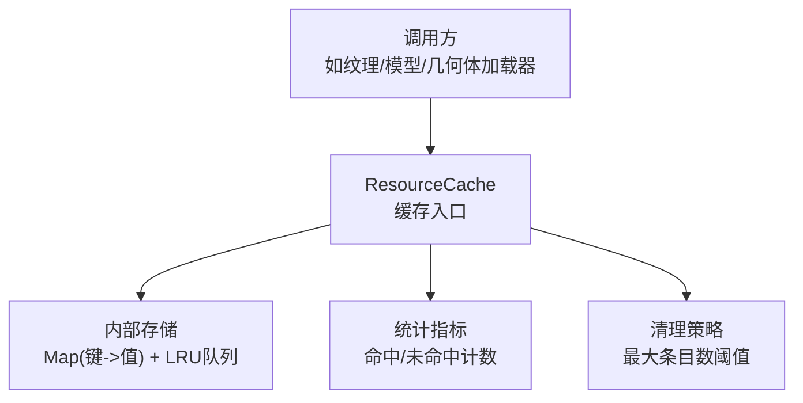
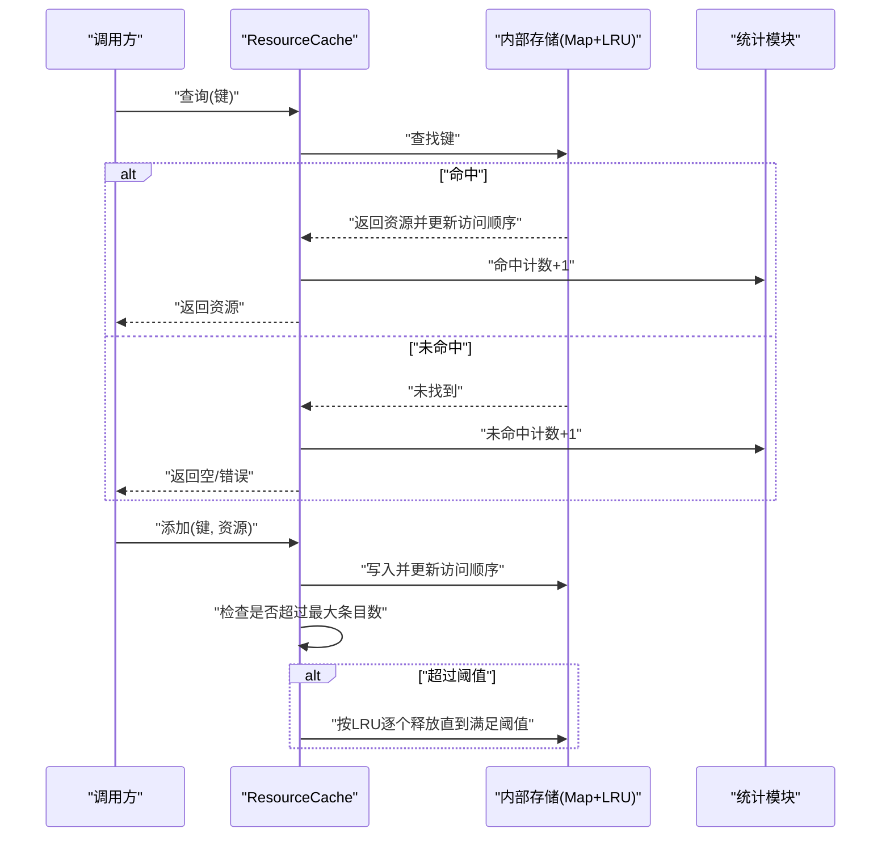
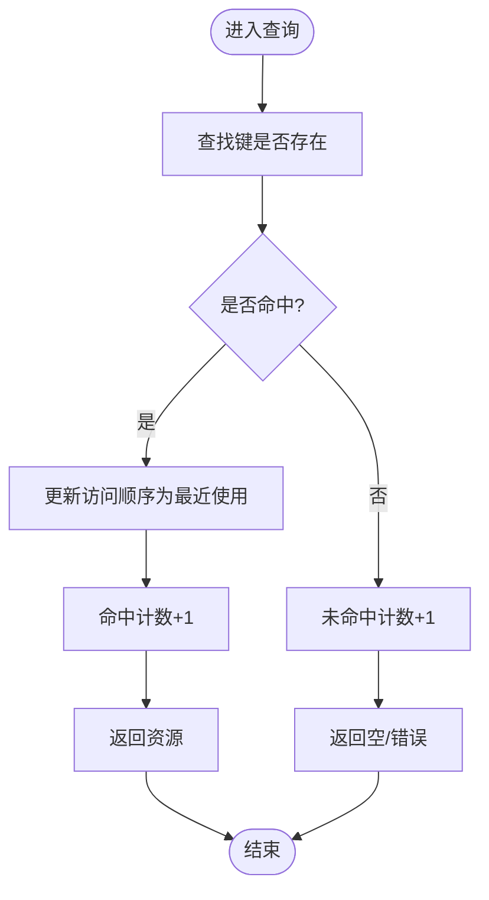
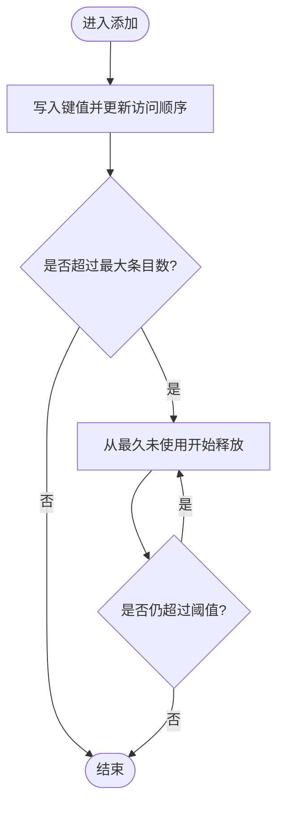
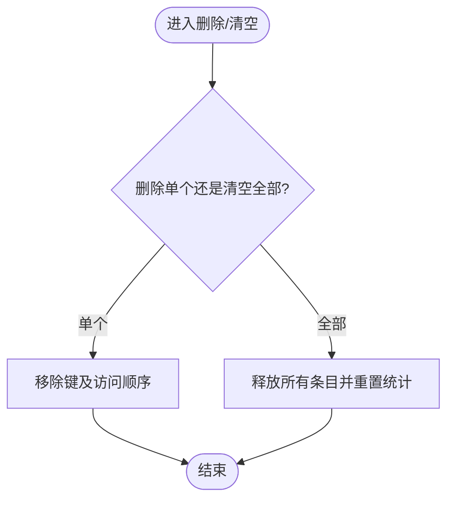
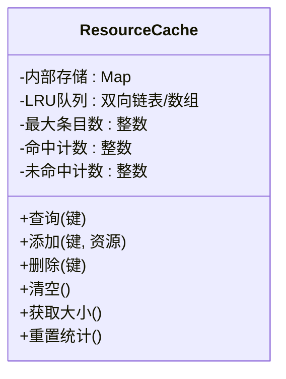
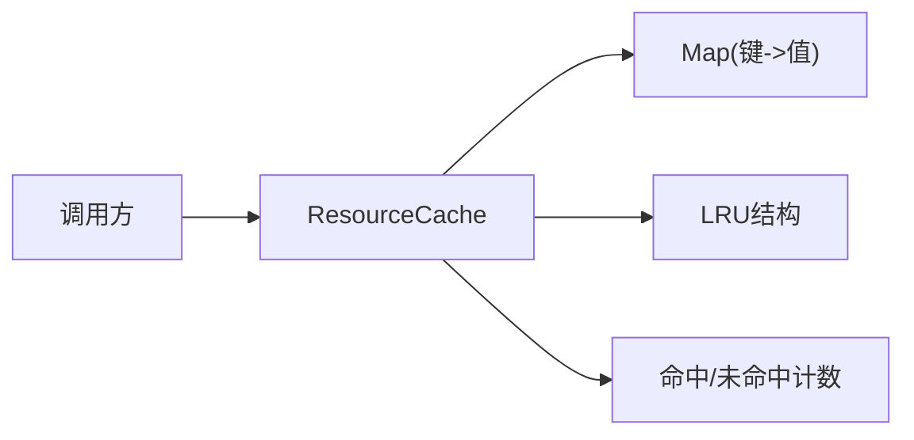

# ResourceCache资源缓存

<cite>
**本文引用的文件**   
- [ResourceCache.js](file://Source/Core/ResourceCache.js)
</cite>

## 目录
1. [简介](#简介)
2. [项目结构](#项目结构)
3. [核心组件](#核心组件)
4. [架构总览](#架构总览)
5. [详细组件分析](#详细组件分析)
6. [依赖分析](#依赖分析)
7. [性能考虑](#性能考虑)
8. [故障排查指南](#故障排查指南)
9. [结论](#结论)
10. [附录](#附录) 

## 简介
本文件为 Cesium 的 ResourceCache 资源缓存系统的 API 与实现文档。重点覆盖：
- 缓存策略与内存管理
- 缓存清理机制（最大条目数、LRU 淘汰）
- 缓存键生成规则
- 查询、添加、删除等常用操作的使用说明
- 命中率监控与性能调优建议
- 面向开发者的配置策略与内存优化方案

## 项目结构
ResourceCache 位于 Source/Core 目录下，作为通用资源缓存模块被上层渲染管线与数据加载流程使用。其职责是统一管理“资源键 -> 资源对象”的映射，并在达到容量上限时按 LRU 策略释放旧资源，从而控制内存占用并提升热点资源的命中效率。

[本节不直接分析具体源码文件，故无“章节来源”]

## 核心组件
- ResourceCache 类
  - 负责维护资源键到资源对象的映射
  - 维护访问顺序以支持 LRU 淘汰
  - 提供查询、插入、删除、清空、获取大小与重置统计等接口
  - 在插入或查询后根据最大条目数进行自动清理

关键能力概览：
- 缓存查询：通过键检索资源，命中则更新访问顺序
- 缓存添加：将新资源写入缓存，必要时触发 LRU 淘汰
- 缓存删除：显式移除指定键的资源
- 缓存清理：当条目数超过阈值时，从最久未使用的项开始释放
- 统计与监控：记录命中与未命中次数，便于计算命中率

**章节来源**
- [ResourceCache.js](file://Source/Core/ResourceCache.js)

## 架构总览
下图展示了 ResourceCache 在典型请求路径中的角色与交互关系。

**图表来源**
- [ResourceCache.js](file://Source/Core/ResourceCache.js)

**章节来源**
- [ResourceCache.js](file://Source/Core/ResourceCache.js)

## 详细组件分析

### 缓存键生成规则
- 键的唯一性决定缓存命中效果。通常由资源标识（如 URL、ID、版本、参数哈希等）组合而成。
- 为保证稳定性与可预测性，建议对键进行规范化处理（例如去除尾随斜杠、统一大小写、排序查询参数等）。
- 若资源存在多份副本（不同分辨率/格式），应在键中体现差异维度，避免误命中。

[本节为概念性说明，不直接分析具体源码文件，故无“章节来源”]

### 缓存查询流程
- 输入：资源键
- 行为：
  - 在内部存储中查找键
  - 命中则更新该键的访问顺序（使其成为最近使用）
  - 更新命中统计
- 输出：资源对象或空值

**图表来源**
- [ResourceCache.js](file://Source/Core/ResourceCache.js)

**章节来源**
- [ResourceCache.js](file://Source/Core/ResourceCache.js)

### 缓存添加与自动清理（LRU）
- 输入：资源键、资源对象
- 行为：
  - 将键值对写入内部存储
  - 更新访问顺序为最近使用
  - 若当前条目数超过最大条目数，则从最久未使用的项开始逐个释放，直至满足阈值
- 输出：成功/失败状态或资源引用

**图表来源**
- [ResourceCache.js](file://Source/Core/ResourceCache.js)

**章节来源**
- [ResourceCache.js](file://Source/Core/ResourceCache.js)

### 缓存删除与清空
- 删除指定键：从内部存储移除对应条目，并从 LRU 结构中移除访问顺序记录
- 清空所有：释放全部条目并重置统计信息

**图表来源**
- [ResourceCache.js](file://Source/Core/ResourceCache.js)

**章节来源**
- [ResourceCache.js](file://Source/Core/ResourceCache.js)

### 统计与命中率监控
- 统计项：
  - 命中次数
  - 未命中次数
  - 当前条目数
  - 最大条目数
- 命中率计算：
  - 命中率 = 命中次数 / (命中次数 + 未命中次数)
- 用途：
  - 评估缓存有效性
  - 指导调整最大条目数与键设计

**图表来源**
- [ResourceCache.js](file://Source/Core/ResourceCache.js)

**章节来源**
- [ResourceCache.js](file://Source/Core/ResourceCache.js)

## 依赖分析
- 内部依赖
  - 数据结构：Map（键值映射）、LRU 结构（用于维护访问顺序）
  - 计数器：命中/未命中计数
- 外部依赖
  - 调用方：纹理、模型、几何体等资源加载器
  - 资源对象：由调用方创建并交由缓存持有

**图表来源**
- [ResourceCache.js](file://Source/Core/ResourceCache.js)

**章节来源**
- [ResourceCache.js](file://Source/Core/ResourceCache.js)

## 性能考虑
- 键设计
  - 确保唯一性与稳定性，避免频繁变更导致缓存抖动
  - 对可变参数进行规范化，减少无效键膨胀
- 容量规划
  - 根据设备内存与应用场景设置合理的最大条目数
  - 大对象优先限制数量，小对象可适当放宽
- LRU 成本
  - 每次查询与插入需更新访问顺序，注意避免在热路径中进行昂贵操作
- 统计开销
  - 统计字段读写成本低，但高频调用下仍需关注整体 CPU 占用
- 内存回收
  - 确保资源对象在从缓存移除后能被垃圾回收（避免循环引用）

[本节为通用性能建议，不直接分析具体源码文件，故无“章节来源”]

## 故障排查指南
- 症状：内存持续增长
  - 可能原因：最大条目数过大、键空间爆炸、资源对象未被正确释放
  - 排查步骤：
    - 检查最大条目数配置
    - 分析键分布与重复率
    - 确认资源对象生命周期与引用关系
- 症状：命中率低
  - 可能原因：键不稳定、资源粒度太细、容量过小导致频繁淘汰
  - 排查步骤：
    - 校验键生成逻辑
    - 合并相近粒度的资源
    - 适当增大最大条目数
- 症状：卡顿或帧率下降
  - 可能原因：热路径上频繁的 LRU 更新与清理
  - 排查步骤：
    - 降低查询频率或批量处理
    - 预取热点资源，减少运行时查询

[本节为通用排障建议，不直接分析具体源码文件，故无“章节来源”]

## 结论
ResourceCache 通过“Map + LRU”的组合实现了高效且可控的资源缓存策略。合理设计键、设定合适的容量阈值、结合命中率监控进行持续调优，可在保证内存占用的同时显著提升热点资源的访问效率。

[本节为总结性内容，不直接分析具体源码文件，故无“章节来源”]

## 附录

### 常用 API 参考（方法级说明）
- 查询(键)
  - 功能：根据键获取资源；命中则更新访问顺序并增加命中计数
  - 返回值：资源对象或空值
- 添加(键, 资源)
  - 功能：将资源加入缓存；若超过最大条目数则按 LRU 淘汰
  - 返回值：成功/失败状态或资源引用
- 删除(键)
  - 功能：移除指定键的资源及其访问顺序
- 清空()
  - 功能：释放所有资源并重置统计
- 获取大小()
  - 功能：返回当前缓存条目数
- 重置统计()
  - 功能：清零命中/未命中计数

**章节来源**
- [ResourceCache.js](file://Source/Core/ResourceCache.js)