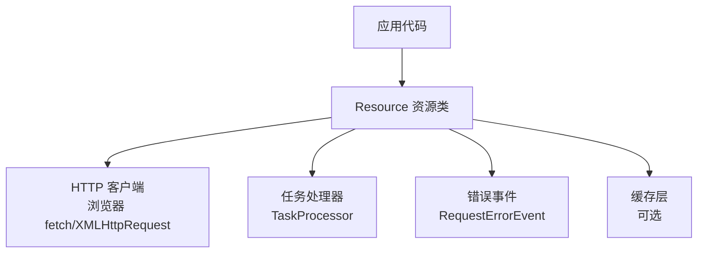
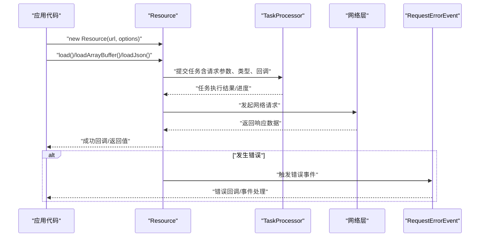
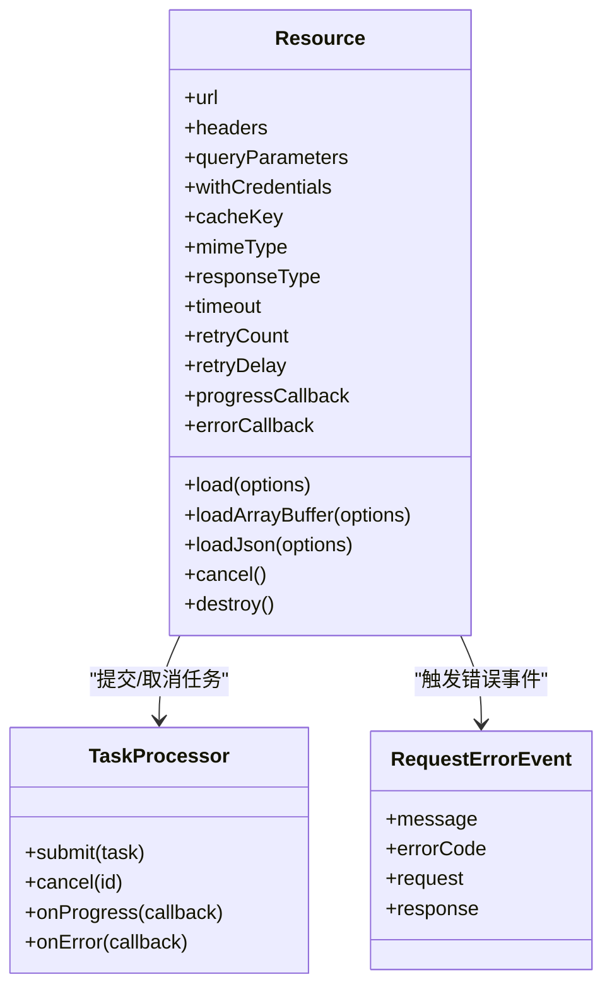

# Resource资源类

<cite>
**本文引用的文件**   
- [Resource.js](file://Source/Core/Resource.js)
- [RequestErrorEvent.js](file://Source/Core/RequestErrorEvent.js")
- [TaskProcessor.js](file://Source/Core/TaskProcessor.js")
- [createTaskProcessor.js](file://Source/Core/createTaskProcessor.js")
</cite>

## 目录
1. [简介](#简介)
2. [项目结构](#项目结构)
3. [核心组件](#核心组件)
4. [架构总览](#架构总览)
5. [详细组件分析](#详细组件分析)
6. [依赖关系分析](#依赖关系分析)
7. [性能考虑](#性能考虑)
8. [故障排除指南](#故障排除指南)
9. [结论](#结论)
10. [附录](#附录)

## 简介
本文件为 Cesium 的 Resource 资源类的权威 API 文档，聚焦于：
- 构造函数与属性配置（URL、请求头、缓存策略等）
- 生命周期管理（创建、加载、取消、销毁）
- 异步加载方法 load()、loadArrayBuffer()、loadJson() 的使用方式
- 进度回调、超时控制、重试机制的配置选项
- 错误处理机制与最佳实践
- 常见问题排查指引

## 项目结构
Resource 位于 Source/Core 目录，是 Cesium 网络资源访问的核心抽象。它封装了 HTTP 请求、类型推断、缓存、任务调度与错误事件等能力，供影像、地形、模型、纹理等资源统一使用。

[无图表来源；该图为概念性结构示意]

## 核心组件
本节概述 Resource 的关键职责与对外接口要点：
- 构造与配置
  - 通过 URL 或对象字面量初始化，支持设置请求头、查询参数、跨域凭据、缓存策略等
  - 可指定目标数据类型（如 arraybuffer、json、blob、text、image 等），用于自动解析与转换
- 生命周期
  - 创建后可多次调用加载方法；支持取消正在进行的请求
  - 提供销毁接口以释放内部资源与监听器
- 加载方法
  - load(): 根据目标类型返回对应数据
  - loadArrayBuffer(): 返回 ArrayBuffer
  - loadJson(): 返回 JSON 对象
  - 其他便捷方法（如 loadBlob、loadText、loadImage 等）
- 进度与状态
  - 可通过回调或事件获取进度信息
  - 暴露当前状态（未开始、进行中、已完成、已失败、已取消）
- 错误处理
  - 统一的 RequestErrorEvent 事件，包含错误码、消息、原始响应等上下文
- 高级特性
  - 超时控制、重试策略、并发限制、缓存键生成、条件请求（ETag/If-None-Match）等

章节来源
- [Resource.js](file://Source/Core/Resource.js)

## 架构总览
Resource 在整体系统中的角色与交互如下：

图表来源
- [Resource.js](file://Source/Core/Resource.js)
- [TaskProcessor.js](file://Source/Core/TaskProcessor.js)
- [createTaskProcessor.js](file://Source/Core/createTaskProcessor.js)
- [RequestErrorEvent.js](file://Source/Core/RequestErrorEvent.js)

章节来源
- [Resource.js](file://Source/Core/Resource.js)
- [TaskProcessor.js](file://Source/Core/TaskProcessor.js)
- [createTaskProcessor.js](file://Source/Core/createTaskProcessor.js)
- [RequestErrorEvent.js](file://Source/Core/RequestErrorEvent.js)

## 详细组件分析

### 构造函数与属性配置
- 构造入口
  - new Resource(url, options)
  - url 可为字符串或对象（含 url、headers、queryParameters、withCredentials、cacheKey、mimeType 等）
- 关键属性
  - url: 最终请求地址（支持相对路径解析）
  - headers: 自定义请求头
  - queryParameters: 查询参数对象
  - withCredentials: 是否携带凭据（cookies、授权头等）
  - cacheKey: 自定义缓存键；若未提供，默认基于 url + headers + queryParameters 计算
  - mimeType: 目标 MIME 类型，影响解析行为
  - responseType: 底层响应类型（arraybuffer、json、blob、text、document 等）
  - timeout: 请求超时时间（毫秒）
  - retryCount/retryDelay: 重试次数与延迟策略
  - progressCallback: 进度回调函数
  - errorCallback: 错误回调函数
- 配置优先级
  - 构造时传入 > 实例属性设置 > 全局默认值（如有）
- 注意事项
  - 修改 url/headers/queryParameters 后，建议更新 cacheKey 以避免命中旧缓存
  - 跨域场景需确保服务端正确配置 CORS 与 Access-Control-* 头

章节来源
- [Resource.js](file://Source/Core/Resource.js)

### 生命周期管理
- 创建阶段
  - 校验并规范化 URL、合并请求头、计算缓存键
- 加载阶段
  - 进入“进行中”状态，提交任务到 TaskProcessor
  - 根据 responseType 进行数据转换（如 JSON 解析、二进制转 ArrayBuffer）
- 完成阶段
  - 成功：触发成功回调/返回 Promise，更新状态为“已完成”
  - 失败：触发错误事件/回调，记录错误上下文
  - 取消：中断请求，清理监听器，状态置为“已取消”
- 销毁阶段
  - 释放内部引用、移除事件监听、停止后台任务

章节来源
- [Resource.js](file://Source/Core/Resource.js)
- [TaskProcessor.js](file://Source/Core/TaskProcessor.js)

### 异步加载方法
- load(options?)
  - 通用加载入口，按 responseType 返回相应类型
  - 支持覆盖构造时的部分选项（如 headers、timeout）
- loadArrayBuffer(options?)
  - 明确返回 ArrayBuffer，适合二进制数据（纹理、模型等）
- loadJson(options?)
  - 自动解析 JSON，返回对象
- 其他便捷方法
  - loadBlob/loadText/loadImage 等，内部委托至 load() 并设置合适的 responseType/mimeType

使用示例（描述性）
- 加载 JSON 配置：
  - 创建 Resource(url)
  - 调用 loadJson()
  - 在 then/catch 中处理成功/失败
- 加载二进制纹理：
  - 创建 Resource(imageUrl)
  - 调用 loadArrayBuffer()
  - 将 ArrayBuffer 交给图形 API 或解码器
- 带进度与超时的图片加载：
  - 设置 progressCallback 与 timeout
  - 调用 loadImage() 或 load() 并指定 responseType 为 blob/image

章节来源
- [Resource.js](file://Source/Core/Resource.js)

### 进度回调与状态
- 进度回调
  - progressCallback({loaded, total}) 或百分比形式
  - 适用于大文件下载、分片加载等场景
- 状态枚举
  - 未开始、进行中、已完成、已失败、已取消
- 状态变更通知
  - 可通过事件或属性读取当前状态

章节来源
- [Resource.js](file://Source/Core/Resource.js)

### 超时控制与重试机制
- 超时控制
  - timeout 毫秒数；超过阈值触发错误事件
  - 可与取消逻辑配合，避免长时间阻塞
- 重试机制
  - retryCount: 最大重试次数
  - retryDelay: 每次重试的等待时间（固定或指数退避）
  - 仅对可重试错误生效（如网络抖动、临时 5xx）
- 取消请求
  - 调用 cancel() 终止当前请求，清理资源

章节来源
- [Resource.js](file://Source/Core/Resource.js)

### 缓存策略
- 缓存键生成
  - 默认基于 url + headers + queryParameters 计算稳定键
  - 可自定义 cacheKey 实现版本化或灰度策略
- 条件请求
  - 支持 If-None-Match/ETag 等头部，减少带宽消耗
- 缓存失效
  - 修改 headers/queryParameters 后应更新 cacheKey
  - 提供强制刷新选项（忽略缓存）

章节来源
- [Resource.js](file://Source/Core/Resource.js)

### 错误处理机制
- 错误事件
  - RequestErrorEvent 包含错误码、消息、原始响应、请求信息等
- 错误分类
  - 网络错误、超时、解析错误、权限/CORS 错误、服务器错误等
- 处理建议
  - 订阅错误事件，记录日志与指标
  - 结合重试与降级策略提升鲁棒性

章节来源
- [Resource.js](file://Source/Core/Resource.js)
- [RequestErrorEvent.js](file://Source/Core/RequestErrorEvent.js)

### 与任务处理器集成
- 任务调度
  - Resource 将请求包装为任务，交由 TaskProcessor 执行
  - 支持并发限制、队列管理与取消
- 任务结果
  - 成功：返回数据或中间对象
  - 失败：抛出错误或触发错误事件

章节来源
- [Resource.js](file://Source/Core/Resource.js)
- [TaskProcessor.js](file://Source/Core/TaskProcessor.js)
- [createTaskProcessor.js](file://Source/Core/createTaskProcessor.js)

## 依赖关系分析
Resource 的依赖关系如下：

图表来源
- [Resource.js](file://Source/Core/Resource.js)
- [TaskProcessor.js](file://Source/Core/TaskProcessor.js)
- [RequestErrorEvent.js](file://Source/Core/RequestErrorEvent.js)

章节来源
- [Resource.js](file://Source/Core/Resource.js)
- [TaskProcessor.js](file://Source/Core/TaskProcessor.js)
- [RequestErrorEvent.js](file://Source/Core/RequestErrorEvent.js)

## 性能考虑
- 合理设置 responseType，避免不必要的二次转换
- 利用缓存键与条件请求减少重复下载
- 控制并发与队列长度，避免拥塞
- 为大文件启用分块/断点续传（由上层 Provider 组合实现）
- 谨慎使用重试，避免雪崩效应；结合指数退避与熔断策略

[本节为通用指导，不直接分析具体文件]

## 故障排除指南
- 常见错误码与原因
  - 网络不可达、DNS 解析失败、CORS 拒绝、超时、JSON 解析失败、MIME 不匹配等
- 定位步骤
  - 检查 URL 与跨域配置
  - 查看 RequestErrorEvent 中的 request/response 上下文
  - 确认 headers 与 withCredentials 是否符合服务端要求
  - 验证 cacheKey 是否导致命中过期缓存
- 恢复策略
  - 增加超时与重试上限
  - 切换备用源或降级策略
  - 清理缓存键并强制刷新

章节来源
- [Resource.js](file://Source/Core/Resource.js)
- [RequestErrorEvent.js](file://Source/Core/RequestErrorEvent.js)

## 结论
Resource 提供了统一、健壮且可扩展的资源加载抽象，覆盖从基础 HTTP 请求到高级缓存、重试、任务调度的完整链路。遵循本文的最佳实践与排障建议，可在复杂网络环境下获得稳定高效的资源加载体验。

[本节为总结性内容，不直接分析具体文件]

## 附录

### 快速参考：常用方法与配置项
- 构造与配置
  - new Resource(url, options)
  - 关键选项：headers、queryParameters、withCredentials、cacheKey、mimeType、responseType、timeout、retryCount、retryDelay、progressCallback、errorCallback
- 加载方法
  - load(options?)
  - loadArrayBuffer(options?)
  - loadJson(options?)
- 生命周期
  - cancel()
  - destroy()

章节来源
- [Resource.js](file://Source/Core/Resource.js)