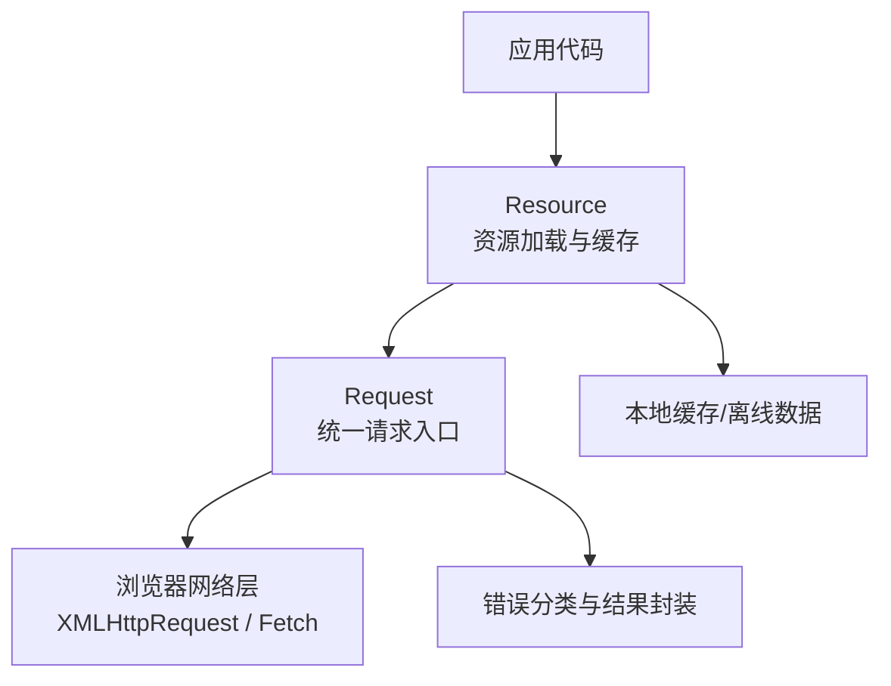
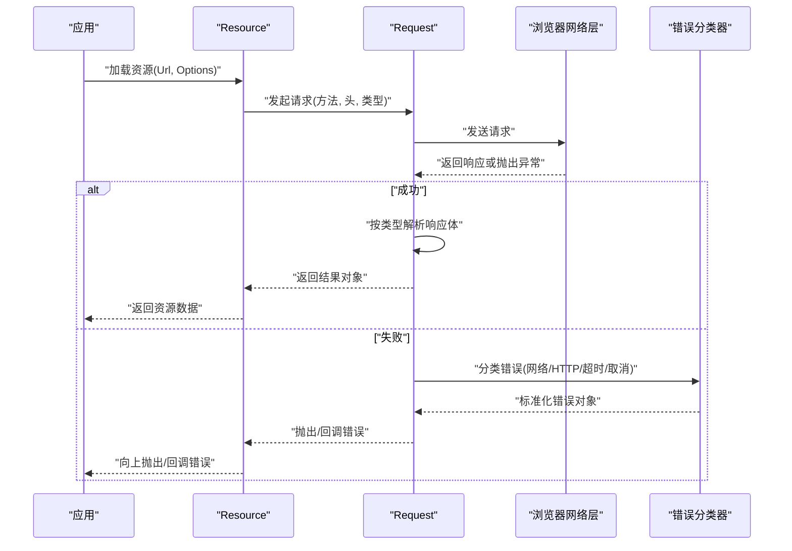
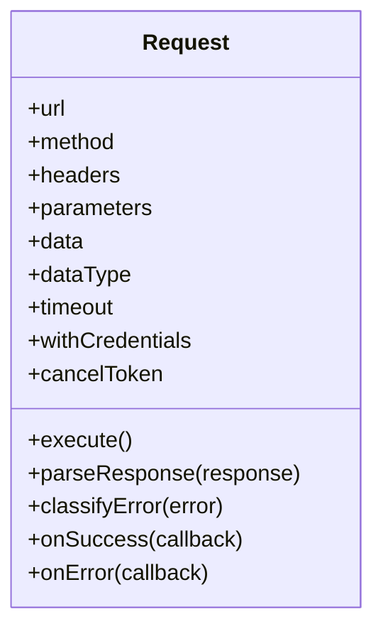
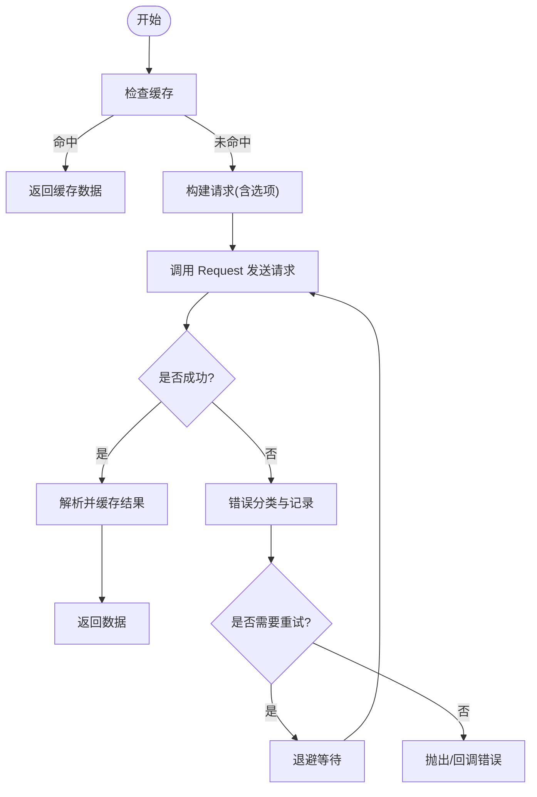
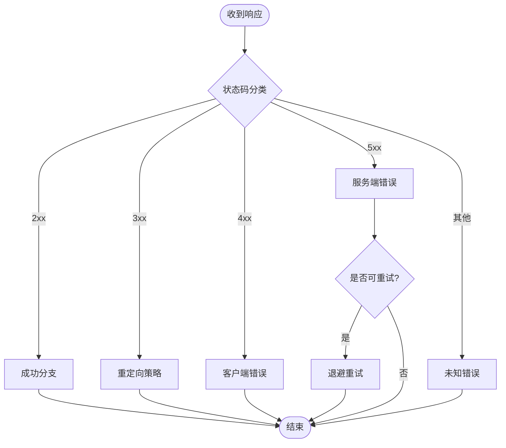
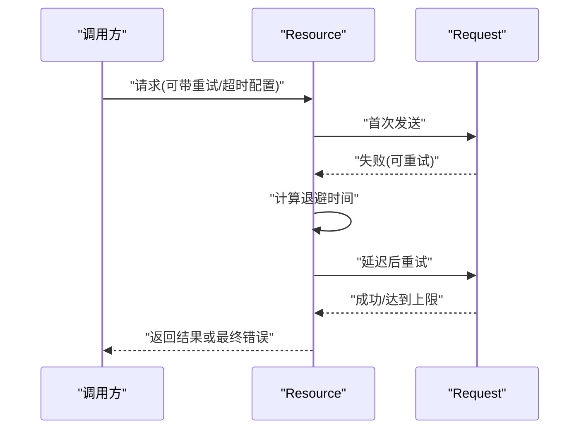
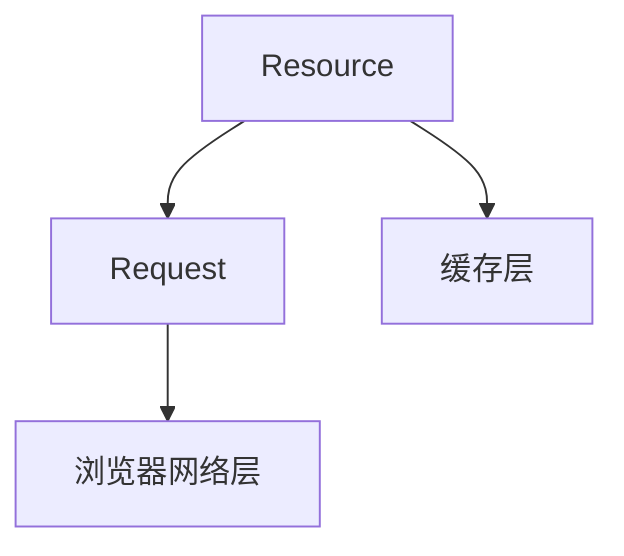

# 请求处理与错误管理

<cite>
**本文引用的文件**   
- [Request.js](file://Source/Core/Request.js)
- [Resource.js](file://Source/Core/Resource.js)
- [OfflineGuide README.md](file://Documentation/OfflineGuide/README.md)
</cite>

## 目录
1. [简介](#简介)
2. [项目结构](#项目结构)
3. [核心组件](#核心组件)
4. [架构总览](#架构总览)
5. [详细组件分析](#详细组件分析)
6. [依赖关系分析](#依赖关系分析)
7. [性能考虑](#性能考虑)
8. [故障排查指南](#故障排查指南)
9. [结论](#结论)
10. [附录](#附录)

## 简介
本文件聚焦 Cesium 的网络请求处理与错误管理能力，围绕 Request 类的请求构建、响应处理、错误分类机制展开，涵盖 HTTP 状态码处理、网络异常捕获、超时与重试策略，并提供自定义请求拦截器与响应转换器的实现方法。同时说明离线模式支持、网络状态检测与降级处理方案，帮助开发者构建健壮的网络请求处理与错误恢复策略。

## 项目结构
Cesium 的核心网络能力集中在 Source/Core 目录下的资源与请求相关模块中。其中：
- Request.js：提供统一的请求构造、执行、错误分类与结果封装能力。
- Resource.js：面向资源的加载与缓存，内部使用 Request 完成底层网络访问。
- Documentation/OfflineGuide/README.md：离线模式配置与使用说明。

图表来源
- [Request.js](file://Source/Core/Request.js)
- [Resource.js](file://Source/Core/Resource.js)

章节来源
- [Request.js](file://Source/Core/Request.js)
- [Resource.js](file://Source/Core/Resource.js)

## 核心组件
- Request
  - 职责：统一发起网络请求、标准化返回结果、对错误进行分类与包装、支持回调与 Promise 两种调用方式。
  - 关键能力：
    - 请求构建：URL、方法、头部、参数、数据类型等。
    - 响应处理：按数据类型解析（JSON/XML/Blob/ArrayBuffer 等）。
    - 错误分类：区分网络错误、HTTP 错误、超时、取消、权限等。
    - 回调/Promise：兼容旧式回调与新式 Promise。
- Resource
  - 职责：以“资源”为单位进行加载、缓存、去重与生命周期管理，内部委托 Request 完成网络访问。
  - 关键能力：
    - URL 规范化与相对路径解析。
    - 并发控制与队列化。
    - 缓存命中与失效策略。
    - 与 Request 的错误传播与重试策略配合。

章节来源
- [Request.js](file://Source/Core/Request.js)
- [Resource.js](file://Source/Core/Resource.js)

## 架构总览
下图展示了从应用到网络层的整体流程，以及错误在链路中的传递与分类。

图表来源
- [Request.js](file://Source/Core/Request.js)
- [Resource.js](file://Source/Core/Resource.js)

## 详细组件分析

### Request 类：请求构建与响应处理
- 请求构建
  - 支持设置 URL、HTTP 方法、请求头、查询参数、请求体、期望的数据类型等。
  - 支持跨域与凭据控制（如 credentials）。
  - 支持取消令牌，用于中断长时间请求。
- 响应处理
  - 根据数据类型自动解析响应体（文本、JSON、XML、二进制等）。
  - 将响应体与元信息（状态码、响应头、耗时等）封装为统一的结果对象。
- 错误分类
  - 网络错误：连接失败、DNS 解析失败、跨域拦截等。
  - HTTP 错误：非 2xx 状态码、服务端错误等。
  - 超时错误：超过最大等待时间。
  - 取消错误：主动取消或外部中断。
  - 其他：权限、证书、协议不支持等。
- 调用方式
  - Promise 风格：then/catch/finally。
  - 回调风格：success/error 回调。
- 可插拔扩展点
  - 请求拦截器：在发送前修改请求（如注入鉴权头、日志、埋点）。
  - 响应转换器：在解析后对响应体做二次处理（如统一错误体、压缩解码）。

图表来源
- [Request.js](file://Source/Core/Request.js)

章节来源
- [Request.js](file://Source/Core/Request.js)

### Resource：资源加载与缓存
- 资源标识与去重
  - 基于 URL 与选项生成唯一键，避免重复请求。
- 并发与队列
  - 限制并发数，排队未决请求，防止雪崩。
- 缓存策略
  - 内存缓存优先；可选持久化策略（由上层决定）。
  - 支持按需失效与版本化。
- 与 Request 的协作
  - 通过 Request 发起网络访问，并将错误与结果透传。
  - 结合重试策略与退避算法提升稳定性。

图表来源
- [Resource.js](file://Source/Core/Resource.js)
- [Request.js](file://Source/Core/Request.js)

章节来源
- [Resource.js](file://Source/Core/Resource.js)

### HTTP 状态码处理与错误分类
- 成功范围
  - 2xx 视为成功，3xx 按策略处理（重定向、幂等性判断）。
- 客户端错误
  - 4xx：鉴权失败、资源不存在、参数错误等，通常不重试。
- 服务端错误
  - 5xx：服务器内部错误、网关错误等，可按策略重试。
- 网络异常
  - 断网、DNS 失败、SSL/TLS 错误、跨域拦截等，需结合网络状态检测与重试。
- 超时与取消
  - 超时：依据 timeout 配置触发；取消：基于 cancelToken 中断。

图表来源
- [Request.js](file://Source/Core/Request.js)

章节来源
- [Request.js](file://Source/Core/Request.js)

### 超时与重试策略
- 超时
  - 全局或请求级超时配置，到达阈值即终止并上报超时错误。
- 重试
  - 条件：仅对可重试错误（如 5xx、网络抖动）启用。
  - 次数：最大重试次数上限，避免无限重试。
  - 退避：指数退避或固定间隔，避免雪崩。
  - 幂等：仅对幂等方法（GET/HEAD/OPTIONS）安全重试。
- 取消
  - 通过取消令牌在任意阶段中断请求，释放资源。

图表来源
- [Resource.js](file://Source/Core/Resource.js)
- [Request.js](file://Source/Core/Request.js)

章节来源
- [Resource.js](file://Source/Core/Resource.js)
- [Request.js](file://Source/Core/Request.js)

### 自定义请求拦截器与响应转换器
- 请求拦截器
  - 作用点：发送前，用于注入鉴权头、追踪 ID、日志、代理改写等。
  - 实现要点：
    - 读取当前请求上下文（URL、方法、头、参数）。
    - 返回修改后的请求对象或继续原请求。
    - 异常时中止请求并返回错误。
- 响应转换器
  - 作用点：解析后、返回前，用于统一错误体、解包业务数据、压缩解码等。
  - 实现要点：
    - 接收标准响应对象（包含状态码、头、体）。
    - 返回新的响应对象或保持原样。
    - 对非法响应进行归一化处理。

图表来源
- [Request.js](file://Source/Core/Request.js)

章节来源
- [Request.js](file://Source/Core/Request.js)

### 离线模式支持、网络状态检测与降级
- 离线模式
  - 通过配置切换至离线模式，优先使用本地缓存或预置数据。
  - 参考离线指南文档进行部署与资源准备。
- 网络状态检测
  - 监听在线/离线事件，动态调整重试策略与 UI 提示。
  - 在离线状态下禁用非必要网络请求，降低无效开销。
- 降级处理
  - 资源缺失时回退到默认数据或占位图。
  - 关键服务不可用时启用只读模式或简化功能。

章节来源
- [OfflineGuide README.md](file://Documentation/OfflineGuide/README.md)

## 依赖关系分析
- 耦合与内聚
  - Request 专注于单一职责：请求与错误处理，内聚度高。
  - Resource 聚合了缓存、并发、重试等能力，对外暴露简洁的资源 API。
- 直接依赖
  - Resource 依赖 Request 完成网络访问。
  - Request 依赖浏览器网络层（XMLHttpRequest/Fetch）。
- 潜在循环依赖
  - 通过分层设计避免循环依赖；若引入第三方库，建议通过适配器隔离。
- 外部集成点
  - 浏览器网络 API、缓存存储、日志与监控 SDK。

图表来源
- [Resource.js](file://Source/Core/Resource.js)
- [Request.js](file://Source/Core/Request.js)

章节来源
- [Resource.js](file://Source/Core/Resource.js)
- [Request.js](file://Source/Core/Request.js)

## 性能考虑
- 并发控制
  - 限制同时进行的请求数量，避免阻塞主线程与带宽耗尽。
- 缓存命中
  - 合理设置缓存键与过期策略，提高命中率。
- 数据类型选择
  - 优先使用轻量格式（如 JSON），大体积数据采用分片或流式传输。
- 超时与重试
  - 合理设置超时与重试次数，避免长尾请求拖慢体验。
- 取消与清理
  - 及时取消不再需要的请求，释放内存与网络资源。

## 故障排查指南
- 常见问题定位
  - 跨域问题：检查 CORS 配置与凭据设置。
  - 鉴权失败：确认 Token 注入与有效期。
  - 超时频繁：评估网络质量与服务端响应时间，调整超时与重试。
  - 缓存不一致：核对缓存键与版本策略。
- 日志与埋点
  - 在请求拦截器与响应转换器中记录关键指标（耗时、状态码、错误类型）。
- 快速验证步骤
  - 关闭缓存直连后端，复现问题。
  - 切换不同网络环境，观察差异。
  - 使用最小用例复现，逐步缩小范围。

## 结论
通过 Request 与 Resource 的分层设计与可扩展点，Cesium 提供了稳定、可观测、可定制的网络请求与错误处理能力。结合离线模式、网络状态检测与合理的重试/退避策略，可在复杂网络环境下保障应用的可用性与用户体验。

## 附录
- 术语
  - 幂等：多次执行产生相同效果的操作（如 GET）。
  - 退避：重试间隔随尝试次数递增的策略。
- 最佳实践清单
  - 为所有外部请求设置超时与取消。
  - 对 5xx 与网络抖动启用有限次数的指数退避重试。
  - 在拦截器中集中处理鉴权与日志。
  - 在离线模式下提供降级数据与友好提示。