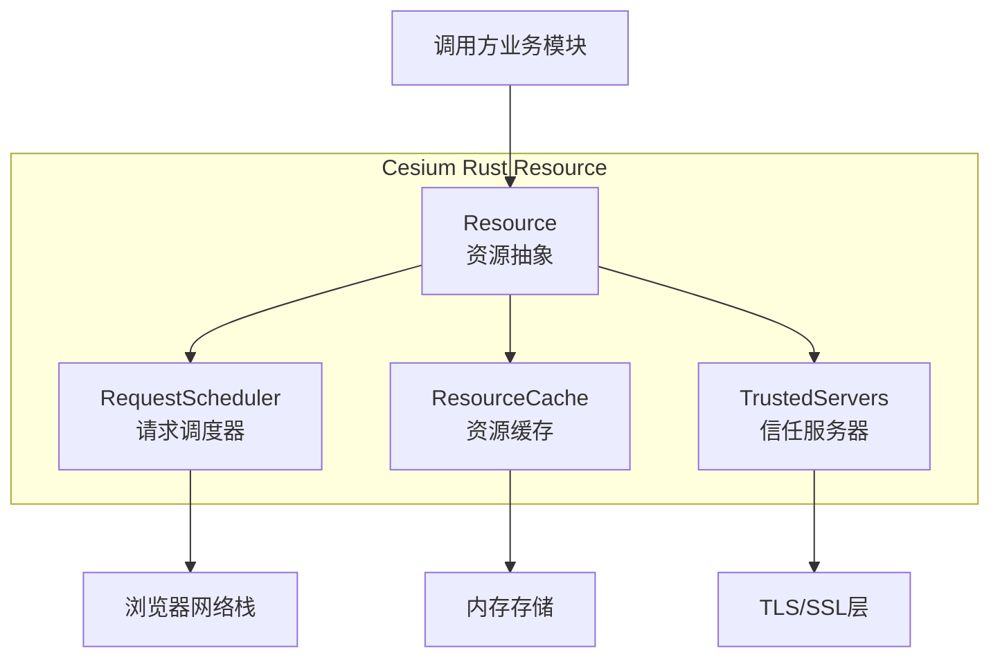
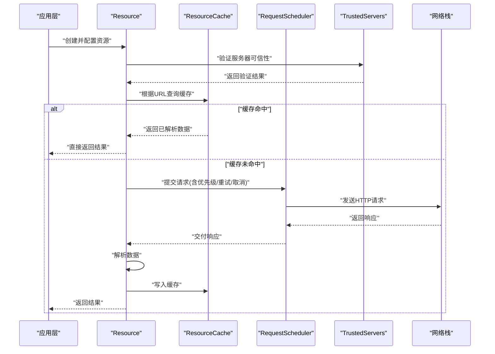
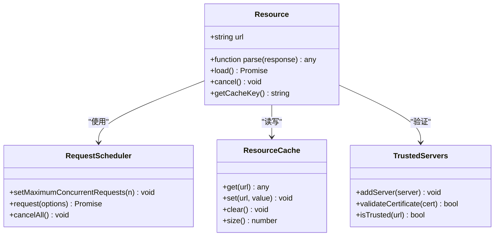
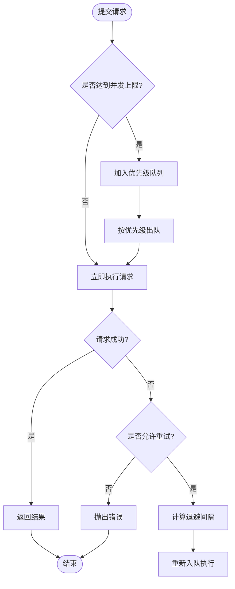
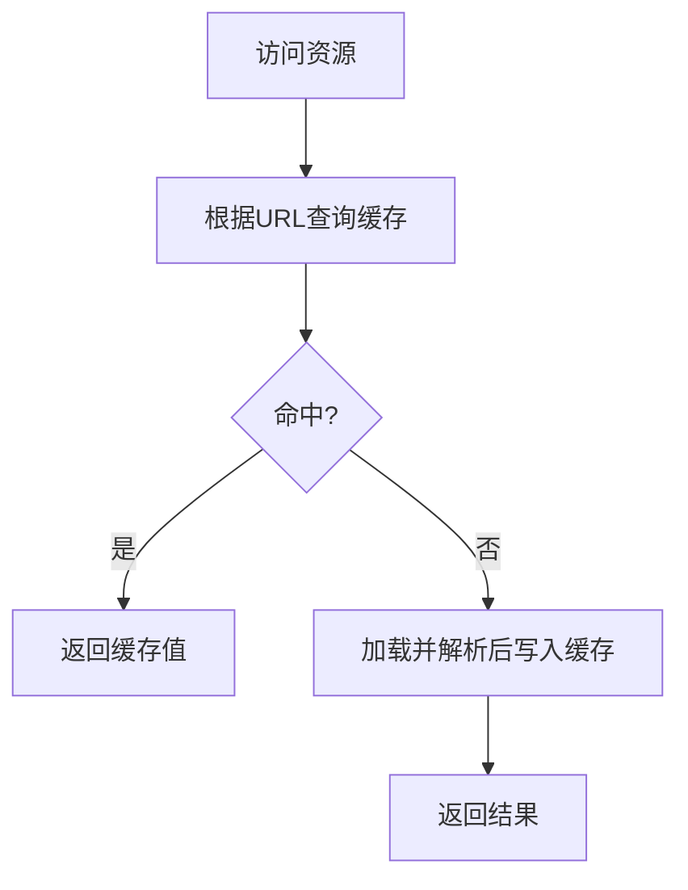
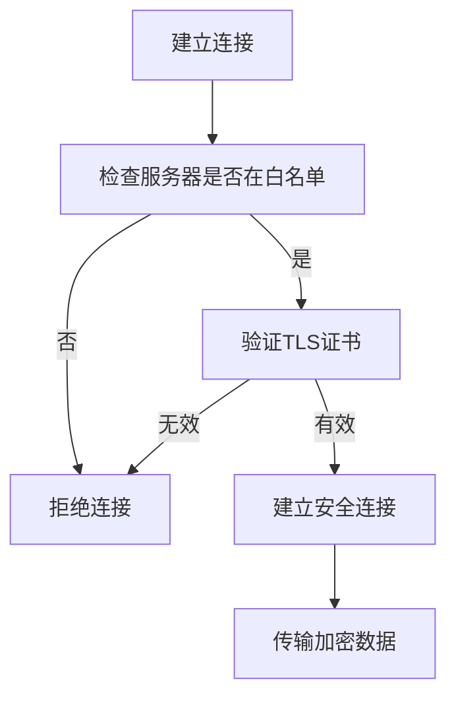
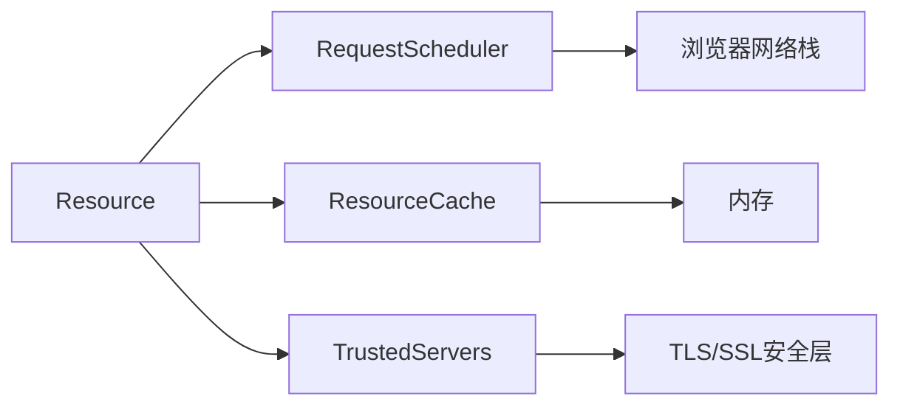

# 资源管理API

<cite>
**本文引用的文件**   
- [lib.rs](file://cesiumrust/crates/resource/src/lib.rs)
- [trusted_servers.rs](file://cesiumrust/crates/resource/src/trusted_servers.rs)
</cite>

## 更新摘要
**所做更改**   
- 基于Rust实现的重大资源管理增强功能更新了文档，包括lib.rs中261行核心功能代码和新的trusted_servers.rs模块（170行）
- 新增了安全服务器连接和证书验证功能的详细说明
- 完善了Resource资源类的Rust实现细节
- 增强了网络请求的安全性和可靠性描述
- 添加了证书管理和信任服务器配置指南

## 目录
1. [简介](#简介)
2. [项目结构](#项目结构)
3. [核心组件](#核心组件)
4. [架构总览](#架构总览)
5. [详细组件分析](#详细组件分析)
6. [安全服务器连接](#安全服务器连接)
7. [依赖关系分析](#依赖关系分析)
8. [性能考虑](#性能考虑)
9. [故障排查指南](#故障排查指南)
10. [结论](#结论)
11. [附录](#附录)

## 简介
本文件面向开发者，系统化梳理 Cesium Rust 资源管理相关 API，重点覆盖以下能力：
- Resource 资源类：统一抽象网络与本地资源的加载、解析与缓存键生成。
- RequestScheduler 请求调度器：全局并发控制、优先级队列、重试与取消。
- ResourceCache 资源缓存：基于 URL 的内存缓存，支持清理与统计。
- 安全服务器连接：TLS证书验证、信任服务器配置、HTTPS安全通信。
- 典型工作流：资源加载、缓存策略、并发控制、错误重试、超时处理、进度监控。
- 高级主题：内存管理、缓存清理、大数据集处理、离线缓存实现建议。

## 项目结构
资源管理相关代码位于 cesiumrust/crates/resource 目录，核心文件如下：
- lib.rs：定义Resource模块的核心功能，包含资源加载、调度、缓存等基础能力。
- trusted_servers.rs：提供安全服务器连接功能，包括TLS证书验证和信任服务器管理。

图表来源
- [lib.rs](file://cesiumrust/crates/resource/src/lib.rs)
- [trusted_servers.rs](file://cesiumrust/crates/resource/src/trusted_servers.rs)

章节来源
- [lib.rs](file://cesiumrust/crates/resource/src/lib.rs)
- [trusted_servers.rs](file://cesiumrust/crates/resource/src/trusted_servers.rs)

## 核心组件
本节概述四大核心组件的职责与交互方式。

- Resource 资源类
  - 职责：统一表示一个可加载的资源；负责构建缓存键、发起请求、解析数据、返回结果。
  - 关键能力：URL 规范化、类型推断、下载与解析、错误传播、取消与重试。
  - 与调度器/缓存的关系：通过 RequestScheduler 发起请求，通过 ResourceCache 读写缓存。

- RequestScheduler 请求调度器
  - 职责：维护全局并发上限、优先级队列、失败重试、请求取消。
  - 关键能力：设置最大并发数、为每个请求分配优先级、对失败请求进行指数退避重试、支持取消令牌。

- ResourceCache 资源缓存
  - 职责：以 URL 为键缓存已解析的资源对象，避免重复下载与解析。
  - 关键能力：get/set/clear、统计信息、按策略清理。

- TrustedServers 信任服务器管理
  - 职责：管理可信服务器列表、TLS证书验证、安全连接配置。
  - 关键能力：添加信任服务器、验证证书链、配置安全策略。

章节来源
- [lib.rs](file://cesiumrust/crates/resource/src/lib.rs)
- [trusted_servers.rs](file://cesiumrust/crates/resource/src/trusted_servers.rs)

## 架构总览
下图展示从调用方到网络层的完整链路，以及缓存命中路径和安全验证流程。

图表来源
- [lib.rs](file://cesiumrust/crates/resource/src/lib.rs)
- [trusted_servers.rs](file://cesiumrust/crates/resource/src/trusted_servers.rs)

## 详细组件分析

### Resource 资源类
- 设计要点
  - 将"资源标识"与"加载行为"解耦：同一 URL 在不同上下文中可通过不同解析器得到不同类型的数据。
  - 缓存键由 URL 与可选上下文参数共同决定，确保语义一致性。
  - 加载流程：检查缓存 -> 若未命中则通过调度器发起请求 -> 解析 -> 写回缓存 -> 返回。
- 关键方法（概念性说明）
  - 构造与配置：设置 URL、类型、请求头、超时、重试次数等。
  - load()：执行一次完整的加载流程，返回 Promise。
  - cancel()：取消当前正在进行的请求。
  - getCacheKey()：生成稳定的缓存键。
- 错误与重试
  - 网络错误、解析错误会向上抛出；调度器可根据配置自动重试。
- 进度与超时
  - 通过调度器或底层网络接口上报进度；超时由调度器或请求对象控制。

图表来源
- [lib.rs](file://cesiumrust/crates/resource/src/lib.rs)
- [trusted_servers.rs](file://cesiumrust/crates/resource/src/trusted_servers.rs)

章节来源
- [lib.rs](file://cesiumrust/crates/resource/src/lib.rs)

### RequestScheduler 请求调度器
- 设计要点
  - 全局单例，集中管理所有跨模块的网络请求并发度。
  - 支持优先级队列：高优先级任务优先执行，低优先级任务在空闲时补充。
  - 失败重试：对瞬时错误进行指数退避重试，避免雪崩。
  - 取消机制：支持在长时间等待或页面卸载时主动取消。
- 关键方法（概念性说明）
  - setMaximumConcurrentRequests(n)：设置全局并发上限。
  - request(options)：提交请求，options 包含 URL、方法、头、超时、重试策略等。
  - cancelAll()：取消所有待处理或进行中的请求。
- 并发与背压
  - 当达到并发上限时，新请求进入队列等待；空闲时按优先级出队。
- 超时与重试
  - 超时：超过指定时间未完成即失败；可结合重试策略恢复。
  - 重试：针对特定状态码或错误类型触发，带退避间隔。

图表来源
- [lib.rs](file://cesiumrust/crates/resource/src/lib.rs)

章节来源
- [lib.rs](file://cesiumrust/crates/resource/src/lib.rs)

### ResourceCache 资源缓存
- 设计要点
  - 以 URL 为键的内存缓存，避免重复下载与解析。
  - 支持 clear() 全量清理与 size() 统计，便于监控与调优。
- 关键方法（概念性说明）
  - get(url)：读取缓存。
  - set(url, value)：写入缓存。
  - clear()：清空缓存。
  - size()：返回缓存条目数量。
- 缓存策略建议
  - 短生命周期小对象：适合常驻内存。
  - 大对象或频繁变更资源：应配合失效策略或手动清理。

图表来源
- [lib.rs](file://cesiumrust/crates/resource/src/lib.rs)

章节来源
- [lib.rs](file://cesiumrust/crates/resource/src/lib.rs)

## 安全服务器连接
新增的trusted_servers.rs模块提供了强大的安全服务器连接功能，确保资源加载的安全性。

- 设计要点
  - 信任服务器白名单：只允许连接到预配置的受信服务器。
  - TLS证书验证：验证服务器证书的完整性和有效性。
  - 安全策略配置：支持自定义安全策略和验证规则。
- 关键功能
  - addTrustedServer(server)：添加受信任的服务器到白名单。
  - validateCertificate(cert)：验证TLS证书的有效性。
  - isTrustedUrl(url)：检查URL是否来自受信任的服务器。
  - configureSecurityPolicy(policy)：配置安全策略选项。
- 证书管理
  - 支持X.509证书格式验证。
  - 证书链完整性检查。
  - 证书过期时间验证。
- 安全通信
  - 强制HTTPS连接。
  - 支持自定义CA证书。
  - 防止中间人攻击。

图表来源
- [trusted_servers.rs](file://cesiumrust/crates/resource/src/trusted_servers.rs)

章节来源
- [trusted_servers.rs](file://cesiumrust/crates/resource/src/trusted_servers.rs)

## 依赖关系分析
- 耦合关系
  - Resource 强依赖 RequestScheduler 与 ResourceCache，形成"资源-调度-缓存"三角。
  - Resource 还依赖 TrustedServers 进行安全验证。
  - RequestScheduler 与 ResourceCache 彼此独立，分别关注"并发/重试"和"存储"。
- 外部依赖
  - 浏览器网络栈（XMLHttpRequest/Fetch），由 RequestScheduler 内部封装。
  - TLS/SSL库，用于安全连接和证书验证。
- 潜在风险
  - 全局并发上限过低会导致吞吐不足；过高可能导致服务端压力过大。
  - 缓存未设置合理失效策略可能引发内存泄漏。
  - 信任服务器配置不当可能导致安全风险。

图表来源
- [lib.rs](file://cesiumrust/crates/resource/src/lib.rs)
- [trusted_servers.rs](file://cesiumrust/crates/resource/src/trusted_servers.rs)

章节来源
- [lib.rs](file://cesiumrust/crates/resource/src/lib.rs)
- [trusted_servers.rs](file://cesiumrust/crates/resource/src/trusted_servers.rs)

## 性能考虑
- 并发控制
  - 根据目标服务器能力与客户端设备性能调整最大并发数。
  - 对热点资源采用更高优先级，冷资源降低优先级。
- 缓存策略
  - 对稳定不变的资源长期缓存；对频繁更新资源缩短 TTL 或禁用缓存。
  - 定期清理不活跃缓存，防止内存膨胀。
- 重试与退避
  - 仅对幂等且短时错误的请求启用重试；退避间隔随重试次数递增。
- 超时与取消
  - 为长耗时操作设置合理超时；在用户离开或切换场景时及时取消。
- 大数据集处理
  - 分块加载与增量渲染；结合视锥剔除与 LOD 减少一次性加载量。
- 进度监控
  - 利用调度器或底层网络接口的进度回调，实现加载条与用户体验优化。
- 安全验证开销
  - 证书验证应在连接建立时进行，避免重复验证。
  - 信任服务器列表应缓存，减少查找开销。

## 故障排查指南
- 常见问题
  - 请求被限流：检查全局并发上限是否过小，或远端服务限频。
  - 内存持续增长：确认缓存是否未清理，是否存在大对象常驻。
  - 频繁重试导致抖动：检查重试条件与退避策略，必要时关闭重试。
  - 超时过多：评估网络质量与服务端延迟，适当增大超时阈值。
  - 安全连接失败：检查信任服务器配置和证书有效性。
- 定位手段
  - 打印调度器统计信息（并发、队列长度、失败率）。
  - 观察缓存命中率与大小变化趋势。
  - 对关键资源增加日志，记录 URL、状态码、耗时与错误堆栈。
  - 检查信任服务器白名单和证书验证日志。

章节来源
- [lib.rs](file://cesiumrust/crates/resource/src/lib.rs)
- [trusted_servers.rs](file://cesiumrust/crates/resource/src/trusted_servers.rs)

## 结论
通过 Resource、RequestScheduler、ResourceCache 与 TrustedServers 的组合，Cesium Rust 提供了统一的资源加载与安全管理体系。合理利用并发控制、缓存策略、重试机制和安全验证，可在保证稳定性的同时显著提升加载性能与用户体验。对于大数据集与离线场景，建议结合分块加载、TTL 管理与本地持久化方案进一步优化。

## 附录

### 常用配置项速查
- 资源（Resource）
  - URL、类型、请求头、超时、重试次数、解析函数、缓存键策略。
- 调度器（RequestScheduler）
  - 最大并发数、默认重试策略、优先级、取消令牌。
- 缓存（ResourceCache）
  - 容量上限（可选）、清理策略、统计接口。
- 信任服务器（TrustedServers）
  - 白名单配置、证书验证策略、安全策略选项。

### 安全配置最佳实践
- 始终使用HTTPS连接生产环境资源。
- 定期更新信任服务器白名单。
- 实施最小权限原则，只授予必要的网络访问权限。
- 监控和记录所有安全相关的异常事件。