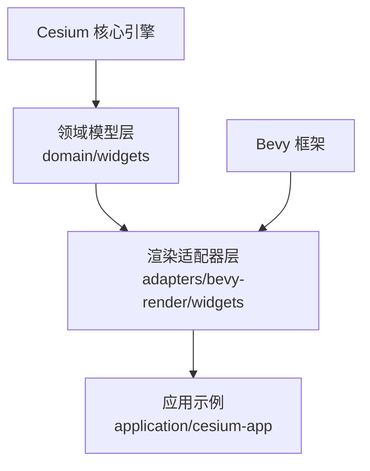
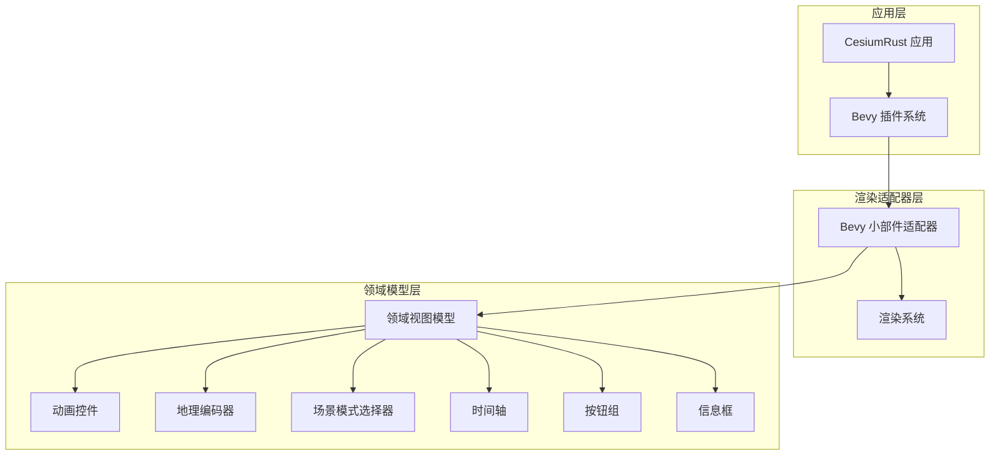
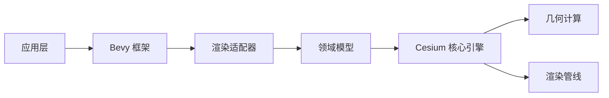

# UI组件库

<cite>
**本文引用的文件**
- [lib.rs](file://cesiumrust/domain/widgets/src/lib.rs)
- [geocoder.rs](file://cesiumrust/domain/widgets/src/geocoder.rs)
- [animation.rs](file://cesiumrust/domain/widgets/src/animation.rs)
- [scene_mode_picker.rs](file://cesiumrust/domain/widgets/src/scene_mode_picker.rs)
- [timeline.rs](file://cesiumrust/domain/widgets/src/timeline.rs)
- [buttons.rs](file://cesiumrust/domain/widgets/src/buttons.rs)
- [info_box.rs](file://cesiumrust/domain/widgets/src/info_box.rs)
- [mod.rs](file://cesiumrust/adapters/bevy-render/src/widgets/mod.rs)
- [animation.rs](file://cesiumrust/adapters/bevy-render/src/widgets/animation.rs)
- [geocoder.rs](file://cesiumrust/adapters/bevy-render/src/widgets/geocoder.rs)
- [scene_mode_picker.rs](file://cesiumrust/adapters/bevy-render/src/widgets/scene_mode_picker.rs)
- [minimal.rs](file://cesiumrust/application/cesium-app/examples/minimal.rs)
</cite>

## 更新摘要
**变更内容**
- 移除了基于GPUI的桌面应用框架相关文档，全面转向Bevy小部件系统
- 新增Bevy渲染适配器中的小部件集成层说明
- 更新了动画控件、地理编码器和场景模式选择器的实现细节
- 重构了组件架构，从Web前端迁移到Rust/Bevy生态
- 添加了时间轴、按钮组和信息框等核心UI组件的技术说明

## 目录
1. [简介](#简介)
2. [项目结构](#项目结构)
3. [核心组件](#核心组件)
4. [架构总览](#架构总览)
5. [详细组件分析](#详细组件分析)
6. [依赖关系分析](#依赖关系分析)
7. [性能与响应式建议](#性能与响应式建议)
8. [故障排查指南](#故障排查指南)
9. [结论](#结论)
10. [附录：集成示例路径](#附录集成示例路径)

## 简介
本技术文档面向使用 CesiumRust 的开发者，聚焦于基于 Bevy 的小部件系统在仓库中的落地形态与实践方式。内容涵盖：
- 基于 Bevy 的小部件架构设计与配置要点
- 地理编码器、动画控件、场景模式选择器等核心组件的实现机制
- 时间轴、信息框、按钮组等内置组件的使用方法
- 国际化支持与主题定制能力
- 与其他 Rust 生态组件的集成方案
- 移动端适配与性能优化最佳实践

由于项目已从 Web 前端迁移到 Rust/Bevy 桌面应用框架，本文档重点介绍新的 Bevy 小部件系统及其在三维地球可视化中的应用。

## 项目结构
仓库中与 UI 小部件相关的关键位置包括：
- cesiumrust/domain/widgets：领域模型层的小部件视图模型
- cesiumrust/adapters/bevy-render/src/widgets：Bevy 渲染适配器层的小部件实现
- cesiumrust/application/cesium-app：应用示例，展示小部件的实际使用

**图表来源**
- [lib.rs:1-50](file://cesiumrust/domain/widgets/src/lib.rs#L1-L50)
- [mod.rs](file://cesiumrust/adapters/bevy-render/src/widgets/mod.rs)
- [minimal.rs:1-122](file://cesiumrust/application/cesium-app/examples/minimal.rs#L1-L122)

**章节来源**
- [lib.rs:1-50](file://cesiumrust/domain/widgets/src/lib.rs#L1-L50)
- [minimal.rs:1-122](file://cesiumrust/application/cesium-app/examples/minimal.rs#L1-L122)

## 核心组件
本节从"UI 组件库"的角度，梳理基于 Bevy 的小部件系统的核心概念与职责边界：
- 领域模型层：提供纯域视图模型，无 UI 框架依赖，包含动画控制、时间轴、地理编码等功能
- 渲染适配器层：将领域模型转换为 Bevy 可渲染的实体和组件
- 应用集成层：在 Bevy 应用中组合和使用各种小部件
- 国际化支持：通过 i18n 模块提供多语言支持
- 主题定制：通过 Bevy 的资源系统和样式配置实现

**章节来源**
- [lib.rs:1-50](file://cesiumrust/domain/widgets/src/lib.rs#L1-L50)

## 架构总览
下图展示了基于 Bevy 的小部件系统架构。领域模型层定义小部件的状态和行为，渲染适配器层负责将其转换为 Bevy 实体，应用层进行组合和配置。

**图表来源**
- [lib.rs:1-50](file://cesiumrust/domain/widgets/src/lib.rs#L1-L50)
- [minimal.rs:1-122](file://cesiumrust/application/cesium-app/examples/minimal.rs#L1-L122)

## 详细组件分析

### 地理编码器（Geocoder）
地理编码器提供搜索即输入的地理编码功能，支持自动完成和结果导航。

**主要特性：**
- 实时搜索：输入时触发搜索，支持最小字符数配置
- 结果管理：显示搜索结果列表，支持键盘导航
- 目标定位：支持矩形区域或点目标的飞行定位
- 状态管理：搜索状态、结果显示状态、选中项管理

**API 接口：**
- `set_search_text()`: 设置搜索文本
- `begin_search()`: 开始搜索操作
- `complete_search()`: 完成搜索并设置结果
- `select_previous()/select_next()`: 结果导航
- `activate_selected()`: 激活选中的结果

**章节来源**
- [geocoder.rs:1-299](file://cesiumrust/domain/widgets/src/geocoder.rs#L1-L299)

### 动画控件（Animation）
动画控件提供时间播放控制，包括播放/暂停、速度调节和时间显示。

**核心功能：**
- 播放控制：播放、暂停、反向播放、正向播放
- 速度调节：通过旋转环控制速度倍数，支持线性和对数刻度
- 时间格式化：J2000 纪元时间格式化为日期和时间字符串
- 系统时钟模式：支持使用系统时间作为动画时间源

**旋转环算法：**
- 角度范围：[-105°, 105°]
- 线性区域：[-15°, 15°] 对应速度倍数 [-1, 1]
- 对数区域：超出线性区域使用对数刻度映射

**章节来源**
- [animation.rs:1-387](file://cesiumrust/domain/widgets/src/animation.rs#L1-L387)

### 场景模式选择器（Scene Mode Picker）
场景模式选择器允许用户在 3D、2D 和哥伦布视图模式之间切换。

**支持的场景模式：**
- Scene3D：三维地球视图
- Scene2D：二维平面地图视图
- ColumbusView：2.5D 哥伦布视图
- Morphing：模式间过渡动画（内部使用）

**功能特性：**
- 模式切换：支持编程方式和用户界面切换
- 过渡动画：可配置的过渡持续时间
- 下拉菜单：展开/收起状态管理
- 工具提示：为每种模式提供描述性文本

**章节来源**
- [scene_mode_picker.rs:1-181](file://cesiumrust/domain/widgets/src/scene_mode_picker.rs#L1-L181)

### 时间轴（Timeline）
时间轴组件用于显示和控制当前场景时间，支持轨道和高亮范围。

**核心数据结构：**
- TimelineTrack：时间轨道，包含名称、时间范围、颜色和高度
- TimelineHighlightRange：高亮范围，用于标记重要时间段
- TimelineTicScale：时间刻度尺，根据时间跨度自动选择合适的刻度

**交互功能：**
- 时间缩放：以当前时间为中心进行缩放
- 时间平移：按可见范围的分数进行平移
- 轨道管理：添加、移除轨道
- 高亮管理：添加、清除高亮范围

**章节来源**
- [timeline.rs:1-433](file://cesiumrust/domain/widgets/src/timeline.rs#L1-L433)

### 按钮组（Buttons）
按钮组包含多种常用操作按钮的视图模型。

**按钮类型：**
- ToggleButtonViewModel：通用切换按钮
- HomeButtonViewModel：主页按钮，重置相机到默认视图
- FullscreenButtonViewModel：全屏按钮，切换浏览器全屏模式
- NavigationHelpButtonViewModel：导航帮助按钮，显示/隐藏操作指南
- VRButtonViewModel：VR 模式按钮，切换虚拟现实模式

**功能特性：**
- 状态管理：启用/禁用、可见性、切换状态
- 工具提示：动态工具提示文本
- 环境检测：检查功能支持情况（如全屏、VR）

**章节来源**
- [buttons.rs:1-354](file://cesiumrust/domain/widgets/src/buttons.rs#L1-L354)

### 信息框（InfoBox）
信息框用于在面板中显示选中实体的详细信息。

**显示功能：**
- 实体信息展示：标题和描述内容
- 框架管理：显示/隐藏详情面板
- 跟踪模式：跟随实体移动相机
- 内容摘要：长内容的截断显示

**状态管理：**
- 可见性控制：整体可见性和框架可见性
- 内容管理：标题、描述、关闭按钮显示
- 相机偏移：跟踪模式下的相机视角偏移

**章节来源**
- [info_box.rs:1-197](file://cesiumrust/domain/widgets/src/info_box.rs#L1-L197)

### Bevy 渲染适配器
Bevy 渲染适配器将领域模型转换为 Bevy 可渲染的实体和组件。

**适配器功能：**
- 小部件插件：`CesiumWidgetPlugin` 提供小部件集成功能
- 渲染系统：将领域模型的状态变化转换为渲染指令
- 事件处理：处理用户交互事件并更新领域模型状态

**集成方式：**
- 通过 Bevy 插件系统注册小部件功能
- 使用 Bevy 的资源系统管理小部件状态
- 利用 Bevy 的实体组件系统组织 UI 元素

**章节来源**
- [lib.rs:1-446](file://cesiumrust/adapters/bevy-render/src/lib.rs#L1-L446)

## 依赖关系分析
基于 Bevy 的小部件系统依赖关系如下：

**图表来源**
- [minimal.rs:1-122](file://cesiumrust/application/cesium-app/examples/minimal.rs#L1-L122)
- [lib.rs:1-50](file://cesiumrust/domain/widgets/src/lib.rs#L1-L50)

**章节来源**
- [minimal.rs:1-122](file://cesiumrust/application/cesium-app/examples/minimal.rs#L1-L122)
- [lib.rs:1-50](file://cesiumrust/domain/widgets/src/lib.rs#L1-L50)

## 性能与响应式建议
- **首屏优化**
  - 延迟加载非关键小部件和资源
  - 预缓存常用图标和字体资源
  - 使用 Bevy 的异步任务系统避免阻塞主线程

- **渲染优化**
  - 合理设置阴影、雾效、抗锯齿等级
  - 控制同时可见的要素数量与复杂度
  - 使用 Bevy 的批处理和实例化渲染

- **交互优化**
  - 合并频繁的状态更新，减少重排重绘
  - 为不同设备提供合适的触控目标和布局
  - 使用 Bevy 的事件系统优化输入处理

- **内存管理**
  - 及时释放不再使用的小部件资源
  - 使用弱引用避免循环引用
  - 监控内存使用情况，防止内存泄漏

## 故障排查指南
- **常见问题**
  - 小部件未显示：检查 Bevy 插件注册和实体生命周期
  - 交互无响应：确认事件绑定顺序和手势冲突
  - 资源加载失败：核对网络配置和资源可达性
  - 渲染异常：检查 Bevy 渲染管道配置和材质设置

- **调试技巧**
  - 在控制台输出小部件状态和错误信息
  - 逐步禁用小部件和功能，定位问题范围
  - 使用 Bevy 的开发工具和日志系统进行调试
  - 验证基础功能是否正常，使用最小示例进行测试

**章节来源**
- [minimal.rs:1-122](file://cesiumrust/application/cesium-app/examples/minimal.rs#L1-L122)

## 结论
CesiumRust 项目已成功从 Web 前端迁移到基于 Bevy 的桌面应用框架，提供了完整的 UI 小部件系统。新的架构具有以下优势：
- **跨平台支持**：基于 Bevy 的跨平台能力
- **高性能渲染**：利用 Rust 的性能优势和 Bevy 的渲染引擎
- **类型安全**：Rust 的类型系统确保代码安全性
- **模块化设计**：清晰的领域模型和渲染适配器分离
- **丰富的组件**：完整的地理可视化 UI 组件集合

通过合理的配置、扩展机制、主题定制策略，以及性能优化，可以在不同平台上获得一致的三维地球可视化体验。建议在项目中建立统一的组件注册和样式规范，提升可维护性和可扩展性。

## 附录：集成示例路径
- **完整示例入口**
  - [minimal.rs](file://cesiumrust/application/cesium-app/examples/minimal.rs)
- **领域模型层**
  - [widgets lib.rs](file://cesiumrust/domain/widgets/src/lib.rs)
  - [geocoder.rs](file://cesiumrust/domain/widgets/src/geocoder.rs)
  - [animation.rs](file://cesiumrust/domain/widgets/src/animation.rs)
  - [scene_mode_picker.rs](file://cesiumrust/domain/widgets/src/scene_mode_picker.rs)
  - [timeline.rs](file://cesiumrust/domain/widgets/src/timeline.rs)
  - [buttons.rs](file://cesiumrust/domain/widgets/src/buttons.rs)
  - [info_box.rs](file://cesiumrust/domain/widgets/src/info_box.rs)
- **Bevy 渲染适配器**
  - [widgets mod.rs](file://cesiumrust/adapters/bevy-render/src/widgets/mod.rs)
  - [bevy render lib.rs](file://cesiumrust/adapters/bevy-render/src/lib.rs)