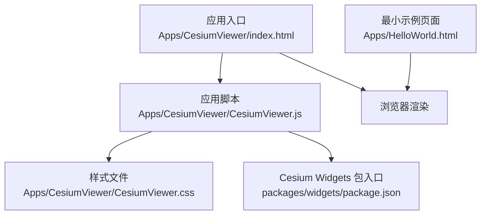
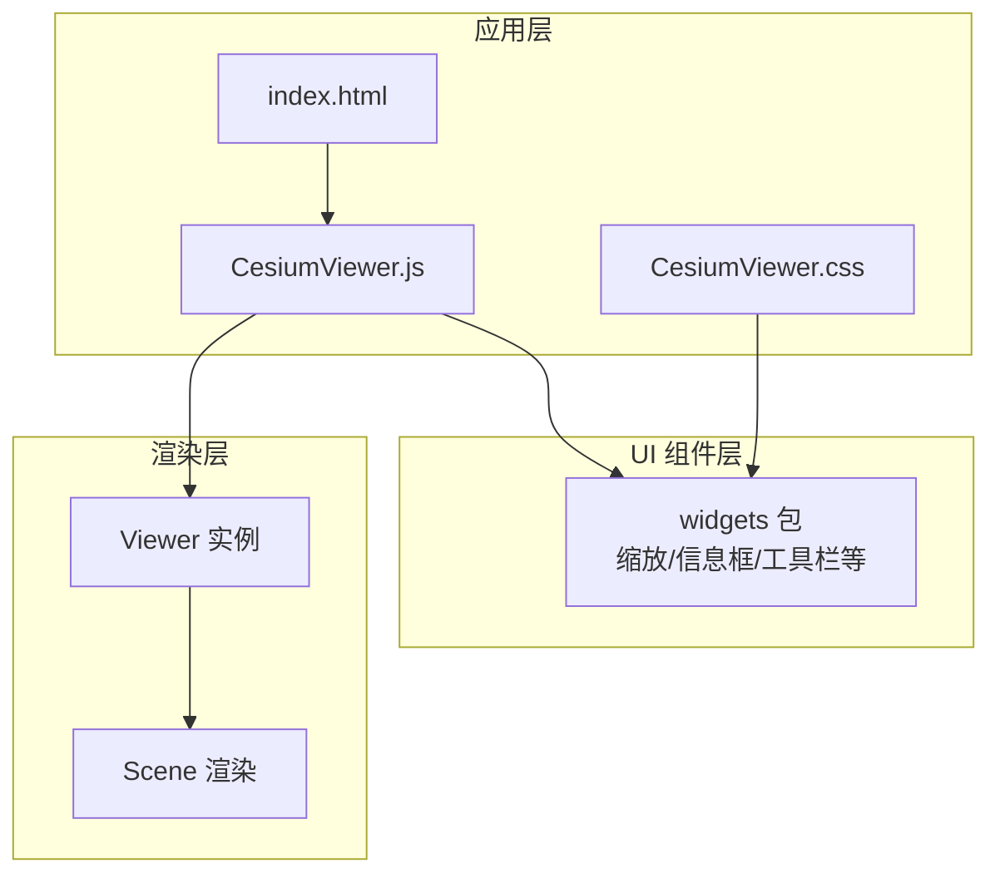
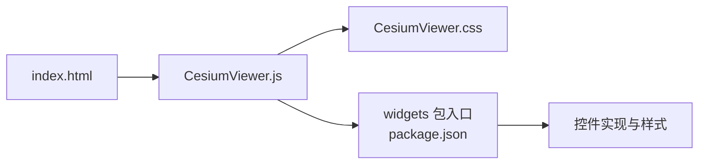

# UI组件库

<cite>
**本文引用的文件**   
- [CesiumViewer.js](file://Apps/CesiumViewer/CesiumViewer.js)
- [CesiumViewer.css](file://Apps/CesiumViewer/CesiumViewer.css)
- [index.html](file://Apps/CesiumViewer/index.html)
- [HelloWorld.html](file://Apps/HelloWorld.html)
- [package.json](file://packages/widgets/package.json)
- [README.md](file://Documentation/Contributors/MobileGuide/README.md)
</cite>

## 目录
1. [简介](#简介)
2. [项目结构](#项目结构)
3. [核心组件](#核心组件)
4. [架构总览](#架构总览)
5. [详细组件分析](#详细组件分析)
6. [依赖关系分析](#依赖关系分析)
7. [性能与响应式建议](#性能与响应式建议)
8. [故障排查指南](#故障排查指南)
9. [结论](#结论)
10. [附录：集成示例路径](#附录集成示例路径)

## 简介
本技术文档面向使用 Cesium 的开发者，聚焦于“UI 组件库”在仓库中的落地形态与实践方式。内容涵盖：
- Viewer 组件的架构设计与配置要点
- 控件系统的扩展机制与自定义控件开发思路
- 国际化支持与主题定制能力
- 信息框、工具栏、缩放控件等内置组件的使用说明
- 响应式设计与移动端适配最佳实践
- 与其他前端框架的集成方案与参考路径

由于仓库中未提供独立的 UI 组件包源码，本文以应用示例与 Widgets 包入口为依据，给出可操作的集成与扩展方法，并辅以图示帮助理解。

## 项目结构
仓库中与 UI 相关的关键位置包括：
- Apps/CesiumViewer：一个基于 Cesium 的演示应用，包含初始化脚本、样式与入口页面
- Apps/HelloWorld.html：最小化示例页面
- packages/widgets：Widgets 包的元数据与入口（用于定位 UI 组件来源）
- Documentation/Contributors/MobileGuide：移动端指南，涉及响应式与交互优化

图表来源
- [index.html](file://Apps/CesiumViewer/index.html)
- [CesiumViewer.js](file://Apps/CesiumViewer/CesiumViewer.js)
- [CesiumViewer.css](file://Apps/CesiumViewer/CesiumViewer.css)
- [package.json](file://packages/widgets/package.json)

章节来源
- [index.html](file://Apps/CesiumViewer/index.html)
- [CesiumViewer.js](file://Apps/CesiumViewer/CesiumViewer.js)
- [CesiumViewer.css](file://Apps/CesiumViewer/CesiumViewer.css)
- [HelloWorld.html](file://Apps/HelloWorld.html)
- [package.json](file://packages/widgets/package.json)

## 核心组件
本节从“UI 组件库”的角度，梳理与 Viewer 及控件系统相关的核心概念与职责边界：
- Viewer 容器：负责承载三维场景、图层、相机与用户交互；其 UI 控件通常由 Widgets 注入到 DOM 容器中
- 控件系统：提供缩放、全屏、信息框、时间轴、地图选择器等常用 UI 元素，支持通过配置项启用/禁用或替换
- 主题与样式：通过 CSS 变量或覆盖样式实现主题定制
- 国际化：通过本地化资源与文案键值进行多语言切换（具体实现取决于上层应用或第三方 i18n 库）

章节来源
- [CesiumViewer.js](file://Apps/CesiumViewer/CesiumViewer.js)
- [CesiumViewer.css](file://Apps/CesiumViewer/CesiumViewer.css)
- [package.json](file://packages/widgets/package.json)

## 架构总览
下图展示了应用层、Widgets 与渲染层的交互关系。应用通过入口脚本创建 Viewer，并将 UI 控件挂载到指定 DOM 节点；样式文件对控件外观进行定制；Widgets 包提供控件的实现与默认行为。

图表来源
- [index.html](file://Apps/CesiumViewer/index.html)
- [CesiumViewer.js](file://Apps/CesiumViewer/CesiumViewer.js)
- [CesiumViewer.css](file://Apps/CesiumViewer/CesiumViewer.css)
- [package.json](file://packages/widgets/package.json)

## 详细组件分析

### Viewer 组件：架构与配置要点
- 容器与生命周期
  - 在入口页面中准备一个固定尺寸的 DOM 容器
  - 应用脚本初始化 Viewer，绑定事件与控件
  - 销毁时释放资源，避免内存泄漏
- 关键配置维度（按常见需求归纳）
  - 基础显示：是否显示默认控件、地形、影像、动画时钟等
  - 交互行为：鼠标/触摸手势、拾取、碰撞检测
  - 性能选项：阴影、雾效、抗锯齿、深度缓冲等
  - 安全与跨域：CORS、令牌、请求拦截器
- 与 Widgets 的关系
  - 通过配置项控制默认控件的显隐
  - 可通过 API 动态添加/移除控件
  - 支持将控件挂载到自定义容器，便于布局与主题统一

章节来源
- [CesiumViewer.js](file://Apps/CesiumViewer/CesiumViewer.js)
- [CesiumViewer.css](file://Apps/CesiumViewer/CesiumViewer.css)

### 控件系统：扩展机制与自定义控件
- 扩展点
  - 通过 Widget 工厂或注册表机制扩展新控件
  - 复用现有控件的基类或样式约定，保证一致性
- 自定义控件开发步骤（通用流程）
  - 定义控件 DOM 结构与样式
  - 封装交互逻辑与状态管理
  - 暴露统一的 API（显示/隐藏、事件回调、配置项）
  - 注册到控件管理器，供 Viewer 或业务模块调用
- 与 Viewer 的集成
  - 在 Viewer 初始化后挂载控件
  - 监听 Viewer 事件（如帧更新、相机变化）驱动控件状态同步

章节来源
- [CesiumViewer.js](file://Apps/CesiumViewer/CesiumViewer.js)
- [package.json](file://packages/widgets/package.json)

### 国际化与主题定制
- 国际化
  - 文案集中管理，按语言包加载
  - 在控件渲染前解析文本键值，支持运行时切换
- 主题定制
  - 通过 CSS 变量或覆盖样式调整颜色、尺寸、圆角、阴影
  - 为不同设备（桌面/平板/手机）提供断点适配
  - 保持控件层级与 z-index 一致，避免遮挡

章节来源
- [CesiumViewer.css](file://Apps/CesiumViewer/CesiumViewer.css)

### 内置组件：信息框、工具栏、缩放控件
- 信息框（InfoBox）
  - 用途：展示选中要素的详情、属性与富文本
  - 行为：打开/关闭、定位到目标、跟随相机移动
- 工具栏（Toolbar）
  - 用途：聚合常用操作按钮（测量、截图、图层开关等）
  - 行为：分组、图标、快捷键、无障碍标签
- 缩放控件（Zoom）
  - 用途：快速放大/缩小视图
  - 行为：点击缩放、滚轮缩放、键盘快捷键

章节来源
- [CesiumViewer.js](file://Apps/CesiumViewer/CesiumViewer.js)
- [CesiumViewer.css](file://Apps/CesiumViewer/CesiumViewer.css)

### 响应式设计与移动端适配
- 布局策略
  - 使用视口单位与弹性布局，确保在不同屏幕比例下正常显示
  - 根据设备类型动态调整控件大小与间距
- 交互优化
  - 针对触摸设备优化点击区域与手势冲突
  - 减少不必要的重绘与复杂动画
- 性能考量
  - 降低阴影、雾效等开销较大的效果
  - 按需加载控件与资源，避免首屏阻塞

章节来源
- [README.md](file://Documentation/Contributors/MobileGuide/README.md)

## 依赖关系分析
- 应用层依赖
  - index.html 引入应用脚本与样式
  - CesiumViewer.js 负责初始化 Viewer 与控件
  - CesiumViewer.css 提供主题与布局样式
- 组件层依赖
  - widgets 包提供控件实现与默认样式
- 运行期依赖
  - 浏览器环境、WebGL、网络资源（影像、模型、字体等）

图表来源
- [index.html](file://Apps/CesiumViewer/index.html)
- [CesiumViewer.js](file://Apps/CesiumViewer/CesiumViewer.js)
- [CesiumViewer.css](file://Apps/CesiumViewer/CesiumViewer.css)
- [package.json](file://packages/widgets/package.json)

章节来源
- [index.html](file://Apps/CesiumViewer/index.html)
- [CesiumViewer.js](file://Apps/CesiumViewer/CesiumViewer.js)
- [CesiumViewer.css](file://Apps/CesiumViewer/CesiumViewer.css)
- [package.json](file://packages/widgets/package.json)

## 性能与响应式建议
- 首屏优化
  - 延迟加载非关键控件与资源
  - 预缓存常用图标与字体
- 渲染优化
  - 合理设置阴影、雾效、抗锯齿等级
  - 控制同时可见的要素数量与复杂度
- 交互优化
  - 合并频繁的状态更新，减少重排重绘
  - 为移动端提供更大的触控目标与更少的层级嵌套
- 监控与诊断
  - 记录关键指标（FPS、内存占用、绘制调用次数）
  - 结合浏览器开发者工具定位瓶颈

[本节为通用指导，不直接分析具体文件]

## 故障排查指南
- 常见问题
  - 控件未显示：检查 DOM 容器尺寸、z-index 与样式覆盖
  - 交互无响应：确认事件绑定顺序与手势冲突
  - 资源加载失败：核对 CORS 配置与网络可达性
- 调试技巧
  - 在控制台输出 Viewer 与控件实例状态
  - 逐步禁用控件与效果，定位问题范围
  - 使用最小示例页面验证基础功能是否正常

章节来源
- [HelloWorld.html](file://Apps/HelloWorld.html)
- [CesiumViewer.js](file://Apps/CesiumViewer/CesiumViewer.js)
- [CesiumViewer.css](file://Apps/CesiumViewer/CesiumViewer.css)

## 结论
本仓库提供了基于 Cesium 的应用示例与 Widgets 包入口，可作为 UI 组件库集成的起点。通过合理的 Viewer 配置、控件扩展机制、主题与国际化策略，以及响应式与移动端优化，可以在不同平台上获得一致的可视化体验。建议在项目中建立统一的控件注册与样式规范，提升可维护性与可扩展性。

[本节为总结性内容，不直接分析具体文件]

## 附录：集成示例路径
- 完整示例入口
  - [index.html](file://Apps/CesiumViewer/index.html)
  - [CesiumViewer.js](file://Apps/CesiumViewer/CesiumViewer.js)
  - [CesiumViewer.css](file://Apps/CesiumViewer/CesiumViewer.css)
- 最小示例
  - [HelloWorld.html](file://Apps/HelloWorld.html)
- Widgets 包入口
  - [package.json](file://packages/widgets/package.json)
- 移动端指南
  - [README.md](file://Documentation/Contributors/MobileGuide/README.md)