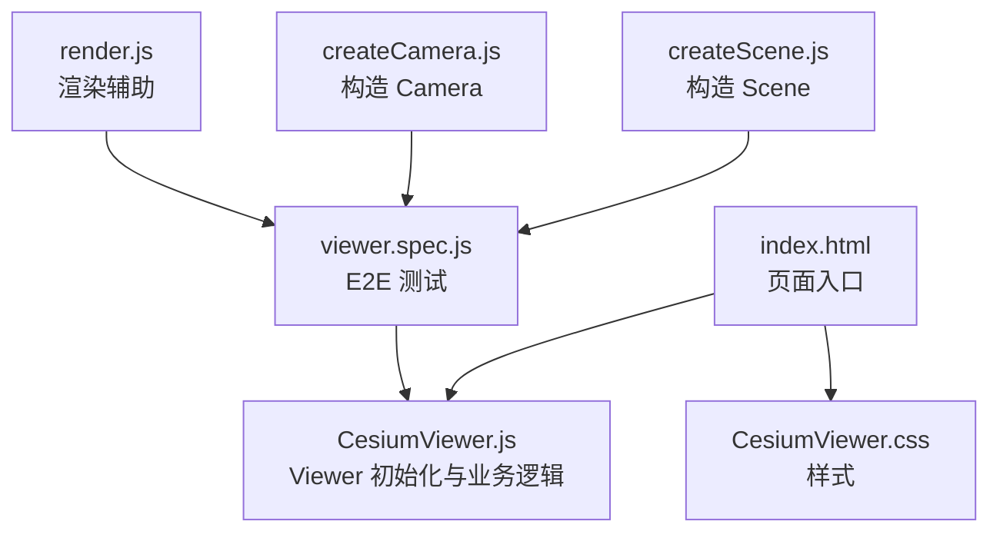
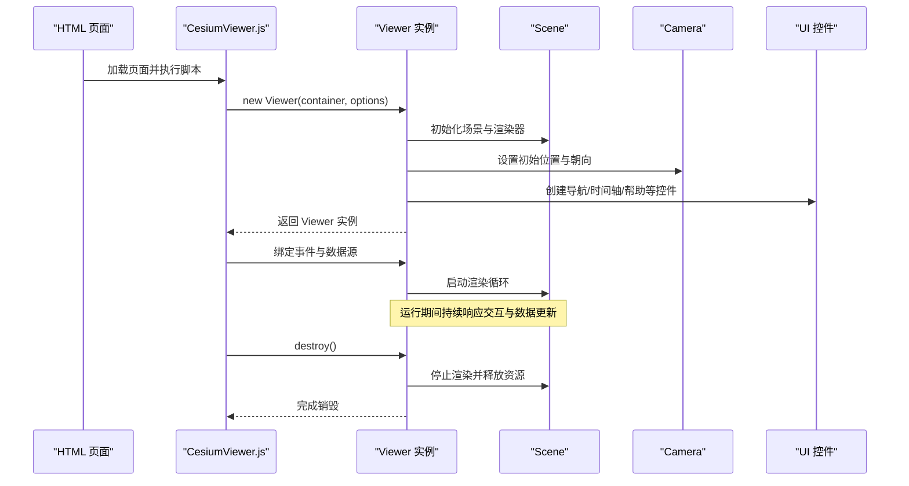
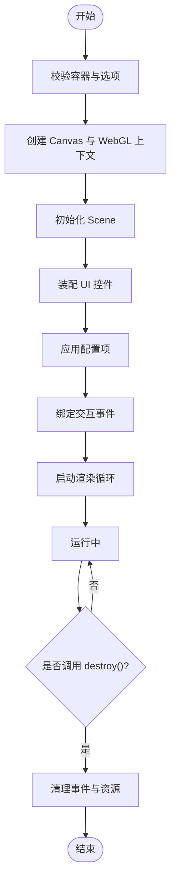
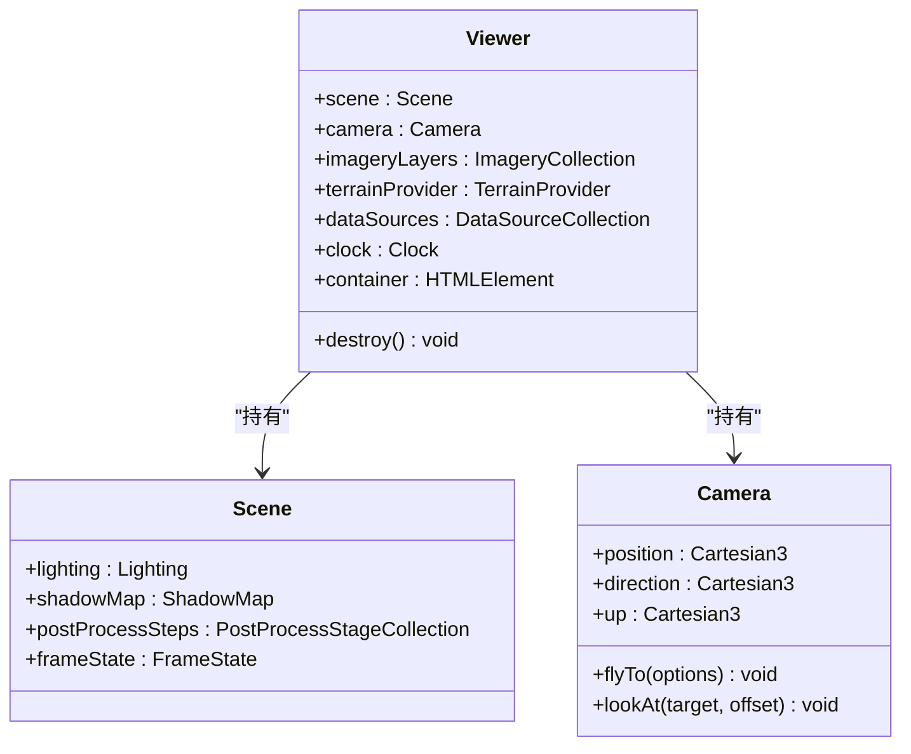
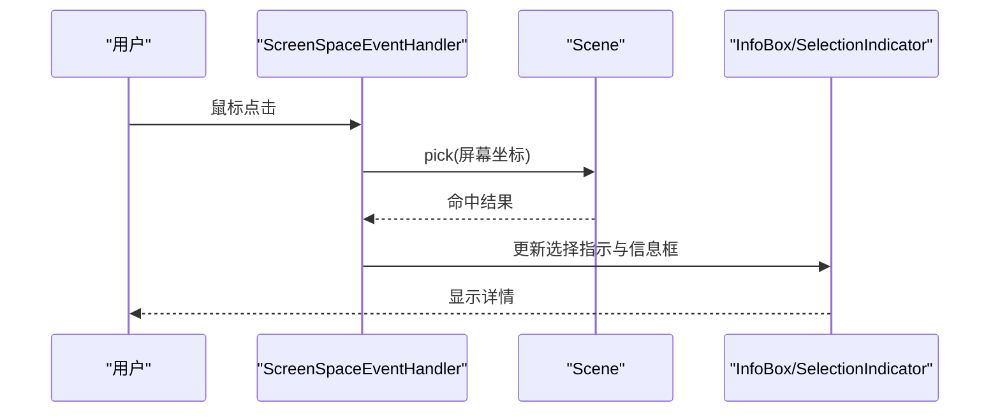
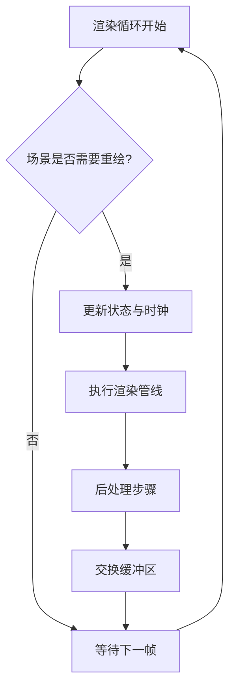
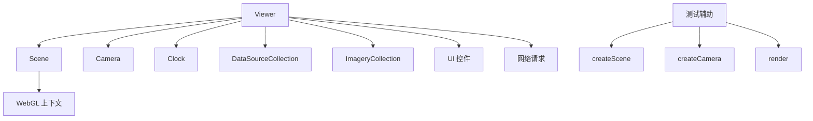

# Viewer组件

<cite>
**本文引用的文件**   
- [CesiumViewer.js](file://Apps/CesiumViewer/CesiumViewer.js)
- [index.html](file://Apps/CesiumViewer/index.html)
- [CesiumViewer.css](file://Apps/CesiumViewer/CesiumViewer.css)
- [viewer.spec.js](file://Specs/e2e/viewer.spec.js)
- [createScene.js](file://Specs/createScene.js)
- [createCamera.js](file://Specs/createCamera.js)
- [render.js](file://Specs/render.js)
</cite>

## 目录
1. [简介](#简介)
2. [项目结构](#项目结构)
3. [核心组件](#核心组件)
4. [架构总览](#架构总览)
5. [详细组件分析](#详细组件分析)
6. [依赖关系分析](#依赖关系分析)
7. [性能考量](#性能考量)
8. [故障排查指南](#故障排查指南)
9. [结论](#结论)
10. [附录](#附录)

## 简介
本技术文档围绕 Cesium Viewer 组件展开，聚焦于 Viewer 类的架构设计与初始化流程，包括构造函数参数、配置选项与生命周期管理；深入说明场景设置、相机控制、用户交互处理等核心功能；阐述渲染循环机制、性能优化策略与资源管理；并提供完整的代码示例路径，展示 Viewer 的创建、配置、事件监听与销毁方法。同时给出与 React、Vue、Angular 集成的最佳实践与常见问题解决方案。

## 项目结构
本项目包含一个可直接运行的 CesiumViewer 应用入口，以及配套的样式与测试用例：
- Apps/CesiumViewer/index.html：页面入口，挂载容器并引入脚本与样式。
- Apps/CesiumViewer/CesiumViewer.js：Viewer 实例化、配置、事件绑定与生命周期管理的核心逻辑。
- Apps/CesiumViewer/CesiumViewer.css：界面样式。
- Specs/e2e/viewer.spec.js：针对 Viewer 的端到端测试，覆盖常见使用模式与边界条件。
- Specs/createScene.js、Specs/createCamera.js、Specs/render.js：测试辅助，用于构造 Scene、Camera 与渲染上下文，便于验证 Viewer 行为。

**图表来源** 
- [index.html](file://Apps/CesiumViewer/index.html)
- [CesiumViewer.js](file://Apps/CesiumViewer/CesiumViewer.js)
- [CesiumViewer.css](file://Apps/CesiumViewer/CesiumViewer.css)
- [viewer.spec.js](file://Specs/e2e/viewer.spec.js)
- [createScene.js](file://Specs/createScene.js)
- [createCamera.js](file://Specs/createCamera.js)
- [render.js](file://Specs/render.js)

**章节来源**
- [index.html](file://Apps/CesiumViewer/index.html)
- [CesiumViewer.js](file://Apps/CesiumViewer/CesiumViewer.js)
- [CesiumViewer.css](file://Apps/CesiumViewer/CesiumViewer.css)
- [viewer.spec.js](file://Specs/e2e/viewer.spec.js)
- [createScene.js](file://Specs/createScene.js)
- [createCamera.js](file://Specs/createCamera.js)
- [render.js](file://Specs/render.js)

## 核心组件
- Viewer：Cesium 的核心 UI 组件，封装了 Scene、Canvas、Camera、ImageryProvider、TerrainProvider、UI 控件（如导航按钮、时间轴）等，提供统一的 API 进行场景管理与交互。
- Scene：负责渲染管线、实体/图元绘制、光照、阴影、后处理效果等。
- Camera：控制视角、飞行、缩放、倾斜、旋转等。
- ImageryProvider/TerrainProvider：地图影像与地形数据源。
- DataSource：矢量数据、模型、轨迹等数据源的统一抽象。
- Clock：时间控制，驱动动画与时间相关的数据更新。
- ScreenSpaceEventHandler：屏幕空间事件处理器，处理鼠标、触摸、键盘等交互。

在 CesiumViewer.js 中，通常通过 new Viewer(container, options) 创建实例，并在 options 中配置 imageryProvider、terrainProvider、baseLayer、clock、sceneMode、fullscreenButton、geocoder、homeButton、navigationHelpButton、animation、timeline、fullscreenButton、selectionIndicator、infoBox、requestRenderMode、useBrowserRecommendedResolution 等关键选项。

**章节来源**
- [CesiumViewer.js](file://Apps/CesiumViewer/CesiumViewer.js)

## 架构总览
Viewer 的初始化与运行可概括为以下阶段：
- 构建阶段：解析 DOM 容器、创建 WebGL 上下文、初始化 Canvas、加载默认 UI 控件。
- 配置阶段：根据 options 注入影像、地形、图层、时钟、交互开关等。
- 启动阶段：注册事件监听、启动渲染循环、初始化相机位置与目标。
- 运行阶段：响应用户输入、调度数据加载、按需更新场景与 UI。
- 销毁阶段：清理事件、释放 GPU 资源、停止渲染循环、移除 DOM 引用。

**图表来源** 
- [CesiumViewer.js](file://Apps/CesiumViewer/CesiumViewer.js)
- [viewer.spec.js](file://Specs/e2e/viewer.spec.js)

## 详细组件分析

### Viewer 类与初始化流程
- 构造函数参数与配置选项
  - container：DOM 容器元素或选择器字符串。
  - options：对象，包含 imageryProvider、terrainProvider、baseLayer、sceneMode、clock、requestRenderMode、useBrowserRecommendedResolution、fullscreenButton、geocoder、homeButton、navigationHelpButton、animation、timeline、selectionIndicator、infoBox 等。
  - 典型流程：校验容器、创建 Canvas、初始化 WebGL 上下文、构建 Scene、装配 UI 控件、应用 options、注册事件、启动渲染。
- 生命周期管理
  - 创建：new Viewer(...)
  - 配置：动态设置 imagery/terrain/dataSources/camera/clock 等
  - 运行：事件驱动渲染，按需请求数据
  - 销毁：destroy() 释放资源、移除事件、清空引用

**图表来源** 
- [CesiumViewer.js](file://Apps/CesiumViewer/CesiumViewer.js)

**章节来源**
- [CesiumViewer.js](file://Apps/CesiumViewer/CesiumViewer.js)

### 场景设置与相机控制
- 场景设置
  - 通过 viewer.scene 访问 Scene，配置光照、阴影、雾效、后处理效果、帧率限制等。
  - 设置 imageryProvider 与 terrainProvider 以加载地图与地形。
- 相机控制
  - 使用 viewer.camera.flyTo/flyToBoundingSphere/lookAt 等方法实现平滑飞行与定位。
  - 支持设置最大/最小高度、倾斜角范围、滚动速度等。
- 常用操作
  - 切换 sceneMode（2D/3D/ColumbusView）。
  - 启用/禁用全屏、导航帮助、时间轴等 UI。

**图表来源** 
- [CesiumViewer.js](file://Apps/CesiumViewer/CesiumViewer.js)
- [createScene.js](file://Specs/createScene.js)
- [createCamera.js](file://Specs/createCamera.js)

**章节来源**
- [CesiumViewer.js](file://Apps/CesiumViewer/CesiumViewer.js)
- [createScene.js](file://Specs/createScene.js)
- [createCamera.js](file://Specs/createCamera.js)

### 用户交互处理
- 屏幕空间事件
  - 使用 viewer.screenSpaceEventHandler 注册鼠标、触摸、键盘事件。
  - 常用事件：左键点击、右键拖拽、滚轮缩放、双击放大、键盘快捷键。
- 拾取与选择
  - 通过 viewer.scene.pick 获取被点击的图元或实体，结合 selectionIndicator 与 infoBox 显示信息。
- 自定义交互
  - 扩展 ScreenSpaceEventHandler，实现拖拽框选、测量、标注等。

**图表来源** 
- [CesiumViewer.js](file://Apps/CesiumViewer/CesiumViewer.js)
- [viewer.spec.js](file://Specs/e2e/viewer.spec.js)

**章节来源**
- [CesiumViewer.js](file://Apps/CesiumViewer/CesiumViewer.js)
- [viewer.spec.js](file://Specs/e2e/viewer.spec.js)

### 渲染循环机制与性能优化
- 渲染循环
  - Viewer 内部维护 requestAnimationFrame 驱动的渲染循环。
  - 可通过 useBrowserRecommendedResolution 与 requestRenderMode 控制渲染频率与分辨率。
- 性能优化
  - 合理设置 imagery/terrain 的层级与缓存策略。
  - 使用 LOD、视锥剔除、延迟加载、批处理等技术。
  - 避免频繁创建/销毁对象，复用几何体与材质。
  - 降低阴影质量、关闭不必要的后处理效果。
  - 使用 worker 线程处理耗时任务（如数据解析）。
- 资源管理
  - 及时释放不再使用的 DataSource、纹理、模型等资源。
  - 在组件卸载时调用 destroy()，确保资源回收。

**图表来源** 
- [CesiumViewer.js](file://Apps/CesiumViewer/CesiumViewer.js)
- [render.js](file://Specs/render.js)

**章节来源**
- [CesiumViewer.js](file://Apps/CesiumViewer/CesiumViewer.js)
- [render.js](file://Specs/render.js)

### 与第三方框架集成（React、Vue、Angular）
- React
  - 使用 useEffect 创建与销毁 Viewer，避免重复实例化。
  - 将 viewer 实例作为 ref 保存，在组件卸载时调用 destroy()。
  - 通过 props 动态更新 imagery/terrain/dataSources。
- Vue
  - 在 mounted 钩子中创建 Viewer，在 beforeUnmount 中销毁。
  - 使用 watch 监听配置变化，动态更新 viewer 属性。
- Angular
  - 在 ngOnInit 中创建 Viewer，在 ngOnDestroy 中销毁。
  - 使用 @Input/@Output 传递配置与事件回调。

最佳实践：
- 单例模式：全局仅保留一个 Viewer 实例，避免内存泄漏。
- 懒加载：仅在需要时初始化 Viewer，减少首屏开销。
- 错误边界：捕获初始化失败并提示用户重试。
- 事件解绑：确保在组件销毁前解除所有事件监听。

**章节来源**
- [CesiumViewer.js](file://Apps/CesiumViewer/CesiumViewer.js)
- [viewer.spec.js](file://Specs/e2e/viewer.spec.js)

## 依赖关系分析
Viewer 依赖多个子系统与外部资源：
- 内部依赖：Scene、Camera、Clock、DataSourceCollection、ImageryCollection、UI 控件集合。
- 外部依赖：WebGL 上下文、浏览器事件系统、网络请求（加载影像/地形/模型）。
- 测试依赖：createScene、createCamera、render 等辅助模块用于构造测试环境。

**图表来源** 
- [CesiumViewer.js](file://Apps/CesiumViewer/CesiumViewer.js)
- [createScene.js](file://Specs/createScene.js)
- [createCamera.js](file://Specs/createCamera.js)
- [render.js](file://Specs/render.js)

**章节来源**
- [CesiumViewer.js](file://Apps/CesiumViewer/CesiumViewer.js)
- [createScene.js](file://Specs/createScene.js)
- [createCamera.js](file://Specs/createCamera.js)
- [render.js](file://Specs/render.js)

## 性能考量
- 渲染频率控制：使用 requestRenderMode 仅在必要时重绘，降低 CPU/GPU 负载。
- 分辨率适配：useBrowserRecommendedResolution 自动匹配设备像素比，平衡清晰度与性能。
- 数据分层加载：按视距与视锥动态加载影像与地形瓦片，避免一次性加载全部数据。
- 对象复用：避免频繁创建/销毁几何体、材质、图元，提升 GC 效率。
- 资源监控：定期统计内存占用与帧率，识别瓶颈点。
- 移动端优化：简化后处理、降低阴影质量、减少纹理尺寸。

[本节为通用指导，不直接分析具体文件]

## 故障排查指南
- 初始化失败
  - 检查容器是否存在且可见，尺寸是否正确。
  - 确认 WebGL 上下文可用，浏览器兼容性良好。
  - 查看控制台错误日志，定位具体异常。
- 渲染异常
  - 检查 imagery/terrain 地址是否可达，权限是否正确。
  - 确认数据格式符合规范，避免损坏或非法字段。
- 内存泄漏
  - 确保在组件销毁时调用 destroy()，释放资源。
  - 避免全局变量持有过多引用。
- 交互无响应
  - 检查事件监听是否正确绑定，是否被其他事件拦截。
  - 确认 screenSpaceEventHandler 未被意外移除。

**章节来源**
- [CesiumViewer.js](file://Apps/CesiumViewer/CesiumViewer.js)
- [viewer.spec.js](file://Specs/e2e/viewer.spec.js)

## 结论
Cesium Viewer 是一个高度封装的三维地球可视化组件，提供从场景初始化到交互处理的完整能力。通过合理的配置与生命周期管理，可实现高性能、可扩展的地理可视化应用。在与现代前端框架集成时，遵循单例、懒加载、错误边界与资源清理的最佳实践，可有效提升稳定性与用户体验。

[本节为总结性内容，不直接分析具体文件]

## 附录
- 代码示例路径
  - Viewer 创建与配置：参考 [CesiumViewer.js](file://Apps/CesiumViewer/CesiumViewer.js)
  - 事件监听与销毁：参考 [viewer.spec.js](file://Specs/e2e/viewer.spec.js)
  - 场景与相机构造：参考 [createScene.js](file://Specs/createScene.js)、[createCamera.js](file://Specs/createCamera.js)
  - 渲染辅助：参考 [render.js](file://Specs/render.js)
- 常见问题
  - 如何切换影像图层？通过 imageryLayers.add/remove 动态管理。
  - 如何实现飞行动画？使用 camera.flyTo 或 flyToBoundingSphere。
  - 如何添加自定义控件？继承 UI 控件基类并注册到 viewer。
  - 如何处理大数据量？采用分块加载、LOD 与缓存策略。

[本节为补充信息，不直接分析具体文件]