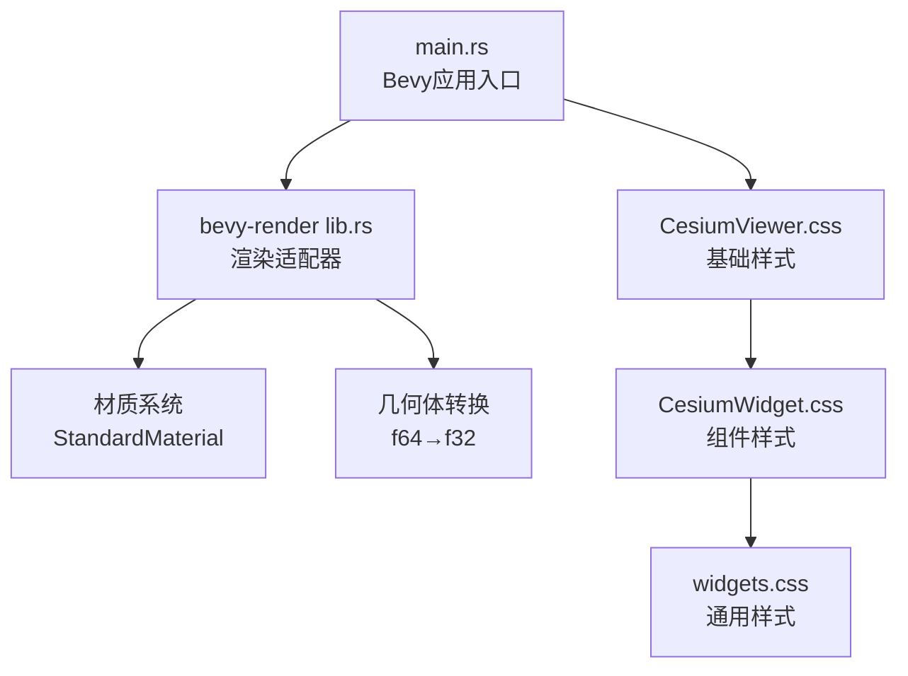
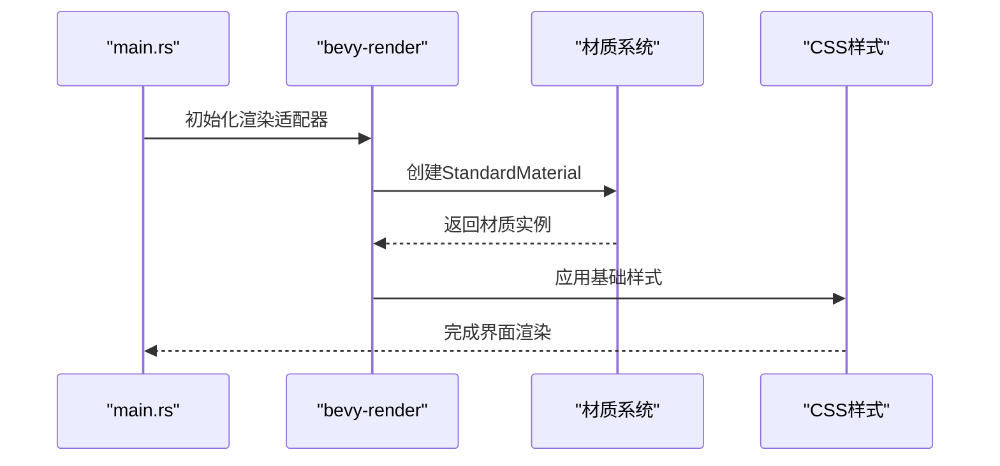
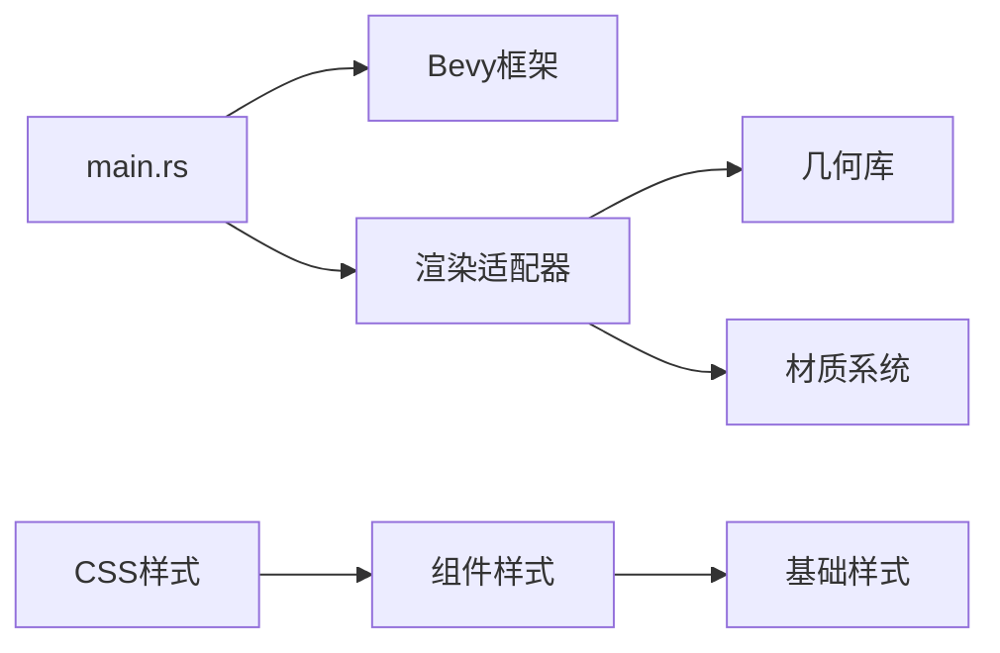

# 主题定制

<cite>
**本文引用的文件**   
- [CesiumViewer.css](file://Apps/CesiumViewer/CesiumViewer.css)
- [index.html](file://Apps/CesiumViewer/index.html)
- [CesiumWidget.css](file://packages/engine/Source/Widget/CesiumWidget.css)
- [widgets.css](file://packages/widgets/Source/widgets.css)
- [lib.rs](file://cesiumrust/adapters/bevy-render/src/lib.rs)
- [main.rs](file://cesiumrust/application/cesium-app/src/main.rs)
</cite>

## 更新摘要
**所做更改**   
- 移除了基于GPUI的桌面应用程序主题系统相关内容
- 更新了项目架构说明，反映从GPUI到纯Bevy游戏引擎的转变
- 删除了CSS变量系统和样式覆盖机制的相关章节
- 添加了Bevy渲染适配器和应用结构的说明
- 更新了依赖关系分析和性能考虑部分

## 目录
1. [简介](#简介)
2. [项目结构](#项目结构)
3. [核心组件](#核心组件)
4. [架构总览](#架构总览)
5. [详细组件分析](#详细组件分析)
6. [依赖关系分析](#依赖关系分析)
7. [性能考虑](#性能考虑)
8. [故障排查指南](#故障排查指南)
9. [结论](#结论)
10. [附录](#附录)

## 简介
本技术文档聚焦于 Cesium UI 的主题定制能力。随着项目从 GPUI 桌面应用程序转向纯 Bevy 游戏引擎架构，主题系统已发生重大变化。当前版本移除了基于 CSS 变量的主题系统，转而采用 Bevy 的原生渲染和材质系统。本文将详细说明新的架构设计、渲染管线以及如何在 Bevy 环境中实现视觉定制。

## 项目结构
与主题定制直接相关的资源现在主要位于 Bevy 渲染适配器和应用程序中：
- Bevy 渲染适配器：
  - cesiumrust/adapters/bevy-render/src/lib.rs：Bevy 渲染适配器的核心实现，负责几何体转换和材质处理
  - cesiumrust/application/cesium-app/src/main.rs：应用程序入口，配置渲染管线和视觉效果
- Web 界面基础样式：
  - Apps/CesiumViewer/CesiumViewer.css：Web 界面的基础样式设置
  - packages/engine/Source/Widget/CesiumWidget.css：Cesium 组件的基础样式
  - packages/widgets/Source/widgets.css：通用组件样式

**图表来源**
- [main.rs:74-107](file://cesiumrust/application/cesium-app/src/main.rs#L74-L107)
- [lib.rs:1-78](file://cesiumrust/adapters/bevy-render/src/lib.rs#L1-L78)
- [CesiumViewer.css:1-42](file://Apps/CesiumViewer/CesiumViewer.css#L1-L42)

**章节来源**
- [lib.rs:1-78](file://cesiumrust/adapters/bevy-render/src/lib.rs#L1-L78)
- [main.rs:74-107](file://cesiumrust/application/cesium-app/src/main.rs#L74-L107)
- [CesiumViewer.css:1-42](file://Apps/CesiumViewer/CesiumViewer.css#L1-L42)

## 核心组件
- **Bevy 渲染适配器**：将领域几何数据转换为 Bevy Mesh，实现 GPU 渲染
- **材质系统**：使用 StandardMaterial 进行着色和外观控制
- **几何体转换器**：处理 f64 到 f32 的精度转换，确保渲染精度
- **基础样式层**：提供 Web 界面的基础样式和布局
- **组件样式层**：定义 Cesium 组件的视觉表现

**章节来源**
- [lib.rs:85-134](file://cesiumrust/adapters/bevy-render/src/lib.rs#L85-L134)
- [main.rs:45-72](file://cesiumrust/application/cesium-app/src/main.rs#L45-L72)
- [CesiumWidget.css:1-120](file://packages/engine/Source/Widget/CesiumWidget.css#L1-L120)

## 架构总览
新的架构遵循"Bevy 原生渲染 + 材质驱动"的模式：
- 在 Bevy 应用中配置渲染管线和材质系统
- 通过 StandardMaterial 控制颜色、纹理和光照效果
- 使用几何体转换器处理不同精度的数据
- Web 界面通过基础 CSS 文件提供统一的视觉风格

**图表来源**
- [main.rs:74-107](file://cesiumrust/application/cesium-app/src/main.rs#L74-L107)
- [lib.rs:323-347](file://cesiumrust/adapters/bevy-render/src/lib.rs#L323-L347)
- [CesiumViewer.css:1-42](file://Apps/CesiumViewer/CesiumViewer.css#L1-L42)

## 详细组件分析

### Bevy 渲染适配器架构
- **几何体转换**：将领域层的 GeometryData（f64）转换为 Bevy Mesh（f32），确保渲染精度
- **材质管理**：使用 StandardMaterial 提供 PBR 材质支持
- **纹理处理**：支持图像纹理和纯色纹理的创建与应用
- **网格生成**：提供椭球体、地形等复杂几何体的生成函数

**章节来源**
- [lib.rs:85-134](file://cesiumrust/adapters/bevy-render/src/lib.rs#L85-L134)
- [lib.rs:150-187](file://cesiumrust/adapters/bevy-render/src/lib.rs#L150-L187)
- [lib.rs:189-223](file://cesiumrust/adapters/bevy-render/src/lib.rs#L189-L223)

### 材质系统与颜色管理
- **StandardMaterial**：基于物理的渲染材质，支持基础颜色、粗糙度、金属度等属性
- **颜色空间**：使用 sRGB 颜色空间，确保跨平台一致性
- **光照模型**：集成环境光和方向光，支持阴影投射
- **纹理映射**：支持漫反射贴图、法线贴图等多种纹理类型

**章节来源**
- [main.rs:45-72](file://cesiumrust/application/cesium-app/src/main.rs#L45-L72)
- [lib.rs:337-347](file://cesiumrust/adapters/bevy-render/src/lib.rs#L337-L347)

### Web 界面样式架构
- **基础样式**：CesiumViewer.css 提供全屏容器和加载指示器样式
- **组件样式**：CesiumWidget.css 定义 Cesium 组件的视觉规范
- **响应式设计**：使用百分比布局和相对单位，适配不同屏幕尺寸
- **字体管理**：使用系统默认字体族，确保跨平台兼容性

**章节来源**
- [CesiumViewer.css:1-42](file://Apps/CesiumViewer/CesiumViewer.css#L1-L42)
- [CesiumWidget.css:1-120](file://packages/engine/Source/Widget/CesiumWidget.css#L1-L120)

### 应用程序启动流程
- **插件系统**：通过 Bevy 插件机制模块化功能
- **渲染管线**：配置窗口、清除颜色和诊断工具
- **相机控制**：集成轨道相机，支持鼠标交互
- **视觉效果**：添加大气辉光和星空背景

**章节来源**
- [main.rs:74-107](file://cesiumrust/application/cesium-app/src/main.rs#L74-L107)

## 依赖关系分析
- **Bevy 框架依赖**：
  - bevy::prelude：核心 API 和常用类型
  - bevy::render：渲染管线和材质系统
  - bevy::window：窗口管理和输入处理
- **几何库依赖**：
  - glam：向量数学运算
  - cesium_geospatial：地理空间计算
- **样式依赖**：
  - CSS 文件按层次加载，形成样式继承链

**图表来源**
- [main.rs:9-23](file://cesiumrust/application/cesium-app/src/main.rs#L9-L23)
- [lib.rs:79-84](file://cesiumrust/adapters/bevy-render/src/lib.rs#L79-L84)
- [CesiumViewer.css:1-2](file://Apps/CesiumViewer/CesiumViewer.css#L1-L2)

**章节来源**
- [main.rs:9-23](file://cesiumrust/application/cesium-app/src/main.rs#L9-L23)
- [lib.rs:79-84](file://cesiumrust/adapters/bevy-render/src/lib.rs#L79-L84)

## 性能考虑
- **精度转换优化**：f64 到 f32 的转换在批量处理时进行，减少内存分配
- **材质缓存**：重复使用的材质实例被缓存，避免重复创建
- **纹理压缩**：使用适当的纹理格式，减少内存占用
- **渲染批次**：相似的材质和几何体合并渲染，提高绘制效率
- **样式优化**：CSS 文件按需加载，减少初始加载时间

## 故障排查指南
- **渲染问题**：
  - 检查几何体坐标范围是否在合理范围内
  - 验证材质属性设置是否正确
  - 确认光照强度和方向设置
- **样式问题**：
  - 检查 CSS 文件加载顺序
  - 验证选择器特异性
  - 确认浏览器兼容性
- **性能问题**：
  - 监控帧率和内存使用
  - 优化几何体复杂度
  - 调整纹理分辨率

## 结论
通过迁移到 Bevy 游戏引擎，Cesium 获得了更强大的渲染能力和更好的跨平台支持。新的架构提供了灵活的材质系统和高效的几何处理能力，同时保持了 Web 界面的简洁性和可维护性。虽然移除了传统的 CSS 变量主题系统，但通过 Bevy 的材质系统和 Web 样式分层，仍然能够实现丰富的视觉定制效果。

## 附录
- **术语表**：
  - Bevy：Rust 游戏引擎框架
  - StandardMaterial：基于物理的材质系统
  - 几何体转换：数据类型精度转换过程
  - 渲染管线：图形渲染的处理流程
- **参考实现路径**：
  - Bevy 渲染适配器：[lib.rs](file://cesiumrust/adapters/bevy-render/src/lib.rs)
  - 应用程序入口：[main.rs](file://cesiumrust/application/cesium-app/src/main.rs)
  - Web 基础样式：[CesiumViewer.css](file://Apps/CesiumViewer/CesiumViewer.css)
  - 组件样式：[CesiumWidget.css](file://packages/engine/Source/Widget/CesiumWidget.css)