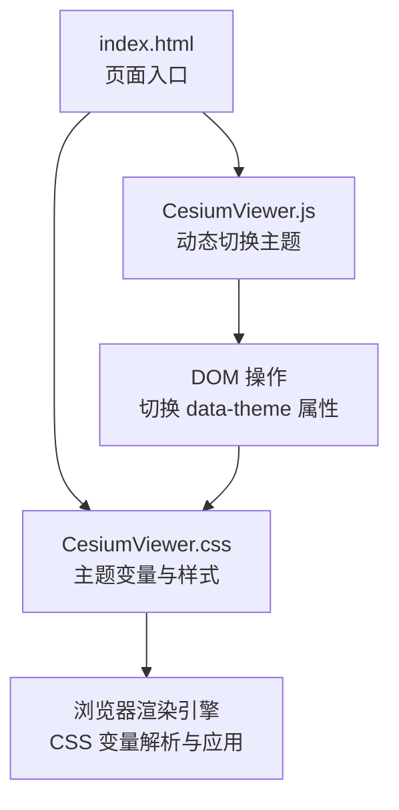
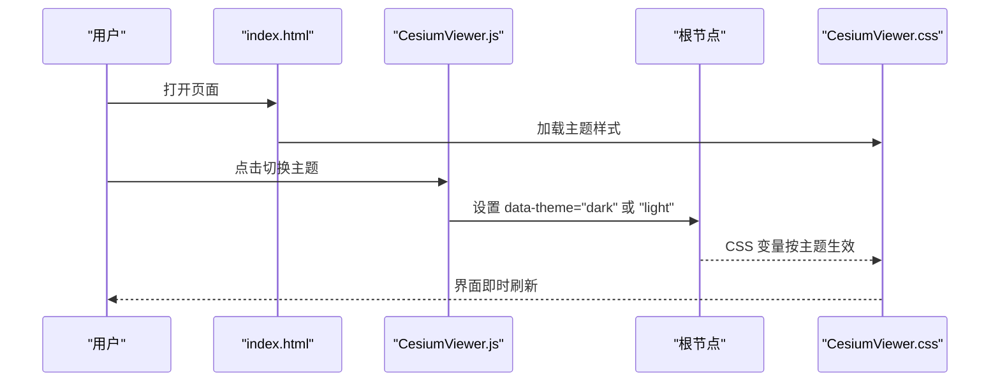
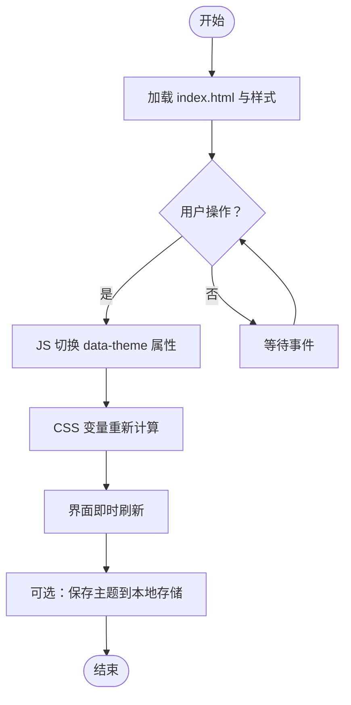
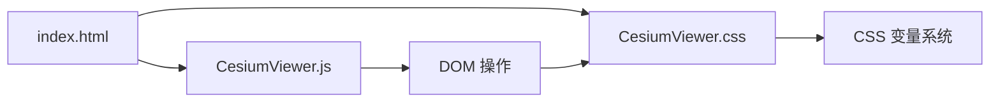

# 主题定制

<cite>
**本文引用的文件**   
- [CesiumViewer.css](file://Apps/CesiumViewer/CesiumViewer.css)
- [CesiumViewer.js](file://Apps/CesiumViewer/CesiumViewer.js)
- [index.html](file://Apps/CesiumViewer/index.html)
- [OpenSans-Main.css](file://Specs/Data/Fonts/OpenSans-Main.css)
</cite>

## 目录
1. [简介](#简介)
2. [项目结构](#项目结构)
3. [核心组件](#核心组件)
4. [架构总览](#架构总览)
5. [详细组件分析](#详细组件分析)
6. [依赖关系分析](#依赖关系分析)
7. [性能考虑](#性能考虑)
8. [故障排查指南](#故障排查指南)
9. [结论](#结论)
10. [附录](#附录)

## 简介
本技术文档聚焦于 Cesium UI 的主题定制能力，围绕 CSS 变量系统与样式架构设计展开，系统阐述主题覆盖机制、样式优先级与继承规则，并给出自定义颜色方案、字体样式与布局尺寸的方法。同时提供响应式断点与移动端适配策略说明，以及暗色主题、高对比度模式和无障碍访问支持的配置指南。为便于实践，文档包含完整的主题创建、动态切换与品牌定制流程示例（以代码片段路径形式引用）。

## 项目结构
与主题定制直接相关的资源位于应用示例与测试数据中：
- 应用示例页面与样式：
  - Apps/CesiumViewer/index.html：页面入口，负责引入基础样式与脚本。
  - Apps/CesiumViewer/CesiumViewer.css：应用级样式，承载主题变量与组件样式。
  - Apps/CesiumViewer/CesiumViewer.js：应用逻辑，演示如何动态切换主题。
- 字体资源：
  - Specs/Data/Fonts/OpenSans-Main.css：字体加载与基本排版样式，可作为品牌字体的参考实现。

图表来源
- [index.html](file://Apps/CesiumViewer/index.html)
- [CesiumViewer.css](file://Apps/CesiumViewer/CesiumViewer.css)
- [CesiumViewer.js](file://Apps/CesiumViewer/CesiumViewer.js)

章节来源
- [index.html](file://Apps/CesiumViewer/index.html)
- [CesiumViewer.css](file://Apps/CesiumViewer/CesiumViewer.css)
- [CesiumViewer.js](file://Apps/CesiumViewer/CesiumViewer.js)

## 核心组件
- 主题变量层：通过 CSS 自定义属性集中定义颜色、字号、间距、阴影等，作为全局主题源。
- 组件样式层：基于主题变量构建按钮、面板、工具栏等控件的视觉表现。
- 运行时切换层：通过 DOM 属性或类名切换主题，触发 CSS 变量重算与样式更新。
- 字体与排版层：使用外部字体样式文件，统一文本外观与行高。

章节来源
- [CesiumViewer.css](file://Apps/CesiumViewer/CesiumViewer.css)
- [CesiumViewer.js](file://Apps/CesiumViewer/CesiumViewer.js)
- [OpenSans-Main.css](file://Specs/Data/Fonts/OpenSans-Main.css)

## 架构总览
主题系统的整体架构遵循“变量驱动 + 运行时切换”的模式：
- 在根节点定义主题变量集合。
- 组件样式通过 var() 引用变量，形成松耦合的样式依赖。
- 运行时通过切换根节点的 data-theme 属性，将不同变量集注入到同一套样式结构中，实现主题切换。

图表来源
- [index.html](file://Apps/CesiumViewer/index.html)
- [CesiumViewer.js](file://Apps/CesiumViewer/CesiumViewer.js)
- [CesiumViewer.css](file://Apps/CesiumViewer/CesiumViewer.css)

## 详细组件分析

### 主题变量与样式架构
- 变量命名规范：采用语义化前缀（如 --color-primary、--font-size-base、--spacing-md），确保跨组件一致性与可维护性。
- 作用域策略：在 :root 下定义默认主题变量；在 [data-theme="dark"] 下定义暗色变量，实现覆盖。
- 继承规则：子组件优先读取自身局部变量，若未定义则向上查找父级或根级变量。
- 优先级控制：通过选择器特异性与加载顺序决定最终值；避免使用 !important，必要时仅在隔离组件内谨慎使用。

章节来源
- [CesiumViewer.css](file://Apps/CesiumViewer/CesiumViewer.css)

### 主题覆盖机制与样式优先级
- 覆盖方式：新增一个主题样式文件或块，在相同选择器下重新声明变量或样式，利用加载顺序覆盖默认值。
- 优先级原则：
  - 选择器特异性越高，优先级越高。
  - 后加载的样式覆盖先加载的样式。
  - 内联样式优先级高于外部样式表（尽量避免）。
- 最佳实践：
  - 将主题变量集中在根节点，减少重复声明。
  - 使用 CSS 变量组合派生值（如 --color-on-primary = color-mix(...)）降低维护成本。
  - 对复杂组件使用 BEM 或类似命名约定，避免冲突。

章节来源
- [CesiumViewer.css](file://Apps/CesiumViewer/CesiumViewer.css)

### 自定义颜色方案
- 步骤概览：
  - 在根节点定义主色、辅助色、中性色、成功/警告/错误等语义色变量。
  - 在组件样式中使用这些变量，而非硬编码颜色值。
  - 新增主题时仅替换变量值，无需改动组件样式。
- 推荐做法：
  - 使用色彩对比度校验工具确保可读性。
  - 为透明背景与叠加层定义 alpha 通道变量，提升层次感。

章节来源
- [CesiumViewer.css](file://Apps/CesiumViewer/CesiumViewer.css)

### 自定义字体样式与品牌定制
- 字体加载：通过外部字体样式文件引入品牌字体，并在根节点设置 --font-family-base 等变量。
- 排版层级：定义标题、正文、提示文本的字号与行高变量，保证一致性。
- 国际化支持：为多语言场景准备备用字体族，避免字符缺失导致的回退问题。

章节来源
- [OpenSans-Main.css](file://Specs/Data/Fonts/OpenSans-Main.css)
- [CesiumViewer.css](file://Apps/CesiumViewer/CesiumViewer.css)

### 布局尺寸与间距体系
- 间距尺度：定义 --spacing-xs/sm/md/lg/xl 等变量，统一边距与内边距。
- 栅格与容器：使用相对单位（rem、vw/vh）与变量组合，实现弹性布局。
- 圆角与阴影：通过 --radius-* 与 --shadow-* 变量管理视觉风格。

章节来源
- [CesiumViewer.css](file://Apps/CesiumViewer/CesiumViewer.css)

### 响应式设计断点与移动端适配
- 断点策略：使用媒体查询在不同屏幕宽度下调整变量值（如字号、间距、面板宽度）。
- 移动端优化：
  - 增大触控目标尺寸（按钮最小高度/宽度）。
  - 简化导航与隐藏次要信息。
  - 使用更紧凑的间距与更清晰的层次。
- 横竖屏适配：针对横屏增加侧边栏宽度，竖屏则折叠为抽屉式。

章节来源
- [CesiumViewer.css](file://Apps/CesiumViewer/CesiumViewer.css)

### 暗色主题实现
- 变量覆盖：在 [data-theme="dark"] 下重新定义所有相关变量，保持语义不变但数值适配暗色背景。
- 对比度保障：确保前景色与背景色的对比度满足 WCAG AA 标准。
- 渐变与高光：适当降低饱和度，提高明度差异，避免刺眼效果。

章节来源
- [CesiumViewer.css](file://Apps/CesiumViewer/CesiumViewer.css)

### 高对比度模式
- 启用方式：通过 prefers-contrast: more 媒体查询或 data-theme="high-contrast" 激活。
- 样式要点：
  - 提高边框与描边粗细。
  - 使用纯色替代渐变。
  - 强化焦点指示器。
- 无障碍建议：配合 aria-* 属性与键盘导航，确保可用性与可感知性。

章节来源
- [CesiumViewer.css](file://Apps/CesiumViewer/CesiumViewer.css)

### 无障碍访问支持
- 焦点可见性：为所有交互元素提供清晰的 outline 样式。
- 语义化标签：使用 button、nav、main 等语义元素，提升屏幕阅读器体验。
- 颜色与图标：不单独依赖颜色传达信息，辅以图标与文字说明。
- 键盘可达性：确保 Tab 顺序合理，Enter/Space 行为符合预期。

章节来源
- [CesiumViewer.css](file://Apps/CesiumViewer/CesiumViewer.css)

### 动态切换主题的实现流程
- 入口与触发：
  - index.html 引入样式与脚本。
  - CesiumViewer.js 监听用户操作，切换根节点的 data-theme 属性。
- 变量生效：
  - 切换后，浏览器立即根据新属性选择对应的变量集。
  - 组件样式通过 var() 自动应用新值，无需重新渲染。
- 持久化与恢复：
  - 可将当前主题写入 localStorage，页面加载时读取并应用。

图表来源
- [index.html](file://Apps/CesiumViewer/index.html)
- [CesiumViewer.js](file://Apps/CesiumViewer/CesiumViewer.js)
- [CesiumViewer.css](file://Apps/CesiumViewer/CesiumViewer.css)

章节来源
- [index.html](file://Apps/CesiumViewer/index.html)
- [CesiumViewer.js](file://Apps/CesiumViewer/CesiumViewer.js)
- [CesiumViewer.css](file://Apps/CesiumViewer/CesiumViewer.css)

### 完整示例指引（主题创建、动态切换与品牌定制）
- 创建新主题：
  - 在主题样式文件中新增 [data-theme="your-brand"] 块，覆盖变量。
  - 在页面中引入该样式文件，或通过 JS 动态加载。
- 动态切换：
  - 在 CesiumViewer.js 中添加切换函数，设置根节点 data-theme。
  - 绑定按钮点击事件调用切换函数。
- 品牌定制：
  - 在 OpenSans-Main.css 基础上替换字体族与排版变量。
  - 调整颜色与间距变量以匹配品牌规范。

章节来源
- [CesiumViewer.css](file://Apps/CesiumViewer/CesiumViewer.css)
- [CesiumViewer.js](file://Apps/CesiumViewer/CesiumViewer.js)
- [OpenSans-Main.css](file://Specs/Data/Fonts/OpenSans-Main.css)

## 依赖关系分析
- 页面依赖：
  - index.html 依赖 CesiumViewer.css 与 CesiumViewer.js。
- 样式依赖：
  - CesiumViewer.css 依赖 CSS 变量与媒体查询，可能引用字体样式。
- 运行时代码依赖：
  - CesiumViewer.js 依赖 DOM API 与浏览器特性（localStorage、媒体查询监听）。

图表来源
- [index.html](file://Apps/CesiumViewer/index.html)
- [CesiumViewer.css](file://Apps/CesiumViewer/CesiumViewer.css)
- [CesiumViewer.js](file://Apps/CesiumViewer/CesiumViewer.js)

章节来源
- [index.html](file://Apps/CesiumViewer/index.html)
- [CesiumViewer.css](file://Apps/CesiumViewer/CesiumViewer.css)
- [CesiumViewer.js](file://Apps/CesiumViewer/CesiumViewer.js)

## 性能考虑
- 变量复用：尽量通过变量组合派生值，减少重复样式与重绘。
- 媒体查询优化：合并相近断点，避免过多嵌套。
- 字体加载：预加载关键字体，避免 FOIT/FOUT 闪烁。
- 主题切换：避免频繁切换导致大量重排，必要时批量更新 DOM。

[本节为通用指导，不直接分析具体文件]

## 故障排查指南
- 主题未生效：
  - 检查 data-theme 是否正确设置。
  - 确认样式文件加载顺序与选择器特异性。
- 颜色对比度不足：
  - 使用对比度检测工具验证。
  - 调整变量值以满足无障碍标准。
- 字体显示异常：
  - 检查字体文件路径与 MIME 类型。
  - 添加备用字体族以避免回退失败。
- 移动端布局错乱：
  - 核对媒体查询断点与变量值。
  - 检查触控目标尺寸与间距是否合适。

章节来源
- [CesiumViewer.css](file://Apps/CesiumViewer/CesiumViewer.css)
- [CesiumViewer.js](file://Apps/CesiumViewer/CesiumViewer.js)
- [OpenSans-Main.css](file://Specs/Data/Fonts/OpenSans-Main.css)

## 结论
通过 CSS 变量系统与运行时切换机制，Cesium UI 实现了灵活且可维护的主题定制能力。遵循变量命名规范、样式优先级与无障碍最佳实践，可以在不侵入组件样式的前提下完成颜色、字体与布局的全面定制。结合响应式断点与移动端适配策略，能够为用户提供一致的跨设备体验。

[本节为总结性内容，不直接分析具体文件]

## 附录
- 术语表：
  - CSS 变量：CSS 自定义属性，用于集中管理主题值。
  - 数据属性：data-* 属性，用于标记当前主题状态。
  - 媒体查询：@media 规则，用于响应式适配。
- 参考实现路径：
  - 主题变量与组件样式：[CesiumViewer.css](file://Apps/CesiumViewer/CesiumViewer.css)
  - 动态切换逻辑：[CesiumViewer.js](file://Apps/CesiumViewer/CesiumViewer.js)
  - 字体与排版：[OpenSans-Main.css](file://Specs/Data/Fonts/OpenSans-Main.css)
  - 页面入口：[index.html](file://Apps/CesiumViewer/index.html)