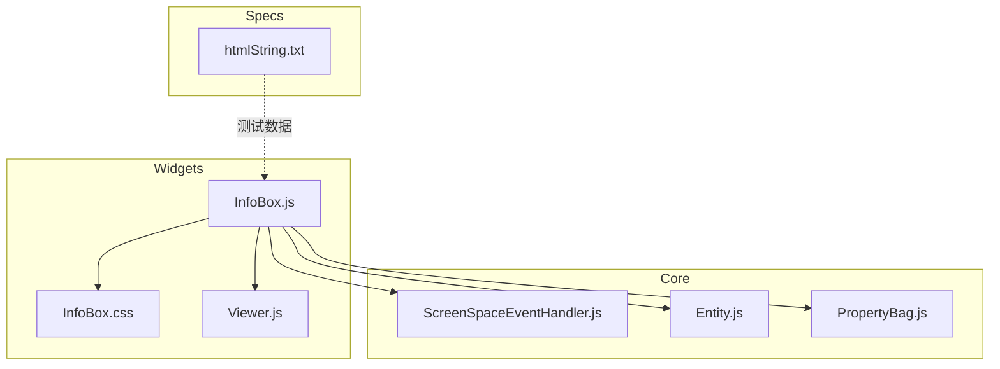
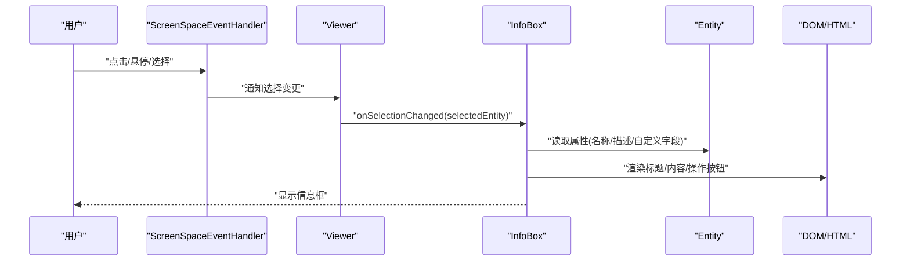
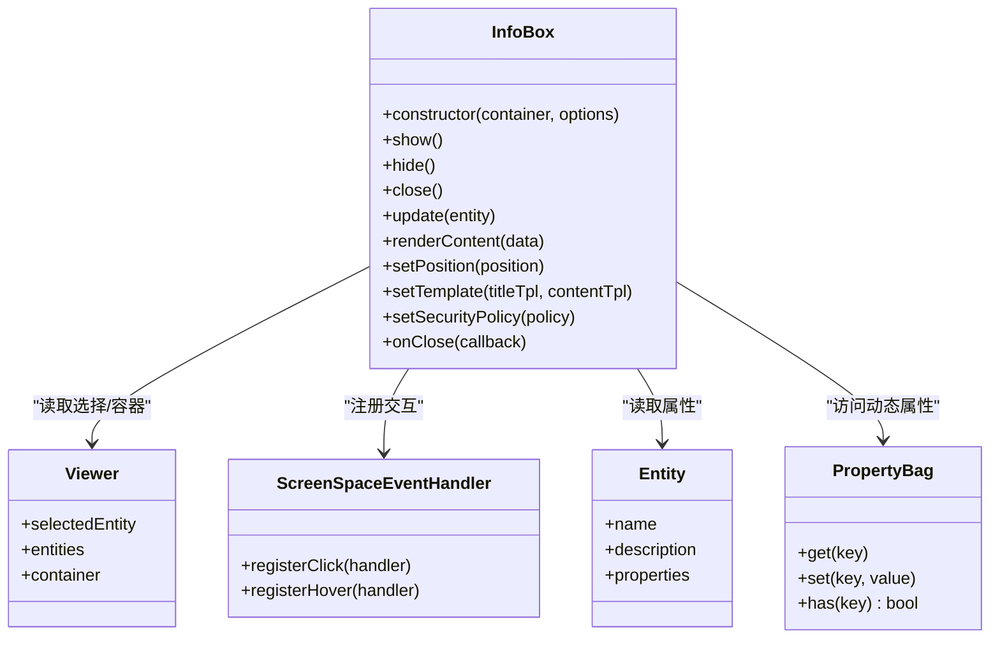
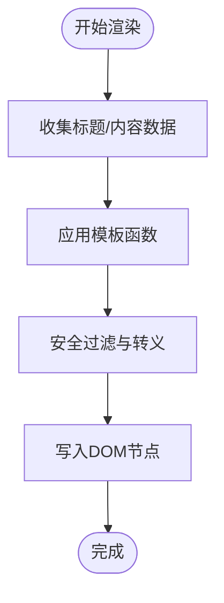
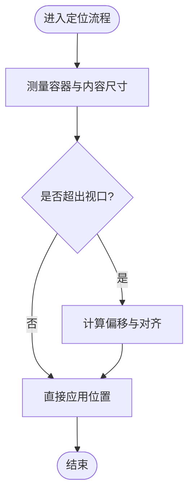
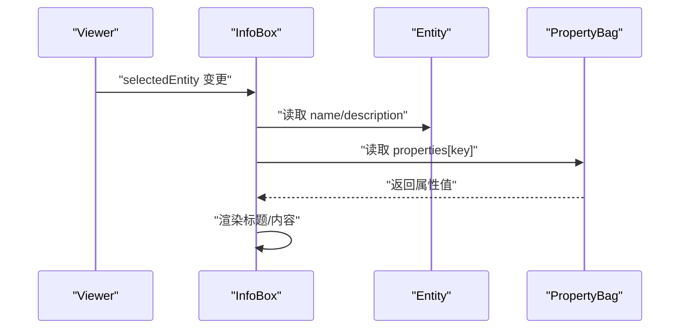
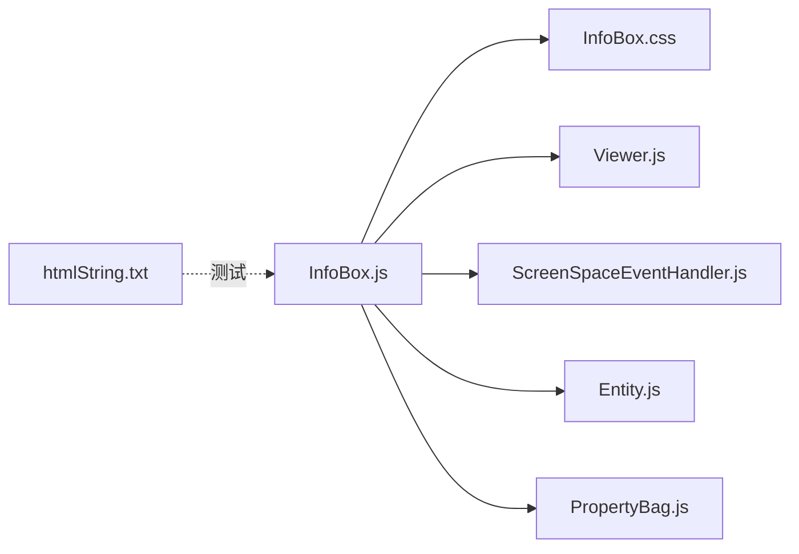

# 信息框组件

<cite>
**本文引用的文件**   
- [InfoBox.js](file://packages/widgets/src/InfoBox/InfoBox.js)
- [InfoBox.css](file://packages/widgets/src/InfoBox/InfoBox.css)
- [Viewer.js](file://packages/widgets/src/Viewer/Viewer.js)
- [ScreenSpaceEventHandler.js](file://Source/Scene/ScreenSpaceEventHandler.js)
- [Entity.js](file://Source/Entities/Entity.js)
- [PropertyBag.js](file://Source/DataSources/PropertyBag.js)
- [htmlString.txt](file://Specs/Data/htmlString.txt)
</cite>

## 目录
1. [简介](#简介)
2. [项目结构](#项目结构)
3. [核心组件](#核心组件)
4. [架构总览](#架构总览)
5. [详细组件分析](#详细组件分析)
6. [依赖关系分析](#依赖关系分析)
7. [性能考虑](#性能考虑)
8. [故障排查指南](#故障排查指南)
9. [结论](#结论)
10. [附录](#附录)

## 简介
本技术文档聚焦于 Cesium 信息框（InfoBox）组件，围绕 InfoBox 类的设计与实现进行深入解析。内容涵盖：
- 内容渲染机制、HTML 支持与安全策略
- 显示控制、位置定位与内容更新方法
- 与实体系统（Entity）的集成与数据绑定
- 样式定制、主题适配与国际化支持
- 完整使用示例路径与最佳实践
- 富文本、图片与外部链接的安全使用指南

## 项目结构
InfoBox 组件位于 widgets 包中，包含 JavaScript 逻辑与 CSS 样式；其交互由屏幕事件处理器驱动，并与 Viewer 和 Entity 系统紧密协作。

图表来源
- [InfoBox.js](file://packages/widgets/src/InfoBox/InfoBox.js)
- [InfoBox.css](file://packages/widgets/src/InfoBox/InfoBox.css)
- [Viewer.js](file://packages/widgets/src/Viewer/Viewer.js)
- [ScreenSpaceEventHandler.js](file://Source/Scene/ScreenSpaceEventHandler.js)
- [Entity.js](file://Source/Entities/Entity.js)
- [PropertyBag.js](file://Source/DataSources/PropertyBag.js)
- [htmlString.txt](file://Specs/Data/htmlString.txt)

章节来源
- [InfoBox.js](file://packages/widgets/src/InfoBox/InfoBox.js)
- [InfoBox.css](file://packages/widgets/src/InfoBox/InfoBox.css)
- [Viewer.js](file://packages/widgets/src/Viewer/Viewer.js)
- [ScreenSpaceEventHandler.js](file://Source/Scene/ScreenSpaceEventHandler.js)
- [Entity.js](file://Source/Entities/Entity.js)
- [PropertyBag.js](file://Source/DataSources/PropertyBag.js)
- [htmlString.txt](file://Specs/Data/htmlString.txt)

## 核心组件
- InfoBox：负责信息框的创建、显示/隐藏、内容渲染、位置定位、事件处理以及与实体系统的联动。
- InfoBox.css：定义信息框容器、标题栏、内容区、关闭按钮等样式，支持主题化扩展。
- Viewer：提供场景上下文、图层集合、选择状态与 UI 容器，InfoBox 通常作为 Viewer 的附属 UI。
- ScreenSpaceEventHandler：监听鼠标/触摸事件，触发 InfoBox 的打开、关闭与内容刷新。
- Entity：承载地理要素及其属性，InfoBox 通过属性访问器读取并展示实体信息。
- PropertyBag：通用属性容器，用于动态键值对存储与访问，常用于实体属性或配置项。

章节来源
- [InfoBox.js](file://packages/widgets/src/InfoBox/InfoBox.js)
- [InfoBox.css](file://packages/widgets/src/InfoBox/InfoBox.css)
- [Viewer.js](file://packages/widgets/src/Viewer/Viewer.js)
- [ScreenSpaceEventHandler.js](file://Source/Scene/ScreenSpaceEventHandler.js)
- [Entity.js](file://Source/Entities/Entity.js)
- [PropertyBag.js](file://Source/DataSources/PropertyBag.js)

## 架构总览
InfoBox 在运行时的工作流如下：用户交互通过 ScreenSpaceEventHandler 捕获，调用 InfoBox 的显示/更新方法；InfoBox 从当前选中的 Entity 或指定数据源读取属性，渲染到 DOM 节点；CSS 控制外观与布局；Viewer 提供整体上下文与生命周期管理。

图表来源
- [ScreenSpaceEventHandler.js](file://Source/Scene/ScreenSpaceEventHandler.js)
- [Viewer.js](file://packages/widgets/src/Viewer/Viewer.js)
- [InfoBox.js](file://packages/widgets/src/InfoBox/InfoBox.js)
- [Entity.js](file://Source/Entities/Entity.js)

## 详细组件分析

### InfoBox 类设计与实现
- 构造与初始化
  - 接收宿主容器（通常为 Viewer 的 UI 层），注册事件监听，准备 DOM 结构与初始样式。
  - 可配置项包括：是否自动跟随选中实体、默认标题模板、内容模板、关闭行为等。
- 显示控制
  - show()/hide()：显式控制可见性；updateVisibility()：根据选择状态同步。
  - close()：关闭并清理临时状态，释放资源。
- 位置定位
  - 基于容器尺寸与视口边界计算偏移，避免溢出；支持锚点与对齐方式。
- 内容渲染
  - 支持纯文本与 HTML 片段；提供模板函数将实体属性注入到内容区域。
  - 对 HTML 进行安全过滤与转义，防止 XSS。
- 事件处理
  - 监听关闭按钮点击、键盘 ESC 关闭、焦点管理等。
- 与实体系统集成
  - 订阅 Viewer 的选择变化事件，当 selectedEntity 改变时触发内容更新。
  - 通过 PropertyBag 访问动态属性，支持可选字段与空值回退。

图表来源
- [InfoBox.js](file://packages/widgets/src/InfoBox/InfoBox.js)
- [Viewer.js](file://packages/widgets/src/Viewer/Viewer.js)
- [ScreenSpaceEventHandler.js](file://Source/Scene/ScreenSpaceEventHandler.js)
- [Entity.js](file://Source/Entities/Entity.js)
- [PropertyBag.js](file://Source/DataSources/PropertyBag.js)

章节来源
- [InfoBox.js](file://packages/widgets/src/InfoBox/InfoBox.js)
- [Viewer.js](file://packages/widgets/src/Viewer/Viewer.js)
- [ScreenSpaceEventHandler.js](file://Source/Scene/ScreenSpaceEventHandler.js)
- [Entity.js](file://Source/Entities/Entity.js)
- [PropertyBag.js](file://Source/DataSources/PropertyBag.js)

### 内容渲染机制与 HTML 支持
- 渲染流程
  - 收集标题与内容数据（来自 Entity 属性或外部数据）。
  - 应用模板函数生成最终字符串。
  - 执行安全过滤后写入 DOM。
- HTML 支持
  - 允许插入富文本、图片与链接，但需遵循安全策略。
  - 提供白名单标签与属性过滤，移除危险脚本与事件处理器。
- 安全考虑
  - 禁止内联脚本与危险协议（如 javascript:）。
  - 对外部资源加载启用 CSP 检查与同源校验。
  - 提供 setSecurityPolicy() 接口以调整严格程度。

图表来源
- [InfoBox.js](file://packages/widgets/src/InfoBox/InfoBox.js)
- [htmlString.txt](file://Specs/Data/htmlString.txt)

章节来源
- [InfoBox.js](file://packages/widgets/src/InfoBox/InfoBox.js)
- [htmlString.txt](file://Specs/Data/htmlString.txt)

### 显示控制与位置定位
- 显示控制
  - 通过 show()/hide() 切换可见性；updateVisibility() 根据选择状态自动同步。
  - close() 会触发 onClose 回调，便于上层业务清理。
- 位置定位
  - 基于容器尺寸与视口边界计算，确保不溢出屏幕。
  - 支持锚点（左上/右上/左下/右下）与对齐方式（start/end）。
  - 响应窗口大小变化与滚动事件，动态修正位置。

图表来源
- [InfoBox.js](file://packages/widgets/src/InfoBox/InfoBox.js)

章节来源
- [InfoBox.js](file://packages/widgets/src/InfoBox/InfoBox.js)

### 与实体系统的集成与数据绑定
- 选择联动
  - 订阅 Viewer.selectedEntity 变化，当实体切换时自动更新信息框内容。
- 属性访问
  - 通过 Entity.properties 与 PropertyBag 获取动态字段，支持空值回退与默认值。
- 模板绑定
  - 标题与内容模板可使用占位符映射到实体属性，实现灵活展示。

图表来源
- [Viewer.js](file://packages/widgets/src/Viewer/Viewer.js)
- [InfoBox.js](file://packages/widgets/src/InfoBox/InfoBox.js)
- [Entity.js](file://Source/Entities/Entity.js)
- [PropertyBag.js](file://Source/DataSources/PropertyBag.js)

章节来源
- [Viewer.js](file://packages/widgets/src/Viewer/Viewer.js)
- [InfoBox.js](file://packages/widgets/src/InfoBox/InfoBox.js)
- [Entity.js](file://Source/Entities/Entity.js)
- [PropertyBag.js](file://Source/DataSources/PropertyBag.js)

### 样式定制、主题适配与国际化
- 样式定制
  - 通过 InfoBox.css 覆盖默认样式，支持深色/浅色主题切换。
  - 提供 CSS 变量或类名约定，便于统一风格。
- 主题适配
  - 根据 Viewer 的主题模式动态切换样式类，保证对比度与可读性。
- 国际化支持
  - 标题与提示文案可通过 i18n 字典替换，模板函数中传入本地化字符串。

章节来源
- [InfoBox.css](file://packages/widgets/src/InfoBox/InfoBox.css)
- [InfoBox.js](file://packages/widgets/src/InfoBox/InfoBox.js)

### 使用示例与最佳实践
以下为常见用法的“代码片段路径”，请根据实际仓库版本定位对应行号：
- 创建与配置信息框
  - [InfoBox 构造函数与选项](file://packages/widgets/src/InfoBox/InfoBox.js)
- 绑定实体选择事件
  - [Viewer 选择事件处理](file://packages/widgets/src/Viewer/Viewer.js)
  - [ScreenSpaceEventHandler 注册点击/悬停](file://Source/Scene/ScreenSpaceEventHandler.js)
- 动态更新内容
  - [InfoBox.update 方法](file://packages/widgets/src/InfoBox/InfoBox.js)
- 设置安全策略与模板
  - [InfoBox.setSecurityPolicy/setTemplate](file://packages/widgets/src/InfoBox/InfoBox.js)
- 富文本与图片渲染
  - [测试 HTML 数据](file://Specs/Data/htmlString.txt)

章节来源
- [InfoBox.js](file://packages/widgets/src/InfoBox/InfoBox.js)
- [Viewer.js](file://packages/widgets/src/Viewer/Viewer.js)
- [ScreenSpaceEventHandler.js](file://Source/Scene/ScreenSpaceEventHandler.js)
- [htmlString.txt](file://Specs/Data/htmlString.txt)

## 依赖关系分析
InfoBox 的依赖关系如下：
- 内部依赖
  - InfoBox.css：样式与主题
  - Viewer.js：容器与选择状态
  - ScreenSpaceEventHandler.js：交互事件
- 核心依赖
  - Entity.js：数据源
  - PropertyBag.js：属性访问
- 测试数据
  - htmlString.txt：富文本样例

图表来源
- [InfoBox.js](file://packages/widgets/src/InfoBox/InfoBox.js)
- [InfoBox.css](file://packages/widgets/src/InfoBox/InfoBox.css)
- [Viewer.js](file://packages/widgets/src/Viewer/Viewer.js)
- [ScreenSpaceEventHandler.js](file://Source/Scene/ScreenSpaceEventHandler.js)
- [Entity.js](file://Source/Entities/Entity.js)
- [PropertyBag.js](file://Source/DataSources/PropertyBag.js)
- [htmlString.txt](file://Specs/Data/htmlString.txt)

章节来源
- [InfoBox.js](file://packages/widgets/src/InfoBox/InfoBox.js)
- [InfoBox.css](file://packages/widgets/src/InfoBox/InfoBox.css)
- [Viewer.js](file://packages/widgets/src/Viewer/Viewer.js)
- [ScreenSpaceEventHandler.js](file://Source/Scene/ScreenSpaceEventHandler.js)
- [Entity.js](file://Source/Entities/Entity.js)
- [PropertyBag.js](file://Source/DataSources/PropertyBag.js)
- [htmlString.txt](file://Specs/Data/htmlString.txt)

## 性能考虑
- 渲染优化
  - 仅在内容变化时更新 DOM，避免频繁重排。
  - 使用模板缓存与最小化字符串拼接。
- 事件节流
  - 对高频事件（如鼠标移动）进行节流，减少 update 调用次数。
- 资源加载
  - 图片与外部资源采用懒加载与预加载策略，避免阻塞主线程。
- 内存管理
  - 关闭信息框时及时解绑事件与释放引用，防止内存泄漏。

[本节为通用指导，无需特定文件来源]

## 故障排查指南
- 常见问题
  - 信息框未显示：检查容器是否存在、样式是否被覆盖、visible 状态是否正确。
  - 内容不更新：确认 selectedEntity 是否变更、update 是否被调用、模板占位符是否正确。
  - 安全拦截：查看浏览器控制台 CSP 报错，调整 setSecurityPolicy 或资源域名白名单。
  - 位置溢出：验证定位算法与容器尺寸，必要时调整对齐方式或最大宽高。
- 调试建议
  - 在 update/renderContent 处添加日志输出，追踪数据流。
  - 使用浏览器开发者工具检查 DOM 结构与样式生效情况。
  - 针对 HTML 内容，使用安全过滤器日志定位被移除的标签或属性。

章节来源
- [InfoBox.js](file://packages/widgets/src/InfoBox/InfoBox.js)
- [InfoBox.css](file://packages/widgets/src/InfoBox/InfoBox.css)

## 结论
InfoBox 组件通过清晰的职责划分与模块化设计，实现了与 Cesium 实体系统的高效集成。其内容渲染机制兼顾灵活性与安全性，位置定位与显示控制满足复杂交互需求。结合样式定制与国际化能力，可在多主题与多语言环境下稳定运行。遵循本文提供的最佳实践与安全指南，可有效提升用户体验与系统健壮性。

[本节为总结性内容，无需特定文件来源]

## 附录
- 安全使用指南
  - 富文本：仅允许必要标签与属性，禁用脚本与事件处理器。
  - 图片：优先使用 HTTPS 与同源资源，必要时配置跨域策略。
  - 外部链接：在新窗口打开并添加 rel="noopener noreferrer"，避免反向标签劫持。
- 模板与占位符
  - 标题模板：{name}、{id}
  - 内容模板：{description}、{properties.key}
- 参考路径
  - [InfoBox 实现](file://packages/widgets/src/InfoBox/InfoBox.js)
  - [样式定义](file://packages/widgets/src/InfoBox/InfoBox.css)
  - [Viewer 集成](file://packages/widgets/src/Viewer/Viewer.js)
  - [事件处理](file://Source/Scene/ScreenSpaceEventHandler.js)
  - [实体与属性](file://Source/Entities/Entity.js)
  - [属性容器](file://Source/DataSources/PropertyBag.js)
  - [测试数据](file://Specs/Data/htmlString.txt)