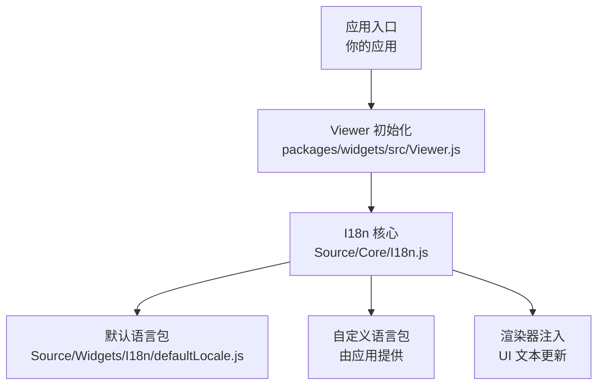
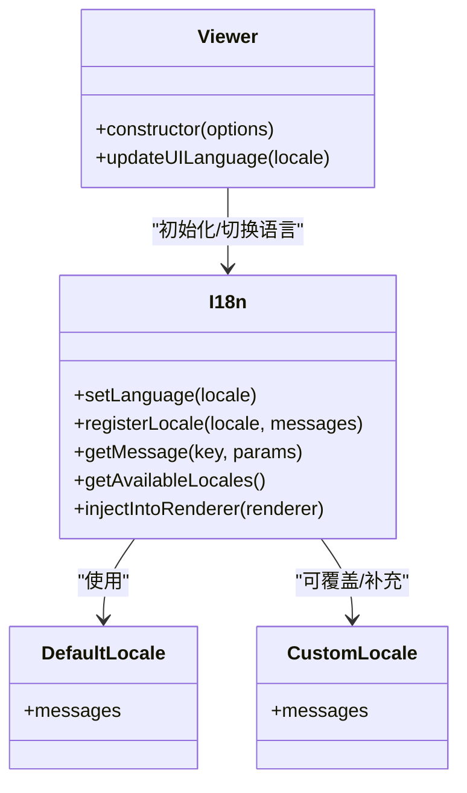
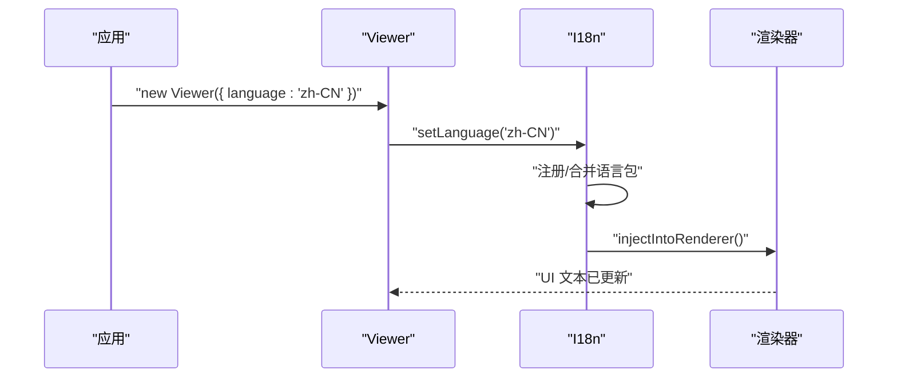
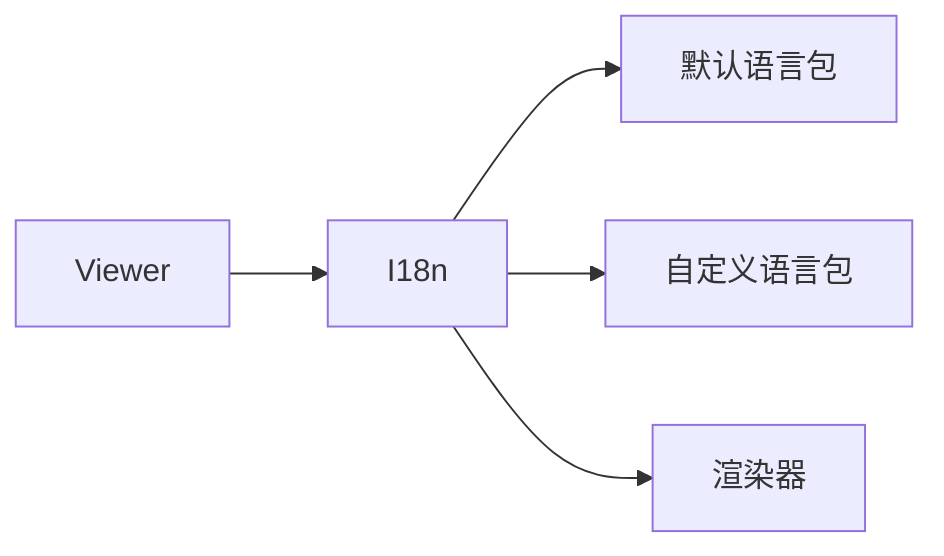
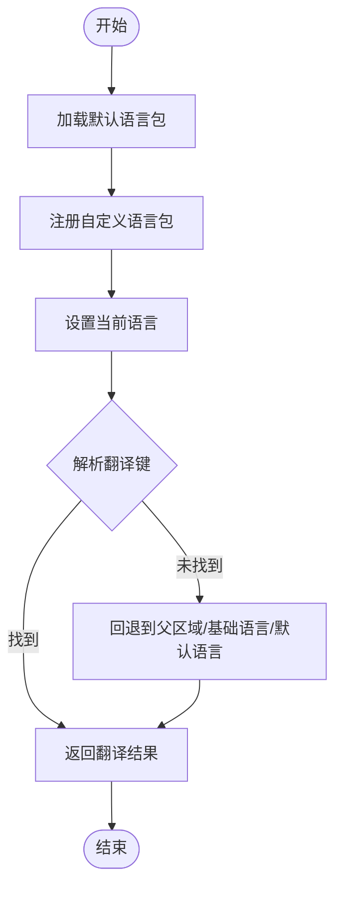

# 国际化支持

<cite>
**本文引用的文件**   
- [I18n.js](file://Source/Core/I18n.js)
- [defaultLocale.js](file://Source/Widgets/I18n/defaultLocale.js)
- [Viewer.js](file://packages/widgets/src/Viewer.js)
</cite>

## 目录
1. [简介](#简介)
2. [项目结构](#项目结构)
3. [核心组件](#核心组件)
4. [架构总览](#架构总览)
5. [详细组件分析](#详细组件分析)
6. [依赖关系分析](#依赖关系分析)
7. [性能考虑](#性能考虑)
8. [故障排查指南](#故障排查指南)
9. [结论](#结论)
10. [附录](#附录)

## 简介
本技术文档聚焦 Cesium 的国际化（i18n）系统，围绕 I18n 模块的架构设计、多语言管理机制、语言包结构与加载流程、优先级规则、运行时切换原理与最佳实践进行系统性说明。同时提供 RTL（从右到左）语言支持与日期时间本地化的处理方法，并给出完整的配置示例路径与操作步骤，帮助开发者快速集成与扩展多语言能力。

## 项目结构
Cesium 的国际化相关代码主要分布在以下位置：
- Source/Core/I18n.js：I18n 核心实现，负责语言包注册、查找、回退、渲染器注入等。
- Source/Widgets/I18n/defaultLocale.js：默认语言包（通常为英文），作为所有语言的基线。
- packages/widgets/src/Viewer.js：UI 层入口之一，负责在初始化时应用当前语言设置，触发 UI 文本更新。

图表来源
- [Viewer.js](file://packages/widgets/src/Viewer.js)
- [I18n.js](file://Source/Core/I18n.js)
- [defaultLocale.js](file://Source/Widgets/I18n/defaultLocale.js)

章节来源
- [I18n.js](file://Source/Core/I18n.js)
- [defaultLocale.js](file://Source/Widgets/I18n/defaultLocale.js)
- [Viewer.js](file://packages/widgets/src/Viewer.js)

## 核心组件
- I18n 核心模块
  - 职责：维护当前语言、注册/合并语言包、解析翻译键、处理缺失键回退、向渲染器注入翻译数据。
  - 关键能力：
    - 语言注册与覆盖：允许应用注册新语言或覆盖已有语言包。
    - 查找与回退：按“精确匹配 → 父区域 → 基础语言 → 默认语言”的顺序查找翻译。
    - 渲染器注入：将翻译表注入到渲染器上下文，供 UI 组件消费。
- 默认语言包
  - 职责：提供完整的基础翻译键集合，确保任何语言未覆盖的键都能回退到默认值。
- Viewer 集成点
  - 职责：在初始化阶段读取语言配置，调用 I18n 接口完成语言应用；在用户切换语言后刷新 UI。

章节来源
- [I18n.js](file://Source/Core/I18n.js)
- [defaultLocale.js](file://Source/Widgets/I18n/defaultLocale.js)
- [Viewer.js](file://packages/widgets/src/Viewer.js)

## 架构总览
下图展示了 I18n 在 Cesium 中的整体架构与交互关系。

图表来源
- [I18n.js](file://Source/Core/I18n.js)
- [defaultLocale.js](file://Source/Widgets/I18n/defaultLocale.js)
- [Viewer.js](file://packages/widgets/src/Viewer.js)

## 详细组件分析

### I18n 核心模块
- 设计要点
  - 单例式管理：全局唯一实例，避免重复注册与状态不一致。
  - 分层回退策略：优先使用最具体的 locale（如 zh-CN），其次回退到 zh，再回退到默认语言包。
  - 渲染器解耦：通过注入机制将翻译表提供给渲染器，UI 组件按需消费。
- 关键流程
  - 语言注册：应用可在启动前或运行中注册新的语言包，支持覆盖默认键。
  - 消息解析：根据 key 与可选参数生成最终字符串，支持占位符替换。
  - 语言切换：更新当前语言并通知渲染器刷新 UI。
- 错误处理
  - 缺失键：返回空串或默认提示，避免崩溃。
  - 非法参数：忽略无效参数或记录警告日志。

图表来源
- [Viewer.js](file://packages/widgets/src/Viewer.js)
- [I18n.js](file://Source/Core/I18n.js)

章节来源
- [I18n.js](file://Source/Core/I18n.js)
- [Viewer.js](file://packages/widgets/src/Viewer.js)

### 默认语言包（defaultLocale）
- 结构说明
  - 以键值对形式组织，key 为层级命名空间（如 ui.buttons.ok），value 为对应文案。
  - 包含所有 UI 控件的必要键，保证回退可用。
- 作用
  - 作为所有语言的基线，新增语言只需覆盖差异部分。
  - 便于统一管理与审计缺失键。

章节来源
- [defaultLocale.js](file://Source/Widgets/I18n/defaultLocale.js)

### Viewer 集成点
- 初始化阶段
  - 读取 options.language，调用 I18n.setLanguage 完成语言应用。
  - 触发渲染器注入，使 UI 立即显示目标语言。
- 运行时切换
  - 暴露 updateUILanguage 方法，供用户在设置面板中切换语言。
  - 内部调用 I18n.setLanguage 并刷新 UI。

章节来源
- [Viewer.js](file://packages/widgets/src/Viewer.js)

## 依赖关系分析
- 组件耦合
  - Viewer 仅依赖 I18n 的公开 API，保持低耦合。
  - I18n 依赖默认语言包与自定义语言包，但不直接依赖具体 UI 组件。
- 外部依赖
  - 无额外第三方 i18n 库，全部自实现，降低引入体积与版本冲突风险。
- 潜在循环依赖
  - 通过注入机制避免 UI 组件反向依赖 I18n，减少循环引用可能。

图表来源
- [Viewer.js](file://packages/widgets/src/Viewer.js)
- [I18n.js](file://Source/Core/I18n.js)
- [defaultLocale.js](file://Source/Widgets/I18n/defaultLocale.js)

章节来源
- [I18n.js](file://Source/Core/I18n.js)
- [Viewer.js](file://packages/widgets/src/Viewer.js)
- [defaultLocale.js](file://Source/Widgets/I18n/defaultLocale.js)

## 性能考虑
- 语言包大小控制
  - 建议按需打包语言包，避免一次性加载所有语言。
- 懒加载策略
  - 首次访问某语言时才加载对应资源，减少首屏开销。
- 缓存机制
  - 对已解析的消息进行缓存，避免重复计算。
- 渲染器刷新
  - 批量更新 UI 文本，减少重排与重绘次数。

[本节为通用指导，不直接分析具体文件]

## 故障排查指南
- 症状：切换语言后 UI 未更新
  - 检查是否在切换后调用了渲染器注入或 UI 刷新方法。
  - 确认语言包是否成功注册且包含所需键。
- 症状：出现大量缺失键警告
  - 核对默认语言包与自定义语言包的键一致性。
  - 使用 getAvailableLocales 验证当前可用语言列表。
- 症状：RTL 布局异常
  - 确认是否为目标语言启用了 RTL 模式，并在样式中正确应用方向属性。

章节来源
- [I18n.js](file://Source/Core/I18n.js)
- [Viewer.js](file://packages/widgets/src/Viewer.js)

## 结论
Cesium 的 I18n 系统以轻量、可扩展为核心设计理念，通过分层回退与渲染器注入机制，实现了高效的多语言支持。开发者可通过注册自定义语言包与调用 I18n API 轻松完成国际化配置与运行时切换。结合合理的性能优化与故障排查策略，可在复杂应用中稳定落地多语言需求。

[本节为总结性内容，不直接分析具体文件]

## 附录

### 语言包结构与格式
- 键名规范
  - 采用点号分隔的层级命名空间，例如 ui.buttons.ok、map.tooltip.zoomIn。
- 值类型
  - 字符串为主，支持占位符（如 {name}）。
- 示例路径
  - 参考默认语言包的结构与键集，用于对齐自定义语言包。

章节来源
- [defaultLocale.js](file://Source/Widgets/I18n/defaultLocale.js)

### 加载流程与优先级规则
- 加载顺序
  - 应用启动时加载默认语言包。
  - 随后加载或注册自定义语言包（覆盖或补充）。
- 优先级规则
  - 精确匹配（如 zh-CN）优先于父区域（如 zh），再回退到基础语言，最后使用默认语言包。
- 流程图示

图表来源
- [I18n.js](file://Source/Core/I18n.js)
- [defaultLocale.js](file://Source/Widgets/I18n/defaultLocale.js)

章节来源
- [I18n.js](file://Source/Core/I18n.js)
- [defaultLocale.js](file://Source/Widgets/I18n/defaultLocale.js)

### 添加新语言支持的步骤
- 准备语言包
  - 基于默认语言包创建新语言文件，仅覆盖差异键。
- 注册语言包
  - 在应用启动前调用 I18n.registerLocale 注册新语言。
- 设置默认语言
  - 在 Viewer 初始化选项中指定 language 为新语言标识。
- 验证
  - 启动应用并检查 UI 文本是否正确显示。

章节来源
- [I18n.js](file://Source/Core/I18n.js)
- [Viewer.js](file://packages/widgets/src/Viewer.js)

### 自定义翻译字符串的方法
- 动态覆盖
  - 在运行时调用 I18n.registerLocale 覆盖特定键。
- 局部注入
  - 针对某个模块或页面，单独注入其所需的翻译片段。
- 注意事项
  - 避免频繁覆盖导致性能问题；尽量在初始化阶段完成。

章节来源
- [I18n.js](file://Source/Core/I18n.js)

### 运行时语言切换的实现原理与最佳实践
- 实现原理
  - 调用 I18n.setLanguage 更新当前语言，随后注入渲染器并刷新 UI。
- 最佳实践
  - 在用户选择语言后立即切换，避免延迟造成体验不一致。
  - 切换前保存用户偏好，下次启动自动应用。
  - 批量更新 UI，减少多次刷新带来的抖动。

章节来源
- [I18n.js](file://Source/Core/I18n.js)
- [Viewer.js](file://packages/widgets/src/Viewer.js)

### 完整代码示例（路径指引）
- 国际化配置
  - 参考 Viewer 初始化选项中的 language 字段用法。
- 动态语言切换
  - 参考 Viewer.updateUILanguage 的调用方式。
- 自定义翻译文件
  - 参考 defaultLocale 的结构，创建并注册新语言包。

章节来源
- [Viewer.js](file://packages/widgets/src/Viewer.js)
- [defaultLocale.js](file://Source/Widgets/I18n/defaultLocale.js)

### RTL（从右到左）语言支持
- 启用方式
  - 在语言包中标识该语言为 RTL，或在样式中根据语言动态设置 dir="rtl"。
- 布局适配
  - 使用 CSS 逻辑属性（如 margin-inline-start）替代物理方向属性。
- 验证
  - 检查导航、按钮、图标等元素的方向是否符合预期。

章节来源
- [I18n.js](file://Source/Core/I18n.js)

### 日期时间本地化处理方法
- 格式化
  - 使用 I18n 提供的格式化函数或结合浏览器 Intl API 进行本地化输出。
- 区域设置
  - 根据当前语言选择对应的日期/时间格式模板。
- 示例路径
  - 参考 I18n 中与日期时间相关的工具方法。

章节来源
- [I18n.js](file://Source/Core/I18n.js)