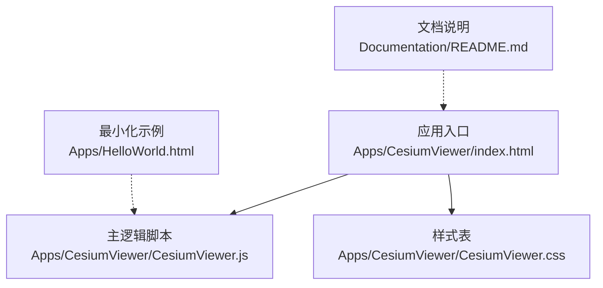
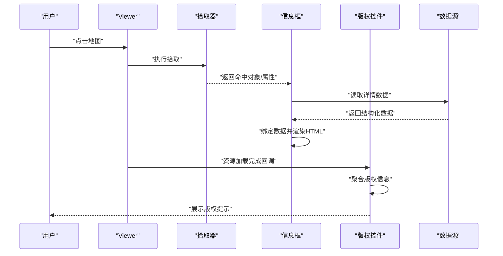
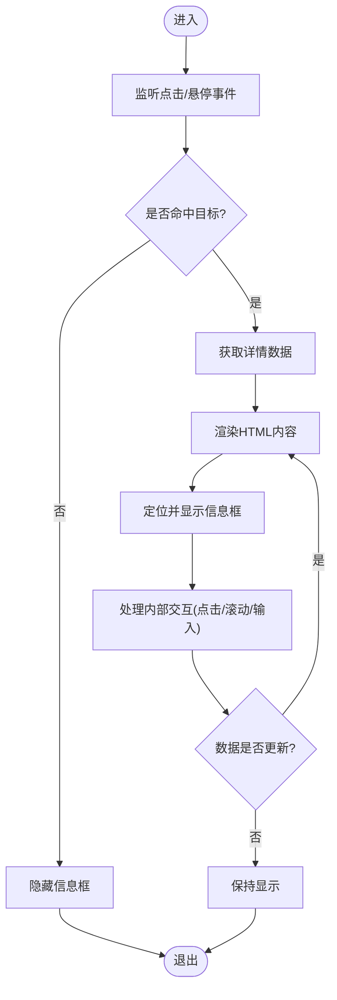
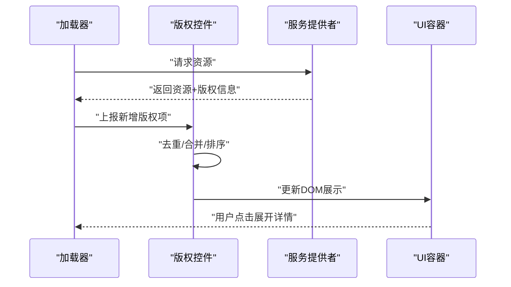
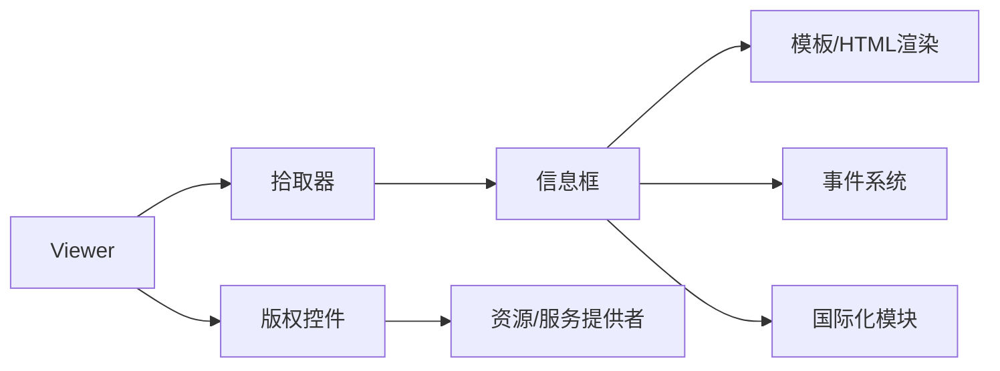

# 信息展示控件

<cite>
**本文引用的文件**   
- [CesiumViewer.js](file://Apps/CesiumViewer/CesiumViewer.js)
- [CesiumViewer.css](file://Apps/CesiumViewer/CesiumViewer.css)
- [index.html](file://Apps/CesiumViewer/index.html)
- [HelloWorld.html](file://Apps/HelloWorld.html)
- [README.md](file://Documentation/README.md)
</cite>

## 目录
1. [简介](#简介)
2. [项目结构](#项目结构)
3. [核心组件](#核心组件)
4. [架构总览](#架构总览)
5. [详细组件分析](#详细组件分析)
6. [依赖关系分析](#依赖关系分析)
7. [性能考虑](#性能考虑)
8. [故障排查指南](#故障排查指南)
9. [结论](#结论)
10. [附录](#附录)

## 简介
本指南聚焦于 Cesium 应用中“信息展示控件”的综合使用，包括信息框与版权显示控件的功能特性、配置选项、自定义方法、动态更新内容、HTML 渲染与样式定制、数据绑定与事件处理、生命周期管理与内存优化策略，以及国际化（多语言）支持方案。文档面向不同技术背景的读者，提供从入门到进阶的渐进式说明，并附带可复用的最佳实践与常见问题排查建议。

## 项目结构
仓库采用应用示例与源码分离的组织方式。与信息展示控件直接相关的示例位于 Apps 目录下，包含一个基于 Viewer 的演示页面与配套脚本、样式；同时提供最小化的 HelloWorld 示例用于快速验证。

图表来源
- [index.html](file://Apps/CesiumViewer/index.html)
- [CesiumViewer.js](file://Apps/CesiumViewer/CesiumViewer.js)
- [CesiumViewer.css](file://Apps/CesiumViewer/CesiumViewer.css)
- [HelloWorld.html](file://Apps/HelloWorld.html)
- [README.md](file://Documentation/README.md)

章节来源
- [index.html](file://Apps/CesiumViewer/index.html)
- [CesiumViewer.js](file://Apps/CesiumViewer/CesiumViewer.js)
- [CesiumViewer.css](file://Apps/CesiumViewer/CesiumViewer.css)
- [HelloWorld.html](file://Apps/HelloWorld.html)
- [README.md](file://Documentation/README.md)

## 核心组件
- 信息框（Info Box）：用于在地图上以弹窗或面板形式展示选中要素的详细信息，支持文本、表格、图片等富媒体内容，可通过 HTML 模板进行高度定制。
- 版权显示控件（Attribution Control）：负责聚合并展示地图服务提供方、模型、地形等资源的版权信息，支持动态更新与多源合并。

关键能力
- 动态更新：通过数据绑定或 API 调用刷新内容，避免整页重绘。
- HTML 渲染：安全地注入 HTML 片段，支持内联样式与外部 CSS。
- 事件驱动：响应点击、悬停、选择变化等交互事件，触发信息框显示或隐藏。
- 生命周期管理：创建、挂载、更新、销毁各阶段资源释放与状态清理。
- 国际化：基于键值映射的语言包切换，实现文案与格式的多语言适配。

章节来源
- [CesiumViewer.js](file://Apps/CesiumViewer/CesiumViewer.js)
- [CesiumViewer.css](file://Apps/CesiumViewer/CesiumViewer.css)

## 架构总览
下图展示了信息展示控件在应用中的整体交互流程：用户交互触发拾取，拾取结果驱动信息框的数据绑定与渲染；同时，地图资源加载完成后由版权控件聚合并展示版权信息。

图表来源
- [CesiumViewer.js](file://Apps/CesiumViewer/CesiumViewer.js)
- [CesiumViewer.css](file://Apps/CesiumViewer/CesiumViewer.css)

## 详细组件分析

### 信息框组件
职责
- 接收拾取结果或外部数据源变更，生成并更新 DOM。
- 管理显示位置、层级、动画与关闭行为。
- 提供模板引擎或字符串拼接接口，支持 HTML 注入与样式覆盖。
- 暴露事件钩子，便于业务层扩展（如点击链接跳转、表单提交）。

典型流程

图表来源
- [CesiumViewer.js](file://Apps/CesiumViewer/CesiumViewer.js)
- [CesiumViewer.css](file://Apps/CesiumViewer/CesiumViewer.css)

章节来源
- [CesiumViewer.js](file://Apps/CesiumViewer/CesiumViewer.js)
- [CesiumViewer.css](file://Apps/CesiumViewer/CesiumViewer.css)

### 版权显示控件
职责
- 收集来自影像、地形、模型、矢量图层等的版权元数据。
- 去重与合并，按优先级排序后统一展示。
- 支持动态追加新来源与移除旧来源。
- 提供可配置的展示区域与样式覆盖点。

典型流程

图表来源
- [CesiumViewer.js](file://Apps/CesiumViewer/CesiumViewer.js)
- [CesiumViewer.css](file://Apps/CesiumViewer/CesiumViewer.css)

章节来源
- [CesiumViewer.js](file://Apps/CesiumViewer/CesiumViewer.js)
- [CesiumViewer.css](file://Apps/CesiumViewer/CesiumViewer.css)

### 数据绑定与事件处理
- 数据绑定：将结构化数据（JSON）映射到模板字段，支持嵌套对象与数组列表渲染。
- 事件处理：为信息框内的按钮、链接、表单元素注册事件监听，结合 Viewer 的交互事件（点击、双击、鼠标移动）实现联动。
- 防抖与节流：对高频事件（如鼠标移动）进行节流，降低渲染压力。

章节来源
- [CesiumViewer.js](file://Apps/CesiumViewer/CesiumViewer.js)

### 生命周期管理与内存优化
- 创建阶段：初始化 DOM 节点、缓存引用、注册全局事件。
- 更新阶段：增量更新 DOM，避免重建整棵树；复用已存在的节点。
- 销毁阶段：移除事件监听、清空定时器、释放大对象引用，确保无内存泄漏。
- 可见性控制：当信息框不可见时暂停非必要的计算与网络请求。

章节来源
- [CesiumViewer.js](file://Apps/CesiumViewer/CesiumViewer.js)

### 国际化（i18n）与多语言
- 语言包：以键值对组织文案，按语言代码区分（如 zh-CN、en-US）。
- 切换机制：运行时替换当前语言包，触发信息框与版权控件文案重新渲染。
- 格式化：数字、日期、单位等根据区域设置进行格式化。
- 回退策略：当某语言缺失键值时，回退至默认语言。

章节来源
- [CesiumViewer.js](file://Apps/CesiumViewer/CesiumViewer.js)

## 依赖关系分析
信息展示控件与 Viewer、拾取器、数据源、UI 容器之间存在清晰的依赖关系。下图给出模块间的依赖概览。

图表来源
- [CesiumViewer.js](file://Apps/CesiumViewer/CesiumViewer.js)
- [CesiumViewer.css](file://Apps/CesiumViewer/CesiumViewer.css)

章节来源
- [CesiumViewer.js](file://Apps/CesiumViewer/CesiumViewer.js)
- [CesiumViewer.css](file://Apps/CesiumViewer/CesiumViewer.css)

## 性能考虑
- 渲染优化：优先使用 DocumentFragment 批量插入节点；减少重排与重绘。
- 事件优化：对频繁触发的事件使用节流/防抖；仅在必要时更新 DOM。
- 资源管理：及时释放不再使用的图像、视频、音频等资源；避免闭包持有大对象引用。
- 懒加载：信息框内容按需加载，首屏仅渲染必要部分。
- 样式隔离：使用命名空间或 Shadow DOM 隔离样式，避免全局污染导致的额外重绘。

[本节为通用性能建议，不直接分析具体文件]

## 故障排查指南
- 信息框不显示
  - 检查拾取器是否正确返回命中对象。
  - 确认模板变量是否存在且类型正确。
  - 查看控制台是否有跨域或资源加载错误。
- HTML 未生效或被转义
  - 确认渲染函数允许注入 HTML，并对敏感内容进行过滤。
- 样式错乱
  - 检查 CSS 作用域与优先级；避免与第三方库冲突。
- 内存占用持续增长
  - 审查事件监听器的移除逻辑；确认销毁流程是否完整执行。
- 版权信息缺失
  - 确认资源加载回调是否上报版权元数据；检查去重与合并逻辑。

章节来源
- [CesiumViewer.js](file://Apps/CesiumViewer/CesiumViewer.js)
- [CesiumViewer.css](file://Apps/CesiumViewer/CesiumViewer.css)

## 结论
信息展示控件在 Cesium 应用中承担“数据到界面”的关键桥梁角色。通过合理的数据绑定、事件驱动与生命周期管理，可实现高性能、可维护的信息呈现体验。配合版权控件，既能满足合规要求，也能提升用户体验。建议在项目中引入 i18n 与样式隔离，进一步提升可扩展性与稳定性。

[本节为总结性内容，不直接分析具体文件]

## 附录

### 快速上手示例路径
- 基础示例：参考最小化页面，快速集成 Viewer 与基础控件。
  - [HelloWorld.html](file://Apps/HelloWorld.html)
- 完整示例：参考应用入口与主逻辑，了解信息框与版权控件的集成方式。
  - [index.html](file://Apps/CesiumViewer/index.html)
  - [CesiumViewer.js](file://Apps/CesiumViewer/CesiumViewer.js)
  - [CesiumViewer.css](file://Apps/CesiumViewer/CesiumViewer.css)

章节来源
- [HelloWorld.html](file://Apps/HelloWorld.html)
- [index.html](file://Apps/CesiumViewer/index.html)
- [CesiumViewer.js](file://Apps/CesiumViewer/CesiumViewer.js)
- [CesiumViewer.css](file://Apps/CesiumViewer/CesiumViewer.css)