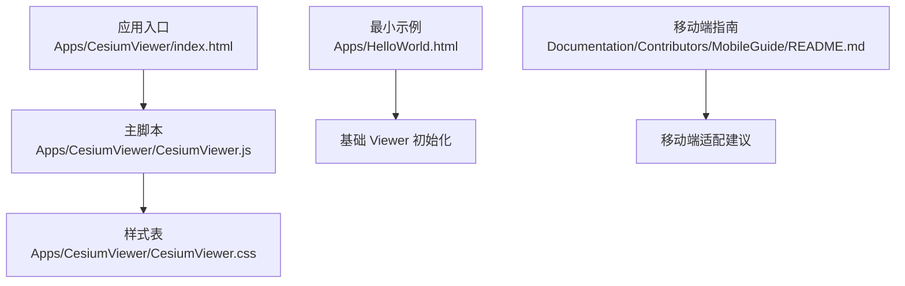
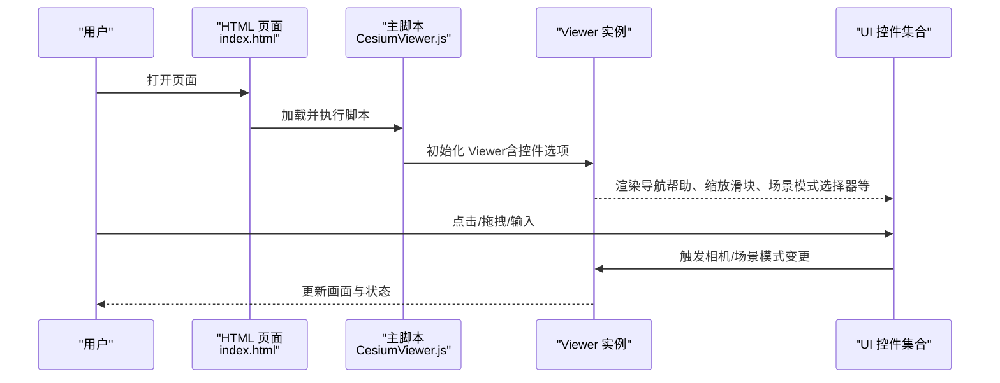
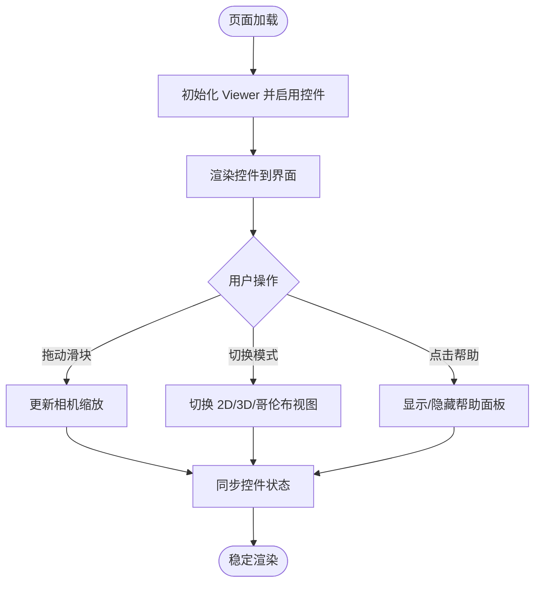
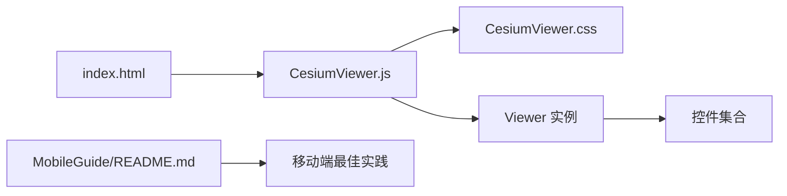

# 内置控件使用

<cite>
**本文引用的文件**   
- [CesiumViewer.js](file://Apps/CesiumViewer/CesiumViewer.js)
- [CesiumViewer.css](file://Apps/CesiumViewer/CesiumViewer.css)
- [index.html](file://Apps/CesiumViewer/index.html)
- [HelloWorld.html](file://Apps/HelloWorld.html)
- [README.md](file://Documentation/Contributors/MobileGuide/README.md)
</cite>

## 目录
1. [简介](#简介)
2. [项目结构](#项目结构)
3. [核心组件](#核心组件)
4. [架构总览](#架构总览)
5. [详细组件分析](#详细组件分析)
6. [依赖关系分析](#依赖关系分析)
7. [性能考虑](#性能考虑)
8. [故障排除指南](#故障排除指南)
9. [结论](#结论)
10. [附录](#附录)

## 简介
本指南聚焦于在 CesiumJS 应用中常用“内置控件”的使用与最佳实践，覆盖导航帮助按钮、缩放滑块、场景模式选择器、信息框（版权显示）等典型 UI 元素。内容包含：
- 功能特性与配置项说明
- 初始化、事件监听、样式定制与动态控制
- 控件之间的交互关系与组合使用方法
- 可见性控制与性能优化技巧
- 移动端适配与用户体验优化建议
- 常见使用场景的参考路径与排错要点

为保证准确性，本文所有示例均以仓库中现有应用为参考来源，通过“代码片段路径”的方式定位到具体实现位置，避免直接粘贴源码。

## 项目结构
仓库中包含可直接运行的示例应用，位于 Apps 目录下。其中 CesiumViewer 是一个完整的查看器示例，HelloWorld 是最小化示例。文档与移动端指南位于 Documentation 目录。

图表来源
- [index.html](file://Apps/CesiumViewer/index.html)
- [CesiumViewer.js](file://Apps/CesiumViewer/CesiumViewer.js)
- [CesiumViewer.css](file://Apps/CesiumViewer/CesiumViewer.css)
- [HelloWorld.html](file://Apps/HelloWorld.html)
- [README.md](file://Documentation/Contributors/MobileGuide/README.md)

章节来源
- [index.html](file://Apps/CesiumViewer/index.html)
- [CesiumViewer.js](file://Apps/CesiumViewer/CesiumViewer.js)
- [CesiumViewer.css](file://Apps/CesiumViewer/CesiumViewer.css)
- [HelloWorld.html](file://Apps/HelloWorld.html)
- [README.md](file://Documentation/Contributors/MobileGuide/README.md)

## 核心组件
本节概述与“内置控件”相关的核心概念与能力，结合仓库中的示例进行说明。

- 导航帮助按钮
  - 作用：提供旋转、平移、缩放的交互提示与快捷键说明。
  - 典型用法：在创建 Viewer 时启用或禁用；可通过 CSS 调整外观与位置。
  - 参考路径：[CesiumViewer.js](file://Apps/CesiumViewer/CesiumViewer.js)

- 缩放滑块
  - 作用：以滑块形式快速调节相机缩放级别。
  - 典型用法：在 Viewer 选项中开启；可配合自定义样式统一主题。
  - 参考路径：[CesiumViewer.js](file://Apps/CesiumViewer/CesiumViewer.js)

- 场景模式选择器
  - 作用：切换 2D、3D、哥伦布视图（Columbus）等场景模式。
  - 典型用法：在 Viewer 选项中启用；常用于需要多视角切换的应用。
  - 参考路径：[CesiumViewer.js](file://Apps/CesiumViewer/CesiumViewer.js)

- 信息框（版权显示）
  - 作用：展示地图数据提供方与版权信息。
  - 典型用法：默认显示；可通过选项隐藏或在运行时更新文本。
  - 参考路径：[CesiumViewer.js](file://Apps/CesiumViewer/CesiumViewer.js)

- 其他常见控件（如全屏、时间轴等）
  - 若需使用，可在 Viewer 初始化选项中按需启用，并通过 CSS 定制布局。
  - 参考路径：[CesiumViewer.js](file://Apps/CesiumViewer/CesiumViewer.js)

章节来源
- [CesiumViewer.js](file://Apps/CesiumViewer/CesiumViewer.js)
- [CesiumViewer.css](file://Apps/CesiumViewer/CesiumViewer.css)

## 架构总览
下图展示了示例应用的加载流程以及控件与 Viewer 的关系。

图表来源
- [index.html](file://Apps/CesiumViewer/index.html)
- [CesiumViewer.js](file://Apps/CesiumViewer/CesiumViewer.js)

## 详细组件分析

### 导航帮助按钮
- 功能特性
  - 显示交互提示与快捷键，帮助用户快速上手。
  - 通常位于界面角落，支持点击收起/展开。
- 配置与使用
  - 在 Viewer 初始化选项中启用或禁用该控件。
  - 通过 CSS 调整位置、尺寸与主题色，使其与应用风格一致。
- 事件与联动
  - 与相机操作联动，当用户进行旋转、平移、缩放时，帮助内容会相应提示。
- 可见性与动态控制
  - 可通过选项在运行时切换显示/隐藏。
  - 也可通过 DOM 操作临时隐藏，但推荐优先使用 API 选项。
- 参考路径
  - 初始化与选项设置：[CesiumViewer.js](file://Apps/CesiumViewer/CesiumViewer.js)
  - 样式定制：[CesiumViewer.css](file://Apps/CesiumViewer/CesiumViewer.css)

章节来源
- [CesiumViewer.js](file://Apps/CesiumViewer/CesiumViewer.js)
- [CesiumViewer.css](file://Apps/CesiumViewer/CesiumViewer.css)

### 缩放滑块
- 功能特性
  - 提供直观的缩放范围控制，适合需要精确缩放的场景。
- 配置与使用
  - 在 Viewer 初始化选项中启用。
  - 可通过 CSS 调整滑块轨道、手柄与刻度样式。
- 事件与联动
  - 拖动滑块会驱动相机缩放，同时影响其他控件（如缩放指示）。
- 可见性与动态控制
  - 可按需在运行时显示/隐藏，例如在特定业务模式下仅保留键盘缩放。
- 参考路径
  - 初始化与选项设置：[CesiumViewer.js](file://Apps/CesiumViewer/CesiumViewer.js)
  - 样式定制：[CesiumViewer.css](file://Apps/CesiumViewer/CesiumViewer.css)

章节来源
- [CesiumViewer.js](file://Apps/CesiumViewer/CesiumViewer.js)
- [CesiumViewer.css](file://Apps/CesiumViewer/CesiumViewer.css)

### 场景模式选择器
- 功能特性
  - 支持在 2D、3D、哥伦布视图之间切换，便于不同分析需求。
- 配置与使用
  - 在 Viewer 初始化选项中启用。
  - 可结合业务逻辑限制可用模式（例如仅允许 3D）。
- 事件与联动
  - 切换模式后，相机行为与渲染管线会发生变化，部分控件可能自动隐藏或调整布局。
- 可见性与动态控制
  - 可根据设备类型或业务角色动态显示/隐藏。
- 参考路径
  - 初始化与选项设置：[CesiumViewer.js](file://Apps/CesiumViewer/CesiumViewer.js)

章节来源
- [CesiumViewer.js](file://Apps/CesiumViewer/CesiumViewer.js)

### 信息框（版权显示）
- 功能特性
  - 展示数据来源与版权信息，满足合规要求。
- 配置与使用
  - 默认显示，可在初始化选项中隐藏。
  - 运行时可更新版权文本或链接。
- 事件与联动
  - 与图层/数据源加载完成事件联动，确保版权信息及时更新。
- 可见性与动态控制
  - 可按需隐藏或在特定页面区域集中展示版权信息。
- 参考路径
  - 初始化与选项设置：[CesiumViewer.js](file://Apps/CesiumViewer/CesiumViewer.js)

章节来源
- [CesiumViewer.js](file://Apps/CesiumViewer/CesiumViewer.js)

### 控件组合与交互关系
- 组合策略
  - 导航帮助 + 缩放滑块：适合新手引导与精细缩放。
  - 场景模式选择器 + 缩放滑块：在多视角下保持一致的缩放体验。
  - 信息框 + 数据源加载事件：确保版权信息与当前数据一致。
- 交互顺序
  - 页面加载 → 初始化 Viewer → 渲染控件 → 用户交互 → 相机/场景变化 → 控件状态同步。
- 参考流程图

图表来源
- [CesiumViewer.js](file://Apps/CesiumViewer/CesiumViewer.js)

## 依赖关系分析
- 应用入口与脚本
  - HTML 页面负责引入脚本与挂载容器。
  - 主脚本负责初始化 Viewer 与控件选项。
- 样式与主题
  - CSS 文件用于统一控件外观，保证在不同设备上的一致性。
- 移动端指南
  - 提供触控手势、性能与可用性方面的建议，指导控件在移动端的呈现方式。

图表来源
- [index.html](file://Apps/CesiumViewer/index.html)
- [CesiumViewer.js](file://Apps/CesiumViewer/CesiumViewer.js)
- [CesiumViewer.css](file://Apps/CesiumViewer/CesiumViewer.css)
- [README.md](file://Documentation/Contributors/MobileGuide/README.md)

章节来源
- [index.html](file://Apps/CesiumViewer/index.html)
- [CesiumViewer.js](file://Apps/CesiumViewer/CesiumViewer.js)
- [CesiumViewer.css](file://Apps/CesiumViewer/CesiumViewer.css)
- [README.md](file://Documentation/Contributors/MobileGuide/README.md)

## 性能考虑
- 控件数量与渲染开销
  - 减少不必要的控件，避免过多 UI 层叠加导致重绘频繁。
- 样式与层级
  - 合理设置 z-index 与 transform，降低合成成本。
- 事件节流与防抖
  - 对高频事件（如缩放滑块拖动）进行节流处理，避免阻塞主线程。
- 移动端适配
  - 根据屏幕尺寸与触控特性调整控件大小与间距，提升可操作性。
- 参考路径
  - 移动端指南：[README.md](file://Documentation/Contributors/MobileGuide/README.md)

章节来源
- [README.md](file://Documentation/Contributors/MobileGuide/README.md)

## 故障排除指南
- 控件未显示
  - 检查 Viewer 初始化选项是否正确启用对应控件。
  - 确认 CSS 未被全局样式覆盖或隐藏。
  - 参考路径：[CesiumViewer.js](file://Apps/CesiumViewer/CesiumViewer.js)、[CesiumViewer.css](file://Apps/CesiumViewer/CesiumViewer.css)
- 控件样式异常
  - 核对 z-index 与父容器尺寸，避免被遮挡或溢出。
  - 参考路径：[CesiumViewer.css](file://Apps/CesiumViewer/CesiumViewer.css)
- 交互无响应
  - 检查是否绑定了冲突的事件处理器。
  - 在控制台查看是否有 JavaScript 错误。
- 移动端体验差
  - 调整控件尺寸与触控热区，遵循移动端指南的建议。
  - 参考路径：[README.md](file://Documentation/Contributors/MobileGuide/README.md)

章节来源
- [CesiumViewer.js](file://Apps/CesiumViewer/CesiumViewer.js)
- [CesiumViewer.css](file://Apps/CesiumViewer/CesiumViewer.css)
- [README.md](file://Documentation/Contributors/MobileGuide/README.md)

## 结论
通过合理的初始化配置、样式定制与事件管理，可以在 CesiumJS 应用中高效地使用内置控件，提升用户体验与可维护性。结合移动端指南与性能优化建议，可以进一步保障跨设备的稳定性与流畅度。

## 附录
- 最小示例参考
  - 快速上手与基础 Viewer 初始化：[HelloWorld.html](file://Apps/HelloWorld.html)
- 完整示例参考
  - 查看器与控件的综合使用：[CesiumViewer.js](file://Apps/CesiumViewer/CesiumViewer.js)、[CesiumViewer.css](file://Apps/CesiumViewer/CesiumViewer.css)、[index.html](file://Apps/CesiumViewer/index.html)
- 移动端最佳实践
  - 触控、性能与可用性建议：[README.md](file://Documentation/Contributors/MobileGuide/README.md)