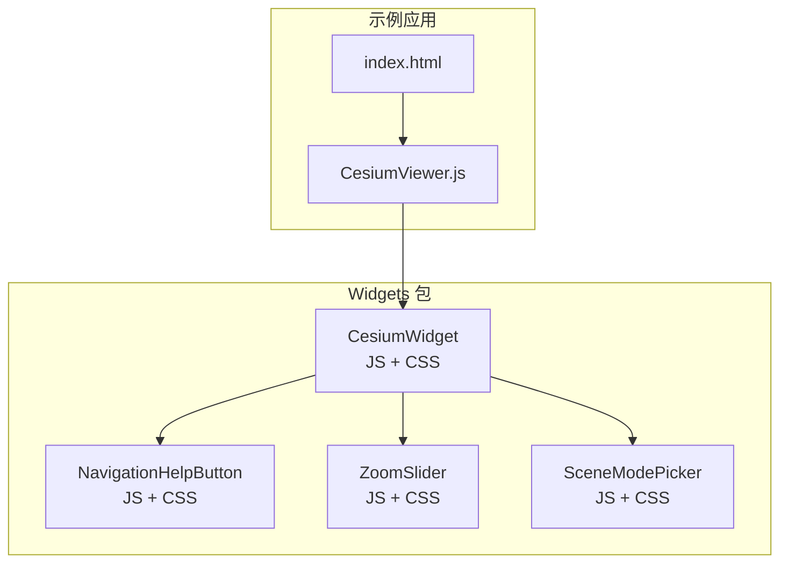
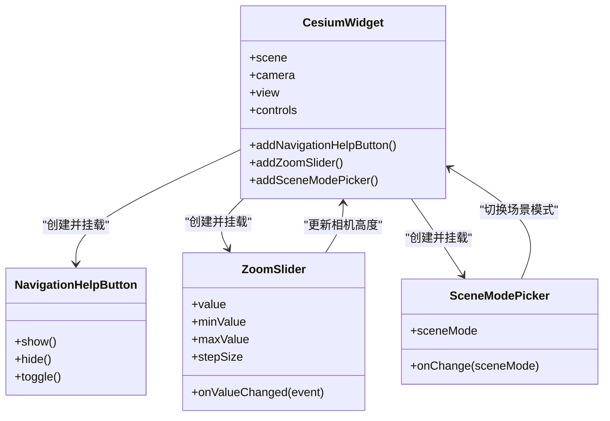
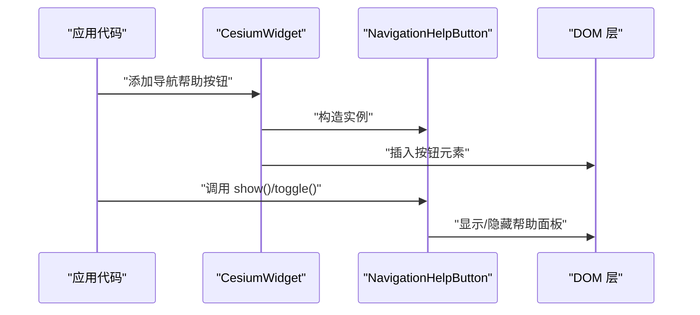
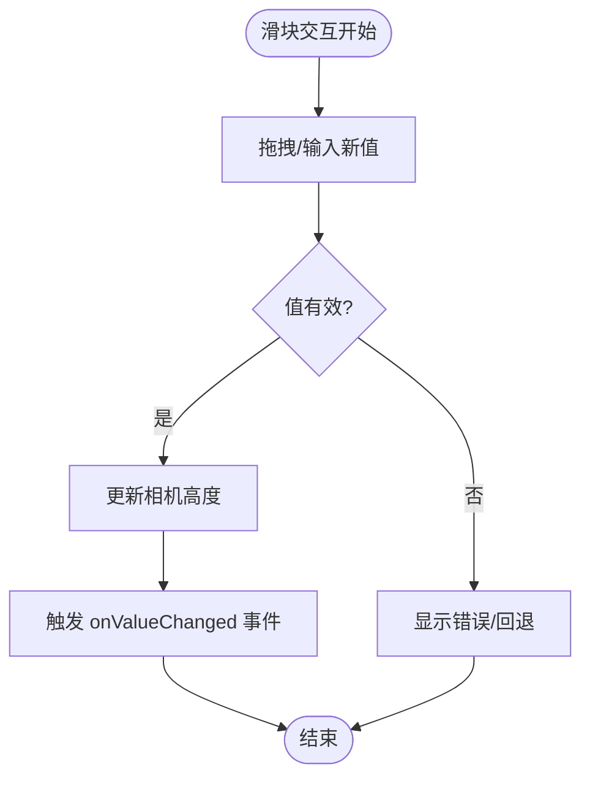
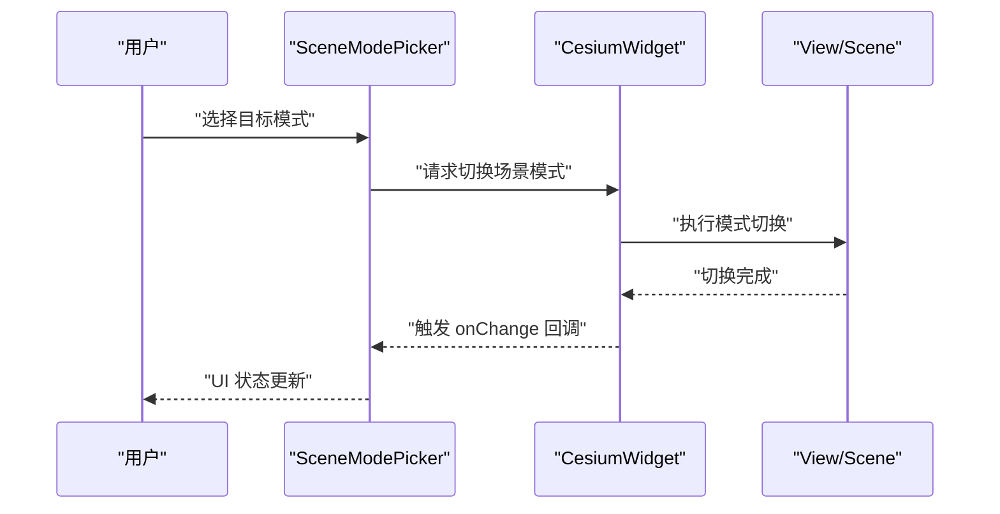
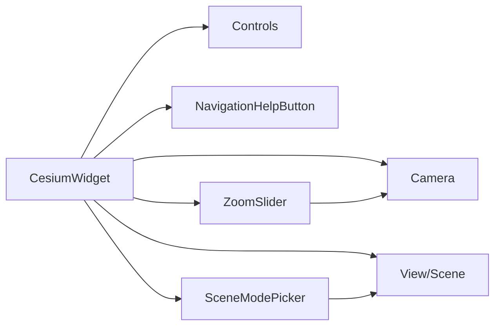
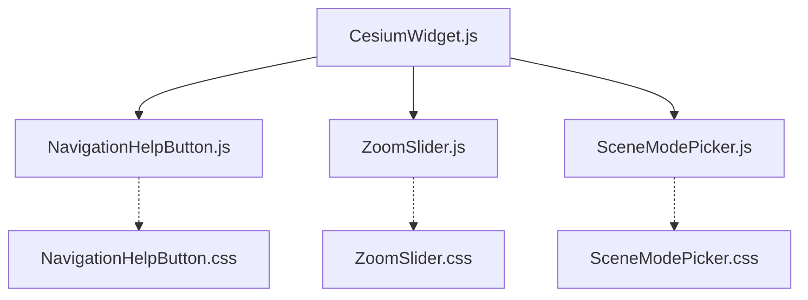

# 导航控件

<cite>
**本文引用的文件**   
- [packages/widgets/src/NavigationHelpButton.js](file://packages/widgets/src/NavigationHelpButton.js)
- [packages/widgets/src/NavigationHelpButton.css](file://packages/widgets/src/NavigationHelpButton.css)
- [packages/widgets/src/ZoomSlider.js](file://packages/widgets/src/ZoomSlider.js)
- [packages/widgets/src/ZoomSlider.css](file://packages/widgets/src/ZoomSlider.css)
- [packages/widgets/src/SceneModePicker.js](file://packages/widgets/src/SceneModePicker.js)
- [packages/widgets/src/SceneModePicker.css](file://packages/widgets/src/SceneModePicker.css)
- [packages/widgets/src/CesiumWidget.js](file://packages/widgets/src/CesiumWidget.js)
- [packages/widgets/src/CesiumWidget.css](file://packages/widgets/src/CesiumWidget.css)
- [Apps/CesiumViewer/CesiumViewer.js](file://Apps/CesiumViewer/CesiumViewer.js)
- [Apps/CesiumViewer/index.html](file://Apps/CesiumViewer/index.html)
</cite>

## 目录
1. [简介](#简介)
2. [项目结构](#项目结构)
3. [核心组件](#核心组件)
4. [架构总览](#架构总览)
5. [详细组件分析](#详细组件分析)
6. [依赖关系分析](#依赖关系分析)
7. [性能考虑](#性能考虑)
8. [故障排查指南](#故障排查指南)
9. [结论](#结论)
10. [附录](#附录)

## 简介
本文件面向在 CesiumJS 中集成与定制“导航控件”的开发者，聚焦以下三个常用 UI 控件：
- 导航帮助按钮（NavigationHelpButton）
- 缩放滑块（ZoomSlider）
- 场景模式选择器（SceneModePicker）

文档将系统讲解每个控件的功能特性、初始化方法、属性配置、事件处理、样式定制，以及它们之间的协作关系（相机控制、视图切换、用户体验优化）。同时提供移动端适配建议、性能优化策略和常见问题调试技巧。

## 项目结构
导航控件位于 widgets 包中，分别由独立的 JS 与 CSS 文件组成；CesiumWidget 作为容器负责组合这些控件并挂载到 DOM。示例应用 Apps/CesiumViewer 展示了如何引入并使用这些控件。

图表来源
- [packages/widgets/src/CesiumWidget.js](file://packages/widgets/src/CesiumWidget.js)
- [packages/widgets/src/NavigationHelpButton.js](file://packages/widgets/src/NavigationHelpButton.js)
- [packages/widgets/src/ZoomSlider.js](file://packages/widgets/src/ZoomSlider.js)
- [packages/widgets/src/SceneModePicker.js](file://packages/widgets/src/SceneModePicker.js)
- [Apps/CesiumViewer/CesiumViewer.js](file://Apps/CesiumViewer/CesiumViewer.js)
- [Apps/CesiumViewer/index.html](file://Apps/CesiumViewer/index.html)

章节来源
- [packages/widgets/src/CesiumWidget.js](file://packages/widgets/src/CesiumWidget.js)
- [packages/widgets/src/NavigationHelpButton.js](file://packages/widgets/src/NavigationHelpButton.js)
- [packages/widgets/src/ZoomSlider.js](file://packages/widgets/src/ZoomSlider.js)
- [packages/widgets/src/SceneModePicker.js](file://packages/widgets/src/SceneModePicker.js)
- [Apps/CesiumViewer/CesiumViewer.js](file://Apps/CesiumViewer/CesiumViewer.js)
- [Apps/CesiumViewer/index.html](file://Apps/CesiumViewer/index.html)

## 核心组件
本节概述三大导航控件的职责与交互点：
- 导航帮助按钮：展示操作提示面板，帮助用户理解鼠标/触摸操作方式。
- 缩放滑块：以滑块形式直观调整相机高度（缩放级别），支持拖拽与键盘操作。
- 场景模式选择器：在 3D、2D、哥伦布视图（2.5D）等模式间切换，影响相机行为与渲染管线。

这些控件均通过 CesiumWidget 提供的 API 与底层 Scene/View/Controls 协同工作，实现统一的相机控制和视图体验。

章节来源
- [packages/widgets/src/NavigationHelpButton.js](file://packages/widgets/src/NavigationHelpButton.js)
- [packages/widgets/src/ZoomSlider.js](file://packages/widgets/src/ZoomSlider.js)
- [packages/widgets/src/SceneModePicker.js](file://packages/widgets/src/SceneModePicker.js)
- [packages/widgets/src/CesiumWidget.js](file://packages/widgets/src/CesiumWidget.js)

## 架构总览
下图展示了控件与 CesiumWidget、相机、场景模式之间的协作关系。

图表来源
- [packages/widgets/src/CesiumWidget.js](file://packages/widgets/src/CesiumWidget.js)
- [packages/widgets/src/NavigationHelpButton.js](file://packages/widgets/src/NavigationHelpButton.js)
- [packages/widgets/src/ZoomSlider.js](file://packages/widgets/src/ZoomSlider.js)
- [packages/widgets/src/SceneModePicker.js](file://packages/widgets/src/SceneModePicker.js)

## 详细组件分析

### 导航帮助按钮（NavigationHelpButton）
- 功能特性
  - 显示/隐藏操作说明面板，覆盖层提示鼠标与触摸手势。
  - 可自定义位置与层级，避免遮挡关键内容。
- 初始化与挂载
  - 通过 CesiumWidget 提供的添加方法完成实例化与 DOM 挂载。
- 属性与配置
  - 通常包含可见性控制、定位参数、是否默认展开等选项。
- 事件处理
  - 提供 show/hide/toggle 等方法用于程序化控制。
- 样式定制
  - 通过对应 CSS 文件覆盖默认样式，如背景、边框、字体、阴影等。
- 使用要点
  - 建议在用户首次进入或教学模式下默认展示。
  - 注意与地图点击事件的冲突，必要时延迟或条件显示。

图表来源
- [packages/widgets/src/CesiumWidget.js](file://packages/widgets/src/CesiumWidget.js)
- [packages/widgets/src/NavigationHelpButton.js](file://packages/widgets/src/NavigationHelpButton.js)
- [packages/widgets/src/NavigationHelpButton.css](file://packages/widgets/src/NavigationHelpButton.css)

章节来源
- [packages/widgets/src/NavigationHelpButton.js](file://packages/widgets/src/NavigationHelpButton.js)
- [packages/widgets/src/NavigationHelpButton.css](file://packages/widgets/src/NavigationHelpButton.css)
- [packages/widgets/src/CesiumWidget.js](file://packages/widgets/src/CesiumWidget.js)

### 缩放滑块（ZoomSlider）
- 功能特性
  - 以滑块形式调节相机高度，直观反映当前缩放级别。
  - 支持拖拽、滚轮联动、键盘方向键微调。
- 初始化与挂载
  - 通过 CesiumWidget 提供的添加方法完成实例化与 DOM 挂载。
- 属性与配置
  - 常见属性包括最小值、最大值、步长、当前值等。
- 事件处理
  - 监听值变化事件，用于同步外部 UI 或触发业务逻辑。
- 样式定制
  - 通过对应 CSS 文件覆盖滑块轨道、手柄、刻度等样式。
- 使用要点
  - 合理设置 min/max 范围，避免超出地形或数据可视范围。
  - 在高精度场景中适当减小 stepSize 提升操控细腻度。

图表来源
- [packages/widgets/src/ZoomSlider.js](file://packages/widgets/src/ZoomSlider.js)
- [packages/widgets/src/ZoomSlider.css](file://packages/widgets/src/ZoomSlider.css)
- [packages/widgets/src/CesiumWidget.js](file://packages/widgets/src/CesiumWidget.js)

章节来源
- [packages/widgets/src/ZoomSlider.js](file://packages/widgets/src/ZoomSlider.js)
- [packages/widgets/src/ZoomSlider.css](file://packages/widgets/src/ZoomSlider.css)
- [packages/widgets/src/CesiumWidget.js](file://packages/widgets/src/CesiumWidget.js)

### 场景模式选择器（SceneModePicker）
- 功能特性
  - 在 3D、2D、哥伦布视图（2.5D）之间切换，改变相机行为与渲染管线。
- 初始化与挂载
  - 通过 CesiumWidget 提供的添加方法完成实例化与 DOM 挂载。
- 属性与配置
  - 暴露当前 sceneMode 属性，支持读取与监听变更。
- 事件处理
  - 提供 onChange 回调，便于在模式切换时执行额外逻辑（如加载不同图层、调整光照）。
- 样式定制
  - 通过对应 CSS 文件覆盖下拉框、选中态、图标等样式。
- 使用要点
  - 某些数据源或材质在不同模式下表现差异较大，需在切换时做兼容处理。
  - 结合相机动画平滑过渡，提升用户体验。

图表来源
- [packages/widgets/src/SceneModePicker.js](file://packages/widgets/src/SceneModePicker.js)
- [packages/widgets/src/SceneModePicker.css](file://packages/widgets/src/SceneModePicker.css)
- [packages/widgets/src/CesiumWidget.js](file://packages/widgets/src/CesiumWidget.js)

章节来源
- [packages/widgets/src/SceneModePicker.js](file://packages/widgets/src/SceneModePicker.js)
- [packages/widgets/src/SceneModePicker.css](file://packages/widgets/src/SceneModePicker.css)
- [packages/widgets/src/CesiumWidget.js](file://packages/widgets/src/CesiumWidget.js)

### 与 CesiumWidget 的协作关系
- 统一入口：CesiumWidget 负责创建、挂载、销毁上述控件，并提供便捷 API。
- 相机控制：ZoomSlider 直接驱动相机高度；SceneModePicker 影响相机行为与投影。
- 视图切换：SceneModePicker 切换后，View/Scene 内部会重新计算渲染路径与交互模型。
- 用户体验：NavigationHelpButton 提供即时帮助，降低学习成本。

图表来源
- [packages/widgets/src/CesiumWidget.js](file://packages/widgets/src/CesiumWidget.js)
- [packages/widgets/src/NavigationHelpButton.js](file://packages/widgets/src/NavigationHelpButton.js)
- [packages/widgets/src/ZoomSlider.js](file://packages/widgets/src/ZoomSlider.js)
- [packages/widgets/src/SceneModePicker.js](file://packages/widgets/src/SceneModePicker.js)

章节来源
- [packages/widgets/src/CesiumWidget.js](file://packages/widgets/src/CesiumWidget.js)

## 依赖关系分析
- 模块内聚
  - 每个控件独立维护自身 JS 与 CSS，职责清晰，耦合度低。
- 外部依赖
  - 控件依赖 CesiumWidget 提供的场景、相机与视图接口。
- 潜在循环依赖
  - 控件仅单向依赖 CesiumWidget，未见反向依赖，循环风险较低。
- 集成点
  - 通过 CesiumWidget 的添加方法完成实例化与 DOM 挂载，简化集成流程。

图表来源
- [packages/widgets/src/CesiumWidget.js](file://packages/widgets/src/CesiumWidget.js)
- [packages/widgets/src/NavigationHelpButton.js](file://packages/widgets/src/NavigationHelpButton.js)
- [packages/widgets/src/ZoomSlider.js](file://packages/widgets/src/ZoomSlider.js)
- [packages/widgets/src/SceneModePicker.js](file://packages/widgets/src/SceneModePicker.js)
- [packages/widgets/src/NavigationHelpButton.css](file://packages/widgets/src/NavigationHelpButton.css)
- [packages/widgets/src/ZoomSlider.css](file://packages/widgets/src/ZoomSlider.css)
- [packages/widgets/src/SceneModePicker.css](file://packages/widgets/src/SceneModePicker.css)

章节来源
- [packages/widgets/src/CesiumWidget.js](file://packages/widgets/src/CesiumWidget.js)
- [packages/widgets/src/NavigationHelpButton.js](file://packages/widgets/src/NavigationHelpButton.js)
- [packages/widgets/src/ZoomSlider.js](file://packages/widgets/src/ZoomSlider.js)
- [packages/widgets/src/SceneModePicker.js](file://packages/widgets/src/SceneModePicker.js)

## 性能考虑
- 控件数量与重绘
  - 过多控件会增加 DOM 节点与事件监听开销，按需启用。
- 相机更新频率
  - 缩放滑块频繁拖动可能引发高频相机更新，建议节流或合并更新。
- 模式切换代价
  - 场景模式切换涉及渲染管线重建，应避免在热路径中频繁切换。
- 样式与合成
  - 复杂 CSS（大量阴影、模糊）会影响合成性能，移动端谨慎使用。
- 资源加载
  - 控件本身轻量，但与其联动的数据源（地形、影像）对性能影响更大，需配合 LOD 与缓存策略。

[本节为通用指导，不直接分析具体文件]

## 故障排查指南
- 控件未显示
  - 检查是否正确通过 CesiumWidget 添加控件，确认 DOM 挂载成功。
  - 核对 CSS 是否被正确引入，是否存在样式覆盖导致不可见。
- 缩放无效
  - 检查最小/最大高度设置是否合理，确保相机高度在有效范围内。
  - 查看是否有其他交互拦截了滑块的输入事件。
- 模式切换异常
  - 确认切换前后相关图层/材质是否兼容目标模式。
  - 监听 onChange 回调，打印日志定位问题。
- 移动端触控问题
  - 检查触摸事件是否被上层元素捕获，必要时调整 z-index 与 pointer-events。
  - 验证滑块与下拉框在小屏上的尺寸与触控区域是否足够。

章节来源
- [packages/widgets/src/CesiumWidget.js](file://packages/widgets/src/CesiumWidget.js)
- [packages/widgets/src/NavigationHelpButton.js](file://packages/widgets/src/NavigationHelpButton.js)
- [packages/widgets/src/ZoomSlider.js](file://packages/widgets/src/ZoomSlider.js)
- [packages/widgets/src/SceneModePicker.js](file://packages/widgets/src/SceneModePicker.js)

## 结论
导航控件为 Cesium 应用提供了开箱即用的交互能力。通过 CesiumWidget 的统一入口，开发者可以快速集成导航帮助、缩放滑块与场景模式选择器，并根据业务需求进行样式定制与事件扩展。遵循本文的集成步骤、性能建议与排障清单，可在桌面与移动端获得一致且流畅的用户体验。

[本节为总结性内容，不直接分析具体文件]

## 附录

### 快速集成示例（参考路径）
- 在页面中引入示例应用脚本与样式，随后通过 CesiumViewer 初始化并添加控件。
- 参考路径：
  - [Apps/CesiumViewer/index.html](file://Apps/CesiumViewer/index.html)
  - [Apps/CesiumViewer/CesiumViewer.js](file://Apps/CesiumViewer/CesiumViewer.js)

章节来源
- [Apps/CesiumViewer/index.html](file://Apps/CesiumViewer/index.html)
- [Apps/CesiumViewer/CesiumViewer.js](file://Apps/CesiumViewer/CesiumViewer.js)

### 移动端适配指南
- 触控友好
  - 增大控件触控区域，避免误触。
  - 为滑块增加触觉反馈与视觉指示。
- 布局适配
  - 在小屏设备上调整控件位置与尺寸，避免遮挡地图内容。
- 事件优先级
  - 明确地图交互与控件交互的事件优先级，防止冲突。
- 性能优化
  - 减少不必要的动画与特效，优先保证流畅度。

[本节为通用指导，不直接分析具体文件]

### 样式定制清单
- 导航帮助按钮
  - 覆盖背景色、圆角、阴影、字体大小与行高。
  - 参考样式文件：[packages/widgets/src/NavigationHelpButton.css](file://packages/widgets/src/NavigationHelpButton.css)
- 缩放滑块
  - 自定义轨道颜色、宽度、手柄形状与悬停效果。
  - 参考样式文件：[packages/widgets/src/ZoomSlider.css](file://packages/widgets/src/ZoomSlider.css)
- 场景模式选择器
  - 修改下拉框外观、选中项高亮、图标样式。
  - 参考样式文件：[packages/widgets/src/SceneModePicker.css](file://packages/widgets/src/SceneModePicker.css)

章节来源
- [packages/widgets/src/NavigationHelpButton.css](file://packages/widgets/src/NavigationHelpButton.css)
- [packages/widgets/src/ZoomSlider.css](file://packages/widgets/src/ZoomSlider.css)
- [packages/widgets/src/SceneModePicker.css](file://packages/widgets/src/SceneModePicker.css)