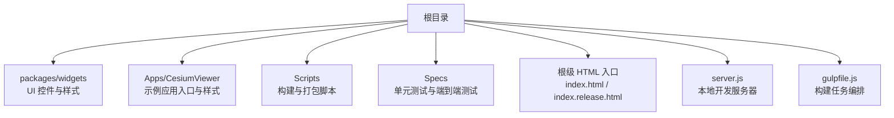
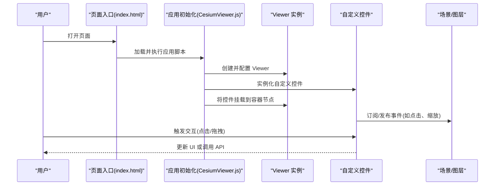
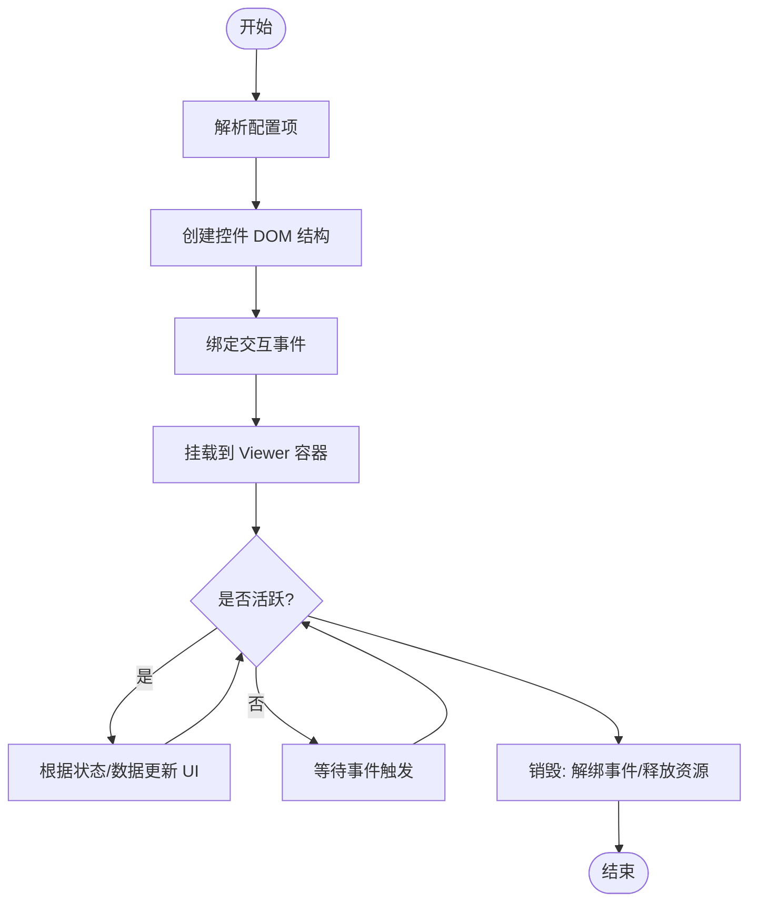
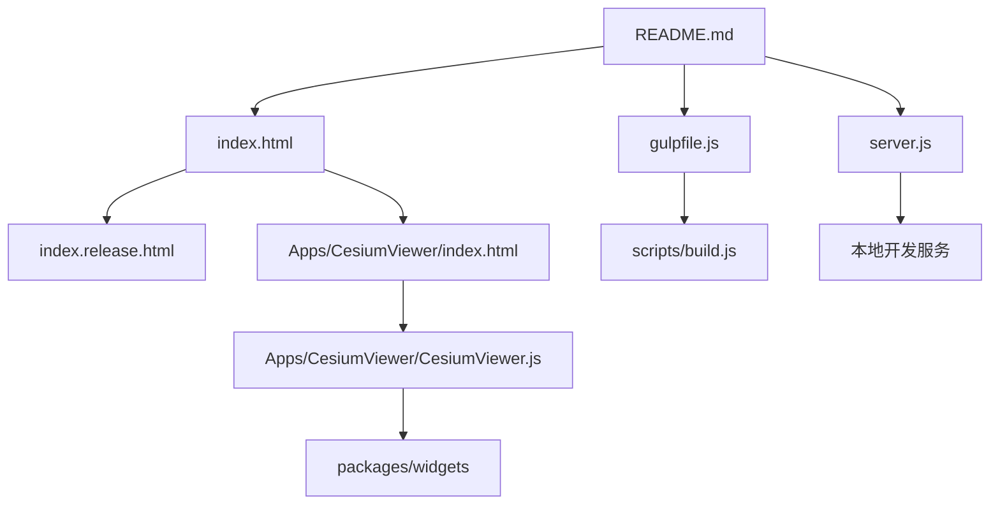

# 控件定制与扩展

<cite>
**本文引用的文件**   
- [README.md](file://README.md)
- [CesiumViewer.js](file://Apps/CesiumViewer/CesiumViewer.js)
- [CesiumViewer.css](file://Apps/CesiumViewer/CesiumViewer.css)
- [index.html](file://Apps/CesiumViewer/index.html)
- [HelloWorld.html](file://Apps/HelloWorld.html)
- [index.html](file://index.html)
- [index.release.html](file://index.release.html)
- [server.js](file://server.js)
- [gulpfile.js](file://gulpfile.js)
- [build.js](file://scripts/build.js)
- [createRoute.js](file://scripts/createRoute.js)
- [SpecRunner.html](file://Specs/SpecRunner.html)
- [karma.conf.cjs](file://Specs/karma.conf.cjs)
- [playwright.config.js](file://Specs/e2e/playwright.config.js)
- [cesium.html](file://Specs/e2e/cesium.html)
- [viewer.spec.js](file://Specs/e2e/viewer.spec.js)
- [pick.js](file://Specs/pick.js)
- [DomEventSimulator.js](file://Specs/DomEventSimulator.js)
- [createScene.js](file://Specs/createScene.js)
- [createCamera.js](file://Specs/createCamera.js)
- [createContext.js](file://Specs/createContext.js)
- [createCanvas.js](file://Specs/createCanvas.js)
</cite>

## 目录
1. [简介](#简介)
2. [项目结构](#项目结构)
3. [核心组件](#核心组件)
4. [架构总览](#架构总览)
5. [详细组件分析](#详细组件分析)
6. [依赖分析](#依赖分析)
7. [性能考虑](#性能考虑)
8. [故障排查指南](#故障排查指南)
9. [结论](#结论)
10. [附录](#附录)

## 简介
本指南面向希望在 CesiumJS 中定制与扩展 UI 控件的开发者。内容涵盖：如何继承和扩展现有控件、创建自定义控件组件；样式系统与主题定制；响应式设计实现；完整的自定义控件开发流程（组件架构、事件处理、生命周期管理）；与 Viewer 的集成方法与配置选项；可访问性与跨浏览器兼容性；以及实际示例与性能优化技巧。

## 项目结构
仓库采用多包与示例分离的组织方式，UI 相关能力集中在 widgets 包，示例应用位于 Apps 目录，构建与测试脚本位于 scripts 与 Specs 目录。

图表来源
- [README.md:1-200](file://README.md#L1-L200)
- [CesiumViewer.js:1-200](file://Apps/CesiumViewer/CesiumViewer.js#L1-L200)
- [CesiumViewer.css:1-200](file://Apps/CesiumViewer/CesiumViewer.css#L1-L200)
- [index.html:1-200](file://index.html#L1-L200)
- [index.release.html:1-200](file://index.release.html#L1-L200)
- [server.js:1-200](file://server.js#L1-L200)
- [gulpfile.js:1-200](file://gulpfile.js#L1-L200)

章节来源
- [README.md:1-200](file://README.md#L1-L200)
- [CesiumViewer.js:1-200](file://Apps/CesiumViewer/CesiumViewer.js#L1-L200)
- [CesiumViewer.css:1-200](file://Apps/CesiumViewer/CesiumViewer.css#L1-L200)
- [index.html:1-200](file://index.html#L1-L200)
- [index.release.html:1-200](file://index.release.html#L1-L200)
- [server.js:1-200](file://server.js#L1-L200)
- [gulpfile.js:1-200](file://gulpfile.js#L1-L200)

## 核心组件
本节聚焦于与控件定制直接相关的核心位置与职责：
- packages/widgets：包含 Cesium 提供的 UI 控件实现与默认样式，是继承与扩展的主要目标。
- Apps/CesiumViewer：示例应用展示了如何引入并初始化 Viewer，以及如何挂载自定义控件到容器。
- 根级 HTML 与构建脚本：提供运行环境与资源加载策略，影响控件渲染与交互体验。

章节来源
- [CesiumViewer.js:1-200](file://Apps/CesiumViewer/CesiumViewer.js#L1-L200)
- [CesiumViewer.css:1-200](file://Apps/CesiumViewer/CesiumViewer.css#L1-L200)
- [index.html:1-200](file://index.html#L1-L200)
- [index.release.html:1-200](file://index.release.html#L1-L200)

## 架构总览
下图展示了一个典型的“自定义控件”在 Cesium 中的集成路径：从页面入口到 Viewer 实例化，再到将自定义控件挂载到指定 DOM 节点，并通过事件总线与场景交互。

图表来源
- [index.html:1-200](file://index.html#L1-L200)
- [CesiumViewer.js:1-200](file://Apps/CesiumViewer/CesiumViewer.js#L1-L200)

## 详细组件分析

### 控件基类与继承模式
- 定位目标：在 packages/widgets 下查找现有控件的实现，理解其构造参数、DOM 结构、事件绑定与销毁逻辑。
- 继承建议：
  - 通过组合而非深继承的方式复用行为，减少耦合。
  - 保留对外暴露的配置项与回调接口，便于上层应用定制。
  - 遵循统一的命名约定与模块导出规范，确保可被按需引入。

章节来源
- [CesiumViewer.js:1-200](file://Apps/CesiumViewer/CesiumViewer.js#L1-L200)

### 自定义控件开发流程
- 组件架构
  - 视图层：基于原生 DOM 或轻量模板生成控件 UI。
  - 控制层：封装事件监听、状态管理与对外 API。
  - 集成层：提供挂载/卸载方法，与 Viewer 容器进行绑定。
- 生命周期
  - 初始化：接收配置、创建 DOM、注册事件。
  - 激活：与 Viewer 建立连接，开始监听场景事件。
  - 更新：根据数据或状态变化刷新 UI。
  - 销毁：移除事件、释放资源、清理 DOM 引用。
- 事件处理
  - 使用统一的事件源（如 Viewer 的事件系统或自定义事件总线）。
  - 避免内存泄漏：在销毁时解绑所有事件与定时器。
- 与 Viewer 集成
  - 通过 Viewer 的容器节点挂载控件。
  - 利用 Viewer 的相机、选择器、图层等 API 驱动 UI 行为。

[此图为概念流程图，不映射具体源码文件]

### 样式系统与主题定制
- 默认样式：widgets 包内提供基础样式，可通过覆盖 CSS 变量或类名进行主题定制。
- 主题策略：
  - 使用 CSS 变量集中管理颜色、尺寸、阴影等视觉属性。
  - 为深色/浅色模式提供两套变量集，通过根节点切换。
- 响应式布局：
  - 使用相对单位与媒体查询适配不同屏幕尺寸。
  - 在小屏设备上折叠次要控件，保证主视口可用空间。

章节来源
- [CesiumViewer.css:1-200](file://Apps/CesiumViewer/CesiumViewer.css#L1-L200)

### 与 Viewer 的集成方法与配置选项
- 集成要点：
  - 在页面入口创建 Viewer 实例，并将自定义控件挂载到指定容器。
  - 通过配置对象注入初始状态（如可见性、位置、默认值）。
- 常见配置项：
  - 容器节点引用、控件显示位置、事件回调、主题开关等。
- 示例参考：
  - 查看示例应用的初始化流程，了解标准挂载方式与最佳实践。

章节来源
- [CesiumViewer.js:1-200](file://Apps/CesiumViewer/CesiumViewer.js#L1-L200)
- [index.html:1-200](file://index.html#L1-L200)

### 可访问性支持与跨浏览器兼容性
- 可访问性
  - 为交互元素添加语义化标签与 aria-* 属性。
  - 支持键盘导航与焦点管理，确保屏幕阅读器友好。
- 兼容性
  - 针对旧版浏览器提供降级方案（如禁用高级特性）。
  - 使用 polyfill 或条件编译处理差异 API。
- 测试验证
  - 在 e2e 用例中模拟用户操作，验证关键交互在不同环境下的表现。

章节来源
- [cesium.html:1-200](file://Specs/e2e/cesium.html#L1-L200)
- [viewer.spec.js:1-200](file://Specs/e2e/viewer.spec.js#L1-L200)

### 实际自定义控件示例（步骤指引）
- 步骤一：在 widgets 目录下新建控件模块，定义构造函数与公共 API。
- 步骤二：在模块内部创建 DOM 结构与事件绑定逻辑。
- 步骤三：在应用初始化脚本中引入并实例化控件，挂载到 Viewer 容器。
- 步骤四：编写样式覆盖或主题变量，完成外观定制。
- 步骤五：补充单元测试与 e2e 用例，确保稳定性。

章节来源
- [CesiumViewer.js:1-200](file://Apps/CesiumViewer/CesiumViewer.js#L1-L200)
- [CesiumViewer.css:1-200](file://Apps/CesiumViewer/CesiumViewer.css#L1-L200)

## 依赖分析
下图展示构建与运行时的主要依赖关系，包括入口 HTML、应用脚本、构建任务与本地服务器。

图表来源
- [README.md:1-200](file://README.md#L1-L200)
- [index.html:1-200](file://index.html#L1-L200)
- [index.release.html:1-200](file://index.release.html#L1-L200)
- [CesiumViewer.js:1-200](file://Apps/CesiumViewer/CesiumViewer.js#L1-L200)
- [gulpfile.js:1-200](file://gulpfile.js#L1-L200)
- [build.js:1-200](file://scripts/build.js#L1-L200)
- [server.js:1-200](file://server.js#L1-L200)

章节来源
- [README.md:1-200](file://README.md#L1-L200)
- [gulpfile.js:1-200](file://gulpfile.js#L1-L200)
- [build.js:1-200](file://scripts/build.js#L1-L200)
- [createRoute.js:1-200](file://scripts/createRoute.js#L1-L200)
- [server.js:1-200](file://server.js#L1-L200)

## 性能考虑
- 控件渲染
  - 避免频繁重排与重绘，批量更新 DOM。
  - 使用 requestAnimationFrame 协调动画与 UI 更新。
- 事件与内存
  - 及时解绑事件与定时器，防止内存泄漏。
  - 对大量数据采用虚拟列表或分页加载。
- 构建与资源
  - 按需引入 widgets 子模块，减小包体积。
  - 启用缓存与压缩，提升首屏加载速度。

[本节为通用指导，不直接分析具体文件]

## 故障排查指南
- 常见问题
  - 控件未显示：检查容器节点是否存在且可见，确认样式未被覆盖。
  - 事件无响应：确认事件绑定是否在正确时机执行，是否存在重复绑定或未解绑。
  - 主题异常：核对 CSS 变量是否正确注入，媒体查询是否生效。
- 调试手段
  - 使用浏览器开发者工具检查 DOM 树与样式计算。
  - 在 e2e 用例中回放用户操作，定位交互问题。
  - 在单元测试中模拟事件与上下文，快速验证逻辑分支。

章节来源
- [SpecRunner.html:1-200](file://Specs/SpecRunner.html#L1-L200)
- [karma.conf.cjs:1-200](file://Specs/karma.conf.cjs#L1-L200)
- [playwright.config.js:1-200](file://Specs/e2e/playwright.config.js#L1-L200)
- [cesium.html:1-200](file://Specs/e2e/cesium.html#L1-L200)
- [viewer.spec.js:1-200](file://Specs/e2e/viewer.spec.js#L1-L200)
- [pick.js:1-200](file://Specs/pick.js#L1-L200)
- [DomEventSimulator.js:1-200](file://Specs/DomEventSimulator.js#L1-L200)
- [createScene.js:1-200](file://Specs/createScene.js#L1-L200)
- [createCamera.js:1-200](file://Specs/createCamera.js#L1-L200)
- [createContext.js:1-200](file://Specs/createContext.js#L1-L200)
- [createCanvas.js:1-200](file://Specs/createCanvas.js#L1-L200)

## 结论
通过在 widgets 包中扩展与继承现有控件，结合清晰的组件架构、完善的事件与生命周期管理、灵活的样式与主题系统，以及与 Viewer 的标准集成方式，可以高效地构建高质量、可维护的自定义控件。配合可访问性与兼容性策略，以及系统的测试与性能优化，能够显著提升用户体验与工程效率。

## 附录
- 快速上手
  - 参考 HelloWorld 与 CesiumViewer 示例，了解最小可用的集成方式。
- 构建与运行
  - 使用 gulpfile 与 build 脚本进行开发与生产构建。
  - 通过 server.js 启动本地开发服务器，便于调试。

章节来源
- [HelloWorld.html:1-200](file://Apps/HelloWorld.html#L1-L200)
- [CesiumViewer.js:1-200](file://Apps/CesiumViewer/CesiumViewer.js#L1-L200)
- [gulpfile.js:1-200](file://gulpfile.js#L1-L200)
- [build.js:1-200](file://scripts/build.js#L1-L200)
- [server.js:1-200](file://server.js#L1-L200)