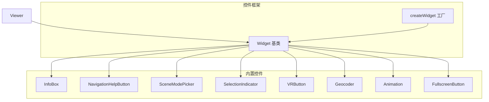
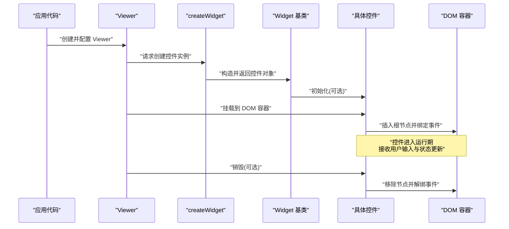
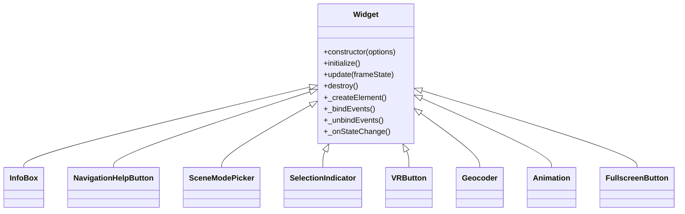
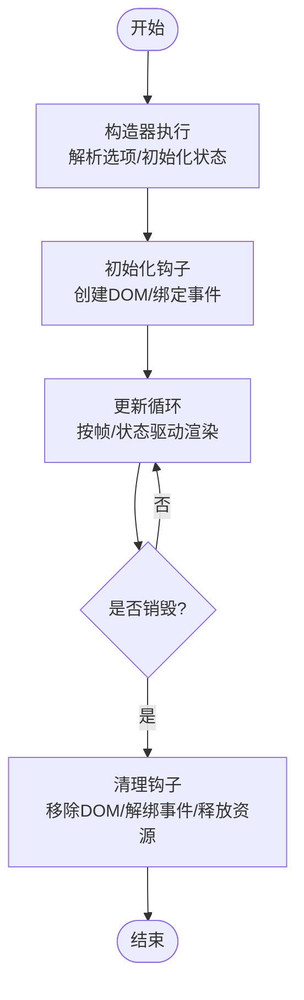
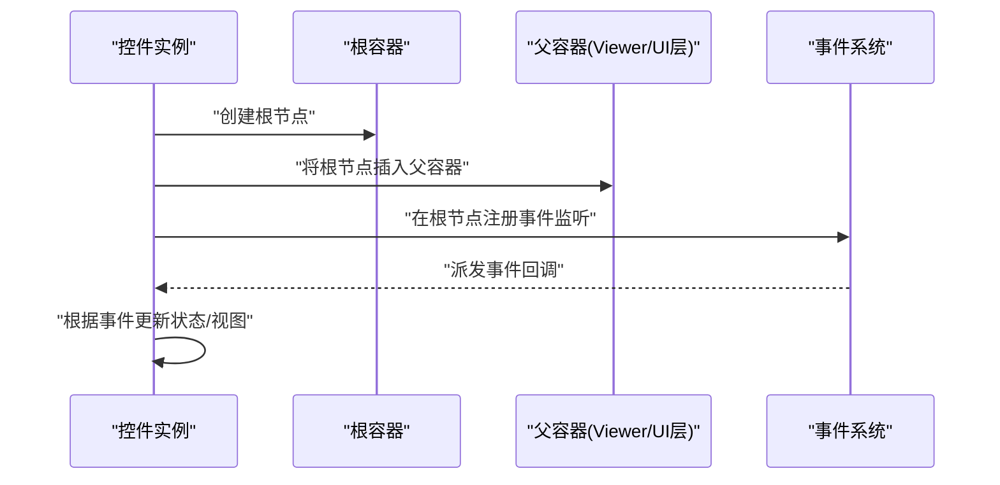
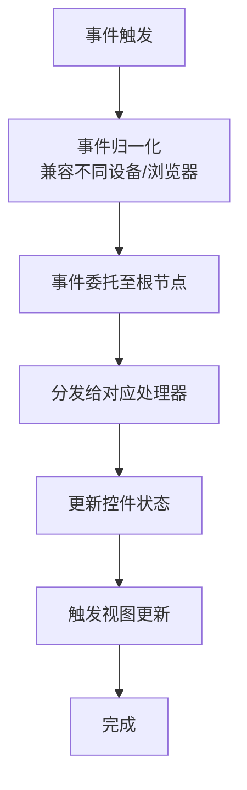
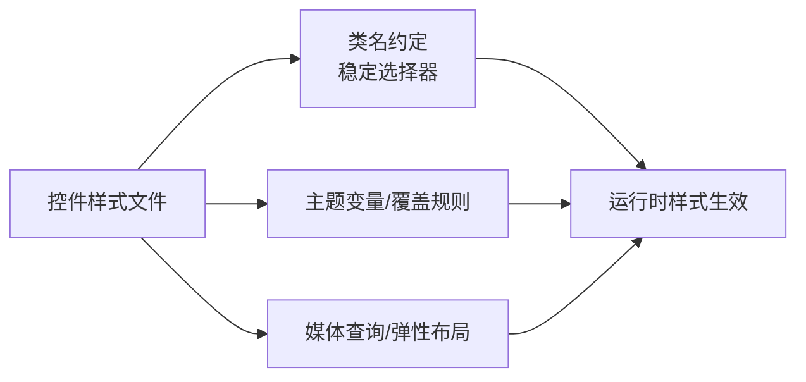
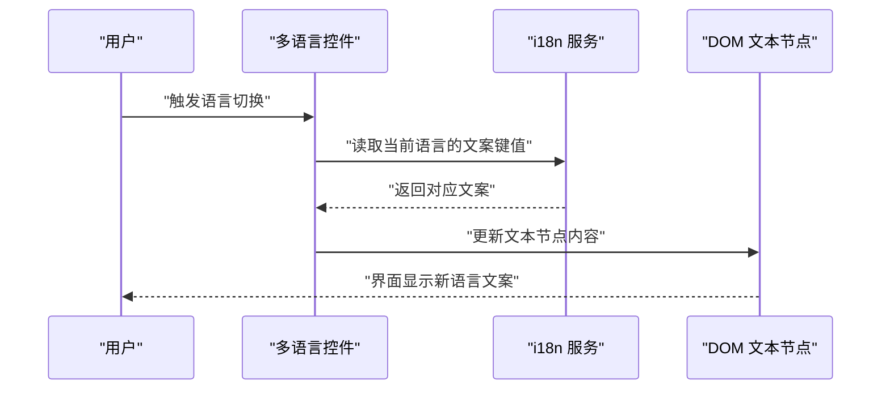
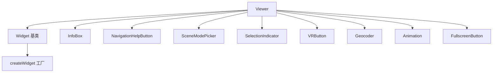

# 控件基础概念

<cite>
**本文引用的文件**   
- [packages/widgets/src/Widget.js](file://packages/widgets/src/Widget.js)
- [packages/widgets/src/createWidget.js](file://packages/widgets/src/createWidget.js)
- [packages/widgets/src/CesiumWidget/CesiumWidget.js](file://packages/widgets/src/CesiumWidget/CesiumWidget.js)
- [packages/widgets/src/InfoBox/InfoBox.js](file://packages/widgets/src/InfoBox/InfoBox.js)
- [packages/widgets/src/NavigationHelpButton/NavigationHelpButton.js](file://packages/widgets/src/NavigationHelpButton/NavigationHelpButton.js)
- [packages/widgets/src/SceneModePicker/SceneModePicker.js](file://packages/widgets/src/SceneModePicker/SceneModePicker.js)
- [packages/widgets/src/SelectionIndicator/SelectionIndicator.js](file://packages/widgets/src/SelectionIndicator/SelectionIndicator.js)
- [packages/widgets/src/VRButton/VRButton.js](file://packages/widgets/src/VRButton/VRButton.js)
- [packages/widgets/src/Geocoder/Geocoder.js](file://packages/widgets/src/Geocoder/Geocoder.js)
- [packages/widgets/src/Animation/Animation.js](file://packages/widgets/src/Animation/Animation.js)
- [packages/widgets/src/FullscreenButton/FullscreenButton.js](file://packages/widgets/src/FullscreenButton/FullscreenButton.js)
- [packages/widgets/src/NavigationHelpButton/NavigationHelpButton.css](file://packages/widgets/src/NavigationHelpButton/NavigationHelpButton.css)
- [packages/widgets/src/InfoBox/InfoBox.css](file://packages/widgets/src/InfoBox/InfoBox.css)
- [packages/widgets/src/SceneModePicker/SceneModePicker.css](file://packages/widgets/src/SceneModePicker/SceneModePicker.css)
- [packages/widgets/src/SelectionIndicator/SelectionIndicator.css](file://packages/widgets/src/SelectionIndicator/SelectionIndicator.css)
- [packages/widgets/src/VRButton/VRButton.css](file://packages/widgets/src/VRButton/VRButton.css)
- [packages/widgets/src/Geocoder/Geocoder.css](file://packages/widgets/src/Geocoder/Geocoder.css)
- [packages/widgets/src/Animation/Animation.css](file://packages/widgets/src/Animation/Animation.css)
- [packages/widgets/src/FullscreenButton/FullscreenButton.css](file://packages/widgets/src/FullscreenButton/FullscreenButton.css)
- [packages/widgets/src/Viewer/Viewer.js](file://packages/widgets/src/Viewer/Viewer.js)
- [packages/widgets/src/Viewer/Viewer.css](file://packages/widgets/src/Viewer/Viewer.css)
- [packages/widgets/src/index.js](file://packages/widgets/src/index.js)
</cite>

## 目录
1. [简介](#简介)
2. [项目结构](#项目结构)
3. [核心组件](#核心组件)
4. [架构总览](#架构总览)
5. [详细组件分析](#详细组件分析)
6. [依赖关系分析](#依赖关系分析)
7. [性能考量](#性能考量)
8. [故障排查指南](#故障排查指南)
9. [结论](#结论)
10. [附录](#附录)

## 简介
本章节聚焦 Cesium 控件系统的基础概念，围绕 Widget 基类的设计模式与核心架构展开，涵盖：
- 控件生命周期管理（创建、挂载、销毁）
- DOM 元素绑定机制与事件处理系统
- 继承体系与扩展机制（如何正确继承 Widget 开发自定义控件）
- 样式系统（CSS 类名约定、主题定制、响应式支持）
- 国际化支持与多语言控件开发
- 完整示例路径与最佳实践指引

## 项目结构
Cesium 的 UI 控件位于 packages/widgets 包中。整体采用“基类 + 具体控件”的分层组织方式：
- 基类与工厂：提供统一的控件抽象、DOM 容器管理与事件分发能力
- 具体控件：基于基类实现业务逻辑与界面交互
- 样式文件：每个控件通常配套独立的 CSS 文件，便于主题化与按需加载
- Viewer 集成：Viewer 作为应用级入口，负责组合多个控件并协调其生命周期

图表来源
- [packages/widgets/src/Widget.js](file://packages/widgets/src/Widget.js)
- [packages/widgets/src/createWidget.js](file://packages/widgets/src/createWidget.js)
- [packages/widgets/src/Viewer/Viewer.js](file://packages/widgets/src/Viewer/Viewer.js)
- [packages/widgets/src/InfoBox/InfoBox.js](file://packages/widgets/src/InfoBox/InfoBox.js)
- [packages/widgets/src/NavigationHelpButton/NavigationHelpButton.js](file://packages/widgets/src/NavigationHelpButton/NavigationHelpButton.js)
- [packages/widgets/src/SceneModePicker/SceneModePicker.js](file://packages/widgets/src/SceneModePicker/SceneModePicker.js)
- [packages/widgets/src/SelectionIndicator/SelectionIndicator.js](file://packages/widgets/src/SelectionIndicator/SelectionIndicator.js)
- [packages/widgets/src/VRButton/VRButton.js](file://packages/widgets/src/VRButton/VRButton.js)
- [packages/widgets/src/Geocoder/Geocoder.js](file://packages/widgets/src/Geocoder/Geocoder.js)
- [packages/widgets/src/Animation/Animation.js](file://packages/widgets/src/Animation/Animation.js)
- [packages/widgets/src/FullscreenButton/FullscreenButton.js](file://packages/widgets/src/FullscreenButton/FullscreenButton.js)

章节来源
- [packages/widgets/src/Widget.js](file://packages/widgets/src/Widget.js)
- [packages/widgets/src/createWidget.js](file://packages/widgets/src/createWidget.js)
- [packages/widgets/src/Viewer/Viewer.js](file://packages/widgets/src/Viewer/Viewer.js)

## 核心组件
本节深入解析 Widget 基类的职责与关键能力：
- 统一的生命周期钩子：构造、初始化、渲染更新、销毁等阶段
- DOM 容器管理：为控件提供宿主节点，支持插入到指定父容器或默认位置
- 事件系统：集中注册/注销事件，避免内存泄漏；支持跨层级冒泡与取消
- 可配置项与状态：通过 options 注入行为差异，内部状态变更触发重绘或通知
- 可扩展点：提供受保护的模板方法，供子类覆盖以实现特定逻辑

典型能力要点
- 在构造时完成参数校验与默认值合并
- 在初始化阶段建立 DOM 结构与事件监听
- 在更新阶段根据状态同步视图
- 在销毁阶段清理资源与事件，确保无悬挂引用

章节来源
- [packages/widgets/src/Widget.js](file://packages/widgets/src/Widget.js)

## 架构总览
下图展示了从 Viewer 到具体控件的整体调用链与数据流：
- Viewer 负责装配控件实例，并将它们挂载到页面容器
- createWidget 工厂用于生成具备通用能力的控件对象
- 各具体控件继承自 Widget，复用生命周期与事件机制

图表来源
- [packages/widgets/src/Viewer/Viewer.js](file://packages/widgets/src/Viewer/Viewer.js)
- [packages/widgets/src/createWidget.js](file://packages/widgets/src/createWidget.js)
- [packages/widgets/src/Widget.js](file://packages/widgets/src/Widget.js)

## 详细组件分析

### Widget 基类设计模式与扩展机制
- 设计模式
  - 模板方法：定义生命周期骨架，子类仅覆盖必要步骤
  - 组合优于继承：通过工厂与选项注入行为，降低耦合
  - 观察者模式：事件中心统一管理订阅与发布
- 继承建议
  - 优先使用 createWidget 工厂创建实例，以获得一致的初始化流程
  - 在构造函数中只进行轻量初始化，复杂逻辑放入初始化钩子
  - 在销毁钩子中务必释放所有外部资源与事件监听
  - 对外暴露稳定的 API，内部状态变更通过事件通知

图表来源
- [packages/widgets/src/Widget.js](file://packages/widgets/src/Widget.js)
- [packages/widgets/src/InfoBox/InfoBox.js](file://packages/widgets/src/InfoBox/InfoBox.js)
- [packages/widgets/src/NavigationHelpButton/NavigationHelpButton.js](file://packages/widgets/src/NavigationHelpButton/NavigationHelpButton.js)
- [packages/widgets/src/SceneModePicker/SceneModePicker.js](file://packages/widgets/src/SceneModePicker/SceneModePicker.js)
- [packages/widgets/src/SelectionIndicator/SelectionIndicator.js](file://packages/widgets/src/SelectionIndicator/SelectionIndicator.js)
- [packages/widgets/src/VRButton/VRButton.js](file://packages/widgets/src/VRButton/VRButton.js)
- [packages/widgets/src/Geocoder/Geocoder.js](file://packages/widgets/src/Geocoder/Geocoder.js)
- [packages/widgets/src/Animation/Animation.js](file://packages/widgets/src/Animation/Animation.js)
- [packages/widgets/src/FullscreenButton/FullscreenButton.js](file://packages/widgets/src/FullscreenButton/FullscreenButton.js)

章节来源
- [packages/widgets/src/Widget.js](file://packages/widgets/src/Widget.js)

### 生命周期管理
- 构造阶段：解析 options、设置默认值、准备私有状态
- 初始化阶段：创建 DOM 节点、绑定事件、接入外部服务
- 更新阶段：根据 frameState 或内部状态驱动视图刷新
- 销毁阶段：移除 DOM、解绑事件、释放资源

图表来源
- [packages/widgets/src/Widget.js](file://packages/widgets/src/Widget.js)

章节来源
- [packages/widgets/src/Widget.js](file://packages/widgets/src/Widget.js)

### DOM 元素绑定机制
- 根节点策略：每个控件维护一个根容器，便于整体显示/隐藏与定位
- 插入策略：支持插入到指定父容器或默认挂载点（如 Viewer 的 UI 层）
- 事件委托：在根节点上统一注册事件，减少监听器数量，提升性能
- 安全与兼容：对触摸/鼠标事件做归一化处理，适配移动端与桌面端

图表来源
- [packages/widgets/src/Widget.js](file://packages/widgets/src/Widget.js)

章节来源
- [packages/widgets/src/Widget.js](file://packages/widgets/src/Widget.js)

### 事件处理系统
- 事件模型：统一的事件源与目标，支持冒泡与捕获
- 生命周期内绑定/解绑：确保在初始化时绑定，在销毁时解绑
- 防抖与节流：对高频事件（如拖拽、缩放）进行优化
- 错误边界：捕获异常并上报，避免影响主流程

图表来源
- [packages/widgets/src/Widget.js](file://packages/widgets/src/Widget.js)

章节来源
- [packages/widgets/src/Widget.js](file://packages/widgets/src/Widget.js)

### 样式系统与主题定制
- CSS 模块划分：每个控件拥有独立 CSS 文件，便于按需引入与隔离
- 类名约定：遵循 BEM 或类似命名规范，保证选择器稳定与可预测
- 主题定制：通过 CSS 变量或覆盖类名实现主题切换
- 响应式设计：使用相对单位与媒体查询，适配不同屏幕尺寸

图表来源
- [packages/widgets/src/NavigationHelpButton/NavigationHelpButton.css](file://packages/widgets/src/NavigationHelpButton/NavigationHelpButton.css)
- [packages/widgets/src/InfoBox/InfoBox.css](file://packages/widgets/src/InfoBox/InfoBox.css)
- [packages/widgets/src/SceneModePicker/SceneModePicker.css](file://packages/widgets/src/SceneModePicker/SceneModePicker.css)
- [packages/widgets/src/SelectionIndicator/SelectionIndicator.css](file://packages/widgets/src/SelectionIndicator/SelectionIndicator.css)
- [packages/widgets/src/VRButton/VRButton.css](file://packages/widgets/src/VRButton/VRButton.css)
- [packages/widgets/src/Geocoder/Geocoder.css](file://packages/widgets/src/Geocoder/Geocoder.css)
- [packages/widgets/src/Animation/Animation.css](file://packages/widgets/src/Animation/Animation.css)
- [packages/widgets/src/FullscreenButton/FullscreenButton.css](file://packages/widgets/src/FullscreenButton/FullscreenButton.css)

章节来源
- [packages/widgets/src/NavigationHelpButton/NavigationHelpButton.css](file://packages/widgets/src/NavigationHelpButton/NavigationHelpButton.css)
- [packages/widgets/src/InfoBox/InfoBox.css](file://packages/widgets/src/InfoBox/InfoBox.css)
- [packages/widgets/src/SceneModePicker/SceneModePicker.css](file://packages/widgets/src/SceneModePicker/SceneModePicker.css)
- [packages/widgets/src/SelectionIndicator/SelectionIndicator.css](file://packages/widgets/src/SelectionIndicator/SelectionIndicator.css)
- [packages/widgets/src/VRButton/VRButton.css](file://packages/widgets/src/VRButton/VRButton.css)
- [packages/widgets/src/Geocoder/Geocoder.css](file://packages/widgets/src/Geocoder/Geocoder.css)
- [packages/widgets/src/Animation/Animation.css](file://packages/widgets/src/Animation/Animation.css)
- [packages/widgets/src/FullscreenButton/FullscreenButton.css](file://packages/widgets/src/FullscreenButton/FullscreenButton.css)

### 国际化支持与多语言控件开发
- 文本来源：控件中的文案应通过 i18n 键值获取，而非硬编码字符串
- 动态切换：在语言切换时重新渲染受影响控件的文本内容
- 复数与格式化：利用本地化工具提供的复数与数字/日期格式化能力
- 测试覆盖：为多语言场景编写用例，确保文案替换正确

图表来源
- [packages/widgets/src/InfoBox/InfoBox.js](file://packages/widgets/src/InfoBox/InfoBox.js)
- [packages/widgets/src/Geocoder/Geocoder.js](file://packages/widgets/src/Geocoder/Geocoder.js)
- [packages/widgets/src/Animation/Animation.js](file://packages/widgets/src/Animation/Animation.js)

章节来源
- [packages/widgets/src/InfoBox/InfoBox.js](file://packages/widgets/src/InfoBox/InfoBox.js)
- [packages/widgets/src/Geocoder/Geocoder.js](file://packages/widgets/src/Geocoder/Geocoder.js)
- [packages/widgets/src/Animation/Animation.js](file://packages/widgets/src/Animation/Animation.js)

### 自定义控件开发最佳实践
- 继承 Widget 基类，覆盖必要的生命周期钩子
- 使用 createWidget 工厂创建实例，确保一致初始化
- 在初始化阶段创建 DOM 并绑定事件，在销毁阶段清理
- 通过 options 注入行为差异，保持 API 简洁稳定
- 使用事件系统与其他组件通信，避免直接耦合
- 遵循样式约定，提供主题覆盖点与响应式支持
- 为多语言文案提供键值映射，并在语言切换时刷新

章节来源
- [packages/widgets/src/Widget.js](file://packages/widgets/src/Widget.js)
- [packages/widgets/src/createWidget.js](file://packages/widgets/src/createWidget.js)

## 依赖关系分析
- 低耦合高内聚：Widget 基类封装通用能力，具体控件专注业务逻辑
- 工厂模式：createWidget 屏蔽构造细节，统一初始化流程
- 组合关系：Viewer 组合多个控件，形成完整的 UI 体验
- 样式隔离：每个控件独立 CSS，降低样式冲突风险

图表来源
- [packages/widgets/src/Widget.js](file://packages/widgets/src/Widget.js)
- [packages/widgets/src/createWidget.js](file://packages/widgets/src/createWidget.js)
- [packages/widgets/src/Viewer/Viewer.js](file://packages/widgets/src/Viewer/Viewer.js)
- [packages/widgets/src/InfoBox/InfoBox.js](file://packages/widgets/src/InfoBox/InfoBox.js)
- [packages/widgets/src/NavigationHelpButton/NavigationHelpButton.js](file://packages/widgets/src/NavigationHelpButton/NavigationHelpButton.js)
- [packages/widgets/src/SceneModePicker/SceneModePicker.js](file://packages/widgets/src/SceneModePicker/SceneModePicker.js)
- [packages/widgets/src/SelectionIndicator/SelectionIndicator.js](file://packages/widgets/src/SelectionIndicator/SelectionIndicator.js)
- [packages/widgets/src/VRButton/VRButton.js](file://packages/widgets/src/VRButton/VRButton.js)
- [packages/widgets/src/Geocoder/Geocoder.js](file://packages/widgets/src/Geocoder/Geocoder.js)
- [packages/widgets/src/Animation/Animation.js](file://packages/widgets/src/Animation/Animation.js)
- [packages/widgets/src/FullscreenButton/FullscreenButton.js](file://packages/widgets/src/FullscreenButton/FullscreenButton.js)

章节来源
- [packages/widgets/src/Widget.js](file://packages/widgets/src/Widget.js)
- [packages/widgets/src/createWidget.js](file://packages/widgets/src/createWidget.js)
- [packages/widgets/src/Viewer/Viewer.js](file://packages/widgets/src/Viewer/Viewer.js)

## 性能考量
- 事件委托：在根节点统一监听，减少监听器数量
- 批量更新：合并多次状态变更，减少重排与重绘
- 懒加载：仅在需要时创建与挂载控件
- 资源释放：在销毁时及时清理 DOM 与事件，避免内存泄漏
- 样式优化：避免过度嵌套与复杂选择器，合理使用 CSS 变量

[本节为通用指导，不直接分析具体文件]

## 故障排查指南
- 控件未显示
  - 检查是否正确插入到父容器
  - 确认样式文件已加载且未被覆盖
  - 验证根节点是否存在且可见
- 事件不触发
  - 确认事件是否在初始化阶段绑定
  - 检查是否有其他监听器阻止冒泡
  - 验证事件目标是否为根节点或其子节点
- 内存泄漏
  - 确认销毁阶段是否解绑所有事件
  - 检查是否存在闭包引用外部对象
  - 验证是否移除了 DOM 节点
- 多语言文案未更新
  - 确认语言切换后是否触发了控件的文本刷新
  - 检查 i18n 键值是否正确映射
  - 验证文案是否来自 i18n 服务而非硬编码

章节来源
- [packages/widgets/src/Widget.js](file://packages/widgets/src/Widget.js)
- [packages/widgets/src/InfoBox/InfoBox.js](file://packages/widgets/src/InfoBox/InfoBox.js)
- [packages/widgets/src/Geocoder/Geocoder.js](file://packages/widgets/src/Geocoder/Geocoder.js)
- [packages/widgets/src/Animation/Animation.js](file://packages/widgets/src/Animation/Animation.js)

## 结论
Widget 基类为 Cesium 控件提供了统一的生命周期、DOM 绑定与事件处理能力。通过工厂模式与继承体系，开发者可以快速构建功能丰富、易于维护的自定义控件。遵循样式约定与多语言规范，可实现良好的主题定制与国际化支持。结合性能优化与故障排查策略，能够显著提升用户体验与系统稳定性。

[本节为总结性内容，不直接分析具体文件]

## 附录
- 常用控件参考
  - InfoBox：信息展示面板
  - NavigationHelpButton：导航帮助按钮
  - SceneModePicker：场景模式选择器
  - SelectionIndicator：选择指示器
  - VRButton：VR 模式按钮
  - Geocoder：地理编码器
  - Animation：时间轴动画控制器
  - FullscreenButton：全屏切换按钮

章节来源
- [packages/widgets/src/InfoBox/InfoBox.js](file://packages/widgets/src/InfoBox/InfoBox.js)
- [packages/widgets/src/NavigationHelpButton/NavigationHelpButton.js](file://packages/widgets/src/NavigationHelpButton/NavigationHelpButton.js)
- [packages/widgets/src/SceneModePicker/SceneModePicker.js](file://packages/widgets/src/SceneModePicker/SceneModePicker.js)
- [packages/widgets/src/SelectionIndicator/SelectionIndicator.js](file://packages/widgets/src/SelectionIndicator/SelectionIndicator.js)
- [packages/widgets/src/VRButton/VRButton.js](file://packages/widgets/src/VRButton/VRButton.js)
- [packages/widgets/src/Geocoder/Geocoder.js](file://packages/widgets/src/Geocoder/Geocoder.js)
- [packages/widgets/src/Animation/Animation.js](file://packages/widgets/src/Animation/Animation.js)
- [packages/widgets/src/FullscreenButton/FullscreenButton.js](file://packages/widgets/src/FullscreenButton/FullscreenButton.js)