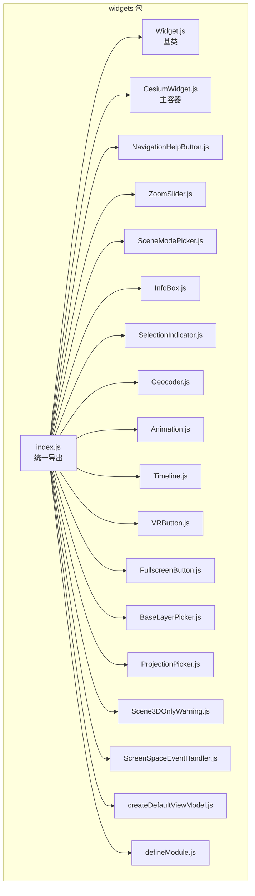
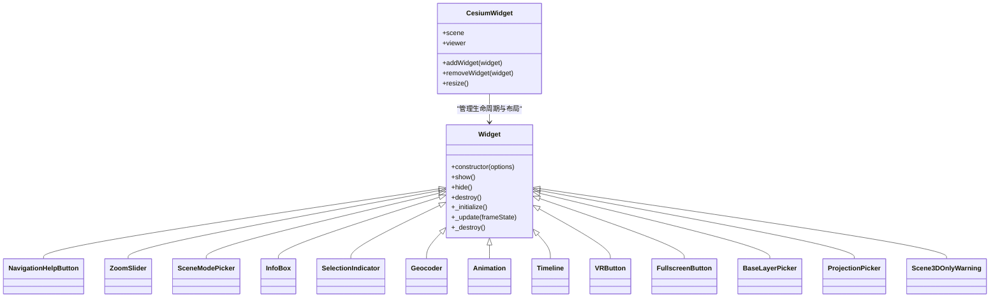
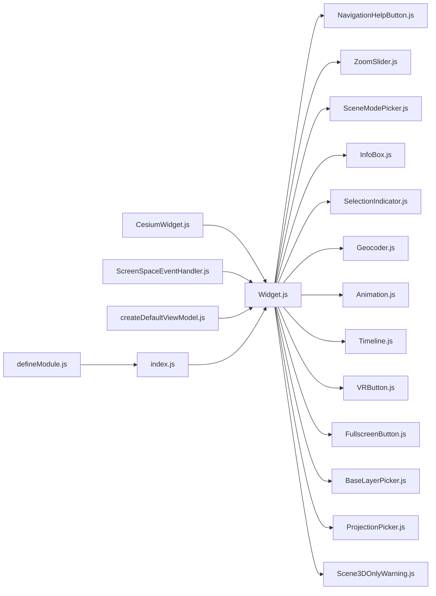

# 控件系统

<cite>
**本文引用的文件**   
- [packages/widgets/src/Widget.js](file://packages/widgets/src/Widget.js)
- [packages/widgets/src/NavigationHelpButton.js](file://packages/widgets/src/NavigationHelpButton.js)
- [packages/widgets/src/ZoomSlider.js](file://packages/widgets/src/ZoomSlider.js)
- [packages/widgets/src/SceneModePicker.js](file://packages/widgets/src/SceneModePicker.js)
- [packages/widgets/src/CesiumWidget.js](file://packages/widgets/src/CesiumWidget.js)
- [packages/widgets/src/InfoBox.js](file://packages/widgets/src/InfoBox.js)
- [packages/widgets/src/SelectionIndicator.js](file://packages/widgets/src/SelectionIndicator.js)
- [packages/widgets/src/Geocoder.js](file://packages/widgets/src/Geocoder.js)
- [packages/widgets/src/Animation.js](file://packages/widgets/src/Animation.js)
- [packages/widgets/src/Timeline.js](file://packages/widgets/src/Timeline.js)
- [packages/widgets/src/VRButton.js](file://packages/widgets/src/VRButton.js)
- [packages/widgets/src/FullscreenButton.js](file://packages/widgets/src/FullscreenButton.js)
- [packages/widgets/src/BaseLayerPicker.js](file://packages/widgets/src/BaseLayerPicker.js)
- [packages/widgets/src/ProjectionPicker.js](file://packages/widgets/src/ProjectionPicker.js)
- [packages/widgets/src/Scene3DOnlyWarning.js](file://packages/widgets/src/Scene3DOnlyWarning.js)
- [packages/widgets/src/ScreenSpaceEventHandler.js](file://packages/widgets/src/ScreenSpaceEventHandler.js)
- [packages/widgets/src/createDefaultViewModel.js](file://packages/widgets/src/createDefaultViewModel.js)
- [packages/widgets/src/defineModule.js](file://packages/widgets/src/defineModule.js)
- [packages/widgets/index.js](file://packages/widgets/index.js)
</cite>

## 目录
1. [简介](#简介)
2. [项目结构](#项目结构)
3. [核心组件](#核心组件)
4. [架构总览](#架构总览)
5. [详细组件分析](#详细组件分析)
6. [依赖关系分析](#依赖关系分析)
7. [性能考量](#性能考量)
8. [故障排查指南](#故障排查指南)
9. [结论](#结论)
10. [附录](#附录) 

## 简介
本技术文档聚焦 Cesium 的控件系统，围绕 Widget 基类的设计模式与继承机制展开，系统阐述内置控件（导航帮助按钮、缩放滑块、场景模式选择器等）的功能特性与交互流程。同时提供自定义控件的开发流程与扩展点说明，覆盖生命周期管理、样式定制、事件处理机制，并给出完整的创建、配置、组合与自定义示例路径。最后补充响应式设计与移动端适配的最佳实践建议。

## 项目结构
Cesium 的 UI 控件位于 packages/widgets 目录下，采用“按功能模块组织”的结构：每个控件一个独立文件，集中实现其 DOM 结构、样式、事件绑定与业务逻辑；通过统一的 defineModule 进行模块导出，并通过 index.js 聚合对外暴露 API。

图表来源
- [packages/widgets/index.js](file://packages/widgets/index.js)
- [packages/widgets/src/Widget.js](file://packages/widgets/src/Widget.js)
- [packages/widgets/src/CesiumWidget.js](file://packages/widgets/src/CesiumWidget.js)
- [packages/widgets/src/NavigationHelpButton.js](file://packages/widgets/src/NavigationHelpButton.js)
- [packages/widgets/src/ZoomSlider.js](file://packages/widgets/src/ZoomSlider.js)
- [packages/widgets/src/SceneModePicker.js](file://packages/widgets/src/SceneModePicker.js)

章节来源
- [packages/widgets/index.js](file://packages/widgets/index.js)

## 核心组件
本节深入解析 Widget 基类及其在控件体系中的职责边界，以及它与 CesiumWidget 的关系。

- Widget 基类职责
  - 提供统一的构造参数约定（如 container、className、show/hide、destroy 等）。
  - 封装 DOM 节点挂载、可见性控制、销毁清理等通用能力。
  - 定义受控属性与只读属性的访问器规范，便于外部订阅状态变化。
  - 为子类提供可复用的事件注册与生命周期钩子（如 _initialize、_update、_destroy）。

- CesiumWidget 作为容器
  - 负责将各类控件实例挂载到地图画布之上或周边区域。
  - 协调控件与 Scene/Viewer 的生命周期，确保在合适时机初始化与释放资源。
  - 提供默认布局策略与响应式行为（例如在不同屏幕尺寸下调整控件位置与尺寸）。

- 视图模型与事件总线
  - createDefaultViewModel 提供通用的 ViewModel 工厂，用于将控件状态与 UI 绑定。
  - ScreenSpaceEventHandler 封装鼠标/触摸事件，供控件统一接入交互。

章节来源
- [packages/widgets/src/Widget.js](file://packages/widgets/src/Widget.js)
- [packages/widgets/src/CesiumWidget.js](file://packages/widgets/src/CesiumWidget.js)
- [packages/widgets/src/createDefaultViewModel.js](file://packages/widgets/src/createDefaultViewModel.js)
- [packages/widgets/src/ScreenSpaceEventHandler.js](file://packages/widgets/src/ScreenSpaceEventHandler.js)

## 架构总览
下图展示了控件系统与 Cesium 核心之间的交互关系：CesiumWidget 作为宿主，持有 Scene/Viewer 上下文；各控件通过基类提供的接口与宿主通信，完成渲染更新、事件分发与状态同步。

图表来源
- [packages/widgets/src/Widget.js](file://packages/widgets/src/Widget.js)
- [packages/widgets/src/CesiumWidget.js](file://packages/widgets/src/CesiumWidget.js)
- [packages/widgets/src/NavigationHelpButton.js](file://packages/widgets/src/NavigationHelpButton.js)
- [packages/widgets/src/ZoomSlider.js](file://packages/widgets/src/ZoomSlider.js)
- [packages/widgets/src/SceneModePicker.js](file://packages/widgets/src/SceneModePicker.js)
- [packages/widgets/src/InfoBox.js](file://packages/widgets/src/InfoBox.js)
- [packages/widgets/src/SelectionIndicator.js](file://packages/widgets/src/SelectionIndicator.js)
- [packages/widgets/src/Geocoder.js](file://packages/widgets/src/Geocoder.js)
- [packages/widgets/src/Animation.js](file://packages/widgets/src/Animation.js)
- [packages/widgets/src/Timeline.js](file://packages/widgets/src/Timeline.js)
- [packages/widgets/src/VRButton.js](file://packages/widgets/src/VRButton.js)
- [packages/widgets/src/FullscreenButton.js](file://packages/widgets/src/FullscreenButton.js)
- [packages/widgets/src/BaseLayerPicker.js](file://packages/widgets/src/BaseLayerPicker.js)
- [packages/widgets/src/ProjectionPicker.js](file://packages/widgets/src/ProjectionPicker.js)
- [packages/widgets/src/Scene3DOnlyWarning.js](file://packages/widgets/src/Scene3DOnlyWarning.js)

## 详细组件分析

### Widget 基类设计模式与继承机制
- 设计模式
  - 模板方法：通过 _initialize/_update/_destroy 等钩子，让子类按需覆写具体行为。
  - 组合优于继承：控件通过组合 CesiumWidget 的能力（如事件、场景、DOM 容器），而非深度继承。
  - 受控组件：对外暴露 show/hide/destroy 等稳定接口，内部状态变更通过回调或事件通知。
- 继承机制
  - 所有内置控件均继承自 Widget，复用 DOM 挂载、可见性切换、销毁清理等通用逻辑。
  - 子类仅需关注自身业务逻辑（如渲染更新、用户交互、数据绑定）。

章节来源
- [packages/widgets/src/Widget.js](file://packages/widgets/src/Widget.js)

### 导航帮助按钮（NavigationHelpButton）
- 功能特性
  - 显示常用导航操作提示（旋转、平移、缩放等）。
  - 支持键盘与鼠标交互提示，提升新手上手体验。
- 交互流程
  - 点击触发帮助面板展示/隐藏。
  - 根据当前设备类型（桌面/移动）动态调整提示内容。
- 生命周期
  - 初始化时注册事件监听，销毁时移除监听，避免内存泄漏。

章节来源
- [packages/widgets/src/NavigationHelpButton.js](file://packages/widgets/src/NavigationHelpButton.js)

### 缩放滑块（ZoomSlider）
- 功能特性
  - 提供可视化缩放级别调节条。
  - 支持拖拽与滚轮联动，实时更新相机距离。
- 数据处理
  - 将滑块值映射为相机距离范围，考虑地形与场景模式差异。
- 样式定制
  - 可通过 CSS 变量或 className 覆盖滑块轨道、手柄样式。

章节来源
- [packages/widgets/src/ZoomSlider.js](file://packages/widgets/src/ZoomSlider.js)

### 场景模式选择器（SceneModePicker）
- 功能特性
  - 切换 3D/2D/哥伦布视图（CV）三种场景模式。
  - 根据当前模式高亮选中项，并广播模式变更事件。
- 兼容性
  - 在非 WebGL 环境或受限设备上自动降级或禁用不可用选项。

章节来源
- [packages/widgets/src/SceneModePicker.js](file://packages/widgets/src/SceneModePicker.js)

### 信息框（InfoBox）
- 功能特性
  - 以侧边栏形式展示选中要素的详细信息。
  - 支持富文本与链接跳转，提供关闭与最小化操作。
- 数据绑定
  - 通过 ViewModel 与选中对象属性双向绑定，实时更新内容。

章节来源
- [packages/widgets/src/InfoBox.js](file://packages/widgets/src/InfoBox.js)

### 选择指示器（SelectionIndicator）
- 功能特性
  - 在地图上绘制选择框或高亮标记，反馈用户选择结果。
- 事件处理
  - 监听选择事件，更新指示器位置与样式。

章节来源
- [packages/widgets/src/SelectionIndicator.js](file://packages/widgets/src/SelectionIndicator.js)

### 地理编码器（Geocoder）
- 功能特性
  - 输入地名或坐标，执行搜索并定位至目标位置。
  - 支持历史搜索记录与自动补全。
- 网络请求
  - 使用可配置的请求提供者，支持离线与缓存策略。

章节来源
- [packages/widgets/src/Geocoder.js](file://packages/widgets/src/Geocoder.js)

### 动画控制器（Animation）
- 功能特性
  - 播放/暂停时间轴动画，显示当前时间与速度控制。
- 时间同步
  - 与 Timeline 联动，保持时间一致性。

章节来源
- [packages/widgets/src/Animation.js](file://packages/widgets/src/Animation.js)

### 时间轴（Timeline）
- 功能特性
  - 可视化时间轴，支持拖动、缩放与关键帧编辑。
- 性能优化
  - 对大量数据进行虚拟化渲染，减少重绘开销。

章节来源
- [packages/widgets/src/Timeline.js](file://packages/widgets/src/Timeline.js)

### VR 按钮（VRButton）
- 功能特性
  - 一键进入 VR 模式，适配 WebXR 设备。
- 兼容性检测
  - 检测设备是否支持 VR，不支持时隐藏或禁用按钮。

章节来源
- [packages/widgets/src/VRButton.js](file://packages/widgets/src/VRButton.js)

### 全屏按钮（FullscreenButton）
- 功能特性
  - 切换全屏显示，适配不同浏览器全屏 API。
- 事件处理
  - 监听全屏状态变化，更新按钮图标与提示。

章节来源
- [packages/widgets/src/FullscreenButton.js](file://packages/widgets/src/FullscreenButton.js)

### 底图选择器（BaseLayerPicker）
- 功能特性
  - 提供多种底图源切换，支持预览缩略图与名称描述。
- 数据加载
  - 懒加载缩略图，避免首屏性能问题。

章节来源
- [packages/widgets/src/BaseLayerPicker.js](file://packages/widgets/src/BaseLayerPicker.js)

### 投影选择器（ProjectionPicker）
- 功能特性
  - 切换地图投影方式（如经纬度/墨卡托），影响坐标计算与显示。
- 场景约束
  - 某些场景模式下投影选项受限，需动态启用/禁用。

章节来源
- [packages/widgets/src/ProjectionPicker.js](file://packages/widgets/src/ProjectionPicker.js)

### 仅 3D 场景警告（Scene3DOnlyWarning）
- 功能特性
  - 当检测到非 3D 场景或硬件不支持时，显示友好警告提示。
- 用户体验
  - 提供引导链接与解决方案，降低用户困惑。

章节来源
- [packages/widgets/src/Scene3DOnlyWarning.js](file://packages/widgets/src/Scene3DOnlyWarning.js)

### 事件处理与视图模型
- ScreenSpaceEventHandler
  - 统一封装鼠标/触摸事件，提供拾取、拖拽、双击等高级交互。
- createDefaultViewModel
  - 生成默认视图模型，简化控件与数据的绑定过程。

章节来源
- [packages/widgets/src/ScreenSpaceEventHandler.js](file://packages/widgets/src/ScreenSpaceEventHandler.js)
- [packages/widgets/src/createDefaultViewModel.js](file://packages/widgets/src/createDefaultViewModel.js)

### 模块导出与入口
- defineModule
  - 统一模块导出格式，兼容 AMD/CommonJS/ESM。
- index.js
  - 聚合所有控件导出，提供简洁的引入方式。

章节来源
- [packages/widgets/src/defineModule.js](file://packages/widgets/src/defineModule.js)
- [packages/widgets/index.js](file://packages/widgets/index.js)

## 依赖关系分析
控件之间通常低耦合，主要依赖 Widget 基类与 CesiumWidget 容器。部分控件共享事件处理器与视图模型工具。

图表来源
- [packages/widgets/src/Widget.js](file://packages/widgets/src/Widget.js)
- [packages/widgets/src/CesiumWidget.js](file://packages/widgets/src/CesiumWidget.js)
- [packages/widgets/src/ScreenSpaceEventHandler.js](file://packages/widgets/src/ScreenSpaceEventHandler.js)
- [packages/widgets/src/createDefaultViewModel.js](file://packages/widgets/src/createDefaultViewModel.js)
- [packages/widgets/src/defineModule.js](file://packages/widgets/src/defineModule.js)
- [packages/widgets/index.js](file://packages/widgets/index.js)

章节来源
- [packages/widgets/index.js](file://packages/widgets/index.js)

## 性能考量
- 延迟初始化：仅在需要时创建控件实例，减少首屏开销。
- 事件去抖与节流：对频繁触发的事件（如缩放、拖拽）进行节流，避免过度重绘。
- 虚拟列表：时间轴等大数据量控件采用虚拟化渲染，按需绘制可视区域。
- 资源懒加载：底图缩略图等图片资源按需加载，结合缓存策略提升二次访问速度。
- 销毁清理：确保在 destroy 中移除事件监听与定时器，防止内存泄漏。

[本节为通用指导，不直接分析具体文件]

## 故障排查指南
- 控件未显示
  - 检查容器元素是否存在且可见。
  - 确认 show/hide 状态是否正确设置。
- 事件无响应
  - 验证事件处理器是否已正确注册。
  - 检查是否在销毁后仍尝试触发事件。
- 样式异常
  - 确认 CSS 优先级未被覆盖。
  - 检查 className 与 CSS 变量是否匹配。
- 内存泄漏
  - 确保在 destroy 中清理所有监听与定时器。
  - 避免在回调中保留对大对象的引用。

章节来源
- [packages/widgets/src/Widget.js](file://packages/widgets/src/Widget.js)
- [packages/widgets/src/ScreenSpaceEventHandler.js](file://packages/widgets/src/ScreenSpaceEventHandler.js)

## 结论
Cesium 控件系统以 Widget 基类为核心，通过清晰的继承与组合机制，实现了高内聚、低耦合的 UI 组件生态。内置控件覆盖了导航、缩放、场景模式、信息展示、时间控制、VR/全屏等常见需求。开发者可基于基类快速扩展自定义控件，并结合响应式设计与移动端适配最佳实践，构建高性能、易维护的地图应用界面。

[本节为总结性内容，不直接分析具体文件]

## 附录

### 开发流程与扩展点
- 新建控件步骤
  - 继承 Widget 基类，实现 _initialize/_update/_destroy。
  - 在构造函数中接收 options，设置默认值与校验。
  - 在 _initialize 中创建 DOM 节点、绑定事件、注册视图模型。
  - 在 _update 中根据 frameState 更新 UI 状态。
  - 在 _destroy 中移除事件监听、释放资源。
- 扩展点
  - 通过 createDefaultViewModel 注入数据绑定。
  - 通过 ScreenSpaceEventHandler 接入交互事件。
  - 通过 CesiumWidget 的 addWidget/removeWidget 管理生命周期。

章节来源
- [packages/widgets/src/Widget.js](file://packages/widgets/src/Widget.js)
- [packages/widgets/src/createDefaultViewModel.js](file://packages/widgets/src/createDefaultViewModel.js)
- [packages/widgets/src/ScreenSpaceEventHandler.js](file://packages/widgets/src/ScreenSpaceEventHandler.js)
- [packages/widgets/src/CesiumWidget.js](file://packages/widgets/src/CesiumWidget.js)

### 完整代码示例路径
- 创建与配置控件
  - [packages/widgets/src/NavigationHelpButton.js](file://packages/widgets/src/NavigationHelpButton.js)
  - [packages/widgets/src/ZoomSlider.js](file://packages/widgets/src/ZoomSlider.js)
  - [packages/widgets/src/SceneModePicker.js](file://packages/widgets/src/SceneModePicker.js)
- 组合多个控件
  - [packages/widgets/src/CesiumWidget.js](file://packages/widgets/src/CesiumWidget.js)
- 自定义控件
  - [packages/widgets/src/Widget.js](file://packages/widgets/src/Widget.js)
  - [packages/widgets/src/createDefaultViewModel.js](file://packages/widgets/src/createDefaultViewModel.js)
  - [packages/widgets/src/ScreenSpaceEventHandler.js](file://packages/widgets/src/ScreenSpaceEventHandler.js)

### 响应式设计与移动端适配最佳实践
- 使用相对单位与媒体查询，确保控件在不同屏幕尺寸下自适应。
- 针对触摸设备优化事件处理，避免误触与延迟。
- 在小屏幕上折叠次要控件，优先展示核心功能。
- 利用 CesiumWidget.resize 在窗口大小变化时重新计算布局。

[本节为通用指导，不直接分析具体文件]