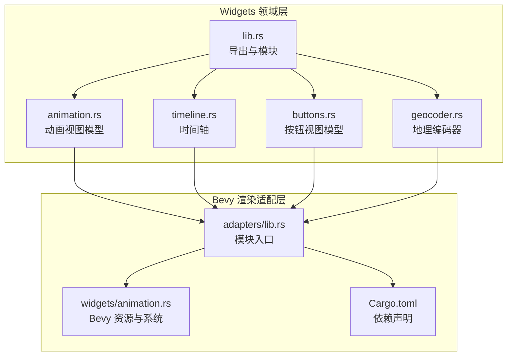
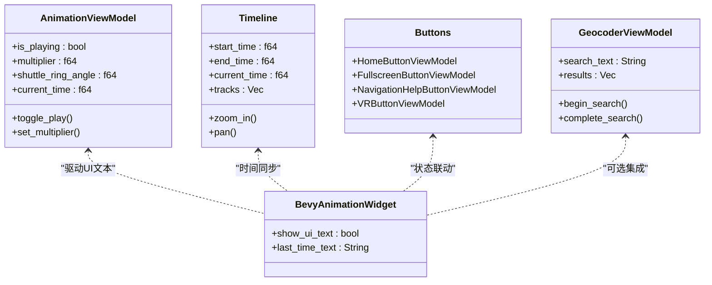
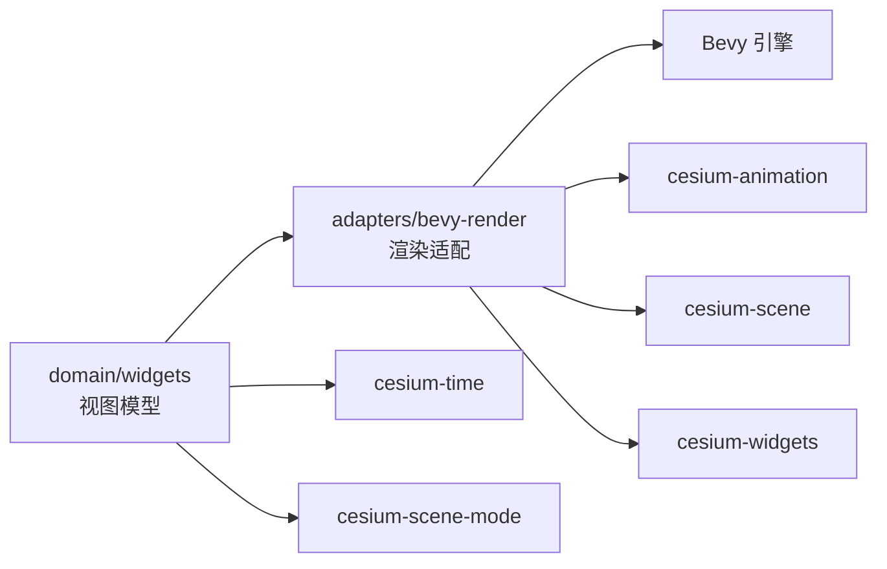

# 控件系统

<cite>
**本文引用的文件**
- [cesiumrust/domain/widgets/src/lib.rs](file://cesiumrust/domain/widgets/src/lib.rs)
- [cesiumrust/domain/widgets/src/animation.rs](file://cesiumrust/domain/widgets/src/animation.rs)
- [cesiumrust/domain/widgets/src/timeline.rs](file://cesiumrust/domain/widgets/src/timeline.rs)
- [cesiumrust/domain/widgets/src/buttons.rs](file://cesiumrust/domain/widgets/src/buttons.rs)
- [cesiumrust/domain/widgets/src/geocoder.rs](file://cesiumrust/domain/widgets/src/geocoder.rs)
- [cesiumrust/adapters/bevy-render/src/lib.rs](file://cesiumrust/adapters/bevy-render/src/lib.rs)
- [cesiumrust/adapters/bevy-render/Cargo.toml](file://cesiumrust/adapters/bevy-render/Cargo.toml)
- [cesiumrust/adapters/bevy-render/src/widgets/animation.rs](file://cesiumrust/adapters/bevy-render/src/widgets/animation.rs)
- [cesiumrust/docs/ARCHITECTURE.md](file://cesiumrust/docs/ARCHITECTURE.md)
</cite>

## 更新摘要
**所做更改**
- 移除了对旧版 GPUI UI 框架（按钮、输入、面板、状态栏、标签栏、标题栏等）的引用与实现说明
- 全面替换为基于 Bevy 的新 widget 体系：纯领域视图模型 + Bevy 渲染适配层
- 新增并更新了 Rust 侧 widgets crate 的组件文档（动画、时间轴、按钮、地理编码器等）
- 补充了 Bevy 渲染适配器中 widget 集成方式与依赖关系
- 修正架构图与依赖图，反映新的分层与模块边界

## 目录
1. [简介](#简介)
2. [项目结构](#项目结构)
3. [核心组件](#核心组件)
4. [架构总览](#架构总览)
5. [详细组件分析](#详细组件分析)
6. [Bevy Widget 系统集成](#bevy-widget-系统集成)
7. [依赖关系分析](#依赖关系分析)
8. [性能考量](#性能考量)
9. [故障排查指南](#故障排查指南)
10. [结论](#结论)
11. [附录](#附录)

## 简介
本技术文档聚焦 CesiumRust 的控件系统，围绕基于 Bevy 的新 widget 体系展开。该体系将“纯领域视图模型”与“Bevy 渲染适配”解耦：widgets crate 提供与 CesiumJS 对齐的视图模型（如动画、时间轴、场景模式选择器、投影选择器、底图选择器、地理编码器、按钮与信息框等），而 bevy-render 适配器负责将这些视图模型映射到 Bevy 实体、资源与系统中，完成渲染与交互。

**变更要点**
- 完全移除 GPUI UI 框架相关组件与概念
- 采用 ECS 驱动的 Bevy 渲染管线，widget 通过 Resource/System 参与帧循环
- 保持与 CesiumJS 行为一致的视图模型接口，便于跨栈迁移与对照

## 项目结构
CesiumRust 的控件系统位于 cesiumrust/domain/widgets 与 cesiumrust/adapters/bevy-render 两个层次：
- domain/widgets：纯 Rust 视图模型，无 UI 框架依赖，定义控件状态与行为
- adapters/bevy-render：Bevy 渲染适配层，将视图模型转换为 Bevy 实体、资源与系统，驱动实际渲染与交互

图表来源
- [cesiumrust/domain/widgets/src/lib.rs](file://cesiumrust/domain/widgets/src/lib.rs)
- [cesiumrust/adapters/bevy-render/src/lib.rs](file://cesiumrust/adapters/bevy-render/src/lib.rs)
- [cesiumrust/adapters/bevy-render/Cargo.toml](file://cesiumrust/adapters/bevy-render/Cargo.toml)
- [cesiumrust/adapters/bevy-render/src/widgets/animation.rs](file://cesiumrust/adapters/bevy-render/src/widgets/animation.rs)

章节来源
- [cesiumrust/domain/widgets/src/lib.rs](file://cesiumrust/domain/widgets/src/lib.rs)
- [cesiumrust/adapters/bevy-render/Cargo.toml](file://cesiumrust/adapters/bevy-render/Cargo.toml)

## 核心组件
- 视图模型（View Models）
  - 以 structs 表达控件状态与行为，不依赖具体 UI 框架
  - 提供设置、查询、格式化等稳定 API，便于测试与复用
  - 与 CesiumJS 的 ViewModel 概念一一对应，便于移植与对照
- 渲染适配（Bevy Adapter）
  - 将视图模型映射为 Bevy 资源（Resource）、组件（Component）与系统（System）
  - 在帧循环中读取视图模型状态，生成绘制命令或 UI 文本
  - 处理键盘/鼠标事件，更新视图模型状态，形成闭环

**新增内容**
- 新体系彻底去除了 GPUI 的按钮、输入、面板、状态栏、标签栏、标题栏等组件
- 所有 UI 能力由 widgets 领域的视图模型 + bevy-render 的适配系统共同实现

章节来源
- [cesiumrust/domain/widgets/src/lib.rs](file://cesiumrust/domain/widgets/src/lib.rs)
- [cesiumrust/adapters/bevy-render/src/lib.rs](file://cesiumrust/adapters/bevy-render/src/lib.rs)

## 架构总览
下图展示了从“领域视图模型”到“Bevy 渲染”的分层关系：widgets crate 定义控件状态与行为；bevy-render 将其转化为可渲染的实体与系统，并在帧循环中驱动更新。

图表来源
- [cesiumrust/domain/widgets/src/animation.rs](file://cesiumrust/domain/widgets/src/animation.rs)
- [cesiumrust/domain/widgets/src/timeline.rs](file://cesiumrust/domain/widgets/src/timeline.rs)
- [cesiumrust/domain/widgets/src/buttons.rs](file://cesiumrust/domain/widgets/src/buttons.rs)
- [cesiumrust/domain/widgets/src/geocoder.rs](file://cesiumrust/domain/widgets/src/geocoder.rs)
- [cesiumrust/adapters/bevy-render/src/widgets/animation.rs](file://cesiumrust/adapters/bevy-render/src/widgets/animation.rs)

## 详细组件分析

### 动画视图模型（AnimationViewModel）
- 功能特性
  - 播放/暂停/反向播放/正向播放控制
  - 速度倍率与拨盘角度互转（线性与对数区间）
  - 系统时钟模式切换，拨盘固定于实时角度
  - 时间格式化（日期与时段字符串）
- 关键算法
  - 拨盘角度到倍率的映射：[-MAX, MAX] 角度范围，中心 [-REALTIME, REALTIME] 线性区，外部对数区
  - 倍率到角度的反算：考虑系统时钟模式与最大倍率限制
- 使用建议
  - 在 Bevy 系统中订阅时钟变化，调用 update_time 刷新 current_time
  - 将 multiplier_string/format_date/format_time 用于 UI 文本显示

章节来源
- [cesiumrust/domain/widgets/src/animation.rs](file://cesiumrust/domain/widgets/src/animation.rs)

### 时间轴（Timeline）
- 功能特性
  - 可视时间范围管理（start/end/current）
  - 轨道（Tracks）与高亮范围（Highlights）
  - 缩放（zoom_in/out）与平移（pan）
  - 刻度尺（TicScale）自动选择与标签格式化
- 数据绑定
  - 与 AnimationViewModel 的时间系统联动，保证当前时间一致
  - 支持多轨道叠加，便于展示不同数据源的时间线
- 性能优化
  - 仅计算可见范围内的刻度与轨道片段
  - 增量更新 highlight_ranges，避免全量重绘

章节来源
- [cesiumrust/domain/widgets/src/timeline.rs](file://cesiumrust/domain/widgets/src/timeline.rs)

### 按钮视图模型（Buttons）
- 功能特性
  - 通用 ToggleButtonViewModel（开关态、启用态、提示文本）
  - HomeButtonViewModel（复位相机至默认视角）
  - FullscreenButtonViewModel（全屏切换，支持不支持检测）
  - NavigationHelpButtonViewModel（帮助面板显隐、鼠标/触摸提示切换）
  - VRButtonViewModel（VR 模式切换，设备支持检测）
- 交互流程
  - 点击触发状态切换，更新 tooltip 与可见性
  - 根据设备能力禁用不可用选项（如 VR/全屏）

章节来源
- [cesiumrust/domain/widgets/src/buttons.rs](file://cesiumrust/domain/widgets/src/buttons.rs)

### 地理编码器（GeocoderViewModel）
- 功能特性
  - 输入搜索文本，最小字符阈值触发搜索
  - 搜索结果列表与选中项导航（上下选择、激活跳转）
  - 结果面板显隐控制
- 网络与缓存
  - 视图模型不包含网络请求细节，交由上层提供者实现
  - 支持清空搜索、隐藏结果、重置选中项
- 结果类型
  - 点目标（经度、纬度、可选高度）
  - 矩形区域（经纬度包围盒）

章节来源
- [cesiumrust/domain/widgets/src/geocoder.rs](file://cesiumrust/domain/widgets/src/geocoder.rs)

### 其他组件（场景模式/投影/底图/信息框/选择指示器）
- 场景模式选择器（SceneModePickerViewModel）
  - 切换 3D/2D/CV 模式，广播模式变更
- 投影选择器（ProjectionPickerViewModel）
  - 切换地图投影，受场景约束动态启用/禁用
- 底图选择器（BaseLayerPickerViewModel）
  - 多种底图源管理与预览缩略图
- 信息框（InfoBoxViewModel）
  - 展示选中要素详情，支持富文本与链接
- 选择指示器（SelectionIndicatorViewModel）
  - 绘制选择框或高亮标记，反馈用户选择

章节来源
- [cesiumrust/domain/widgets/src/lib.rs](file://cesiumrust/domain/widgets/src/lib.rs)

## Bevy Widget 系统集成
- 资源与系统
  - 将视图模型状态映射为 Bevy 资源（如 AnimationWidget），在系统中读取并更新 UI 文本或绘制元素
  - 通过 System 订阅键盘/鼠标事件，驱动视图模型状态变更
- 示例：动画控件
  - 空格/P 键播放/暂停，Esc 停止，左右方向键步进时间
  - 读取 AnimationClock 与 Time 资源，更新 UI 文本
- 依赖关系
  - bevy-render 通过 Cargo.toml 引入 cesium-widgets 及其他领域 crate
  - 渲染管线将领域数据转换为 Bevy Mesh/Texture/Entity

章节来源
- [cesiumrust/adapters/bevy-render/src/widgets/animation.rs](file://cesiumrust/adapters/bevy-render/src/widgets/animation.rs)
- [cesiumrust/adapters/bevy-render/Cargo.toml](file://cesiumrust/adapters/bevy-render/Cargo.toml)
- [cesiumrust/adapters/bevy-render/src/lib.rs](file://cesiumrust/adapters/bevy-render/src/lib.rs)

## 依赖关系分析
- 领域层（widgets crate）
  - 纯 Rust 视图模型，依赖 glam、serde、cesium-time、cesium-scene-mode 等基础库
- 适配层（bevy-render）
  - 依赖 bevy、glam 以及多个领域 crate（scene、time、animation、widgets 等）
  - 通过 Resource/System 将视图模型状态注入渲染管线
- 模块入口
  - lib.rs 统一导出 widgets 模块，供应用与其他适配器使用

图表来源
- [cesiumrust/domain/widgets/src/lib.rs](file://cesiumrust/domain/widgets/src/lib.rs)
- [cesiumrust/adapters/bevy-render/Cargo.toml](file://cesiumrust/adapters/bevy-render/Cargo.toml)
- [cesiumrust/adapters/bevy-render/src/lib.rs](file://cesiumrust/adapters/bevy-render/src/lib.rs)

章节来源
- [cesiumrust/adapters/bevy-render/Cargo.toml](file://cesiumrust/adapters/bevy-render/Cargo.toml)

## 性能考量
- 延迟初始化：仅在需要时创建视图模型实例与 Bevy 资源
- 事件节流：对频繁事件（拖拽、缩放）进行节流，避免过度更新
- 虚拟化渲染：时间轴等大数据量控件仅渲染可视区域
- 资源懒加载：底图缩略图等按需加载并结合缓存策略
- 销毁清理：确保在系统退出或组件销毁时释放资源，避免内存泄漏
- 精度边界：领域层使用 f64，GPU 边界转换到 f32，减少精度损失

**新增内容**
- 基于 Bevy 的 ECS 调度，系统级更新更高效
- 视图模型与渲染分离，便于单元测试与性能剖析

[本节为通用指导，不直接分析具体文件]

## 故障排查指南
- 控件未显示
  - 检查容器是否存在且可见
  - 确认 show/hide 状态是否正确设置
- 事件无响应
  - 验证事件处理器是否已注册
  - 检查是否在销毁后仍尝试触发事件
- 样式异常
  - 确认 CSS/主题优先级未被覆盖
  - 检查 className 与变量是否匹配
- 内存泄漏
  - 确保在 destroy 中清理监听与定时器
  - 避免回调中保留大对象引用
- Bevy 集成问题
  - 检查 Resource/System 是否正确注册
  - 确认键盘/鼠标事件通道正常

**新增内容**
- WASM/WebGPU 环境下的兼容性问题需关注浏览器支持与权限配置
- 若使用 VR/全屏等功能，需检测设备能力并降级处理

章节来源
- [cesiumrust/adapters/bevy-render/src/widgets/animation.rs](file://cesiumrust/adapters/bevy-render/src/widgets/animation.rs)

## 结论
CesiumRust 的控件系统以“纯领域视图模型 + Bevy 渲染适配”为核心，实现了高内聚、低耦合的 UI 组件生态。通过 widgets crate 提供的稳定 API 与 bevy-render 的高效渲染管线，开发者可以快速构建高性能、易维护的地图应用界面。相比旧版 GPUI 方案，新体系更贴近现代游戏引擎范式，具备更好的可扩展性与平台兼容性。

**新增内容**
- 新体系彻底移除了 GPUI 相关组件，全面转向 Bevy 生态
- 通过 ECS 与资源系统，提升了 UI 更新效率与可测试性

[本节为总结性内容，不直接分析具体文件]

## 附录

### 开发流程与扩展点
- 新建控件步骤
  - 在 widgets crate 中定义视图模型 struct 与行为方法
  - 在 bevy-render 中创建对应的 Resource/System，驱动渲染与交互
  - 在应用中组合多个控件，统一管理生命周期
- 扩展点
  - 通过视图模型暴露状态与行为，便于测试与复用
  - 通过 Bevy 系统接入事件总线，实现复杂交互逻辑
  - 通过 Resource 共享全局状态（如时间、相机、图层）

**新增内容**
- 遵循“领域模型与渲染解耦”的原则，优先在 widgets crate 中实现业务逻辑
- 在 bevy-render 中专注渲染与事件桥接，保持职责清晰

章节来源
- [cesiumrust/domain/widgets/src/lib.rs](file://cesiumrust/domain/widgets/src/lib.rs)
- [cesiumrust/adapters/bevy-render/src/lib.rs](file://cesiumrust/adapters/bevy-render/src/lib.rs)

### 完整代码示例路径
- 动画控件
  - [cesiumrust/domain/widgets/src/animation.rs](file://cesiumrust/domain/widgets/src/animation.rs)
  - [cesiumrust/adapters/bevy-render/src/widgets/animation.rs](file://cesiumrust/adapters/bevy-render/src/widgets/animation.rs)
- 时间轴控件
  - [cesiumrust/domain/widgets/src/timeline.rs](file://cesiumrust/domain/widgets/src/timeline.rs)
- 按钮控件
  - [cesiumrust/domain/widgets/src/buttons.rs](file://cesiumrust/domain/widgets/src/buttons.rs)
- 地理编码器
  - [cesiumrust/domain/widgets/src/geocoder.rs](file://cesiumrust/domain/widgets/src/geocoder.rs)
- 模块入口与依赖
  - [cesiumrust/domain/widgets/src/lib.rs](file://cesiumrust/domain/widgets/src/lib.rs)
  - [cesiumrust/adapters/bevy-render/Cargo.toml](file://cesiumrust/adapters/bevy-render/Cargo.toml)

### 响应式设计与移动端适配最佳实践
- 使用相对单位与媒体查询，确保控件在不同屏幕尺寸下自适应
- 针对触摸设备优化事件处理，避免误触与延迟
- 在小屏幕上折叠次要控件，优先展示核心功能
- 利用 Bevy 的窗口大小变化事件重新计算布局

**新增内容**
- 基于 Bevy 的布局引擎，支持灵活的响应式布局
- 跨平台适配，自动处理不同设备的交互差异
- 性能优化的渲染管线，确保移动端的流畅体验

[本节为通用指导，不直接分析具体文件]

### 架构参考
- 整体架构决策与权衡（ECS、wgpu、f64→f32 精度边界等）
- 运行与测试指引、预期行为与控制方式

章节来源
- [cesiumrust/docs/ARCHITECTURE.md](file://cesiumrust/docs/ARCHITECTURE.md)