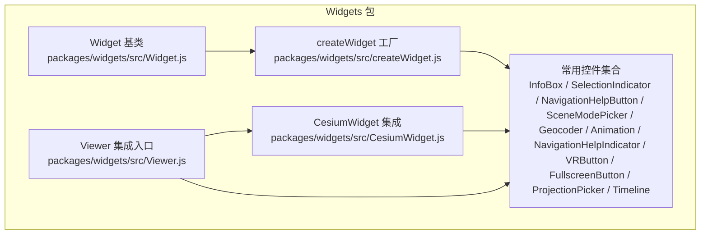
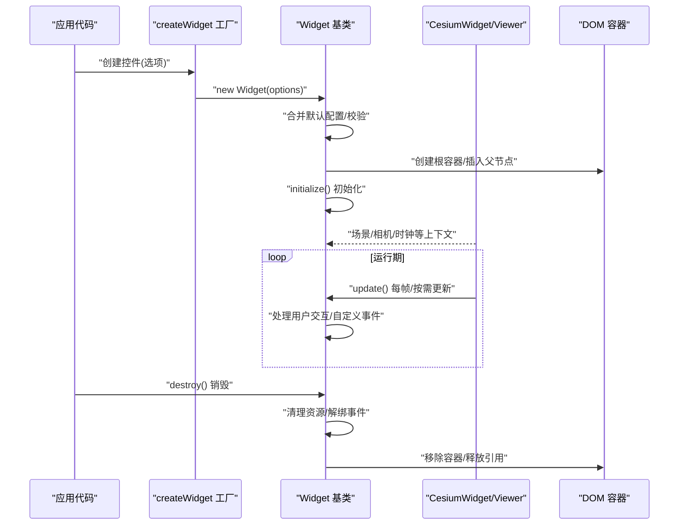
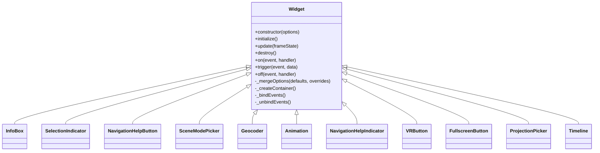
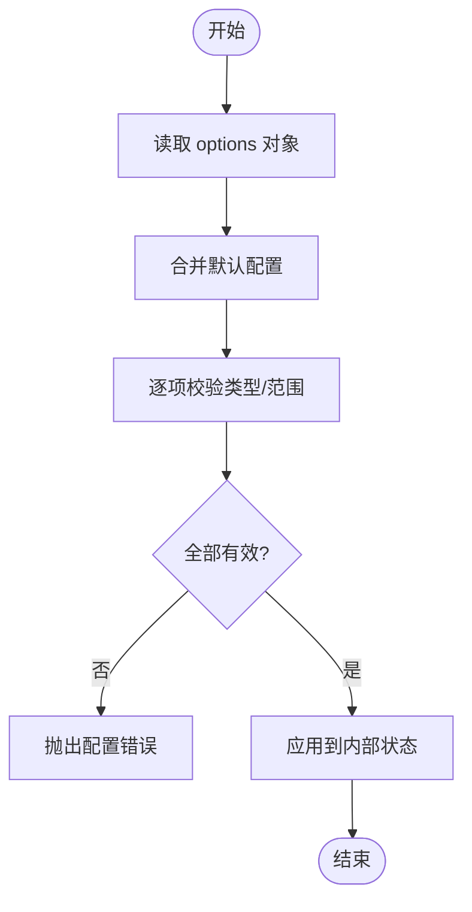
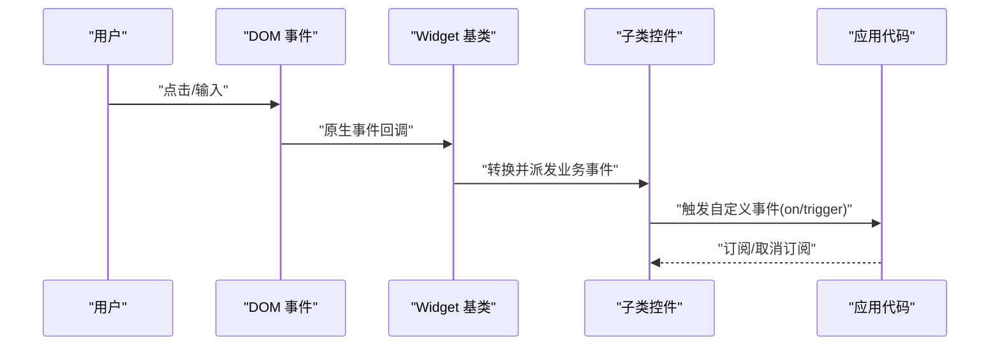
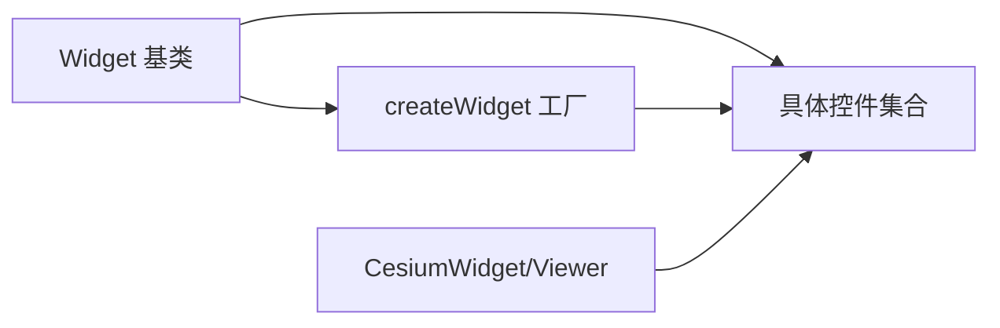

# 控件开发基础

<cite>
**本文引用的文件**   
- [packages/widgets/src/Widget.js](file://packages/widgets/src/Widget.js)
- [packages/widgets/src/createWidget.js](file://packages/widgets/src/createWidget.js)
- [packages/widgets/src/CesiumWidget.js](file://packages/widgets/src/CesiumWidget.js)
- [packages/widgets/src/InfoBox.js](file://packages/widgets/src/InfoBox.js)
- [packages/widgets/src/SelectionIndicator.js](file://packages/widgets/src/SelectionIndicator.js)
- [packages/widgets/src/NavigationHelpButton.js](file://packages/widgets/src/NavigationHelpButton.js)
- [packages/widgets/src/SceneModePicker.js](file://packages/widgets/src/SceneModePicker.js)
- [packages/widgets/src/Geocoder.js](file://packages/widgets/src/Geocoder.js)
- [packages/widgets/src/Animation.js](file://packages/widgets/src/Animation.js)
- [packages/widgets/src/NavigationHelpIndicator.js](file://packages/widgets/src/NavigationHelpIndicator.js)
- [packages/widgets/src/VRButton.js](file://packages/widgets/src/VRButton.js)
- [packages/widgets/src/FullscreenButton.js](file://packages/widgets/src/FullscreenButton.js)
- [packages/widgets/src/ProjectionPicker.js](file://packages/widgets/src/ProjectionPicker.js)
- [packages/widgets/src/Timeline.js](file://packages/widgets/src/Timeline.js)
- [packages/widgets/src/Viewer.js](file://packages/widgets/src/Viewer.js)
</cite>

## 目录
1. [简介](#简介)
2. [项目结构](#项目结构)
3. [核心组件](#核心组件)
4. [架构总览](#架构总览)
5. [详细组件分析](#详细组件分析)
6. [依赖关系分析](#依赖关系分析)
7. [性能考虑](#性能考虑)
8. [故障排查指南](#故障排查指南)
9. [结论](#结论)
10. [附录](#附录)

## 简介
本文件面向希望基于 CesiumJS Widgets 包进行控件开发的工程师，系统讲解 Widget 基类的继承与扩展机制、构造函数参数处理、DOM 元素创建与管理、生命周期方法（initialize、update、destroy）的实现规范、事件处理系统（用户交互绑定与自定义事件触发）、配置系统（options 对象、属性验证与默认值），并提供从简单按钮到复杂交互控件的完整开发路径与最佳实践。

## 项目结构
Widgets 包采用“基类 + 工厂 + 具体控件”的分层组织方式：
- 基类定义：提供统一的构造、配置合并、DOM 容器管理、生命周期钩子与事件分发能力。
- 工厂函数：封装常见控件的创建流程，统一挂载位置与默认选项。
- 具体控件：实现业务逻辑与 UI 渲染，遵循基类约定。



图表来源
- [packages/widgets/src/Widget.js](file://packages/widgets/src/Widget.js)
- [packages/widgets/src/createWidget.js](file://packages/widgets/src/createWidget.js)
- [packages/widgets/src/CesiumWidget.js](file://packages/widgets/src/CesiumWidget.js)
- [packages/widgets/src/Viewer.js](file://packages/widgets/src/Viewer.js)

章节来源
- [packages/widgets/src/Widget.js](file://packages/widgets/src/Widget.js)
- [packages/widgets/src/createWidget.js](file://packages/widgets/src/createWidget.js)
- [packages/widgets/src/CesiumWidget.js](file://packages/widgets/src/CesiumWidget.js)
- [packages/widgets/src/Viewer.js](file://packages/widgets/src/Viewer.js)

## 核心组件
本节聚焦 Widget 基类及其相关工具，解释其职责边界与扩展点。

- Widget 基类
  - 负责：
    - 构造阶段：接收 options，合并默认配置，初始化内部状态。
    - DOM 管理：创建根容器、插入到指定父节点、维护可见性与层级。
    - 生命周期：提供 initialize、update、destroy 等钩子，供子类覆盖。
    - 事件系统：提供事件注册、触发与销毁的统一接口。
    - 配置系统：提供 options 校验与默认值填充的基础能力。
  - 典型用法：
    - 子类通过继承基类，重写生命周期方法并调用 super 完成通用逻辑。
    - 在 initialize 中完成一次性资源准备；在 update 中执行每帧或按需更新；在 destroy 中释放资源与解绑事件。

- createWidget 工厂
  - 负责：
    - 统一创建流程：实例化控件、设置默认样式、挂载到场景或 Viewer 的特定区域。
    - 简化调用：将复杂的构造参数与挂载逻辑封装为简洁 API。
  - 适用场景：
    - 快速构建标准控件（如导航帮助、模式切换、时间轴等）。

- CesiumWidget 集成
  - 负责：
    - 将控件与底层 Cesium 场景/相机/时钟等运行时对象关联。
    - 提供场景级事件（如鼠标、键盘、窗口尺寸变化）的桥接。

- Viewer 集成入口
  - 负责：
    - 暴露高层 API，自动注入常用控件到界面布局。
    - 统一管理控件的生命周期与配置。

章节来源
- [packages/widgets/src/Widget.js](file://packages/widgets/src/Widget.js)
- [packages/widgets/src/createWidget.js](file://packages/widgets/src/createWidget.js)
- [packages/widgets/src/CesiumWidget.js](file://packages/widgets/src/CesiumWidget.js)
- [packages/widgets/src/Viewer.js](file://packages/widgets/src/Viewer.js)

## 架构总览
下图展示控件从创建到销毁的整体流程，以及各组件之间的协作关系。



图表来源
- [packages/widgets/src/Widget.js](file://packages/widgets/src/Widget.js)
- [packages/widgets/src/createWidget.js](file://packages/widgets/src/createWidget.js)
- [packages/widgets/src/CesiumWidget.js](file://packages/widgets/src/CesiumWidget.js)
- [packages/widgets/src/Viewer.js](file://packages/widgets/src/Viewer.js)

## 详细组件分析

### Widget 基类分析与扩展指南
- 类结构与职责
  - 构造器：解析 options，合并默认值，建立内部状态与 DOM 容器。
  - 生命周期：
    - initialize：一次性的初始化逻辑（如加载资源、注册事件）。
    - update：每帧或按需执行的更新逻辑（如根据场景状态刷新 UI）。
    - destroy：释放资源、移除事件监听、清理 DOM 引用。
  - 事件系统：提供事件注册、触发、销毁的统一接口，支持自定义事件。
  - 配置系统：提供 options 校验与默认值填充的基础能力，便于子类扩展。
- 继承与扩展要点
  - 子类应优先在 initialize 中完成一次性工作，避免在构造器中进行重计算。
  - 在 update 中仅做轻量更新，避免阻塞主线程。
  - 在 destroy 中确保所有外部资源与事件被正确释放，防止内存泄漏。
  - 使用工厂 createWidget 可简化挂载与默认样式设置。



图表来源
- [packages/widgets/src/Widget.js](file://packages/widgets/src/Widget.js)
- [packages/widgets/src/InfoBox.js](file://packages/widgets/src/InfoBox.js)
- [packages/widgets/src/SelectionIndicator.js](file://packages/widgets/src/SelectionIndicator.js)
- [packages/widgets/src/NavigationHelpButton.js](file://packages/widgets/src/NavigationHelpButton.js)
- [packages/widgets/src/SceneModePicker.js](file://packages/widgets/src/SceneModePicker.js)
- [packages/widgets/src/Geocoder.js](file://packages/widgets/src/Geocoder.js)
- [packages/widgets/src/Animation.js](file://packages/widgets/src/Animation.js)
- [packages/widgets/src/NavigationHelpIndicator.js](file://packages/widgets/src/NavigationHelpIndicator.js)
- [packages/widgets/src/VRButton.js](file://packages/widgets/src/VRButton.js)
- [packages/widgets/src/FullscreenButton.js](file://packages/widgets/src/FullscreenButton.js)
- [packages/widgets/src/ProjectionPicker.js](file://packages/widgets/src/ProjectionPicker.js)
- [packages/widgets/src/Timeline.js](file://packages/widgets/src/Timeline.js)

章节来源
- [packages/widgets/src/Widget.js](file://packages/widgets/src/Widget.js)

### 配置系统与选项处理
- 设计目标
  - 通过 options 对象声明式地配置控件行为与外观。
  - 提供默认值与类型校验，保证健壮性。
- 推荐做法
  - 在子类中定义 defaults 与 validators，由基类或工厂统一合并与校验。
  - 对关键选项（如 DOM 父节点、可见性、主题）提供强约束与清晰错误提示。
  - 避免在构造器中执行 I/O 或昂贵计算，延迟到 initialize。



图表来源
- [packages/widgets/src/Widget.js](file://packages/widgets/src/Widget.js)
- [packages/widgets/src/createWidget.js](file://packages/widgets/src/createWidget.js)

章节来源
- [packages/widgets/src/Widget.js](file://packages/widgets/src/Widget.js)
- [packages/widgets/src/createWidget.js](file://packages/widgets/src/createWidget.js)

### 生命周期方法与 DOM 管理
- 生命周期顺序
  - 构造器：解析选项、创建 DOM 容器、保存引用。
  - initialize：注册事件、加载资源、建立与场景/相机的关联。
  - update：每帧或按需更新 UI 与状态。
  - destroy：解绑事件、释放资源、移除 DOM 引用。
- DOM 管理要点
  - 根容器创建与插入应在构造器或 initialize 早期完成。
  - 保持对容器的弱引用，避免循环引用导致 GC 失败。
  - 在 destroy 中显式移除容器与事件监听。

```mermaid
sequenceDiagram
participant Ctor as "构造器"
participant Init as "initialize"
participant Update as "update"
participant Destroy as "destroy"
Ctor->>Ctor : "创建根容器/插入父节点"
Ctor->>Init : "调用 initialize()"
Init->>Init : "注册事件/加载资源"
loop 运行期
Update->>Update : "按帧/按需更新 UI"
end
Destroy->>Destroy : "解绑事件/释放资源"
Destroy->>Destroy : "移除容器/清理引用"
```

图表来源
- [packages/widgets/src/Widget.js](file://packages/widgets/src/Widget.js)

章节来源
- [packages/widgets/src/Widget.js](file://packages/widgets/src/Widget.js)

### 事件处理系统
- 用户交互事件
  - 在 initialize 中绑定 DOM 事件（点击、悬停、输入等）。
  - 将原生事件转换为控件语义事件，便于上层订阅。
- 自定义事件
  - 提供 on/trigger/off 接口，允许控件对外发布业务事件。
  - 在 destroy 中统一解绑，避免内存泄漏。
- 与场景事件的桥接
  - 通过 CesiumWidget/Viewer 将场景事件（如拾取、相机移动）转发到控件。



图表来源
- [packages/widgets/src/Widget.js](file://packages/widgets/src/Widget.js)

章节来源
- [packages/widgets/src/Widget.js](file://packages/widgets/src/Widget.js)

### 从简单按钮到复杂交互控件的开发示例
- 简单按钮
  - 步骤：
    - 继承 Widget 基类，重写 initialize 以创建按钮 DOM 与绑定点击事件。
    - 在 update 中根据状态切换样式。
    - 在 destroy 中解绑事件与移除 DOM 引用。
    - 使用 createWidget 工厂快速挂载到 Viewer 或 CesiumWidget。
- 复杂交互控件（例如带搜索与结果列表的地理编码器）
  - 步骤：
    - 在 initialize 中创建输入框、结果列表容器与加载指示器。
    - 绑定输入防抖、键盘导航、点击选择等交互。
    - 在 update 中根据场景状态（如缩放级别）调整显示策略。
    - 在 destroy 中清理定时器、网络请求与事件监听。
    - 通过自定义事件向应用层反馈搜索结果与选中项。

章节来源
- [packages/widgets/src/Geocoder.js](file://packages/widgets/src/Geocoder.js)
- [packages/widgets/src/NavigationHelpButton.js](file://packages/widgets/src/NavigationHelpButton.js)
- [packages/widgets/src/SceneModePicker.js](file://packages/widgets/src/SceneModePicker.js)
- [packages/widgets/src/Animation.js](file://packages/widgets/src/Animation.js)
- [packages/widgets/src/Timeline.js](file://packages/widgets/src/Timeline.js)
- [packages/widgets/src/createWidget.js](file://packages/widgets/src/createWidget.js)

### 常用控件概览
- InfoBox：信息面板，用于展示选中对象的详情。
- SelectionIndicator：选择指示器，高亮当前选中项。
- NavigationHelpButton：导航帮助按钮，引导用户使用鼠标/触摸操作。
- SceneModePicker：场景模式切换（3D/2D/Columbus View）。
- Geocoder：地理编码搜索，支持输入建议与结果定位。
- Animation：动画控制面板，控制播放、暂停、速度。
- NavigationHelpIndicator：导航帮助指示器，动态提示操作。
- VRButton：进入/退出 VR 模式的开关。
- FullscreenButton：全屏切换按钮。
- ProjectionPicker：投影方式切换（WGS84/Web Mercator）。
- Timeline：时间轴控件，支持拖拽与时间步进。

章节来源
- [packages/widgets/src/InfoBox.js](file://packages/widgets/src/InfoBox.js)
- [packages/widgets/src/SelectionIndicator.js](file://packages/widgets/src/SelectionIndicator.js)
- [packages/widgets/src/NavigationHelpButton.js](file://packages/widgets/src/NavigationHelpButton.js)
- [packages/widgets/src/SceneModePicker.js](file://packages/widgets/src/SceneModePicker.js)
- [packages/widgets/src/Geocoder.js](file://packages/widgets/src/Geocoder.js)
- [packages/widgets/src/Animation.js](file://packages/widgets/src/Animation.js)
- [packages/widgets/src/NavigationHelpIndicator.js](file://packages/widgets/src/NavigationHelpIndicator.js)
- [packages/widgets/src/VRButton.js](file://packages/widgets/src/VRButton.js)
- [packages/widgets/src/FullscreenButton.js](file://packages/widgets/src/FullscreenButton.js)
- [packages/widgets/src/ProjectionPicker.js](file://packages/widgets/src/ProjectionPicker.js)
- [packages/widgets/src/Timeline.js](file://packages/widgets/src/Timeline.js)

## 依赖关系分析
- 耦合与内聚
  - Widget 基类高度内聚，提供通用能力；具体控件低耦合，专注业务逻辑。
  - createWidget 作为工厂降低耦合度，屏蔽挂载细节。
- 直接/间接依赖
  - 具体控件依赖 Widget 基类与 createWidget。
  - CesiumWidget/Viewer 作为运行时上下文，被控件间接依赖。
- 外部依赖与集成点
  - DOM API：用于创建与管理 UI 元素。
  - 浏览器事件模型：用于用户交互。
  - Cesium 场景/相机/时钟：用于驱动 UI 更新与交互联动。



图表来源
- [packages/widgets/src/Widget.js](file://packages/widgets/src/Widget.js)
- [packages/widgets/src/createWidget.js](file://packages/widgets/src/createWidget.js)
- [packages/widgets/src/CesiumWidget.js](file://packages/widgets/src/CesiumWidget.js)
- [packages/widgets/src/Viewer.js](file://packages/widgets/src/Viewer.js)

章节来源
- [packages/widgets/src/Widget.js](file://packages/widgets/src/Widget.js)
- [packages/widgets/src/createWidget.js](file://packages/widgets/src/createWidget.js)
- [packages/widgets/src/CesiumWidget.js](file://packages/widgets/src/CesiumWidget.js)
- [packages/widgets/src/Viewer.js](file://packages/widgets/src/Viewer.js)

## 性能考虑
- 避免在 update 中执行重计算或频繁 DOM 操作，必要时使用节流/防抖。
- 批量更新 UI，减少重排与重绘。
- 合理缓存中间结果，避免重复计算。
- 在 destroy 中及时释放资源，防止内存泄漏。
- 使用 createWidget 工厂统一挂载，避免重复创建与样式冲突。

[本节为通用指导，不直接分析具体文件]

## 故障排查指南
- 常见问题
  - 控件未显示：检查 DOM 容器是否插入到正确的父节点，样式是否被覆盖。
  - 事件无响应：确认事件绑定是否在 initialize 中完成，destroy 后是否重新绑定。
  - 内存泄漏：检查 destroy 是否解绑所有事件与释放资源。
  - 配置错误：核对 options 的类型与取值范围，查看控制台错误信息。
- 调试技巧
  - 在 initialize/update/destroy 中添加日志输出，跟踪生命周期。
  - 使用浏览器开发者工具监控 DOM 树与事件监听器。
  - 逐步缩小问题范围，先验证最小复现用例。

章节来源
- [packages/widgets/src/Widget.js](file://packages/widgets/src/Widget.js)

## 结论
通过 Widget 基类与 createWidget 工厂，CesiumJS Widgets 提供了稳定、可扩展的控件开发框架。遵循生命周期规范、合理使用配置系统与事件机制，可以在保证性能的同时快速构建从简单按钮到复杂交互的多样化控件。结合最佳实践与故障排查方法，能够显著提升控件的可维护性与用户体验。

[本节为总结性内容，不直接分析具体文件]

## 附录
- 参考控件源码路径（用于进一步学习实现细节）
  - [packages/widgets/src/InfoBox.js](file://packages/widgets/src/InfoBox.js)
  - [packages/widgets/src/SelectionIndicator.js](file://packages/widgets/src/SelectionIndicator.js)
  - [packages/widgets/src/NavigationHelpButton.js](file://packages/widgets/src/NavigationHelpButton.js)
  - [packages/widgets/src/SceneModePicker.js](file://packages/widgets/src/SceneModePicker.js)
  - [packages/widgets/src/Geocoder.js](file://packages/widgets/src/Geocoder.js)
  - [packages/widgets/src/Animation.js](file://packages/widgets/src/Animation.js)
  - [packages/widgets/src/NavigationHelpIndicator.js](file://packages/widgets/src/NavigationHelpIndicator.js)
  - [packages/widgets/src/VRButton.js](file://packages/widgets/src/VRButton.js)
  - [packages/widgets/src/FullscreenButton.js](file://packages/widgets/src/FullscreenButton.js)
  - [packages/widgets/src/ProjectionPicker.js](file://packages/widgets/src/ProjectionPicker.js)
  - [packages/widgets/src/Timeline.js](file://packages/widgets/src/Timeline.js)
  - [packages/widgets/src/CesiumWidget.js](file://packages/widgets/src/CesiumWidget.js)
  - [packages/widgets/src/Viewer.js](file://packages/widgets/src/Viewer.js)
  - [packages/widgets/src/createWidget.js](file://packages/widgets/src/createWidget.js)
  - [packages/widgets/src/Widget.js](file://packages/widgets/src/Widget.js)