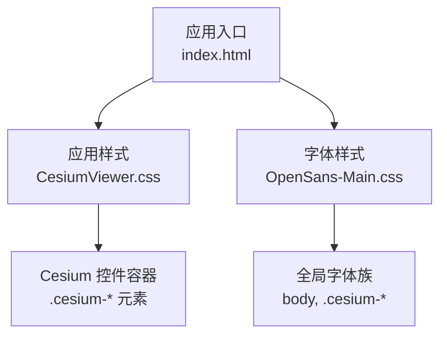
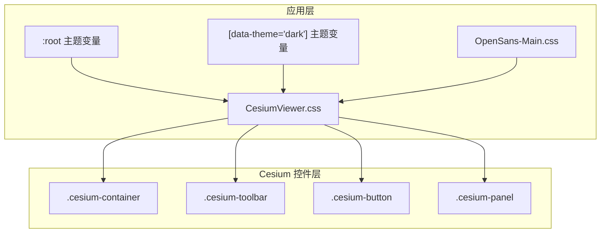
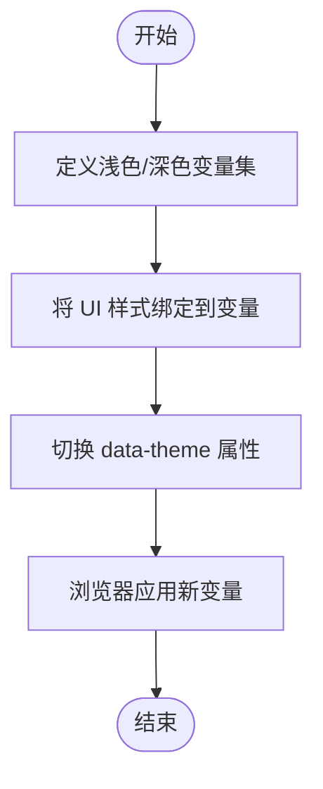
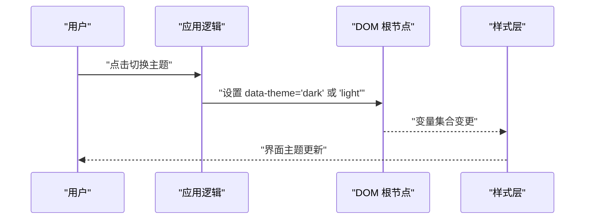
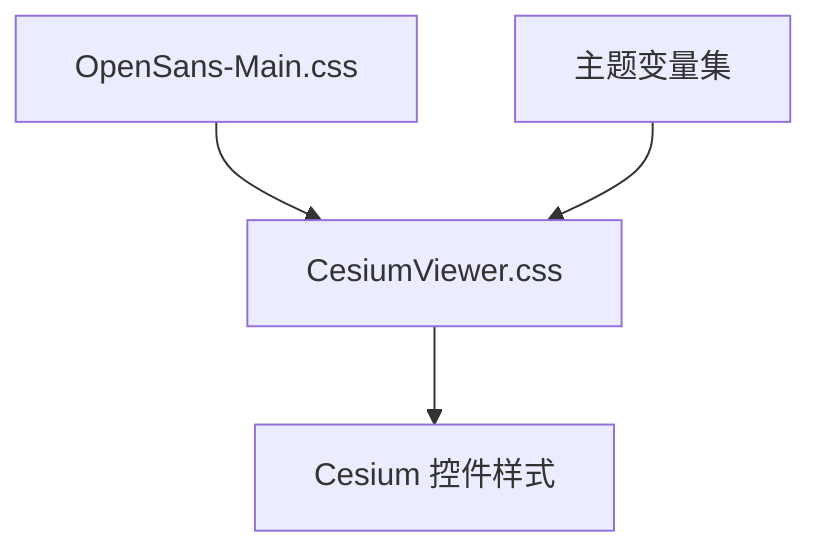

# 样式系统与主题定制

<cite>
**本文引用的文件**   
- [CesiumViewer.css](file://Apps/CesiumViewer/CesiumViewer.css)
- [OpenSans-Main.css](file://Specs/Data/Fonts/OpenSans-Main.css)
</cite>

## 目录
1. [简介](#简介)
2. [项目结构](#项目结构)
3. [核心组件](#核心组件)
4. [架构总览](#架构总览)
5. [详细组件分析](#详细组件分析)
6. [依赖分析](#依赖分析)
7. [性能考虑](#性能考虑)
8. [故障排查指南](#故障排查指南)
9. [结论](#结论)
10. [附录](#附录) 

## 简介
本指南聚焦于 Cesium 控件的样式系统与主题定制，围绕 CSS 架构、命名约定、样式组织与响应式策略展开。文档同时提供可主题化的实现思路（CSS 变量、颜色系统、字体覆盖）、布局系统（Flexbox/Grid）在控件中的应用、样式覆盖的最佳实践、暗色主题示例以及跨浏览器兼容性处理，并给出动态样式切换与运行时主题修改的技术方案。

## 项目结构
仓库中与样式和主题相关的关键位置包括：
- 应用级样式入口：位于 Apps/CesiumViewer 下的 CesiumViewer.css，用于承载应用层对 Cesium 控件的样式覆盖与主题化扩展。
- 字体资源：位于 Specs/Data/Fonts 下的 OpenSans-Main.css，作为示例字体加载与基础排版样式的参考。

图表来源
- [CesiumViewer.css](file://Apps/CesiumViewer/CesiumViewer.css)
- [OpenSans-Main.css](file://Specs/Data/Fonts/OpenSans-Main.css)

章节来源
- [CesiumViewer.css](file://Apps/CesiumViewer/CesiumViewer.css)
- [OpenSans-Main.css](file://Specs/Data/Fonts/OpenSans-Main.css)

## 核心组件
- 应用级样式层（CesiumViewer.css）
  - 职责：为 Cesium 控件提供统一的视觉风格、间距、阴影、圆角等外观定义；通过选择器优先级覆盖默认样式；集中管理主题变量与断点。
  - 建议：将主题变量集中在 :root 或特定主题类下，使用语义化变量名（如 --color-primary、--font-family-base）。
- 字体样式层（OpenSans-Main.css）
  - 职责：引入字体资源并设置基础排版属性（字重、行高、基线对齐等），确保在不同平台上的渲染一致性。
  - 建议：以 CSS 变量形式暴露字体族、字号、行高等，便于主题切换时统一替换。

章节来源
- [CesiumViewer.css](file://Apps/CesiumViewer/CesiumViewer.css)
- [OpenSans-Main.css](file://Specs/Data/Fonts/OpenSans-Main.css)

## 架构总览
下图展示了“应用样式层”如何作用于 Cesium 控件 DOM 树，并通过 CSS 变量驱动主题切换。

图表来源
- [CesiumViewer.css](file://Apps/CesiumViewer/CesiumViewer.css)
- [OpenSans-Main.css](file://Specs/Data/Fonts/OpenSans-Main.css)

## 详细组件分析

### 命名约定与样式组织结构
- 命名约定
  - 采用 BEM 或类似前缀策略，避免与 Cesium 内部类冲突。例如：app-xxx、theme-xxx。
  - 对 Cesium 原生类（如 .cesium-*）进行最小化覆盖，优先通过外层容器限定作用域。
- 样式组织结构
  - 将通用变量（颜色、字体、间距、阴影）置于顶层变量区。
  - 按功能模块拆分样式（工具栏、面板、按钮、输入框等），便于维护与复用。
  - 将响应式规则集中管理，使用媒体查询断点控制不同屏幕尺寸下的布局。

章节来源
- [CesiumViewer.css](file://Apps/CesiumViewer/CesiumViewer.css)

### 可主题化实现（CSS 变量、颜色系统、字体覆盖）
- CSS 变量
  - 在 :root 中定义浅色主题变量，在 [data-theme="dark"] 中定义深色主题变量。
  - 使用语义化变量名（如 --color-bg、--color-text、--color-accent、--radius-md、--shadow-sm）。
- 颜色系统
  - 建立主色、辅助色、中性色、状态色的层级体系，并通过变量组合出背景、边框、文本、强调等用途。
- 字体覆盖
  - 通过 CSS 变量暴露字体族、字号、行高、字重，并在主题切换时整体替换。
  - 结合 OpenSans-Main.css 的字体加载方式，确保跨平台一致性与回退字体链。

章节来源
- [CesiumViewer.css](file://Apps/CesiumViewer/CesiumViewer.css)
- [OpenSans-Main.css](file://Specs/Data/Fonts/OpenSans-Main.css)

### 布局系统（Flexbox 与 Grid）
- Flexbox
  - 适用于工具栏、按钮组、列表项等一维布局场景，提供对齐、伸缩、换行等能力。
- Grid
  - 适用于复杂二维布局（如控制面板网格、仪表盘卡片），提升布局的可维护性与可读性。
- 响应式
  - 使用媒体查询配合 Flexbox/Grid 的自适应特性，在小屏设备上自动调整列数与排列方向。

章节来源
- [CesiumViewer.css](file://Apps/CesiumViewer/CesiumViewer.css)

### 样式覆盖最佳实践
- 作用域隔离
  - 通过外层容器限定选择器范围，避免全局污染。
- 优先级控制
  - 尽量使用更具体的选择器而非 !important；必要时通过增加选择器深度提高优先级。
- 渐进增强
  - 先保证功能可用，再逐步添加动画、阴影、圆角等视觉效果。
- 兼容性与降级
  - 对不支持的新特性提供回退方案（如旧版浏览器不支持 CSS 变量时的静态值）。

章节来源
- [CesiumViewer.css](file://Apps/CesiumViewer/CesiumViewer.css)

### 暗色主题实现示例
- 主题切换机制
  - 在根节点上切换 data-theme 属性，触发对应 CSS 变量集合。
- 关键步骤
  - 定义浅色与深色两套变量集。
  - 将所有 UI 元素的颜色、背景、边框、阴影绑定到变量。
  - 在切换时仅改变变量值，无需重新计算布局。

图表来源
- [CesiumViewer.css](file://Apps/CesiumViewer/CesiumViewer.css)

章节来源
- [CesiumViewer.css](file://Apps/CesiumViewer/CesiumViewer.css)

### 跨浏览器兼容性处理
- CSS 变量支持
  - 针对不支持 CSS 变量的环境，提供静态回退值或使用构建期注入。
- 现代布局特性
  - 对 Flexbox/Grid 的旧版本语法进行必要兼容（如 vendor prefix 或降级为传统布局）。
- 字体加载
  - 使用 @font-face 并确保多格式字体与回退字体链，保障渲染一致性。

章节来源
- [OpenSans-Main.css](file://Specs/Data/Fonts/OpenSans-Main.css)

### 动态样式切换与运行时主题修改
- 基于 CSS 变量的运行时切换
  - 通过 JavaScript 切换根节点的 data-theme 属性，实现即时主题切换。
- 基于样式表的动态注入
  - 在运行时插入或移除主题样式表，适合需要大量样式差异的场景。
- 局部主题
  - 在特定容器内定义独立变量集，实现局部主题（如某个面板的深色模式）。

图表来源
- [CesiumViewer.css](file://Apps/CesiumViewer/CesiumViewer.css)

章节来源
- [CesiumViewer.css](file://Apps/CesiumViewer/CesiumViewer.css)

## 依赖分析
- 样式依赖关系
  - 应用样式层依赖字体样式层，共同作用于 Cesium 控件 DOM。
  - 主题变量被多处 UI 组件引用，形成松耦合的主题驱动架构。
- 外部依赖
  - 字体资源由 OpenSans-Main.css 引入，影响全局排版。
  - 浏览器对 CSS 变量、Flexbox、Grid 的支持程度决定是否需要兼容层。

图表来源
- [CesiumViewer.css](file://Apps/CesiumViewer/CesiumViewer.css)
- [OpenSans-Main.css](file://Specs/Data/Fonts/OpenSans-Main.css)

章节来源
- [CesiumViewer.css](file://Apps/CesiumViewer/CesiumViewer.css)
- [OpenSans-Main.css](file://Specs/Data/Fonts/OpenSans-Main.css)

## 性能考虑
- 减少重排重绘
  - 主题切换仅改变 CSS 变量，避免大规模 DOM 操作。
- 样式体积优化
  - 按需加载主题样式，避免一次性引入过多未使用的规则。
- 字体加载优化
  - 使用预加载与子集字体，减少首屏阻塞时间。

## 故障排查指南
- 主题未生效
  - 检查 data-theme 是否正确设置；确认变量定义与作用域是否匹配。
- 样式覆盖无效
  - 检查选择器优先级与作用域；避免被更高优先级规则覆盖。
- 字体显示异常
  - 确认字体资源路径与 MIME 类型；检查回退字体链是否合理。
- 布局错乱
  - 检查 Flexbox/Grid 的兼容性；在旧浏览器中使用降级布局。

章节来源
- [CesiumViewer.css](file://Apps/CesiumViewer/CesiumViewer.css)
- [OpenSans-Main.css](file://Specs/Data/Fonts/OpenSans-Main.css)

## 结论
通过以 CSS 变量为核心的主题架构、清晰的命名约定与模块化样式组织，可以在不破坏原有功能的前提下实现对 Cesium 控件的外观定制与主题切换。结合 Flexbox/Grid 的布局能力与响应式设计策略，能够构建出适配多设备、多主题的现代化控件界面。运行时主题切换与跨浏览器兼容处理进一步提升了用户体验与可维护性。

## 附录
- 推荐实践清单
  - 使用语义化 CSS 变量管理主题。
  - 通过外层容器限定样式作用域。
  - 将响应式规则集中管理并使用断点控制。
  - 在运行时通过切换 data-theme 实现主题切换。
  - 为不支持的特性提供回退方案。